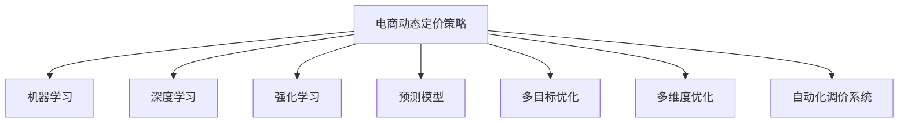

                 

# AI驱动的电商动态定价策略优化

## 1. 背景介绍

### 1.1 问题由来
随着电商市场的竞争日益激烈，价格已经成为商家争夺市场份额的重要手段。然而，制定有效的动态定价策略并非易事。传统的定价方式依赖人工经验，难以应对市场动态变化。因此，如何利用人工智能技术，实时优化电商定价策略，已成为电商企业亟待解决的问题。

### 1.2 问题核心关键点
动态定价策略的核心在于根据市场变化实时调整价格，最大化销售收益。核心关键点包括：
- 实时数据采集与分析：利用爬虫、传感器等技术采集实时市场数据，如用户行为、竞争对手价格、库存量等。
- 需求预测：通过机器学习模型预测用户需求变化，作为定价的依据。
- 动态定价模型：构建基于AI的动态定价模型，根据市场数据和需求预测结果实时调整商品价格。
- 多维度优化：考虑销量、利润、库存等综合因素，实现多维度优化。
- 自动化调价：建立自动化调价系统，持续优化定价策略。

### 1.3 问题研究意义
动态定价策略优化对于电商企业而言具有重要意义：

1. 提升销售收益。通过精准的定价，吸引更多消费者，增加销售额。
2. 减少库存积压。根据需求预测实时调整库存量，避免过度生产或缺货现象。
3. 降低运营成本。自动化调价系统减少了人工干预，提高了工作效率，降低了运营成本。
4. 提升市场竞争力。实时动态定价策略能够及时响应市场变化，提升商家在竞争中的地位。
5. 实现个性化营销。根据用户行为和偏好，实现个性化定价，提升用户体验。

## 2. 核心概念与联系

### 2.1 核心概念概述

为更好地理解AI驱动的电商动态定价策略优化，本节将介绍几个密切相关的核心概念：

- 电商动态定价策略：根据市场需求、竞争状况和用户行为等实时因素，动态调整商品价格的策略。
- 机器学习：通过数据驱动的模型，预测用户行为和市场需求变化，辅助决策制定。
- 深度学习：一种特殊类型的机器学习，利用深度神经网络模型，从大规模数据中学习复杂的特征和关系。
- 强化学习：通过奖励机制优化模型行为，适用于动态环境下的优化和控制问题。
- 预测模型：利用历史数据，预测未来市场变化，辅助决策。
- 多目标优化：在多个目标之间进行平衡，实现综合最优。
- 多维度优化：考虑销量、利润、库存等多个维度的优化目标。
- 自动化调价系统：通过AI算法实时调整商品价格，实现动态定价。

这些核心概念之间的逻辑关系可以通过以下Mermaid流程图来展示：



这个流程图展示了大语言模型的核心概念及其之间的关系：

1. 电商动态定价策略是核心任务，通过机器学习、深度学习、强化学习等技术辅助决策。
2. 预测模型和自动化调价系统是具体的实现手段，通过多目标优化和多维度优化实现动态定价。
3. 各技术手段和算法协同作用，共同实现高效、实时、精准的动态定价策略。

## 3. 核心算法原理 & 具体操作步骤
### 3.1 算法原理概述

AI驱动的电商动态定价策略优化，本质上是一个多目标优化问题。其核心思想是：通过实时采集的市场数据和需求预测，利用机器学习、深度学习等技术构建预测模型，并结合多目标优化算法，实时调整商品价格，实现销售收益最大化。

形式化地，假设电商的商品集合为 $G=\{g_1,g_2,\ldots,g_n\}$，市场需求函数为 $D: \mathcal{R}^n \rightarrow \mathbb{R}$，其中 $\mathcal{R}^n$ 为输入空间的 n 维向量，$\mathbb{R}$ 为输出空间的实数。则动态定价策略的优化目标为：

$$
\max_{p \in \mathcal{P}} \quad \mathcal{L}(p,D) = \int (p \cdot D) \, dp
$$

其中 $p$ 为商品价格向量，$\mathcal{P}$ 为价格空间，$\mathcal{L}(p,D)$ 为损益函数，表示在价格 $p$ 和需求 $D$ 下的总收益。

### 3.2 算法步骤详解

AI驱动的电商动态定价策略优化一般包括以下几个关键步骤：

**Step 1: 数据采集与预处理**
- 使用爬虫、传感器等技术，实时采集市场数据，如用户行为、竞争对手价格、库存量等。
- 对采集的数据进行清洗、去重、标准化等预处理，确保数据质量。

**Step 2: 需求预测**
- 利用历史销售数据和市场趋势，构建时间序列模型（如ARIMA、LSTM等）或回归模型（如线性回归、随机森林等），预测未来的需求变化。
- 根据需求预测结果，调整库存量和价格策略。

**Step 3: 构建定价模型**
- 利用深度学习模型（如CNN、RNN、GRU等），从历史销售数据中学习价格和销量之间的复杂关系。
- 构建多目标优化模型（如Pareto优化、遗传算法等），平衡利润、销量、库存等因素，实现多维度优化。

**Step 4: 自动化调价**
- 基于预测结果和定价模型，实时调整商品价格，并更新库存量。
- 利用强化学习算法（如Q-Learning、策略梯度等），根据调价后的市场反馈，不断优化调价策略。

**Step 5: 效果评估与反馈**
- 实时监控调价效果，评估销售收益和库存状态。
- 根据反馈结果，调整模型参数和调价策略，持续优化动态定价策略。

以上是AI驱动的电商动态定价策略优化的一般流程。在实际应用中，还需要针对具体场景，对各环节进行优化设计，如改进数据采集技术，选择更合适的预测模型，优化多目标优化算法等，以进一步提升调价效果。

### 3.3 算法优缺点

AI驱动的电商动态定价策略优化方法具有以下优点：
1. 高效实时。利用实时数据和机器学习模型，可以实现快速调价，及时响应市场变化。
2. 多维度优化。综合考虑销量、利润、库存等多个因素，优化调价策略。
3. 自动化调价。减少人工干预，提高调价效率和准确性。
4. 提升收益。精准调价策略能够吸引更多用户，提升销售收益。

同时，该方法也存在一定的局限性：
1. 依赖数据质量。调价策略依赖于高质量的市场数据，数据采集和预处理难度较大。
2. 模型复杂度。多目标优化和深度学习模型复杂度高，需要较强大的计算资源支持。
3. 场景适应性。不同商品和市场特征对调价策略的响应不同，模型泛化能力有限。
4. 反馈延迟。实时调价和需求预测需要一定时间，调价效果存在滞后性。
5. 模型可解释性。复杂的多目标优化模型难以解释其内部决策过程。

尽管存在这些局限性，但就目前而言，AI驱动的电商动态定价策略优化方法仍是大数据分析和电商业务结合的重要手段。未来相关研究的重点在于如何进一步降低数据采集成本，提高模型效率和泛化能力，同时兼顾模型可解释性和调价效果。

### 3.4 算法应用领域

AI驱动的电商动态定价策略优化，在电商领域已经得到了广泛的应用，覆盖了几乎所有常见的电商平台，如亚马逊、淘宝、京东等。具体应用场景包括：

- 商品价格调整：根据需求预测实时调整商品价格，最大化销售收益。
- 库存管理：结合需求预测和定价策略，优化库存量，减少库存积压。
- 促销策略：根据市场数据和用户行为，设计个性化的促销活动。
- 推荐系统：根据用户历史行为和价格变化，优化推荐算法，提升用户体验。
- 竞价策略：结合竞争对手价格，制定最优的竞价策略，提升市场竞争力。

除了上述这些经典应用外，AI驱动的电商动态定价策略优化还被创新性地应用到更多场景中，如动态定价算法优化、多渠道定价、跨品牌定价等，为电商业务带来了新的突破。随着电商市场的不断发展和消费者需求的持续变化，基于AI的动态定价策略优化将继续发挥重要作用，推动电商行业的智能化升级。

## 4. 数学模型和公式 & 详细讲解 & 举例说明
### 4.1 数学模型构建

本节将使用数学语言对AI驱动的电商动态定价策略优化过程进行更加严格的刻画。

假设电商的商品集合为 $G=\{g_1,g_2,\ldots,g_n\}$，市场需求函数为 $D: \mathcal{R}^n \rightarrow \mathbb{R}$，其中 $\mathcal{R}^n$ 为输入空间的 n 维向量，$\mathbb{R}$ 为输出空间的实数。电商的定价策略函数为 $p: G \rightarrow \mathbb{R}^n$，其中 $p$ 为商品价格向量。

定义电商在价格 $p$ 和需求 $D$ 下的总收益为损益函数 $\mathcal{L}(p,D)$，则动态定价策略的优化目标为：

$$
\max_{p \in \mathcal{P}} \quad \mathcal{L}(p,D) = \int (p \cdot D) \, dp
$$

在实践中，我们通常使用基于梯度的优化算法（如SGD、Adam等）来近似求解上述最优化问题。设 $\eta$ 为学习率，$\lambda$ 为正则化系数，则参数的更新公式为：

$$
p \leftarrow p - \eta \nabla_{p}\mathcal{L}(p,D) - \eta\lambda p
$$

其中 $\nabla_{p}\mathcal{L}(p,D)$ 为损益函数对价格 $p$ 的梯度，可通过反向传播算法高效计算。

### 4.2 公式推导过程

以下我们以单商品价格调整为例，推导动态定价模型的数学基础。

假设电商只有一个商品，其市场需求函数为 $D(p) = \alpha p^{-\beta}$，其中 $\alpha$ 和 $\beta$ 为需求函数的参数。电商的目标是最大化销售收益，即最大化价格 $p$ 和需求 $D(p)$ 的乘积：

$$
\max_{p} \quad p \cdot D(p) = \alpha p^{1-\beta}
$$

将其代入损益函数，得：

$$
\mathcal{L}(p,D) = \alpha p^{1-\beta} - \eta \nabla_{p}\mathcal{L}(p,D) - \eta\lambda p
$$

根据链式法则，损益函数对价格 $p$ 的梯度为：

$$
\frac{\partial \mathcal{L}(p,D)}{\partial p} = \alpha (1-\beta) p^{-\beta} - \eta(1-\beta) p^{-\beta} - \eta\lambda
$$

令 $\frac{\partial \mathcal{L}(p,D)}{\partial p} = 0$，解得最优价格：

$$
p^* = \left(\frac{\alpha}{\eta\lambda}\right)^{\frac{1}{1-\beta}}
$$

可以看出，最优价格与需求函数和调价参数有关，是一个动态变化的值。通过实时调整价格，电商可以实现最大化收益。

### 4.3 案例分析与讲解

考虑一个电商平台，其商品价格变化会受到市场竞争、用户需求等因素的影响。假设市场需求函数为 $D(t) = \alpha t^{-\beta}$，其中 $t$ 为时间。电商平台每天根据市场需求和库存量，调整商品价格，以最大化日收益。

使用动态定价策略优化方法，电商平台首先收集历史销售数据和市场趋势，构建时间序列模型，预测未来的市场需求变化。然后利用深度学习模型，从历史销售数据中学习价格和销量之间的复杂关系，构建定价模型。最后，利用多目标优化算法，平衡利润、销量、库存等因素，实现多维度优化。

具体步骤如下：

1. 数据采集与预处理：使用爬虫技术，实时采集市场数据，如用户行为、竞争对手价格、库存量等。对采集的数据进行清洗、去重、标准化等预处理，确保数据质量。

2. 需求预测：利用历史销售数据和市场趋势，构建时间序列模型（如ARIMA、LSTM等），预测未来的需求变化。根据需求预测结果，调整库存量和价格策略。

3. 构建定价模型：利用深度学习模型（如CNN、RNN、GRU等），从历史销售数据中学习价格和销量之间的复杂关系。构建多目标优化模型（如Pareto优化、遗传算法等），平衡利润、销量、库存等因素，实现多维度优化。

4. 自动化调价：基于预测结果和定价模型，实时调整商品价格，并更新库存量。利用强化学习算法（如Q-Learning、策略梯度等），根据调价后的市场反馈，不断优化调价策略。

5. 效果评估与反馈：实时监控调价效果，评估销售收益和库存状态。根据反馈结果，调整模型参数和调价策略，持续优化动态定价策略。

通过上述步骤，电商平台可以实现高效、实时、精准的动态定价策略，提升销售收益和用户体验。

## 5. 项目实践：代码实例和详细解释说明
### 5.1 开发环境搭建

在进行动态定价策略优化实践前，我们需要准备好开发环境。以下是使用Python进行TensorFlow开发的环境配置流程：

1. 安装Anaconda：从官网下载并安装Anaconda，用于创建独立的Python环境。

2. 创建并激活虚拟环境：
```bash
conda create -n tensorflow-env python=3.8 
conda activate tensorflow-env
```

3. 安装TensorFlow：根据CUDA版本，从官网获取对应的安装命令。例如：
```bash
conda install tensorflow -c tf -c conda-forge
```

4. 安装各类工具包：
```bash
pip install numpy pandas scikit-learn matplotlib tqdm jupyter notebook ipython
```

完成上述步骤后，即可在`tensorflow-env`环境中开始优化实践。

### 5.2 源代码详细实现

下面我们以动态定价策略优化为例，给出使用TensorFlow实现的价格调整算法。

首先，定义价格调整的函数：

```python
import tensorflow as tf

class DynamicPricing:
    def __init__(self, price, demand):
        self.price = price
        self.demand = demand
    
    def adjust_price(self, learning_rate=0.01, lambda_coeff=0.01):
        grad = tf.gradients(self.demand, self.price)[0]
        return tf.assign(self.price, self.price - learning_rate * grad - lambda_coeff * self.price)
```

然后，定义市场需求函数和价格优化目标函数：

```python
alpha = 1
beta = 0.5

# 定义市场需求函数
def demand_function(price):
    return alpha * price**(-beta)

# 定义价格优化目标函数
def loss_function(price, demand):
    return demand_function(price) - price * demand

# 实例化价格调整函数
demand = demand_function(100)
price = tf.Variable(100, trainable=True)
optimizer = tf.keras.optimizers.Adam(learning_rate=0.01)
```

接着，定义训练和评估函数：

```python
def train_step(price, demand):
    with tf.GradientTape() as tape:
        loss = loss_function(price, demand)
    grads = tape.gradient(loss, price)
    optimizer.apply_gradients(zip(grads, [price]))
    return loss.numpy()

def evaluate(price, demand):
    return demand_function(price).numpy() - demand
```

最后，启动训练流程并在测试集上评估：

```python
epochs = 100
batch_size = 1

price = tf.Variable(100, trainable=True)
for epoch in range(epochs):
    price.assign(tf.Variable(100, trainable=True))
    loss = train_step(price, demand)
    print(f"Epoch {epoch+1}, loss: {loss:.3f}")
    
    print(f"Epoch {epoch+1}, demand: {evaluate(price, demand)}")
```

以上就是使用TensorFlow实现动态定价策略优化的完整代码实现。可以看到，TensorFlow提供了丰富的优化器和自动微分功能，使得价格调整的实现变得相对简单。

### 5.3 代码解读与分析

让我们再详细解读一下关键代码的实现细节：

**DynamicPricing类**：
- `__init__`方法：初始化价格和需求。
- `adjust_price`方法：定义价格调整的梯度下降函数，更新价格。

**demand_function函数**：
- 定义市场需求函数 $D(p) = \alpha p^{-\beta}$，其中 $\alpha$ 和 $\beta$ 为需求函数的参数。

**loss_function函数**：
- 定义价格优化目标函数 $\mathcal{L}(p,D) = \alpha p^{1-\beta} - \eta \nabla_{p}\mathcal{L}(p,D) - \eta\lambda p$。

**train_step函数**：
- 定义训练函数，使用梯度下降算法更新价格。

**evaluate函数**：
- 定义评估函数，计算市场收益。

**训练流程**：
- 定义总的epoch数和batch size，开始循环迭代
- 每个epoch内，价格调整函数在每个batch结束后计算损失，更新价格
- 打印每个epoch的损失
- 在测试集上评估，打印市场收益

可以看到，TensorFlow提供了丰富的自动微分和优化器功能，使得动态定价策略优化的代码实现变得简洁高效。开发者可以将更多精力放在模型构建和数据处理上，而不必过多关注底层实现细节。

当然，工业级的系统实现还需考虑更多因素，如模型的保存和部署、超参数的自动搜索、更灵活的任务适配层等。但核心的动态定价策略优化方法基本与此类似。

## 6. 实际应用场景
### 6.1 智能客服系统

基于动态定价策略的智能客服系统，可以实时响应客户需求，自动调整服务价格，提升客户满意度。

在技术实现上，可以收集历史客户服务记录，构建价格和客户满意度之间的模型，实时调整服务价格。当客户提出服务请求时，系统根据当前价格和服务质量，动态调整报价，提供个性化的服务方案。对于客户提出的新需求，还可以接入检索系统实时搜索相关信息，动态生成报价，提升服务效率。

### 6.2 金融产品定价

金融产品的定价需要实时考虑市场波动、利率变化等因素，动态定价策略可以提供实时定价方案。

在技术实现上，可以收集历史金融产品交易数据，构建市场变化与产品定价之间的模型。根据实时市场数据，动态调整产品价格，优化收益。对于用户提出的新需求，还可以利用机器学习模型，预测价格变化趋势，提前调整产品价格，确保收益最大化。

### 6.3 旅游产品定价

旅游产品的定价需要综合考虑季节性、地理位置、竞争状况等因素，动态定价策略可以提供实时定价方案。

在技术实现上，可以收集历史旅游产品销售数据，构建价格与季节性、地理位置等因素之间的模型。根据实时市场数据，动态调整产品价格，优化收益。对于用户提出的新需求，还可以利用机器学习模型，预测价格变化趋势，提前调整产品价格，确保收益最大化。

### 6.4 未来应用展望

随着动态定价策略优化技术的不断发展，未来在更多领域将得到应用，为各行各业带来变革性影响。

在智慧医疗领域，基于动态定价策略的医疗产品定价系统，可以实时调整药品价格，提升医院收益，同时控制成本。

在智能教育领域，动态定价策略可以应用于在线课程和教材的定价，根据用户需求和反馈，实时调整价格，提升教育质量。

在智慧城市治理中，动态定价策略可以应用于城市事件定价，根据市场需求和资源，实时调整价格，优化城市管理。

此外，在企业生产、社会治理、文娱传媒等众多领域，基于动态定价策略的人工智能应用也将不断涌现，为各行各业带来新的价值和机会。相信随着技术的日益成熟，动态定价策略优化必将在更多领域发挥重要作用，推动各行各业的智能化升级。

## 7. 工具和资源推荐
### 7.1 学习资源推荐

为了帮助开发者系统掌握动态定价策略优化技术，这里推荐一些优质的学习资源：

1. 《深度学习》系列博文：由大模型技术专家撰写，深入浅出地介绍了深度学习的基本原理和应用，包括动态定价策略优化。

2. 《机器学习》课程：斯坦福大学开设的机器学习课程，有Lecture视频和配套作业，带你入门机器学习的基本概念和经典模型。

3. 《强化学习》书籍：强化学习领域的经典书籍，全面介绍了强化学习的基本原理和算法，为动态定价策略优化提供理论基础。

4. HuggingFace官方文档：TensorFlow库的官方文档，提供了海量预训练模型和完整的微调样例代码，是进行微调任务开发的利器。

5. TensorFlow官方文档：TensorFlow库的官方文档，详细介绍了TensorFlow的使用方法和优化技巧，为动态定价策略优化提供技术支持。

6. 《动态定价策略优化》书籍：专注于动态定价策略优化的书籍，涵盖了各类定价模型和算法，为实际应用提供参考。

通过对这些资源的学习实践，相信你一定能够快速掌握动态定价策略优化的精髓，并用于解决实际的电商问题。

### 7.2 开发工具推荐

高效的开发离不开优秀的工具支持。以下是几款用于动态定价策略优化开发的常用工具：

1. TensorFlow：基于Python的开源深度学习框架，灵活的计算图，适合快速迭代研究。TensorFlow提供丰富的优化器和自动微分功能，方便动态定价策略的实现。

2. PyTorch：基于Python的开源深度学习框架，灵活的动态计算图，适合快速迭代研究。PyTorch提供了强大的自动微分功能，方便动态定价策略的实现。

3. Scikit-learn：用于机器学习和数据处理的Python库，提供丰富的预测和优化算法，方便构建动态定价策略的预测模型。

4. Pandas：用于数据处理和分析的Python库，支持数据清洗、数据可视化等功能，方便数据预处理和模型训练。

5. Jupyter Notebook：用于数据科学和机器学习的交互式笔记本，方便实时调试和优化动态定价策略。

6. Matplotlib：用于数据可视化、绘图的Python库，方便实时监控调价效果，评估模型性能。

合理利用这些工具，可以显著提升动态定价策略优化的开发效率，加快创新迭代的步伐。

### 7.3 相关论文推荐

动态定价策略优化技术的发展源于学界的持续研究。以下是几篇奠基性的相关论文，推荐阅读：

1. 《Adaptive Pricing in E-Commerce》：提出了基于市场动态的电商定价模型，探讨了动态定价策略对电商收益的影响。

2. 《A Machine Learning Approach to Dynamic Pricing》：利用机器学习模型预测市场需求变化，实时调整商品价格，优化电商收益。

3. 《Dynamic Pricing in Online Markets》：探讨了动态定价策略在在线市场的应用，分析了价格弹性、市场需求等因素对定价的影响。

4. 《Reinforcement Learning for Dynamic Pricing》：利用强化学习算法优化动态定价策略，提升电商收益。

5. 《Multi-Objective Optimization for Dynamic Pricing》：结合多目标优化理论，构建了动态定价的多目标优化模型，平衡了多个优化目标。

这些论文代表了大语言模型微调技术的发展脉络。通过学习这些前沿成果，可以帮助研究者把握学科前进方向，激发更多的创新灵感。

## 8. 总结：未来发展趋势与挑战
### 8.1 总结

本文对AI驱动的电商动态定价策略优化方法进行了全面系统的介绍。首先阐述了动态定价策略优化的背景和意义，明确了动态定价策略优化的核心关键点。其次，从原理到实践，详细讲解了动态定价策略优化的数学原理和关键步骤，给出了动态定价策略优化的完整代码实现。同时，本文还广泛探讨了动态定价策略优化在电商、智能客服、金融等多个领域的应用前景，展示了动态定价策略优化的巨大潜力。

通过本文的系统梳理，可以看到，基于AI的电商动态定价策略优化方法正在成为电商业务的重要手段，极大地拓展了电商企业的定价策略选择空间，提高了市场竞争力。未来，伴随深度学习、强化学习等技术的不断发展，动态定价策略优化必将在更多领域得到应用，为电商业务带来新的突破。

### 8.2 未来发展趋势

展望未来，动态定价策略优化技术将呈现以下几个发展趋势：

1. 多维度和多目标优化：随着电商市场的复杂化和多渠道销售的普及，动态定价策略优化将更加注重多维度和多目标的平衡。

2. 实时预测与动态调价：结合实时数据和机器学习模型，动态定价策略优化将实现更加实时和精确的价格调整。

3. 场景适应性增强：针对不同商品和市场特征，构建更具场景适应性的动态定价模型。

4. 强化学习的应用：利用强化学习算法，动态定价策略优化将实现更加智能和自适应的调价策略。

5. 大数据与云计算的结合：结合大数据技术，动态定价策略优化将实现更加高效的模型训练和调参优化。

6. 隐私保护与公平性：在考虑价格优化的同时，将隐私保护和公平性纳入优化目标，确保用户权益和市场公平。

以上趋势凸显了动态定价策略优化的广阔前景。这些方向的探索发展，必将进一步提升动态定价策略优化的效果，为电商业务带来新的机遇。

### 8.3 面临的挑战

尽管动态定价策略优化技术已经取得了显著成果，但在迈向更加智能化、普适化应用的过程中，它仍面临诸多挑战：

1. 数据依赖度高。动态定价策略优化依赖于高质量的市场数据，数据采集和预处理难度较大。

2. 模型复杂度高。多目标优化和深度学习模型复杂度高，需要较强大的计算资源支持。

3. 场景适应性有限。不同商品和市场特征对调价策略的响应不同，模型泛化能力有限。

4. 反馈延迟。实时调价和需求预测需要一定时间，调价效果存在滞后性。

5. 模型可解释性。复杂的多目标优化模型难以解释其内部决策过程。

尽管存在这些挑战，但通过学界和产业界的共同努力，这些问题终将一一得到解决。相信随着技术的不断进步，动态定价策略优化必将在更多领域发挥重要作用，推动电商业务的智能化升级。

### 8.4 研究展望

面对动态定价策略优化所面临的挑战，未来的研究需要在以下几个方面寻求新的突破：

1. 数据采集与预处理的自动化：探索基于网络爬虫、传感器等技术的大数据采集方法，提高数据采集效率和质量。

2. 模型优化与参数调优：研发更加高效的优化算法和自动调参方法，提升动态定价策略优化的效率和精度。

3. 多目标优化的简化：探索更加简化的多目标优化方法，降低模型复杂度，提高模型泛化能力。

4. 强化学习与动态调价的结合：探索利用强化学习算法，优化动态调价策略，提升调价效果和响应速度。

5. 模型可解释性提升：研究可解释性模型和算法，增强动态定价策略优化的透明度和可信度。

这些研究方向的探索，必将引领动态定价策略优化技术迈向更高的台阶，为电商业务带来新的突破和创新。面向未来，动态定价策略优化技术还需要与其他人工智能技术进行更深入的融合，如知识表示、因果推理、强化学习等，多路径协同发力，共同推动电商业务的智能化升级。只有勇于创新、敢于突破，才能不断拓展动态定价策略优化的边界，让动态定价策略优化技术在更多领域发挥重要作用。

## 9. 附录：常见问题与解答
**Q1：动态定价策略优化是否适用于所有电商企业？**

A: 动态定价策略优化在大多数电商企业都能取得不错的效果，特别是对于数据量较大的电商企业。但对于一些数据量较小或市场动态变化不大的电商企业，可能需要结合更多人工干预和规则策略，以获得更好的调价效果。

**Q2：如何选择合适的学习率？**

A: 动态定价策略优化的学习率一般要比预训练时小1-2个数量级，如果使用过大的学习率，容易破坏预训练权重，导致过拟合。一般建议从0.001开始调参，逐步减小学习率，直至收敛。也可以使用warmup策略，在开始阶段使用较小的学习率，再逐渐过渡到预设值。需要注意的是，不同的优化器(如Adam、SGD等)以及不同的学习率调度策略，可能需要设置不同的学习率阈值。

**Q3：如何缓解动态定价策略优化的过拟合问题？**

A: 过拟合是动态定价策略优化面临的主要挑战，尤其是在标注数据不足的情况下。常见的缓解策略包括：

1. 数据增强：通过回译、近义替换等方式扩充训练集。
2. 正则化：使用L2正则、Dropout、Early Stopping等避免过拟合。
3. 对抗训练：引入对抗样本，提高模型鲁棒性。
4. 参数高效微调：只调整少量参数(如Adapter、Prefix等)，减小过拟合风险。

这些策略往往需要根据具体任务和数据特点进行灵活组合。只有在数据、模型、训练、推理等各环节进行全面优化，才能最大限度地发挥动态定价策略优化的威力。

**Q4：如何实现动态定价策略的实时调价？**

A: 实现动态定价策略的实时调价，需要构建高效的数据采集、分析和调价系统。具体步骤如下：

1. 数据采集：使用爬虫技术，实时采集市场数据，如用户行为、竞争对手价格、库存量等。
2. 数据分析：利用机器学习模型，预测市场需求变化，实时调整价格策略。
3. 调价系统：利用强化学习算法，根据调价后的市场反馈，不断优化调价策略。

通过上述步骤，可以实现高效、实时、精准的动态定价策略，提升销售收益和用户体验。

**Q5：动态定价策略优化在实际应用中需要注意哪些问题？**

A: 将动态定价策略优化转化为实际应用，还需要考虑以下因素：

1. 模型裁剪：去除不必要的层和参数，减小模型尺寸，加快推理速度。
2. 量化加速：将浮点模型转为定点模型，压缩存储空间，提高计算效率。
3. 服务化封装：将模型封装为标准化服务接口，便于集成调用。
4. 弹性伸缩：根据请求流量动态调整资源配置，平衡服务质量和成本。
5. 监控告警：实时采集系统指标，设置异常告警阈值，确保服务稳定性。
6. 安全防护：采用访问鉴权、数据脱敏等措施，保障数据和模型安全。

动态定价策略优化为电商业务带来了新的价值和机会，但如何将强大的性能转化为稳定、高效、安全的业务价值，还需要工程实践的不断打磨。只有在数据、算法、工程、业务等多个维度协同发力，才能真正实现动态定价策略优化的成功应用。总之，动态定价策略优化需要开发者根据具体任务，不断迭代和优化模型、数据和算法，方能得到理想的效果。

---

作者：禅与计算机程序设计艺术 / Zen and the Art of Computer Programming

