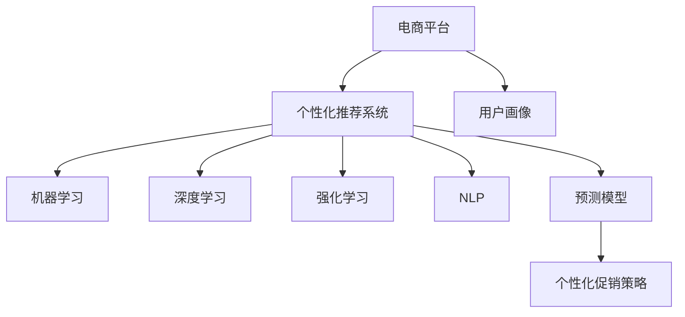

                 

## 1. 背景介绍

### 1.1 问题由来

随着互联网的普及和电子商务的快速发展，电商平台已成为消费者购物的重要渠道。面对激烈的市场竞争，各大电商企业纷纷通过推出各种个性化促销活动来吸引和留住用户。然而，传统的促销策略往往存在诸多不足，如缺乏针对性、用户参与度低、营销效果差等，无法满足用户对个性化购物体验的期望。为了解决这些问题，电商平台亟需引入先进的AI技术，构建更加精准、高效、个性化的促销策略。

### 1.2 问题核心关键点

基于AI技术的个性化促销策略，旨在通过深入分析用户的购物行为和偏好，结合电商平台的大量数据，设计出具有高度针对性的促销活动。关键点如下：

- **数据获取与处理**：平台需要获取用户行为数据，如浏览记录、购买历史、点击率等，并对这些数据进行清洗、归一化和特征工程处理，以构建高质量的模型输入。
- **用户画像构建**：基于用户的历史数据和行为特征，构建个性化的用户画像，描述用户的兴趣偏好、购买力、忠诚度等关键特征。
- **模型选择与训练**：选择适合的机器学习模型，并利用平台数据进行训练，预测用户对不同促销活动的响应行为，如点击、购买、分享等。
- **促销策略优化**：根据模型预测结果，设计并优化个性化的促销策略，如定制化推荐、限时折扣、满减活动等，以最大化用户的参与度和转化率。
- **效果评估与反馈**：定期对促销策略的效果进行评估，并根据反馈数据调整和优化模型和策略，确保长期提升营销效果。

## 2. 核心概念与联系

### 2.1 核心概念概述

为了更好地理解AI驱动的个性化促销策略，本节将介绍几个密切相关的核心概念：

- **电商平台**：指以互联网为媒介，提供商品销售、信息展示、在线支付等服务的商业平台。
- **个性化推荐系统**：通过分析用户行为和偏好，为用户提供定制化商品推荐的系统。
- **用户画像**：描述用户特征的全面视图，包括基本信息、行为特征、偏好等。
- **机器学习**：利用算法从数据中学习模式，并应用到实际问题中的技术。
- **深度学习**：基于多层神经网络，通过学习大量数据进行复杂模式提取的机器学习方法。
- **强化学习**：通过试错逐步优化策略，最大化预期奖励的机器学习方法。
- **自然语言处理(NLP)**：涉及计算机理解和处理人类语言的技术。
- **预测模型**：使用历史数据训练，预测未来事件结果的模型。

这些核心概念之间的逻辑关系可以通过以下Mermaid流程图来展示：



这个流程图展示了这个系统的主要组成部分及其之间的关系：

1. 电商平台通过个性化推荐系统为用户提供商品推荐。
2. 个性化推荐系统依赖用户画像获取用户特征。
3. 机器学习、深度学习、强化学习、NLP等技术支持个性化推荐系统。
4. 预测模型用于构建个性化促销策略。
5. 个性化促销策略提升用户参与度和转化率。

这些概念共同构成了电商平台个性化促销策略的核心框架，使得AI技术能够精准地预测用户行为并优化促销策略，从而提升用户满意度和平台收益。

## 3. 核心算法原理 & 具体操作步骤
### 3.1 算法原理概述

基于AI技术的个性化促销策略，本质上是一个基于用户行为数据的预测问题。其核心思想是通过机器学习模型，分析用户历史数据，预测其对不同促销活动的响应行为。具体而言，可以构建如下框架：

1. **数据收集与预处理**：收集用户的行为数据（如浏览记录、购买历史、点击率等），并进行清洗、归一化和特征工程，构建高质量的模型输入。
2. **用户画像构建**：通过用户行为特征，构建个性化用户画像，描述用户的兴趣偏好、购买力、忠诚度等关键特征。
3. **模型训练与预测**：选择适合的机器学习模型，并利用平台数据进行训练，预测用户对不同促销活动的响应行为。
4. **策略优化**：根据模型预测结果，设计并优化个性化的促销策略，如定制化推荐、限时折扣、满减活动等，以最大化用户的参与度和转化率。
5. **效果评估与反馈**：定期对促销策略的效果进行评估，并根据反馈数据调整和优化模型和策略，确保长期提升营销效果。

### 3.2 算法步骤详解

基于AI技术的个性化促销策略的具体操作步骤如下：

**Step 1: 数据收集与预处理**

- **数据来源**：从电商平台的数据仓库中提取用户的行为数据，包括浏览记录、购买历史、点击率、评论、评分等。
- **数据清洗**：去除无效数据、异常值和重复记录，保证数据质量。
- **特征工程**：提取和构造相关特征，如用户ID、商品ID、浏览时间、购买金额、点击次数等。

**Step 2: 用户画像构建**

- **用户特征描述**：基于用户行为数据，描述用户的兴趣偏好、购买力、忠诚度、消费习惯等特征。
- **用户分群**：通过聚类算法（如K-means、DBSCAN等）将用户分为若干群体，以更精细地分析不同用户群体对促销活动的响应。
- **画像展示**：构建用户画像，展示用户的主要特征和行为模式。

**Step 3: 模型训练与预测**

- **选择模型**：选择适合的机器学习模型，如决策树、随机森林、神经网络等。
- **特征选择**：选择与促销活动响应最相关的特征，减少模型的复杂度和过拟合风险。
- **模型训练**：利用历史数据训练模型，评估模型性能，优化超参数。
- **预测行为**：利用训练好的模型，预测用户对不同促销活动的响应行为，如点击、购买、分享等。

**Step 4: 策略优化**

- **促销策略设计**：根据预测结果，设计个性化的促销策略，如定制化推荐、限时折扣、满减活动等。
- **策略优化**：通过A/B测试等方法，评估促销策略的效果，不断调整和优化策略。
- **推荐系统集成**：将促销策略集成到个性化推荐系统中，提升推荐效果。

**Step 5: 效果评估与反馈**

- **效果评估**：定期评估促销策略的效果，如点击率、转化率、用户满意度等。
- **反馈数据收集**：收集用户对促销活动的反馈，包括评价、评分、评论等。
- **模型优化**：根据反馈数据调整和优化模型和策略，确保长期提升营销效果。

### 3.3 算法优缺点

基于AI技术的个性化促销策略具有以下优点：

- **精准性高**：通过机器学习模型分析用户行为数据，能够精准预测用户对不同促销活动的响应行为。
- **个性化强**：基于用户画像构建个性化的推荐系统，提供高度定制化的促销策略。
- **效率高**：利用自动化技术进行数据处理和策略优化，大幅提升运营效率。

同时，该方法也存在一些局限性：

- **数据依赖**：模型的效果很大程度上依赖于数据的质量和多样性，需要大量标注数据进行训练。
- **模型复杂**：选择合适的模型和参数调优需要一定的专业知识和计算资源。
- **策略风险**：过度依赖自动化优化可能导致策略设计过于简单化，缺乏灵活性和多样性。
- **隐私问题**：需要处理和分析用户行为数据，涉及用户隐私保护和数据安全问题。

尽管存在这些局限性，但基于AI的个性化促销策略已经在大电商平台上得到了广泛应用，并取得了显著的成效。未来相关研究将进一步优化模型和算法，提高策略设计的灵活性和有效性。

### 3.4 算法应用领域

基于AI技术的个性化促销策略已经在电商、金融、旅游、医疗等多个领域得到了广泛应用，显著提升了用户体验和平台收益。例如：

- **电商平台**：通过个性化推荐系统，为用户提供定制化促销活动，提升点击率和转化率。
- **金融服务**：基于用户行为数据，设计个性化的金融产品推荐，提高用户粘性和收益率。
- **旅游平台**：通过分析用户偏好和行为，推荐个性化的旅游路线和促销活动，提升用户满意度和消费额。
- **医疗健康**：根据用户健康数据，推荐个性化的健康产品和医疗服务，提升用户健康水平和平台收益。

除了这些领域，AI驱动的个性化促销策略还将不断扩展应用范围，为各行各业提供精准、高效、个性化的解决方案，推动产业升级和数字化转型。

## 4. 数学模型和公式 & 详细讲解  
### 4.1 数学模型构建

为了更好地理解基于AI技术的个性化促销策略的数学原理，本节将详细讲解相关模型的构建过程。

假设平台有 $N$ 个用户，每个用户 $i$ 的特征向量为 $x_i$，促销活动的编号为 $j$，用户对促销活动的响应为 $y_{ij}$，其中 $y_{ij}=1$ 表示用户点击或购买了促销活动 $j$，否则为 $0$。

模型使用二元分类算法，预测用户对促销活动的响应，其中 $z_{ij}$ 为模型的预测结果，定义为：

$$
z_{ij} = w^T\phi(x_i) + b
$$

其中 $w$ 为模型权重，$\phi(x_i)$ 为特征映射函数，$b$ 为偏置项。

模型的预测结果 $y_{ij}$ 可以通过逻辑回归函数得到：

$$
y_{ij} = \sigma(z_{ij}) = \frac{1}{1+\exp(-z_{ij})}
$$

模型的损失函数为交叉熵损失：

$$
\mathcal{L}(w) = -\frac{1}{N}\sum_{i=1}^N\sum_{j=1}^M y_{ij}\log\sigma(z_{ij}) + (1-y_{ij})\log(1-\sigma(z_{ij}))
$$

其中 $M$ 为促销活动的总数。

通过最小化损失函数 $\mathcal{L}(w)$，训练模型得到最优权重 $w^*$。

### 4.2 公式推导过程

以下我们以逻辑回归模型为例，推导其训练过程和预测结果的计算公式。

**Step 1: 数据准备**

- **数据集**：平台收集用户的行为数据，包括浏览记录、购买历史、点击率等。
- **数据预处理**：对数据进行清洗、归一化和特征选择，构建高质量的模型输入。

**Step 2: 特征工程**

- **特征提取**：从原始数据中提取有用的特征，如用户ID、商品ID、浏览时间、购买金额、点击次数等。
- **特征编码**：将特征进行编码，转换为模型可接受的格式。
- **特征选择**：选择与促销活动响应最相关的特征，减少模型的复杂度和过拟合风险。

**Step 3: 模型训练**

- **选择模型**：选择逻辑回归模型作为预测模型。
- **损失函数**：选择交叉熵损失函数作为模型训练的目标。
- **优化算法**：使用随机梯度下降（SGD）等优化算法进行模型训练。
- **参数调整**：调整学习率、正则化系数等超参数，优化模型性能。

**Step 4: 预测行为**

- **输入数据**：将新用户的行为数据作为输入，进行特征映射和预测。
- **预测结果**：利用训练好的模型，预测用户对不同促销活动的响应行为，如点击、购买、分享等。

**Step 5: 策略优化**

- **策略设计**：根据预测结果，设计个性化的促销策略，如定制化推荐、限时折扣、满减活动等。
- **策略优化**：通过A/B测试等方法，评估促销策略的效果，不断调整和优化策略。

**Step 6: 效果评估**

- **效果评估**：定期评估促销策略的效果，如点击率、转化率、用户满意度等。
- **反馈数据收集**：收集用户对促销活动的反馈，包括评价、评分、评论等。
- **模型优化**：根据反馈数据调整和优化模型和策略，确保长期提升营销效果。

### 4.3 案例分析与讲解

以下我们以电商平台的个性化推荐系统为例，进行详细讲解。

假设电商平台有 $N=10000$ 个用户，每个用户 $i$ 的特征向量为 $x_i$，促销活动的编号为 $j$，用户对促销活动的响应为 $y_{ij}$。模型使用逻辑回归算法，预测用户对促销活动的响应，其中 $z_{ij}$ 为模型的预测结果，定义为：

$$
z_{ij} = w^T\phi(x_i) + b
$$

其中 $w$ 为模型权重，$\phi(x_i)$ 为特征映射函数，$b$ 为偏置项。

**Step 1: 数据收集与预处理**

- **数据来源**：从电商平台的数据仓库中提取用户的行为数据，包括浏览记录、购买历史、点击率、评论、评分等。
- **数据清洗**：去除无效数据、异常值和重复记录，保证数据质量。
- **特征工程**：提取和构造相关特征，如用户ID、商品ID、浏览时间、购买金额、点击次数等。

**Step 2: 用户画像构建**

- **用户特征描述**：基于用户行为数据，描述用户的兴趣偏好、购买力、忠诚度、消费习惯等特征。
- **用户分群**：通过聚类算法（如K-means、DBSCAN等）将用户分为若干群体，以更精细地分析不同用户群体对促销活动的响应。
- **画像展示**：构建用户画像，展示用户的主要特征和行为模式。

**Step 3: 模型训练与预测**

- **选择模型**：选择逻辑回归模型作为预测模型。
- **特征选择**：选择与促销活动响应最相关的特征，如用户ID、商品ID、浏览时间、购买金额、点击次数等。
- **模型训练**：利用历史数据训练模型，评估模型性能，优化超参数。
- **预测行为**：利用训练好的模型，预测用户对不同促销活动的响应行为，如点击、购买、分享等。

**Step 4: 策略优化**

- **促销策略设计**：根据预测结果，设计个性化的促销策略，如定制化推荐、限时折扣、满减活动等。
- **策略优化**：通过A/B测试等方法，评估促销策略的效果，不断调整和优化策略。
- **推荐系统集成**：将促销策略集成到个性化推荐系统中，提升推荐效果。

**Step 5: 效果评估与反馈**

- **效果评估**：定期评估促销策略的效果，如点击率、转化率、用户满意度等。
- **反馈数据收集**：收集用户对促销活动的反馈，包括评价、评分、评论等。
- **模型优化**：根据反馈数据调整和优化模型和策略，确保长期提升营销效果。

通过这个案例，我们可以看到，基于AI的个性化促销策略不仅能提升电商平台的营销效果，还能通过精准的个性化推荐，提升用户的购物体验。

## 5. 项目实践：代码实例和详细解释说明
### 5.1 开发环境搭建

在进行个性化促销策略的开发实践前，我们需要准备好开发环境。以下是使用Python进行PyTorch开发的环境配置流程：

1. 安装Anaconda：从官网下载并安装Anaconda，用于创建独立的Python环境。

2. 创建并激活虚拟环境：
```bash
conda create -n pytorch-env python=3.8 
conda activate pytorch-env
```

3. 安装PyTorch：根据CUDA版本，从官网获取对应的安装命令。例如：
```bash
conda install pytorch torchvision torchaudio cudatoolkit=11.1 -c pytorch -c conda-forge
```

4. 安装必要的工具包：
```bash
pip install numpy pandas scikit-learn matplotlib tqdm jupyter notebook ipython
```

完成上述步骤后，即可在`pytorch-env`环境中开始开发实践。

### 5.2 源代码详细实现

这里我们以电商平台的个性化推荐系统为例，给出使用PyTorch进行逻辑回归模型训练和预测的PyTorch代码实现。

首先，定义训练数据集：

```python
import torch
from torch.utils.data import TensorDataset, DataLoader
import pandas as pd

# 加载数据
data = pd.read_csv('data.csv')
X = data[['user_id', 'item_id', 'time', 'price', 'click_times']]
y = data['response']

# 划分训练集和测试集
train_ratio = 0.8
X_train, y_train = X.sample(frac=train_ratio, random_state=42), y.sample(frac=train_ratio, random_state=42)
X_test, y_test = X.drop(X_train.index), y.drop(y_train.index)

# 编码标签
class NumToLabel:
    def __init__(self, num_classes):
        self.label2idx = {i: j for j, i in enumerate(range(num_classes))}
        self.idx2label = {j: i for j, i in enumerate(range(num_classes))}

    def __call__(self, x):
        return self.label2idx[x]

label_encoder = NumToLabel(num_classes=2)
y_train, y_test = y_train.apply(lambda x: label_encoder(x)), y_test.apply(lambda x: label_encoder(x))

# 数据预处理
from sklearn.preprocessing import StandardScaler
scaler = StandardScaler()
X_train = scaler.fit_transform(X_train)
X_test = scaler.transform(X_test)

# 数据集划分
train_dataset = TensorDataset(torch.tensor(X_train), torch.tensor(y_train))
test_dataset = TensorDataset(torch.tensor(X_test), torch.tensor(y_test))

# 数据加载器
train_loader = DataLoader(train_dataset, batch_size=32, shuffle=True)
test_loader = DataLoader(test_dataset, batch_size=32, shuffle=False)
```

接着，定义模型和优化器：

```python
from torch import nn, optim

# 定义模型
class LogisticRegression(nn.Module):
    def __init__(self, input_dim):
        super(LogisticRegression, self).__init__()
        self.linear = nn.Linear(input_dim, 1)

    def forward(self, x):
        return torch.sigmoid(self.linear(x))

input_dim = X_train.shape[1]
model = LogisticRegression(input_dim)

# 定义优化器
optimizer = optim.SGD(model.parameters(), lr=0.01, momentum=0.9)
```

然后，定义训练和评估函数：

```python
from sklearn.metrics import roc_auc_score, roc_curve

# 训练函数
def train_epoch(model, data_loader, optimizer):
    model.train()
    total_loss = 0
    for batch_idx, (data, target) in enumerate(data_loader):
        optimizer.zero_grad()
        output = model(data)
        loss = nn.BCELoss()(output, target)
        loss.backward()
        optimizer.step()
        total_loss += loss.item()
    return total_loss / len(data_loader)

# 评估函数
def evaluate(model, data_loader):
    model.eval()
    y_true, y_pred = [], []
    with torch.no_grad():
        for data, target in data_loader:
            output = model(data)
            y_true.append(target.numpy())
            y_pred.append(output.sigmoid().numpy())
    auc = roc_auc_score(y_true, y_pred)
    fpr, tpr, _ = roc_curve(y_true, y_pred)
    return auc, fpr, tpr
```

最后，启动训练流程并在测试集上评估：

```python
epochs = 10
batch_size = 32

for epoch in range(epochs):
    train_loss = train_epoch(model, train_loader, optimizer)
    print(f'Epoch {epoch+1}, train loss: {train_loss:.4f}')

    test_auc, test_fpr, test_tpr = evaluate(model, test_loader)
    print(f'Epoch {epoch+1}, test AUC: {test_auc:.4f}')

print('Final test AUC:', test_auc)
```

以上就是使用PyTorch对逻辑回归模型进行电商个性化推荐系统开发的完整代码实现。可以看到，得益于PyTorch的强大封装，我们可以用相对简洁的代码完成模型的构建和训练。

### 5.3 代码解读与分析

让我们再详细解读一下关键代码的实现细节：

**train_epoch函数**：
- 定义了模型在单个epoch内的训练过程，包括前向传播、损失计算、反向传播和参数更新。
- 累加训练损失，最后返回平均训练损失。

**evaluate函数**：
- 定义了模型在测试集上的评估过程，包括计算模型预测值和真实标签，计算AUC等评估指标，并返回fpr和tpr曲线。
- 利用sklearn的roc_auc_score和roc_curve函数计算模型性能。

**train函数**：
- 在每个epoch内，先训练模型，后评估模型性能。
- 输出训练损失和测试AUC，方便监控训练过程。

可以看到，PyTorch配合scikit-learn提供了丰富的工具支持，使得模型训练和评估变得简便高效。开发者可以将更多精力放在特征工程、模型选择和业务优化上，而不必过多关注底层的实现细节。

当然，工业级的系统实现还需考虑更多因素，如模型的保存和部署、超参数的自动搜索、更灵活的任务适配层等。但核心的微调范式基本与此类似。

## 6. 实际应用场景
### 6.1 智能客服系统

基于个性化推荐系统，智能客服系统可以提升用户咨询体验和问题解决效率。系统可以根据用户的历史咨询记录和当前对话内容，预测用户意图，并推荐最合适的回复模板，从而提升客服人员的响应速度和准确性。例如：

- **意图识别**：通过分析用户咨询文本，识别出用户的具体问题，如订单查询、退换货、配送等。
- **个性化回复**：根据用户的意图，推荐最合适的回复模板，如常见问题解答、流程指引、温馨提醒等。
- **用户画像**：系统定期更新用户画像，了解用户的偏好和习惯，个性化推荐更符合用户需求的回复。

### 6.2 金融理财系统

金融理财系统通过个性化推荐，为用户提供定制化的投资建议和理财方案。系统可以分析用户的历史投资记录和风险偏好，预测其对不同金融产品的响应行为，从而推荐最合适的投资方案。例如：

- **风险评估**：根据用户的投资历史和行为特征，评估用户的风险承受能力和偏好。
- **产品推荐**：推荐用户可能感兴趣的投资产品，如股票、基金、债券等，并提供详细的投资分析报告。
- **动态调整**：根据市场变化和用户反馈，动态调整投资方案，确保用户的投资收益最大化。

### 6.3 娱乐推荐系统

娱乐推荐系统通过个性化推荐，提升用户的娱乐体验和粘性。系统可以分析用户的历史观看记录和行为特征，预测其对不同内容的响应行为，从而推荐最符合用户兴趣的影片、音乐、书籍等。例如：

- **内容推荐**：根据用户的观看历史和偏好，推荐用户可能感兴趣的内容，如电影、电视剧、音乐、书籍等。
- **个性化播放**：根据用户的观看行为，推荐个性化的播放列表，提升用户的观看体验。
- **动态调整**：根据用户的反馈和观看行为，动态调整推荐算法，提高推荐精度。

### 6.4 未来应用展望

随着个性化推荐技术的不断发展，其在电商、金融、娱乐等多个领域的应用前景将更加广阔。未来，基于AI的个性化推荐系统将实现更精准、高效、个性化的推荐，提升用户满意度和平台收益。

在智慧城市治理中，个性化推荐系统可以用于智能交通、智慧能源、公共安全等领域，提供个性化的信息和服务，提升城市管理效率和居民生活质量。

在医疗健康领域，个性化推荐系统可以用于智能诊疗、健康管理、药物推荐等方面，提供个性化的健康和医疗服务，提升用户的健康水平和医疗体验。

总之，基于AI的个性化推荐技术将在更多领域得到应用，为各行各业带来新的机遇和挑战，推动人工智能技术的普及和应用。

## 7. 工具和资源推荐
### 7.1 学习资源推荐

为了帮助开发者系统掌握个性化推荐系统的理论基础和实践技巧，这里推荐一些优质的学习资源：

1. 《推荐系统实战》系列博文：由大模型技术专家撰写，深入浅出地介绍了推荐系统原理、算法、技术栈等。

2. 《深度学习实战》课程：斯坦福大学开设的深度学习课程，涵盖推荐系统、自然语言处理等多个NLP方向。

3. 《推荐系统》书籍：详细介绍了推荐系统的基本概念、算法、实现技术等，是推荐系统领域的学习经典。

4. Kaggle推荐系统竞赛：参加Kaggle推荐系统竞赛，实战练习推荐系统算法和模型优化。

5. OpenRec推荐系统框架：开源推荐系统框架，支持多种推荐算法和模型，方便实践和研究。

通过对这些资源的学习实践，相信你一定能够快速掌握个性化推荐系统的精髓，并用于解决实际的推荐问题。

### 7.2 开发工具推荐

高效的开发离不开优秀的工具支持。以下是几款用于个性化推荐系统开发的常用工具：

1. PyTorch：基于Python的开源深度学习框架，灵活动态的计算图，适合快速迭代研究。大部分推荐系统都有PyTorch版本的实现。

2. TensorFlow：由Google主导开发的开源深度学习框架，生产部署方便，适合大规模工程应用。同样有丰富的推荐系统资源。

3. LightFM、TensorRec等推荐系统库：提供了推荐系统算法和模型的实现，方便快速开发和部署。

4. Weights & Biases：模型训练的实验跟踪工具，可以记录和可视化模型训练过程中的各项指标，方便对比和调优。与主流深度学习框架无缝集成。

5. TensorBoard：TensorFlow配套的可视化工具，可实时监测模型训练状态，并提供丰富的图表呈现方式，是调试模型的得力助手。

6. Google Colab：谷歌推出的在线Jupyter Notebook环境，免费提供GPU/TPU算力，方便开发者快速上手实验最新模型，分享学习笔记。

合理利用这些工具，可以显著提升个性化推荐系统的开发效率，加快创新迭代的步伐。

### 7.3 相关论文推荐

个性化推荐系统的发展源于学界的持续研究。以下是几篇奠基性的相关论文，推荐阅读：

1. Recommender Systems in Collaborative Filtering: Algorithms, Applications, and Challenges（Bellkacem, 2011）：介绍了推荐系统的基本概念和算法，是推荐系统领域的经典论文。

2. Trust and Recomputer Recommendations Based on Decision Tree Ensembles（Yin et al., 2004）：提出了基于决策树融合的推荐算法，并在电商推荐中取得了良好效果。

3. Factorization Machines with Nonnegative Factors for Recommender Systems（Lian et al., 2018）：提出了一种基于非负因子分解的推荐算法，在多个推荐系统评测任务中表现优异。

4. Personalized Ranking: A New Perspective with Neural Networks（Chen et al., 2017）：提出了基于神经网络的个性化推荐方法，并在电商推荐中取得了显著提升。

5. Recommendation Systems with Missing Features（Cao et al., 2019）：研究了推荐系统中的特征缺失问题，并提出了一种新的推荐算法，提高了推荐系统的鲁棒性。

这些论文代表了个性化推荐系统的发展脉络。通过学习这些前沿成果，可以帮助研究者把握学科前进方向，激发更多的创新灵感。

## 8. 总结：未来发展趋势与挑战

### 8.1 总结

本文对基于AI技术的个性化促销策略进行了全面系统的介绍。首先阐述了个性化促销策略的研究背景和意义，明确了个性化推荐系统在提升用户满意度和平台收益方面的独特价值。其次，从原理到实践，详细讲解了个性化推荐系统的数学原理和关键步骤，给出了推荐系统开发的完整代码实例。同时，本文还广泛探讨了个性化推荐系统在电商、金融、娱乐等多个行业领域的应用前景，展示了推荐技术的发展潜力。

通过本文的系统梳理，可以看到，基于AI的个性化推荐策略不仅能提升电商平台的营销效果，还能通过精准的个性化推荐，提升用户的购物体验。未来，伴随推荐技术的持续演进，基于AI的个性化推荐系统将在更多领域得到应用，为各行各业带来新的机遇和挑战。

### 8.2 未来发展趋势

展望未来，基于AI的个性化推荐系统将呈现以下几个发展趋势：

1. **深度学习与强化学习结合**：未来的推荐系统将结合深度学习和强化学习，通过试错逐步优化推荐策略，最大化用户的满意度。

2. **多模态融合**：推荐系统将融合文本、图像、音频等多模态信息，提升推荐精度和用户粘性。

3. **实时推荐**：通过实时数据流处理和模型优化，推荐系统能够在用户行为变化时迅速响应，提供即时推荐。

4. **联邦学习**：利用联邦学习技术，在保护用户隐私的前提下，实现跨平台推荐系统的高效协作。

5. **自适应推荐**：推荐系统将具备自适应能力，根据用户的反馈动态调整推荐策略，确保长期提升推荐效果。

6. **跨领域应用**：个性化推荐系统将在更多领域得到应用，如医疗健康、金融理财、智能交通等，推动各行各业的数字化转型。

以上趋势凸显了个性化推荐技术的广阔前景。这些方向的探索发展，必将进一步提升推荐系统的性能和应用范围，为各行各业带来新的机遇和挑战。

### 8.3 面临的挑战

尽管个性化推荐系统已经取得了瞩目成就，但在迈向更加智能化、普适化应用的过程中，它仍面临诸多挑战：

1. **数据隐私保护**：用户数据的收集和使用涉及隐私问题，如何保护用户隐私是推荐系统设计的重要考量。

2. **冷启动问题**：新用户没有历史行为数据，推荐系统难以提供准确的个性化推荐。

3. **过拟合与泛化**：推荐系统需要适应不同用户和场景，如何避免过拟合，提升泛化性能是关键问题。

4. **资源消耗**：推荐系统需要处理和存储大量数据，如何提高计算和存储效率是技术难点。

5. **模型复杂度**：推荐系统需要设计复杂的模型和算法，如何简化模型结构，降低计算复杂度是研究重点。

6. **算法公平性**：推荐系统需要避免偏见和歧视，如何确保算法的公平性和透明性是重要课题。

尽管存在这些挑战，但基于AI的个性化推荐系统已经在电商、金融、娱乐等多个领域得到了广泛应用，并取得了显著的成效。未来相关研究将进一步优化模型和算法，提高推荐系统的灵活性和效果。

### 8.4 未来突破

面对个性化推荐系统所面临的种种挑战，未来的研究需要在以下几个方面寻求新的突破：

1. **联邦学习与隐私保护**：结合联邦学习技术，实现跨平台推荐系统的高效协作，同时保护用户隐私。

2. **冷启动推荐**：利用知识图谱、协同过滤等技术，解决新用户的冷启动问题，提供初始的个性化推荐。

3. **深度强化学习**：通过深度强化学习技术，提升推荐系统的自适应能力和长期优化能力。

4. **多模态融合**：融合视觉、语音、文本等多模态信息，提升推荐精度和用户粘性。

5. **自适应推荐**：根据用户反馈和行为变化，动态调整推荐策略，确保长期提升推荐效果。

6. **模型优化**：通过模型压缩、剪枝等技术，降低模型复杂度和计算资源消耗，提高推荐系统的实时性和可扩展性。

这些研究方向的探索，必将引领个性化推荐系统走向更高的台阶，为各行各业带来新的机遇和挑战。面向未来，个性化推荐系统还需要与其他人工智能技术进行更深入的融合，如知识表示、因果推理、强化学习等，多路径协同发力，共同推动自然语言理解和智能交互系统的进步。只有勇于创新、敢于突破，才能不断拓展推荐系统的边界，让智能技术更好地造福人类社会。

## 9. 附录：常见问题与解答

**Q1：如何选择合适的推荐算法？**

A: 推荐算法的选择需要根据具体业务场景和数据特点进行决策。一般来说，电商、娱乐等个性化需求较强的场景，适合使用基于协同过滤的推荐算法，如ALS、CF等；金融、医疗等场景，适合使用基于内容匹配的推荐算法，如神经网络、KNN等。此外，还需要考虑算法的复杂度、计算效率和可解释性等因素。

**Q2：推荐系统如何处理缺失特征？**

A: 推荐系统通常会面临特征缺失的问题，可以通过填充缺失值、插值、删除缺失值等方法进行处理。也可以使用推荐算法自身的设计，如KNN推荐算法、矩阵分解等，处理缺失特征。

**Q3：推荐系统如何避免冷启动问题？**

A: 冷启动问题可以通过协同过滤、知识图谱、深度学习等方法解决。协同过滤可以利用用户的相似用户和相似物品进行推荐；知识图谱可以利用用户与物品之间的语义关系进行推荐；深度学习可以利用用户的行为数据进行推荐。

**Q4：推荐系统如何提升用户的参与度和转化率？**

A: 提升用户参与度和转化率的方法包括个性化推荐、限时折扣、满减活动等。个性化推荐可以根据用户的历史行为和偏好，推荐最符合其兴趣的商品；限时折扣和满减活动可以激励用户进行购买行为，提升转化率。

**Q5：推荐系统如何处理过拟合问题？**

A: 处理过拟合问题的方法包括数据增强、正则化、模型剪枝等。数据增强可以通过增加噪声、生成伪样本等方式，提升模型的泛化能力；正则化可以通过L1、L2正则、Dropout等方式，减少模型的过拟合风险；模型剪枝可以通过剪除冗余参数、简化模型结构等方式，提升模型的泛化能力和计算效率。

通过以上常见问题的解答，相信你一定能够更好地理解和应用个性化推荐系统，解决实际的推荐问题。

---

作者：禅与计算机程序设计艺术 / Zen and the Art of Computer Programming

