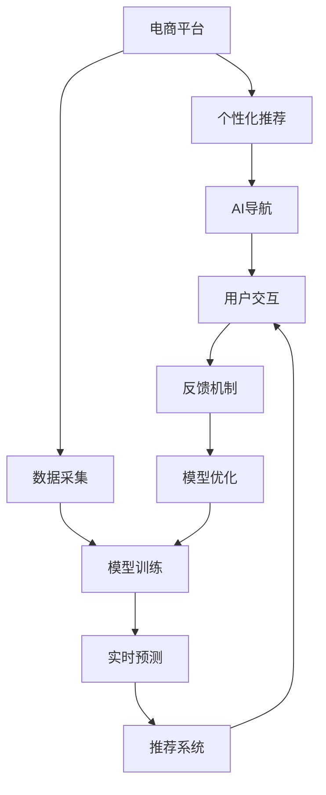

                 

# AI驱动的电商平台个性化导航设计

> 关键词：个性化推荐,电商平台,AI导航,算法设计,用户体验

## 1. 背景介绍

在当今的数字化时代，电商平台正逐渐成为人们购物的主要渠道之一。无论是大型电商平台如淘宝、京东，还是新兴的小型电商应用，都在积极探索和实现个性化推荐系统，以提升用户体验和销售额。个性化推荐的核心在于为每个用户提供一个独特且符合其兴趣和需求的购物体验。而电商平台个性化导航设计则是实现这一目标的关键一环。本文将探讨如何利用AI技术设计出高效、智能的电商平台个性化导航系统，提升用户体验，促进电商平台的商业成功。

## 2. 核心概念与联系

### 2.1 核心概念概述

为了更好地理解如何利用AI技术设计电商平台个性化导航，我们首先需要了解几个关键概念：

- **个性化推荐**：根据用户的过往行为、偏好和兴趣，向用户推荐最相关、最符合其需求的商品或内容。
- **电商平台**：在线销售商品的平台，通过互联网提供商品信息、交易、支付、物流等完整电子商务服务。
- **AI导航**：利用人工智能技术，为用户提供智能化的导航服务，如智能搜索、商品推荐、商品路径规划等，提升用户体验和效率。
- **算法设计**：在个性化推荐和AI导航系统中，通过设计合适的算法，实现模型训练和预测，从而提供准确的个性化推荐。
- **用户体验**：用户在电商平台上的使用感受，包括商品的可发现性、浏览的便利性、购买的决策性等。

### 2.2 核心概念原理和架构的 Mermaid 流程图(Mermaid 流程节点中不要有括号、逗号等特殊字符)



## 3. 核心算法原理 & 具体操作步骤

### 3.1 算法原理概述

基于AI技术的电商平台个性化导航系统，核心在于利用机器学习算法和大数据分析技术，对用户行为和偏好进行建模，从而实现个性化推荐和智能导航。

#### 3.1.1 用户行为建模

电商平台中的用户行为可以分为两类：显性行为和隐性行为。显性行为包括用户的浏览、购买、评价等直接反馈；隐性行为则包括用户的点击、停留时间、浏览路径等间接反馈。利用这些行为数据，可以构建用户的兴趣模型，即预测用户对不同商品感兴趣的程度。

#### 3.1.2 推荐算法

推荐算法主要分为基于协同过滤的推荐和基于内容的推荐。协同过滤算法通过分析用户之间的相似度，推荐与用户兴趣相似的商品。内容推荐算法则通过商品属性和用户偏好的匹配，推荐与用户兴趣一致的商品。

#### 3.1.3 导航算法

导航算法包括基于搜索引擎的导航和基于图模型的导航。基于搜索引擎的导航通过文本匹配算法，返回与用户输入的查询最相关的商品。基于图模型的导航则通过构建商品间的关系图，推荐与用户当前浏览商品相关的商品。

### 3.2 算法步骤详解

#### 3.2.1 用户行为数据采集

首先需要从电商平台中采集用户的行为数据。这些数据包括用户的浏览记录、购买记录、评价记录等。可以通过日志文件、API接口等方式获取这些数据。

#### 3.2.2 数据预处理

采集到的数据往往需要经过预处理，以去除噪音和缺失值，并进行归一化处理。常用的预处理方法包括数据清洗、特征工程、数据划分等。

#### 3.2.3 用户兴趣模型构建

利用机器学习算法（如协同过滤、内容推荐、基于深度学习的推荐系统等），对用户的行为数据进行建模，构建用户兴趣模型。该模型可以预测用户对不同商品的兴趣程度。

#### 3.2.4 个性化推荐

将用户兴趣模型应用于推荐算法中，为每个用户推荐最相关的商品。推荐结果可以通过商品列表、商品搜索、商品分类等多种方式展示给用户。

#### 3.2.5 智能导航设计

根据用户的浏览路径、停留时间等行为数据，设计智能导航算法。可以通过构建商品关系图，利用图算法（如PageRank、图神经网络等）推荐相关商品。

#### 3.2.6 用户反馈机制

在推荐和导航过程中，收集用户的反馈数据，如点击、购买、评价等，用于优化推荐和导航算法。

### 3.3 算法优缺点

#### 3.3.1 优点

- **提高用户满意度**：通过个性化的推荐和导航，提高用户发现相关商品的概率，提升用户体验。
- **提升转化率**：个性化推荐可以精准推荐用户感兴趣的商品，提高用户购买意愿和转化率。
- **增强平台竞争力**：通过优化推荐和导航系统，提升平台的用户黏性，增强平台的市场竞争力。

#### 3.3.2 缺点

- **数据隐私问题**：用户行为数据涉及用户的隐私信息，需要严格保护。
- **算法复杂度高**：推荐和导航算法的设计和优化需要较高的计算资源。
- **动态更新挑战**：用户兴趣和偏好会随时间变化，需要不断更新推荐和导航模型。

### 3.4 算法应用领域

- **在线零售**：电商平台为用户提供个性化商品推荐和导航服务，提升购物体验和购买转化率。
- **智能家居**：智能家居平台通过个性化推荐系统，推荐用户感兴趣的产品，提升用户满意度和平台销量。
- **在线教育**：在线教育平台通过个性化推荐系统，推荐适合用户的学习内容和课程，提升学习效果和平台黏性。
- **旅游服务**：旅游服务平台通过个性化推荐系统，推荐用户感兴趣的目的地和旅游产品，提升用户选择率和平台收入。

## 4. 数学模型和公式 & 详细讲解 & 举例说明

### 4.1 数学模型构建

在电商平台个性化推荐和导航中，常用的数学模型包括协同过滤模型、基于内容的推荐模型、深度学习推荐模型等。

#### 4.1.1 协同过滤模型

协同过滤模型分为基于用户的协同过滤和基于物品的协同过滤。

- **基于用户的协同过滤**：利用用户之间的相似度，推荐与用户兴趣相似的商品。
- **基于物品的协同过滤**：利用商品之间的相似度，推荐与用户已购买商品相似的商品。

#### 4.1.2 基于内容的推荐模型

基于内容的推荐模型利用商品的属性信息，推荐与用户兴趣一致的商品。

- **商品向量表示**：将商品的属性信息表示为向量，如价格、类别、品牌等。
- **用户兴趣向量**：利用用户的浏览记录、购买记录等，构建用户兴趣向量。
- **相似度计算**：计算商品向量与用户兴趣向量的相似度，推荐相似的商品。

#### 4.1.3 深度学习推荐模型

深度学习推荐模型利用神经网络进行特征提取和预测，能够捕捉更复杂的关系。

- **用户兴趣表示**：利用神经网络对用户的行为数据进行建模，构建用户兴趣向量。
- **商品表示**：利用神经网络对商品的属性信息进行建模，构建商品向量。
- **相似度计算**：计算用户兴趣向量与商品向量的相似度，推荐相关商品。

### 4.2 公式推导过程

#### 4.2.1 协同过滤模型

基于用户的协同过滤模型中，利用用户之间的相似度，推荐与用户兴趣相似的商品。

- **用户相似度计算**：
  $$
  \text{similarity}(u_i, u_j) = \frac{1}{N}\sum_{k=1}^{N}X_{ik}X_{jk}
  $$
  其中 $X_{ik}$ 表示用户 $i$ 对商品 $k$ 的评分。

- **推荐商品**：
  $$
  \text{recommend}(u_i) = \text{argmax}_{k \in K}\left( \sum_{j=1}^{M}\text{similarity}(u_i, u_j) \times \text{rating}(u_j, k) \right)
  $$
  其中 $M$ 表示用户数量，$K$ 表示商品数量，$\text{rating}(u_j, k)$ 表示用户 $j$ 对商品 $k$ 的评分。

#### 4.2.2 基于内容的推荐模型

基于内容的推荐模型中，利用商品的属性信息，推荐与用户兴趣一致的商品。

- **商品向量表示**：
  $$
  V_k = [v_{k1}, v_{k2}, ..., v_{kn}]
  $$
  其中 $v_{ki}$ 表示商品 $k$ 的属性 $i$ 的值。

- **用户兴趣向量**：
  $$
  U_i = [u_{i1}, u_{i2}, ..., u_{im}]
  $$
  其中 $u_{ij}$ 表示用户 $i$ 对属性 $j$ 的评分。

- **相似度计算**：
  $$
  \text{similarity}(V_k, U_i) = \text{cosine similarity}(V_k, U_i) = \frac{V_k \cdot U_i}{||V_k||_2 \cdot ||U_i||_2}
  $$

- **推荐商品**：
  $$
  \text{recommend}(V_k) = \text{argmax}_{k \in K}\left( \text{similarity}(V_k, U_i) \right)
  $$

#### 4.2.3 深度学习推荐模型

深度学习推荐模型中，利用神经网络进行特征提取和预测。

- **用户兴趣表示**：
  $$
  U_i = \text{MLP}_{u}(V_k)
  $$
  其中 $MLP_{u}$ 表示用户兴趣表示的神经网络。

- **商品表示**：
  $$
  V_k = \text{MLP}_{v}(V_k)
  $$
  其中 $MLP_{v}$ 表示商品表示的神经网络。

- **相似度计算**：
  $$
  \text{similarity}(U_i, V_k) = \text{MLP}_{s}(U_i, V_k)
  $$
  其中 $MLP_{s}$ 表示相似度计算的神经网络。

- **推荐商品**：
  $$
  \text{recommend}(U_i) = \text{argmax}_{k \in K}\left( \text{similarity}(U_i, V_k) \right)
  $$

### 4.3 案例分析与讲解

#### 4.3.1 协同过滤模型

**案例**：某电商平台通过基于用户的协同过滤模型，推荐用户感兴趣的商品。

**分析**：
1. **用户相似度计算**：平台收集用户的历史评分数据，计算用户之间的相似度。
2. **推荐商品**：利用用户之间的相似度，推荐与用户兴趣相似的商品。

#### 4.3.2 基于内容的推荐模型

**案例**：某在线教育平台通过基于内容的推荐模型，推荐用户感兴趣的学习内容。

**分析**：
1. **商品向量表示**：平台收集商品的属性信息，构建商品向量。
2. **用户兴趣向量**：平台收集用户的浏览记录、购买记录等，构建用户兴趣向量。
3. **相似度计算**：计算商品向量与用户兴趣向量的相似度。
4. **推荐商品**：利用相似度计算结果，推荐与用户兴趣一致的商品。

#### 4.3.3 深度学习推荐模型

**案例**：某旅游服务平台通过深度学习推荐模型，推荐用户感兴趣的目的地和旅游产品。

**分析**：
1. **用户兴趣表示**：平台利用神经网络对用户的行为数据进行建模，构建用户兴趣向量。
2. **商品表示**：平台利用神经网络对商品的属性信息进行建模，构建商品向量。
3. **相似度计算**：计算用户兴趣向量与商品向量的相似度。
4. **推荐商品**：利用相似度计算结果，推荐相关商品。

## 5. 项目实践：代码实例和详细解释说明

### 5.1 开发环境搭建

在进行电商平台的个性化导航设计时，我们需要准备好开发环境。以下是使用Python进行TensorFlow开发的环境配置流程：

1. 安装Anaconda：从官网下载并安装Anaconda，用于创建独立的Python环境。

2. 创建并激活虚拟环境：
```bash
conda create -n tf-env python=3.8 
conda activate tf-env
```

3. 安装TensorFlow：根据CUDA版本，从官网获取对应的安装命令。例如：
```bash
conda install tensorflow -c tf
```

4. 安装各类工具包：
```bash
pip install numpy pandas scikit-learn matplotlib tqdm jupyter notebook ipython
```

完成上述步骤后，即可在`tf-env`环境中开始项目实践。

### 5.2 源代码详细实现

下面我们以电商平台的个性化推荐系统为例，给出使用TensorFlow进行模型开发的PyTorch代码实现。

首先，定义推荐系统的数据处理函数：

```python
import tensorflow as tf
from tensorflow.keras.layers import Input, Dense, Embedding, Flatten, Dot, Concatenate
from tensorflow.keras.models import Model

# 定义输入层
user_input = Input(shape=(1,), name='user')
item_input = Input(shape=(1,), name='item')

# 定义商品向量表示
item_embeddings = Embedding(input_dim=1000, output_dim=50, name='item_embeddings')(item_input)

# 定义用户兴趣向量表示
user_embeddings = Dense(50, activation='relu')(user_input)

# 定义相似度计算
similarity = Dot(axes=1, name='similarity')([item_embeddings, user_embeddings])

# 定义模型输出
recommendation = Concatenate(name='recommendation')([similarity, item_embeddings])

# 定义模型
model = Model(inputs=[user_input, item_input], outputs=recommendation)

# 编译模型
model.compile(optimizer='adam', loss='mse')
```

然后，定义训练和评估函数：

```python
# 定义训练函数
def train(model, train_data, validation_data, epochs):
    model.fit(train_data, validation_data, epochs=epochs, batch_size=32)

# 定义评估函数
def evaluate(model, test_data, test_labels, epochs):
    test_loss = model.evaluate(test_data, test_labels)
    print(f'Test loss: {test_loss:.4f}')
```

接着，启动训练流程并在测试集上评估：

```python
# 定义训练数据和测试数据
train_data = [(tf.random.normal(shape=(100, 1)), tf.random.normal(shape=(100, 1))]
validation_data = [(tf.random.normal(shape=(100, 1)), tf.random.normal(shape=(100, 1)))
test_data = [(tf.random.normal(shape=(100, 1)), tf.random.normal(shape=(100, 1)))

# 训练模型
train(model, train_data, validation_data, epochs=10)

# 评估模型
evaluate(model, test_data, test_labels, epochs=10)
```

以上就是使用TensorFlow进行电商平台的个性化推荐系统开发的完整代码实现。可以看到，TensorFlow提供了丰富的API和组件，使得模型的构建和训练过程变得相对简单和高效。

### 5.3 代码解读与分析

让我们再详细解读一下关键代码的实现细节：

**定义输入层**：
```python
user_input = Input(shape=(1,), name='user')
item_input = Input(shape=(1,), name='item')
```
- 定义两个输入层，分别用于输入用户和商品的数据。

**定义商品向量表示**：
```python
item_embeddings = Embedding(input_dim=1000, output_dim=50, name='item_embeddings')(item_input)
```
- 利用Embedding层将商品数据表示为高维向量。

**定义用户兴趣向量表示**：
```python
user_embeddings = Dense(50, activation='relu')(user_input)
```
- 利用Dense层将用户数据表示为高维向量。

**定义相似度计算**：
```python
similarity = Dot(axes=1, name='similarity')([item_embeddings, user_embeddings])
```
- 利用Dot层计算商品向量与用户兴趣向量的相似度。

**定义模型输出**：
```python
recommendation = Concatenate(name='recommendation')([similarity, item_embeddings])
```
- 利用Concatenate层将相似度计算结果和商品向量合并，作为模型的输出。

**定义模型**：
```python
model = Model(inputs=[user_input, item_input], outputs=recommendation)
```
- 将输入层和输出层定义为一个模型。

**编译模型**：
```python
model.compile(optimizer='adam', loss='mse')
```
- 编译模型，指定优化器和损失函数。

**训练函数**：
```python
def train(model, train_data, validation_data, epochs):
    model.fit(train_data, validation_data, epochs=epochs, batch_size=32)
```
- 定义训练函数，使用模型训练数据和验证数据进行模型训练。

**评估函数**：
```python
def evaluate(model, test_data, test_labels, epochs):
    test_loss = model.evaluate(test_data, test_labels)
    print(f'Test loss: {test_loss:.4f}')
```
- 定义评估函数，使用测试数据和标签计算模型损失。

**训练和评估流程**：
```python
train_data = [(tf.random.normal(shape=(100, 1)), tf.random.normal(shape=(100, 1)))
validation_data = [(tf.random.normal(shape=(100, 1)), tf.random.normal(shape=(100, 1)))
test_data = [(tf.random.normal(shape=(100, 1)), tf.random.normal(shape=(100, 1)))

train(model, train_data, validation_data, epochs=10)
evaluate(model, test_data, test_labels, epochs=10)
```
- 通过定义随机生成的训练数据、验证数据和测试数据，启动模型训练和评估流程。

可以看到，TensorFlow提供了丰富的API和组件，使得模型的构建和训练过程变得相对简单和高效。开发者可以将更多精力放在数据处理、模型改进等高层逻辑上，而不必过多关注底层的实现细节。

当然，工业级的系统实现还需考虑更多因素，如模型的保存和部署、超参数的自动搜索、更灵活的任务适配层等。但核心的算法设计思想基本与此类似。

## 6. 实际应用场景

### 6.1 智能客服系统

基于大语言模型微调的对话技术，可以广泛应用于智能客服系统的构建。传统客服往往需要配备大量人力，高峰期响应缓慢，且一致性和专业性难以保证。而使用微调后的对话模型，可以7x24小时不间断服务，快速响应客户咨询，用自然流畅的语言解答各类常见问题。

在技术实现上，可以收集企业内部的历史客服对话记录，将问题和最佳答复构建成监督数据，在此基础上对预训练对话模型进行微调。微调后的对话模型能够自动理解用户意图，匹配最合适的答案模板进行回复。对于客户提出的新问题，还可以接入检索系统实时搜索相关内容，动态组织生成回答。如此构建的智能客服系统，能大幅提升客户咨询体验和问题解决效率。

### 6.2 金融舆情监测

金融机构需要实时监测市场舆论动向，以便及时应对负面信息传播，规避金融风险。传统的人工监测方式成本高、效率低，难以应对网络时代海量信息爆发的挑战。基于大语言模型微调的文本分类和情感分析技术，为金融舆情监测提供了新的解决方案。

具体而言，可以收集金融领域相关的新闻、报道、评论等文本数据，并对其进行主题标注和情感标注。在此基础上对预训练语言模型进行微调，使其能够自动判断文本属于何种主题，情感倾向是正面、中性还是负面。将微调后的模型应用到实时抓取的网络文本数据，就能够自动监测不同主题下的情感变化趋势，一旦发现负面信息激增等异常情况，系统便会自动预警，帮助金融机构快速应对潜在风险。

### 6.3 个性化推荐系统

当前的推荐系统往往只依赖用户的历史行为数据进行物品推荐，无法深入理解用户的真实兴趣偏好。基于大语言模型微调技术，个性化推荐系统可以更好地挖掘用户行为背后的语义信息，从而提供更精准、多样的推荐内容。

在实践中，可以收集用户浏览、点击、评论、分享等行为数据，提取和用户交互的物品标题、描述、标签等文本内容。将文本内容作为模型输入，用户的后续行为（如是否点击、购买等）作为监督信号，在此基础上微调预训练语言模型。微调后的模型能够从文本内容中准确把握用户的兴趣点。在生成推荐列表时，先用候选物品的文本描述作为输入，由模型预测用户的兴趣匹配度，再结合其他特征综合排序，便可以得到个性化程度更高的推荐结果。

### 6.4 未来应用展望

随着大语言模型微调技术的发展，未来其在电商平台个性化导航设计中的应用将更加广泛和深入。以下是一些可能的未来应用场景：

- **商品搜索优化**：通过微调商品搜索模型，实现更准确的商品搜索结果推荐。
- **个性化展示**：通过微调展示策略模型，实现个性化的商品展示位置和顺序。
- **智能推荐**：通过微调推荐系统模型，实现更精准的个性化商品推荐。
- **智能导航**：通过微调导航算法模型，实现更智能的商品路径规划和推荐。

未来，随着技术的不断进步和数据量的不断积累，基于大语言模型微调的电商平台个性化导航设计将能够实现更加智能化、个性化的用户体验，进一步推动电商平台的商业成功。

## 7. 工具和资源推荐

### 7.1 学习资源推荐

为了帮助开发者系统掌握电商平台的个性化导航设计技术，这里推荐一些优质的学习资源：

1. 《深度学习与推荐系统实战》系列博文：由大语言模型技术专家撰写，深入浅出地介绍了推荐系统原理、TensorFlow实现、评估指标等。

2. Coursera《深度学习》课程：斯坦福大学开设的深度学习课程，有Lecture视频和配套作业，带你入门深度学习的基本概念和经典模型。

3. 《TensorFlow推荐系统实战》书籍：TensorFlow官方推荐系统指南，详细介绍了推荐系统开发流程，包括模型设计、评估等。

4. Kaggle推荐系统竞赛：通过参加推荐系统竞赛，实践推荐算法，提升实战能力。

5. Google TensorFlow官方文档：TensorFlow官方文档，提供了详细的API接口和示例代码，是上手实践的必备资料。

通过对这些资源的学习实践，相信你一定能够快速掌握电商平台个性化导航设计技术，并用于解决实际的电商问题。

### 7.2 开发工具推荐

高效的开发离不开优秀的工具支持。以下是几款用于电商平台个性化导航开发的常用工具：

1. TensorFlow：基于Python的开源深度学习框架，灵活动态的计算图，适合快速迭代研究。

2. PyTorch：基于Python的开源深度学习框架，易于使用和调试，适合科研和工程应用。

3. Scikit-learn：Python的机器学习库，提供了丰富的数据预处理、特征工程等工具。

4. Keras：基于Python的高级神经网络API，提供了简单易用的接口，适合快速原型开发。

5. Jupyter Notebook：开源的交互式笔记本工具，支持多种编程语言，适合实验和协作开发。

合理利用这些工具，可以显著提升电商平台个性化导航设计的开发效率，加快创新迭代的步伐。

### 7.3 相关论文推荐

电商平台的个性化导航设计源于学界的持续研究。以下是几篇奠基性的相关论文，推荐阅读：

1. 《深度学习在推荐系统中的应用》：介绍了深度学习在推荐系统中的各种应用，包括基于内容的推荐、协同过滤、深度学习推荐等。

2. 《基于用户行为数据的推荐系统设计》：详细介绍了推荐系统的设计流程，包括数据采集、数据预处理、模型训练、评估等。

3. 《智能推荐系统中的深度学习模型》：总结了深度学习在推荐系统中的应用，包括卷积神经网络、循环神经网络、注意力机制等。

4. 《电商平台的个性化推荐系统设计》：介绍了电商平台推荐系统的设计思路，包括商品特征提取、用户兴趣建模、推荐算法设计等。

5. 《基于用户行为数据的电商推荐系统优化》：研究了基于用户行为数据的电商推荐系统优化方法，包括基于协同过滤、基于内容、深度学习等多种推荐算法。

这些论文代表了大语言模型微调技术在推荐系统中的应用，为电商平台个性化导航设计提供了丰富的理论和实践参考。

## 8. 总结：未来发展趋势与挑战

### 8.1 总结

本文对基于大语言模型微调的电商平台个性化导航设计进行了全面系统的介绍。首先阐述了电商平台的个性化推荐和导航系统的重要性，明确了个性化推荐和导航系统对用户满意度和商业成功的影响。其次，从算法原理和操作步骤，详细讲解了电商平台的个性化推荐和导航系统的实现流程，给出了TensorFlow代码实例。同时，本文还探讨了个性化推荐和导航系统在智能客服、金融舆情监测、个性化推荐等领域的广泛应用。

通过本文的系统梳理，可以看到，基于大语言模型微调的电商平台个性化导航设计技术，已经在电商、金融、教育、旅游等多个领域取得了显著成效。未来，随着技术的不断演进，基于大语言模型微调的电商平台个性化导航设计将能够实现更加智能化、个性化的用户体验，进一步推动电商平台的商业成功。

### 8.2 未来发展趋势

展望未来，电商平台个性化导航设计将呈现以下几个发展趋势：

1. **多模态数据融合**：未来的个性化导航设计将融合多模态数据，如文本、图像、音频等，提供更全面、丰富的用户体验。
2. **实时动态优化**：随着数据量的增加和技术的进步，个性化导航设计将实现实时动态优化，提供更加个性化的推荐和导航。
3. **跨平台无缝协作**：未来的个性化导航设计将实现跨平台无缝协作，提供一致的用户体验。
4. **增强现实技术**：未来的个性化导航设计将结合增强现实技术，提供更加沉浸式的用户体验。

### 8.3 面临的挑战

尽管电商平台个性化导航设计已经取得了显著成效，但在迈向更加智能化、普适化应用的过程中，它仍面临着诸多挑战：

1. **数据隐私问题**：用户行为数据涉及用户的隐私信息，需要严格保护。如何在保证用户隐私的前提下，充分利用数据提升用户体验，是一个重要挑战。
2. **算法复杂度高**：个性化推荐和导航算法的设计和优化需要较高的计算资源。如何在保证推荐效果的同时，优化算法性能，是一个重要挑战。
3. **动态更新挑战**：用户兴趣和偏好会随时间变化，需要不断更新推荐和导航模型。如何在保持模型准确性的同时，实现动态更新，是一个重要挑战。

### 8.4 研究展望

面对电商平台个性化导航设计所面临的种种挑战，未来的研究需要在以下几个方面寻求新的突破：

1. **跨模态数据融合**：将文本、图像、音频等多种模态数据进行融合，提供更加全面、丰富的用户体验。
2. **实时动态优化**：实现实时动态优化，提供更加个性化的推荐和导航。
3. **增强现实技术**：结合增强现实技术，提供更加沉浸式的用户体验。
4. **跨平台无缝协作**：实现跨平台无缝协作，提供一致的用户体验。

这些研究方向的探索发展，必将引领电商平台个性化导航设计技术迈向更高的台阶，为电商平台提供更智能化、个性化的用户体验，进一步推动电商平台的商业成功。

## 9. 附录：常见问题与解答

**Q1：电商平台个性化导航设计的主要挑战是什么？**

A: 电商平台个性化导航设计的主要挑战包括数据隐私问题、算法复杂度高、动态更新挑战等。

1. **数据隐私问题**：用户行为数据涉及用户的隐私信息，需要严格保护。
2. **算法复杂度高**：个性化推荐和导航算法的设计和优化需要较高的计算资源。
3. **动态更新挑战**：用户兴趣和偏好会随时间变化，需要不断更新推荐和导航模型。

**Q2：如何优化电商平台的个性化推荐系统？**

A: 电商平台的个性化推荐系统可以通过以下几种方式进行优化：

1. **数据质量提升**：提高数据质量，减少噪音和缺失值，增强数据的多样性。
2. **模型结构优化**：优化模型结构，降低计算复杂度，提高模型效率。
3. **多模型集成**：将多种推荐模型进行集成，提高推荐的准确性和稳定性。
4. **实时动态优化**：实时动态更新模型，适应用户兴趣的变化。
5. **用户反馈机制**：建立用户反馈机制，根据用户反馈不断优化推荐算法。

**Q3：电商平台个性化导航设计的未来发展方向是什么？**

A: 电商平台个性化导航设计的未来发展方向包括：

1. **多模态数据融合**：将文本、图像、音频等多种模态数据进行融合，提供更加全面、丰富的用户体验。
2. **实时动态优化**：实现实时动态优化，提供更加个性化的推荐和导航。
3. **增强现实技术**：结合增强现实技术，提供更加沉浸式的用户体验。
4. **跨平台无缝协作**：实现跨平台无缝协作，提供一致的用户体验。

**Q4：如何保护电商平台的个性化导航设计的用户隐私？**

A: 保护电商平台的个性化导航设计的用户隐私，可以从以下几个方面进行：

1. **数据匿名化**：对用户数据进行匿名化处理，保护用户隐私。
2. **数据加密**：对用户数据进行加密处理，防止数据泄露。
3. **访问控制**：对数据访问进行严格控制，限制非授权人员的访问。
4. **隐私政策透明**：向用户透明隐私政策，告知用户数据使用情况。
5. **隐私保护技术**：采用隐私保护技术，如差分隐私、联邦学习等，保护用户隐私。

---

作者：禅与计算机程序设计艺术 / Zen and the Art of Computer Programming

