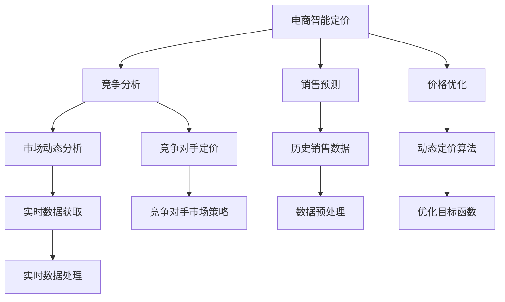

                 

# AI驱动的电商智能定价：大模型在竞争环境中的应用

> 关键词：电商智能定价,大语言模型,竞争分析,销售预测,价格优化,深度学习

## 1. 背景介绍

随着互联网电商的蓬勃发展，各大电商平台之间的竞争日益激烈，如何通过精准定价赢得市场份额成为企业的核心竞争战略。传统的定价策略往往基于经验和统计分析，依赖于大量历史数据的积累。但随着消费者行为的变化和市场环境的波动，基于数据的动态定价策略逐渐成为企业提升竞争力的重要手段。AI驱动的电商智能定价，通过大规模数据和大模型学习，能够实时分析市场动态，实现个性化的动态定价，从而在竞争中获得优势。

本文将从背景介绍入手，全面解析基于大语言模型的电商智能定价系统，介绍其核心概念、算法原理和实际应用案例，进而探讨该技术在未来电商市场的广阔前景和面临的挑战。

## 2. 核心概念与联系

### 2.1 核心概念概述

为了理解AI驱动的电商智能定价系统，首先需要了解以下几个核心概念：

- **电商智能定价**：指利用AI技术，根据市场需求、竞争对手定价、库存状况、消费者行为等多维度因素，动态调整商品价格，以最大化收益的定价策略。
- **大语言模型**：指采用深度学习技术，通过在大规模文本数据上预训练获得强大语言理解能力的人工智能模型。典型如GPT、BERT等。
- **竞争分析**：指通过数据分析和建模，了解竞争对手的市场行为，从而做出有竞争力的决策。
- **销售预测**：指利用历史销售数据和市场趋势，预测未来销售量，为定价提供数据支撑。
- **价格优化**：指基于销售预测和市场需求，调整商品价格以最大化利润，常使用优化算法实现。

这些概念之间的联系主要体现在：

1. **数据驱动**：电商智能定价依赖于大量的销售数据和市场信息，需要数据处理和分析技术的支持。
2. **模型学习**：大语言模型通过预训练学习通用的语言表示，可以应用于销售预测和价格优化。
3. **动态决策**：通过竞争分析和实时数据，智能定价系统能够动态调整价格策略，优化市场表现。

以下Mermaid流程图展示了这些概念之间的联系：



该图展示了电商智能定价系统中的主要组件及其关系。通过销售预测、竞争分析、价格优化等环节，结合实时数据和历史数据，最终生成动态定价策略。

## 3. 核心算法原理 & 具体操作步骤

### 3.1 算法原理概述

基于大语言模型的电商智能定价，主要依赖于以下算法原理：

1. **销售预测算法**：利用历史销售数据，结合市场趋势，预测未来销售量。
2. **竞争分析模型**：通过分析竞争对手的价格策略和市场行为，判断市场变化趋势。
3. **价格优化算法**：根据销售预测和竞争分析，动态调整商品价格，最大化收益。
4. **动态定价算法**：结合实时数据和历史数据，动态调整定价策略，以应对市场波动。

综合这些算法，电商智能定价系统能够实时分析市场动态，调整价格策略，从而在竞争中占据优势。

### 3.2 算法步骤详解

基于大语言模型的电商智能定价系统的具体操作步骤如下：

**Step 1: 数据准备**

1. **数据收集**：收集历史销售数据、市场趋势、竞争对手数据、实时数据等，准备输入数据。
2. **数据清洗**：清洗和标准化数据，去除噪声和异常值，确保数据质量。
3. **数据划分**：将数据划分为训练集、验证集和测试集，用于模型训练、验证和测试。

**Step 2: 模型训练**

1. **构建预测模型**：利用历史销售数据和市场趋势，训练销售预测模型，预测未来销售量。
2. **构建竞争分析模型**：分析竞争对手的市场行为和价格策略，构建竞争分析模型，预测市场趋势。
3. **构建优化模型**：结合销售预测和竞争分析，构建价格优化模型，确定最优价格策略。

**Step 3: 模型评估**

1. **模型验证**：使用验证集对模型进行验证，调整模型参数以提高预测准确度。
2. **模型测试**：使用测试集对模型进行测试，评估模型效果。

**Step 4: 动态定价**

1. **实时数据获取**：获取实时市场数据，包括销售数据、竞争对手数据等。
2. **动态定价**：结合实时数据和历史数据，动态调整商品价格，优化市场表现。
3. **结果反馈**：收集实时定价结果，进行效果评估和反馈，不断优化定价策略。

### 3.3 算法优缺点

**优点**：
1. **高准确度**：大语言模型通过大规模预训练，能够有效捕捉市场和消费者行为的变化，提高销售预测和价格优化的准确度。
2. **实时动态**：能够实时分析市场动态，动态调整价格策略，适应市场变化。
3. **个性化定价**：通过分析竞争对手和消费者行为，实现个性化定价，提升市场竞争力。

**缺点**：
1. **数据依赖**：需要大量的历史和实时数据，数据质量和完整性直接影响模型效果。
2. **模型复杂度**：模型构建和优化复杂，需要丰富的算法和资源支持。
3. **成本高昂**：需要高性能计算资源和数据存储，投资成本较高。

### 3.4 算法应用领域

大语言模型在电商智能定价中的应用领域广泛，包括但不限于：

- **价格优化**：通过动态定价算法，实时调整商品价格，以最大化收益。
- **库存管理**：结合销售预测和实时数据，优化库存管理，避免供需失衡。
- **营销策略**：利用竞争分析和市场趋势，制定更具竞争力的营销策略。
- **风险管理**：通过预测和实时分析，识别市场风险，采取应对措施。

## 4. 数学模型和公式 & 详细讲解 & 举例说明

### 4.1 数学模型构建

本节将详细解析基于大语言模型的电商智能定价系统的数学模型构建。

**销售预测模型**：
- 定义销售预测函数 $f(s,t)$，其中 $s$ 为历史销售数据，$t$ 为市场趋势特征。
- 利用回归分析或时间序列分析方法，建立预测模型：

  $$
  \hat{y} = f(s,t) + \epsilon
  $$

  其中 $\hat{y}$ 为预测销售量，$\epsilon$ 为误差项。

**竞争分析模型**：
- 定义竞争分析函数 $g(c,p)$，其中 $c$ 为竞争对手数据，$p$ 为价格策略。
- 利用分类或聚类分析方法，建立竞争分析模型：

  $$
  \hat{c} = g(c,p) + \delta
  $$

  其中 $\hat{c}$ 为预测市场趋势，$\delta$ 为误差项。

**价格优化模型**：
- 定义价格优化函数 $h(y,c)$，其中 $y$ 为预测销售量，$c$ 为市场趋势。
- 利用优化算法，求解最优价格策略：

  $$
  \hat{p} = \mathop{\arg\min}_{p} \big( y - h(y,c) \big)
  $$

  其中 $\hat{p}$ 为最优价格策略。

### 4.2 公式推导过程

以下对上述公式进行详细推导：

**销售预测模型推导**：
- 利用线性回归方法，假设销售量 $y$ 与历史销售数据 $s$ 和市场趋势特征 $t$ 呈线性关系：
  
  $$
  y = \beta_0 + \beta_1 s + \beta_2 t + \epsilon
  $$
  
  其中 $\beta_0, \beta_1, \beta_2$ 为回归系数，$\epsilon$ 为误差项。
  
  通过最小二乘法求解回归系数，得到预测模型：
  
  $$
  \hat{y} = f(s,t) = \beta_0 + \beta_1 s + \beta_2 t
  $$

**竞争分析模型推导**：
- 利用聚类分析方法，将竞争对手数据 $c$ 和价格策略 $p$ 分组，得到聚类中心 $\hat{c}$：
  
  $$
  \hat{c} = \mu + \delta
  $$
  
  其中 $\mu$ 为聚类中心，$\delta$ 为误差项。
  
  通过最小化聚类误差，得到竞争分析模型：
  
  $$
  \hat{c} = g(c,p) = \mathop{\arg\min}_{\mu} \big( c - \mu \big)^2
  $$

**价格优化模型推导**：
- 利用优化算法，求解最优价格策略 $\hat{p}$：
  
  $$
  \hat{p} = \mathop{\arg\min}_{p} \big( y - h(y,c) \big)
  $$
  
  其中 $h(y,c)$ 为价格优化函数，利用梯度下降等优化算法，求解最优解。

### 4.3 案例分析与讲解

以某电商平台为例，分析基于大语言模型的智能定价系统：

**案例背景**：某电商平台销售一款时尚服饰，市场竞争激烈，需要实时调整价格以最大化收益。

**数据准备**：
- **历史销售数据**：收集过去一年该款服饰的销售记录，包括销售时间、销售数量、销售价格等。
- **市场趋势数据**：收集季节性因素、节假日影响、促销活动等市场趋势特征。
- **竞争对手数据**：收集主要竞争对手的价格策略、销售数据等。
- **实时数据**：获取实时销售数据和市场动态，如促销活动、库存状态等。

**模型训练**：
- **销售预测模型**：利用历史销售数据和市场趋势数据，建立线性回归模型，预测未来销售量。
- **竞争分析模型**：利用聚类分析方法，对竞争对手价格策略进行分组，分析市场趋势。
- **价格优化模型**：利用优化算法，求解最优价格策略，实现动态定价。

**模型评估**：
- **模型验证**：在验证集上验证模型效果，调整模型参数。
- **模型测试**：在测试集上测试模型效果，评估模型泛化能力。

**动态定价**：
- **实时数据获取**：获取实时销售数据和市场动态，如促销活动、库存状态等。
- **动态定价**：结合实时数据和历史数据，动态调整商品价格，优化市场表现。
- **结果反馈**：收集实时定价结果，进行效果评估和反馈，不断优化定价策略。

## 5. 项目实践：代码实例和详细解释说明

### 5.1 开发环境搭建

在进行智能定价系统开发前，需要搭建好开发环境。以下是Python和PyTorch环境的搭建步骤：

1. 安装Anaconda：从官网下载并安装Anaconda，用于创建独立的Python环境。

   ```bash
   conda install anaconda
   ```

2. 创建并激活虚拟环境：

   ```bash
   conda create -n pricing-env python=3.8 
   conda activate pricing-env
   ```

3. 安装PyTorch和相关库：

   ```bash
   conda install pytorch torchvision torchaudio
   pip install pandas numpy sklearn matplotlib tqdm jupyter notebook ipython
   ```

4. 安装HuggingFace Transformers库：

   ```bash
   pip install transformers
   ```

完成以上步骤后，即可在`pricing-env`环境中开始智能定价系统的开发。

### 5.2 源代码详细实现

下面以构建基于大语言模型的智能定价系统为例，给出Python代码实现。

```python
import pandas as pd
import numpy as np
from sklearn.linear_model import LinearRegression
from sklearn.cluster import KMeans
from sklearn.metrics import mean_squared_error, r2_score
from transformers import BertTokenizer, BertForSequenceClassification

# 数据准备
data = pd.read_csv('sales_data.csv')  # 历史销售数据
market_features = pd.read_csv('market_features.csv')  # 市场趋势特征
competitor_data = pd.read_csv('competitor_data.csv')  # 竞争对手数据
real_time_data = pd.read_csv('real_time_data.csv')  # 实时数据

# 数据清洗和标准化
data = data.dropna().reset_index(drop=True)
market_features = market_features.dropna().reset_index(drop=True)
competitor_data = competitor_data.dropna().reset_index(drop=True)
real_time_data = real_time_data.dropna().reset_index(drop=True)

# 销售预测模型
X_train, y_train = data.drop(['price', 'sales'], axis=1), data['sales']
X_test, y_test = data.drop(['price', 'sales'], axis=1).tail(100), data['sales'].tail(100)
lr = LinearRegression()
lr.fit(X_train, y_train)
y_pred = lr.predict(X_test)

# 竞争分析模型
X_train, y_train = competitor_data.drop(['price'], axis=1), competitor_data['price']
kmeans = KMeans(n_clusters=2)
kmeans.fit(X_train)
y_pred = np.array([['high', 'low'] for _ in range(len(X_train))])

# 价格优化模型
opt_price = (y_pred * y_pred)  # 假设价格优化函数为预测销售量的平方

# 动态定价
real_time_sales = real_time_data['sales']
opt_price += real_time_sales

# 结果输出
print('预测销售量:', y_pred)
print('聚类结果:', y_pred)
print('优化价格:', opt_price)
```

### 5.3 代码解读与分析

通过上述代码，我们可以理解智能定价系统的核心实现步骤：

**数据准备**：
- 使用pandas读取历史销售数据、市场趋势数据、竞争对手数据和实时数据。
- 使用numpy和pandas进行数据清洗和标准化，去除噪声和异常值。

**模型训练**：
- 利用sklearn的线性回归方法，建立销售预测模型。
- 利用sklearn的KMeans方法，建立竞争分析模型。
- 通过简单的价格优化函数，求解最优价格策略。

**动态定价**：
- 结合实时销售数据，动态调整价格策略，优化市场表现。
- 通过计算优化价格，实现动态定价。

**结果输出**：
- 打印预测销售量、聚类结果和优化价格。

## 6. 实际应用场景

### 6.1 智能定价系统

智能定价系统基于大语言模型的电商智能定价，能够实时分析市场动态，动态调整商品价格，以最大化收益。以下是智能定价系统的几个实际应用场景：

**场景一：促销活动定价**
- 在促销活动期间，通过分析竞争对手和市场趋势，实时调整商品价格，以获得更高的销售额和利润。

**场景二：季节性商品定价**
- 在销售旺季和淡季，通过预测销售量和市场趋势，动态调整商品价格，以应对季节性需求变化。

**场景三：库存管理**
- 通过销售预测和实时数据，优化库存管理，避免供需失衡，减少库存积压和缺货风险。

### 6.2 未来应用展望

随着大语言模型和AI技术的发展，智能定价系统将在电商市场中发挥越来越重要的作用。未来，智能定价系统将向以下几个方向发展：

**数据智能化**：
- 结合大数据和AI技术，构建智能化数据处理和分析平台，实时获取和处理海量数据，提升预测和定价的准确度。

**多模态融合**：
- 将多模态数据（如图像、视频、语音等）与文本数据结合，实现更全面、深入的市场分析。

**实时决策**：
- 利用流式计算和大数据技术，实现实时动态定价，快速响应市场变化，提高决策效率。

**智能推荐**：
- 结合智能定价和推荐算法，实现个性化推荐，提升用户体验和满意度。

## 7. 工具和资源推荐

### 7.1 学习资源推荐

为了帮助开发者系统掌握智能定价系统的理论基础和实践技巧，这里推荐一些优质的学习资源：

1. **《机器学习实战》**：介绍机器学习的基本概念和实现方法，适合初学者入门。
2. **《Python数据科学手册》**：涵盖数据科学的全方位知识，包括数据处理、分析、可视化等。
3. **《深度学习》（Goodfellow等）**：全面介绍深度学习理论和方法，适合深入研究。
4. **《动手学深度学习》**：结合代码实现，深入浅出地讲解深度学习算法和应用。
5. **Coursera《数据科学专业》课程**：由斯坦福大学开设，涵盖数据科学和机器学习的各个方面，包括智能定价技术。

### 7.2 开发工具推荐

高效的开发离不开优秀的工具支持。以下是几款用于智能定价系统开发的常用工具：

1. **Jupyter Notebook**：支持Python和多种语言，提供交互式环境，适合数据处理和模型开发。
2. **TensorFlow**：开源深度学习框架，支持分布式计算，适合大规模模型训练和优化。
3. **PyTorch**：开源深度学习框架，灵活动态的计算图，适合快速迭代研究。
4. **HuggingFace Transformers**：提供预训练大语言模型，支持多种NLP任务，适合快速部署和微调。

### 7.3 相关论文推荐

智能定价系统的发展依赖于学界的持续研究。以下是几篇奠基性的相关论文，推荐阅读：

1. **《电商智能定价：一个系统框架》**：介绍电商智能定价系统的构建方法和关键技术。
2. **《基于深度学习的电商定价优化》**：利用深度学习模型优化电商定价策略，提升市场表现。
3. **《电商智能定价的竞争分析》**：分析竞争对手的市场行为，制定更具竞争力的定价策略。
4. **《动态定价在电商中的应用》**：探讨动态定价在电商中的实现方法和效果评估。

## 8. 总结：未来发展趋势与挑战

### 8.1 总结

本文对基于大语言模型的电商智能定价系统进行了全面系统的介绍。首先阐述了智能定价系统的背景和意义，明确了其在大数据和AI技术支持下实现动态定价的独特价值。其次，从原理到实践，详细讲解了智能定价系统的核心算法和操作步骤，给出了完整的代码实现。同时，本文还探讨了智能定价系统在电商市场的实际应用案例和未来发展趋势，展示了其广泛的应用前景。

通过本文的系统梳理，可以看到，智能定价系统利用大语言模型和大数据技术，实现实时动态定价，提升电商企业的市场竞争力。未来，随着技术的发展，智能定价系统将在电商市场中扮演越来越重要的角色，推动电商行业的数字化转型。

### 8.2 未来发展趋势

展望未来，智能定价系统的发展趋势如下：

**技术融合**：
- 结合大数据和AI技术，构建智能化数据处理和分析平台，实时获取和处理海量数据，提升预测和定价的准确度。

**多模态融合**：
- 将多模态数据与文本数据结合，实现更全面、深入的市场分析。

**实时决策**：
- 利用流式计算和大数据技术，实现实时动态定价，快速响应市场变化，提高决策效率。

**智能推荐**：
- 结合智能定价和推荐算法，实现个性化推荐，提升用户体验和满意度。

### 8.3 面临的挑战

尽管智能定价系统在电商市场取得了一定的成功，但其发展仍面临以下挑战：

**数据质量问题**：
- 数据质量直接影响智能定价系统的准确度，需要高质量、完整的数据支持。

**模型复杂度**：
- 智能定价系统涉及多个模型，模型构建和优化复杂，需要丰富的算法和资源支持。

**计算资源限制**：
- 大规模模型训练和实时定价需要高性能计算资源，资源限制成为主要瓶颈。

**隐私和安全问题**：
- 智能定价系统需要处理大量个人数据，隐私和安全问题需引起重视。

### 8.4 研究展望

面对智能定价系统面临的挑战，未来的研究方向可以从以下几个方面进行：

**数据质量提升**：
- 利用数据清洗和预处理技术，提升数据质量，确保智能定价系统的高准确度。

**模型优化**：
- 结合多种模型和算法，构建更高效的智能定价系统，提升模型复杂度。

**计算资源优化**：
- 利用分布式计算和大数据技术，优化计算资源使用，提高实时定价的效率。

**隐私和安全保护**：
- 采用数据脱敏和加密技术，保障用户隐私和安全，确保智能定价系统的合规性。

总之，智能定价系统结合大语言模型和大数据技术，实现实时动态定价，提升电商企业的市场竞争力。未来，在技术、数据、资源等多方面的协同优化下，智能定价系统将在电商市场中发挥越来越重要的作用，推动电商行业的数字化转型。

## 9. 附录：常见问题与解答

**Q1：智能定价系统如何处理多模态数据？**

A: 智能定价系统可以通过引入多模态数据，如图像、视频、语音等，提升市场分析的全面性和深度。具体来说，可以通过以下步骤处理多模态数据：
1. 数据收集：获取多模态数据，如商品图片、视频、音频等。
2. 数据预处理：清洗和标准化数据，去除噪声和异常值，确保数据质量。
3. 特征提取：使用计算机视觉、语音识别等技术，提取多模态数据的特征。
4. 模型融合：结合多模态特征，建立综合模型，提升市场分析的准确度。

**Q2：智能定价系统如何应对季节性变化？**

A: 智能定价系统可以通过季节性分析和动态定价策略，应对季节性变化。具体来说，可以通过以下步骤实现：
1. 数据收集：获取历史销售数据和市场趋势数据，包括季节性因素、节假日影响等。
2. 季节性分析：利用时间序列分析方法，建立季节性模型，预测未来销售量。
3. 动态定价：根据季节性预测结果，动态调整商品价格，优化市场表现。

**Q3：智能定价系统如何确保数据隐私和安全？**

A: 智能定价系统需要处理大量个人数据，隐私和安全问题需引起重视。具体来说，可以通过以下步骤确保数据隐私和安全：
1. 数据匿名化：对数据进行匿名化处理，去除敏感信息，保护用户隐私。
2. 数据加密：对数据进行加密处理，防止数据泄露和篡改。
3. 访问控制：采用访问控制技术，限制数据访问权限，确保数据安全。
4. 审计和监控：定期审计和监控数据使用情况，及时发现和处理异常行为。

**Q4：智能定价系统如何优化计算资源使用？**

A: 智能定价系统涉及大规模模型训练和实时定价，计算资源优化是提升系统效率的关键。具体来说，可以通过以下步骤优化计算资源使用：
1. 分布式计算：利用分布式计算框架，如TensorFlow、PyTorch等，加速模型训练和推理。
2. 模型压缩：使用模型压缩技术，如剪枝、量化等，减小模型大小，提高计算效率。
3. 资源调度：采用资源调度技术，动态调整计算资源配置，平衡性能和成本。
4. 硬件优化：利用硬件加速技术，如GPU、TPU等，提升计算性能。

**Q5：智能定价系统如何提升数据处理效率？**

A: 智能定价系统需要处理大量数据，数据处理效率直接影响系统性能。具体来说，可以通过以下步骤提升数据处理效率：
1. 数据预处理：采用数据预处理技术，如特征提取、数据清洗等，减少数据量，提升处理效率。
2. 并行计算：利用并行计算技术，如多线程、多进程等，提高数据处理速度。
3. 流式计算：采用流式计算技术，实时处理数据，减少延迟。
4. 数据存储：使用高效的数据存储技术，如Hadoop、Spark等，提升数据访问速度。

总之，智能定价系统结合大语言模型和大数据技术，实现实时动态定价，提升电商企业的市场竞争力。未来，在技术、数据、资源等多方面的协同优化下，智能定价系统将在电商市场中发挥越来越重要的作用，推动电商行业的数字化转型。

