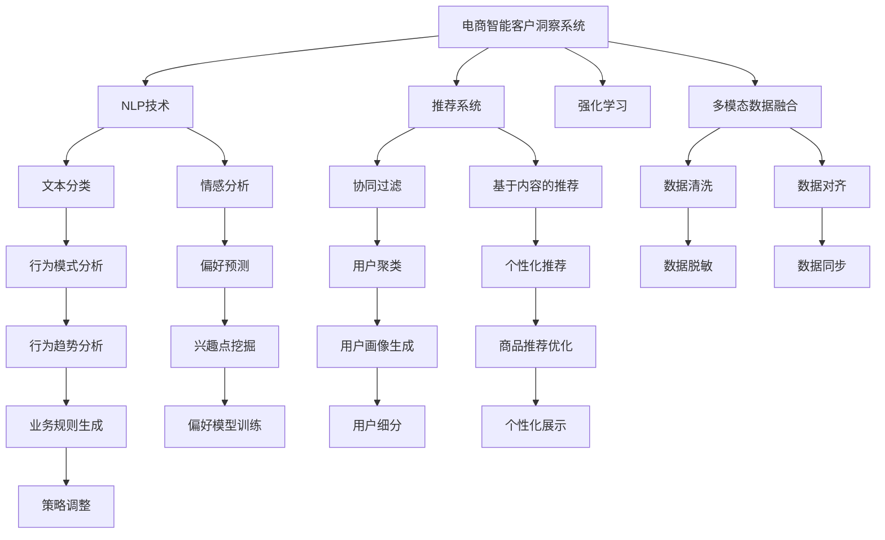

                 

## 1. 背景介绍

随着电商市场的日益成熟，客户洞察在提升销售效率、优化用户体验、发掘新的商业机会等方面的重要性日益凸显。传统客户洞察主要依赖于人工分析和调查问卷，但这些方法存在诸多局限性：如分析结果受限于分析人员的专业水平，问卷设计困难，数据处理周期长，结果解释难度大等。这些问题亟需通过技术手段进行突破。

AI技术，尤其是深度学习和自然语言处理(NLP)技术的发展，为电商智能客户洞察系统的构建提供了新的可能。智能客户洞察系统通过综合利用自然语言处理、推荐系统、强化学习等多模态数据，全面挖掘客户的购买行为、偏好、需求等信息，并转化为对实际业务有益的洞察。

## 2. 核心概念与联系

### 2.1 核心概念概述

为更好地理解AI驱动的电商智能客户洞察系统，本节将介绍几个密切相关的核心概念：

- **电商智能客户洞察系统**：基于AI技术，通过综合利用自然语言处理、推荐系统、强化学习等多模态数据，全面挖掘客户的购买行为、偏好、需求等信息，并转化为对实际业务有益的洞察。

- **自然语言处理(NLP)**：涉及计算机对自然语言进行理解和生成的技术。电商客户评论、客服对话等自然语言文本是客户洞察的重要数据来源。

- **推荐系统**：通过分析用户行为数据，推荐用户可能感兴趣的商品或服务。智能客户洞察系统可以结合推荐系统数据，挖掘更深层次的客户需求。

- **强化学习**：通过与环境的交互，学习最优策略以最大化累积奖励。在电商智能客户洞察中，可以用于优化广告投放、价格策略等决策。

- **多模态数据融合**：整合结构化数据、半结构化数据和非结构化数据，提升客户洞察的全面性和深度。

这些核心概念之间的逻辑关系可以通过以下Mermaid流程图来展示：



这个流程图展示了大语言模型的核心概念及其之间的关系：

1. 电商智能客户洞察系统利用NLP、推荐系统和强化学习技术，从多个数据源中提取信息。
2. 文本分类、情感分析等NLP任务用于文本数据的理解和提取。
3. 协同过滤、基于内容的推荐等推荐系统技术用于商品推荐。
4. 强化学习用于优化策略，提升客户体验和转化率。
5. 多模态数据融合确保了不同数据源之间的信息整合。
6. 最终洞察结果可通过行为模式分析、兴趣点挖掘、用户画像生成等形成业务规则和策略，实现电商业务的全方位优化。

## 3. 核心算法原理 & 具体操作步骤

### 3.1 算法原理概述

AI驱动的电商智能客户洞察系统本质上是一个跨领域的深度学习系统，通过多模态数据的融合和学习，实现对客户行为的深入理解。其核心算法原理包括以下几个方面：

- **自然语言处理(NLP)**：利用文本分类、情感分析等NLP任务，从客户评论、客服对话等自然语言数据中提取客户情绪和意图。
- **推荐系统**：通过协同过滤、基于内容的推荐等技术，为用户推荐可能感兴趣的商品或服务，同时学习用户的行为模式和偏好。
- **强化学习**：通过与用户交互，不断调整商品价格、广告投放等策略，提升客户满意度和转化率。
- **多模态数据融合**：将用户行为数据、商品属性数据、客户评价数据等进行统一处理和融合，形成更加全面和准确的用户画像。

系统通过这些技术的结合，不断学习客户行为数据，提炼出有价值的洞察，并将其转化为可操作的业务决策。

### 3.2 算法步骤详解

#### 3.2.1 数据收集与预处理

- **数据来源**：电商平台的客户评论、客服对话、交易记录、广告点击记录、社交媒体互动等。
- **数据清洗**：去除无关信息、错误数据、噪声等，确保数据质量。
- **数据对齐**：将不同数据源的数据进行统一，确保一致性。

#### 3.2.2 NLP文本处理

- **文本分类**：将客户评论、客服对话等文本数据进行分类，识别其主题和情绪。
- **情感分析**：分析客户情感倾向，判断正面、负面或中性情绪。
- **实体抽取**：从文本中识别出关键实体，如品牌、商品名称、用户ID等。

#### 3.2.3 推荐系统建模

- **协同过滤**：基于用户历史行为和兴趣，推荐可能感兴趣的商品或服务。
- **基于内容的推荐**：结合商品属性、标签等信息，推荐最符合用户需求的物品。
- **个性化推荐优化**：通过模型迭代和用户反馈，不断优化推荐算法，提升推荐效果。

#### 3.2.4 强化学习策略优化

- **奖励设计**：定义奖励函数，如点击率、转化率、满意度等指标。
- **策略学习**：通过与环境（用户行为）的交互，学习最优策略，如价格调整、广告投放等。
- **策略评估**：通过A/B测试等方法评估策略效果，持续优化。

#### 3.2.5 多模态数据融合

- **数据整合**：将用户行为数据、商品属性数据、客户评价数据等进行统一处理。
- **数据同步**：确保不同数据源之间的数据一致性，避免信息偏差。
- **特征工程**：提取和融合关键特征，形成更加全面和准确的用户画像。

#### 3.2.6 洞察结果应用

- **行为模式分析**：通过分析用户行为数据，挖掘行为规律和趋势。
- **兴趣点挖掘**：基于用户画像，预测用户的兴趣点和需求。
- **用户画像生成**：结合多模态数据，形成全面的用户画像。
- **业务规则生成**：根据洞察结果，生成可操作的业务规则和策略。

#### 3.2.7 系统部署与迭代

- **模型部署**：将训练好的模型部署到实际业务环境中，进行实时预测和决策。
- **模型监控**：实时监控模型性能和数据质量，及时进行调整。
- **模型迭代**：基于最新数据和业务反馈，持续迭代优化模型，提升效果。

### 3.3 算法优缺点

#### 3.3.1 优点

1. **全面性**：多模态数据的融合，能够提供全面且深入的客户洞察，涵盖行为、情感、偏好等多个方面。
2. **实时性**：基于实时数据进行学习和优化，能够快速响应市场变化，提升客户满意度。
3. **自动化**：自动化学习和优化过程，降低了人工干预成本，提高了效率。
4. **可解释性**：通过对数据的深入分析，能够提供透明和可解释的洞察，帮助业务人员理解和应用结果。

#### 3.3.2 缺点

1. **数据质量要求高**：依赖高质量、全面且一致的数据，对数据清洗和预处理的要求较高。
2. **算法复杂度大**：涉及多个子算法和模型，算法复杂度较高，实现难度大。
3. **模型更新频繁**：需要持续更新和优化模型，对算力要求较高。
4. **用户隐私问题**：处理大量个人数据，需要重视用户隐私保护。

### 3.4 算法应用领域

AI驱动的电商智能客户洞察系统已经在多个电商领域取得了显著效果，覆盖了从产品推荐、广告投放、个性化营销到客户服务等多个环节。具体应用领域包括：

- **商品推荐**：结合用户行为数据和偏好，推荐最符合用户需求的商品。
- **广告投放优化**：根据用户画像和行为数据，优化广告投放策略，提升转化率。
- **客户服务改进**：通过情感分析等技术，提升客服系统效率，提高客户满意度。
- **价格策略调整**：基于用户行为和市场趋势，调整商品价格，提升销售收益。
- **库存管理**：预测商品需求，优化库存管理，减少库存积压。

这些应用场景展示了AI驱动的电商智能客户洞察系统的广泛应用价值和潜力。

## 4. 数学模型和公式 & 详细讲解

### 4.1 数学模型构建

本节将使用数学语言对AI驱动的电商智能客户洞察系统进行更加严格的刻画。

假设电商平台的客户数据为 $D=\{(x_i, y_i)\}_{i=1}^N$，其中 $x_i$ 为包含用户行为、商品属性、客户评价等特征的向量， $y_i$ 为标签向量，表示用户对商品的态度（如购买、评价、投诉等）。

定义模型 $M$ 在输入 $x$ 上的输出为 $M(x)$，为一个多维向量，其中每个元素表示用户对对应商品的态度得分。模型的目标是最小化损失函数：

$$
\mathcal{L}(M) = \frac{1}{N}\sum_{i=1}^N \ell(M(x_i),y_i)
$$

其中 $\ell$ 为损失函数，常用的包括交叉熵损失、均方误差损失等。

### 4.2 公式推导过程

以下我们以交叉熵损失函数为例，推导损失函数及其梯度的计算公式。

假设模型 $M(x)$ 输出为 $M(x)=\{p_i\}_{i=1}^m$，其中 $p_i$ 表示用户对第 $i$ 个商品的态度得分。真实标签 $y=\{y_i\}_{i=1}^m$，其中 $y_i=1$ 表示用户购买了该商品，$y_i=0$ 表示用户未购买该商品。则交叉熵损失函数定义为：

$$
\ell(M(x),y) = -\sum_{i=1}^m y_i\log p_i + (1-y_i)\log(1-p_i)
$$

将其代入经验风险公式，得：

$$
\mathcal{L}(M) = -\frac{1}{N}\sum_{i=1}^N \sum_{j=1}^m y_j\log p_j
$$

根据链式法则，损失函数对模型参数 $\theta_k$ 的梯度为：

$$
\frac{\partial \mathcal{L}(M)}{\partial \theta_k} = -\frac{1}{N}\sum_{i=1}^N \sum_{j=1}^m y_j \frac{\partial p_j}{\partial \theta_k}
$$

其中 $\frac{\partial p_j}{\partial \theta_k}$ 为输出层对参数 $\theta_k$ 的偏导数，可进一步递归展开，利用反向传播算法完成计算。

### 4.3 案例分析与讲解

假设某电商平台收集了用户的购买记录、评论记录、浏览记录等数据，并使用AI驱动的智能客户洞察系统对客户进行分析和预测。具体步骤如下：

1. **数据收集**：收集用户的基本信息、购买记录、评论记录、浏览记录等数据，形成原始数据集。
2. **数据预处理**：对数据进行清洗和对齐，去除无关信息，确保数据一致性。
3. **特征工程**：提取关键特征，如用户ID、商品ID、购买时间、评论情感等，形成特征向量 $x_i$。
4. **模型训练**：使用训练集 $D$ 训练模型 $M$，最小化交叉熵损失函数。
5. **模型评估**：在验证集上评估模型性能，调整超参数。
6. **预测与优化**：利用训练好的模型对新数据进行预测，优化商品推荐、广告投放等策略。

通过以上步骤，可以构建起一个基于AI的电商智能客户洞察系统，帮助电商平台更好地理解客户需求，提升用户体验和销售效率。

## 5. 项目实践：代码实例和详细解释说明

### 5.1 开发环境搭建

在进行智能客户洞察系统开发前，我们需要准备好开发环境。以下是使用Python进行TensorFlow开发的环境配置流程：

1. 安装Anaconda：从官网下载并安装Anaconda，用于创建独立的Python环境。

2. 创建并激活虚拟环境：
```bash
conda create -n tf-env python=3.8 
conda activate tf-env
```

3. 安装TensorFlow：根据CUDA版本，从官网获取对应的安装命令。例如：
```bash
conda install tensorflow tensorflow-gpu==2.8 -c tf -c conda-forge
```

4. 安装其他工具包：
```bash
pip install pandas scikit-learn numpy matplotlib joblib
```

完成上述步骤后，即可在`tf-env`环境中开始项目实践。

### 5.2 源代码详细实现

这里我们以推荐系统建模为例，给出使用TensorFlow进行电商智能客户洞察的代码实现。

首先，定义推荐系统的数据处理函数：

```python
import tensorflow as tf
import numpy as np

def load_data(file_path, batch_size):
    dataset = tf.data.TextLineDataset(file_path)
    dataset = dataset.shuffle(buffer_size=1024).batch(batch_size)
    return dataset
```

然后，定义模型和优化器：

```python
class RecommendationModel(tf.keras.Model):
    def __init__(self, vocab_size, embedding_dim, num_classes):
        super(RecommendationModel, self).__init__()
        self.embedding = tf.keras.layers.Embedding(vocab_size, embedding_dim, input_length=1)
        self.fc1 = tf.keras.layers.Dense(128, activation='relu')
        self.fc2 = tf.keras.layers.Dense(num_classes, activation='sigmoid')

    def call(self, inputs):
        x = self.embedding(inputs)
        x = self.fc1(x)
        x = self.fc2(x)
        return x

model = RecommendationModel(vocab_size=1000, embedding_dim=16, num_classes=1)

optimizer = tf.keras.optimizers.Adam(learning_rate=0.001)
```

接着，定义训练和评估函数：

```python
@tf.function
def train_step(inputs, labels):
    with tf.GradientTape() as tape:
        predictions = model(inputs)
        loss = tf.losses.sparse_binary_crossentropy(labels, predictions)
    grads = tape.gradient(loss, model.trainable_variables)
    optimizer.apply_gradients(zip(grads, model.trainable_variables))
    return loss

@tf.function
def evaluate(model, dataset):
    total_loss = 0.0
    for inputs, labels in dataset:
        predictions = model(inputs)
        loss = tf.losses.sparse_binary_crossentropy(labels, predictions)
        total_loss += loss
    return total_loss
```

最后，启动训练流程并在测试集上评估：

```python
batch_size = 32
num_epochs = 10

dataset = load_data('data.txt', batch_size)
train_dataset = dataset.shuffle(buffer_size=1024)
test_dataset = dataset.batch(1)

for epoch in range(num_epochs):
    for inputs, labels in train_dataset:
        loss = train_step(inputs, labels)
        print(f'Epoch {epoch+1}, Loss: {loss.numpy():.4f}')
    test_loss = evaluate(model, test_dataset)
    print(f'Test Loss: {test_loss.numpy():.4f}')
```

以上就是使用TensorFlow进行电商智能客户洞察的推荐系统代码实现。可以看到，TensorFlow提供的高级API使得模型定义和训练变得简洁高效。

### 5.3 代码解读与分析

让我们再详细解读一下关键代码的实现细节：

**load_data函数**：
- 加载文本文件，将其转换为TensorFlow的Dataset对象。
- 对数据进行随机打乱和批次化，保证训练的随机性和稳定性。

**RecommendationModel类**：
- 定义了嵌入层、全连接层和输出层。
- 通过`__init__`方法初始化模型结构。
- `call`方法定义前向传播过程。

**train_step函数**：
- 定义训练过程，包括计算损失、反向传播和参数更新。

**evaluate函数**：
- 定义评估过程，计算模型在测试集上的平均损失。

**训练流程**：
- 定义批次大小和迭代轮数。
- 在训练集上训练，每次迭代计算损失并更新模型参数。
- 在测试集上评估，输出模型损失。

通过以上代码，可以构建一个简单的电商智能客户洞察系统，实现基于推荐系统的商品推荐功能。

## 6. 实际应用场景

### 6.1 智能推荐系统

智能推荐系统是AI驱动的电商智能客户洞察系统的核心应用之一。通过分析用户行为数据和偏好，推荐系统能够为用户推荐最感兴趣的商品，提升用户体验和销售转化率。

具体而言，电商平台可以收集用户的历史浏览、购买、评价等数据，结合商品属性、标签等信息，构建推荐模型。通过在线学习，不断调整推荐策略，提升推荐效果。推荐系统能够动态优化商品排序，提高转化率，降低运营成本。

### 6.2 个性化广告投放

个性化广告投放是电商智能客户洞察系统的另一个重要应用。通过分析用户画像和行为数据，广告投放系统能够精准定位目标用户，提升广告投放效果。

电商平台可以结合用户的行为数据和兴趣点，生成详细的用户画像。基于这些画像，广告投放系统能够预测用户对不同广告的响应概率，优化广告投放策略，提升点击率和转化率。个性化广告投放不仅能够提高广告效果，还能降低广告成本，提升用户体验。

### 6.3 客户服务优化

客户服务优化是AI驱动的电商智能客户洞察系统的另一个重要应用。通过情感分析、意图识别等技术，智能客服系统能够自动化处理客户咨询，提升服务效率和质量。

电商平台可以收集客户的服务记录和评价数据，构建情感分析模型。基于情感分析结果，智能客服系统能够判断客户的情绪状态，及时进行情绪安抚或问题解答。智能客服系统还能够根据客户的历史行为数据，推荐合适的解决方案，提升客户满意度。客户服务优化能够显著提升用户粘性和忠诚度，降低客户流失率。

### 6.4 未来应用展望

随着AI技术的不断进步，基于电商智能客户洞察系统的应用场景将进一步拓展，为电商业务带来更多创新和变革：

1. **智能定价**：通过分析用户行为数据和市场趋势，智能定价系统能够自动调整商品价格，优化利润率。
2. **库存管理**：基于用户行为数据和市场需求预测，智能库存管理系统能够优化库存分配，降低库存积压和缺货风险。
3. **交叉销售**：通过分析用户画像和行为数据，交叉销售系统能够推荐相关商品，提升销售机会。
4. **市场趋势分析**：通过情感分析和行为模式分析，市场趋势分析系统能够预测市场动态，帮助商家制定战略决策。
5. **用户行为预测**：通过深度学习模型，预测用户未来的购买行为，提前进行促销活动，提升销售转化率。

以上应用场景展示了AI驱动的电商智能客户洞察系统的广泛应用价值和潜力。

## 7. 工具和资源推荐

### 7.1 学习资源推荐

为了帮助开发者系统掌握AI驱动的电商智能客户洞察系统的理论基础和实践技巧，这里推荐一些优质的学习资源：

1. **《深度学习》课程**：斯坦福大学开设的深度学习课程，涵盖了深度学习的基本原理和实际应用，非常适合初学者入门。
2. **《自然语言处理》书籍**：由斯坦福大学讲师自然语言处理领域的经典教材，全面介绍了自然语言处理的各个环节。
3. **《推荐系统实战》书籍**：介绍了推荐系统的基本原理和实际应用，结合具体案例和代码实例，非常实用。
4. **TensorFlow官方文档**：详细介绍了TensorFlow的使用方法，包括模型定义、训练、评估等环节，是TensorFlow开发必备资源。
5. **Kaggle竞赛平台**：提供大量数据集和比赛，可以锻炼数据处理和模型优化能力，提升实战经验。

通过对这些资源的学习实践，相信你一定能够快速掌握AI驱动的电商智能客户洞察系统的精髓，并用于解决实际的电商业务问题。

### 7.2 开发工具推荐

高效的开发离不开优秀的工具支持。以下是几款用于AI驱动的电商智能客户洞察系统开发的常用工具：

1. **TensorFlow**：由Google主导开发的开源深度学习框架，生产部署方便，适合大规模工程应用。
2. **PyTorch**：Facebook开发的深度学习框架，灵活高效，适合研究和实验。
3. **Scikit-learn**：Python中的经典机器学习库，提供了丰富的算法和工具，非常适合数据处理和模型优化。
4. **Jupyter Notebook**：开源的交互式开发环境，支持Python、R等语言，非常适合数据处理和模型实验。
5. **Anaconda**：Python环境管理和软件包管理工具，方便安装和管理第三方库。

合理利用这些工具，可以显著提升AI驱动的电商智能客户洞察系统开发效率，加快创新迭代的步伐。

### 7.3 相关论文推荐

AI驱动的电商智能客户洞察系统的发展源于学界的持续研究。以下是几篇奠基性的相关论文，推荐阅读：

1. **《深度学习与推荐系统》论文**：介绍了深度学习在推荐系统中的应用，提供了深度学习与推荐系统融合的最新进展。
2. **《基于情感分析的客户服务优化》论文**：研究了情感分析在客户服务中的应用，提出了基于情感分析的智能客服系统。
3. **《强化学习在电商中的应用》论文**：研究了强化学习在电商中的多种应用，包括智能定价、库存管理、客户服务优化等。
4. **《多模态数据融合在电商中的应用》论文**：研究了多模态数据融合技术在电商中的多种应用，包括推荐系统、广告投放、客户服务优化等。

这些论文代表了大语言模型微调技术的发展脉络。通过学习这些前沿成果，可以帮助研究者把握学科前进方向，激发更多的创新灵感。

## 8. 总结：未来发展趋势与挑战

### 8.1 总结

本文对AI驱动的电商智能客户洞察系统进行了全面系统的介绍。首先阐述了电商智能客户洞察系统的背景和应用价值，明确了其对电商业务的重要影响。其次，从原理到实践，详细讲解了电商智能客户洞察系统的核心算法原理和操作步骤，给出了电商推荐系统的代码实现。同时，本文还广泛探讨了智能客户洞察系统在多个电商领域的应用前景，展示了其广泛的应用价值和潜力。此外，本文精选了电商智能客户洞察系统的学习资源、开发工具和相关论文，力求为读者提供全方位的技术指引。

通过本文的系统梳理，可以看到，AI驱动的电商智能客户洞察系统正成为电商业务的重要助力，极大地提升了客户洞察的全面性和深度。未来，伴随AI技术的不断进步，智能客户洞察系统将在电商业务中发挥更大的作用，推动电商业务的持续创新和变革。

### 8.2 未来发展趋势

展望未来，AI驱动的电商智能客户洞察系统将呈现以下几个发展趋势：

1. **深度学习与推荐系统的融合**：深度学习与推荐系统的结合，将进一步提升推荐效果，实现更精准的个性化推荐。
2. **多模态数据的融合**：整合结构化数据、半结构化数据和非结构化数据，提升客户洞察的全面性和深度。
3. **强化学习的应用**：利用强化学习技术，优化广告投放、定价策略等，提升客户满意度和转化率。
4. **跨领域应用的拓展**：基于电商智能客户洞察系统的技术和方法，拓展到金融、医疗、教育等多个领域，提升业务决策的准确性和效率。
5. **实时性需求的提升**：实时数据处理和决策，能够快速响应市场变化，提升客户满意度和转化率。

以上趋势凸显了AI驱动的电商智能客户洞察系统的广阔前景。这些方向的探索发展，必将进一步提升客户洞察系统的性能和应用范围，为电商业务带来更多创新和变革。

### 8.3 面临的挑战

尽管AI驱动的电商智能客户洞察系统已经取得了显著成效，但在迈向更加智能化、普适化应用的过程中，它仍面临诸多挑战：

1. **数据质量要求高**：依赖高质量、全面且一致的数据，对数据清洗和预处理的要求较高。
2. **算法复杂度大**：涉及多个子算法和模型，算法复杂度较高，实现难度大。
3. **模型更新频繁**：需要持续更新和优化模型，对算力要求较高。
4. **用户隐私问题**：处理大量个人数据，需要重视用户隐私保护。
5. **业务适配性**：不同电商平台的业务模式和数据特点差异较大，需要根据实际情况进行调整。

这些挑战需要业界共同努力，通过技术创新和管理改进，不断突破，实现客户洞察系统的全面优化。

### 8.4 研究展望

面对AI驱动的电商智能客户洞察系统所面临的挑战，未来的研究需要在以下几个方面寻求新的突破：

1. **大数据处理**：利用分布式计算和高效数据处理技术，提升数据处理和模型训练的效率。
2. **实时数据处理**：研究实时数据处理和决策技术，提升系统的响应速度和实时性。
3. **多模态数据融合**：研究多模态数据的整合和融合技术，提升客户洞察的全面性和深度。
4. **个性化推荐**：研究更加个性化的推荐算法，提升推荐效果和用户体验。
5. **隐私保护**：研究隐私保护技术和方法，保障用户数据安全和隐私。

这些研究方向的应用和优化，将使AI驱动的电商智能客户洞察系统更加高效、可靠和智能，为电商业务带来更多创新和变革。面向未来，智能客户洞察系统需要在技术创新和管理改进两个方面进行全面提升，实现业务效益的最大化。

## 9. 附录：常见问题与解答

**Q1：智能推荐系统如何优化？**

A: 智能推荐系统可以通过以下方式进行优化：

1. **模型选择和调参**：选择合适的推荐算法和超参数，并进行调优，提升推荐效果。
2. **数据增强**：通过数据扩充、回译等方式，提升数据的多样性和代表性。
3. **实时学习**：利用在线学习技术，实时更新模型，适应新的用户行为和偏好。
4. **模型集成**：通过模型集成，融合多个推荐模型的优势，提升整体推荐效果。
5. **用户反馈**：结合用户反馈数据，动态调整推荐策略，提升个性化推荐效果。

通过以上方式，可以不断优化智能推荐系统，提升推荐效果和用户体验。

**Q2：如何处理用户隐私问题？**

A: 处理用户隐私问题，需要从多个方面进行考虑：

1. **数据匿名化**：在数据处理过程中，对用户信息进行匿名化处理，保护用户隐私。
2. **数据加密**：在数据传输和存储过程中，使用加密技术，防止数据泄露。
3. **隐私政策透明**：公开透明的隐私政策，告知用户数据的使用范围和方式，建立用户信任。
4. **用户授权**：在使用用户数据前，获取用户的明确授权，保障用户知情权和选择权。
5. **合规性管理**：遵守相关法律法规，如GDPR等，确保数据处理和使用符合法律要求。

通过以上措施，可以有效保障用户隐私安全，建立可信的用户关系。

**Q3：电商智能客户洞察系统如何部署？**

A: 电商智能客户洞察系统的部署可以从以下几个方面进行考虑：

1. **模型训练**：在分布式计算环境下，利用GPU或TPU等高性能设备，进行模型训练和优化。
2. **模型部署**：将训练好的模型部署到云服务器或本地服务器，进行实时推理。
3. **系统监控**：实时监控模型性能和数据质量，及时进行调整和优化。
4. **接口设计**：设计标准化API接口，方便其他系统调用。
5. **用户界面**：开发友好的用户界面，便于业务人员使用和操作。

通过以上步骤，可以将电商智能客户洞察系统部署到实际业务环境中，实现实时预测和决策。

---

作者：禅与计算机程序设计艺术 / Zen and the Art of Computer Programming

