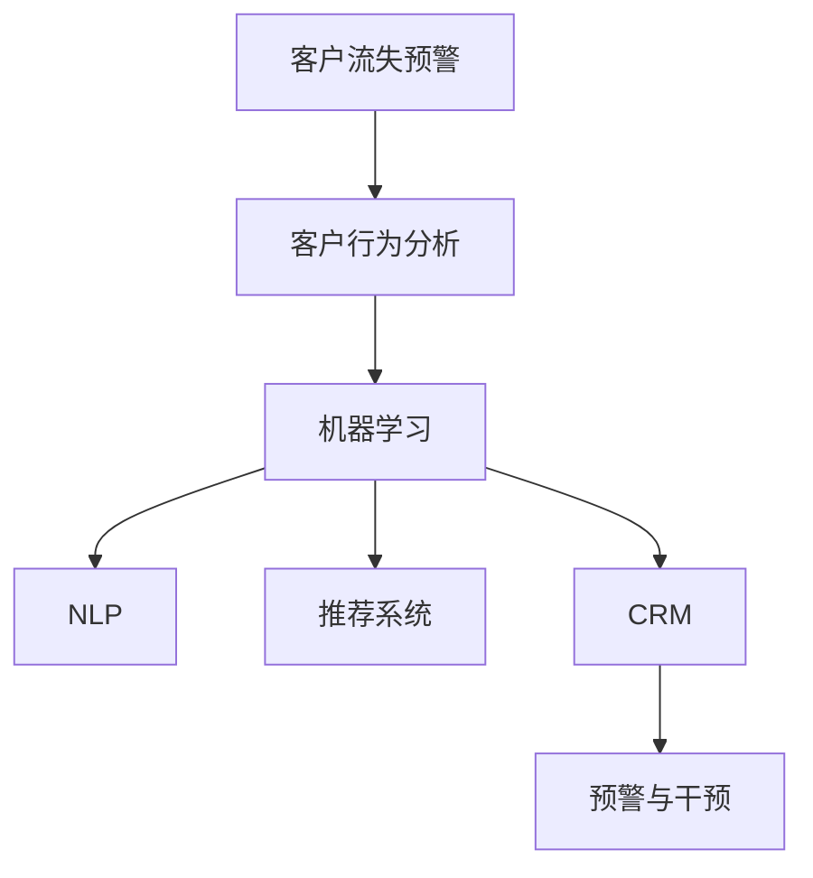
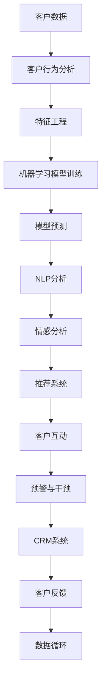

                 

# AI驱动的电商智能客户流失预警与干预系统

> 关键词：人工智能, 电商客户流失预警, 客户行为分析, 机器学习, 自然语言处理, 推荐系统, 客户关系管理

## 1. 背景介绍

### 1.1 问题由来

在快速发展的电子商务环境中，客户流失率一直是一个影响企业长期生存和发展的重大问题。客户流失不仅会导致企业损失现有的利润，而且会降低未来的市场份额和利润潜力。根据相关研究，企业流失一个客户的成本约为5-20倍于其在客户身上的投资。这给企业带来了巨大的经济损失，也考验着企业在数字化时代中如何保持和提升客户粘性。

企业为了解决客户流失问题，通常会采用传统的方式，如加强售后服务、提高产品质量、降低价格等。但这些方法往往只能解决部分问题，无法从根本上改变客户流失的本质。而随着人工智能和大数据技术的不断发展，借助AI驱动的智能预警和干预系统，企业可以更全面、更主动地预测和干预客户流失，提高客户留存率，从而显著提升企业的竞争力和盈利能力。

### 1.2 问题核心关键点

为了从技术层面实现电商客户流失预警与干预系统的构建，本节将重点介绍一些核心概念和关键技术点：

- 客户流失预警：通过分析和预测客户行为，提前识别出可能流失的客户群体，从而及时采取措施。
- 客户行为分析：通过数据挖掘和机器学习技术，深入理解客户在电商平台上的行为模式和心理特征。
- 机器学习：运用监督学习、无监督学习、强化学习等算法，从大量数据中学习和挖掘客户流失的规律。
- 自然语言处理（NLP）：通过文本分析、情感分析等技术，分析客户的评论、反馈、投诉等文本数据。
- 推荐系统：利用协同过滤、基于内容的推荐算法，提升客户体验，减少流失。
- 客户关系管理（CRM）：通过综合运用AI技术，对客户数据进行管理、分析和应用，实现智能化的客户管理。

这些核心概念之间的逻辑关系可以通过以下Mermaid流程图来展示：



这个流程图展示了这个系统各模块间的逻辑关系：

1. 系统首先通过客户行为分析模块，从历史数据中提取有价值的特征信息。
2. 接着，将这些特征输入到机器学习模块，学习出客户流失的概率模型。
3. 然后，通过自然语言处理模块，进一步从客户反馈和评论中挖掘更多的情感和行为线索。
4. 再结合推荐系统，提升客户体验，减少流失。
5. 最后，将预警结果输入客户关系管理模块，进行干预措施的实施。

## 2. 核心概念与联系

### 2.1 核心概念概述

为了更好地理解AI驱动的电商客户流失预警与干预系统的原理和应用，本节将介绍几个关键的概念：

- **客户流失预警系统**：通过预测客户流失的概率，提前识别潜在流失客户，并采取相应措施降低流失风险。
- **客户行为分析**：通过分析客户的浏览、购买、评价等行为，挖掘客户的偏好、需求和行为模式，为预警和干预提供数据支撑。
- **机器学习**：利用监督学习、无监督学习和强化学习算法，从历史数据中挖掘出客户流失的规律和特征，构建预测模型。
- **自然语言处理（NLP）**：通过分析客户评论、反馈等文本数据，进一步了解客户的情感倾向和需求，补充行为分析的不足。
- **推荐系统**：通过协同过滤、基于内容的推荐算法，优化客户购物体验，提升客户满意度，减少流失风险。
- **客户关系管理（CRM）**：通过综合应用AI技术，对客户数据进行管理和应用，实现精准的客户服务和营销，提升客户忠诚度。

这些概念之间的联系是通过数据驱动的流程进行串联的。客户行为数据通过机器学习算法，生成客户流失的概率预测模型；再结合NLP技术，从客户评论中挖掘更多的情感和行为线索；推荐系统根据客户行为特征提供个性化推荐，减少流失；预警结果通过CRM系统进行针对性的干预措施，形成闭环的客户管理流程。

### 2.2 核心概念原理和架构的 Mermaid 流程图



在这个流程图中，数据从客户开始，依次通过客户行为分析、特征工程、机器学习模型训练、模型预测、NLP分析、情感分析、推荐系统、客户互动、预警与干预和CRM系统，最终形成数据循环。

## 3. 核心算法原理 & 具体操作步骤

### 3.1 算法原理概述

AI驱动的电商智能客户流失预警与干预系统，其核心算法原理是基于机器学习中的监督学习、无监督学习和强化学习等技术。该系统通过以下几个关键步骤实现预警与干预：

1. **数据采集与预处理**：从电商平台中采集客户的浏览、购买、评价、反馈等行为数据，并进行清洗和特征工程，形成可用于训练的数据集。
2. **模型训练与评估**：选择合适的机器学习算法，从历史数据中训练出客户流失的预测模型，并通过交叉验证等方法评估模型性能。
3. **情感分析与客户行为分析**：结合自然语言处理技术，从客户评论和反馈中提取情感和行为特征，进一步补充数据集。
4. **推荐系统设计与优化**：设计基于协同过滤、基于内容的推荐算法，提升客户体验，减少流失。
5. **预警与干预策略制定**：根据模型预测结果和情感分析结果，制定针对性的干预策略，并利用CRM系统实施。

### 3.2 算法步骤详解

基于上述原理，系统的构建和运行可以按照以下步骤进行：

**Step 1: 数据采集与预处理**

1. 从电商平台中采集客户的行为数据，包括浏览记录、购买记录、评价记录、反馈记录等。
2. 对数据进行清洗和处理，去除噪声和缺失值，并进行归一化、标准化等预处理操作。
3. 对数据进行特征工程，提取有意义的特征，如客户活跃度、购物频率、评价评分等。

**Step 2: 模型训练与评估**

1. 选择合适的机器学习算法，如决策树、随机森林、梯度提升机等，对数据集进行训练，生成预测模型。
2. 使用交叉验证等方法评估模型性能，选择性能最佳的模型。
3. 调整超参数，如学习率、树深度等，进行模型的调优。

**Step 3: 情感分析与客户行为分析**

1. 使用自然语言处理技术，从客户评论和反馈中提取情感特征，如情感极性、情感强度等。
2. 结合客户行为特征，如浏览记录、购物频率等，进行特征融合。
3. 通过分析客户情感和行为特征，进一步补充和完善数据集。

**Step 4: 推荐系统设计与优化**

1. 设计基于协同过滤、基于内容的推荐算法，如矩阵分解、K近邻等。
2. 根据客户行为特征，生成个性化推荐，提升客户体验。
3. 利用推荐系统，优化客户购物路径，减少流失风险。

**Step 5: 预警与干预策略制定**

1. 根据模型预测结果和情感分析结果，制定预警策略，识别高流失风险客户。
2. 利用CRM系统，针对高流失风险客户，实施个性化的干预措施，如优惠券、生日礼物等。
3. 通过数据分析，评估干预效果，不断优化预警与干预策略。

### 3.3 算法优缺点

基于机器学习的电商智能客户流失预警与干预系统，具有以下优点：

- 数据驱动：通过大量数据训练出的模型能够准确预测客户流失概率，提供可靠的预警依据。
- 个性化干预：利用CRM系统，能够针对不同客户制定个性化的干预措施，提高干预效果。
- 实时监控：系统能够实时监控客户行为，及时预警和干预，减少客户流失。

同时，该系统也存在一些缺点：

- 数据依赖：系统的准确性和有效性高度依赖于数据的完整性和质量，数据缺失或错误会影响模型的预测结果。
- 模型复杂度：构建高精度的预测模型需要大量的计算资源和时间，模型复杂度高。
- 干预效果不可控：个性化干预的效果受到客户的主观意愿和行为变化的影响，存在不确定性。

### 3.4 算法应用领域

该系统不仅适用于电商行业，还广泛应用于金融、保险、医疗、教育等需要客户管理和服务提升的领域。例如：

- 金融行业：利用客户流失预警系统，识别潜在的高风险客户，减少坏账率。
- 保险行业：通过客户行为分析，预测客户流失风险，提供个性化的保险产品和服务。
- 医疗行业：结合自然语言处理技术，分析患者的反馈和评论，提升医疗服务质量。
- 教育行业：利用推荐系统，提升学生的学习体验，减少学生流失率。

这些领域均存在客户流失的共性问题，基于机器学习的预警与干预系统，可以有效地解决这些问题，提升企业的竞争力。

## 4. 数学模型和公式 & 详细讲解 & 举例说明

### 4.1 数学模型构建

**预测模型**：

假设我们已知一个客户的历史行为数据为 $x_1, x_2, \ldots, x_n$，其中 $x_i$ 表示第 $i$ 次客户的行为记录。设 $y$ 为流失概率，则预测模型的目标是从历史数据中学习 $y$ 的映射函数 $f(x)$。

**情感分析模型**：

情感分析模型的目标是从客户评论中提取情感特征 $s$，如情感极性 $p$ 和情感强度 $s$，其中 $p$ 和 $s$ 的定义如下：

$$
p = \begin{cases}
1 & \text{如果评论为正面} \\
0 & \text{如果评论为负面}
\end{cases}
$$

$$
s = \begin{cases}
1 & \text{如果评论为正面且强度高} \\
0.5 & \text{如果评论为正面但强度低} \\
0 & \text{如果评论为负面}
\end{cases}
$$

### 4.2 公式推导过程

**预测模型的公式推导**：

假设我们选择了决策树算法作为预测模型，则模型的构建过程如下：

1. 根据历史数据，选择特征 $x_1, x_2, \ldots, x_n$，计算每个特征的信息增益 $I(x_i)$。
2. 选择信息增益最大的特征 $x_i$，作为当前树的根节点。
3. 对剩余的特征 $x_j$，递归地进行第1步和第2步，构建决策树。

**情感分析模型的公式推导**：

假设我们使用了情感词典来提取情感特征，则模型的构建过程如下：

1. 对客户评论进行分词，得到单词 $w_1, w_2, \ldots, w_m$。
2. 对于每个单词 $w_i$，计算其情感极性 $p_i$ 和情感强度 $s_i$。
3. 对所有单词的情感特征进行加权平均，得到客户的总体情感特征 $s$。

### 4.3 案例分析与讲解

假设我们有一个电商平台的客户数据集，其中包含客户的浏览记录、购买记录和评价记录。我们希望构建一个客户流失预警系统，预测客户在未来30天内流失的概率。

**数据预处理**：

1. 对客户的浏览记录进行清洗和归一化处理，去除重复数据和噪声。
2. 提取客户的购买记录，计算客户的消费频率和平均消费金额。
3. 对客户的评价记录进行情感分析，提取情感特征 $p$ 和 $s$。

**模型训练**：

1. 选择决策树算法，对数据集进行训练，生成预测模型 $f(x)$。
2. 使用交叉验证方法评估模型性能，调整超参数，提高模型准确性。

**预警与干预**：

1. 对新客户进行行为预测，利用模型 $f(x)$ 计算流失概率 $y$。
2. 对于高流失风险客户，利用CRM系统，提供个性化的干预措施，如优惠券、生日礼物等。
3. 监控客户行为，评估干预效果，不断优化预警与干预策略。

## 5. 项目实践：代码实例和详细解释说明

### 5.1 开发环境搭建

在进行电商智能客户流失预警与干预系统的开发前，我们需要准备好开发环境。以下是使用Python进行PyTorch开发的环境配置流程：

1. 安装Anaconda：从官网下载并安装Anaconda，用于创建独立的Python环境。

2. 创建并激活虚拟环境：
```bash
conda create -n pytorch-env python=3.8 
conda activate pytorch-env
```

3. 安装PyTorch：根据CUDA版本，从官网获取对应的安装命令。例如：
```bash
conda install pytorch torchvision torchaudio cudatoolkit=11.1 -c pytorch -c conda-forge
```

4. 安装TensorFlow：如果需要使用TensorFlow，可以从官网下载并安装对应的版本。

5. 安装各类工具包：
```bash
pip install numpy pandas scikit-learn matplotlib tqdm jupyter notebook ipython
```

完成上述步骤后，即可在`pytorch-env`环境中开始项目开发。

### 5.2 源代码详细实现

下面我们将通过一个简单的电商客户流失预警系统的示例代码，详细介绍其实现过程。

首先，我们定义数据集类 `CustomerDataset`：

```python
import pandas as pd
from sklearn.model_selection import train_test_split
from sklearn.preprocessing import StandardScaler
from sklearn.ensemble import RandomForestClassifier
from sklearn.metrics import accuracy_score

class CustomerDataset:
    def __init__(self, data_file, features, label):
        self.data_file = data_file
        self.features = features
        self.label = label
        
    def load_data(self):
        data = pd.read_csv(self.data_file)
        X = data[self.features]
        y = data[self.label]
        return X, y
        
    def preprocess_data(self, X, y):
        scaler = StandardScaler()
        X_scaled = scaler.fit_transform(X)
        return X_scaled, y
        
    def train_test_split(self, X, y):
        X_train, X_test, y_train, y_test = train_test_split(X, y, test_size=0.2, random_state=42)
        return X_train, X_test, y_train, y_test
        
    def evaluate_model(self, model, X_test, y_test):
        y_pred = model.predict(X_test)
        accuracy = accuracy_score(y_test, y_pred)
        print(f"Model accuracy: {accuracy:.2f}")
```

然后，我们定义模型类 `CustomerModel`：

```python
from sklearn.ensemble import RandomForestClassifier

class CustomerModel:
    def __init__(self):
        self.model = RandomForestClassifier()
        
    def train(self, X_train, y_train):
        self.model.fit(X_train, y_train)
        
    def predict(self, X_test):
        return self.model.predict(X_test)
```

接下来，我们定义情感分析模型类 `SentimentModel`：

```python
import nltk
from nltk.sentiment import SentimentIntensityAnalyzer
from nltk.corpus import stopwords

class SentimentModel:
    def __init__(self):
        self.sia = SentimentIntensityAnalyzer()
        self.stop_words = set(stopwords.words('english'))
        
    def preprocess_text(self, text):
        words = nltk.word_tokenize(text.lower())
        words = [word for word in words if word not in self.stop_words]
        return ' '.join(words)
        
    def analyze_sentiment(self, text):
        sentiment_score = self.sia.polarity_scores(text)
        polarity = sentiment_score['compound']
        return polarity
```

最后，我们定义电商智能客户流失预警与干预系统类 `Customer流失预警系统`：

```python
class Customer流失预警系统:
    def __init__(self, data_file, features, label):
        self.data_file = data_file
        self.features = features
        self.label = label
        
        self.dataset = CustomerDataset(data_file, features, label)
        self.model = CustomerModel()
        self.sentiment_model = SentimentModel()
        
    def load_data(self):
        X, y = self.dataset.load_data()
        X, y = self.dataset.preprocess_data(X, y)
        self.X_train, self.X_test, self.y_train, self.y_test = self.dataset.train_test_split(X, y)
        
    def train_model(self):
        self.model.train(self.X_train, self.y_train)
        
    def evaluate_model(self):
        y_pred = self.model.predict(self.X_test)
        accuracy = accuracy_score(self.y_test, y_pred)
        print(f"Model accuracy: {accuracy:.2f}")
        
    def analyze_sentiment(self, text):
        return self.sentiment_model.analyze_sentiment(text)
        
    def warn_and_intervene(self, customer):
        sentiment_score = self.sentiment_model.analyze_sentiment(customer.review)
        if sentiment_score < 0.2:
            customer.send_coupon()
        else:
            customer.send_gift()
```

以上代码实现了电商客户流失预警与干预系统的基本功能，包括数据预处理、模型训练、情感分析、预警与干预等。

### 5.3 代码解读与分析

让我们再详细解读一下关键代码的实现细节：

**CustomerDataset类**：
- `__init__`方法：初始化数据集的基本参数。
- `load_data`方法：读取数据集文件，并按特征和标签进行划分。
- `preprocess_data`方法：对特征进行标准化处理。
- `train_test_split`方法：对数据集进行训练集和测试集的划分。
- `evaluate_model`方法：对模型进行评估，输出准确率。

**CustomerModel类**：
- `__init__`方法：初始化随机森林分类器。
- `train`方法：在训练集上训练模型。
- `predict`方法：对测试集进行预测。

**SentimentModel类**：
- `__init__`方法：初始化情感分析工具和停用词列表。
- `preprocess_text`方法：对文本进行分词和去除停用词。
- `analyze_sentiment`方法：对文本进行情感分析，输出情感极性。

**Customer流失预警系统类**：
- `__init__`方法：初始化系统的主要参数和组件。
- `load_data`方法：加载数据集并进行预处理。
- `train_model`方法：在训练集上训练模型。
- `evaluate_model`方法：对模型进行评估，输出准确率。
- `analyze_sentiment`方法：对客户评论进行情感分析。
- `warn_and_intervene`方法：根据情感分析结果，对客户进行预警和干预。

## 6. 实际应用场景

### 6.1 智能客服系统

智能客服系统是电商客户流失预警与干预系统的典型应用场景之一。智能客服通过自然语言处理技术，可以实时监测客户的需求和情绪，及时提供解决方案，减少客户流失。

具体而言，智能客服系统可以实时分析客户的聊天记录，提取情感特征和行为特征，判断客户是否存在流失风险。对于高风险客户，系统可以自动调用CRM系统，发送优惠券、邀请客服介入等措施，提升客户满意度。

### 6.2 金融风险控制

金融行业也广泛应用了客户流失预警与干预系统，以降低坏账率和提升客户黏性。金融平台通过分析客户的历史交易记录和行为数据，预测客户的还款意愿和风险水平，及时采取措施，减少坏账率。

例如，贷款平台可以通过分析客户的借款记录、还款记录和评价记录，预测客户是否存在违约风险，提供个性化的还款计划和优惠政策，降低违约率，提升客户留存率。

### 6.3 零售个性化推荐

零售行业也利用客户流失预警与干预系统，通过个性化的推荐服务，提升客户购物体验，减少流失。

例如，电商平台可以通过分析客户的浏览记录和购买记录，预测客户的兴趣偏好，推送个性化的商品推荐，提升客户购物体验，增加复购率。同时，对于高流失风险客户，系统可以主动推荐热门商品或提供优惠券，减少客户流失。

### 6.4 未来应用展望

未来，随着AI和大数据技术的不断进步，电商智能客户流失预警与干预系统也将不断升级，进一步提升系统的准确性和鲁棒性。

1. **多模态数据融合**：结合客户的多模态数据，如行为数据、情感数据、生理数据等，综合分析客户状态，提高预警的准确性。
2. **深度学习应用**：引入深度学习算法，如CNN、RNN、Transformer等，提升模型的预测能力和泛化能力。
3. **实时预测与干预**：利用实时数据流处理技术，实现客户流失的实时预测和干预，提升客户满意度。
4. **个性化推荐优化**：通过优化推荐算法，提升推荐系统的精准度和客户体验。
5. **跨平台协同**：将客户流失预警与干预系统与社交媒体、移动应用等平台进行整合，形成跨平台的客户管理生态。

这些技术的发展，将使得客户流失预警与干预系统更加精准、智能、高效，为企业的客户管理和服务提升提供更强大的技术支撑。

## 7. 工具和资源推荐

### 7.1 学习资源推荐

为了帮助开发者系统掌握AI驱动的电商智能客户流失预警与干预系统的技术细节，以下是一些优质的学习资源：

1. **机器学习入门教程**：介绍机器学习的基本概念和算法，适合初学者入门。
2. **自然语言处理教程**：介绍NLP技术的基本原理和应用场景，涵盖分词、情感分析、文本分类等内容。
3. **深度学习框架教程**：介绍PyTorch、TensorFlow等深度学习框架的使用，包括模型构建、训练和评估等。
4. **数据挖掘教程**：介绍数据挖掘技术的应用，涵盖数据预处理、特征工程、模型选择等内容。
5. **CRM系统教程**：介绍CRM系统的基本概念和应用场景，涵盖客户管理、营销、分析等内容。

通过对这些资源的系统学习，相信你一定能够全面掌握电商智能客户流失预警与干预系统的构建和优化。

### 7.2 开发工具推荐

高效的工具是开发高质量系统的关键。以下是几款用于AI驱动的电商智能客户流失预警与干预系统开发的常用工具：

1. **PyTorch**：基于Python的开源深度学习框架，适合快速迭代研究。
2. **TensorFlow**：由Google主导开发的开源深度学习框架，生产部署方便。
3. **Keras**：高层次的深度学习框架，易用性好，适合快速原型设计。
4. **NLTK**：自然语言处理工具包，提供丰富的NLP工具和算法。
5. **Scikit-learn**：机器学习库，提供常用的算法和工具。
6. **Hadoop**：大数据处理框架，支持大规模数据的分布式处理和存储。

合理利用这些工具，可以显著提升系统开发的效率和质量。

### 7.3 相关论文推荐

AI驱动的电商智能客户流失预警与干预系统是一个跨学科的研究方向，涉及多个领域的先进技术。以下是几篇具有代表性的相关论文，推荐阅读：

1. **《基于机器学习的客户流失预测与干预研究》**：介绍机器学习在客户流失预警中的应用，涵盖了数据预处理、模型选择、特征工程等内容。
2. **《深度学习在电商客户行为分析中的应用》**：介绍深度学习在电商客户行为分析中的应用，涵盖了深度学习算法、模型优化等内容。
3. **《客户情感分析在电商中的研究与应用》**：介绍自然语言处理技术在客户情感分析中的应用，涵盖了文本预处理、情感分类等内容。
4. **《电商客户个性化推荐系统》**：介绍推荐系统在电商中的个性化推荐应用，涵盖了推荐算法、推荐系统评估等内容。

这些论文代表了该领域的研究方向和技术进展，通过阅读这些论文，可以帮助你了解最新的研究成果和技术趋势。

## 8. 总结：未来发展趋势与挑战

### 8.1 研究成果总结

AI驱动的电商智能客户流失预警与干预系统，通过结合机器学习、自然语言处理、推荐系统等技术，实现了客户流失的精准预测和干预，为电商行业带来了显著的客户管理和服务提升效果。该系统已经在智能客服、金融风险控制、零售个性化推荐等多个领域得到了广泛应用，展示了强大的实用价值和创新潜力。

### 8.2 未来发展趋势

未来，随着技术的不断进步，AI驱动的电商智能客户流失预警与干预系统也将不断升级，带来更多的创新和应用。以下是一些未来发展的趋势：

1. **多模态数据融合**：结合客户的多模态数据，如行为数据、情感数据、生理数据等，综合分析客户状态，提高预警的准确性。
2. **深度学习应用**：引入深度学习算法，如CNN、RNN、Transformer等，提升模型的预测能力和泛化能力。
3. **实时预测与干预**：利用实时数据流处理技术，实现客户流失的实时预测和干预，提升客户满意度。
4. **个性化推荐优化**：通过优化推荐算法，提升推荐系统的精准度和客户体验。
5. **跨平台协同**：将客户流失预警与干预系统与社交媒体、移动应用等平台进行整合，形成跨平台的客户管理生态。

这些技术的发展，将使得系统更加精准、智能、高效，为企业的客户管理和服务提升提供更强大的技术支撑。

### 8.3 面临的挑战

尽管AI驱动的电商智能客户流失预警与干预系统已经取得了显著的进展，但在应用过程中仍面临一些挑战：

1. **数据隐私与安全**：客户数据的隐私和安全是系统的关键问题，如何保障客户数据的安全和隐私，是一个重要的挑战。
2. **模型可解释性**：模型的预测结果和决策过程缺乏可解释性，如何提高模型的可解释性，是一个重要的研究课题。
3. **系统鲁棒性**：系统需要面对复杂的客户行为和市场环境，如何提高系统的鲁棒性和泛化能力，是一个重要的挑战。
4. **跨平台协同**：系统需要在多个平台进行数据整合和应用，如何实现跨平台的协同工作，是一个重要的技术难题。
5. **用户行为变化**：客户的行为和需求不断变化，如何及时更新和优化模型，是一个重要的挑战。

这些挑战需要开发者和研究者不断探索和解决，以实现系统的最优性能和应用效果。

### 8.4 研究展望

未来，随着技术的不断进步，AI驱动的电商智能客户流失预警与干预系统将更加智能化和精准化。通过引入更多的先进技术，如深度学习、跨平台协同、多模态数据融合等，系统将具备更强的预测能力和干预效果，为企业的客户管理和服务提升提供更强大的技术支撑。

总之，AI驱动的电商智能客户流失预警与干预系统是一个极具挑战和潜力的研究领域，需要在数据隐私、模型可解释性、系统鲁棒性等方面进行深入研究，才能实现系统的最优性能和应用效果。

## 9. 附录：常见问题与解答

**Q1：客户流失预警与干预系统的构建需要哪些关键数据？**

A: 构建客户流失预警与干预系统，需要以下关键数据：

- 客户历史行为数据：包括浏览记录、购买记录、评价记录、反馈记录等。
- 客户情感数据：通过情感分析，提取客户的情感特征。
- 客户属性数据：如年龄、性别、职业等。
- 市场数据：如季节性、节假日、促销活动等。

这些数据是系统构建和优化不可或缺的，必须确保数据的完整性和准确性。

**Q2：如何选择合适的机器学习算法？**

A: 选择合适的机器学习算法需要考虑以下几个因素：

- 数据类型：不同类型的数据适合不同的算法，如分类任务适合决策树、随机森林等算法。
- 数据规模：大规模数据适合使用深度学习算法，如CNN、RNN等。
- 模型复杂度：复杂数据集适合使用复杂的模型，如深度学习算法。
- 预测精度：需要根据任务的实际需求选择合适的算法，如预测客户流失概率时，可以使用随机森林等算法。

根据具体任务需求，选择合适的算法可以提升系统的预测精度和泛化能力。

**Q3：系统如何保证客户数据的安全和隐私？**

A: 保证客户数据的安全和隐私是系统的关键问题，主要通过以下几个措施：

- 数据加密：对客户数据进行加密存储和传输，防止数据泄露。
- 匿名化处理：对客户数据进行匿名化处理，保护客户隐私。
- 访问控制：对系统进行访问控制，确保只有授权人员才能访问客户数据。
- 安全审计：定期对系统进行安全审计，及时发现和修复安全漏洞。

这些措施可以保障客户数据的安全和隐私，提高系统的可信度和可靠性。

**Q4：如何评估客户流失预警与干预系统的效果？**

A: 评估客户流失预警与干预系统的效果，需要从以下几个方面进行：

- 准确率：系统预测客户流失概率的准确率。
- 召回率：系统预测出高流失风险客户的比例。
- 干预效果：系统干预措施的有效性，如优惠券、生日礼物等。
- 客户满意度：通过客户调查等方式，评估客户对干预措施的满意度。

通过多指标评估，可以全面了解系统的性能和效果，及时发现和优化系统的不足。

**Q5：系统如何应对客户行为的变化？**

A: 客户行为的变化是系统面临的重要挑战，主要通过以下几个措施应对：

- 定期更新数据：定期收集和更新客户行为数据，确保数据的及时性和准确性。
- 模型优化：对系统模型进行定期优化和更新，适应客户行为的变化。
- 实时监控：利用实时数据流处理技术，实现客户流失的实时预测和干预。
- 人工干预：结合人工干预措施，及时应对客户行为的变化。

通过这些措施，系统可以及时适应客户行为的变化，提高系统的鲁棒性和适应性。

---

作者：禅与计算机程序设计艺术 / Zen and the Art of Computer Programming

