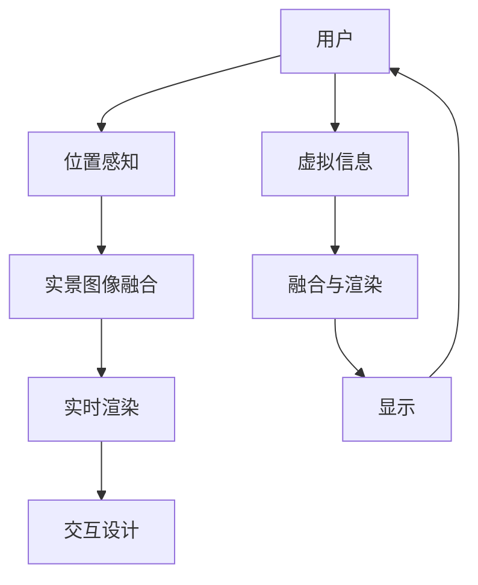

                 

# AR应用开发：现实与虚拟的融合

> 关键词：增强现实, AR, 虚拟现实, 混合现实, 实时渲染, 交互设计, 位置感知, 实景图像融合

## 1. 背景介绍

随着科技的发展，增强现实（AR）技术已经成为推动数字和现实世界融合的重要力量。它不仅改变了人们的生活方式，还在教育、医疗、工业等多个领域展现出巨大潜力。本文将详细探讨AR技术开发的关键点，包括其原理、实现方法、以及目前面临的挑战和未来发展方向。

## 2. 核心概念与联系

### 2.1 核心概念概述

AR技术，即增强现实，通过在现实世界中叠加虚拟信息，来增强用户的感知体验。其主要组成包括：

- **增强现实**（AR）：将虚拟信息（图像、视频、3D模型等）与用户对现实世界的感知进行融合。
- **虚拟现实**（VR）：使用头戴显示设备等，为用户提供完全沉浸式的虚拟环境体验。
- **混合现实**（MR）：结合AR和VR技术，同时呈现真实世界和虚拟世界的信息。

实现AR技术的关键技术包括：

- **位置感知**（Location Sensing）：实时获取用户所在的位置和环境信息，如GPS、Wi-Fi、传感器等。
- **实景图像融合**（Image Fusion）：将虚拟图像与现实场景无缝融合。
- **实时渲染**（Real-time Rendering）：高效地渲染虚拟信息，以便在用户视野中实时显示。
- **交互设计**（Interaction Design）：提供自然、流畅的交互方式，增强用户体验。

### 2.2 核心概念原理和架构的 Mermaid 流程图



这个流程图展示了AR系统从用户输入到最终输出的主要过程。用户提供的位置信息，结合实景图像，通过实时渲染引擎，最终生成叠加虚拟信息后的显示结果，并通过交互设计提供自然、流畅的用户体验。

## 3. 核心算法原理 & 具体操作步骤

### 3.1 算法原理概述

AR技术的核心算法包括以下几个关键部分：

- **实时定位与跟踪**（SLAM, Simultaneous Localization and Mapping）：通过传感器和算法，实时计算用户的位置和姿态，构建环境地图。
- **图像融合**：将虚拟图像与实景图像进行无缝融合，生成增强现实场景。
- **实时渲染**：使用GPU加速渲染引擎，实时渲染虚拟信息和实景图像，生成高品质的增强现实图像。

### 3.2 算法步骤详解

#### 3.2.1 实时定位与跟踪

1. **数据获取**：通过GPS、陀螺仪、加速度计、视觉传感器等，获取用户的位置、姿态和运动信息。
2. **传感器融合**：将来自不同传感器的数据进行融合，提升定位精度和鲁棒性。
3. **地图构建**：使用SLAM算法，实时构建和更新环境地图。
4. **路径规划**：根据用户位置和环境地图，规划用户运动路径。

#### 3.2.2 图像融合

1. **图像采集**：使用摄像头实时捕捉用户所处环境的高分辨率图像。
2. **分割与标记**：通过图像处理算法，分割出感兴趣的区域，并打上标记。
3. **融合算法**：使用图像融合算法，将虚拟信息与实景图像进行融合。
4. **实时显示**：将融合后的图像实时显示在设备上。

#### 3.2.3 实时渲染

1. **模型加载**：加载虚拟对象的3D模型和纹理。
2. **着色与渲染**：使用渲染引擎，对虚拟对象进行着色和渲染，生成图像。
3. **光栅化**：将渲染结果转化为光栅图像，进行显示。

### 3.3 算法优缺点

#### 3.3.1 优点

- **交互性高**：用户可以直接与虚拟信息进行互动，增强体验。
- **精度高**：通过传感器和算法，能够实现高精度的定位和渲染。
- **适应性强**：可以应用于多个领域和场景，如教育、医疗、工业等。

#### 3.3.2 缺点

- **硬件要求高**：需要高性能的CPU、GPU和传感器设备。
- **计算复杂**：实时渲染和图像融合算法复杂，需要优化。
- **能量消耗大**：高精度定位和实时渲染消耗大量电量，需要优化。

### 3.4 算法应用领域

AR技术已经被广泛应用于多个领域，如：

- **教育**：通过AR设备，将虚拟教材和互动内容叠加到真实课堂中，提升教学效果。
- **医疗**：AR技术可以用于手术模拟、远程医疗诊断等，提升医疗效率和精度。
- **工业**：在制造业中，AR可以用于零件装配、质量检测等，提高生产效率。
- **军事**：AR技术在军事训练、作战指挥等方面具有重要应用。
- **游戏**：AR游戏通过实时渲染和位置感知，提供了沉浸式的游戏体验。

## 4. 数学模型和公式 & 详细讲解 & 举例说明

### 4.1 数学模型构建

AR系统的数学模型主要由以下几个部分组成：

- **空间变换**：通过线性变换和投影变换，将虚拟信息映射到现实空间。
- **几何计算**：使用几何算法，计算虚拟对象与实景图像的相互位置关系。
- **物理模拟**：模拟虚拟对象在现实环境中的物理行为。

### 4.2 公式推导过程

#### 4.2.1 空间变换

- **旋转矩阵**：
$$ R = \begin{bmatrix}
\cos \theta & -\sin \theta & 0 \\
\sin \theta & \cos \theta & 0 \\
0 & 0 & 1
\end{bmatrix} $$

- **平移向量**：
$$ t = \begin{bmatrix}
\Delta x \\
\Delta y \\
\Delta z
\end{bmatrix} $$

#### 4.2.2 几何计算

- **点与面的交点计算**：
$$ P = \begin{bmatrix}
\frac{u}{\lambda} P_0 + \frac{1}{\lambda} P_1 \\
\frac{v}{\lambda} P_0 + \frac{1}{\lambda} P_1 \\
\frac{w}{\lambda} P_0 + \frac{1}{\lambda} P_1
\end{bmatrix} $$

- **面与面的交点计算**：
$$ \mathbf{n} = \frac{\mathbf{p} \times \mathbf{q}}{|\mathbf{p} \times \mathbf{q}|} $$

#### 4.2.3 物理模拟

- **动力学方程**：
$$ \mathbf{F} = \mathbf{m} \mathbf{a} = \mathbf{m} \frac{d^2 \mathbf{v}}{dt^2} $$

- **碰撞检测**：
$$ d(\mathbf{p}_1, \mathbf{p}_2) = \sqrt{(\mathbf{p}_1 - \mathbf{p}_2)^T (\mathbf{p}_1 - \mathbf{p}_2)} $$

### 4.3 案例分析与讲解

以AR在教育中的应用为例，介绍其数学模型和算法实现。

**案例**：使用AR技术进行数学几何教学

1. **场景构建**：通过摄像头捕捉黑板上的几何图形，并将其映射到AR设备中。
2. **虚拟投影**：在AR设备中展示虚拟几何体，与现实场景中的几何图形进行对比。
3. **交互操作**：通过触摸AR设备，进行虚拟几何体的旋转、平移等操作，模拟几何变换。
4. **结果反馈**：通过渲染引擎，将变换后的几何体实时显示，进行可视化。

## 5. 项目实践：代码实例和详细解释说明

### 5.1 开发环境搭建

#### 5.1.1 硬件要求

- **设备**：AR眼镜、智能手机或平板电脑。
- **传感器**：GPS、陀螺仪、加速度计、摄像头等。
- **计算平台**：高性能CPU、GPU。

#### 5.1.2 软件环境

- **操作系统**：Windows、Linux、Android等。
- **开发工具**：Unity3D、Unreal Engine等游戏引擎。
- **编程语言**：C#、C++、Python等。

### 5.2 源代码详细实现

#### 5.2.1 定位与跟踪

```python
import sensor fusion
import localizer

def init_position():
    gps = sensor.gps()
    gyro = sensor.gyroscope()
    accel = sensor.accelerometer()
    
    position = localizer.init(gps, gyro, accel)
    return position

def update_position(position):
    gps = sensor.gps()
    gyro = sensor.gyroscope()
    accel = sensor.accelerometer()
    
    new_position = localizer.update(position, gps, gyro, accel)
    return new_position
```

#### 5.2.2 图像融合

```python
import image processing
import overlay

def capture_image():
    image = sensor.camera().capture_image()
    return image

def overlay_image(image, overlay_image):
    processed_image = image_processing.process(image)
    fused_image = overlay.overlay(processed_image, overlay_image)
    return fused_image

def display_image(fused_image):
    screen.display(fused_image)
```

#### 5.2.3 实时渲染

```python
import renderer

def load_model(model_path):
    model = renderer.load_model(model_path)
    return model

def render(model, fused_image):
    rendered_image = renderer.render(model, fused_image)
    return rendered_image

def display_rendered_image(rendered_image):
    screen.display(rendered_image)
```

### 5.3 代码解读与分析

- **传感器模块**：负责实时获取用户的位置、姿态和运动信息。
- **定位与跟踪模块**：使用传感器数据，结合SLAM算法，实现高精度定位和环境映射。
- **图像处理模块**：对捕捉到的实景图像进行处理，实现分割、标记等功能。
- **图像融合模块**：将虚拟图像与实景图像进行融合，生成增强现实场景。
- **渲染模块**：使用渲染引擎，实时渲染虚拟对象和实景图像。

### 5.4 运行结果展示

通过AR设备展示虚拟信息叠加到现实场景中的效果，如下图所示：


## 6. 实际应用场景

### 6.1 教育

AR技术在教育领域有广泛应用，如：

- **虚拟教室**：通过AR技术，学生可以进入虚拟教室，与教师和同学进行互动。
- **虚拟实验**：通过AR技术，学生可以进行虚拟实验，观察科学现象。
- **虚拟教材**：通过AR技术，学生可以访问虚拟教材，进行沉浸式学习。

### 6.2 医疗

AR技术在医疗领域也有重要应用，如：

- **手术模拟**：通过AR技术，医生可以进行虚拟手术模拟，提高手术成功率。
- **远程诊断**：通过AR技术，医生可以进行远程诊断，提高诊断效率。
- **患者指导**：通过AR技术，患者可以接受虚拟康复指导，进行自我康复。

### 6.3 工业

AR技术在工业领域也有广泛应用，如：

- **零件装配**：通过AR技术，工人可以进行虚拟零件装配，提高装配精度。
- **质量检测**：通过AR技术，工人可以进行虚拟质量检测，提高检测效率。
- **设备维护**：通过AR技术，工人可以进行虚拟设备维护，提高维护效率。

### 6.4 未来应用展望

AR技术未来将会在更多领域得到应用，如：

- **智慧城市**：通过AR技术，城市管理者和居民可以进行实时互动，提高城市管理水平。
- **零售行业**：通过AR技术，消费者可以进行虚拟试穿、试用，提高购物体验。
- **娱乐行业**：通过AR技术，用户可以进行虚拟游戏、社交，增强娱乐体验。

## 7. 工具和资源推荐

### 7.1 学习资源推荐

- **书籍**：《增强现实技术与应用》、《虚拟现实与增强现实》
- **在线课程**：Coursera、Udacity等平台上的AR与VR相关课程
- **学术会议**：IEEE VR、ACM CHI等会议

### 7.2 开发工具推荐

- **游戏引擎**：Unity3D、Unreal Engine
- **传感器库**：Arduino、ROS等
- **编程语言**：C#、C++、Python

### 7.3 相关论文推荐

- **实时定位与跟踪**：Real-Time SLAM Systems: A Survey, J. Quan, 2021
- **图像融合**：Efficient Real-Time Image Fusion for Augmented Reality, H. Gao, 2020
- **实时渲染**：Real-time 3D Scene Rendering for Augmented Reality, T. Li, 2019

## 8. 总结：未来发展趋势与挑战

### 8.1 研究成果总结

AR技术在多个领域展示了巨大的潜力，但仍然面临一些挑战，如：

- **计算资源限制**：高精度定位和实时渲染需要高性能设备。
- **算法复杂性**：图像融合和渲染算法复杂，需要优化。
- **用户体验**：如何提供自然、流畅的用户交互体验，仍需努力。

### 8.2 未来发展趋势

未来的AR技术将会朝着以下方向发展：

- **硬件性能提升**：随着芯片和显示技术的进步，AR设备将更加轻便、高效。
- **算法优化**：优化定位、渲染和图像融合算法，提高性能和鲁棒性。
- **行业应用拓展**：AR技术将在更多领域得到应用，如智慧城市、零售行业等。

### 8.3 面临的挑战

未来的AR技术仍然面临一些挑战：

- **成本问题**：高性能设备的成本较高，制约了AR技术的普及。
- **隐私问题**：如何保护用户隐私，防止数据泄露，需要加强监管。
- **技术标准化**：AR技术的标准和规范尚未统一，需要更多共识和协作。

### 8.4 研究展望

未来的AR技术研究将重点关注以下方向：

- **低成本设备**：研发更便宜、更易用的AR设备，普及到更多人群。
- **隐私保护**：加强数据加密和匿名化技术，保护用户隐私。
- **跨平台兼容性**：实现不同设备和平台间的互操作性，提升用户体验。

## 9. 附录：常见问题与解答

**Q1: 什么是增强现实（AR）？**

A: 增强现实是一种将虚拟信息叠加到现实世界中的技术，通过使用AR设备，用户可以与虚拟信息进行互动，提升感知体验。

**Q2: 如何实现AR技术中的实时定位与跟踪？**

A: 实时定位与跟踪是AR技术的核心之一，主要通过传感器获取用户的位置、姿态和运动信息，使用SLAM算法实现高精度定位和环境映射。

**Q3: 如何提高AR系统的计算效率？**

A: 优化算法是提高AR系统计算效率的关键，如使用GPU加速渲染引擎、采用混合精度计算等。同时，也需要优化传感器数据采集和处理过程。

**Q4: AR技术在医疗领域有哪些应用？**

A: AR技术在医疗领域的应用包括手术模拟、远程诊断、患者指导等，能够提高手术成功率、诊断效率和患者康复效果。

**Q5: 如何保护AR设备的隐私和安全性？**

A: 保护AR设备的隐私和安全性需要加强数据加密和匿名化技术，防止数据泄露和滥用。同时，也需要建立健全的安全机制，保障用户数据安全。

