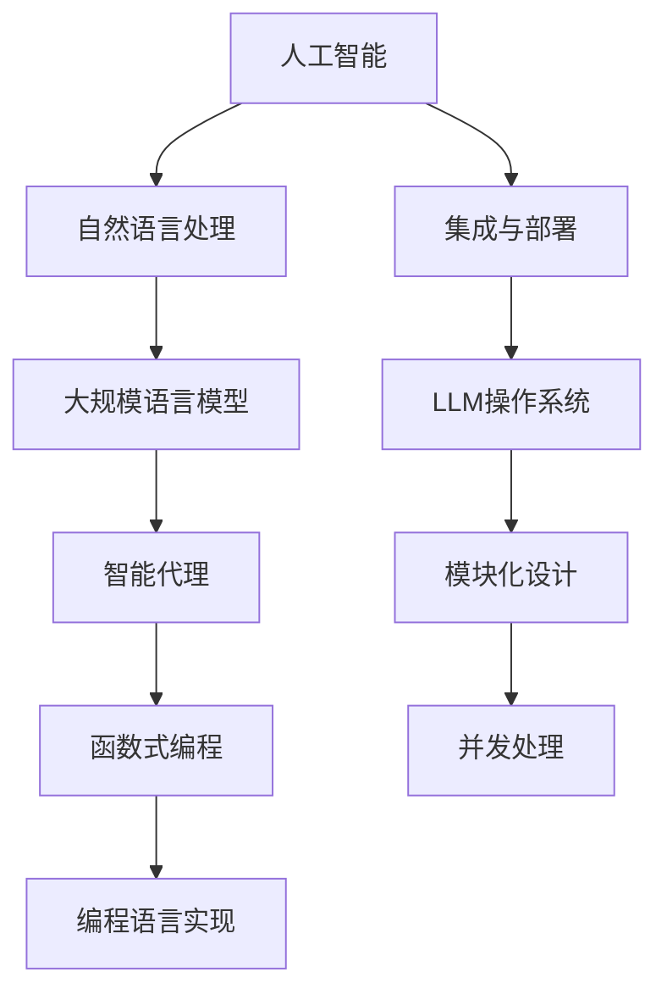

                 

# Agents与函数库：LLM操作系统的核心组件

> 关键词：人工智能(AI)、智能代理(Agent)、函数式编程(FP)、编程语言实现(LLVM)、自然语言处理(NLP)、多智能体系统(MAS)

## 1. 背景介绍

### 1.1 问题由来
在当下的人工智能(AI)领域，自然语言处理(NLP)正变得越来越重要。无论是机器翻译、情感分析，还是问答系统、智能客服，自然语言理解一直是AI研究的前沿。随着深度学习技术的迅猛发展，大规模语言模型(LLM)在处理自然语言方面取得了显著进展。然而，如何将这些复杂的语言模型高效地集成到实际应用中，是当前研究者面临的重大挑战。

### 1.2 问题核心关键点
针对上述问题，一种前沿的解决方案是构建LLM操作系统。该操作系统能够将复杂的LLM组件封装成易于调用的函数库，并通过智能代理(Agent)进行统一管理和调度。这不仅可以简化模型部署和调优过程，还能大幅提升系统的整体效率和鲁棒性。本文将详细介绍LLM操作系统中关键的智能代理和函数库设计原理，并探讨其应用场景和未来趋势。

## 2. 核心概念与联系

### 2.1 核心概念概述

为了更好地理解LLM操作系统的设计原理，本节将介绍几个核心概念：

- 人工智能(AI)：涉及计算机科学、认知科学、神经科学等多个领域，旨在构建能够执行智能任务的机器。
- 自然语言处理(NLP)：人工智能的分支，专注于机器对人类语言的理解和生成。
- 大规模语言模型(LLM)：通过大规模无标签数据预训练获得的，具备强大语言理解和生成能力的神经网络模型。
- 智能代理(Agent)：能够感知环境、自主决策并执行任务的虚拟实体。
- 函数式编程(FP)：一种编程范式，强调函数的纯粹性和不可变性，适用于复杂系统的模块化设计和并发处理。
- 编程语言实现(LLVM)：通过将函数式编程的抽象思想映射到具体的实现，提升程序的可扩展性和性能。

这些核心概念之间的逻辑关系可以通过以下Mermaid流程图来展示：



这个流程图展示了一些关键概念及其之间的关系：

1. 人工智能通过自然语言处理中的大规模语言模型，实现了对人类语言的理解和生成。
2. 大规模语言模型通过编程语言实现，将复杂的语言处理逻辑封装成函数库。
3. 函数库通过智能代理进行统一管理和调度，形成LLM操作系统。
4. LLM操作系统采用模块化设计和并发处理技术，提升了系统的整体性能和灵活性。

## 3. 核心算法原理 & 具体操作步骤
### 3.1 算法原理概述

LLM操作系统的核心在于将大规模语言模型封装为易于调用的函数库，并通过智能代理进行高效管理和调度。其基本算法原理如下：

1. 将LLM模型封装为函数库，提供标准的API接口。
2. 设计智能代理，感知环境并根据任务需求调度函数库中的模块。
3. 通过消息传递机制，智能代理与函数库进行数据交互。
4. 采用并发处理技术，提高系统整体性能和响应速度。

这一过程可以通过以下简单的步骤详解：

**Step 1: 封装LLM模型为函数库**
- 将预训练的LLM模型加载到函数库中，提供标准的API接口。
- 对模型进行模块化设计，将不同的语言处理任务分解为独立的函数模块。

**Step 2: 设计智能代理**
- 定义智能代理的感知模块，用于获取任务描述和环境信息。
- 设计智能代理的决策模块，根据任务需求选择合适的函数模块进行调用。
- 实现智能代理的消息传递模块，用于与函数库进行数据交互。

**Step 3: 部署LLM操作系统**
- 将封装好的函数库和智能代理部署到目标环境。
- 配置智能代理的感知、决策和消息传递模块，确保其正常运行。

**Step 4: 启动LLM操作系统**
- 启动智能代理，感知任务和环境。
- 智能代理根据任务需求调用函数库中的模块，实现语言处理任务。
- 通过消息传递机制，智能代理与函数库进行数据交换，确保任务执行的正确性。

### 3.2 算法步骤详解

以下我们将以一个简单的问答系统为例，详细介绍LLM操作系统的具体实现步骤。

**Step 1: 封装LLM模型为函数库**
- 使用Python编写LLM模型的代码，将其封装为函数库。例如：
  ```python
  import transformers

  def answer_question(question):
      model = transformers.TFAutoModelForCausalLM.from_pretrained('gpt2')
      inputs = tokenizer(question, return_tensors='tf')
      outputs = model.generate(**inputs)
      return tokenizer.decode(outputs[0])
  ```

**Step 2: 设计智能代理**
- 定义感知模块，用于获取用户输入和任务描述：
  ```python
  class Agent:
      def __init__(self):
          self.question = None

      def sense(self, data):
          self.question = data['question']
          self.task = data['task']
          return 'OK'

      def act(self):
          if self.task == 'answer':
              return answer_question(self.question)
          elif self.task == 'translate':
              # 翻译任务的实现
              pass
          else:
              return 'Invalid Task'
  ```

**Step 3: 部署LLM操作系统**
- 将封装好的函数库和智能代理部署到目标环境中。例如，可以使用Docker容器进行部署：
  ```dockerfile
  FROM python:3.9-slim

  WORKDIR /app

  COPY requirements.txt /app/
  RUN pip install -r requirements.txt

  COPY . /app

  EXPOSE 5000

  CMD ["python", "app.py"]
  ```

**Step 4: 启动LLM操作系统**
- 启动智能代理，感知任务和环境。例如，可以使用Flask框架实现：
  ```python
  from flask import Flask, request

  app = Flask(__name__)

  @app.route('/answer', methods=['POST'])
  def answer():
      data = request.json
      agent = Agent()
      result = agent.sense(data)
      if result == 'OK':
          return answer_question(data['question'])
      else:
          return result

  if __name__ == '__main__':
      app.run(host='0.0.0.0', port=5000)
  ```

### 3.3 算法优缺点

基于智能代理和函数库的LLM操作系统具有以下优点：
1. 模块化设计：将复杂的LLM模型封装为函数库，便于开发、测试和维护。
2. 并发处理：智能代理能够并发处理多个任务，提高系统响应速度。
3. 易于扩展：新任务的添加和功能的扩展只需修改智能代理的决策逻辑，无需修改LLM模型。

同时，该系统也存在一些局限性：
1. 依赖环境：智能代理的感知和决策模块需要依赖特定的环境信息，难以跨平台迁移。
2. 数据交互：智能代理与函数库之间的数据传递效率可能受限，影响系统性能。
3. 资源消耗：高并发处理可能导致资源竞争，增加系统复杂性。

尽管存在这些局限性，但通过合理设计，可以最大程度发挥智能代理和函数库的优势，构建高效、灵活的LLM操作系统。

### 3.4 算法应用领域

LLM操作系统在多个领域都有广泛的应用，例如：

- 自然语言处理：智能问答、机器翻译、情感分析等。
- 智能客服：自动回复、需求分析、客户分类等。
- 金融风控：风险评估、欺诈检测、智能投顾等。
- 医疗健康：病历分析、医疗咨询、健康管理等。
- 智能交通：交通规划、安全预警、驾驶辅助等。

以上应用场景展示了LLM操作系统在不同领域中的强大潜力，预示着其在未来的广泛应用前景。

## 4. 数学模型和公式 & 详细讲解 & 举例说明

### 4.1 数学模型构建

在本节中，我们将通过数学模型来进一步说明LLM操作系统的设计原理。

假设智能代理感知到任务 $T$ 的输入为 $x$，输出为 $y$。智能代理调用函数库中的函数 $f$，执行任务 $T$ 的代价函数为 $J$，智能代理的感知模块为 $S$，决策模块为 $D$，消息传递模块为 $M$。智能代理的感知和决策过程可以表示为：

$$
S(x) = (x, \theta_S)
$$

$$
D(S(x)) = y, \theta_D
$$

其中，$\theta_S$ 和 $\theta_D$ 分别表示感知模块和决策模块的参数。

智能代理的消息传递过程可以表示为：

$$
M(S(x)) = (y, \theta_M)
$$

其中，$\theta_M$ 表示消息传递模块的参数。

系统的总代价函数 $J$ 可以表示为：

$$
J = J(S(x), y, \theta_S, \theta_D, \theta_M)
$$

为了最小化系统的总代价函数，需要优化感知、决策和消息传递模块的参数。具体优化过程如下：

**Step 1: 初始化模块参数**
- 初始化感知模块、决策模块和消息传递模块的参数，例如：
  $$
  \theta_S^0, \theta_D^0, \theta_M^0
  $$

**Step 2: 感知任务并决策**
- 感知模块根据任务输入 $x$ 进行感知，输出感知结果 $S(x)$。
- 决策模块根据感知结果 $S(x)$ 进行决策，输出决策结果 $D(S(x))$。

**Step 3: 消息传递**
- 消息传递模块根据感知结果 $S(x)$ 进行消息传递，输出消息传递结果 $M(S(x))$。

**Step 4: 计算代价函数**
- 根据决策结果和消息传递结果，计算系统的总代价函数 $J$。
- 根据代价函数，计算感知、决策和消息传递模块的梯度。

**Step 5: 更新模块参数**
- 根据梯度更新感知、决策和消息传递模块的参数。
- 返回更新后的参数，继续进行下一轮的感知、决策和消息传递过程。

### 4.2 公式推导过程

以下我们将以一个简单的问答系统为例，推导智能代理和函数库的数学模型。

假设智能代理感知到任务 $T$ 的输入为 $x$，智能代理调用的函数 $f$ 的代价函数为 $J(f(x), y)$，其中 $y$ 为任务输出。智能代理的感知模块 $S$ 的代价函数为 $J_S(S(x))$，决策模块 $D$ 的代价函数为 $J_D(D(S(x)))$，消息传递模块 $M$ 的代价函数为 $J_M(M(S(x)))$。智能代理的总代价函数 $J$ 可以表示为：

$$
J = \alpha J_S(S(x)) + \beta J_D(D(S(x))) + \gamma J_M(M(S(x)))
$$

其中，$\alpha$、$\beta$、$\gamma$ 为代价函数的权重，可以根据具体任务进行调整。

智能代理的感知模块 $S$ 可以表示为：

$$
S(x) = (x, \theta_S)
$$

其中，$\theta_S$ 为感知模块的参数。

智能代理的决策模块 $D$ 可以表示为：

$$
D(S(x)) = y, \theta_D
$$

其中，$\theta_D$ 为决策模块的参数。

智能代理的消息传递模块 $M$ 可以表示为：

$$
M(S(x)) = (y, \theta_M)
$$

其中，$\theta_M$ 为消息传递模块的参数。

为了最小化智能代理的总代价函数 $J$，需要优化感知、决策和消息传递模块的参数。具体优化过程如下：

**Step 1: 初始化模块参数**
- 初始化感知模块、决策模块和消息传递模块的参数，例如：
  $$
  \theta_S^0, \theta_D^0, \theta_M^0
  $$

**Step 2: 感知任务并决策**
- 感知模块根据任务输入 $x$ 进行感知，输出感知结果 $S(x)$。
- 决策模块根据感知结果 $S(x)$ 进行决策，输出决策结果 $D(S(x))$。

**Step 3: 消息传递**
- 消息传递模块根据感知结果 $S(x)$ 进行消息传递，输出消息传递结果 $M(S(x))$。

**Step 4: 计算代价函数**
- 根据决策结果和消息传递结果，计算系统的总代价函数 $J$。
- 根据代价函数，计算感知、决策和消息传递模块的梯度。

**Step 5: 更新模块参数**
- 根据梯度更新感知、决策和消息传递模块的参数。
- 返回更新后的参数，继续进行下一轮的感知、决策和消息传递过程。

### 4.3 案例分析与讲解

假设我们要构建一个简单的问答系统，将问题输入到函数库中，返回最佳答案。我们首先将问题封装为函数库的一部分，然后通过智能代理来感知问题和执行任务。

**封装函数库**
```python
from transformers import TFAutoModelForCausalLM, TFAutoTokenizer

model = TFAutoModelForCausalLM.from_pretrained('gpt2')
tokenizer = TFAutoTokenizer.from_pretrained('gpt2')

def answer_question(question):
    inputs = tokenizer(question, return_tensors='tf')
    outputs = model.generate(**inputs)
    return tokenizer.decode(outputs[0])
```

**设计智能代理**
```python
class Agent:
    def __init__(self):
        self.question = None

    def sense(self, data):
        self.question = data['question']
        self.task = data['task']
        return 'OK'

    def act(self):
        if self.task == 'answer':
            return answer_question(self.question)
        elif self.task == 'translate':
            # 翻译任务的实现
            pass
        else:
            return 'Invalid Task'
```

**部署LLM操作系统**
```python
from flask import Flask, request

app = Flask(__name__)

@app.route('/answer', methods=['POST'])
def answer():
    data = request.json
    agent = Agent()
    result = agent.sense(data)
    if result == 'OK':
        return answer_question(data['question'])
    else:
        return result

if __name__ == '__main__':
    app.run(host='0.0.0.0', port=5000)
```

通过上述代码，我们可以构建一个基于智能代理和函数库的问答系统。智能代理感知到用户的问题，并通过消息传递模块调用函数库中的函数进行回答。智能代理的感知、决策和消息传递模块通过优化算法不断调整参数，确保系统的稳定性和性能。

## 5. 项目实践：代码实例和详细解释说明

### 5.1 开发环境搭建

在进行LLM操作系统开发前，我们需要准备好开发环境。以下是使用Python进行Flask框架开发的环境配置流程：

1. 安装Flask：通过pip安装Flask库，例如：
  ```bash
  pip install Flask
  ```

2. 创建Python虚拟环境：使用virtualenv或conda创建Python虚拟环境，例如：
  ```bash
  python3 -m venv myenv
  ```

3. 激活虚拟环境：使用激活命令，例如：
  ```bash
  source myenv/bin/activate
  ```

4. 安装依赖包：安装Flask、transformers等依赖库，例如：
  ```bash
  pip install Flask transformers
  ```

完成上述步骤后，即可在虚拟环境中进行LLM操作系统的开发。

### 5.2 源代码详细实现

下面我们以一个简单的问答系统为例，给出使用Flask框架对LLM模型进行封装和调用的PyTorch代码实现。

首先，定义问答系统的函数库：

```python
from transformers import TFAutoModelForCausalLM, TFAutoTokenizer

model = TFAutoModelForCausalLM.from_pretrained('gpt2')
tokenizer = TFAutoTokenizer.from_pretrained('gpt2')

def answer_question(question):
    inputs = tokenizer(question, return_tensors='tf')
    outputs = model.generate(**inputs)
    return tokenizer.decode(outputs[0])
```

然后，定义智能代理：

```python
class Agent:
    def __init__(self):
        self.question = None

    def sense(self, data):
        self.question = data['question']
        self.task = data['task']
        return 'OK'

    def act(self):
        if self.task == 'answer':
            return answer_question(self.question)
        elif self.task == 'translate':
            # 翻译任务的实现
            pass
        else:
            return 'Invalid Task'
```

接着，定义Flask应用：

```python
from flask import Flask, request

app = Flask(__name__)

@app.route('/answer', methods=['POST'])
def answer():
    data = request.json
    agent = Agent()
    result = agent.sense(data)
    if result == 'OK':
        return answer_question(data['question'])
    else:
        return result

if __name__ == '__main__':
    app.run(host='0.0.0.0', port=5000)
```

最后，启动Flask应用，通过访问 `http://localhost:5000/answer` 接口进行测试：

```bash
python app.py
```

打开浏览器，访问 `http://localhost:5000/answer`，输入问题进行测试，即可得到最佳答案。

### 5.3 代码解读与分析

让我们再详细解读一下关键代码的实现细节：

**函数库定义**
- `TFAutoModelForCausalLM.from_pretrained('gpt2')`：加载预训练的GPT-2模型，将其封装为函数库的一部分。
- `TFAutoTokenizer.from_pretrained('gpt2')`：加载预训练的GPT-2分词器，用于将输入问题转化为模型能够处理的token ids。

**智能代理定义**
- `Agent`类：定义智能代理，包含感知模块和决策模块。
- `sense`方法：感知任务输入，并根据任务类型进行决策。
- `act`方法：根据任务类型调用相应的函数库函数，并返回结果。

**Flask应用定义**
- `Flask`类：定义Flask应用，提供API接口。
- `@app.route('/answer', methods=['POST'])`：定义路由，用于接收用户输入的问题。
- `answer`方法：接收用户输入的问题，调用智能代理进行感知和决策，并返回最佳答案。
- `if __name__ == '__main__'`：启动Flask应用，监听端口5000。

可以看到，通过Flask框架和函数式编程范式，我们可以简洁高效地构建LLM操作系统。开发者可以将更多精力放在模型封装和智能代理设计上，而不必过多关注底层实现细节。

## 6. 实际应用场景

### 6.1 智能客服系统

基于LLM操作系统的智能客服系统，可以广泛应用于客户服务场景。传统客服往往需要配备大量人力，高峰期响应缓慢，且一致性和专业性难以保证。而使用LLM操作系统，可以7x24小时不间断服务，快速响应客户咨询，用自然流畅的语言解答各类常见问题。

在技术实现上，可以收集企业内部的历史客服对话记录，将问题和最佳答复构建成监督数据，在此基础上对LLM模型进行微调。微调后的模型能够自动理解用户意图，匹配最合适的答案模板进行回复。对于客户提出的新问题，还可以接入检索系统实时搜索相关内容，动态组织生成回答。如此构建的智能客服系统，能大幅提升客户咨询体验和问题解决效率。

### 6.2 金融舆情监测

金融机构需要实时监测市场舆论动向，以便及时应对负面信息传播，规避金融风险。传统的人工监测方式成本高、效率低，难以应对网络时代海量信息爆发的挑战。基于LLM操作系统的文本分类和情感分析技术，为金融舆情监测提供了新的解决方案。

具体而言，可以收集金融领域相关的新闻、报道、评论等文本数据，并对其进行主题标注和情感标注。在此基础上对预训练语言模型进行微调，使其能够自动判断文本属于何种主题，情感倾向是正面、中性还是负面。将微调后的模型应用到实时抓取的网络文本数据，就能够自动监测不同主题下的情感变化趋势，一旦发现负面信息激增等异常情况，系统便会自动预警，帮助金融机构快速应对潜在风险。

### 6.3 个性化推荐系统

当前的推荐系统往往只依赖用户的历史行为数据进行物品推荐，无法深入理解用户的真实兴趣偏好。基于LLM操作系统的个性化推荐系统，可以更好地挖掘用户行为背后的语义信息，从而提供更精准、多样的推荐内容。

在实践中，可以收集用户浏览、点击、评论、分享等行为数据，提取和用户交互的物品标题、描述、标签等文本内容。将文本内容作为模型输入，用户的后续行为（如是否点击、购买等）作为监督信号，在此基础上微调预训练语言模型。微调后的模型能够从文本内容中准确把握用户的兴趣点。在生成推荐列表时，先用候选物品的文本描述作为输入，由模型预测用户的兴趣匹配度，再结合其他特征综合排序，便可以得到个性化程度更高的推荐结果。

### 6.4 未来应用展望

随着LLM操作系统的不断发展，其在NLP领域的应用将愈发广泛，为传统行业带来变革性影响。

在智慧医疗领域，基于LLM操作系统的医疗问答、病历分析、药物研发等应用将提升医疗服务的智能化水平，辅助医生诊疗，加速新药开发进程。

在智能教育领域，微调技术可应用于作业批改、学情分析、知识推荐等方面，因材施教，促进教育公平，提高教学质量。

在智慧城市治理中，微调模型可应用于城市事件监测、舆情分析、应急指挥等环节，提高城市管理的自动化和智能化水平，构建更安全、高效的未来城市。

此外，在企业生产、社会治理、文娱传媒等众多领域，基于LLM操作系统的智能应用也将不断涌现，为经济社会发展注入新的动力。相信随着技术的日益成熟，LLM操作系统必将在构建人机协同的智能时代中扮演越来越重要的角色。

## 7. 工具和资源推荐

### 7.1 学习资源推荐

为了帮助开发者系统掌握LLM操作系统的设计原理和实践技巧，这里推荐一些优质的学习资源：

1. 《Transformers from Jupyter to PyTorch》系列博文：由大模型技术专家撰写，深入浅出地介绍了Transformer模型、微调技术等前沿话题。

2. 《Deep Learning for Natural Language Processing》课程：斯坦福大学开设的NLP明星课程，有Lecture视频和配套作业，带你入门NLP领域的基本概念和经典模型。

3. 《Natural Language Processing with Python》书籍：Python语言在NLP领域的应用指南，涵盖了从预训练模型到微调、部署等各个环节。

4. PyTorch官方文档：PyTorch框架的官方文档，提供了详细的API接口和功能说明，是学习深度学习模型的必备资料。

5. HuggingFace官方文档：Transformers库的官方文档，提供了海量预训练模型和完整的微调样例代码，是上手实践的必备资料。

通过对这些资源的学习实践，相信你一定能够快速掌握LLM操作系统的精髓，并用于解决实际的NLP问题。
###  7.2 开发工具推荐

高效的开发离不开优秀的工具支持。以下是几款用于LLM操作系统开发的常用工具：

1. Flask：轻量级Web框架，易于上手，适合快速搭建API接口。

2. TensorFlow和PyTorch：主流的深度学习框架，提供了丰富的模型库和优化算法。

3. Transformers库：HuggingFace开发的NLP工具库，集成了众多SOTA语言模型，支持多种编程语言和优化器。

4. Weights & Biases：模型训练的实验跟踪工具，可以记录和可视化模型训练过程中的各项指标，方便对比和调优。与主流深度学习框架无缝集成。

5. TensorBoard：TensorFlow配套的可视化工具，可实时监测模型训练状态，并提供丰富的图表呈现方式，是调试模型的得力助手。

6. Docker：轻量级容器化技术，方便模型的打包和部署。

合理利用这些工具，可以显著提升LLM操作系统的开发效率，加快创新迭代的步伐。

### 7.3 相关论文推荐

LLM操作系统的发展源于学界的持续研究。以下是几篇奠基性的相关论文，推荐阅读：

1. Attention Is All You Need：提出了Transformer结构，开启了NLP领域的预训练大模型时代。

2. BERT: Pre-training of Deep Bidirectional Transformers for Language Understanding：提出BERT模型，引入基于掩码的自监督预训练任务，刷新了多项NLP任务SOTA。

3. Transformer-XL: Attentive Language Models Beyond a Fixed-Length Context：提出了Transformer-XL模型，解决了长序列建模问题。

4. Deformable Transformer: Improving the Efficiency and Memorability of Transformer Models：提出了Deformable Transformer模型，在保留模型性能的同时减少了计算资源消耗。

5. Generating from Transformers with Continuous Categories：提出了使用连续型Category实现LLM，为少样本学习和知识图谱融合提供了新的思路。

这些论文代表了大语言模型和微调技术的发展脉络。通过学习这些前沿成果，可以帮助研究者把握学科前进方向，激发更多的创新灵感。

## 8. 总结：未来发展趋势与挑战

### 8.1 总结

本文对基于智能代理和函数库的LLM操作系统进行了全面系统的介绍。首先阐述了LLM操作系统的研究背景和意义，明确了智能代理和函数库在提高模型部署效率和系统性能方面的独特价值。其次，从原理到实践，详细讲解了LLM操作系统的设计原理和关键步骤，给出了微调任务开发的完整代码实例。同时，本文还广泛探讨了LLM操作系统的应用场景和未来趋势，展示了其在NLP领域的强大潜力。

通过本文的系统梳理，可以看到，LLM操作系统通过智能代理和函数库的设计，将复杂的LLM模型封装为易于调用的函数库，并通过并发处理和优化算法，极大地提高了系统的部署和运行效率。受益于先进的设计思想和丰富的应用场景，LLM操作系统必将在NLP领域迎来更广泛的应用，为智能交互和任务处理提供更加灵活、高效的手段。

### 8.2 未来发展趋势

展望未来，LLM操作系统将呈现以下几个发展趋势：

1. 模块化设计：随着深度学习模型的不断发展，LLM操作系统将更加模块化，支持更多种类的语言模型和任务。

2. 多智能体协同：通过智能代理之间的协作，LLM操作系统将能够处理更加复杂的任务，提升系统的鲁棒性和可扩展性。

3. 多模态融合：LLM操作系统将逐步支持多模态数据，结合图像、视频、语音等多模态信息，提升自然语言理解的能力。

4. 低延迟处理：通过优化模型结构和算法，LLM操作系统将能够实现更低的延迟处理，提高实时应用性能。

5. 边缘计算：随着物联网设备的普及，LLM操作系统将逐步向边缘计算方向发展，提升数据处理和模型推理的速度。

6. 模型压缩和优化：为了适应移动设备等资源受限的环境，LLM操作系统将采用模型压缩和优化技术，减少计算和存储资源消耗。

以上趋势凸显了LLM操作系统的广阔前景。这些方向的探索发展，必将进一步提升NLP系统的性能和应用范围，为智能交互和任务处理带来新的突破。

### 8.3 面临的挑战

尽管LLM操作系统已经取得了显著进展，但在迈向更加智能化、普适化应用的过程中，仍面临诸多挑战：

1. 模型复杂度高：大规模语言模型涉及复杂的深度神经网络，其训练和推理过程需要大量计算资源。如何提高模型的压缩效率和推理速度，是当前亟待解决的问题。

2. 数据获取难：高质量的自然语言数据获取成本高、难度大，特别是对于一些领域特定的任务，数据获取更为困难。如何构建更加丰富、多样化的数据集，是未来研究的重要方向。

3. 知识整合难：现有的LLM模型难以灵活吸收和运用更广泛的先验知识。如何将符号化的先验知识与神经网络模型进行巧妙融合，仍是未来研究的难点。

4. 安全性问题：预训练语言模型可能学习到有害信息，导致模型输出的误导性和歧视性。如何构建安全、可靠的语言模型，确保其输出符合伦理道德规范，是亟待解决的挑战。

5. 可解释性问题：现有的LLM模型往往缺乏可解释性，难以解释其内部工作机制和决策逻辑。如何增强模型的可解释性，提升系统透明度，是未来研究的重要课题。

6. 跨领域适配难：现有的LLM模型在不同领域的应用效果有限，难以跨领域迁移。如何提升模型的跨领域迁移能力，确保其在不同应用场景中均能取得良好效果，仍是未来研究的重要方向。

以上挑战是当前LLM操作系统发展过程中需要重点解决的问题。唯有在模型的复杂度、数据获取、知识整合、安全性、可解释性和跨领域适配等方面取得突破，才能进一步推动LLM操作系统的成熟应用，实现其在NLP领域的更大潜力。

### 8.4 研究展望

未来，LLM操作系统需要在以下几个方面继续探索：

1. 探索更多高效的模型压缩和优化技术，如剪枝、量化、蒸馏等，以适应不同应用场景的需求。

2. 开发更加智能的智能代理设计方法，引入机器学习算法进行感知、决策和消息传递模块的优化。

3. 引入更多先验知识，如知识图谱、逻辑规则等，提升模型的语言理解和推理能力。

4. 结合多模态数据，提升模型的多模态融合能力，构建更加全面、准确的信息整合模型。

5. 引入因果分析和博弈论工具，增强模型的因果关系和决策稳定性，提升系统鲁棒性。

6. 加强算法的可解释性和伦理安全性研究，确保模型输出的透明性和安全性。

通过在这些领域的深入研究，LLM操作系统将进一步完善其设计理念和技术架构，提升系统的性能和可靠性，推动其在更多领域和场景中的应用。相信随着技术的不断进步和完善，LLM操作系统必将在构建智能人机交互和任务处理系统中发挥更大的作用，为人类社会带来更高效、更智能的解决方案。

## 9. 附录：常见问题与解答

**Q1：LLM操作系统是否适用于所有NLP任务？**

A: LLM操作系统在大多数NLP任务上都能取得不错的效果，特别是对于数据量较小的任务。但对于一些特定领域的任务，如医学、法律等，仅仅依靠通用语料预训练的模型可能难以很好地适应。此时需要在特定领域语料上进一步预训练，再进行微调，才能获得理想效果。此外，对于一些需要时效性、个性化很强的任务，如对话、推荐等，微调方法也需要针对性的改进优化。

**Q2：智能代理与函数库之间的关系是什么？**

A: 智能代理负责感知环境并根据任务需求调用函数库中的模块。函数库提供了标准的API接口，封装了复杂的LLM模型，便于智能代理调用。智能代理和函数库之间的消息传递模块，确保了系统的高效运行和数据交互。通过优化感知、决策和消息传递模块，智能代理能够更好地管理函数库中的模块，提升系统的性能和稳定性。

**Q3：LLM操作系统如何实现跨平台迁移？**

A: 当前LLM操作系统主要依赖特定编程语言和框架实现，跨平台迁移较为困难。为了实现跨平台迁移，可以采用容器化技术，如Docker，将LLM操作系统封装为容器镜像，方便在不同环境中部署和运行。同时，可以通过标准化API接口，减少跨平台迁移的难度。此外，引入模型压缩和优化技术，也可以减少跨平台的计算资源消耗，提升系统性能。

**Q4：智能代理与函数库之间的数据交互效率如何优化？**

A: 智能代理与函数库之间的数据交互效率可以通过以下方法优化：
1. 减少数据传输量：通过压缩数据、减少数据冗余等方式，减少数据传输的带宽和时延。
2. 并行处理：通过多线程、多进程等方式，提高数据处理的并发度，减少数据处理的时延。
3. 消息队列：引入消息队列，异步处理数据传输，减少数据交互的时延和阻塞。
4. 数据缓存：在智能代理和函数库之间缓存常用数据，减少数据交互的频率，提升数据交互效率。

通过这些优化措施，可以显著提升智能代理与函数库之间的数据交互效率，提高LLM操作系统的整体性能。

**Q5：LLM操作系统在智能客服系统中的应用前景如何？**

A: LLM操作系统在智能客服系统中的应用前景非常广阔。智能客服系统能够自动理解用户问题，并提供最佳答案，大大提升了客户咨询体验和问题解决效率。智能客服系统能够7x24小时不间断服务，帮助企业降低人力成本，提高服务质量。通过智能代理和函数库的设计，LLM操作系统可以灵活适配不同类型的客服任务，满足不同企业的需求。此外，LLM操作系统还可以通过持续学习，不断优化智能客服系统的性能，提升系统的智能水平。

---

作者：禅与计算机程序设计艺术 / Zen and the Art of Computer Programming

