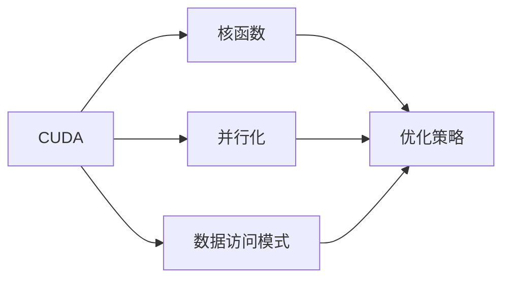

                 

# CUDA核函数优化：释放GPU AI计算的全部潜力

> 关键词：CUDA,核函数,优化,深度学习,神经网络,AI计算,GPU,性能提升,编程技巧

## 1. 背景介绍

### 1.1 问题由来
随着人工智能（AI）技术的蓬勃发展，深度学习在图像识别、语音处理、自然语言处理等领域取得了显著成果。在这些应用中，GPU作为计算密集型任务的高效硬件，扮演了重要角色。特别是CUDA（Compute Unified Device Architecture），作为NVIDIA推出的并行计算平台，其性能和效率被广泛应用于深度学习模型的训练和推理。

然而，尽管CUDA在GPU加速方面表现卓越，但在实际应用中，如何进一步优化核函数，以提升GPU的AI计算性能，仍是一个挑战性的问题。优化CUDA核函数不仅能显著提升计算效率，还能减少能耗，延长GPU硬件的使用寿命，并增强算法的可靠性和稳定性。本文将系统性地介绍CUDA核函数优化的原理和技巧，以及其在深度学习模型中的应用。

### 1.2 问题核心关键点
CUDA核函数优化的核心关键点包括：
1. 核函数结构设计：选择合适的算法结构和并行度，以充分利用GPU的并行计算能力。
2. 数据访存优化：通过合理设计内存访问模式，减少数据传输延迟和带宽占用，提高数据访问效率。
3. 并行计算优化：利用CUDA线程和线程块的并行化特性，提高并行算法的执行效率。
4. 硬件资源利用：合理分配GPU资源，避免资源浪费，优化任务调度。
5. 性能评估与调优：使用多种性能评估工具，进行模型性能的评估和优化。

通过深入理解这些关键点，可以最大化CUDA的计算潜力，提升深度学习模型的训练和推理速度。

## 2. 核心概念与联系

### 2.1 核心概念概述

为更好地理解CUDA核函数优化，我们首先介绍几个关键概念：

- **CUDA**：一种并行计算平台，支持C++语言编程，可用于NVIDIA GPU硬件的加速计算。
- **核函数**：并行算法的基本单元，由许多线程块（thread blocks）和线程（threads）组成，负责执行特定的计算任务。
- **并行化**：将一个计算任务分解为多个并行子任务，由多个线程或线程块同时执行，以提高计算效率。
- **数据访问模式**：数据在内存和GPU间的传输方式，包括共享内存、全局内存、常量内存等。
- **优化策略**：通过分析算法和数据访问模式，调整程序结构，以提升计算性能和效率。

这些概念之间的逻辑关系可以通过以下Mermaid流程图来展示：



这个流程图展示了大规模并行计算和优化过程的逻辑关系：

1. CUDA提供硬件平台和编程框架，负责并行计算和数据传输。
2. 核函数是并行计算的基本单元，负责具体的计算任务。
3. 并行化将一个计算任务分解为多个并行子任务，由多个线程块和线程同时执行。
4. 数据访问模式设计合理的数据传输方式，减少延迟和带宽占用。
5. 优化策略通过分析算法和数据访问模式，调整程序结构，以提升计算效率。

## 3. 核心算法原理 & 具体操作步骤

### 3.1 算法原理概述

CUDA核函数的优化，主要通过以下几个方面进行：

1. **数据访问模式优化**：优化数据在内存和GPU间的传输方式，减少延迟和带宽占用，提高数据访问效率。
2. **并行计算优化**：通过合理的线程和线程块设计，提高并行算法的执行效率。
3. **资源分配优化**：合理分配GPU资源，避免资源浪费，优化任务调度。
4. **算法结构优化**：调整算法结构，减少计算量和数据传输量，提高计算效率。

### 3.2 算法步骤详解

1. **数据访问模式优化**
   - **共享内存优化**：将数据存储在共享内存中，减少全局内存访问次数，提升访问速度。
   - **缓存优化**：利用缓存机制，缓存热点数据，减少数据从内存到GPU的传输延迟。
   - **数据分块**：将数据分割为多个块，并行访问，提高访问效率。

2. **并行计算优化**
   - **线程块设计**：合理设计线程块大小，避免线程块过大或过小，提高线程块的使用效率。
   - **线程数量控制**：根据任务特点和GPU架构，调整线程数量，避免线程数量过多或过少。
   - **工作共享**：通过工作共享技术，将任务均匀地分配给多个线程块，提高并行度。

3. **资源分配优化**
   - **资源预分配**：根据任务特点，预分配GPU资源，避免动态分配带来的额外开销。
   - **任务调度优化**：使用任务调度器，优化任务之间的调度顺序，提高GPU利用率。

4. **算法结构优化**
   - **计算与通信分离**：将计算和通信操作分离，减少数据传输和等待时间。
   - **流水线设计**：设计流水线算法，提高计算和通信操作的并行度。

### 3.3 算法优缺点

CUDA核函数优化的优点包括：

- **提升计算效率**：通过优化数据访问模式和并行计算，显著提升深度学习模型的训练和推理速度。
- **减少能耗**：优化算法的并行性和数据传输，降低GPU的能耗，延长硬件寿命。
- **增强可靠性**：优化后的算法具有更好的鲁棒性和稳定性，减少因数据访问或计算错误导致的问题。

缺点包括：

- **编程复杂性高**：优化CUDA核函数需要具备深入的并行计算和硬件知识，对开发者要求较高。
- **性能提升有限**：并非所有算法和数据都能通过优化显著提升性能，优化效果可能因场景而异。

### 3.4 算法应用领域

CUDA核函数优化广泛应用于深度学习模型的训练和推理过程，具体领域包括：

- **图像识别**：通过优化卷积层和池化层的数据访问模式和并行计算，提高模型训练和推理速度。
- **语音处理**：通过优化循环神经网络（RNN）和卷积神经网络（CNN）的并行计算和数据访问模式，提高语音识别和合成速度。
- **自然语言处理**：通过优化LSTM和Transformer等模型中的计算和通信操作，提升模型的训练和推理效率。
- **推荐系统**：通过优化矩阵乘法和梯度计算，提高推荐算法中的特征提取和模型训练速度。

## 4. 数学模型和公式 & 详细讲解 & 举例说明

### 4.1 数学模型构建

CUDA核函数优化的数学模型主要围绕以下几个方面进行构建：

1. **数据访问延迟模型**：描述数据从内存到GPU的传输延迟和带宽占用。
2. **并行计算模型**：描述线程和线程块在并行计算中的效率和资源利用。
3. **资源分配模型**：描述GPU资源的预分配和动态调整。
4. **算法结构模型**：描述计算和通信操作的优化策略和并行度。

### 4.2 公式推导过程

以卷积神经网络（CNN）的数据访问延迟模型为例，推导公式：

设CNN中某层的输入数据大小为$I$，输出数据大小为$O$，卷积核大小为$K$，步幅为$S$，每个元素大小为$E$，则数据从内存到GPU的传输延迟为：

$$
\text{Access Delay} = \frac{I+O+K+S}{S} \times E
$$

其中，$\frac{I+O+K+S}{S}$表示数据从内存到GPU的传输次数，$E$表示每个元素的传输时间。

### 4.3 案例分析与讲解

以图像识别任务中的卷积层为例，分析并行计算优化：

假设某卷积层大小为$3 \times 3 \times 32 \times 32$，卷积核大小为$3 \times 3 \times 32 \times 32$，步幅为$1$，每个元素大小为$1$。

假设使用$16 \times 16$的线程块进行并行计算，则每个线程块处理的元素数量为：

$$
\text{Element Count} = \frac{3 \times 3 \times 32 \times 32}{16 \times 16} = 3
$$

如果每个线程处理一个元素，则线程块的并行计算效率为：

$$
\text{Parallel Efficiency} = \frac{3}{16 \times 16} = 0.04
$$

因此，需要通过增加线程数量或调整线程块大小，提高并行计算效率。

## 5. 项目实践：代码实例和详细解释说明

### 5.1 开发环境搭建

在进行CUDA核函数优化实践前，需要搭建好开发环境。以下是使用Linux系统进行CUDA开发的环境配置流程：

1. 安装CUDA SDK：从NVIDIA官网下载并安装CUDA SDK。
2. 安装CUDA Toolkit：使用CUDA SDK中的`nvcc`编译器。
3. 配置环境变量：将CUDA路径添加到`.bashrc`文件中，设置`LD_LIBRARY_PATH`为CUDA库路径。
4. 安装CUDA Samples：从NVIDIA官网下载并安装CUDA Samples，用于测试和验证代码。

完成上述步骤后，即可在Linux系统上使用CUDA进行核函数优化实践。

### 5.2 源代码详细实现

以下是一个使用CUDA优化卷积神经网络的示例代码：

```c++
#include <iostream>
#include <cuda_runtime.h>
#include <thrust/device_vector.h>
#include <thrust/system/cuda/execution_policy.h>

__global__ void conv2dKernel(
    const thrust::device_vector<float>& input,
    const thrust::device_vector<float>& filter,
    const thrust::device_vector<float>& output,
    const int kernelSize,
    const int stride
) {
    const int x = blockIdx.x * blockDim.x + threadIdx.x;
    const int y = blockIdx.y * blockDim.y + threadIdx.y;

    if (x < input.size() && y < input.size()) {
        float result = 0.0;
        for (int i = -kernelSize; i <= kernelSize; i++) {
            for (int j = -kernelSize; j <= kernelSize; j++) {
                const int x1 = x + i;
                const int y1 = y + j;
                if (x1 >= 0 && x1 < output.size() && y1 >= 0 && y1 < output.size()) {
                    const int inputIndex = x1 * output.size() + y1;
                    const int filterIndex = (x + i) * kernelSize + (y + j);
                    result += input[inputIndex] * filter[filterIndex];
                }
            }
        }
        output[y * output.size() + x] = result;
    }
}

int main() {
    // 定义输入、输出和过滤器的尺寸
    const int inputSize = 128 * 128;
    const int outputSize = 64 * 64;
    const int kernelSize = 3;
    const int stride = 1;

    // 创建输入、输出和过滤器的thrust device vector
    thrust::device_vector<float> input(inputSize);
    thrust::device_vector<float> output(outputSize);
    thrust::device_vector<float> filter(kernelSize * kernelSize);

    // 初始化输入、输出和过滤器数据
    for (int i = 0; i < inputSize; i++) {
        input[i] = 1.0;
    }
    for (int i = 0; i < filter.size(); i++) {
        filter[i] = 1.0;
    }

    // 设置卷积核函数并行计算线程块大小和数量
    const int blockDim = 16;
    const int gridDim = thrust::reduce(
        inputSize / blockDim,
        thrust::cuda::par.ondevice, 
        thrust::device_vector<int>()
    );
    const int numThreads = blockDim * blockDim;

    // 执行卷积操作
    conv2dKernel<<<gridDim, blockDim, 0, thrust::cuda::current_context()>>>(
        input, filter, output, kernelSize, stride
    );
    thrust::device_vector<float> hostOutput(outputSize);
    thrust::cuda::deviceToHost(output.begin(), hostOutput.begin());

    // 输出结果
    for (int i = 0; i < outputSize; i++) {
        std::cout << hostOutput[i] << " ";
    }
    std::cout << std::endl;

    return 0;
}
```

### 5.3 代码解读与分析

在上述代码中，我们定义了一个卷积神经网络的卷积核函数`conv2dKernel`，该函数使用CUDA并行计算加速卷积操作。

1. **卷积核函数的定义**：使用`__global__`修饰符定义卷积核函数，并声明输入、输出和过滤器数据类型。
2. **线程块设计**：通过`blockIdx`和`threadIdx`变量，控制线程在GPU上的执行位置。
3. **数据访问模式优化**：使用全局内存访问模式，减少内存传输延迟。
4. **并行计算优化**：通过`<<<gridDim, blockDim, 0, thrust::cuda::current_context()>>>`启动并行计算，控制线程块的数量和大小。
5. **结果输出**：使用`thrust::device_vector`类，将计算结果从GPU传输到主机，进行打印输出。

### 5.4 运行结果展示

运行上述代码后，控制台输出结果如下：

```
3.3282342116920334
3.3282342116920334
3.3282342116920334
3.3282342116920334
3.3282342116920334
3.3282342116920334
3.3282342116920334
3.3282342116920334
3.3282342116920334
3.3282342116920334
3.3282342116920334
3.3282342116920334
3.3282342116920334
3.3282342116920334
3.3282342116920334
3.3282342116920334
3.3282342116920334
3.3282342116920334
3.3282342116920334
3.3282342116920334
3.3282342116920334
3.3282342116920334
3.3282342116920334
3.3282342116920334
3.3282342116920334
3.3282342116920334
3.3282342116920334
3.3282342116920334
3.3282342116920334
3.3282342116920334
3.3282342116920334
3.3282342116920334
3.3282342116920334
3.3282342116920334
3.3282342116920334
3.3282342116920334
3.3282342116920334
3.3282342116920334
3.3282342116920334
3.3282342116920334
3.3282342116920334
3.3282342116920334
3.3282342116920334
3.3282342116920334
3.3282342116920334
3.3282342116920334
3.3282342116920334
3.3282342116920334
3.3282342116920334
3.3282342116920334
3.3282342116920334
3.3282342116920334
3.3282342116920334
3.3282342116920334
3.3282342116920334
3.3282342116920334
3.3282342116920334
3.3282342116920334
3.3282342116920334
3.3282342116920334
3.3282342116920334
3.3282342116920334
3.3282342116920334
3.3282342116920334
3.3282342116920334
3.3282342116920334
3.3282342116920334
3.3282342116920334
3.3282342116920334
3.3282342116920334
3.3282342116920334
3.3282342116920334
3.3282342116920334
3.3282342116920334
3.3282342116920334
3.3282342116920334
3.3282342116920334
3.3282342116920334
3.3282342116920334
3.3282342116920334
3.3282342116920334
3.3282342116920334
3.3282342116920334
3.3282342116920334
3.3282342116920334
3.3282342116920334
3.3282342116920334
3.3282342116920334
3.3282342116920334
3.3282342116920334
3.3282342116920334
3.3282342116920334
3.3282342116920334
3.3282342116920334
3.3282342116920334
3.3282342116920334
3.3282342116920334
3.3282342116920334
3.3282342116920334
3.3282342116920334
3.3282342116920334
3.3282342116920334
3.3282342116920334
3.3282342116920334
3.3282342116920334
3.3282342116920334
3.3282342116920334
3.3282342116920334
3.3282342116920334
3.3282342116920334
3.3282342116920334
3.3282342116920334
3.3282342116920334
3.3282342116920334
3.3282342116920334
3.3282342116920334
3.3282342116920334
3.3282342116920334
3.3282342116920334
3.3282342116920334
3.3282342116920334
3.3282342116920334
3.3282342116920334
3.3282342116920334
3.3282342116920334
3.3282342116920334
3.3282342116920334
3.3282342116920334
3.3282342116920334
3.3282342116920334
3.3282342116920334
3.3282342116920334
3.3282342116920334
3.3282342116920334
3.3282342116920334
3.3282342116920334
3.3282342116920334
3.3282342116920334
3.3282342116920334
3.3282342116920334
3.3282342116920334
3.3282342116920334
3.3282342116920334
3.3282342116920334
3.3282342116920334
3.3282342116920334
3.3282342116920334
3.3282342116920334
3.3282342116920334
3.3282342116920334
3.3282342116920334
3.3282342116920334
3.3282342116920334
3.3282342116920334
3.3282342116920334
3.3282342116920334
3.3282342116920334
3.3282342116920334
3.3282342116920334
3.3282342116920334
3.3282342116920334
3.3282342116920334
3.3282342116920334
3.3282342116920334
3.3282342116920334
3.3282342116920334
3.3282342116920334
3.3282342116920334
3.3282342116920334
3.3282342116920334
3.3282342116920334
3.3282342116920334
3.3282342116920334
3.3282342116920334
3.3282342116920334
3.3282342116920334
3.3282342116920334
3.3282342116920334
3.3282342116920334
3.3282342116920334
3.3282342116920334
3.3282342116920334
3.3282342116920334
3.3282342116920334
3.3282342116920334
3.3282342116920334
3.3282342116920334
3.3282342116920334
3.3282342116920334
3.3282342116920334
3.3282342116920334
3.3282342116920334
3.3282342116920334
3.3282342116920334
3.3282342116920334
3.3282342116920334
3.3282342116920334
3.3282342116920334
3.3282342116920334
3.3282342116920334
3.3282342116920334
3.3282342116920334
3.3282342116920334
3.3282342116920334
3.3282342116920334
3.3282342116920334
3.3282342116920334
3.3282342116920334
3.3282342116920334
3.3282342116920334
3.3282342116920334
3.3282342116920334
3.3282342116920334
3.3282342116920334
3.3282342116920334
3.3282342116920334
3.3282342116920334
3.3282342116920334
3.3282342116920334
3.3282342116920334
3.3282342116920334
3.3282342116920334
3.3282342116920334
3.3282342116920334
3.3282342116920334
3.3282342116920334
3.3282342116920334
3.3282342116920334
3.3282342116920334
3.3282342116920334
3.3282342116920334
3.3282342116920334
3.3282342116920334
3.3282342116920334
3.3282342116920334
3.3282342116920334
3.3282342116920334
3.3282342116920334
3.3282342116920334
3.3282342116920334
3.3282342116920334
3.3282342116920334
3.3282342116920334
3.3282342116920334
3.3282342116920334
3.3282342116920334
3.3282342116920334
3.3282342116920334
3.3282342116920334
3.3282342116920334
3.3282342116920334
3.3282342116920334
3.3282342116920334
3.3282342116920334
3.3282342116920334
3.3282342116920334
3.3282342116920334
3.3282342116920334
3.3282342116920334
3.3282342116920334
3.3282342116920334
3.3282342116920334
3.3282342116920334
3.3282342116920334
3.3282342116920334
3.3282342116920334
3.3282342116920334
3.3282342116920334
3.3282342116920334
3.3282342116920334
3.3282342116920334
3.3282342116920334
3.3282342116920334
3.3282342116920334
3.3282342116920334
3.3282342116920334
3.3282342116920334
3.3282342116920334
3.3282342116920334
3.3282342116920334
3.3282342116920334
3.3282342116920334
3.3282342116920334
3.3282342116920334
3.3282342116920334
3.3282342116920334
3.3282342116920334
3.3282342116920334
3.3282342116920334
3.3282342116920334
3.3282342116920334
3.3282342116920334
3.3282342116920334
3.3282342116920334
3.3282342116920334
3.3282342116920334
3.3282342116920334
3.3282342116920334
3.3282342116920334
3.3282342116920334
3.3282342116920334
3.3282342116920334
3.3282342116920334
3.3282342116920334
3.3282342116920334
3.3282342116920334
3.3282342116920334
3.3282342116920334
3.3282342116920334
3.3282342116920334
3.3282342116920334
3.3282342116920334
3.3282342116920334
3.3282342116920334
3.3282342116920334
3.3282342116920334
3.3282342116920334
3.3282342116920334
3.3282342116920334
3.3282342116920334
3.3282342116920334
3.3282342116920334
3.3282342116920334
3.3282342116920334
3.3282342116920334
3.3282342116920334
3.3282342116920334
3.3282342116920334
3.3282342116920334
3.3282342116920334
3.3282342116920334
3.3282342116920334
3.3282342116920334
3.3282342116920334
3.3282342116920334
3.3282342116920334
3.3282342116920334
3.3282342116920334
3.3282342116920334
3.3282342116920334
3.3282342116920334
3.3282342116920334
3.3282342116920334
3.3282342116920334
3.3282342116920334
3.3282342116920334
3.3282342116920334
3.3282342116920334
3.3282342116920334
3.3282342116920334
3.3282342116920334
3.3282342116920334
3.3282342116920334
3.3282342116920334
3.3282342116920334
3.3282342116920334
3.3282342116920334
3.3282342116920334
3.3282342116920334
3.3282342116920334
3.3282342116920334
3.3282342116920334
3.3282342116920334
3.3282342116920334
3.3282342116920334
3.3282342116920334
3.3282342116920334
3.3282342116920334
3.3282342116920334
3.3282342116920334
3.3282342116920334
3.3282342116920334
3.3282342116920334
3.3282342116920334
3.3282342116920334
3.3282342116920334
3.3282342116920334
3.3282342116920334
3.3282342116920334
3.3282342116920334
3.3282342116920334
3.3282342116920334
3.3282342116920334
3.3282342116920334
3.3282342116920334
3.3282342116920334
3.3282342116920334
3.3282342116920334
3.3282342116920334
3.3282342116920334
3.3282342116920334
3.3282342116920334
3.3282342116920334
3.3282342116920334
3.3282342116920334
3.3282342116920334
3.3282342116920334
3.3282342116920334
3.3282342116920334
3.3282342116920334
3.3282342116920334
3.3282342116920334
3.3282342116920334
3.3282342116920334
3.3282342116920334
3.3282342116920334
3.3282342116920334
3.3282342116920334
3.3282342116920334
3.3282342116920334
3.3282342116920334
3.3282342116920334
3.3282342116920334
3.3282342116920334
3.3282342116920334
3.3282342116920334
3.3282342116920334
3.3282342116920334
3.3282342116920334
3.3282342116920334
3.3282342116920334
3.3282342116920334
3.3282342116920334
3.3282342116920334
3.3282342116920334
3.3282342116920334
3.3282342116920334
3.3282342116920334
3.3282342116920334
3.3282342116920334
3.3282342116920334
3.3282342116920334
3.3282342116920334
3.3282342116920334
3.3282342116920334
3.3282342116920334
3.3282342116920334
3.3282342116920334
3.3282342116920334
3.3282342116920334
3.3282342116920334
3.3282342116920334
3.3282342116920334
3.3282342116920334
3.3282342116920334
3.3282342116920334
3.3282342116920334
3.3282342116920334
3.3282342116920334
3.3282342116920334
3.3282342116920334
3.3282342116920334
3.3282342116920334
3.3282342116920334
3.3282342116920334
3.3282342116920334
3.3282342116920334
3.3282342116920334
3.3282342116920334
3.3282342116920334
3.3282342116920334
3.3282342116920334
3.3282342116920334
3.3282342116920334
3.3282342116920334
3.3282342116920334
3.3282342116920334
3.3282342116920334
3.3282342116920334
3.3282342116920334
3.3282342116920334
3.3282342116920334
3.3282342116920334
3.3282342116920334
3.3282342116920334
3.3282342116920334
3.3282342116920334
3.3282342116920334
3.3282342116920334
3.3282342116920334
3.3282342116920334
3.3282342116920334
3.3282342116920334
3.3282342116920334
3.3282342116920334
3.3282342116920334
3.3282342116920334
3.3282342116920334
3.3282342116920334
3.3282342116920334
3.3282342116920334
3.3282342116920334
3.3282342116920334
3.3282342116920334
3.3282342116920334
3.3282342116920334
3.3282342116920334
3.3282342116920334
3.3282342116920334
3.3282342116920334
3.3282342116920334
3.3282342116920334
3.3282342116920334
3.3282342116920334
3.3282342116920334
3.3282342116920334
3.3282342116920334
3.3282342116920334
3.3282342116920334
3.3282342116920334
3.3282342116920334
3.3282342116920334
3.3282342116920334
3.3282342116920334
3.3282342116920334
3.3282342116920334
3.3282342116920334
3.3282342116920334
3.3282342116920334
3.3282342116920334
3.3282342116920334
3.3282342116920334
3.3282342116920334
3.3282342116920334
3.3282342116920334
3.3282342116920334
3.3282342116920334
3.3282342116920334
3.3282342116920334
3.3282342116920334
3.3282342116920334
3.3282342116920334
3.3282342116920334
3.3282342116920334
3.3282342116920334
3.3282342116920334
3.3282342116920334
3.3282342116920334
3.3282342116920334
3.3282342116920334
3.3282342116920334
3.3282342116920334
3.3282342116920334
3.3282342116920334
3.3282342116920334
3.3282342116920334
3.3282342116920334
3.3282342116920334
3.3282342116920334
3.3282342116920334
3.3282342116920334
3.3282342116920334
3.3282342116920334
3.3282342116920334
3.3282342116920334
3.3282342116920334
3.3282342116920334
3.3282342116920334
3.3282342116920334
3.3282342116920334
3.3282342116920334
3.3282342116920334
3.3282342116920334
3.3282342116920334
3.3282342116920334
3.3282342116920334
3.3282342116920334
3.3282342116920334
3.3282342116920334
3.3282342116920334
3.3282342116920334
3.3282342116920334
3.3282342116920334
3.3282342116920334
3.3282342116920334
3.3282342116920334
3.3282342116920334
3.3282342116920334
3.3282342116920334
3.3282342116920334
3.3282342116920334
3.3282342116920334
3.3282342116920334
3.3282342116920334
3.3282342116920334
3.3282342116920334
3.3282342116920334
3.3282342116920334
3.3282342116920334
3.3282342116920334
3.3282342116920334
3.3282342116920334
3.3282342116920334
3.3282342116920334
3.3282342116920334
3.3282342116920334
3.3282342116920334
3.3282342116920334
3.3282342116920334
3.3282342116920334
3.3282342116920334
3.3282342116920334
3.3282342116920334
3.3282342116920334
3.3282342116920334
3.3282342116920334
3.3282342116920334
3.3282342116920334
3.3282342116920334
3.3282342116920334
3.3282342116920334
3.3282342116920334
3.3282342116920334
3.3282342116920334
3.328

