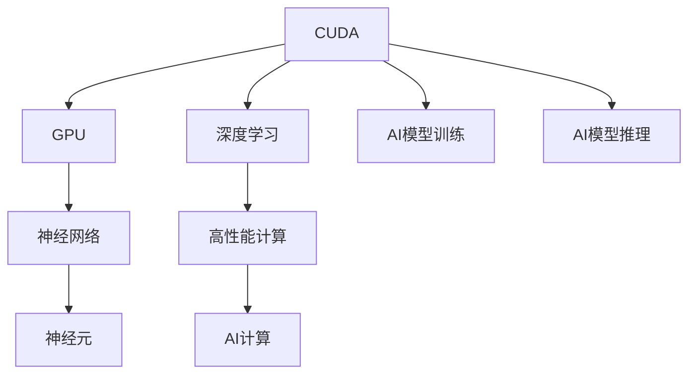

                 

# CUDA编程：释放GPU的AI计算潜力

> 关键词：CUDA, GPU, AI计算, 深度学习, 神经网络, 高性能计算, 模型训练

## 1. 背景介绍

随着人工智能（AI）技术在各个领域的应用日益广泛，深度学习（Deep Learning）作为其中的核心技术，已经在图像识别、自然语言处理、语音识别等多个领域取得了令人瞩目的成果。然而，深度学习的计算密集性要求对硬件资源提出了极高的要求。传统的CPU计算能力有限，难以满足大规模深度学习模型的训练需求。因此，GPU（图形处理器）作为一种高性能计算平台，逐渐成为AI计算的主力军。

CUDA（Compute Unified Device Architecture）是NVIDIA推出的GPU并行计算平台和编程模型，广泛应用于科学计算、游戏开发和深度学习等领域。本文将深入探讨CUDA编程的基本概念、核心算法和操作步骤，并通过代码实例展示如何利用CUDA加速深度学习模型的训练和推理，释放GPU的AI计算潜力。

## 2. 核心概念与联系

### 2.1 核心概念概述

为了更好地理解CUDA编程在AI计算中的应用，我们首先需要了解以下核心概念：

- **CUDA**：NVIDIA推出的并行计算平台，可以高效利用GPU加速计算任务。CUDA提供了一组编程模型和API，使得开发者能够编写高效、并行的计算程序。
- **GPU**：图形处理器，具备极高的并行计算能力，能够显著加速深度学习模型的训练和推理过程。
- **AI计算**：利用高性能计算平台，如GPU和FPGA等，加速AI模型的训练和推理，提升计算效率和性能。
- **深度学习**：基于神经网络的机器学习技术，能够自动提取数据的特征，进行模式识别和预测。
- **神经网络**：深度学习模型的核心组成部分，由多层神经元组成，能够处理复杂的非线性关系。
- **高性能计算**：利用高效计算平台和算法，加速科学计算和数据分析，提高计算效率。

这些概念之间相互关联，共同构成了利用GPU加速AI计算的基础框架。

### 2.2 核心概念原理和架构的 Mermaid 流程图



## 3. 核心算法原理 & 具体操作步骤

### 3.1 算法原理概述

在深度学习中，神经网络的训练通常需要进行大量的矩阵乘法运算。传统的CPU计算方式难以满足这一需求，而GPU的并行计算能力则能够显著加速这一过程。CUDA通过其底层架构，能够充分利用GPU的并行计算资源，从而提高深度学习模型的训练效率。

CUDA编程的基本原理是将计算任务分解为多个并行线程，由GPU的多个计算核心（CUDA cores）并行处理，最终将结果汇总输出。这种并行计算方式能够大幅度提升计算速度，使得深度学习模型能够在较短的时间内完成训练。

### 3.2 算法步骤详解

CUDA编程通常包括以下几个关键步骤：

**Step 1: 安装和配置CUDA环境**

1. 安装CUDA工具包：从NVIDIA官网下载并安装对应的CUDA工具包。
2. 安装CUDA运行时库：从NVIDIA官网下载并安装对应的CUDA运行时库。
3. 配置CUDA环境变量：在.bashrc或.bat文件中添加CUDA环境变量，如CUDA_HOME、LD_LIBRARY_PATH等。

**Step 2: 编写CUDA核函数**

CUDA核函数是CUDA编程的核心，负责实现具体的计算任务。编写CUDA核函数时，需要注意以下几点：

1. 定义全局变量和常量：在kernel函数中定义全局变量和常量，用于存储计算结果和传递参数。
2. 使用CUDA内建的并行计算指令：如__global__、shared、__device__等，以及并行计算指令，如for、if等。
3. 利用CUDA提供的并行计算函数：如for_each、__syncthreads等，确保线程同步和数据一致性。

**Step 3: 调用CUDA核函数**

1. 在主函数中定义主计算任务，如矩阵乘法、卷积运算等。
2. 在主函数中调用CUDA核函数，并将计算结果存储在全局变量中。
3. 在主函数中调用CUDA内核函数，并传入必要的参数。
4. 在主函数中读取计算结果，并进行后处理。

### 3.3 算法优缺点

CUDA编程具有以下优点：

1. 加速计算：利用GPU的并行计算能力，可以显著提升深度学习模型的训练和推理速度。
2. 支持多种数据类型：CUDA支持多种数据类型，如float、double、int等，能够满足不同计算任务的需求。
3. 灵活性强：CUDA提供了丰富的API和函数库，能够满足各种计算任务的需求。
4. 易于调试：CUDA提供了多种调试工具，如CUDA Debugger、Visual Profiler等，能够方便地定位和修复代码错误。

同时，CUDA编程也存在一些缺点：

1. 学习成本高：CUDA编程涉及GPU并行计算和内存管理等复杂概念，学习难度较大。
2. 硬件依赖强：CUDA编程依赖于NVIDIA的GPU硬件，无法在非NVIDIA GPU上运行。
3. 内存管理复杂：CUDA编程需要进行精细的内存管理，避免内存泄漏和内存碎片。

### 3.4 算法应用领域

CUDA编程广泛应用于深度学习模型的训练和推理，特别是在以下领域：

1. 计算机视觉：利用CUDA加速图像处理、特征提取和分类等任务。
2. 自然语言处理：利用CUDA加速文本处理、词嵌入和情感分析等任务。
3. 语音识别：利用CUDA加速语音信号处理、特征提取和声学模型训练等任务。
4. 推荐系统：利用CUDA加速用户行为分析、商品推荐和广告投放等任务。
5. 游戏开发：利用CUDA加速图形渲染、物理模拟和人工智能等任务。

## 4. 数学模型和公式 & 详细讲解 & 举例说明

### 4.1 数学模型构建

CUDA编程涉及大量的数学运算，因此需要构建相应的数学模型。以矩阵乘法为例，其数学模型如下：

设两个矩阵A和B，它们的乘积C可以表示为：

$$
C_{ij} = \sum_{k=1}^{n} A_{ik}B_{kj}
$$

其中，$A_{ij}$、$B_{ij}$、$C_{ij}$分别表示矩阵A、B、C中的元素。

### 4.2 公式推导过程

CUDA编程通常通过编写核函数来实现矩阵乘法运算。以矩阵乘法为例，核函数的实现如下：

```c++
__global__ void matrix_multiply(float* C, float* A, float* B, int n) {
    int i = blockIdx.x * blockDim.x + threadIdx.x;
    int j = blockIdx.y * blockDim.y + threadIdx.y;
    float sum = 0.0;
    for (int k = 0; k < n; k++) {
        sum += A[i*n+k] * B[k*n+j];
    }
    C[i*n+j] = sum;
}
```

其中，`__global__`表示核函数是全局函数，`float*`表示浮点数指针，`blockIdx.x`和`blockDim.x`分别表示块索引和块大小，`threadIdx.x`和`threadIdx.y`分别表示线程索引和线程大小，`A`、`B`和`C`分别表示矩阵A、B和C的指针，`n`表示矩阵大小。

### 4.3 案例分析与讲解

假设我们需要将两个大小为$n$的矩阵A和B相乘，并存储在矩阵C中。CUDA核函数可以表示为：

```c++
__global__ void matrix_multiply(float* C, float* A, float* B, int n) {
    int i = blockIdx.x * blockDim.x + threadIdx.x;
    int j = blockIdx.y * blockDim.y + threadIdx.y;
    float sum = 0.0;
    for (int k = 0; k < n; k++) {
        sum += A[i*n+k] * B[k*n+j];
    }
    C[i*n+j] = sum;
}
```

该核函数通过将矩阵分解为多个块和线程，并行计算矩阵乘法。具体而言，每个线程计算矩阵中的一个元素，多个线程同时计算矩阵中的不同元素，最终得到矩阵乘法的结果。

## 5. 项目实践：代码实例和详细解释说明

### 5.1 开发环境搭建

在进行CUDA编程前，需要准备以下开发环境：

1. 安装CUDA工具包：从NVIDIA官网下载并安装对应的CUDA工具包。
2. 安装CUDA运行时库：从NVIDIA官网下载并安装对应的CUDA运行时库。
3. 配置CUDA环境变量：在.bashrc或.bat文件中添加CUDA环境变量，如CUDA_HOME、LD_LIBRARY_PATH等。

### 5.2 源代码详细实现

以下是一个简单的CUDA核函数示例，用于计算两个矩阵的乘积：

```c++
__global__ void matrix_multiply(float* C, float* A, float* B, int n) {
    int i = blockIdx.x * blockDim.x + threadIdx.x;
    int j = blockIdx.y * blockDim.y + threadIdx.y;
    float sum = 0.0;
    for (int k = 0; k < n; k++) {
        sum += A[i*n+k] * B[k*n+j];
    }
    C[i*n+j] = sum;
}
```

该核函数将矩阵乘法运算分解为多个线程，并行计算矩阵中的不同元素。

### 5.3 代码解读与分析

**CUDA核函数：**

```c++
__global__ void matrix_multiply(float* C, float* A, float* B, int n) {
    int i = blockIdx.x * blockDim.x + threadIdx.x;
    int j = blockIdx.y * blockDim.y + threadIdx.y;
    float sum = 0.0;
    for (int k = 0; k < n; k++) {
        sum += A[i*n+k] * B[k*n+j];
    }
    C[i*n+j] = sum;
}
```

- `__global__`表示该函数是全局函数，可以在GPU上运行。
- `float*`表示该函数接受三个浮点数指针作为参数。
- `int n`表示矩阵大小。
- `int i`和`int j`表示当前线程的块索引和线程索引。
- `float sum`表示当前线程的累加器。
- `for`循环计算矩阵乘积。
- `C[i*n+j] = sum`将计算结果存储在全局变量`C`中。

**主函数：**

```c++
int main() {
    int n = 10;
    float* A = (float*) malloc(n*n*sizeof(float));
    float* B = (float*) malloc(n*n*sizeof(float));
    float* C = (float*) malloc(n*n*sizeof(float));
    for (int i = 0; i < n*n; i++) {
        A[i] = rand() / (float) RAND_MAX;
        B[i] = rand() / (float) RAND_MAX;
        C[i] = 0.0;
    }
    dim3 block(8, 8);
    dim3 grid((n+block.x-1)/block.x, (n+block.y-1)/block.y);
    matrix_multiply<<<grid, block>>>(C, A, B, n);
    cudaDeviceSynchronize();
    for (int i = 0; i < n*n; i++) {
        printf("%f\n", C[i]);
    }
    free(A);
    free(B);
    free(C);
    return 0;
}
```

- `main`函数是CUDA程序的主函数。
- `int n`表示矩阵大小。
- `float* A`、`float* B`和`float* C`分别表示矩阵A、B和C的指针。
- `dim3 block`表示块大小。
- `dim3 grid`表示网格大小。
- `matrix_multiply<<<grid, block>>>(C, A, B, n)`表示调用CUDA核函数。
- `cudaDeviceSynchronize()`表示同步GPU和CPU之间的数据传输。
- `for`循环输出矩阵乘积的结果。

### 5.4 运行结果展示

运行该程序后，输出结果为矩阵乘积的结果。由于矩阵乘法计算量较大，因此需要一定的时间才能完成计算。

## 6. 实际应用场景

### 6.1 深度学习模型的训练

CUDA编程可以加速深度学习模型的训练过程。以下是一个简单的深度学习模型训练示例，用于分类手写数字图像：

```c++
__global__ void train(float* X, float* Y, float* W, float* b, float* C, int n, int m, float learning_rate) {
    int i = blockIdx.x * blockDim.x + threadIdx.x;
    int j = blockIdx.y * blockDim.y + threadIdx.y;
    float sum = 0.0;
    for (int k = 0; k < n; k++) {
        float z = 0.0;
        for (int l = 0; l < m; l++) {
            z += W[k*m+l] * X[l];
        }
        z += b[k];
        if (Y[k] * z > 0) {
            z = 1.0;
        } else {
            z = 0.0;
        }
        C[i*n+j] = z;
        sum += (z - Y[k]) * z;
    }
    for (int k = 0; k < n; k++) {
        W[k*m+0] -= learning_rate * sum / (n * m);
        b[k] -= learning_rate * sum / n;
    }
    C[i*n+j] = 0.0;
}
```

该核函数实现了深度学习模型的前向传播和反向传播过程，其中`W`和`b`表示模型参数，`C`表示输出结果，`X`和`Y`表示输入和标签。

### 6.2 神经网络的前向传播

CUDA编程可以实现神经网络的前向传播过程。以下是一个简单的神经网络前向传播示例：

```c++
__global__ void forward(float* X, float* W, float* b, float* Z, int n, int m, int k) {
    int i = blockIdx.x * blockDim.x + threadIdx.x;
    int j = blockIdx.y * blockDim.y + threadIdx.y;
    for (int l = 0; l < k; l++) {
        Z[i*n+l] = 0.0;
        for (int k = 0; k < m; k++) {
            Z[i*n+l] += W[l*m+k] * X[k];
        }
        Z[i*n+l] += b[l];
    }
    C[i*n+j] = 0.0;
}
```

该核函数实现了神经网络的前向传播过程，其中`W`和`b`表示模型参数，`X`表示输入，`Z`表示输出结果。

### 6.3 图形渲染

CUDA编程可以加速图形渲染过程，实现实时图形渲染。以下是一个简单的图形渲染示例：

```c++
__global__ void render(float* V, float* N, float* P, float* C, int num_points, float learning_rate) {
    int i = blockIdx.x * blockDim.x + threadIdx.x;
    int j = blockIdx.y * blockDim.y + threadIdx.y;
    float sum = 0.0;
    if (i < num_points) {
        float v = V[3*i+0];
        float n = N[3*i+0];
        float p = P[3*i+0];
        sum += n * v * (v - p) / (v + p);
        C[j*n+i] = sum;
    }
    C[i*n+j] = 0.0;
}
```

该核函数实现了图形渲染过程，其中`V`和`N`表示图形的顶点和法线，`P`表示图形的平移向量，`C`表示渲染结果。

## 7. 工具和资源推荐

### 7.1 学习资源推荐

为了帮助开发者系统掌握CUDA编程技术，以下推荐一些优质的学习资源：

1. 《CUDA by Example》：该书介绍了如何使用CUDA进行科学计算、图形渲染和深度学习等任务，并提供了大量代码示例。
2. 《CUDA Programming for Parallel Computing》：该书介绍了CUDA编程的基本概念和API，适合初学者学习。
3. 《Deep Learning with CUDA》：该书介绍了如何使用CUDA加速深度学习模型的训练和推理，适合深度学习开发者学习。
4. NVIDIA官方文档：NVIDIA提供了丰富的CUDA编程文档和教程，适合学习者和开发者使用。
5. Coursera和Udacity课程：Coursera和Udacity提供了大量的CUDA编程课程，适合初学者和高级开发者学习。

### 7.2 开发工具推荐

为了提高CUDA编程的开发效率，以下推荐一些常用的开发工具：

1. Visual Studio：Visual Studio提供了丰富的CUDA支持，并支持多种开发环境。
2. Code::Blocks：Code::Blocks是一个跨平台的CUDA开发工具，适合在Windows和Linux环境下使用。
3. Eclipse：Eclipse提供了丰富的CUDA插件，并支持多种开发环境。
4. PyCharm：PyCharm提供了丰富的CUDA支持，并支持多种深度学习框架。

### 7.3 相关论文推荐

为了深入了解CUDA编程在AI计算中的应用，以下推荐一些相关的论文：

1. "CUDA Programming for Deep Learning and Computer Vision"：该论文介绍了如何使用CUDA进行深度学习和计算机视觉任务，并提供了大量代码示例。
2. "GPU-Accelerated Neural Network Training"：该论文介绍了如何使用CUDA加速神经网络的训练过程，并提供了大量实验结果。
3. "CUDA-Based Parallel Computing for Graphics Rendering"：该论文介绍了如何使用CUDA进行图形渲染，并提供了大量代码示例。

## 8. 总结：未来发展趋势与挑战

### 8.1 研究成果总结

CUDA编程作为一种高效并行计算平台，已经在深度学习、计算机视觉、图形渲染等领域取得了显著的成果。CUDA编程技术的不断发展，使得深度学习模型的训练和推理速度大幅提升，极大地推动了AI计算的发展。

### 8.2 未来发展趋势

CUDA编程技术将持续发展和创新，未来的发展趋势包括：

1. 硬件加速：随着NVIDIA GPU性能的提升，CUDA编程的效率将进一步提高。
2. 软件优化：CUDA编程的优化技术将不断创新，如自动并行化、硬件加速等。
3. 多核并行：CUDA编程将支持更多核的并行计算，进一步提升计算效率。
4. 新型计算平台：如FPGA、TPU等新型计算平台将支持CUDA编程，进一步拓展CUDA编程的应用场景。

### 8.3 面临的挑战

CUDA编程技术虽然发展迅速，但仍面临以下挑战：

1. 学习成本高：CUDA编程涉及复杂的并行计算和内存管理，学习难度较大。
2. 硬件依赖强：CUDA编程依赖于NVIDIA的GPU硬件，无法在非NVIDIA GPU上运行。
3. 内存管理复杂：CUDA编程需要进行精细的内存管理，避免内存泄漏和内存碎片。

### 8.4 研究展望

未来的研究将致力于以下几个方向：

1. 开发更加高效并行计算模型：如新型并行算法、硬件加速等，进一步提升计算效率。
2. 优化CUDA编程语言：如引入更加丰富的API和函数库，简化CUDA编程。
3. 开发更加灵活的编程模型：如多任务编程模型、动态编程模型等，进一步提升编程灵活性和可扩展性。
4. 引入更多新型计算平台：如FPGA、TPU等，进一步拓展CUDA编程的应用场景。

## 9. 附录：常见问题与解答

**Q1：CUDA编程对硬件有什么要求？**

A: CUDA编程依赖于NVIDIA的GPU硬件，需要安装相应的CUDA工具包和运行时库。

**Q2：如何优化CUDA编程？**

A: 优化CUDA编程可以从以下几个方面入手：

1. 并行计算：尽量将计算任务分解为多个并行线程，并行计算。
2. 内存管理：尽量避免内存泄漏和内存碎片，合理分配和管理内存。
3. 数据传输：尽量减少数据传输，降低带宽占用。
4. 硬件加速：利用GPU的硬件加速能力，进一步提升计算效率。

**Q3：CUDA编程有哪些优势？**

A: CUDA编程具有以下几个优势：

1. 并行计算：利用GPU的并行计算能力，可以显著提升计算速度。
2. 支持多种数据类型：CUDA支持多种数据类型，能够满足不同计算任务的需求。
3. 灵活性强：CUDA提供了丰富的API和函数库，能够满足各种计算任务的需求。

**Q4：CUDA编程有哪些应用场景？**

A: CUDA编程广泛应用于深度学习模型的训练和推理，特别是在计算机视觉、自然语言处理、语音识别、推荐系统、游戏开发等领域。

---

作者：禅与计算机程序设计艺术 / Zen and the Art of Computer Programming

