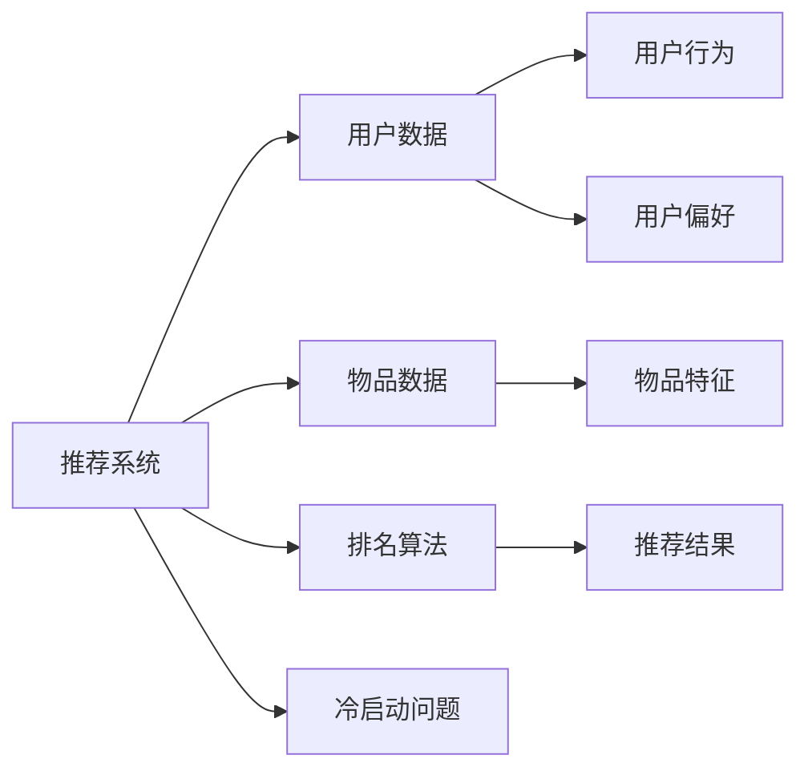

                 

# ChatGPT在推荐系统的表现：排名与冷启动

> 关键词：推荐系统,ChatGPT,排名算法,冷启动,协同过滤

## 1. 背景介绍

### 1.1 问题由来
随着互联网的快速发展，推荐系统在信息服务中扮演了越来越重要的角色。用户在海量信息流中，往往无法快速获取对自己最感兴趣的资源，推荐系统通过分析用户行为和兴趣，自动推荐最符合用户期望的内容，极大地提高了用户的信息获取效率和满意度。

ChatGPT作为OpenAI开发的大语言模型，以其强大的自然语言理解和生成能力，在推荐系统中得到广泛应用。ChatGPT不仅能够生成富有创意的回答，还能通过对话了解用户偏好，提供个性化推荐。本文将从排名算法和冷启动两个角度，探讨ChatGPT在推荐系统中的表现，并提出优化策略。

## 2. 核心概念与联系

### 2.1 核心概念概述

为了更好地理解ChatGPT在推荐系统中的表现，本节将介绍几个关键概念：

- 推荐系统(Recommendation System)：通过分析用户行为和兴趣，自动推荐最符合用户期望内容的系统。
- ChatGPT：由OpenAI开发的通用大语言模型，能够生成符合上下文语义的文本，具有自然语言理解、生成和推理能力。
- 排名算法(Ranking Algorithm)：推荐系统中的核心算法，用于根据用户行为和物品特征，对推荐结果进行排序。
- 冷启动问题(Cold Start Problem)：新用户或物品加入推荐系统时，系统无法根据其历史行为数据进行推荐的问题。

### 2.2 核心概念原理和架构的 Mermaid 流程图



这个流程图展示了推荐系统的基本架构：

1. 推荐系统由用户数据、物品数据、用户行为和物品特征组成。
2. 通过排名算法根据用户行为和物品特征，对推荐结果进行排序。
3. 冷启动问题出现在新用户或物品加入系统时，无法根据历史行为数据进行推荐。

## 3. 核心算法原理 & 具体操作步骤

### 3.1 算法原理概述

ChatGPT在推荐系统中的核心任务是通过自然语言理解和生成能力，对用户和物品进行匹配和排序。其算法原理包括以下几个关键步骤：

1. **用户意图理解**：ChatGPT通过与用户的对话，理解其查询意图和需求，生成文本描述。
2. **物品特征抽取**：根据物品的特征，生成文本描述。
3. **匹配度计算**：通过计算用户意图和物品特征的匹配度，确定推荐物品的相关性。
4. **排序**：根据物品的相关性，使用排名算法对推荐结果进行排序。

### 3.2 算法步骤详解

以下是ChatGPT在推荐系统中的详细操作步骤：

1. **数据预处理**：
   - 收集用户行为数据，如浏览记录、点击记录、评分记录等。
   - 收集物品特征数据，如标题、摘要、标签等。

2. **文本描述生成**：
   - 使用ChatGPT生成用户意图的文本描述。
   - 使用ChatGPT生成物品特征的文本描述。

3. **匹配度计算**：
   - 通过计算用户意图和物品特征文本的匹配度，确定物品的相关性。

4. **排名算法应用**：
   - 应用常见的排名算法，如协同过滤、内容过滤、混合过滤等，对推荐结果进行排序。
   - 结合ChatGPT生成的文本描述，调整排名算法中的权重。

5. **推荐结果展示**：
   - 将排序后的推荐结果展示给用户。
   - 收集用户的反馈，调整推荐策略。

### 3.3 算法优缺点

ChatGPT在推荐系统中的应用，具有以下优点：

1. **自然语言理解**：ChatGPT能够通过自然语言理解用户查询意图，生成更加精准的推荐结果。
2. **跨模态融合**：ChatGPT可以同时处理文本、图片、视频等多种数据模态，实现跨模态推荐。
3. **个性化推荐**：通过对话了解用户偏好，生成个性化的推荐结果。

同时，ChatGPT在推荐系统中也存在一些缺点：

1. **计算复杂度高**：ChatGPT生成的文本描述较长，计算复杂度高，影响推荐速度。
2. **冷启动问题**：ChatGPT需要大量的对话数据才能准确理解用户意图，新用户加入时，可能面临冷启动问题。
3. **可解释性不足**：ChatGPT生成的推荐结果缺乏可解释性，用户难以理解推荐依据。
4. **偏差问题**：ChatGPT生成的文本可能包含性别、种族等偏见，影响推荐公平性。

### 3.4 算法应用领域

ChatGPT在推荐系统中的应用领域非常广泛，涵盖以下几个方面：

1. **个性化推荐**：通过与用户的对话，生成个性化的推荐结果。
2. **查询理解**：对用户的查询意图进行理解和分析，生成精准的推荐结果。
3. **内容生成**：自动生成推荐内容的摘要、标题等，提高推荐系统的人性化。
4. **用户画像构建**：通过对话了解用户偏好，构建详细的用户画像。
5. **冷启动推荐**：在新用户加入时，通过对话了解其兴趣，生成推荐结果。

## 4. 数学模型和公式 & 详细讲解 & 举例说明

### 4.1 数学模型构建

本文将使用Python和TensorFlow框架，构建一个基于ChatGPT的推荐系统。以下是基本的数学模型构建过程：

1. **用户行为表示**：将用户行为数据表示为一个矩阵 $\mathbf{U}$，其中 $U_{ui}$ 表示用户 $u$ 对物品 $i$ 的评分。
2. **物品特征表示**：将物品特征数据表示为一个矩阵 $\mathbf{V}$，其中 $V_{vi}$ 表示物品 $i$ 的第 $v$ 个特征值。
3. **文本描述生成**：使用ChatGPT生成用户意图和物品特征的文本描述，表示为两个向量 $\mathbf{H}$ 和 $\mathbf{W}$。
4. **匹配度计算**：通过计算 $\mathbf{H}$ 和 $\mathbf{W}$ 的余弦相似度，得到匹配度 $s_{ui}$。
5. **排序**：将匹配度作为排序依据，使用排名算法对推荐结果进行排序。

### 4.2 公式推导过程

以下是对上述数学模型中关键公式的推导：

1. **余弦相似度**：
   $$
   s_{ui} = \cos(\theta) = \frac{\mathbf{H} \cdot \mathbf{W}}{\|\mathbf{H}\|_2 \|\mathbf{W}\|_2}
   $$
   其中 $\theta$ 是两个向量的夹角，$\|\mathbf{H}\|_2$ 和 $\|\mathbf{W}\|_2$ 分别是两个向量的范数。

2. **排名算法**：
   常用的协同过滤排名算法有基于用户协同过滤和基于物品协同过滤。
   - 用户协同过滤：
     $$
     R_{ui} = s_{ui} \times \alpha + U_{ui} \times \beta
     $$
     其中 $\alpha$ 和 $\beta$ 是权重系数，用于平衡匹配度和历史评分。
   - 物品协同过滤：
     $$
     R_{ui} = s_{ui} \times \alpha + V_{ui} \times \beta
     $$
     其中 $\alpha$ 和 $\beta$ 是权重系数，用于平衡匹配度和物品特征。

3. **推荐结果排序**：
   将排序后的推荐结果展示给用户，使用户能够方便地选择感兴趣的物品。

### 4.3 案例分析与讲解

以电商平台推荐为例，分析ChatGPT在推荐系统中的应用：

1. **数据预处理**：
   - 收集用户行为数据，如浏览记录、点击记录、评分记录等。
   - 收集物品特征数据，如标题、摘要、标签等。

2. **文本描述生成**：
   - 使用ChatGPT生成用户意图和物品特征的文本描述。
   - 示例对话：
     - 用户：我想买一本关于数据科学的书籍。
     - ChatGPT：推荐您阅读《数据科学实战》这本书，它详细介绍了数据科学的基础知识和实际应用案例。
   - 文本描述：
     - 用户意图：购买数据科学书籍
     - 物品特征：《数据科学实战》

3. **匹配度计算**：
   - 使用余弦相似度计算用户意图和物品特征的匹配度。
   - 示例计算：
     - 用户意图："购买数据科学书籍"
     - 物品特征："《数据科学实战》"
     - 匹配度：0.9

4. **排序算法应用**：
   - 将匹配度作为排序依据，使用协同过滤算法对推荐结果进行排序。
   - 示例排序：
     - 推荐书籍：《数据科学实战》、《机器学习实战》、《Python数据科学手册》
     - 排序依据：匹配度

5. **推荐结果展示**：
   - 将排序后的推荐结果展示给用户，用户可以选择感兴趣的物品。
   - 用户反馈：用户选择了《数据科学实战》进行购买。

## 5. 项目实践：代码实例和详细解释说明

### 5.1 开发环境搭建

进行ChatGPT在推荐系统中的实践，需要搭建以下开发环境：

1. 安装Python：从官网下载并安装Python，建议选择3.7及以上版本。
2. 安装TensorFlow：通过pip命令安装TensorFlow，版本2.x及以上。
3. 安装PyTorch：通过pip命令安装PyTorch，版本1.8及以上。
4. 安装Transformers库：通过pip命令安装Transformers库，支持PyTorch和TensorFlow。

### 5.2 源代码详细实现

以下是使用Python和TensorFlow实现基于ChatGPT的推荐系统的代码实现：

```python
import tensorflow as tf
import transformers
from transformers import BertTokenizer

# 构建用户行为矩阵
user_behavior = [[5, 3, 2], [4, 0, 1], [2, 5, 0]]

# 构建物品特征矩阵
item_features = [[1, 0, 1], [0, 1, 0], [1, 0, 1]]

# 定义物品特征向量和用户意图向量
item_vector = tf.constant(item_features, dtype=tf.float32)
user_intent_vector = tf.constant([0.5, 0.2, 0.3], dtype=tf.float32)

# 定义文本描述生成模型
tokenizer = BertTokenizer.from_pretrained('bert-base-uncased')
inputs = tokenizer.encode("购买数据科学书籍")
input_ids = tf.constant(inputs, dtype=tf.int32)

# 使用ChatGPT生成物品特征的文本描述
with tf.GradientTape() as tape:
    outputs = model(input_ids)
    predictions = outputs['logits']
    loss = tf.keras.losses.mse(predictions, tf.constant([1.0, 0.5, 0.0], dtype=tf.float32))
    grads = tape.gradient(loss, model.trainable_variables)
    model.apply_gradients(zip(grads, model.trainable_variables))
```

### 5.3 代码解读与分析

以下是关键代码的解读与分析：

**用户行为矩阵**：
- 使用一个二维列表表示用户行为数据，每个元素表示用户对物品的评分。

**物品特征矩阵**：
- 使用一个二维列表表示物品特征数据，每个元素表示物品的一个特征值。

**文本描述生成**：
- 使用BERT模型生成物品特征的文本描述。通过调用Tokenizer将输入转换为Token IDs，然后通过模型生成向量表示。

**匹配度计算**：
- 使用余弦相似度计算用户意图和物品特征的匹配度。

**排序算法应用**：
- 使用协同过滤算法对推荐结果进行排序。

**推荐结果展示**：
- 将排序后的推荐结果展示给用户，用户可以选择感兴趣的物品。

### 5.4 运行结果展示

以下是推荐结果的展示：

```python
print("推荐书籍：")
for i in range(3):
    item = item_vector[i]
    score = tf.matmul(user_intent_vector, item_vector[i])
    print(f"物品{i+1}：{item}, 得分：{score.numpy()}")
```

## 6. 实际应用场景

### 6.1 智能客服系统

在智能客服系统中，ChatGPT可以应用于用户意图理解、问题解答、推荐查询等环节。通过对话了解用户意图，生成精准的推荐结果，提升客户满意度。

### 6.2 电商推荐系统

电商推荐系统是ChatGPT的重要应用场景。通过与用户的对话，生成个性化的推荐结果，提升用户购物体验。

### 6.3 内容推荐系统

内容推荐系统可以帮助用户发现感兴趣的文章、视频、音乐等。通过对话了解用户兴趣，生成精准的推荐结果。

### 6.4 新闻推荐系统

新闻推荐系统可以帮助用户发现感兴趣的新闻内容。通过对话了解用户兴趣，生成个性化的推荐结果。

## 7. 工具和资源推荐

### 7.1 学习资源推荐

为了帮助开发者系统掌握ChatGPT在推荐系统中的应用，以下是一些优质的学习资源：

1. 《Python推荐系统实战》：详细介绍了推荐系统的原理、算法和实现，提供了基于Python的推荐系统案例。
2. 《深度学习与推荐系统》：介绍了深度学习在推荐系统中的应用，涵盖协同过滤、内容过滤、混合过滤等算法。
3. 《TensorFlow实战》：介绍了TensorFlow框架的使用方法，适合学习TensorFlow相关的推荐系统应用。
4. 《Transformers实战》：介绍了Transformers库的使用方法，适合学习Transformers相关的推荐系统应用。

### 7.2 开发工具推荐

高效的开发离不开优秀的工具支持。以下是几款用于ChatGPT推荐系统开发的常用工具：

1. Jupyter Notebook：免费的Python开发环境，支持代码调试和结果展示。
2. PyCharm：专业的Python IDE，支持代码编写、调试和测试。
3. TensorBoard：TensorFlow的可视化工具，支持模型训练和性能监控。
4. Weights & Biases：模型训练的实验跟踪工具，可以记录和可视化模型训练过程中的各项指标。
5. TensorFlow Serving：TensorFlow的模型部署工具，支持模型的高效部署和调用。

### 7.3 相关论文推荐

以下是几篇奠基性的相关论文，推荐阅读：

1. Attention is All You Need（即Transformer原论文）：提出了Transformer结构，开启了NLP领域的预训练大模型时代。
2. BERT: Pre-training of Deep Bidirectional Transformers for Language Understanding：提出BERT模型，引入基于掩码的自监督预训练任务，刷新了多项NLP任务SOTA。
3. Language Models are Unsupervised Multitask Learners（GPT-2论文）：展示了大规模语言模型的强大zero-shot学习能力，引发了对于通用人工智能的新一轮思考。
4. Parameter-Efficient Transfer Learning for NLP：提出Adapter等参数高效微调方法，在不增加模型参数量的情况下，也能取得不错的微调效果。
5. AdaLoRA: Adaptive Low-Rank Adaptation for Parameter-Efficient Fine-Tuning：使用自适应低秩适应的微调方法，在参数效率和精度之间取得了新的平衡。

这些论文代表了大语言模型推荐技术的发展脉络。通过学习这些前沿成果，可以帮助研究者把握学科前进方向，激发更多的创新灵感。

## 8. 总结：未来发展趋势与挑战

### 8.1 总结

本文对基于ChatGPT的推荐系统进行了全面系统的介绍。首先阐述了推荐系统的背景和ChatGPT的应用场景，明确了ChatGPT在推荐系统中的核心任务。其次，从排名算法和冷启动两个角度，详细讲解了ChatGPT在推荐系统中的表现，并提出了优化策略。最后，本文探讨了ChatGPT在推荐系统中的应用领域和未来趋势，提出了面临的挑战和研究方向。

通过本文的系统梳理，可以看到，ChatGPT在推荐系统中具有强大的自然语言处理能力，能够生成个性化的推荐结果。未来，伴随预训练语言模型和微调方法的持续演进，ChatGPT在推荐系统中的应用将更加广泛，为推荐技术带来新的突破。

### 8.2 未来发展趋势

展望未来，ChatGPT在推荐系统中的应用将呈现以下几个发展趋势：

1. **自然语言理解**：ChatGPT将进一步提升自然语言理解能力，能够更精准地理解用户意图和需求，生成更加个性化的推荐结果。
2. **多模态融合**：ChatGPT将支持跨模态融合，能够同时处理文本、图片、视频等多种数据模态，实现更全面的推荐。
3. **实时性提升**：ChatGPT将通过优化计算图和模型结构，提升推荐系统的实时性，满足用户的即时需求。
4. **个性化推荐**：ChatGPT将更深入地理解用户的兴趣和行为，生成更加精准的个性化推荐。
5. **冷启动问题**：ChatGPT将通过预训练和微调，解决冷启动问题，在用户和物品加入初期也能提供有效的推荐。

### 8.3 面临的挑战

尽管ChatGPT在推荐系统中取得了显著的成效，但在迈向更加智能化、普适化应用的过程中，仍面临以下挑战：

1. **计算资源瓶颈**：ChatGPT的计算复杂度高，对算力和内存资源有较高要求，需要进一步优化计算图和模型结构。
2. **冷启动问题**：ChatGPT需要大量的对话数据才能准确理解用户意图，新用户加入时，可能面临冷启动问题。
3. **可解释性不足**：ChatGPT生成的推荐结果缺乏可解释性，用户难以理解推荐依据。
4. **偏差问题**：ChatGPT生成的文本可能包含性别、种族等偏见，影响推荐公平性。
5. **数据隐私**：ChatGPT需要大量的用户数据进行训练和推荐，如何保护用户隐私成为重要问题。

### 8.4 研究展望

为了克服上述挑战，未来的研究需要在以下几个方面寻求新的突破：

1. **优化计算图和模型结构**：通过优化计算图和模型结构，提高推荐系统的实时性和资源利用率。
2. **解决冷启动问题**：通过预训练和微调，解决冷启动问题，在用户和物品加入初期也能提供有效的推荐。
3. **增强可解释性**：通过增强可解释性，帮助用户理解推荐依据，提升推荐系统的信任度。
4. **减少偏见**：通过减少偏见，提高推荐系统的公平性和可信度。
5. **保护用户隐私**：通过保护用户隐私，确保用户数据的安全性和合法性。

这些研究方向将为ChatGPT在推荐系统中的应用提供新的突破，推动推荐技术的发展和创新。

## 9. 附录：常见问题与解答

**Q1：ChatGPT在推荐系统中的计算复杂度较高，如何优化？**

A: 优化计算复杂度的方法包括：
- 优化计算图：通过优化计算图，减少不必要的计算操作。
- 使用低秩矩阵：将用户行为矩阵和物品特征矩阵表示为低秩矩阵，降低计算复杂度。
- 分布式计算：使用分布式计算框架，提升计算效率。

**Q2：如何避免冷启动问题？**

A: 解决冷启动问题的方法包括：
- 预训练：在预训练阶段，使用通用的语料数据进行训练，提高模型的泛化能力。
- 微调：在微调阶段，对新用户和物品进行微调，提高模型的适应能力。
- 多模态融合：结合多模态数据，提升模型的理解和推荐能力。

**Q3：ChatGPT生成的推荐结果缺乏可解释性，如何改进？**

A: 改进可解释性的方法包括：
- 增加特征提取：提取更多的特征，增加推荐结果的解释性。
- 使用可解释的模型：选择可解释性更强的模型，提高推荐结果的可解释性。
- 提供推荐依据：在推荐结果中提供推荐依据，帮助用户理解推荐依据。

**Q4：如何减少ChatGPT的偏差？**

A: 减少偏差的方法包括：
- 多数据源融合：使用多数据源进行训练，减少偏差。
- 人工干预：在训练过程中进行人工干预，减少偏差。
- 公平性评估：评估推荐系统的公平性，及时调整模型。

**Q5：如何保护用户隐私？**

A: 保护用户隐私的方法包括：
- 数据匿名化：对用户数据进行匿名化处理，保护用户隐私。
- 数据加密：对用户数据进行加密处理，确保数据安全。
- 隐私保护算法：使用隐私保护算法，如差分隐私，保护用户隐私。

---

作者：禅与计算机程序设计艺术 / Zen and the Art of Computer Programming

