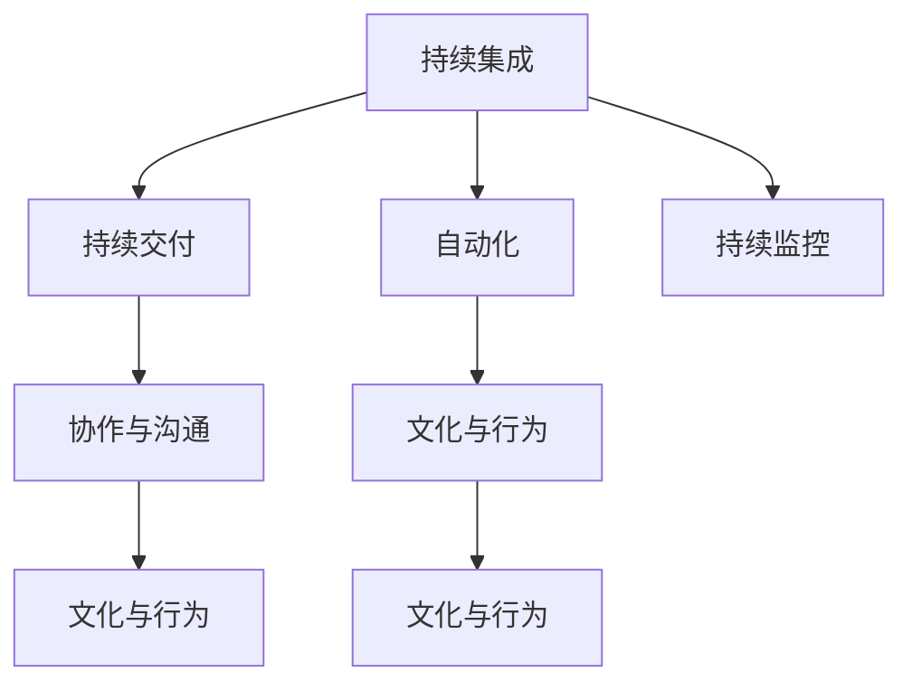

                 

# DevOps 实践指南：构建高效的软件交付流程

## 1. 背景介绍

在当今快速变化的商业环境中，软件交付速度和质量成为企业竞争力的关键因素。DevOps文化正成为构建高效、可靠的软件交付流程的重要推动力。DevOps（Development & Operations）结合了软件开发（Development）和系统运维（Operations）的最佳实践，通过自动化和持续集成/持续交付（CI/CD）来加速产品迭代和交付，确保软件质量、稳定性和可维护性。本文将深入探讨DevOps的核心概念和关键技术，提供详细的DevOps实践指南，帮助企业构建高效的软件交付流程。

## 2. 核心概念与联系

### 2.1 核心概念概述

DevOps的核心概念包括持续集成、持续交付、自动化、持续监控、协作与沟通、文化与行为等。

**持续集成**：通过自动化测试和构建，频繁地将代码集成到共享仓库，快速发现和解决代码冲突和错误。

**持续交付**：在测试通过后，快速将软件交付到生产环境，确保软件的高可用性和可维护性。

**自动化**：通过自动化工具和流程，减少人为干预，提高生产效率，减少人为错误。

**持续监控**：通过实时监控系统的运行状态，快速识别和解决问题，确保系统稳定性和可靠性。

**协作与沟通**：鼓励跨职能团队之间的紧密合作和有效沟通，促进知识的共享和技术的协同。

**文化与行为**：建立重视质量、效率和持续改进的组织文化，倡导团队精神和协作态度。

这些概念之间的联系可以通过以下Mermaid流程图来展示：



这个流程图展示了DevOps各个核心概念之间的关系：

1. 持续集成是持续交付的基础，确保代码的稳定性和质量。
2. 持续交付依赖自动化，自动构建和测试，减少人为错误，加快交付速度。
3. 持续监控确保交付后的软件在生产环境中的稳定性和可靠性。
4. 协作与沟通促进团队成员之间的有效合作，提高效率和质量。
5. 文化与行为决定了团队的工作方式和态度，是DevOps成功的关键。

## 3. 核心算法原理 & 具体操作步骤

### 3.1 算法原理概述

DevOps的核心算法原理在于通过自动化和持续集成/持续交付（CI/CD）技术，加速软件的开发和交付，减少人为干预，提高软件交付的质量和效率。

**持续集成**：通过自动化工具（如Jenkins、GitLab CI/CD）将代码频繁集成到共享仓库，自动执行构建、测试和部署流程。

**持续交付**：通过自动化管道（如GitLab Pipeline、Jenkins Pipeline），实现从代码提交到生产环境的无缝交付。

**自动化**：通过脚本和工具（如Ansible、Puppet、Chef）实现自动化部署和配置管理，减少人为错误。

**持续监控**：通过监控工具（如Prometheus、Grafana、New Relic）实时监控系统性能和健康状态，快速识别和解决问题。

### 3.2 算法步骤详解

**Step 1: 准备开发和运维环境**
- 配置版本控制系统（如Git）
- 安装CI/CD工具（如Jenkins、GitLab CI/CD）
- 配置自动化部署工具（如Ansible、Puppet、Chef）
- 安装监控工具（如Prometheus、Grafana、New Relic）

**Step 2: 建立持续集成流程**
- 配置自动化测试（如单元测试、集成测试）
- 设置构建触发器（如代码提交、定时任务）
- 配置CI工具（如Jenkins Pipeline、GitLab Pipeline）

**Step 3: 配置持续交付流程**
- 设计自动化部署脚本
- 设置部署触发器（如测试通过、手动触发）
- 配置CD工具（如GitLab Pipeline、Jenkins Pipeline）

**Step 4: 实施持续监控**
- 配置监控仪表盘（如Grafana）
- 设置告警阈值和通知机制
- 配置日志管理（如ELK Stack、Graylog）

**Step 5: 优化协作与沟通**
- 配置协作工具（如Confluence、Slack）
- 实施团队培训和知识共享机制
- 建立持续改进的反馈循环

### 3.3 算法优缺点

DevOps方法的优势包括：
- 提高软件交付速度和频率，缩短市场响应时间。
- 减少人为错误，提高代码质量和稳定性。
- 优化团队协作和沟通，促进知识共享和技术协同。
- 提供实时监控和问题快速响应机制，提升系统可靠性。

但其也存在一些缺点：
- 需要较高的技术水平和工具集成能力。
- 可能需要较大的初期投资和资源投入。
- 维护自动化流程和监控系统增加了运维复杂性。
- 需要跨职能团队紧密合作，可能导致沟通不畅。

### 3.4 算法应用领域

DevOps方法广泛适用于各种软件工程和IT运维场景，包括但不限于：

- 软件开发：加速开发迭代，提升代码质量和交付速度。
- 系统运维：自动化部署和配置管理，提高运维效率和系统稳定性。
- 企业服务：支持敏捷开发和持续交付，提升客户满意度和市场竞争力。
- 云平台：通过自动化和监控技术，优化云计算资源管理和云服务性能。

## 4. 数学模型和公式 & 详细讲解 & 举例说明

### 4.1 数学模型构建

**持续集成数学模型**：
设代码提交次数为 $n$，构建失败次数为 $f$，则构建成功率 $\eta$ 为：

$$ \eta = \frac{n-f}{n} $$

**持续交付数学模型**：
设部署次数为 $d$，部署失败次数为 $g$，则部署成功率 $\delta$ 为：

$$ \delta = \frac{d-g}{d} $$

**持续监控数学模型**：
设系统监控点为 $m$，故障次数为 $a$，则系统可用时间 $u$ 为：

$$ u = m - a $$

**协作与沟通数学模型**：
设团队成员数量为 $t$，团队协作次数为 $k$，则协作效率 $e$ 为：

$$ e = \frac{k}{t} $$

### 4.2 公式推导过程

以持续集成为例，构建成功率 $\eta$ 的推导过程如下：

假设总提交次数为 $n$，构建失败次数为 $f$，则构建成功率 $\eta$ 为：

$$ \eta = \frac{n-f}{n} $$

**案例分析与讲解**

考虑一个软件开发团队，每月提交100次代码，构建失败率为5%，即每次提交失败的概率为0.05。假设构建流程共执行10次，则：

- 构建成功次数为 $n-f=95$次。
- 构建成功率 $\eta = \frac{95}{100}=0.95$。

这意味着该团队在95%的提交次数上成功构建，显著提升了代码质量。

## 5. 项目实践：代码实例和详细解释说明

### 5.1 开发环境搭建

以下是使用Jenkins搭建持续集成环境的步骤：

1. 安装Jenkins：从官网下载Jenkins，解压后运行安装程序。
2. 配置环境变量：添加JAVA_HOME、PATH等环境变量。
3. 启动Jenkins服务：运行服务脚本或系统服务启动Jenkins服务。
4. 安装插件：根据项目需求，安装必要的插件，如Git Plugin、Maven Plugin等。

### 5.2 源代码详细实现

以下是一个简单的Jenkins Pipeline示例：

```groovy
pipeline {
    agent any
    
    stages {
        stage('构建') {
            steps {
                withGithub {
                    agent 'github-codecov'
                    steps {
                        echo "正在构建..."
                        sh 'mvn package'
                        echo '构建成功！'
                    }
                }
            }
        }
        stage('测试') {
            steps {
                withGithub {
                    agent 'github-codecov'
                    steps {
                        echo "正在测试..."
                        sh 'mvn test'
                        echo '测试成功！'
                    }
                }
            }
        }
        stage('部署') {
            steps {
                withGithub {
                    agent 'github-codecov'
                    steps {
                        echo "正在部署..."
                        sh 'mvn spring-boot:run'
                        echo '部署成功！'
                    }
                }
            }
        }
    }
}
```

**代码解读与分析**

此Pipeline代码实现了一个简单的Maven项目构建、测试和部署流程。

1. 使用withGithub代理GitHub代码库，方便从GitHub Pull Request中触发Pipeline。
2. 每个stage代表一个构建阶段，如构建、测试、部署等。
3. 在每个stage中使用sh命令执行具体的构建和测试步骤。
4. 通过echo命令输出构建、测试和部署结果。

### 5.3 运行结果展示

在Jenkins界面（http://localhost:8080/）上，配置构建项目的源代码仓库，绑定Pipeline脚本。成功后，每次提交GitHub代码库都会自动触发Pipeline执行。

运行结果如下：

- 构建成功：在构建日志中显示构建成功信息，Pipeline状态为"成功"。
- 测试成功：在测试日志中显示测试成功信息，Pipeline状态为"成功"。
- 部署成功：在部署日志中显示部署成功信息，Pipeline状态为"成功"。

## 6. 实际应用场景

### 6.1 软件开发

DevOps在软件开发中的应用非常广泛，可以加速迭代开发，提升代码质量，减少人为错误，提高交付速度。

**案例：某互联网公司构建DevOps平台**

该公司采用DevOps平台，将开发和运维团队紧密集成。开发团队负责编写代码、构建和测试，运维团队负责部署和监控。

- 持续集成：开发团队频繁提交代码到GitHub，Jenkins自动构建和测试，每次提交均能在几分钟内完成。
- 持续交付：代码通过测试后，Jenkins自动部署到测试环境，确保每个新功能均能顺利上线。
- 持续监控：监控系统实时监测代码和应用性能，一旦发现问题，立即通知运维团队进行处理。

### 6.2 系统运维

DevOps在运维中的应用同样重要，通过自动化部署和配置管理，显著提升运维效率和系统稳定性。

**案例：某金融公司部署DevOps流程**

该公司采用DevOps流程，实现自动化部署和配置管理。

- 持续集成：开发团队每次提交代码后，Jenkins自动构建和测试，确保代码质量。
- 持续交付：代码通过测试后，Ansible自动化部署脚本自动将应用部署到生产环境。
- 持续监控：监控系统实时监测应用性能和系统健康状态，确保高可用性和可维护性。

### 6.3 企业服务

DevOps在企业服务中的应用，支持敏捷开发和持续交付，提升客户满意度和市场竞争力。

**案例：某电商公司实施DevOps流程**

该公司采用DevOps流程，实现敏捷开发和持续交付。

- 持续集成：开发团队频繁提交代码，Jenkins自动构建和测试，确保代码质量。
- 持续交付：代码通过测试后，Jenkins自动部署到生产环境，支持新功能快速上线。
- 持续监控：监控系统实时监测应用性能和系统健康状态，确保高可用性和可维护性。

### 6.4 云平台

DevOps在云平台中的应用，通过自动化和监控技术，优化云计算资源管理和云服务性能。

**案例：某云计算公司部署DevOps流程**

该公司采用DevOps流程，实现自动化和监控管理。

- 持续集成：开发团队频繁提交代码，Jenkins自动构建和测试，确保代码质量。
- 持续交付：代码通过测试后，自动化部署脚本自动将应用部署到云平台。
- 持续监控：监控系统实时监测云平台性能和健康状态，确保高可用性和可维护性。

## 7. 工具和资源推荐

### 7.1 学习资源推荐

以下是一些推荐的DevOps学习资源：

1. DevOps圣经：《The DevOps Handbook》，全面介绍DevOps的理论和实践，涵盖自动化、持续集成/持续交付、持续监控等关键领域。

2. Jenkins官方文档：Jenkins官方文档提供了完整的教程、插件列表和最佳实践，是DevOps开发者的必备资源。

3. Ansible官方文档：Ansible官方文档提供了详细的安装和配置指南，以及丰富的自动化部署案例。

4. Kubernetes官方文档：Kubernetes官方文档介绍了容器编排和自动化部署的最佳实践，是DevOps架构的核心工具。

5. GitHub DevOps指南：GitHub DevOps指南提供了DevOps最佳实践和工具集成指南，适合初学者和开发者参考。

### 7.2 开发工具推荐

以下是几款推荐的DevOps开发工具：

1. Jenkins：一款开源的持续集成/持续交付工具，支持丰富的插件和插件库，适合企业级开发环境。

2. GitLab CI/CD：GitLab提供的持续集成/持续交付工具，支持与GitLab集成，提供强大的CI/CD功能。

3. Ansible：一款自动化配置管理工具，支持简单且强大的自动化部署脚本，适合小型和中型企业。

4. Kubernetes：一款开源的容器编排工具，支持自动化部署、扩展和管理容器化应用，适合云平台和微服务架构。

5. Prometheus：一款开源的监控系统，提供丰富的监控指标和告警机制，适合大型企业和云平台。

### 7.3 相关论文推荐

以下是几篇影响较大的DevOps相关论文，推荐阅读：

1. Continuous Integration: A Practical Guide to CI in Software Development。这篇论文全面介绍了CI的基本概念和实践，是DevOps开发的经典指南。

2. Continuous Deployment: What It Is and How to Do It。这篇论文详细探讨了CD的基本概念和最佳实践，适合DevOps开发者参考。

3. Monitoring of Large-Scale Services in the Cloud: Architectural Challenges and Lessons Learned。这篇论文介绍了大型云服务的监控架构和最佳实践，适合云平台开发者参考。

## 8. 总结：未来发展趋势与挑战

### 8.1 总结

本文对DevOps的核心概念、关键技术和操作步骤进行了详细介绍，提供了详细的DevOps实践指南，帮助企业构建高效的软件交付流程。通过系统梳理，我们可以看到DevOps在提升软件交付速度和质量、优化团队协作和沟通、提高系统可靠性和运维效率等方面的重要作用。

### 8.2 未来发展趋势

展望未来，DevOps将呈现以下几个发展趋势：

1. 自动化和智能化。随着AI和大数据技术的不断发展，DevOps将引入更多的自动化和智能化工具，进一步提升软件交付效率和质量。

2. 微服务架构。微服务架构将成为DevOps应用的主流架构，支持更细粒度的自动化和持续交付。

3. 云原生技术。DevOps将进一步融入云原生技术，支持容器化、服务网格、自动化部署等最佳实践。

4. 持续监控和运维。实时监控和运维将成为DevOps的重要组成部分，通过实时监控和问题快速响应机制，提高系统可靠性和用户体验。

5. 跨职能团队协作。DevOps将进一步促进跨职能团队的紧密协作，通过知识共享和协作工具，提升团队效率和项目成功率。

### 8.3 面临的挑战

尽管DevOps技术已经取得了显著进展，但在落地应用过程中仍面临诸多挑战：

1. 技术复杂性。DevOps涉及多个工具和技术的集成，技术复杂性较高，需要较高的技术水平和经验。

2. 文化变革。DevOps需要跨职能团队紧密协作，需要企业文化的支持和管理层的大力推动。

3. 初期投资。DevOps需要较高的初期投资和资源投入，中小企业可能面临成本压力。

4. 工具兼容性。DevOps涉及多种工具和平台的集成，不同工具之间的兼容性问题可能影响系统稳定性和效率。

5. 数据安全和隐私。DevOps需要处理大量敏感数据，数据安全和隐私保护成为重要挑战。

### 8.4 研究展望

未来DevOps研究需要关注以下几个方向：

1. 自动化工具的优化。进一步优化和集成现有的自动化工具，提升DevOps平台的易用性和可扩展性。

2. 跨平台集成。研究和实现跨平台、跨技术的自动化集成方案，提高DevOps系统的兼容性和可移植性。

3. 数据安全和隐私保护。引入数据安全和隐私保护机制，确保数据在DevOps流程中的安全性和合规性。

4. 微服务架构的优化。研究和优化微服务架构下的DevOps实践，支持更细粒度的自动化和持续交付。

5. 云原生技术的引入。研究和引入云原生技术，支持容器化、服务网格、自动化部署等最佳实践。

总之，DevOps技术将继续发展，不断优化和完善，为构建高效的软件交付流程提供更多选择和方案。

## 9. 附录：常见问题与解答

**Q1：什么是DevOps？**

A: DevOps是一种文化、工具、实践和流程，旨在通过自动化和持续集成/持续交付（CI/CD）技术，加速软件开发和系统运维，提升软件交付速度和质量，提高系统可靠性和运维效率。

**Q2：如何选择合适的CI/CD工具？**

A: 选择CI/CD工具应考虑以下几个因素：
1. 支持的平台和语言。选择支持所需平台和语言的CI/CD工具，如GitHub、Jenkins、GitLab等。
2. 功能和扩展性。选择功能丰富、扩展性强的CI/CD工具，如支持插件和脚本扩展。
3. 性能和稳定性。选择性能稳定、故障率低的CI/CD工具，如Jenkins、GitLab CI/CD等。

**Q3：如何降低DevOps的初期投资？**

A: 降低DevOps初期投资的方法包括：
1. 选择合适的开源工具。选择免费开源的CI/CD、自动化部署工具，如Jenkins、Ansible等。
2. 渐进式部署。从小规模试点项目开始，逐步推广至全公司，减少初期投资风险。
3. 利用云计算资源。利用云平台提供的免费资源和自动扩展功能，降低初期资源投入。

**Q4：如何确保DevOps项目成功？**

A: 确保DevOps项目成功的方法包括：
1. 建立跨职能团队。组建包含开发、运维、测试等职能的跨职能团队，确保沟通和协作顺畅。
2. 制定详细的实施计划。制定详细的DevOps实施计划，明确各阶段的目标和任务。
3. 持续改进和优化。定期评估DevOps流程和工具的性能，不断改进和优化。

**Q5：如何保障DevOps项目的数据安全和隐私？**

A: 保障DevOps项目的数据安全和隐私的方法包括：
1. 数据加密。对敏感数据进行加密处理，防止数据泄露。
2. 权限管理。严格管理访问权限，确保只有授权人员可以访问敏感数据。
3. 日志审计。记录和审计日志，及时发现和处理异常情况。

---

作者：禅与计算机程序设计艺术 / Zen and the Art of Computer Programming

