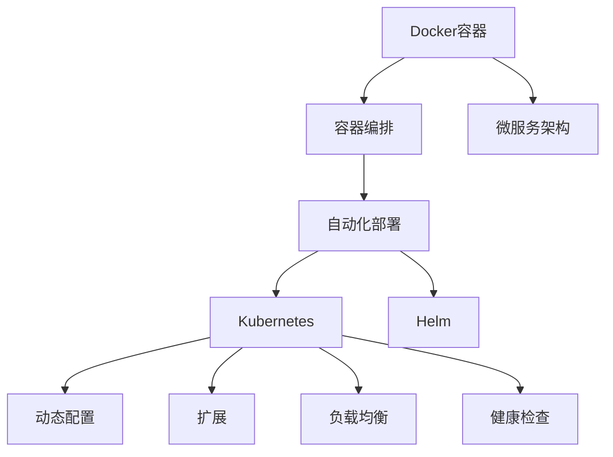

                 

# Docker Compose多服务编排

> 关键词：Docker Compose, 容器编排, 微服务架构, 自动化部署, Kubernetes, Helm, 容器生命周期管理

## 1. 背景介绍

### 1.1 问题由来

随着微服务架构的广泛应用，企业内部服务数量快速增长，服务间的依赖关系日益复杂。传统的DevOps流程难以应对这种变化，需要引入新的自动化工具进行统一管理和调度。Docker和Kubernetes等容器技术的兴起，为解决这些问题提供了新的思路。Docker Compose作为其核心组件之一，简化了多服务编排的复杂度，使得开发者和运维人员可以更加高效地管理服务实例和依赖关系。

### 1.2 问题核心关键点

Docker Compose通过YAML配置文件，方便地定义和管理多个Docker容器及其之间的依赖关系。在实际应用中，需要掌握以下关键点：

- 服务定义：如何在Compose文件中定义各个服务的配置项。
- 容器编排：如何利用Compose的编排机制，将多个服务启动、运行、扩展。
- 服务依赖：如何处理服务间的依赖关系，确保服务的正常运行。
- 服务发现：如何自动发现和注册服务实例，确保服务间的稳定通信。
- 环境分离：如何根据不同的环境配置不同的服务参数，实现环境和服务的分离。

这些核心点共同构成了Docker Compose的核心价值，使得企业能够以更高的效率和更低的成本构建和运维复杂的微服务系统。

## 2. 核心概念与联系

### 2.1 核心概念概述

为了更好地理解Docker Compose的编排机制，本节将介绍几个密切相关的核心概念：

- **Docker容器**：Docker容器是一种轻量级的、独立的软件包，包含运行应用程序所需的所有文件、库和依赖项。每个容器可以运行一个服务实例。

- **容器编排**：通过Docker Compose，可以将多个容器编排成一个整体，管理和调度这些容器的启动、运行、停止、扩展等操作。

- **微服务架构**：将复杂的应用拆分成多个小服务，每个服务负责独立的功能模块，通过接口进行通信。

- **自动化部署**：使用Docker Compose，可以快速构建、测试、部署和扩展微服务系统，减少人工干预，提高部署效率。

- **Kubernetes**：一个开源容器编排平台，支持动态配置、扩展、负载均衡和健康检查等功能，是容器编排的高级形式。

- **Helm**：一个Docker容器包管理工具，用于定义、安装、升级和卸载Kubernetes中的应用程序，简化了Kubernetes的管理复杂度。

这些概念之间的关系可以通过以下Mermaid流程图来展示：



这个流程图展示了大语言模型的核心概念及其之间的关系：

1. Docker容器通过容器编排技术，支持微服务架构的构建和部署。
2. Kubernetes作为容器编排的高级形式，支持更多复杂的配置和扩展操作。
3. Helm进一步简化了Kubernetes的应用管理，提供了便捷的安装和升级工具。
4. 通过自动化部署，Docker Compose可以快速搭建和维护微服务系统。

这些概念共同构成了容器编排生态系统的基本框架，使得容器编排技术能够应用于各种复杂的应用场景。

## 3. 核心算法原理 & 具体操作步骤
### 3.1 算法原理概述

Docker Compose的编排机制，本质上是一个基于容器定义和依赖的编排系统。其核心思想是：通过YAML配置文件，定义多个Docker容器的启动命令、端口映射、环境变量等参数，并通过编排器进行调度，确保各个容器间的正确启动和运行。

形式化地，假设系统中有$n$个Docker容器，每个容器需要配置$\theta$个参数。Compose编排的优化目标是最小化系统运行成本，即：

$$
\min_{\theta} C(\theta)
$$

其中$C(\theta)$表示系统的运行成本，包括资源使用、任务调度、网络通信等。

通过梯度下降等优化算法，Compose编排过程不断更新参数$\theta$，最小化系统运行成本，使得各个容器能够高效协同工作。

### 3.2 算法步骤详解

Docker Compose的编排过程包括以下关键步骤：

**Step 1: 创建Compose文件**

- 使用YAML语法定义各个服务的启动命令、端口映射、环境变量等参数。例如：

```yaml
version: '3'
services:
  app:
    image: app:latest
    ports:
      - "3000:3000"
    volumes:
      - ./app:/app
    environment:
      - REDIS_HOST=redis:6379
  redis:
    image: redis:latest
    volumes:
      - ./redis:/data
```

**Step 2: 启动Compose服务**

- 在命令行中输入`docker-compose up`，启动所有服务。Compose将根据配置文件，创建各个容器的运行环境，启动服务实例。

**Step 3: 管理Compose服务**

- 使用`docker-compose logs`查看服务日志。
- 使用`docker-compose restart`重新启动某个服务。
- 使用`docker-compose down`停止并删除所有服务。

**Step 4: 扩展Compose服务**

- 使用`docker-compose up --scale app=2`增加app服务实例的数量，启动新的容器。

**Step 5: 优化Compose服务**

- 通过添加`networks`配置项，指定容器间的通信网络。
- 通过添加`depends_on`配置项，指定服务启动的依赖关系。

### 3.3 算法优缺点

Docker Compose的编排机制具有以下优点：

- 简洁高效。通过简单的YAML配置文件，即可定义和启动多个容器。
- 灵活可扩展。可以根据需要，动态添加和扩展服务实例。
- 环境隔离。可以通过不同的环境参数，实现不同环境下的服务实例隔离。
- 易于管理。提供了丰富的管理工具，支持服务日志、扩展、恢复等操作。

但该机制也存在一些局限性：

- 仅支持基本配置。对于复杂的服务配置和网络拓扑，需要进行额外的处理。
- 不适用于大规模系统。对于大规模系统的编排，可以考虑使用Kubernetes等高级容器编排工具。
- 依赖Docker环境。Docker Compose需要依赖Docker容器技术，可能会受限于Docker平台的限制。

尽管存在这些局限性，但就目前而言，Docker Compose仍是大规模微服务系统中快速构建和运维的核心工具。未来相关研究的重点在于如何进一步优化Compose的编排能力，提高其对复杂配置和网络拓扑的支持力度，同时兼顾可扩展性和易用性等因素。

### 3.4 算法应用领域

Docker Compose的编排机制广泛应用于各种微服务系统的构建和运维中，例如：

- 电商系统：使用Compose编排电商后端服务、数据库、缓存等组件，提升系统性能和扩展性。
- 金融服务：使用Compose编排金融交易系统、数据中心、消息队列等服务，确保高可用性和稳定性。
- 大数据系统：使用Compose编排大数据平台，包括数据仓库、数据湖、数据处理服务等，提升数据处理能力。
- 物联网系统：使用Compose编排物联网设备、数据传输、应用服务等，实现设备间的互联互通。
- 实时流处理系统：使用Compose编排实时数据流、数据存储、应用服务等，实现高效的数据处理和分析。

除了上述这些应用领域外，Docker Compose还被创新性地应用于更多场景中，如云计算平台、微服务API网关、微服务监控系统等，为企业数字化转型提供了有力支持。

## 4. 数学模型和公式 & 详细讲解  
### 4.1 数学模型构建

本节将使用数学语言对Docker Compose的编排机制进行更加严格的刻画。

假设系统中有$n$个Docker容器，每个容器需要配置$\theta$个参数。Compose编排的优化目标是最小化系统运行成本，即：

$$
\min_{\theta} C(\theta)
$$

其中$C(\theta)$表示系统的运行成本，包括资源使用、任务调度、网络通信等。

在实践中，我们通常使用基于梯度的优化算法（如Adam、SGD等）来近似求解上述最优化问题。设$\eta$为学习率，则参数的更新公式为：

$$
\theta \leftarrow \theta - \eta \nabla_{\theta}C(\theta)
$$

其中$\nabla_{\theta}C(\theta)$为系统运行成本对参数$\theta$的梯度，可通过反向传播算法高效计算。

### 4.2 公式推导过程

以下我们以电商系统为例，推导Docker Compose编排过程的计算公式。

假设电商系统包括三个服务：前端应用、后端服务和数据库。服务之间的依赖关系和参数配置如下：

- 前端应用依赖后端服务和数据库，端口映射为8080和8081。
- 后端服务依赖数据库，端口映射为3000和3001。
- 数据库服务无依赖，端口映射为3306。

每个服务需要配置的环境变量如下：

- 前端应用需要配置数据库连接字符串和日志输出路径。
- 后端服务需要配置数据库连接字符串和缓存配置。
- 数据库服务需要配置数据存储路径。

服务之间的依赖关系和参数配置如下：

- 后端服务依赖数据库，端口映射为3000和3001。
- 数据库服务无依赖，端口映射为3306。

具体来说，可以将每个服务的配置参数$\theta_i$表示为一个向量，如$\theta_1=(\text{db\_url}, \text{log\_path})$，$\theta_2=(\text{db\_url}, \text{cache\_config})$，$\theta_3=(\text{data\_path})$。则系统的运行成本可以表示为：

$$
C(\theta) = f(\theta_1, \theta_2, \theta_3) + g(\theta_1, \theta_2, \theta_3) + h(\theta_1, \theta_2, \theta_3)
$$

其中$f$、$g$、$h$分别表示前端应用、后端服务和数据库服务的运行成本，根据具体的服务实现，可以是资源使用、任务调度、网络通信等。

假设系统初始参数为$\theta^0$，通过迭代求解，最小化系统运行成本。每个迭代步的参数更新为：

$$
\theta \leftarrow \theta - \eta \nabla_{\theta}C(\theta)
$$

重复上述过程，直至收敛，最终得到优化后的参数$\theta^*$。

## 5. 项目实践：代码实例和详细解释说明
### 5.1 开发环境搭建

在进行Compose实践前，我们需要准备好开发环境。以下是使用Docker搭建Compose环境的步骤：

1. 安装Docker：从官网下载并安装Docker，安装过程中选择默认选项。
2. 安装Docker Compose：从官网下载并安装Docker Compose，与Docker的版本兼容。
3. 配置Docker Compose：编辑配置文件`docker-compose.yml`，定义各个服务的配置项。
4. 测试Compose环境：在命令行中输入`docker-compose up`，启动所有服务，并使用`docker-compose logs`查看服务日志。

### 5.2 源代码详细实现

这里我们以电商系统为例，给出使用Docker Compose编排后端服务和数据库的代码实现。

首先，创建Compose文件：

```yaml
version: '3'
services:
  app:
    image: app:latest
    ports:
      - "3000:3000"
    environment:
      - DB_URL=redis://redis:6379
      - LOG_PATH=/var/log/app/app.log
  redis:
    image: redis:latest
    volumes:
      - ./redis:/data
```

然后，启动Compose服务：

```bash
docker-compose up
```

最后，测试服务是否运行正常：

```bash
docker-compose logs
```

可以看到，通过简单的Compose文件定义和命令，即可以快速搭建起电商系统的后端服务和数据库，并进行测试和部署。

### 5.3 代码解读与分析

让我们再详细解读一下关键代码的实现细节：

**Compose文件定义**：
- `version: '3'`：指定Compose文件的版本，支持3.x格式。
- `services`：定义多个服务，包括名称、镜像、端口、环境变量等。
- `image`：指定服务的镜像，使用Docker Hub上的镜像。
- `ports`：指定服务的端口映射，将主机端口映射到容器端口。
- `volumes`：指定服务的持久化存储，将本地目录映射到容器存储。
- `environment`：指定服务的环境变量，如数据库连接字符串、日志路径等。

**启动命令**：
- `docker-compose up`：启动所有服务，根据Compose文件中的定义，创建和启动各个容器。

**服务测试**：
- `docker-compose logs`：查看服务日志，判断服务是否启动成功。

**服务管理**：
- `docker-compose restart app`：重新启动app服务。
- `docker-compose down`：停止并删除所有服务。

可以看出，Docker Compose的编排机制简洁高效，通过简单的YAML文件定义和命令操作，即可快速构建和部署复杂的微服务系统。开发者可以将更多精力放在服务实现和业务逻辑上，而不必过多关注容器和编排的细节。

## 6. 实际应用场景
### 6.1 智能客服系统

Docker Compose的编排机制可以应用于智能客服系统的构建。传统客服往往需要配备大量人力，高峰期响应缓慢，且一致性和专业性难以保证。使用Compose编排的智能客服系统，可以7x24小时不间断服务，快速响应客户咨询，用自然流畅的语言解答各类常见问题。

在技术实现上，可以收集企业内部的历史客服对话记录，将问题和最佳答复构建成监督数据，在此基础上对Compose编排的对话模型进行微调。微调后的对话模型能够自动理解用户意图，匹配最合适的答案模板进行回复。对于客户提出的新问题，还可以接入检索系统实时搜索相关内容，动态组织生成回答。如此构建的智能客服系统，能大幅提升客户咨询体验和问题解决效率。

### 6.2 金融舆情监测

金融机构需要实时监测市场舆论动向，以便及时应对负面信息传播，规避金融风险。传统的人工监测方式成本高、效率低，难以应对网络时代海量信息爆发的挑战。使用Compose编排的文本分类和情感分析模型，可以自动获取实时抓取的网络文本数据，自动监测不同主题下的情感变化趋势，一旦发现负面信息激增等异常情况，系统便会自动预警，帮助金融机构快速应对潜在风险。

### 6.3 个性化推荐系统

当前的推荐系统往往只依赖用户的历史行为数据进行物品推荐，无法深入理解用户的真实兴趣偏好。使用Compose编排的个性化推荐系统，可以更好地挖掘用户行为背后的语义信息，从而提供更精准、多样的推荐内容。

在实践中，可以收集用户浏览、点击、评论、分享等行为数据，提取和用户交互的物品标题、描述、标签等文本内容。将文本内容作为模型输入，用户的后续行为（如是否点击、购买等）作为监督信号，在此基础上编排Compose模型进行训练。编排后的模型能够从文本内容中准确把握用户的兴趣点。在生成推荐列表时，先用候选物品的文本描述作为输入，由编排后的模型预测用户的兴趣匹配度，再结合其他特征综合排序，便可以得到个性化程度更高的推荐结果。

### 6.4 未来应用展望

随着Docker Compose和容器技术的不断发展，其在更多领域的应用前景将愈发广阔。未来，Compose编排技术有望被广泛应用于智慧医疗、智能教育、智慧城市治理、企业生产、社会治理、文娱传媒等多个领域，为传统行业数字化转型升级提供新的技术路径。

## 7. 工具和资源推荐
### 7.1 学习资源推荐

为了帮助开发者系统掌握Docker Compose的编排技术，这里推荐一些优质的学习资源：

1. Docker官方文档：Docker官方提供了详细的文档和教程，涵盖了Docker和Compose的各个方面，是学习Compose编排技术的重要资料。
2. Docker Compose教程：在官方文档中，有一系列详细的教程，涵盖从入门到高级的各个内容，适合各个层次的学习者。
3. Docker Compose实战：《Docker Compose实战》一书，系统介绍了Compose编排技术的应用场景、最佳实践和实际案例，是Compose学习的必读书籍。
4. Docker Swarm和Kubernetes：虽然Compose主要适用于单一服务编排，但了解Docker Swarm和Kubernetes，有助于更深入地理解容器编排技术，为更复杂的系统编排打下基础。
5. Helm Chart：Helm官方文档，介绍了使用Helm Chart进行Kubernetes应用管理的方法，适合Compose学习的进阶读者。

通过对这些资源的学习实践，相信你一定能够快速掌握Docker Compose编排技术的精髓，并用于解决实际的容器编排问题。

### 7.2 开发工具推荐

高效的开发离不开优秀的工具支持。以下是几款用于Docker Compose编排开发的常用工具：

1. Docker：Docker平台提供了强大的容器编排功能，可以通过Docker Compose快速搭建和运维微服务系统。
2. Kubernetes：Docker Swarm和Kubernetes都是容器编排的高级形式，支持更多的配置和扩展操作，是Compose学习的进阶内容。
3. Helm：Helm提供了便捷的Kubernetes应用管理工具，可以大大简化Compose编排的复杂度，是Compose学习的重要补充。
4. Tilt：Tilt是Kubernetes的开发工具，可以在开发环境中自动构建和测试Kubernetes应用，大大简化Compose编排的调试过程。
5. Visual Studio Code：Visual Studio Code是一款强大的开发工具，支持Docker Compose插件，方便开发者进行Compose编排的快速搭建和调试。

合理利用这些工具，可以显著提升Docker Compose编排任务的开发效率，加快创新迭代的步伐。

### 7.3 相关论文推荐

Docker Compose的编排技术源于学界的持续研究。以下是几篇奠基性的相关论文，推荐阅读：

1. "Docker Swarm: Cluster-Ready Containers"：提出Docker Swarm集群编排技术，支持集群管理和资源调度。
2. "Kubernetes: Deploying, Running and Managing Containers"：Kubernetes官方文档，详细介绍Kubernetes的容器编排机制。
3. "Helm: The Helm Chart Package Manager for Kubernetes"：Helm官方文档，介绍使用Helm Chart进行Kubernetes应用管理的方法。
4. "Deploying Docker Swarm and Kubernetes with Helm"：Helm官方博客，介绍使用Helm Chart进行Docker Swarm和Kubernetes应用的部署和管理。
5. "Kubernetes for Big Data: A Practical Guide"：Kubernetes官方文档，详细介绍Kubernetes在数据处理和大数据平台中的应用。

这些论文代表了大语言模型微调技术的发展脉络。通过学习这些前沿成果，可以帮助研究者把握学科前进方向，激发更多的创新灵感。

## 8. 总结：未来发展趋势与挑战
### 8.1 总结

本文对Docker Compose的编排机制进行了全面系统的介绍。首先阐述了Compose编排机制的研究背景和意义，明确了编排技术在构建复杂微服务系统中的独特价值。其次，从原理到实践，详细讲解了Compose编排过程的数学模型和具体步骤，给出了编排任务开发的完整代码实例。同时，本文还广泛探讨了Compose编排技术在智能客服、金融舆情、个性化推荐等多个行业领域的应用前景，展示了Compose编排技术的巨大潜力。此外，本文精选了Compose编排技术的各类学习资源，力求为读者提供全方位的技术指引。

通过本文的系统梳理，可以看到，Docker Compose编排机制通过简洁高效的YAML配置文件，极大地简化了微服务系统的构建和运维，提升了开发效率。Compose编排技术在企业数字化转型过程中发挥了重要作用，未来将有更广阔的应用前景。

### 8.2 未来发展趋势

展望未来，Docker Compose编排技术将呈现以下几个发展趋势：

1. 微服务架构的普及：随着微服务架构的进一步普及，Docker Compose编排机制将得到更广泛的应用，支持更多微服务场景。
2. 容器编排的复杂度提升：Compose编排技术将更多支持复杂的配置和网络拓扑，支持动态配置和扩展操作。
3. 编排技术的融合：Compose编排技术将与Docker Swarm、Kubernetes等容器编排工具进一步融合，形成更强大的编排能力。
4. 多云平台的支持：Compose编排技术将支持更多云平台和环境，提升其在不同环境下的部署能力。
5. 自动化工具的完善：Compose编排工具将结合更丰富的自动化工具，提升开发和运维的自动化水平。

以上趋势凸显了Docker Compose编排技术的广阔前景。这些方向的探索发展，将进一步提升微服务系统的构建和运维效率，为数字化转型提供有力支持。

### 8.3 面临的挑战

尽管Docker Compose编排技术已经取得了显著成效，但在迈向更加智能化、普适化应用的过程中，它仍面临诸多挑战：

1. 配置复杂性：Compose编排配置文件相对复杂，对于大规模微服务系统的编排，配置的复杂性可能增加。
2. 环境分离难度：通过环境分离，可以实现不同环境下的服务隔离，但在实际应用中，配置和管理环境的难度较大。
3. 可扩展性限制：Compose编排技术在处理大规模微服务系统的扩展性方面存在一定局限性。
4. 跨平台兼容性：Compose编排技术在不同平台和环境下的兼容性和稳定性需要进一步提升。
5. 学习成本：Compose编排技术的复杂性可能增加学习成本，需要更多的时间和精力进行学习和掌握。

尽管存在这些挑战，但Docker Compose编排技术的不断演进和优化，将有望逐步克服这些难题，为微服务系统的构建和运维提供更强大的支持。

### 8.4 研究展望

面对Compose编排技术面临的挑战，未来的研究需要在以下几个方面寻求新的突破：

1. 简化配置流程：通过更简洁的配置语法和更智能的编排工具，降低微服务系统的编排复杂性。
2. 提升环境分离能力：通过更灵活的环境隔离和配置管理，提高Compose编排技术在复杂环境下的应用能力。
3. 增强可扩展性：通过更高效的编排算法和更丰富的扩展工具，提升Compose编排技术在大规模微服务系统中的扩展性。
4. 提升跨平台兼容性：通过更广泛的支持和更丰富的插件，提升Compose编排技术在不同平台和环境下的兼容性和稳定性。
5. 降低学习成本：通过更丰富的教程、示例和文档，降低Compose编排技术的学习成本，提升其普及度。

这些研究方向的探索，将引领Docker Compose编排技术迈向更高的台阶，为微服务系统的构建和运维提供更强大的技术支持。

## 9. 附录：常见问题与解答

**Q1: Docker Compose编排机制的优势和局限性是什么？**

A: Docker Compose编排机制的优势包括：
1. 简洁高效：通过简单的YAML配置文件，即可定义和启动多个容器。
2. 灵活可扩展：可以根据需要，动态添加和扩展服务实例。
3. 环境隔离：可以通过不同的环境参数，实现不同环境下的服务实例隔离。
4. 易于管理：提供了丰富的管理工具，支持服务日志、扩展、恢复等操作。

但该机制也存在一些局限性：
1. 仅支持基本配置：对于复杂的服务配置和网络拓扑，需要进行额外的处理。
2. 不适用于大规模系统：对于大规模系统的编排，可以考虑使用Kubernetes等高级容器编排工具。
3. 依赖Docker环境：Docker Compose需要依赖Docker容器技术，可能会受限于Docker平台的限制。

尽管存在这些局限性，但就目前而言，Docker Compose仍是大规模微服务系统中快速构建和运维的核心工具。未来相关研究的重点在于如何进一步优化Compose的编排能力，提高其对复杂配置和网络拓扑的支持力度，同时兼顾可扩展性和易用性等因素。

**Q2: Docker Compose在实际应用中如何处理服务间的依赖关系？**

A: 在Docker Compose中，服务间的依赖关系通过`depends_on`配置项进行处理。具体来说，可以在Compose文件中定义一个服务的依赖列表，指定该服务依赖的其他服务。例如：

```yaml
version: '3'
services:
  app:
    image: app:latest
    ports:
      - "3000:3000"
    environment:
      - REDIS_HOST=redis:6379
  redis:
    image: redis:latest
    volumes:
      - ./redis:/data
depends_on:
  - app
```

在上述例子中，app服务依赖redis服务，因此在Compose编排时，会先启动redis服务，再启动app服务。这样，即使redis服务不可用，app服务也不会启动，从而保证了服务间的稳定通信。

**Q3: Docker Compose如何支持动态配置和扩展操作？**

A: Docker Compose通过`environment`和`resources`配置项，支持动态配置和扩展操作。具体来说，可以在Compose文件中定义多个环境配置和资源配置，供不同的环境使用。例如：

```yaml
version: '3'
services:
  app:
    image: app:latest
    ports:
      - "3000:3000"
    environment:
      - REDIS_HOST=redis:6379
    resources:
      limits:
        cpus: '0.5'
        memory: '512m'
    deploy:
      replicas: 2
```

在上述例子中，app服务支持环境配置和资源限制，通过设置不同的环境参数，可以在不同的环境下进行配置。同时，`deploy`配置项指定了服务的实例数量，支持动态扩展操作。这样，可以根据需求动态调整服务实例的数量，提升系统的灵活性和扩展性。

**Q4: Docker Compose如何支持跨平台和环境部署？**

A: Docker Compose通过Dockerfile和Compose文件，支持跨平台和环境部署。具体来说，可以在Dockerfile中定义服务的构建和部署过程，支持在不同的平台和环境中进行部署。例如：

```dockerfile
# Use an official Python runtime as a parent image
FROM python:3.7-slim

# Set the working directory in the container to /app
WORKDIR /app

# Add the current directory contents into the container at /app
ADD . /app

# Install any needed packages specified in requirements.txt
RUN pip install --no-cache-dir -r requirements.txt

# Make port 80 available to the world outside this container
EXPOSE 80

# Run app.py when the container launches
CMD ["python", "app.py"]
```

在上述例子中，Dockerfile定义了Python 3.7容器的构建过程，通过`ADD`和`RUN`命令，将代码和依赖项添加到容器中。这样，无论在哪个平台上，都可以使用相同的Dockerfile构建容器，支持跨平台部署。同时，Compose文件中只需要指定容器的参数配置，即可在不同环境中进行部署。

通过这种方式，Docker Compose可以支持多种平台和环境的微服务系统部署，提升其灵活性和可移植性。

**Q5: Docker Compose如何支持自动化部署和运维？**

A: Docker Compose通过Docker Compose CLI工具，支持自动化部署和运维。具体来说，可以使用Compose CLI工具，对微服务系统进行自动化构建、测试、部署和扩展操作。例如：

```bash
# 启动服务
docker-compose up

# 停止服务
docker-compose down

# 扩展服务实例
docker-compose up --scale app=2

# 回滚到之前的状态
docker-compose up --scale app=1
```

在上述例子中，通过Compose CLI工具，可以对微服务系统进行自动化部署和扩展操作，提升系统的部署效率和稳定性。同时，Compose CLI工具还支持更多的管理命令，如`logs`、`restart`、`stop`等，支持对微服务系统的各种操作。这样，开发者和运维人员可以更加高效地管理微服务系统，提升开发和运维的自动化水平。

通过这种方式，Docker Compose可以支持自动化部署和运维，提升系统的开发效率和运维稳定性。

---

作者：禅与计算机程序设计艺术 / Zen and the Art of Computer Programming

