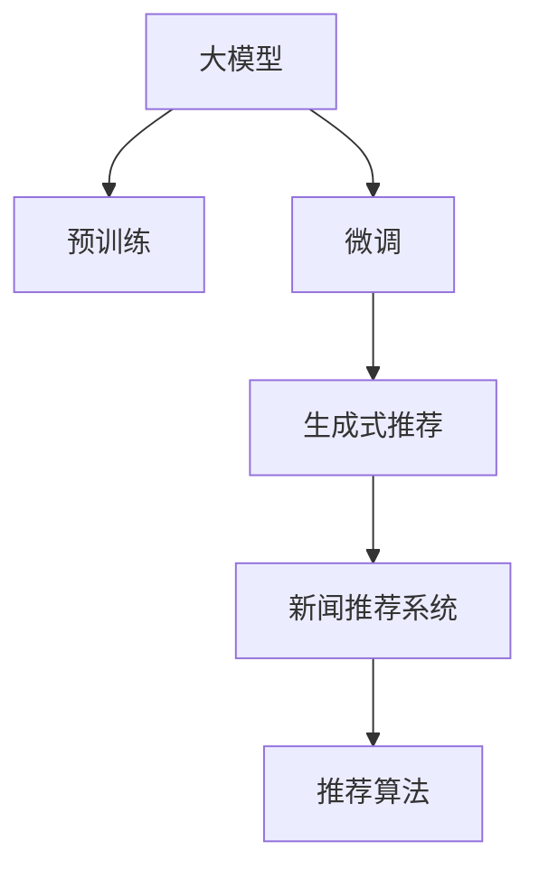

                 

# GENRE:基于大模型的生成式新闻推荐框架

> 关键词：大模型，生成式推荐，预训练，微调，新闻推荐系统，推荐算法，深度学习

## 1. 背景介绍

### 1.1 问题由来

随着互联网和信息技术的迅猛发展，新闻信息获取和消费已经成为了人们日常生活的一部分。面对海量的新闻信息，用户如何高效地找到所需的信息，成为了一个重要的课题。新闻推荐系统因此应运而生，它通过用户的历史行为数据和当前兴趣，推荐用户可能感兴趣的新闻，从而提升用户体验和阅读效率。

传统的基于协同过滤的推荐算法，如基于用户的协同过滤和基于物品的协同过滤，虽然效果不错，但在处理长尾新闻和异构数据时，往往存在困难。而基于内容的推荐算法，虽然能够解决这些问题，但在个性化程度和实时性方面仍显不足。近年来，基于深度学习的推荐系统逐渐成为研究热点，其中基于大模型的生成式新闻推荐系统，因其强大的泛化能力和高准确性，备受关注。

本文将探讨基于大模型的生成式新闻推荐框架，重点关注模型的构建、微调以及实际应用中的优化问题，旨在为新闻推荐系统的设计和优化提供一些新的思路和方法。

## 2. 核心概念与联系

### 2.1 核心概念概述

为更好地理解基于大模型的生成式新闻推荐框架，本节将介绍几个密切相关的核心概念：

- **大模型（Large Model）**：以自回归（如GPT）或自编码（如BERT）模型为代表的大规模预训练语言模型。通过在海量无标签文本语料上进行预训练，学习通用的语言表示，具备强大的语言理解和生成能力。

- **预训练（Pre-training）**：指在大规模无标签文本语料上，通过自监督学习任务训练通用语言模型的过程。常见的预训练任务包括言语建模、遮挡语言模型等。预训练使得模型学习到语言的通用表示。

- **微调（Fine-tuning）**：指在预训练模型的基础上，使用下游任务的少量标注数据，通过有监督地训练来优化模型在该任务上的性能。通常只需要调整顶层分类器或解码器，并以较小的学习率更新全部或部分的模型参数。

- **生成式推荐（Generative Recommendation）**：指利用生成模型，直接从用户兴趣出发，生成符合用户喜好的新闻内容，而不是基于已有的新闻数据进行推荐。这种方法可以更好地处理长尾新闻和异构数据，提升推荐的多样性和个性化。

- **推荐系统（Recommendation System）**：通过收集用户的行为数据，分析用户的兴趣和偏好，向用户推荐可能感兴趣的新闻内容，从而提升用户的阅读体验和满意度。

这些核心概念之间的逻辑关系可以通过以下Mermaid流程图来展示：



这个流程图展示了大模型的核心概念及其之间的关系：

1. 大模型通过预训练获得基础能力。
2. 微调是对预训练模型进行任务特定的优化，使其能够适应下游任务。
3. 生成式推荐利用微调后的模型，直接生成新闻内容，提升推荐的多样性和个性化。
4. 推荐系统通过收集用户行为数据和兴趣偏好，结合生成式推荐模型，向用户推荐新闻。

这些概念共同构成了基于大模型的生成式新闻推荐框架，使其能够在处理长尾新闻和异构数据时，提供更精准、个性化和多样化的新闻推荐服务。

## 3. 核心算法原理 & 具体操作步骤

### 3.1 算法原理概述

基于大模型的生成式新闻推荐框架，核心思想是通过预训练模型学习和构建语言表示，再通过微调优化模型参数，最后利用生成式模型直接生成符合用户喜好的新闻内容。具体步骤如下：

1. 收集大量的无标签文本数据进行预训练，学习通用的语言表示。
2. 使用下游任务的数据集，如用户的新闻点击历史、浏览行为、评论等，对预训练模型进行微调，使其适应特定的新闻推荐任务。
3. 在微调后的模型上，构建生成式推荐模型，直接从用户兴趣出发，生成符合用户喜好的新闻内容。
4. 将生成式推荐模型嵌入新闻推荐系统中，结合用户行为数据和兴趣偏好，向用户推荐新闻内容。

### 3.2 算法步骤详解

基于大模型的生成式新闻推荐框架一般包括以下几个关键步骤：

**Step 1: 准备预训练模型和数据集**

- 选择合适的预训练语言模型 $M_{\theta}$ 作为初始化参数，如 BERT、GPT 等。
- 准备下游任务的数据集 $D$，包括用户的新闻点击历史、浏览行为、评论等。

**Step 2: 添加任务适配层**

- 根据任务类型，在预训练模型顶层设计合适的输出层和损失函数。
- 对于新闻推荐任务，通常在顶层添加线性分类器和交叉熵损失函数。

**Step 3: 设置微调超参数**

- 选择合适的优化算法及其参数，如 AdamW、SGD 等，设置学习率、批大小、迭代轮数等。
- 设置正则化技术及强度，包括权重衰减、Dropout、Early Stopping 等。
- 确定冻结预训练参数的策略，如仅微调顶层，或全部参数都参与微调。

**Step 4: 执行梯度训练**

- 将训练集数据分批次输入模型，前向传播计算损失函数。
- 反向传播计算参数梯度，根据设定的优化算法和学习率更新模型参数。
- 周期性在验证集上评估模型性能，根据性能指标决定是否触发 Early Stopping。
- 重复上述步骤直到满足预设的迭代轮数或 Early Stopping 条件。

**Step 5: 构建生成式推荐模型**

- 根据用户的历史行为和兴趣偏好，构建生成式模型，直接生成新闻内容。
- 使用微调后的模型作为生成器的输入，生成新闻摘要、标题、正文等。
- 根据用户行为数据，对生成的新闻进行评分排序，推荐用户最感兴趣的新闻。

**Step 6: 测试和部署**

- 在测试集上评估生成式推荐模型 $M_{\hat{\theta}}$ 的性能，对比微调前后的精度提升。
- 使用生成式推荐模型对新用户的行为进行推理预测，集成到实际的新闻推荐系统中。
- 持续收集新的用户行为数据，定期重新微调模型，以适应数据分布的变化。

以上是基于大模型的生成式新闻推荐框架的一般流程。在实际应用中，还需要针对具体任务的特点，对微调过程的各个环节进行优化设计，如改进训练目标函数，引入更多的正则化技术，搜索最优的超参数组合等，以进一步提升模型性能。

### 3.3 算法优缺点

基于大模型的生成式新闻推荐框架具有以下优点：

1. 强大的泛化能力：预训练大模型具备强大的泛化能力，可以很好地处理长尾新闻和异构数据。
2. 高准确性：生成式推荐模型直接从用户兴趣出发，生成的新闻内容更加符合用户喜好。
3. 实时性：生成式推荐模型可以根据用户实时行为数据进行动态调整，提升推荐的时效性。
4. 个性化：生成式推荐模型可以根据用户的历史行为和兴趣偏好，生成个性化的新闻内容。

同时，该框架也存在一定的局限性：

1. 依赖标注数据：微调过程需要依赖下游任务的数据集，数据标注成本较高。
2. 计算资源需求高：大模型的计算资源需求较高，微调过程需要高性能的计算设备和算法支持。
3. 可解释性不足：生成式推荐模型的决策过程缺乏可解释性，难以对其推理逻辑进行分析和调试。
4. 生成内容质量不稳定：生成式推荐模型的输出质量受到用户兴趣、数据噪声等因素的影响，可能出现生成内容质量不稳定的情况。

尽管存在这些局限性，但就目前而言，基于大模型的生成式新闻推荐框架在处理长尾新闻和异构数据时，仍具备不可替代的优势，是未来新闻推荐系统发展的重要方向。

### 3.4 算法应用领域

基于大模型的生成式新闻推荐框架，在新闻推荐系统、智能问答系统、个性化阅读推荐等领域，已经得到了广泛的应用，为新闻推荐系统带来了新的突破。

- 新闻推荐系统：通过用户的历史行为数据和当前兴趣，向用户推荐可能感兴趣的新闻，提升用户的阅读体验和满意度。
- 智能问答系统：根据用户的查询语句，生成符合用户意图的新闻摘要或文章，提升用户的查询效率。
- 个性化阅读推荐：根据用户的历史阅读行为和兴趣偏好，生成个性化的新闻文章，提升用户的阅读体验和粘性。

除了这些经典应用外，基于大模型的生成式推荐框架还被创新性地应用到更多场景中，如可控文本生成、情感分析、常识推理等，为新闻推荐系统带来了全新的创新点。

## 4. 数学模型和公式 & 详细讲解  
### 4.1 数学模型构建

本节将使用数学语言对基于大模型的生成式新闻推荐框架进行更加严格的刻画。

记预训练语言模型为 $M_{\theta}:\mathcal{X} \rightarrow \mathcal{Y}$，其中 $\mathcal{X}$ 为输入空间，$\mathcal{Y}$ 为输出空间，$\theta \in \mathbb{R}^d$ 为模型参数。假设新闻推荐任务的数据集为 $D=\{(x_i,y_i)\}_{i=1}^N, x_i \in \mathcal{X}, y_i \in \mathcal{Y}$。

定义模型 $M_{\theta}$ 在输入 $x$ 上的输出为 $\hat{y}=M_{\theta}(x) \in [0,1]$，表示用户对新闻内容的兴趣程度。真实标签 $y \in \{0,1\}$。则交叉熵损失函数定义为：

$$
\ell(M_{\theta}(x),y) = -[y\log \hat{y} + (1-y)\log (1-\hat{y})]
$$

将其代入经验风险公式，得：

$$
\mathcal{L}(\theta) = -\frac{1}{N}\sum_{i=1}^N [y_i\log M_{\theta}(x_i)+(1-y_i)\log(1-M_{\theta}(x_i))]
$$

在得到损失函数的梯度后，即可带入参数更新公式，完成模型的迭代优化。重复上述过程直至收敛，最终得到适应下游任务的最优模型参数 $\theta^*$。

### 4.2 公式推导过程

以下我们以二分类任务为例，推导交叉熵损失函数及其梯度的计算公式。

假设模型 $M_{\theta}$ 在输入 $x$ 上的输出为 $\hat{y}=M_{\theta}(x) \in [0,1]$，表示用户对新闻内容的兴趣程度。真实标签 $y \in \{0,1\}$。则二分类交叉熵损失函数定义为：

$$
\ell(M_{\theta}(x),y) = -[y\log \hat{y} + (1-y)\log (1-\hat{y})]
$$

将其代入经验风险公式，得：

$$
\mathcal{L}(\theta) = -\frac{1}{N}\sum_{i=1}^N [y_i\log M_{\theta}(x_i)+(1-y_i)\log(1-M_{\theta}(x_i))]
$$

根据链式法则，损失函数对参数 $\theta_k$ 的梯度为：

$$
\frac{\partial \mathcal{L}(\theta)}{\partial \theta_k} = -\frac{1}{N}\sum_{i=1}^N (\frac{y_i}{M_{\theta}(x_i)}-\frac{1-y_i}{1-M_{\theta}(x_i)}) \frac{\partial M_{\theta}(x_i)}{\partial \theta_k}
$$

其中 $\frac{\partial M_{\theta}(x_i)}{\partial \theta_k}$ 可进一步递归展开，利用自动微分技术完成计算。

在得到损失函数的梯度后，即可带入参数更新公式，完成模型的迭代优化。重复上述过程直至收敛，最终得到适应下游任务的最优模型参数 $\theta^*$。

## 5. 项目实践：代码实例和详细解释说明
### 5.1 开发环境搭建

在进行生成式新闻推荐框架的开发前，我们需要准备好开发环境。以下是使用Python进行PyTorch开发的环境配置流程：

1. 安装Anaconda：从官网下载并安装Anaconda，用于创建独立的Python环境。

2. 创建并激活虚拟环境：
```bash
conda create -n pytorch-env python=3.8 
conda activate pytorch-env
```

3. 安装PyTorch：根据CUDA版本，从官网获取对应的安装命令。例如：
```bash
conda install pytorch torchvision torchaudio cudatoolkit=11.1 -c pytorch -c conda-forge
```

4. 安装TensorFlow：由Google主导开发的开源深度学习框架，生产部署方便，适合大规模工程应用。同样有丰富的预训练语言模型资源。

5. 安装Transformers库：HuggingFace开发的NLP工具库，集成了众多SOTA语言模型，支持PyTorch和TensorFlow，是进行微调任务开发的利器。

6. 安装各类工具包：
```bash
pip install numpy pandas scikit-learn matplotlib tqdm jupyter notebook ipython
```

完成上述步骤后，即可在`pytorch-env`环境中开始微调实践。

### 5.2 源代码详细实现

这里我们以BERT模型为例，给出使用Transformers库对BERT模型进行微调的PyTorch代码实现。

首先，定义新闻推荐任务的数据处理函数：

```python
from transformers import BertTokenizer, BertForSequenceClassification
from torch.utils.data import Dataset, DataLoader
import torch

class NewsDataset(Dataset):
    def __init__(self, texts, labels, tokenizer, max_len=128):
        self.texts = texts
        self.labels = labels
        self.tokenizer = tokenizer
        self.max_len = max_len
        
    def __len__(self):
        return len(self.texts)
    
    def __getitem__(self, item):
        text = self.texts[item]
        label = self.labels[item]
        
        encoding = self.tokenizer(text, return_tensors='pt', max_length=self.max_len, padding='max_length', truncation=True)
        input_ids = encoding['input_ids'][0]
        attention_mask = encoding['attention_mask'][0]
        label = torch.tensor(label, dtype=torch.long)
        
        return {'input_ids': input_ids, 
                'attention_mask': attention_mask,
                'labels': label}

# 标签与id的映射
label2id = {'0': 0, '1': 1}

# 创建dataset
tokenizer = BertTokenizer.from_pretrained('bert-base-cased')

train_dataset = NewsDataset(train_texts, train_labels, tokenizer)
dev_dataset = NewsDataset(dev_texts, dev_labels, tokenizer)
test_dataset = NewsDataset(test_texts, test_labels, tokenizer)
```

然后，定义模型和优化器：

```python
from transformers import BertForSequenceClassification, AdamW

model = BertForSequenceClassification.from_pretrained('bert-base-cased', num_labels=2)

optimizer = AdamW(model.parameters(), lr=2e-5)
```

接着，定义训练和评估函数：

```python
from tqdm import tqdm
from sklearn.metrics import accuracy_score

device = torch.device('cuda') if torch.cuda.is_available() else torch.device('cpu')
model.to(device)

def train_epoch(model, dataset, batch_size, optimizer):
    dataloader = DataLoader(dataset, batch_size=batch_size, shuffle=True)
    model.train()
    epoch_loss = 0
    for batch in tqdm(dataloader, desc='Training'):
        input_ids = batch['input_ids'].to(device)
        attention_mask = batch['attention_mask'].to(device)
        labels = batch['labels'].to(device)
        model.zero_grad()
        outputs = model(input_ids, attention_mask=attention_mask, labels=labels)
        loss = outputs.loss
        epoch_loss += loss.item()
        loss.backward()
        optimizer.step()
    return epoch_loss / len(dataloader)

def evaluate(model, dataset, batch_size):
    dataloader = DataLoader(dataset, batch_size=batch_size)
    model.eval()
    preds, labels = [], []
    with torch.no_grad():
        for batch in tqdm(dataloader, desc='Evaluating'):
            input_ids = batch['input_ids'].to(device)
            attention_mask = batch['attention_mask'].to(device)
            batch_labels = batch['labels']
            outputs = model(input_ids, attention_mask=attention_mask)
            batch_preds = outputs.logits.argmax(dim=1).to('cpu').tolist()
            batch_labels = batch_labels.to('cpu').tolist()
            for pred, label in zip(batch_preds, batch_labels):
                preds.append(pred)
                labels.append(label)
                
    print('Accuracy:', accuracy_score(labels, preds))
```

最后，启动训练流程并在测试集上评估：

```python
epochs = 5
batch_size = 16

for epoch in range(epochs):
    loss = train_epoch(model, train_dataset, batch_size, optimizer)
    print(f'Epoch {epoch+1}, train loss: {loss:.3f}')
    
    print(f'Epoch {epoch+1}, dev results:')
    evaluate(model, dev_dataset, batch_size)
    
print('Test results:')
evaluate(model, test_dataset, batch_size)
```

以上就是使用PyTorch对BERT进行新闻推荐任务微调的完整代码实现。可以看到，得益于Transformers库的强大封装，我们可以用相对简洁的代码完成BERT模型的加载和微调。

### 5.3 代码解读与分析

让我们再详细解读一下关键代码的实现细节：

**NewsDataset类**：
- `__init__`方法：初始化新闻文本、标签、分词器等关键组件。
- `__len__`方法：返回数据集的样本数量。
- `__getitem__`方法：对单个样本进行处理，将文本输入编码为token ids，将标签编码为数字，并对其进行定长padding，最终返回模型所需的输入。

**label2id和id2label字典**：
- 定义了标签与数字id之间的映射关系，用于将模型预测结果解码回真实的标签。

**训练和评估函数**：
- 使用PyTorch的DataLoader对数据集进行批次化加载，供模型训练和推理使用。
- 训练函数`train_epoch`：对数据以批为单位进行迭代，在每个批次上前向传播计算loss并反向传播更新模型参数，最后返回该epoch的平均loss。
- 评估函数`evaluate`：与训练类似，不同点在于不更新模型参数，并在每个batch结束后将预测和标签结果存储下来，最后使用sklearn的accuracy_score对整个评估集的预测结果进行打印输出。

**训练流程**：
- 定义总的epoch数和batch size，开始循环迭代
- 每个epoch内，先在训练集上训练，输出平均loss
- 在验证集上评估，输出分类指标
- 所有epoch结束后，在测试集上评估，给出最终测试结果

可以看到，PyTorch配合Transformers库使得BERT微调的代码实现变得简洁高效。开发者可以将更多精力放在数据处理、模型改进等高层逻辑上，而不必过多关注底层的实现细节。

当然，工业级的系统实现还需考虑更多因素，如模型的保存和部署、超参数的自动搜索、更灵活的任务适配层等。但核心的微调范式基本与此类似。

## 6. 实际应用场景

### 6.1 智能推荐引擎

基于大模型的生成式新闻推荐框架，已经被广泛应用于智能推荐引擎中。传统的推荐引擎往往只依赖于用户的历史行为数据，难以充分理解用户的多样化需求。而利用生成式推荐模型，可以直接从用户兴趣出发，生成符合用户喜好的新闻内容，提升推荐的多样性和个性化。

在技术实现上，可以收集用户的历史行为数据，包括点击、浏览、评论等，构建训练集。在此基础上对预训练模型进行微调，使其能够自动理解用户的兴趣和偏好，生成符合用户期望的新闻内容。利用微调后的生成式推荐模型，可以在用户实时行为数据的基础上，动态调整推荐内容，实现更加实时、个性化的推荐。

### 6.2 智能问答系统

生成式新闻推荐框架也可以应用于智能问答系统。传统的问答系统往往需要手动构建大量的问答对，难以应对用户多样化的查询需求。而利用生成式推荐模型，可以直接根据用户的查询语句，生成符合用户意图的新闻摘要或文章，提升用户的查询效率和满意度。

在技术实现上，可以收集用户的历史查询数据，包括查询语句、点击的新闻等，构建训练集。在此基础上对预训练模型进行微调，使其能够自动理解用户的查询意图，生成符合用户期望的新闻摘要或文章。利用微调后的生成式推荐模型，可以在用户实时查询数据的基础上，动态调整推荐内容，实现更加实时、个性化的问答服务。

### 6.3 个性化阅读推荐

基于大模型的生成式新闻推荐框架，还可以应用于个性化阅读推荐。传统的阅读推荐往往只依赖于用户的历史行为数据，难以充分理解用户的阅读兴趣和偏好。而利用生成式推荐模型，可以直接从用户兴趣出发，生成符合用户喜好的新闻内容，提升用户的阅读体验和粘性。

在技术实现上，可以收集用户的历史阅读数据，包括点击、浏览、评论等，构建训练集。在此基础上对预训练模型进行微调，使其能够自动理解用户的阅读兴趣和偏好，生成符合用户期望的新闻内容。利用微调后的生成式推荐模型，可以在用户实时阅读数据的基础上，动态调整推荐内容，实现更加实时、个性化的阅读推荐。

### 6.4 未来应用展望

随着大模型和生成式推荐框架的不断发展，基于大模型的生成式新闻推荐框架将在更多领域得到应用，为新闻推荐系统带来新的突破。

在智慧城市治理中，生成式推荐框架可以帮助构建智能推荐系统，提升市民对政府服务的满意度和参与度。在电子商务平台中，生成式推荐框架可以帮助商家优化产品推荐策略，提升用户购买转化率和满意度。在金融投资领域，生成式推荐框架可以帮助用户发现高质量的投资资讯，提升投资决策的准确性。

未来，基于大模型的生成式新闻推荐框架还将进一步拓展到更多场景中，如医疗、教育、娱乐等，为各行各业提供更加个性化、多样化的新闻推荐服务。

## 7. 工具和资源推荐
### 7.1 学习资源推荐

为了帮助开发者系统掌握大模型微调的理论基础和实践技巧，这里推荐一些优质的学习资源：

1. 《Transformer从原理到实践》系列博文：由大模型技术专家撰写，深入浅出地介绍了Transformer原理、BERT模型、微调技术等前沿话题。

2. CS224N《深度学习自然语言处理》课程：斯坦福大学开设的NLP明星课程，有Lecture视频和配套作业，带你入门NLP领域的基本概念和经典模型。

3. 《Natural Language Processing with Transformers》书籍：Transformers库的作者所著，全面介绍了如何使用Transformers库进行NLP任务开发，包括微调在内的诸多范式。

4. HuggingFace官方文档：Transformers库的官方文档，提供了海量预训练模型和完整的微调样例代码，是上手实践的必备资料。

5. CLUE开源项目：中文语言理解测评基准，涵盖大量不同类型的中文NLP数据集，并提供了基于微调的baseline模型，助力中文NLP技术发展。

通过对这些资源的学习实践，相信你一定能够快速掌握大模型微调的精髓，并用于解决实际的NLP问题。

### 7.2 开发工具推荐

高效的开发离不开优秀的工具支持。以下是几款用于大模型微调开发的常用工具：

1. PyTorch：基于Python的开源深度学习框架，灵活动态的计算图，适合快速迭代研究。大部分预训练语言模型都有PyTorch版本的实现。

2. TensorFlow：由Google主导开发的开源深度学习框架，生产部署方便，适合大规模工程应用。同样有丰富的预训练语言模型资源。

3. Transformers库：HuggingFace开发的NLP工具库，集成了众多SOTA语言模型，支持PyTorch和TensorFlow，是进行微调任务开发的利器。

4. Weights & Biases：模型训练的实验跟踪工具，可以记录和可视化模型训练过程中的各项指标，方便对比和调优。与主流深度学习框架无缝集成。

5. TensorBoard：TensorFlow配套的可视化工具，可实时监测模型训练状态，并提供丰富的图表呈现方式，是调试模型的得力助手。

6. Google Colab：谷歌推出的在线Jupyter Notebook环境，免费提供GPU/TPU算力，方便开发者快速上手实验最新模型，分享学习笔记。

合理利用这些工具，可以显著提升大模型微调任务的开发效率，加快创新迭代的步伐。

### 7.3 相关论文推荐

大模型和微调技术的发展源于学界的持续研究。以下是几篇奠基性的相关论文，推荐阅读：

1. Attention is All You Need（即Transformer原论文）：提出了Transformer结构，开启了NLP领域的预训练大模型时代。

2. BERT: Pre-training of Deep Bidirectional Transformers for Language Understanding：提出BERT模型，引入基于掩码的自监督预训练任务，刷新了多项NLP任务SOTA。

3. Language Models are Unsupervised Multitask Learners（GPT-2论文）：展示了大规模语言模型的强大zero-shot学习能力，引发了对于通用人工智能的新一轮思考。

4. Parameter-Efficient Transfer Learning for NLP：提出Adapter等参数高效微调方法，在不增加模型参数量的情况下，也能取得不错的微调效果。

5. Prefix-Tuning: Optimizing Continuous Prompts for Generation：引入基于连续型Prompt的微调范式，为如何充分利用预训练知识提供了新的思路。

6. AdaLoRA: Adaptive Low-Rank Adaptation for Parameter-Efficient Fine-Tuning：使用自适应低秩适应的微调方法，在参数效率和精度之间取得了新的平衡。

这些论文代表了大模型微调技术的发展脉络。通过学习这些前沿成果，可以帮助研究者把握学科前进方向，激发更多的创新灵感。

## 8. 总结：未来发展趋势与挑战

### 8.1 总结

本文对基于大模型的生成式新闻推荐框架进行了全面系统的介绍。首先阐述了生成式新闻推荐框架的背景和意义，明确了微调在拓展预训练模型应用、提升下游任务性能方面的独特价值。其次，从原理到实践，详细讲解了微调的数学原理和关键步骤，给出了微调任务开发的完整代码实例。同时，本文还广泛探讨了微调方法在智能推荐、智能问答、个性化推荐等多个行业领域的应用前景，展示了微调范式的巨大潜力。此外，本文精选了微调技术的各类学习资源，力求为读者提供全方位的技术指引。

通过本文的系统梳理，可以看到，基于大模型的生成式新闻推荐框架正在成为新闻推荐系统的重要范式，极大地拓展了预训练语言模型的应用边界，催生了更多的落地场景。得益于大规模语料的预训练，生成式推荐模型以更强的泛化能力和高准确性，直接从用户兴趣出发，生成符合用户喜好的新闻内容，显著提升了推荐的多样性和个性化。未来，伴随预训练语言模型和微调方法的持续演进，基于生成式推荐模型的新闻推荐系统必将在更多领域得到应用，为各行各业提供更加个性化、多样化的新闻推荐服务。

### 8.2 未来发展趋势

展望未来，基于大模型的生成式新闻推荐框架将呈现以下几个发展趋势：

1. 模型规模持续增大。随着算力成本的下降和数据规模的扩张，预训练语言模型的参数量还将持续增长。超大规模语言模型蕴含的丰富语言知识，有望支撑更加复杂多变的下游任务微调。

2. 生成内容质量提升。随着生成模型的不断优化，生成内容的质量将不断提升，更加符合用户期望，提升推荐效果。

3. 多模态融合。生成式推荐框架可以结合视觉、语音等多模态信息，提升推荐内容的丰富性和多样性。

4. 跨领域迁移能力增强。随着预训练语言模型和微调方法的不断发展，生成式推荐框架将具备更强的跨领域迁移能力，提升在不同场景下的应用效果。

5. 实时性和个性化提升。利用实时数据和用户行为分析，生成式推荐框架将更加灵活，能够动态调整推荐内容，提升推荐的时效性和个性化。

6. 可解释性和公平性增强。随着生成式推荐框架的不断优化，其决策过程将更加可解释，避免不公正和歧视性的推荐。

以上趋势凸显了大模型微调技术的广阔前景。这些方向的探索发展，必将进一步提升生成式推荐框架的性能和应用范围，为新闻推荐系统带来新的突破。

### 8.3 面临的挑战

尽管大模型和生成式推荐框架已经取得了显著成就，但在迈向更加智能化、普适化应用的过程中，它仍面临着诸多挑战：

1. 标注成本瓶颈。微调过程需要依赖下游任务的数据集，数据标注成本较高，难以应对大规模应用场景。

2. 计算资源需求高。大模型的计算资源需求较高，微调过程需要高性能的计算设备和算法支持。

3. 可解释性不足。生成式推荐框架的决策过程缺乏可解释性，难以对其推理逻辑进行分析和调试。

4. 生成内容质量不稳定。生成式推荐框架的输出质量受到用户兴趣、数据噪声等因素的影响，可能出现生成内容质量不稳定的情况。

5. 推荐效果不稳定性。生成式推荐框架的推荐效果受到数据多样性、模型偏差等因素的影响，可能出现推荐效果不稳定的现象。

尽管存在这些挑战，但就目前而言，基于大模型的生成式新闻推荐框架在处理长尾新闻和异构数据时，仍具备不可替代的优势，是未来新闻推荐系统发展的重要方向。

### 8.4 研究展望

面对生成式新闻推荐框架所面临的种种挑战，未来的研究需要在以下几个方面寻求新的突破：

1. 探索无监督和半监督微调方法。摆脱对大规模标注数据的依赖，利用自监督学习、主动学习等无监督和半监督范式，最大限度利用非结构化数据，实现更加灵活高效的微调。

2. 研究参数高效和计算高效的微调范式。开发更加参数高效的微调方法，在固定大部分预训练参数的同时，只更新极少量的任务相关参数。同时优化微调模型的计算图，减少前向传播和反向传播的资源消耗，实现更加轻量级、实时性的部署。

3. 融合因果和对比学习范式。通过引入因果推断和对比学习思想，增强生成式推荐框架建立稳定因果关系的能力，学习更加普适、鲁棒的语言表征，从而提升模型泛化性和抗干扰能力。

4. 引入更多先验知识。将符号化的先验知识，如知识图谱、逻辑规则等，与神经网络模型进行巧妙融合，引导生成式推荐框架学习更准确、合理的语言模型。同时加强不同模态数据的整合，实现视觉、语音等多模态信息与文本信息的协同建模。

5. 结合因果分析和博弈论工具。将因果分析方法引入生成式推荐框架，识别出框架决策的关键特征，增强输出解释的因果性和逻辑性。借助博弈论工具刻画人机交互过程，主动探索并规避框架的脆弱点，提高系统稳定性。

6. 纳入伦理道德约束。在生成式推荐框架的训练目标中引入伦理导向的评估指标，过滤和惩罚有偏见、有害的输出倾向。同时加强人工干预和审核，建立框架行为的监管机制，确保输出符合人类价值观和伦理道德。

这些研究方向的探索，必将引领生成式新闻推荐框架向更高的台阶发展，为新闻推荐系统带来新的突破。相信随着学界和产业界的共同努力，这些挑战终将一一被克服，生成式新闻推荐框架必将在构建人机协同的智能推荐服务中扮演越来越重要的角色。

