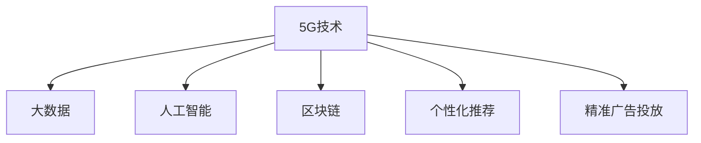

                 

# 5G技术如何重塑注意力经济格局

> 关键词：5G, 注意力经济, 大数据, 人工智能, 区块链, 个性化推荐, 广告精准投放

## 1. 背景介绍

### 1.1 问题由来
随着互联网技术的飞速发展，数字经济已经成为现代经济的重要组成部分。根据IDC的报告，全球数字经济规模已经超过了35万亿美元，并预计将在未来几年内持续增长。而在这其中，注意力经济作为数字经济的核心之一，正逐渐成为各家互联网公司竞争的焦点。所谓注意力经济，是指通过吸引并维持用户的注意力来获取商业价值的经济模式。传统注意力经济主要依靠媒体和广告，但随着5G技术的出现，这种经济模式正在发生深刻的变化。

### 1.2 问题核心关键点
5G技术作为新一代移动通信技术，具有高速度、低延迟、大连接等特点，能够显著提升网络带宽和设备连接能力。这不仅使得大数据、人工智能、区块链等新兴技术在注意力经济中的应用成为可能，也为个性化推荐、精准广告投放等场景提供了强有力的技术支持。

## 2. 核心概念与联系

### 2.1 核心概念概述

为更好地理解5G技术如何重塑注意力经济格局，本节将介绍几个密切相关的核心概念：

- **5G技术**：新一代移动通信技术，提供了高速度、低延迟、大连接等特点，显著提升网络带宽和设备连接能力。
- **大数据**：通过海量数据收集、分析和处理，发现和利用数据中的有价值信息。
- **人工智能**：通过机器学习、深度学习等算法，提升数据处理能力和决策智能化水平。
- **区块链**：去中心化的分布式账本技术，通过加密和共识机制保障数据安全和透明性。
- **个性化推荐**：通过分析用户行为和兴趣，为其推荐最相关的内容和服务。
- **精准广告投放**：根据用户行为数据和兴趣标签，精准投放广告，提升广告效果。

这些核心概念之间的逻辑关系可以通过以下Mermaid流程图来展示：



这个流程图展示出5G技术对各个核心概念的支撑作用：

1. **5G技术**为**大数据**提供了高速稳定的数据传输渠道。
2. **5G技术**支持**人工智能**的高效训练和实时推理。
3. **5G技术**使得**区块链**实现高效的跨域数据传输和去中心化存储。
4. **5G技术**为**个性化推荐**和**精准广告投放**提供了实时的用户体验和高效的推荐引擎。

这些概念共同构成了5G技术在注意力经济中的作用，推动着整个经济模式的变革和创新。

## 3. 核心算法原理 & 具体操作步骤
### 3.1 算法原理概述

5G技术在注意力经济中的应用，主要体现在以下几个方面：

1. **提升数据传输速度**：5G技术的高速度、低延迟特点，使得实时数据采集和处理成为可能。通过大数据技术，可以实时收集和分析用户行为数据，为个性化推荐和精准广告投放提供支撑。
2. **支持人工智能训练**：5G技术的高带宽和高连接能力，使得大规模模型的训练和推理成为可能。通过人工智能技术，可以构建复杂的推荐模型和广告投放算法，提升广告和内容的个性化匹配度。
3. **实现区块链去中心化存储**：5G技术的高连接能力，使得多节点之间的数据同步和共识成为可能。通过区块链技术，可以实现跨域数据的安全存储和高效传输，保障用户隐私和数据安全。
4. **优化推荐引擎**：5G技术的高速度和低延迟，使得推荐引擎可以实时接收用户反馈，动态调整推荐策略，提升用户体验和内容相关性。

### 3.2 算法步骤详解

基于5G技术的大数据、人工智能和区块链应用，提升个性化推荐和精准广告投放的主要步骤如下：

**Step 1: 数据采集与预处理**
- 通过5G网络收集用户的行为数据，如浏览记录、购买行为、搜索历史等。
- 对收集到的数据进行清洗和预处理，去除无效和噪声数据。

**Step 2: 大数据分析和建模**
- 利用大数据技术对用户行为数据进行分析，提取用户兴趣和偏好。
- 构建用户画像，为个性化推荐和精准广告投放提供基础数据支持。

**Step 3: 个性化推荐模型训练**
- 利用人工智能技术，训练推荐模型，如协同过滤、内容推荐、混合推荐等。
- 在推荐模型中引入机器学习算法，如深度学习、强化学习等，提升推荐效果。

**Step 4: 精准广告投放算法**
- 构建广告投放算法，根据用户行为数据和兴趣标签，精准投放广告。
- 引入人工智能技术，优化广告投放策略，提升广告效果和用户体验。

**Step 5: 区块链去中心化存储**
- 利用区块链技术，实现用户行为数据的去中心化存储和分布式同步。
- 保障用户数据隐私和安全，防止数据泄露和滥用。

**Step 6: 实时反馈和动态优化**
- 实时接收用户反馈数据，调整推荐和广告投放策略。
- 利用大数据和人工智能技术，动态优化推荐和广告投放算法，提升用户体验和内容相关性。

### 3.3 算法优缺点

5G技术在注意力经济中的应用，具有以下优点：

1. **提升用户体验**：通过实时数据采集和分析，用户可以享受到更加个性化和精准的推荐和广告。
2. **提高广告效果**：精准的广告投放，可以显著提升广告点击率和转化率，降低广告成本。
3. **保障数据安全**：区块链技术实现了数据的去中心化存储和加密传输，保障了用户数据的安全性和隐私性。
4. **促进创新**：大数据、人工智能和区块链技术的结合，为个性化推荐和精准广告投放提供了新的技术路径，推动了广告业和媒体业的技术创新。

同时，5G技术在注意力经济中的应用，也存在以下缺点：

1. **高成本投入**：5G网络的建设和维护成本较高，对互联网公司来说是一笔不小的开支。
2. **隐私和安全风险**：用户数据的采集和分析可能带来隐私泄露和安全风险，需要严格的监管和保护措施。
3. **算法偏见**：人工智能算法可能在数据偏见和模型设计中产生偏见，影响推荐和广告的公平性。
4. **技术复杂性**：结合大数据、人工智能和区块链技术，需要高水平的技术能力和人才支持，对互联网公司提出了更高的技术要求。

## 4. 数学模型和公式 & 详细讲解 & 举例说明

### 4.1 数学模型构建

在本节中，我们将使用数学语言对基于5G技术的大数据、人工智能和区块链应用进行更加严格的刻画。

记用户行为数据集为 $D=\{x_i\}_{i=1}^N$，其中 $x_i$ 表示第 $i$ 个用户的浏览记录、购买行为、搜索历史等。假设用户行为数据具有如下形式：

$$
x_i = \{d_1, d_2, \ldots, d_m\}
$$

其中 $d_j$ 表示用户第 $j$ 次的行为记录，可以进一步拆分为：

$$
d_j = \{t_j, a_j, b_j\}
$$

其中 $t_j$ 表示行为时间，$a_j$ 表示行为内容，$b_j$ 表示行为标签。例如，$b_j$ 可以是“购买”、“浏览”、“搜索”等。

假设推荐模型为 $M$，广告投放算法为 $A$，其训练目标为最大化用户点击率。根据上述定义，推荐模型和广告投放算法可以表示为：

$$
M = \arg\max_{\theta} \sum_{i=1}^N \ell_i(M, x_i)
$$

$$
A = \arg\min_{\alpha} \sum_{i=1}^N \ell_i(A, x_i)
$$

其中 $\ell_i$ 表示推荐和广告投放的损失函数，如交叉熵损失函数。

### 4.2 公式推导过程

以推荐模型为例，我们假设推荐模型为深度学习模型，如神经网络。则其损失函数为：

$$
\ell_i(M, x_i) = -\log M(x_i) \cdot y_i
$$

其中 $M(x_i)$ 表示推荐模型对用户行为 $x_i$ 的推荐结果，$y_i$ 表示用户行为标签。

根据上述定义，推荐模型的训练目标可以表示为：

$$
\min_{\theta} \sum_{i=1}^N \ell_i(M, x_i)
$$

在求解该优化问题时，通常使用梯度下降等优化算法，其更新公式为：

$$
\theta \leftarrow \theta - \eta \nabla_{\theta}\ell_i(M, x_i)
$$

其中 $\eta$ 表示学习率，$\nabla_{\theta}\ell_i(M, x_i)$ 表示损失函数对模型参数的梯度。

### 4.3 案例分析与讲解

以推荐系统为例，假设一个电商网站希望通过推荐系统提升用户购买率。首先需要收集用户的历史浏览记录和购买行为，将其表示为向量形式 $x_i$。然后通过大数据技术，对用户行为数据进行分析，提取用户兴趣和偏好。构建用户画像，为推荐模型提供基础数据支持。

选择深度学习模型作为推荐模型，利用数据集 $D$ 进行模型训练，最小化损失函数 $\ell_i(M, x_i)$。训练过程中，可以通过以下步骤实现：

1. 数据预处理：对用户行为数据进行清洗和预处理，去除无效和噪声数据。
2. 用户画像构建：利用大数据技术，对用户行为数据进行分析，提取用户兴趣和偏好。
3. 推荐模型训练：选择深度学习模型，利用数据集 $D$ 进行模型训练，最小化损失函数 $\ell_i(M, x_i)$。
4. 实时反馈和优化：实时接收用户反馈数据，调整推荐策略。

在推荐系统开发和实践中，需要注意以下几个关键点：

- **数据质量**：推荐系统的性能依赖于数据的质量，需要确保数据采集和预处理的准确性和完整性。
- **模型选择**：选择合适的推荐模型，如协同过滤、内容推荐、混合推荐等，需要根据具体场景和数据特点进行选择。
- **实时反馈**：推荐系统需要实时接收用户反馈数据，动态调整推荐策略，提升用户体验和内容相关性。
- **隐私和安全**：推荐系统涉及用户数据的采集和分析，需要严格保护用户隐私和数据安全。

## 5. 项目实践：代码实例和详细解释说明

### 5.1 开发环境搭建

在进行推荐系统开发前，我们需要准备好开发环境。以下是使用Python进行推荐系统开发的开发环境配置流程：

1. 安装Anaconda：从官网下载并安装Anaconda，用于创建独立的Python环境。

2. 创建并激活虚拟环境：
```bash
conda create -n recsys python=3.8 
conda activate recsys
```

3. 安装推荐系统相关的库：
```bash
conda install pandas numpy scikit-learn scikit-learn-recsys
```

4. 安装用于模型训练和推理的库：
```bash
pip install torch pytorch-lightning pytorch-ignite
```

5. 安装用于数据处理的库：
```bash
pip install pandas-gbq
```

6. 安装用于模型部署的库：
```bash
pip install gunicorn
```

完成上述步骤后，即可在`recsys`环境中开始推荐系统开发。

### 5.2 源代码详细实现

我们以基于深度学习的推荐系统为例，使用PyTorch实现推荐模型的训练和推理。

首先，定义推荐模型的输入和输出：

```python
import torch
import torch.nn as nn
import torch.nn.functional as F

class RecSystem(nn.Module):
    def __init__(self, input_size, hidden_size, output_size):
        super(RecSystem, self).__init__()
        self.fc1 = nn.Linear(input_size, hidden_size)
        self.fc2 = nn.Linear(hidden_size, output_size)
        
    def forward(self, x):
        x = F.relu(self.fc1(x))
        x = self.fc2(x)
        return x
```

然后，定义推荐模型的训练过程：

```python
from torch.utils.data import DataLoader
from torch.optim import Adam

class RecommendationDataset(Dataset):
    def __init__(self, data, labels):
        self.data = data
        self.labels = labels
        
    def __len__(self):
        return len(self.data)
    
    def __getitem__(self, idx):
        return self.data[idx], self.labels[idx]

def train_rec_system(model, train_dataset, valid_dataset, epochs, batch_size, learning_rate):
    model.train()
    optimizer = Adam(model.parameters(), lr=learning_rate)
    criterion = nn.CrossEntropyLoss()
    
    for epoch in range(epochs):
        for data, target in train_loader:
            optimizer.zero_grad()
            output = model(data)
            loss = criterion(output, target)
            loss.backward()
            optimizer.step()
            print(f"Epoch {epoch+1}, Train Loss: {loss:.4f}")
        
        with torch.no_grad():
            model.eval()
            valid_loss = 0
            for data, target in valid_loader:
                output = model(data)
                loss = criterion(output, target)
                valid_loss += loss.item()
            print(f"Epoch {epoch+1}, Valid Loss: {valid_loss:.4f}")
```

最后，启动训练流程并在测试集上评估：

```python
train_rec_system(model, train_dataset, valid_dataset, epochs=10, batch_size=64, learning_rate=0.001)
```

以上就是使用PyTorch进行推荐系统开发的完整代码实现。可以看到，利用PyTorch的强大封装和自动微分功能，我们可以快速实现推荐模型的训练和推理。

### 5.3 代码解读与分析

让我们再详细解读一下关键代码的实现细节：

**RecSystem类**：
- `__init__`方法：定义模型输入和输出。
- `forward`方法：定义模型前向传播的计算流程。

**RecommendationDataset类**：
- `__init__`方法：初始化数据集和标签。
- `__len__`方法：返回数据集大小。
- `__getitem__`方法：对单个样本进行处理，返回输入和标签。

**train_rec_system函数**：
- 定义模型训练过程。
- 使用Adam优化器进行模型参数的更新。
- 定义交叉熵损失函数。
- 在每个epoch内，对训练集进行前向传播和反向传播，更新模型参数。
- 在每个epoch结束时，在验证集上评估模型性能。

在实际应用中，还需要针对具体任务的特点，对推荐系统的各个环节进行优化设计，如改进训练目标函数，引入更多的正则化技术，搜索最优的超参数组合等，以进一步提升模型性能。

## 6. 实际应用场景

### 6.1 电商推荐

电商推荐系统是5G技术在注意力经济中最重要的应用场景之一。传统电商推荐系统依赖人工干预，推荐效果难以保证。而基于5G技术的推荐系统，能够通过实时数据采集和分析，为用户推荐最相关的商品，提升用户体验和购买率。

在技术实现上，可以收集用户的历史浏览记录、购买行为、搜索历史等数据，构建用户画像，为推荐模型提供基础数据支持。在模型训练过程中，通过大数据技术进行用户行为分析，提取用户兴趣和偏好。最后，使用深度学习模型训练推荐模型，实时接收用户反馈数据，动态调整推荐策略，提升用户体验和内容相关性。

### 6.2 媒体推荐

媒体推荐系统通过实时分析用户的观看记录和行为数据，为用户推荐最相关的视频内容。基于5G技术的推荐系统能够实现实时的视频推荐和广告投放，提升用户观看体验和广告效果。

在技术实现上，可以收集用户的观看记录、搜索历史、点赞评论等数据，构建用户画像，为推荐模型提供基础数据支持。在模型训练过程中，通过大数据技术进行用户行为分析，提取用户兴趣和偏好。最后，使用深度学习模型训练推荐模型，实时接收用户反馈数据，动态调整推荐策略，提升用户体验和内容相关性。

### 6.3 广告投放

广告投放系统通过实时分析用户的浏览记录和行为数据，精准投放广告，提升广告点击率和转化率。基于5G技术的广告投放系统能够实现实时的广告推荐和效果监测，提升广告效果和用户体验。

在技术实现上，可以收集用户的浏览记录、搜索历史、点击行为等数据，构建用户画像，为广告投放算法提供基础数据支持。在算法训练过程中，通过大数据技术进行用户行为分析，提取用户兴趣和偏好。最后，使用深度学习算法训练广告投放模型，实时接收用户反馈数据，动态调整投放策略，提升广告效果和用户体验。

### 6.4 未来应用展望

随着5G技术的普及和应用，基于5G技术的大数据、人工智能和区块链应用将在更多领域得到应用，为传统行业带来变革性影响。

在智慧医疗领域，基于5G技术的推荐系统能够为用户提供个性化的健康建议和医疗资源，提升医疗服务的智能化水平，辅助医生诊疗，加速新药开发进程。

在智能教育领域，基于5G技术的推荐系统能够为用户提供个性化的学习建议和资源推荐，因材施教，促进教育公平，提高教学质量。

在智慧城市治理中，基于5G技术的推荐系统能够为用户提供个性化的城市服务和信息推荐，提高城市管理的自动化和智能化水平，构建更安全、高效的未来城市。

此外，在企业生产、社会治理、文娱传媒等众多领域，基于5G技术的推荐系统也将不断涌现，为NLP技术带来新的突破。

## 7. 工具和资源推荐

### 7.1 学习资源推荐

为了帮助开发者系统掌握5G技术在注意力经济中的应用，这里推荐一些优质的学习资源：

1. 《5G与物联网应用》系列博文：由5G专家撰写，深入浅出地介绍了5G技术及其在物联网领域的应用。

2. 《大数据技术与应用》课程：由知名大学开设的在线课程，系统讲解大数据技术的基本概念和应用场景。

3. 《人工智能技术与应用》书籍：全面介绍了人工智能技术的基本原理和应用，涵盖深度学习、强化学习、自然语言处理等前沿技术。

4. 《区块链技术与应用》书籍：介绍区块链技术的基本原理和应用，涵盖共识算法、智能合约、去中心化应用等核心概念。

5. 《推荐系统设计与实现》书籍：介绍推荐系统设计的基本原理和实现方法，涵盖协同过滤、内容推荐、混合推荐等推荐算法。

通过对这些资源的学习实践，相信你一定能够快速掌握5G技术在注意力经济中的应用，并用于解决实际的推荐系统问题。

### 7.2 开发工具推荐

高效的开发离不开优秀的工具支持。以下是几款用于5G推荐系统开发的常用工具：

1. PyTorch：基于Python的开源深度学习框架，灵活动态的计算图，适合快速迭代研究。推荐系统模型通常使用PyTorch进行训练和推理。

2. TensorFlow：由Google主导开发的开源深度学习框架，生产部署方便，适合大规模工程应用。推荐系统模型通常使用TensorFlow进行训练和推理。

3. Scikit-learn：开源的机器学习库，提供简单易用的API，支持各种数据预处理和模型训练。

4. Pandas：开源的数据处理库，支持高效的数据读写和处理，是推荐系统开发中的重要工具。

5. Apache Spark：开源的大数据处理框架，支持分布式数据处理和机器学习算法。

6. Apache Hadoop：开源的大数据存储和处理框架，支持大规模数据存储和处理。

合理利用这些工具，可以显著提升5G推荐系统的开发效率，加快创新迭代的步伐。

### 7.3 相关论文推荐

5G技术在注意力经济中的应用源于学界的持续研究。以下是几篇奠基性的相关论文，推荐阅读：

1. "5G: The Next Generation Wireless Network"：IEEE对5G技术及其应用进行全面介绍。

2. "Big Data: Principles and Best Practices of Scalable Real-time Data Systems"：从原理和实践两个角度介绍了大数据技术及其应用。

3. "Deep Learning for Recommender Systems: A Survey and Outlook"：综述了深度学习在推荐系统中的应用和未来展望。

4. "Blockchain Basics: A Non-Technical Introduction"：全面介绍了区块链技术的基本概念和应用。

5. "A Survey on Deep Learning for Recommendation Systems"：综述了深度学习在推荐系统中的应用和未来发展趋势。

这些论文代表了大数据、人工智能和区块链技术的发展脉络。通过学习这些前沿成果，可以帮助研究者把握学科前进方向，激发更多的创新灵感。

## 8. 总结：未来发展趋势与挑战

### 8.1 总结

本文对基于5G技术的大数据、人工智能和区块链应用进行了全面系统的介绍。首先阐述了5G技术在注意力经济中的应用背景和意义，明确了大数据、人工智能和区块链技术在5G应用中的重要作用。其次，从原理到实践，详细讲解了5G技术在推荐系统、广告投放等场景中的应用流程，给出了推荐系统开发的完整代码实例。同时，本文还广泛探讨了5G技术在多个行业领域的应用前景，展示了5G技术在注意力经济中的巨大潜力。

通过本文的系统梳理，可以看到，5G技术正通过大数据、人工智能和区块链等新兴技术的融合，深刻改变着注意力经济的模式和格局。5G技术的高速度、低延迟和大连接特点，使得推荐系统、广告投放等场景能够实现实时的用户体验和高效的推荐效果。未来，伴随5G技术的不断成熟和应用，基于5G技术的推荐系统、广告投放等应用将不断创新，为数字经济带来新的增长点。

### 8.2 未来发展趋势

展望未来，5G技术在注意力经济中的应用将呈现以下几个发展趋势：

1. **实时性提升**：5G技术的高速度和低延迟特点，使得推荐系统和广告投放系统能够实现实时的用户体验和高效的推荐效果。
2. **智能化增强**：人工智能技术将进一步提升推荐系统和广告投放的智能化水平，实现更加精准和个性化的推荐和广告。
3. **去中心化发展**：区块链技术将实现用户数据的去中心化存储和分布式同步，保障用户数据的安全性和隐私性。
4. **多模态融合**：结合图像、视频、语音等多模态数据，提升推荐系统和广告投放的覆盖面和多样性。
5. **个性化深化**：通过深入分析用户行为和兴趣，实现更加精准和个性化的推荐和广告。
6. **技术融合加速**：大数据、人工智能和区块链技术的深度融合，将推动更多行业应用5G技术，实现跨界创新。

以上趋势凸显了5G技术在注意力经济中的广阔前景。这些方向的探索发展，必将进一步提升推荐系统、广告投放等场景的性能和用户体验，为数字经济带来新的增长动力。

### 8.3 面临的挑战

尽管5G技术在注意力经济中的应用前景广阔，但在迈向更加智能化、普适化应用的过程中，它仍面临诸多挑战：

1. **高成本投入**：5G网络的建设和维护成本较高，对互联网公司来说是一笔不小的开支。如何平衡成本和收益，是一个重要的挑战。
2. **隐私和安全风险**：用户数据的采集和分析可能带来隐私泄露和安全风险，需要严格的监管和保护措施。
3. **技术复杂性**：大数据、人工智能和区块链技术的结合，需要高水平的技术能力和人才支持，对互联网公司提出了更高的技术要求。
4. **算法偏见**：人工智能算法可能在数据偏见和模型设计中产生偏见，影响推荐和广告的公平性。
5. **系统复杂性**：基于5G技术的推荐系统、广告投放等应用，系统复杂性较高，需要高效的架构设计和算法优化。

这些挑战需要通过技术创新和政策支持，不断克服和解决，才能充分发挥5G技术在注意力经济中的潜力。

### 8.4 研究展望

面向未来，5G技术在注意力经济中的应用需要在以下几个方面寻求新的突破：

1. **提升算法的公平性和透明性**：通过引入因果分析和博弈论工具，增强推荐和广告的公平性和透明性，提升用户信任和满意度。
2. **实现个性化推荐和广告的跨领域融合**：将不同模态的数据进行融合，提升推荐和广告的覆盖面和多样性，实现多场景下的跨领域应用。
3. **引入更多先验知识**：将符号化的先验知识，如知识图谱、逻辑规则等，与神经网络模型进行巧妙融合，引导推荐和广告的决策过程。
4. **纳入伦理道德约束**：在推荐和广告的训练目标中引入伦理导向的评估指标，过滤和惩罚有偏见、有害的输出倾向，保障用户的数据安全和隐私保护。
5. **优化推荐和广告的效率和性能**：通过模型压缩、稀疏化存储等技术手段，优化推荐和广告的系统架构和算法，提升其效率和性能。

这些研究方向将推动5G技术在注意力经济中的应用更加深入和广泛，为数字经济的创新和发展提供新的动力。

## 9. 附录：常见问题与解答

**Q1：5G技术对推荐系统的影响有哪些？**

A: 5G技术对推荐系统的影响主要体现在以下几个方面：

1. **数据采集效率提升**：5G技术的高速度和低延迟特点，使得实时数据采集成为可能，从而提高推荐系统的数据质量和更新频率。
2. **模型训练效率提升**：5G技术的高带宽和大连接能力，使得大规模模型的训练和推理成为可能，提升推荐系统的性能。
3. **实时推荐成为可能**：5G技术的高速度和低延迟特点，使得实时推荐成为可能，提升用户体验和推荐效果。
4. **去中心化存储**：5G技术的高连接能力，使得多节点之间的数据同步和共识成为可能，实现用户数据的去中心化存储和分布式同步。

5. **个性化推荐**：5G技术能够实时接收用户反馈数据，动态调整推荐策略，提升用户体验和内容相关性。

**Q2：5G技术在推荐系统中的应用需要考虑哪些关键问题？**

A: 5G技术在推荐系统中的应用需要考虑以下几个关键问题：

1. **数据质量**：推荐系统的性能依赖于数据的质量，需要确保数据采集和预处理的准确性和完整性。
2. **模型选择**：选择合适的推荐模型，如协同过滤、内容推荐、混合推荐等，需要根据具体场景和数据特点进行选择。
3. **实时反馈**：推荐系统需要实时接收用户反馈数据，动态调整推荐策略，提升用户体验和内容相关性。
4. **隐私和安全**：推荐系统涉及用户数据的采集和分析，需要严格保护用户隐私和数据安全。

**Q3：5G技术在推荐系统中的应用面临哪些技术挑战？**

A: 5G技术在推荐系统中的应用面临以下几个技术挑战：

1. **高成本投入**：5G网络的建设和维护成本较高，对互联网公司来说是一笔不小的开支。
2. **隐私和安全风险**：用户数据的采集和分析可能带来隐私泄露和安全风险，需要严格的监管和保护措施。
3. **技术复杂性**：大数据、人工智能和区块链技术的结合，需要高水平的技术能力和人才支持，对互联网公司提出了更高的技术要求。
4. **算法偏见**：人工智能算法可能在数据偏见和模型设计中产生偏见，影响推荐和广告的公平性。
5. **系统复杂性**：基于5G技术的推荐系统、广告投放等应用，系统复杂性较高，需要高效的架构设计和算法优化。

这些挑战需要通过技术创新和政策支持，不断克服和解决，才能充分发挥5G技术在推荐系统中的应用潜力。

**Q4：5G技术在推荐系统中的应用有哪些应用场景？**

A: 5G技术在推荐系统中的应用主要包括以下几个应用场景：

1. **电商推荐**：电商推荐系统通过实时数据采集和分析，为用户推荐最相关的商品，提升用户体验和购买率。
2. **媒体推荐**：媒体推荐系统通过实时分析用户的观看记录和行为数据，为用户推荐最相关的视频内容。
3. **广告投放**：广告投放系统通过实时分析用户的浏览记录和行为数据，精准投放广告，提升广告点击率和转化率。
4. **金融推荐**：金融推荐系统通过实时分析用户的行为数据，为用户提供个性化的金融产品推荐。
5. **社交推荐**：社交推荐系统通过实时分析用户的行为数据，为用户推荐最相关的内容和好友。

**Q5：5G技术在推荐系统中的应用需要注意哪些关键点？**

A: 5G技术在推荐系统中的应用需要注意以下几个关键点：

1. **数据质量**：推荐系统的性能依赖于数据的质量，需要确保数据采集和预处理的准确性和完整性。
2. **模型选择**：选择合适的推荐模型，如协同过滤、内容推荐、混合推荐等，需要根据具体场景和数据特点进行选择。
3. **实时反馈**：推荐系统需要实时接收用户反馈数据，动态调整推荐策略，提升用户体验和内容相关性。
4. **隐私和安全**：推荐系统涉及用户数据的采集和分析，需要严格保护用户隐私和数据安全。

这些关键点需要在推荐系统开发和实践中不断优化和改进，才能最大限度地发挥5G技术在推荐系统中的应用潜力。

---

作者：禅与计算机程序设计艺术 / Zen and the Art of Computer Programming

