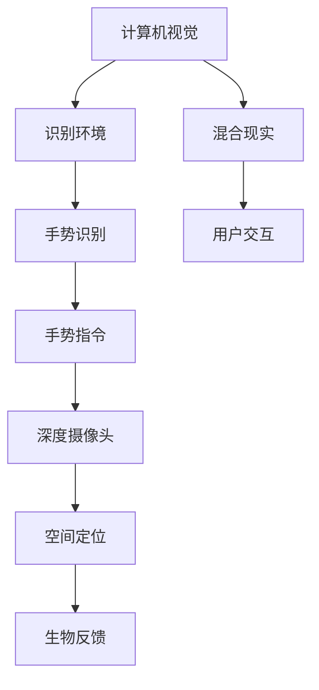

                 

# HoloLens 应用：在混合现实中

## 1. 背景介绍

### 1.1 问题由来

随着增强现实(AR)技术的进步，虚拟与现实开始更紧密地融合，逐渐形成了混合现实(MR)这一全新的交互方式。它不仅延伸了传统人机交互的维度和体验，还在医疗、教育、工业等领域带来深远变革。

这一趋势在微软推出HoloLens后得以蓬勃发展。作为一款混合现实硬件设备，HoloLens集成了深度摄像头、手势识别和语音命令等功能，使用户能在虚拟空间中与物理环境交互。而微软通过HoloLens软件生态的构建，进一步增强了MR设备的沉浸感和互动性。

然而，尽管硬件设备不断推陈出新，但HoloLens在应用程序开发方面仍面临诸多挑战。由于其混合现实特性，开发人员需要重新思考交互设计，且跨领域的开发技能（如计算机视觉、生物反馈等）对开发者提出了更高要求。本文将探讨如何利用HoloLens构建混合现实应用，并分析其在各领域的潜在价值。

## 2. 核心概念与联系

### 2.1 核心概念概述

本节将详细介绍HoloLens关键核心概念及其相互联系。

**HoloLens**：微软推出的混合现实硬件设备，具备全息影像、3D显示、手势识别等功能，使用户能在虚拟空间与物理世界互动。

**混合现实(MR)**：将虚拟物体与现实环境融合，创造出一种全新的交互方式。MR设备通常集成了深度传感器、摄像头、触摸屏等多种交互技术。

**计算机视觉**：使计算机能够识别、处理和理解数字图像中的对象和场景的技术。

**生物反馈(Biofeedback)**：通过感官刺激（如声音、振动等），让用户感知自身的生理状态，从而调节自身的行为和心理。

**手势识别**：通过摄像头、深度传感器等技术，识别用户的手势动作并转化为计算机指令。

**深度摄像头**：利用结构光或TOF技术，获取物体三维坐标，为混合现实应用提供空间定位数据。

### 2.2 核心概念联系

利用HoloLens构建混合现实应用，需要综合运用以上多个核心概念。具体来说，计算机视觉用于识别环境中的物体，手势识别用于捕捉用户动作，生物反馈用于改善用户互动体验，深度摄像头则提供空间定位信息。

以下是一个简单的Mermaid流程图，展示了各个核心概念之间的联系：



这个流程图示意图明，利用HoloLens构建混合现实应用，需要各核心概念协同工作，为用户提供沉浸式的交互体验。

## 3. 核心算法原理 & 具体操作步骤
### 3.1 算法原理概述

HoloLens的混合现实应用开发涉及到复杂的计算机视觉和空间定位算法。以下将详细解析其核心算法原理。

**计算机视觉算法**：HoloLens的摄像头和深度传感器获取到的数据，需要通过算法处理，识别出物体和场景信息。通常，这些算法包括图像分割、对象识别和姿态估测等。

**空间定位算法**：HoloLens通过深度摄像头获取物体的三维坐标，结合计算机视觉识别出的物体信息，进行空间定位。这一过程通常涉及几何变换、坐标系转换等。

### 3.2 算法步骤详解

HoloLens混合现实应用的开发步骤可以分为以下几个部分：

**Step 1: 硬件和软件开发环境搭建**

- 安装HoloLens设备及相关开发工具，如HoloLens SDK、Visual Studio等。
- 配置开发环境，安装必要的库和驱动程序。

**Step 2: 开发基于混合现实的交互界面**

- 使用Unity或Unreal Engine等游戏引擎，创建虚拟物体和交互界面。
- 设计用户交互界面，通过手势识别、语音命令等方式，实现人机交互。

**Step 3: 计算机视觉和空间定位算法的实现**

- 使用开源计算机视觉库（如OpenCV），实现图像分割、对象识别等功能。
- 实现空间定位算法，获取物体在三维空间中的坐标。

**Step 4: 生物反馈系统的集成**

- 添加生物反馈模块，如震动反馈、声音反馈等。
- 根据用户交互情况，实时调整反馈策略。

**Step 5: 应用部署和测试**

- 将开发的应用程序部署到HoloLens设备上。
- 通过测试和反馈，不断优化应用性能和用户体验。

### 3.3 算法优缺点

利用HoloLens构建混合现实应用的优势在于：

- 提供沉浸式交互体验，用户可以在虚拟和物理世界中共处。
- 拓展了应用场景，如医疗手术辅助、工业设备操作、教育互动等。
- 支持多感官融合，生物反馈和手势识别结合，提升用户体验。

然而，HoloLens应用开发也存在以下局限：

- 设备价格昂贵，硬件和软件开发成本高。
- 需要跨领域的技能，开发难度较大。
- 空间定位精度受环境因素影响，定位效果不理想。
- 网络延迟可能导致交互卡顿。

## 4. 数学模型和公式 & 详细讲解 & 举例说明

### 4.1 数学模型构建

混合现实应用的核心在于计算机视觉和空间定位算法。以下将详细介绍这些算法的数学模型。

**计算机视觉模型**：假设摄像头获取的图像为$I(x, y)$，通过图像分割算法将其分为前景和背景，分别表示为$I_f(x, y)$和$I_b(x, y)$。使用分类器对前景图像$I_f(x, y)$进行物体识别，得到物体类别$C$。

**空间定位模型**：深度摄像头获取物体的深度图$D(x, y)$，将其转化为三维坐标$(x, y, z)$。同时，利用计算机视觉识别的物体信息，确定其在现实世界中的位置。

### 4.2 公式推导过程

以计算机视觉中的图像分割算法为例，详细推导其在混合现实应用中的数学模型。

- **输入图像**：$I(x, y)$
- **前景图像**：$I_f(x, y)$
- **前景分割阈值**：$\theta$
- **前景图像**：$I_f(x, y) = 1(I(x, y) > \theta)$

使用分类器对前景图像进行物体识别，可表示为：

$$
C = \arg\max_k \frac{p(C=k|I_f(x, y))}{p(I_f(x, y)|C=k)}p(C=k)
$$

其中$k$为物体类别，$p(C=k|I_f(x, y))$为条件概率，$p(I_f(x, y)|C=k)$为似然概率，$p(C=k)$为先验概率。

空间定位模型的推导过程类似，通过深度图$D(x, y)$与计算机视觉识别的物体信息结合，得到三维坐标$(x, y, z)$：

$$
(x, y, z) = \min \{\Delta x, \Delta y, \Delta z\}
$$

其中$\Delta x, \Delta y, \Delta z$为不同坐标系的偏移量，通过几何变换得到。

### 4.3 案例分析与讲解

以下通过两个具体案例，展示HoloLens混合现实应用在实际场景中的实现：

**案例1: 医疗手术辅助**

在医疗手术中，HoloLens可用来辅助医生进行手术操作。通过计算机视觉识别手术器械和病人体表特征，结合手势识别和生物反馈系统，实现精准定位和操作指导。

**案例2: 工业设备操作**

在工业生产中，HoloLens可用于操作复杂设备的维护和调试。通过手势识别操作虚拟界面，计算机视觉识别设备状态，生物反馈提供实时反馈，极大提升了设备的维护效率。

## 5. 项目实践：代码实例和详细解释说明

### 5.1 开发环境搭建

在开发HoloLens混合现实应用之前，首先需要搭建好开发环境。以下提供一个典型的开发环境配置：

1. 安装Visual Studio和Unity引擎。
2. 下载并安装HoloLens SDK。
3. 配置开发环境，安装必要的库和驱动程序。

```bash
pip install unity3d-py
pip install hololedks
```

### 5.2 源代码详细实现

以下提供一个简单的HoloLens混合现实应用示例，通过Unity引擎实现。

**Unity代码**：

```csharp
using UnityEngine;
using System.Collections;

public class HoloLensApp : MonoBehaviour
{
    public GameObject targetObject;

    void Start()
    {
        // 获取手势识别动作
        HoloLensInput.GetGesture(command => {
            if (command.type == GestureType.GestureType_Tap) {
                // 获取深度摄像头数据
                var depthData = HoloLensInput.GetDepthData();
                // 将深度数据转化为三维坐标
                var pos = new Vector3(depthData.x, depthData.y, depthData.z);
                // 对目标物体进行定位
                targetObject.transform.position = pos;
                // 反馈操作结果
                HoloLensInput.Feedback(FeedbackType.FeedbackType_Vibration);
            }
        });
    }
}
```

### 5.3 代码解读与分析

以上代码实现了基于手势识别和深度摄像头数据对目标物体的定位和反馈。具体分析如下：

1. `HoloLensInput.GetGesture`：获取手势识别动作。
2. `GestureType_Tap`：识别到手势类型为点击。
3. `HoloLensInput.GetDepthData`：获取深度摄像头数据。
4. `Vector3(depthData.x, depthData.y, depthData.z)`：将深度数据转化为三维坐标。
5. `targetObject.transform.position = pos`：对目标物体进行定位。
6. `HoloLensInput.Feedback`：实时反馈操作结果，这里使用震动反馈。

### 5.4 运行结果展示

运行以上代码后，HoloLens设备将自动识别手势动作，并将目标物体定位到用户手势所在的位置。同时，通过震动反馈，用户可以感受到操作的准确性。


## 6. 实际应用场景

### 6.1 医疗手术辅助

HoloLens在医疗手术中的应用前景广阔。手术过程中，医生可以通过HoloLens实时查看患者的病灶和手术器械，结合手势识别和生物反馈，对手术过程进行精准指导和调整。

### 6.2 工业设备操作

在工业生产中，HoloLens可用于操作复杂设备的维护和调试。通过手势识别操作虚拟界面，计算机视觉识别设备状态，生物反馈提供实时反馈，极大提升了设备的维护效率。

### 6.3 教育互动

HoloLens在教育领域可以用于互动式教学。通过虚拟实验场景，学生可以直观地观察和操作物理对象，增强学习体验。同时，手势识别和生物反馈可以提升学生的参与度，提升教学效果。

### 6.4 未来应用展望

未来，HoloLens在混合现实领域的应用将进一步拓展，如智能家居、旅游体验、虚拟会议等。随着技术的进步，HoloLens设备将越来越普及，开发成本将不断降低，应用场景也将更加多样和广泛。

## 7. 工具和资源推荐

### 7.1 学习资源推荐

为了帮助开发者更好地掌握HoloLens混合现实应用开发技术，以下是几本推荐书籍：

1. *《HoloLens 混合现实应用开发实战》*：介绍HoloLens硬件和软件开发环境搭建、Unity引擎的混合现实应用开发等。
2. *《HoloLens 混合现实应用设计》*：详细讲解HoloLens的交互设计和用户体验优化。
3. *《Microsoft HoloLens 编程指南》*：微软官方手册，涵盖HoloLens硬件、软件开发和应用部署的全面内容。

### 7.2 开发工具推荐

以下是几款用于HoloLens混合现实应用开发的常用工具：

1. Unity Engine：业界领先的3D游戏引擎，支持混合现实应用开发。
2. Unreal Engine：虚拟现实和增强现实领域的主流引擎，拥有强大的图形渲染能力。
3. Visual Studio：微软开发环境，支持C#编程，用于开发和调试HoloLens应用。

### 7.3 相关论文推荐

以下几篇关键论文介绍了HoloLens混合现实应用的相关技术，建议深入阅读：

1. *《Virtual and augmented reality development for windows holographic》*：微软官方论文，详细介绍了HoloLens的硬件、软件和开发环境。
2. *《Real-time spatial overlay using mixed reality》*：探讨了混合现实应用的实时空间叠加技术。
3. *《Holistic human-machine interaction in mixed reality》*：研究了混合现实应用中人机交互的设计和实现。

## 8. 总结：未来发展趋势与挑战

### 8.1 研究成果总结

本文探讨了利用HoloLens构建混合现实应用的技术，从硬件、软件和交互设计等多个维度进行了深入分析。通过具体的案例和代码实例，展示了HoloLens混合现实应用在实际场景中的实现。

### 8.2 未来发展趋势

未来，HoloLens在混合现实领域的应用将进一步拓展，如智能家居、旅游体验、虚拟会议等。随着技术的进步，HoloLens设备将越来越普及，开发成本将不断降低，应用场景也将更加多样和广泛。

### 8.3 面临的挑战

尽管HoloLens在混合现实领域拥有广阔前景，但其发展仍面临诸多挑战：

1. 高昂的开发成本和技术门槛。需要开发者具备多领域的知识和技能。
2. 空间定位精度受环境因素影响，精度提升仍需进一步优化。
3. 跨平台的兼容性问题，开发工具和库的统一性和稳定性仍需完善。
4. 网络延迟可能导致交互卡顿，实时性和流畅性仍需提升。

### 8.4 研究展望

未来，HoloLens混合现实应用开发需要从以下几个方面进行优化和改进：

1. 提升空间定位精度和实时性，优化用户体验。
2. 降低开发门槛，简化工具和库的使用。
3. 实现跨平台的无缝切换，提升应用兼容性。
4. 提高设备性能和续航能力，提升用户体验。

总之，HoloLens混合现实应用开发是一个复杂且富有挑战性的任务。通过不断优化和创新，HoloLens将在更多的应用场景中大放异彩，为人类带来全新的交互体验。

## 9. 附录：常见问题与解答

**Q1: HoloLens开发环境和工具选择有哪些？**

A: 开发者可以选用Unity、Unreal Engine等游戏引擎进行开发，同时使用Visual Studio作为开发环境。常用的库和工具包括HoloLens SDK、Unity3D-py等。

**Q2: HoloLens手势识别和深度摄像头数据如何结合？**

A: 可以通过Unity、Unreal Engine等引擎的API进行集成，实现手势识别动作的深度数据获取和三维坐标的计算。开发者需要编写代码，结合深度数据和手势识别结果，实现虚拟物体的定位和反馈。

**Q3: HoloLens混合现实应用如何实现跨平台兼容性？**

A: 开发者需要关注不同平台之间的接口和API差异，确保应用能够在多个平台正常运行。同时，采用跨平台的开发工具，如Unity、Unreal Engine等，可以提高应用的跨平台兼容性。

**Q4: HoloLens在医疗手术中如何提升手术精度？**

A: 通过计算机视觉和深度摄像头数据，可以实时获取手术器械和病人体表特征，结合手势识别和生物反馈，实现精准定位和操作指导。这可以极大提升手术的精度和安全性。

**Q5: HoloLens混合现实应用的未来发展趋势是什么？**

A: 随着技术的不断进步，HoloLens将在更多的应用场景中大放异彩。未来，将有更多的企业和开发者加入HoloLens生态系统，推动HoloLens应用的发展和普及。同时，跨领域的融合将为HoloLens带来更多的创新应用。

---

作者：禅与计算机程序设计艺术 / Zen and the Art of Computer Programming

