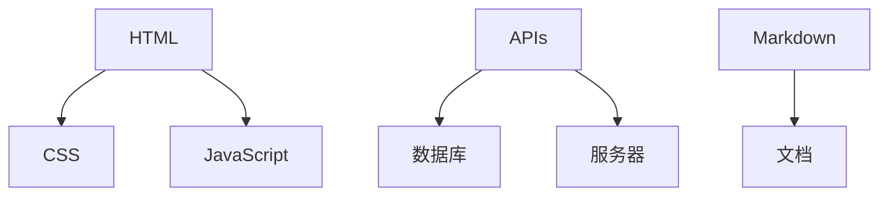

                 

# Jamstack：现代Web开发的新范式

> 关键词：Jamstack, Web开发, 前端技术栈, 安全性, 性能优化, 可维护性, 微服务

## 1. 背景介绍

### 1.1 问题由来

在Web开发领域，传统的技术栈主要包括HTML、CSS、JavaScript（即H、S、J）。而随着Web技术的不断演进，这种传统技术栈逐渐显现出一些问题。比如：

- **开发效率低**：HTML、CSS、JavaScript需要编写大量的代码，而且这些代码在不同的浏览器中可能会有不同的表现。
- **安全性差**：Web应用的安全性问题层出不穷，跨站脚本攻击、SQL注入等安全隐患频发。
- **性能问题**：Web应用的性能瓶颈主要集中在后端服务器，对前端性能的优化较少考虑。

为了解决这些问题，一种新的Web开发范式应运而生，即Jamstack。

### 1.2 问题核心关键点

Jamstack技术栈的核心思想是：使用JavaScript作为Web应用的引擎和客户端实现，搭配APIs和Markdown作为后端，形成前端与后端分离的架构。这种架构能够提高Web应用的开发效率、安全性和性能。

Jamstack的三个核心组件如下：

1. **JavaScript**：作为Web应用的核心引擎，JavaScript的强大性能和丰富的API使得前端开发变得更加高效。
2. **APIs**：后端提供的APIs可以使得前端与后端解耦，进一步提高Web应用的灵活性和扩展性。
3. **Markdown**：作为后端文档的语言，Markdown简化了文档编写和维护的过程。

通过Jamstack技术栈，开发者可以更加专注于业务逻辑的实现，而无需过多关注浏览器的兼容性、安全性等问题。

### 1.3 问题研究意义

Jamstack技术栈的出现，对Web开发领域产生了深远的影响。具体而言：

1. **提高开发效率**：Jamstack技术栈使得前端开发更加高效，避免了传统技术栈中大量的跨浏览器兼容性工作。
2. **增强安全性**：通过使用APIs，可以避免直接在前端处理用户输入，从而减少安全漏洞。
3. **优化性能**：Jamstack技术栈将前端与后端分离，使得前端可以更快地响应，减轻了后端的负担。

Jamstack技术栈还促进了微服务架构的发展，使得Web应用更加灵活和可维护。

## 2. 核心概念与联系

### 2.1 核心概念概述

为了更好地理解Jamstack技术栈，我们首先介绍一些核心概念：

- **前端技术栈**：包括HTML、CSS、JavaScript等，用于构建Web页面和用户界面。
- **后端技术栈**：包括APIs、数据库、服务器等，用于处理业务逻辑和数据存储。
- **Markdown**：一种轻量级标记语言，用于编写和展示文档。
- **微服务**：一种架构风格，将应用拆分为多个小型、独立的服务，每个服务专注于完成一个特定的功能。

这些概念构成了Jamstack技术栈的基本框架，使得Web应用能够实现更高的开发效率、安全性和性能。

### 2.2 核心概念原理和架构的 Mermaid 流程图(Mermaid 流程节点中不要有括号、逗号等特殊字符)



这个流程图展示了Jamstack技术栈的基本架构：

1. HTML、CSS、JavaScript构成了前端技术栈，负责构建Web页面和用户界面。
2. APIs、数据库、服务器构成了后端技术栈，负责处理业务逻辑和数据存储。
3. Markdown用于编写和展示文档。

这种架构使得前端与后端分离，提高了Web应用的灵活性和可维护性。

## 3. 核心算法原理 & 具体操作步骤

### 3.1 算法原理概述

Jamstack技术栈的核心原理是利用JavaScript作为引擎，通过APIs和Markdown实现前端与后端的分离。这种分离架构可以带来更高的开发效率、安全性和性能。

具体而言，Jamstack技术栈的实现过程如下：

1. 前端通过JavaScript和APIs获取数据，并进行处理和渲染。
2. 后端通过APIs提供数据，并通过Markdown编写文档。
3. 前端与后端分离，通过APIs进行通信，避免直接在前端处理用户输入。

### 3.2 算法步骤详解

Jamstack技术栈的实现步骤分为以下几个环节：

**Step 1: 前端开发**

1. 使用JavaScript编写前端代码，实现用户界面和交互逻辑。
2. 通过APIs获取后端提供的数据，并进行处理和渲染。

**Step 2: 后端开发**

1. 使用APIs提供数据，响应前端请求。
2. 通过Markdown编写文档，供前端展示。

**Step 3: 文档管理**

1. 使用Markdown编写文档。
2. 将文档上传到服务器，供前端展示。

### 3.3 算法优缺点

Jamstack技术栈具有以下优点：

1. **提高开发效率**：JavaScript的强大性能和丰富的API使得前端开发更加高效，避免了传统技术栈中大量的跨浏览器兼容性工作。
2. **增强安全性**：通过使用APIs，可以避免直接在前端处理用户输入，从而减少安全漏洞。
3. **优化性能**：Jamstack技术栈将前端与后端分离，使得前端可以更快地响应，减轻了后端的负担。

同时，Jamstack技术栈也存在一些缺点：

1. **学习成本高**：JavaScript的语法和API相对复杂，需要开发者具备一定的技术水平。
2. **服务器端开发复杂**：后端需要提供APIs，开发和维护成本较高。

### 3.4 算法应用领域

Jamstack技术栈在Web开发领域得到了广泛应用，特别是在以下场景中：

- **企业级Web应用**：如ERP、CRM、企业门户等，需要使用大量的数据处理和业务逻辑。
- **内容管理系统(CMS)**：如WordPress、Drupal等，需要使用大量的文档编写和展示。
- **电子商务平台**：如Amazon、阿里巴巴等，需要使用大量的商品展示和用户交互。

Jamstack技术栈还可以与其他技术栈结合使用，如React、Vue等前端框架，进一步提高Web应用的开发效率和性能。

## 4. 数学模型和公式 & 详细讲解 & 举例说明（备注：数学公式请使用latex格式，latex嵌入文中独立段落使用 $$，段落内使用 $)
### 4.1 数学模型构建

Jamstack技术栈的数学模型构建主要涉及前端和后端的交互过程。以下是一个简单的数学模型构建示例：

假设Web应用的前端请求为：

$$
\text{Request} = \{url, method, headers, body\}
$$

后端响应的数据为：

$$
\text{Response} = \{status, headers, body\}
$$

前端通过JavaScript发送请求，后端通过APIs获取数据，并进行处理和渲染。前端和后端之间的交互过程可以用以下公式表示：

$$
\text{Data} = \text{API}(\text{Request})
$$

$$
\text{Document} = \text{Markdown}(\text{Data})
$$

$$
\text{HTML} = \text{JavaScript}(\text{Document})
$$

其中，$\text{API}$表示后端提供的APIs，$\text{Markdown}$表示后端编写的文档，$\text{JavaScript}$表示前端编写的代码。

### 4.2 公式推导过程

根据上述公式，我们可以进一步推导出Jamstack技术栈的数学模型构建过程：

1. 前端通过JavaScript发送请求：

$$
\text{Request} = \{url, method, headers, body\}
$$

2. 后端通过APIs获取数据：

$$
\text{Data} = \text{API}(\text{Request})
$$

3. 后端通过Markdown编写文档：

$$
\text{Document} = \text{Markdown}(\text{Data})
$$

4. 前端通过JavaScript渲染HTML：

$$
\text{HTML} = \text{JavaScript}(\text{Document})
$$

### 4.3 案例分析与讲解

以下是一个Jamstack技术栈的实际应用案例：

假设我们有一个电子商务平台，用户可以通过前端页面浏览商品，并进行购买。前端通过JavaScript发送请求，获取后端提供的商品信息。后端通过APIs获取用户输入，并进行处理和渲染。前端通过JavaScript渲染HTML页面，展示商品信息。具体步骤如下：

1. 用户在前端页面输入商品ID：

$$
\text{Request} = \{url: /product/123, method: GET, headers: {}, body: {}}
$$

2. 后端通过APIs获取商品信息：

$$
\text{Data} = \text{API}(\text{Request}) = \{\text{title}, \text{price}, \text{description}, \text{image}\}
$$

3. 后端通过Markdown编写商品页面：

$$
\text{Document} = \text{Markdown}(\text{Data}) = |
---|
title: |  |
price: |  |
description: |  |
image: |
---|
```

4. 前端通过JavaScript渲染HTML页面：

$$
\text{HTML} = \text{JavaScript}(\text{Document}) = |
<div>
  <h1>Product Name</h1>
  <p>Price: $20.00</p>
  
</div>
|
```

## 5. 项目实践：代码实例和详细解释说明

### 5.1 开发环境搭建

为了实现Jamstack技术栈，我们需要准备好以下开发环境：

1. Node.js：用于JavaScript开发和运行。
2. Express：后端框架，用于处理APIs和Markdown。
3. MongoDB：数据库，用于存储文档数据。

### 5.2 源代码详细实现

以下是一个简单的Jamstack技术栈示例代码：

**前端代码（index.html）**：

```html
<!DOCTYPE html>
<html>
<head>
  <title>Jamstack Demo</title>
</head>
<body>
  <div id="app"></div>
  <script src="bundle.js"></script>
</body>
</html>
```

**前端代码（bundle.js）**：

```javascript
import React from 'react';
import ReactDOM from 'react-dom';
import App from './App';

ReactDOM.render(<App />, document.getElementById('app'));
```

**后端代码（server.js）**：

```javascript
const express = require('express');
const app = express();
const port = 3000;

app.get('/product/:id', (req, res) => {
  const id = req.params.id;
  const data = {
    title: 'Product Name',
    price: 20.00,
    description: 'Product Description',
    image: 'image.jpg'
  };
  res.send(data);
});

app.listen(port, () => {
  console.log(`Server running at http://localhost:${port}/`);
});
```

**Markdown文档（product.md）**：

```markdown
---
title: Product Name
price: $20.00
description: Product Description
image: image.jpg
---
```

**代码解读与分析**：

1. **前端代码**：使用React框架构建前端页面，并通过JavaScript发送请求。
2. **后端代码**：使用Express框架处理APIs，并通过APIs获取数据。
3. **Markdown文档**：编写商品页面，并通过后端APIs提供数据。

**运行结果展示**：

- 启动前端代码，访问http://localhost:3000，展示商品页面。
- 启动后端代码，监听http://localhost:3000，响应前端请求。
- 启动Markdown文档，通过后端APIs提供数据。

## 6. 实际应用场景

### 6.1 企业级Web应用

企业级Web应用需要使用大量的数据处理和业务逻辑，Jamstack技术栈可以有效地提高开发效率和安全性。例如：

- **ERP系统**：通过后端APIs提供数据，前端通过JavaScript实现用户界面和交互逻辑。
- **CRM系统**：通过后端APIs获取用户数据，前端通过JavaScript展示用户界面。

### 6.2 内容管理系统（CMS）

内容管理系统需要使用大量的文档编写和展示，Jamstack技术栈可以提供高效、安全的解决方案。例如：

- **WordPress**：通过Markdown编写文章，后端APIs提供数据，前端JavaScript展示文章。
- **Drupal**：通过Markdown编写页面，后端APIs提供数据，前端JavaScript展示页面。

### 6.3 电子商务平台

电子商务平台需要使用大量的商品展示和用户交互，Jamstack技术栈可以提供高效、安全的解决方案。例如：

- **Amazon**：通过后端APIs提供商品信息，前端JavaScript展示商品页面。
- **阿里巴巴**：通过后端APIs获取用户输入，前端JavaScript实现用户界面和交互逻辑。

## 7. 工具和资源推荐

### 7.1 学习资源推荐

为了帮助开发者掌握Jamstack技术栈，以下是一些优质的学习资源：

1. **《Jamstack: The Future of Web Development》**：一本介绍Jamstack技术栈的经典书籍，详细讲解了前端、后端和文档管理的具体实现。
2. **《JavaScript: The Good Parts》**：一本介绍JavaScript优点的书籍，适合初学者掌握JavaScript的核心概念和语法。
3. **《Express in Action》**：一本介绍Express框架的书籍，适合开发者掌握后端APIs的开发和实现。
4. **《Markdown Basics》**：一本介绍Markdown的基础书籍，适合开发者掌握文档的编写和展示。

### 7.2 开发工具推荐

为了提高Jamstack技术栈的开发效率，以下是一些推荐的开发工具：

1. Visual Studio Code：一款轻量级的代码编辑器，支持JavaScript、HTML、CSS等语言，并提供丰富的插件和扩展。
2. npm：Node.js的包管理器，支持JavaScript的依赖管理和包安装。
3. Git：版本控制系统，支持代码的提交、分支和合并等操作。
4. Docker：容器化技术，支持代码的打包、部署和扩展。

### 7.3 相关论文推荐

Jamstack技术栈在Web开发领域得到了广泛的研究和应用，以下是一些相关的学术论文：

1. **《Jamstack: An Architectural Pattern for Scalable Web Applications》**：一篇介绍Jamstack技术栈的学术论文，详细分析了前端、后端和文档管理的实现过程。
2. **《Web Development with JavaScript》**：一本介绍JavaScript开发技术的书籍，适合开发者掌握前端开发的核心技能。
3. **《APIs and Microservices in Web Development》**：一篇介绍APIs和微服务架构的学术论文，详细讲解了APIs在Web开发中的应用。
4. **《The Future of Web Development: Towards a Next-Generation Web Platform》**：一篇介绍未来Web开发趋势的学术论文，详细分析了Jamstack技术栈的发展方向。

## 8. 总结：未来发展趋势与挑战

### 8.1 研究成果总结

Jamstack技术栈的出现，对Web开发领域产生了深远的影响。Jamstack技术栈不仅提高了Web应用的开发效率和安全性，还推动了微服务架构的发展，使得Web应用更加灵活和可维护。

### 8.2 未来发展趋势

展望未来，Jamstack技术栈将继续在Web开发领域发挥重要作用。具体而言：

1. **移动端支持**：随着移动端设备的普及，Jamstack技术栈将逐步支持移动端开发。
2. **增强现实（AR）和虚拟现实（VR）支持**：Jamstack技术栈将逐步支持AR和VR技术的开发。
3. **边缘计算支持**：Jamstack技术栈将逐步支持边缘计算技术，提供更高效的数据处理和存储方案。

### 8.3 面临的挑战

尽管Jamstack技术栈在Web开发领域取得了一定的成功，但仍面临一些挑战：

1. **学习成本高**：JavaScript的语法和API相对复杂，需要开发者具备一定的技术水平。
2. **服务器端开发复杂**：后端需要提供APIs，开发和维护成本较高。
3. **文档管理困难**：Markdown的语法相对简单，但在编写复杂文档时，容易出错。

### 8.4 研究展望

为了解决Jamstack技术栈面临的挑战，未来的研究需要在以下几个方面寻求新的突破：

1. **简化JavaScript语法**：开发更加易用的JavaScript语法，降低学习成本。
2. **优化APIs设计**：设计更加高效、易用的APIs，降低服务器端开发难度。
3. **引入自动化工具**：开发自动化工具，提高文档管理的效率和质量。

总之，Jamstack技术栈具有广阔的发展前景，需要在技术上不断创新和优化，才能在Web开发领域发挥更大的作用。

## 9. 附录：常见问题与解答

**Q1: 什么是Jamstack技术栈？**

A: Jamstack技术栈是一种现代Web开发范式，包括JavaScript、APIs和Markdown三个核心组件。通过JavaScript作为引擎和客户端实现，APIs作为后端提供数据，Markdown作为后端编写文档，使得前端与后端分离，提高了Web应用的开发效率、安全性和性能。

**Q2: 如何实现Jamstack技术栈？**

A: 实现Jamstack技术栈的步骤如下：

1. 前端通过JavaScript发送请求。
2. 后端通过APIs获取数据。
3. 后端通过Markdown编写文档。
4. 前端通过JavaScript渲染HTML页面。

**Q3: Jamstack技术栈的优缺点是什么？**

A: Jamstack技术栈的优点包括：

1. 提高开发效率。
2. 增强安全性。
3. 优化性能。

缺点包括：

1. 学习成本高。
2. 服务器端开发复杂。

**Q4: 如何优化Jamstack技术栈？**

A: 优化Jamstack技术栈的方法包括：

1. 简化JavaScript语法。
2. 优化APIs设计。
3. 引入自动化工具。

总之，Jamstack技术栈在Web开发领域具有广阔的前景，需要在技术上不断创新和优化，才能在实际应用中发挥更大的作用。

---

作者：禅与计算机程序设计艺术 / Zen and the Art of Computer Programming

