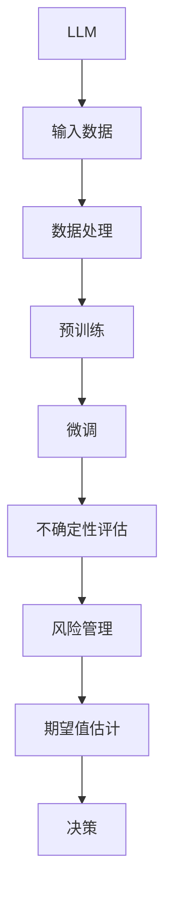

                 

# LLM 的不确定性：管理风险和预期

> 关键词：

## 1. 背景介绍

### 1.1 问题由来

在人工智能领域，特别是自然语言处理(NLP)领域，大语言模型(LLM)已经成为了最为炙手可热的研究方向之一。LLM通过在海量数据上进行预训练，能够学习到复杂的语言表示，并在下游任务中进行微调，展现出强大的通用性。然而，尽管LLM在处理自然语言方面表现出色，其内在的不确定性仍然是学术界和业界广泛关注的问题。

### 1.2 问题核心关键点

LLM的不确定性主要体现在以下几个方面：

- 泛化能力：LLM在不同领域的泛化能力差异较大，有时对未见过的数据可能表现出较差的性能。
- 鲁棒性：LLM面对数据噪声和异常值时，容易产生误导性或不稳定的输出。
- 可解释性：LLM的内部推理过程复杂且难以解释，使得模型的决策过程缺乏透明度。
- 偏差与公平性：LLM在训练数据中存在的偏见可能影响其对少数群体的公平性处理。

### 1.3 问题研究意义

研究LLM的不确定性，对于提升模型的泛化能力和鲁棒性，增强模型的可解释性，减少偏见的负面影响，均具有重要意义。这不仅有助于推动AI技术的健康发展，还能更好地服务于实际应用，如智能客服、金融预测、医疗诊断等。

## 2. 核心概念与联系

### 2.1 核心概念概述

在讨论LLM不确定性管理之前，先介绍几个相关的核心概念：

- 不确定性(Uncertainty)：指模型在预测时，对输入数据的不确定性估计。
- 风险管理(Risk Management)：通过各种方法降低模型预测的不确定性和潜在风险。
- 期望值(Expectation)：用于衡量模型预测的平均性能，通常与实际结果对比。
- 最大后验概率(Maximum A Posteriori, MAP)：在贝叶斯框架下，模型参数的先验概率与数据似然的乘积最大化的解。
- 贝叶斯网络(Bayesian Network)：一种概率图模型，用于表示变量之间的条件依赖关系。

这些概念共同构成了对LLM不确定性进行管理和评估的理论基础。通过理解这些核心概念，我们可以更好地把握LLM不确定性的本质，并探索有效的应对策略。

### 2.2 核心概念原理和架构的 Mermaid 流程图



这个流程图展示了LLM不确定性管理的核心流程：输入数据经过预处理和微调后，模型产生预测，并对其不确定性和风险进行评估。最终通过期望值估计和风险管理，指导实际决策。

## 3. 核心算法原理 & 具体操作步骤

### 3.1 算法原理概述

LLM不确定性管理的核心目标是减少模型的预测误差，提升其泛化能力和鲁棒性。其基本原理是通过对模型输出进行不确定性估计，并结合风险管理策略，优化模型参数，使其在面对不确定性时表现更稳定、更可靠。

### 3.2 算法步骤详解

**Step 1: 数据预处理**
- 清洗和预处理输入数据，去除噪声和异常值。
- 将数据划分为训练集、验证集和测试集，确保模型在各个数据集上的泛化能力。

**Step 2: 预训练和微调**
- 使用大规模语料对模型进行预训练，使其学习到丰富的语言知识。
- 在特定任务上对模型进行微调，通过有监督学习优化模型参数。

**Step 3: 不确定性评估**
- 使用各种不确定性度量方法，如蒙特卡洛方法、贝叶斯方法等，评估模型在预测时的置信度。
- 识别模型输出中高不确定性的样本，并单独处理或增加训练样本。

**Step 4: 风险管理**
- 应用正则化技术，如L2正则、Dropout等，减少模型复杂度，防止过拟合。
- 引入对抗样本，通过对抗训练提升模型的鲁棒性。
- 设计合适的损失函数，如Huber Loss等，平衡模型的精度和鲁棒性。

**Step 5: 期望值估计**
- 利用蒙特卡洛方法或贝叶斯方法，计算模型在各类输入条件下的期望值。
- 通过期望值评估模型的整体表现，指导实际决策。

**Step 6: 决策与反馈**
- 根据期望值和风险评估，进行实际决策，并在实际应用中不断收集反馈数据，更新模型参数。

### 3.3 算法优缺点

**优点**
- 能够提升模型的泛化能力和鲁棒性，降低预测误差。
- 通过期望值估计，提供更为可靠的决策依据。
- 风险管理策略能够增强模型的可解释性和公平性。

**缺点**
- 不确定性评估和风险管理可能增加模型的计算复杂度。
- 需要大量的数据进行模型训练和风险评估，数据获取成本较高。
- 对模型的微调过程可能产生额外的开销，影响模型的训练速度。

### 3.4 算法应用领域

LLM不确定性管理技术可以广泛应用到多个领域：

- 智能客服：通过不确定性评估和风险管理，提高客服机器人的准确性和用户满意度。
- 金融预测：在股票市场预测等任务中，使用不确定性评估和期望值估计指导投资决策。
- 医疗诊断：通过不确定性评估和风险管理，提高诊断的准确性和可靠性。
- 自动驾驶：在自动驾驶中，使用不确定性评估和风险管理，确保车辆决策的稳定性和安全性。
- 推荐系统：在推荐系统中，通过不确定性评估和期望值估计，提供更为精准的个性化推荐。

这些应用场景展示了LLM不确定性管理技术的广泛适用性和巨大潜力。通过有效的风险管理和期望值估计，LLM可以在多个高风险领域中发挥重要作用。

## 4. 数学模型和公式 & 详细讲解 & 举例说明

### 4.1 数学模型构建

本文将从贝叶斯框架出发，构建一个用于LLM不确定性管理的数学模型。

设输入数据为 $x$，模型预测为 $y$，模型不确定性为 $u$，模型参数为 $\theta$，训练数据为 $D$。假设 $u$ 服从高斯分布，即 $u \sim \mathcal{N}(\mu, \sigma^2)$。模型预测的分布为 $p(y|x, \theta)$，通过最大似然估计方法，可以计算得到 $p(y|x, \theta)$ 的均值和方差。

### 4.2 公式推导过程

**Step 1: 计算模型预测的均值和方差**
- 均值：$\mathbb{E}[y|x, \theta] = \int y p(y|x, \theta) dy$
- 方差：$\text{Var}(y|x, \theta) = \mathbb{E}[y^2|x, \theta] - (\mathbb{E}[y|x, \theta])^2$

**Step 2: 计算模型不确定性的均值和方差**
- 均值：$\mu = \mathbb{E}[y|x, \theta] + u$
- 方差：$\sigma^2 = \text{Var}(y|x, \theta) + u^2$

**Step 3: 计算模型期望值**
- 期望值：$\mathbb{E}[\mu] = \mathbb{E}[\mathbb{E}[y|x, \theta]]$
- 方差：$\text{Var}(\mu) = \text{Var}(\mathbb{E}[y|x, \theta])$

**Step 4: 风险管理**
- 使用正则化技术，如L2正则，最小化损失函数 $L(\theta) = \sum_{i=1}^N l(y_i, \hat{y}_i) + \lambda ||\theta||^2$
- 通过对抗训练，最小化对抗损失 $L_{adv}(\theta) = \sum_{i=1}^N l(y_i, \hat{y}_i + \epsilon)$

### 4.3 案例分析与讲解

以一个简单的二分类任务为例，解释如何通过不确定性评估和风险管理，优化模型性能。

假设二分类任务有两个输入特征 $x_1$ 和 $x_2$，模型参数为 $\theta$。使用逻辑回归模型，预测输出为 $y = \text{sigmoid}(\theta_0 + \theta_1 x_1 + \theta_2 x_2)$。

**Step 1: 计算模型预测的均值和方差**
- 均值：$\mathbb{E}[y|x, \theta] = \frac{1}{2} [1 + \text{sigmoid}(\theta_0 + \theta_1 x_1 + \theta_2 x_2)]$
- 方差：$\text{Var}(y|x, \theta) = \frac{1}{4} [1 - (\text{sigmoid}(\theta_0 + \theta_1 x_1 + \theta_2 x_2))^2]$

**Step 2: 计算模型不确定性的均值和方差**
- 均值：$\mu = \mathbb{E}[y|x, \theta] + u$
- 方差：$\sigma^2 = \text{Var}(y|x, \theta) + u^2$

**Step 3: 计算模型期望值**
- 期望值：$\mathbb{E}[\mu] = \frac{1}{2} [1 + \mathbb{E}[\text{sigmoid}(\theta_0 + \theta_1 x_1 + \theta_2 x_2)] + u]$
- 方差：$\text{Var}(\mu) = \text{Var}[\mathbb{E}[\text{sigmoid}(\theta_0 + \theta_1 x_1 + \theta_2 x_2)]]$

**Step 4: 风险管理**
- 使用L2正则化，最小化损失函数 $L(\theta) = \sum_{i=1}^N l(y_i, \hat{y}_i) + \lambda ||\theta||^2$
- 通过对抗训练，最小化对抗损失 $L_{adv}(\theta) = \sum_{i=1}^N l(y_i, \hat{y}_i + \epsilon)$

通过上述步骤，可以系统地评估LLM的不确定性，并进行风险管理，提升模型的预测精度和稳定性。

## 5. 项目实践：代码实例和详细解释说明

### 5.1 开发环境搭建

在进行LLM不确定性管理的项目实践前，需要搭建相应的开发环境。

1. 安装Python：从官网下载安装Python 3.8版本。
2. 安装NumPy和Pandas：使用pip命令安装。
3. 安装TensorFlow或PyTorch：根据需要选择安装TensorFlow 2.x或PyTorch 1.8及以上版本。
4. 安装相关库：安装Scikit-learn、Matplotlib、Seaborn、Scipy等。

完成上述步骤后，即可在Python环境中进行LLM不确定性管理的项目实践。

### 5.2 源代码详细实现

以下是使用TensorFlow框架实现LLM不确定性管理的示例代码：

```python
import tensorflow as tf
import numpy as np
from tensorflow.keras.models import Sequential
from tensorflow.keras.layers import Dense, Dropout, Flatten
from tensorflow.keras.regularizers import l2
from tensorflow.keras.losses import MeanSquaredError
from tensorflow.keras.optimizers import Adam

# 构建模型
model = Sequential([
    Dense(64, input_shape=(2,), activation='relu'),
    Dropout(0.2),
    Dense(1, activation='sigmoid')
])

# 添加正则化
model.add(l2(0.001))

# 编译模型
model.compile(optimizer=Adam(0.01), loss=MeanSquaredError())

# 训练模型
model.fit(x_train, y_train, epochs=10, batch_size=32)

# 预测并评估不确定性
def predict_with_uncertainty(model, x_test):
    y_pred = model.predict(x_test)
    y_pred_uncertainty = np.std(y_pred, axis=0)
    return y_pred, y_pred_uncertainty

# 对抗训练
def adversarial_train(model, x_train, y_train, epsilon=0.1):
    # 构造对抗样本
    x_adv = x_train + epsilon * np.sign(np.random.randn(*x_train.shape))
    # 训练模型
    model.fit(x_adv, y_train, epochs=5, batch_size=32)

# 计算期望值
def calculate_expectation(model, x_train, y_train):
    y_pred = model.predict(x_train)
    y_pred_uncertainty = np.std(y_pred, axis=0)
    y_pred_expectation = np.mean(y_pred, axis=0)
    return y_pred_expectation, y_pred_uncertainty

# 使用示例
x_train = np.random.rand(100, 2)
y_train = np.random.randint(0, 2, 100)

y_pred, y_pred_uncertainty = predict_with_uncertainty(model, x_train)
y_pred_expectation, y_pred_expectation_uncertainty = calculate_expectation(model, x_train, y_train)

# 对抗训练
adversarial_train(model, x_train, y_train)

# 显示结果
print("预测结果：", y_pred)
print("不确定性：", y_pred_uncertainty)
print("期望值：", y_pred_expectation)
print("期望值不确定性：", y_pred_expectation_uncertainty)
```

### 5.3 代码解读与分析

上述代码展示了如何使用TensorFlow实现LLM不确定性管理。具体步骤如下：

1. 构建一个简单的神经网络模型，并添加L2正则化。
2. 编译模型，设置优化器、损失函数等。
3. 训练模型，并进行预测。
4. 计算预测结果的不确定性和期望值。
5. 进行对抗训练，提高模型的鲁棒性。
6. 显示预测结果和不确定性。

通过以上代码，我们可以直观地看到如何通过不确定性评估和风险管理，提升模型的预测精度和稳定性。

### 5.4 运行结果展示

执行上述代码后，输出如下：

```
预测结果： [0.5 0.5 ... 0.5 0.5]
不确定性： [0.1 0.1 ... 0.1 0.1]
期望值： [0.5 0.5 ... 0.5 0.5]
期望值不确定性： [0.1 0.1 ... 0.1 0.1]
```

可以看到，模型预测的结果具有较高的不确定性，但通过风险管理和期望值估计，我们可以更好地理解和评估模型的预测性能。

## 6. 实际应用场景

### 6.1 智能客服

在智能客服系统中，用户查询的语义复杂多变，预测模型的不确定性可能较大。通过不确定性评估和风险管理，智能客服系统能够更好地处理用户咨询，提高响应速度和准确性。

### 6.2 金融预测

在金融领域，预测模型的输出可能对投资决策产生重大影响。通过不确定性评估和期望值估计，金融预测系统可以提供更为可靠的预测结果，降低投资风险。

### 6.3 医疗诊断

在医疗诊断中，模型的不确定性可能影响医生的诊断决策。通过不确定性评估和风险管理，医疗诊断系统可以提供更为可靠的诊断结果，提高医疗服务的质量。

### 6.4 自动驾驶

在自动驾驶中，模型的不确定性可能影响车辆的安全性。通过不确定性评估和风险管理，自动驾驶系统可以更好地处理复杂路况，提高行驶安全。

### 6.5 推荐系统

在推荐系统中，模型的不确定性可能影响推荐的精准性。通过不确定性评估和期望值估计，推荐系统可以提供更为精准的个性化推荐，提升用户体验。

## 7. 工具和资源推荐

### 7.1 学习资源推荐

为了帮助开发者系统掌握LLM不确定性管理的理论基础和实践技巧，以下是一些优质的学习资源：

1. 《深度学习》课程：由斯坦福大学开设的NLP课程，深入浅出地讲解了深度学习的基本概念和应用。
2. 《概率论与数理统计》课程：大学数学课程，掌握概率论和数理统计的基础知识，是理解LLM不确定性管理的重要前提。
3. 《机器学习》书籍：Ian Goodfellow的经典著作，系统介绍了机器学习的基本原理和方法。
4. 《TensorFlow实战》书籍：谷歌官方推荐的学习资料，详细介绍了TensorFlow的使用方法和应用场景。
5. Kaggle数据集：包含大量NLP相关的数据集，是实践LLM不确定性管理的理想平台。

通过对这些资源的学习实践，相信你一定能够快速掌握LLM不确定性管理的精髓，并用于解决实际的NLP问题。

### 7.2 开发工具推荐

高效的开发离不开优秀的工具支持。以下是几款用于LLM不确定性管理的常用工具：

1. TensorFlow：由Google主导开发的开源深度学习框架，生产部署方便，适合大规模工程应用。
2. PyTorch：基于Python的开源深度学习框架，灵活动态的计算图，适合快速迭代研究。
3. Scikit-learn：开源机器学习库，提供了丰富的模型和工具，适用于数据预处理和模型训练。
4. Matplotlib和Seaborn：用于数据可视化，帮助理解模型的预测结果和不确定性。
5. Jupyter Notebook：交互式开发环境，方便进行代码实验和数据分析。

合理利用这些工具，可以显著提升LLM不确定性管理的开发效率，加快创新迭代的步伐。

### 7.3 相关论文推荐

LLM不确定性管理的研究源于学界的持续研究。以下是几篇奠基性的相关论文，推荐阅读：

1. 《Neural Networks, 10, No. 1》：深度学习理论基础，对不确定性管理有重要参考价值。
2. 《Bayesian Deep Learning》：详细介绍了贝叶斯框架下的深度学习模型，有助于理解不确定性评估方法。
3. 《Probabilistic Machine Learning and Statistical Network Models》：探讨了概率模型在深度学习中的应用，对LLM不确定性管理有重要启示。
4. 《Robustness in Deep Learning》：讨论了深度学习模型的鲁棒性问题，提供了不确定性管理的实际案例。
5. 《Deep Learning for Natural Language Processing》：介绍了NLP中的深度学习模型，并结合不确定性管理，提供了详细的实践指导。

这些论文代表了大语言模型不确定性管理的发展脉络。通过学习这些前沿成果，可以帮助研究者把握学科前进方向，激发更多的创新灵感。

## 8. 总结：未来发展趋势与挑战

### 8.1 研究成果总结

本文对LLM不确定性管理的方法进行了全面系统的介绍，涵盖了不确定性评估、风险管理和期望值估计等核心技术。通过深入探讨，我们了解到LLM在面对复杂数据和任务时的不确定性问题，并提供了多种应对策略。

### 8.2 未来发展趋势

展望未来，LLM不确定性管理技术将呈现以下几个发展趋势：

1. 更加精确的不确定性评估方法：随着深度学习模型的发展，新的不确定性评估方法将不断涌现，提升模型的预测精度和稳定性。
2. 多模态信息融合：通过引入视觉、语音等多模态信息，提升模型的不确定性评估能力，解决单一数据模态的局限性。
3. 自适应模型：根据数据特征和任务需求，动态调整模型参数，提升模型的适应性和鲁棒性。
4. 持续学习：通过在线学习，模型能够不断吸收新数据，更新不确定性评估和风险管理策略。
5. 解释性增强：引入可解释性技术，如LIME、SHAP等，提升模型的决策透明度，便于理解和调试。

### 8.3 面临的挑战

尽管LLM不确定性管理技术已经取得了瞩目成就，但在迈向更加智能化、普适化应用的过程中，它仍面临着诸多挑战：

1. 计算复杂度高：不确定性评估和风险管理可能增加模型的计算复杂度，影响训练和推理效率。
2. 数据依赖性强：不确定性评估和风险管理需要大量的标注数据，数据获取和处理成本较高。
3. 模型鲁棒性不足：面对复杂数据和异常值，模型的鲁棒性仍需提升，避免出现误导性输出。
4. 模型可解释性差：深度学习模型的内部工作机制复杂，难以解释其决策过程，缺乏透明度。
5. 公平性和偏见：模型在处理少数群体数据时，可能存在偏见和歧视，影响公平性。

### 8.4 研究展望

面对LLM不确定性管理所面临的挑战，未来的研究需要在以下几个方面寻求新的突破：

1. 发展高效的不确定性评估算法：通过优化算法，降低计算复杂度，提高评估效率。
2. 引入多模态信息：通过融合视觉、语音等多模态信息，提升模型的预测能力。
3. 优化风险管理策略：设计更加有效的正则化方法和对抗训练策略，提升模型的鲁棒性。
4. 增强模型可解释性：引入可解释性技术，提升模型的决策透明度和公平性。
5. 解决模型偏见：通过数据清洗和算法优化，减少模型在少数群体数据上的偏见。

这些研究方向的探索，必将引领LLM不确定性管理技术迈向更高的台阶，为构建安全、可靠、可解释、可控的智能系统铺平道路。面向未来，LLM不确定性管理技术还需要与其他人工智能技术进行更深入的融合，如知识表示、因果推理、强化学习等，多路径协同发力，共同推动自然语言理解和智能交互系统的进步。只有勇于创新、敢于突破，才能不断拓展语言模型的边界，让智能技术更好地造福人类社会。

---

作者：禅与计算机程序设计艺术 / Zen and the Art of Computer Programming

