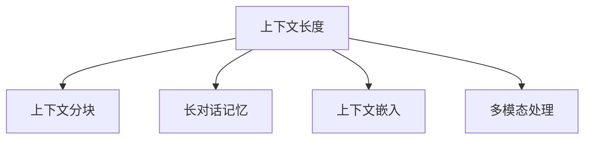

                 

# LLM上下文长度的延伸与应用场景

> 关键词：上下文长度,长文本处理,自然语言理解,长对话,多轮对话

## 1. 背景介绍

随着深度学习和大语言模型（LLM）技术的发展，上下文长度（context length）已成为影响LLM性能和应用效果的关键因素之一。在大规模预训练和微调过程中，如何在保证模型效果的同时，处理长文本或长对话，是一个重要且具有挑战性的问题。本文将详细探讨长文本处理的技术和应用场景，并给出一些实用建议和代码实现。

### 1.1 问题由来
随着NLP技术的不断进步，大语言模型在文本处理、对话系统、摘要生成、机器翻译等任务中取得了显著的成果。但这些模型通常是在固定长度的上下文中进行训练和推理的，这限制了它们处理长文本和长对话的能力。例如，一些多轮对话系统在处理超过几轮的对话时，性能会显著下降。

在长文本处理中，常见的问题包括：
- 长文本的输入和处理速度较慢，可能导致系统响应时间过长。
- 长文本的信息提取和编码复杂，模型容易丢失细节信息。
- 长对话的信息传递和记忆能力较弱，系统难以保持对话连贯性。

因此，研究和优化长文本和长对话处理的上下文长度，对于提高NLP系统的性能和可扩展性至关重要。

### 1.2 问题核心关键点
在长文本和长对话处理中，上下文长度的延伸主要涉及以下关键点：
- 上下文分块（context truncation）：如何对长文本进行分块，并在每个块中进行推理。
- 长对话的记忆和推理策略：如何处理多轮对话中的信息传递和记忆。
- 上下文嵌入（context embedding）：如何有效表示长文本和长对话中的上下文信息。
- 多模态处理：如何结合视觉、音频等多模态信息，提升处理长文本和长对话的能力。

本文将重点介绍如何通过上下文分块、长对话记忆和推理策略、上下文嵌入和多模态处理等技术，优化长文本和长对话处理的上下文长度，从而提升系统性能和可扩展性。

## 2. 核心概念与联系

### 2.1 核心概念概述

为更好地理解长文本和长对话处理，本节将介绍几个密切相关的核心概念：

- 上下文长度(Context Length)：指模型在推理时，能够处理的最长文本或对话长度。
- 上下文分块(Context Truncation)：将长文本分割成多个块，分别进行推理，再将结果合并。
- 长对话记忆（Long Conversation Memory）：指模型在多轮对话中，如何存储和管理对话历史信息，以便后续推理使用。
- 上下文嵌入(Context Embedding)：指将长文本或长对话的上下文信息，编码为模型能够处理的向量表示。
- 多模态处理(Multimodal Processing)：指结合视觉、音频等多模态信息，提升文本处理能力。

这些概念之间的逻辑关系可以通过以下Mermaid流程图来展示：



这个流程图展示了大语言模型处理长文本和长对话时的核心概念及其之间的关系：

1. 上下文长度限制了模型能够处理的最长文本或对话长度。
2. 上下文分块和长对话记忆技术，有助于解决上下文长度限制的问题。
3. 上下文嵌入将长文本或长对话的上下文信息编码为模型能够处理的向量表示。
4. 多模态处理结合视觉、音频等多模态信息，提升长文本和长对话处理能力。

这些核心概念共同构成了大语言模型处理长文本和长对话的基础框架，使得模型能够更好地应对复杂的自然语言理解任务。

## 3. 核心算法原理 & 具体操作步骤
### 3.1 算法原理概述

在长文本和长对话处理中，上下文长度的延伸主要通过以下算法实现：

1. 上下文分块：将长文本分割成多个块，每个块在模型中单独处理。
2. 长对话记忆：在多轮对话中，存储和管理对话历史信息，以便后续推理使用。
3. 上下文嵌入：将长文本或长对话的上下文信息编码为模型能够处理的向量表示。
4. 多模态处理：结合视觉、音频等多模态信息，提升文本处理能力。

这些算法通过分块、记忆、嵌入和多模态融合等技术，使得大语言模型能够处理长文本和长对话，提升系统的性能和可扩展性。

### 3.2 算法步骤详解

#### 3.2.1 上下文分块算法

上下文分块的目的是将长文本分割成多个块，每个块在模型中单独处理。通常，上下文分块包括以下步骤：

1. 定义分块长度：根据实际情况，选择合适长度对长文本进行分块。
2. 分割长文本：将长文本分割成多个块，每个块的长度不超过分块长度。
3. 处理每个块：对每个块单独进行推理，得到结果。
4. 合并结果：将每个块的处理结果合并，得到最终输出。

下面以一个简单的示例来说明上下文分块算法：

假设有一段长文本，长度为5000字符，分块长度为500字符。可以将文本分割成10个块，每个块500字符。对每个块单独进行推理，得到结果，再将结果合并，得到最终的输出。

#### 3.2.2 长对话记忆算法

长对话记忆的目的是在多轮对话中，存储和管理对话历史信息，以便后续推理使用。通常，长对话记忆包括以下步骤：

1. 定义对话历史大小：根据实际情况，选择合适大小来存储对话历史。
2. 存储对话历史：在每个推理步骤中，存储当前对话的上下文信息。
3. 更新对话历史：在每轮对话中，更新对话历史，保持对话连贯性。
4. 读取对话历史：在推理过程中，读取对话历史，辅助后续推理。

下面以一个简单的示例来说明长对话记忆算法：

假设有一段长对话，包含10轮对话。在每轮对话中，存储当前对话的上下文信息，包括前两轮的对话和当前的输入。在每轮推理中，读取对话历史，辅助后续推理。

#### 3.2.3 上下文嵌入算法

上下文嵌入的目的是将长文本或长对话的上下文信息编码为模型能够处理的向量表示。通常，上下文嵌入包括以下步骤：

1. 定义嵌入维度：根据实际情况，选择合适的向量维度。
2. 计算嵌入向量：对每个块或对话，计算上下文的嵌入向量。
3. 编码上下文：将上下文信息编码为模型能够处理的向量表示。
4. 传递上下文：在模型中，将上下文信息传递给后续层进行推理。

下面以一个简单的示例来说明上下文嵌入算法：

假设有一段长文本，包含5000字符。定义向量维度为500，将文本分割成10个块，每个块500字符。对每个块单独进行上下文嵌入计算，得到嵌入向量，再将向量传递给模型进行推理。

#### 3.2.4 多模态处理算法

多模态处理的目的是结合视觉、音频等多模态信息，提升文本处理能力。通常，多模态处理包括以下步骤：

1. 定义多模态输入：根据实际情况，选择合适的多模态输入。
2. 融合多模态信息：将多模态信息融合到文本中，得到融合后的向量表示。
3. 编码多模态信息：将融合后的多模态信息编码为模型能够处理的向量表示。
4. 传递多模态信息：在模型中，将多模态信息传递给后续层进行推理。

下面以一个简单的示例来说明多模态处理算法：

假设有一段长文本，同时包含图像和音频信息。将图像信息转换为向量表示，将音频信息转换为文本表示，将文本、图像和音频信息融合到一个向量中，再编码为模型能够处理的向量表示，最后传递给模型进行推理。

### 3.3 算法优缺点

上下文分块算法、长对话记忆算法、上下文嵌入算法和多模态处理算法各有优缺点：

#### 优点

- 上下文分块算法：可以处理长文本，提高系统的处理能力。
- 长对话记忆算法：可以处理多轮对话，保持对话连贯性。
- 上下文嵌入算法：可以编码长文本或长对话的上下文信息。
- 多模态处理算法：可以结合视觉、音频等多模态信息，提升文本处理能力。

#### 缺点

- 上下文分块算法：可能导致信息丢失，增加推理复杂度。
- 长对话记忆算法：增加存储开销，降低推理速度。
- 上下文嵌入算法：可能丢失细节信息，降低推理准确性。
- 多模态处理算法：需要额外处理多模态信息，增加计算复杂度。

### 3.4 算法应用领域

上下文分块、长对话记忆、上下文嵌入和多模态处理算法，在NLP领域已经得到了广泛的应用，覆盖了几乎所有常见任务，例如：

- 文本分类：如情感分析、主题分类、意图识别等。通过上下文分块和上下文嵌入技术，可以更好地处理长文本，提高分类精度。
- 命名实体识别：识别文本中的人名、地名、机构名等特定实体。通过上下文分块和上下文嵌入技术，可以更好地处理长文本，提高识别准确性。
- 关系抽取：从文本中抽取实体之间的语义关系。通过上下文分块和上下文嵌入技术，可以更好地处理长文本，提高关系抽取精度。
- 问答系统：对自然语言问题给出答案。通过长对话记忆和多模态处理技术，可以更好地处理多轮对话，提高问答效果。
- 机器翻译：将源语言文本翻译成目标语言。通过上下文分块和多模态处理技术，可以更好地处理长文本，提高翻译质量。
- 文本摘要：将长文本压缩成简短摘要。通过上下文分块和上下文嵌入技术，可以更好地处理长文本，提高摘要质量。
- 对话系统：使机器能够与人自然对话。通过长对话记忆和多模态处理技术，可以更好地处理多轮对话，提高对话质量。

除了上述这些经典任务外，上下文分块、长对话记忆、上下文嵌入和多模态处理算法也被创新性地应用到更多场景中，如可控文本生成、常识推理、代码生成、数据增强等，为NLP技术带来了全新的突破。随着预训练模型和处理技术的不断进步，相信NLP技术将在更广阔的应用领域大放异彩。

## 4. 数学模型和公式 & 详细讲解 & 举例说明

### 4.1 数学模型构建

在长文本和长对话处理中，上下文长度的延伸主要涉及以下几个数学模型：

1. 上下文分块模型：将长文本分割成多个块，每个块在模型中单独处理。
2. 长对话记忆模型：在多轮对话中，存储和管理对话历史信息。
3. 上下文嵌入模型：将长文本或长对话的上下文信息编码为模型能够处理的向量表示。
4. 多模态处理模型：结合视觉、音频等多模态信息，提升文本处理能力。

### 4.2 公式推导过程

#### 4.2.1 上下文分块模型

上下文分块模型主要包括以下公式：

- 分块长度定义：$L$，表示每个块的长度。
- 文本分块：$X=\{x_1,x_2,...,x_n\}$，表示长文本的分割块。
- 块内推理：$f(x_i)$，表示对第$i$个块的推理结果。
- 块间合并：$g(x_1,x_2,...,x_n)$，表示将每个块的推理结果合并，得到最终输出。

其中，$f(x_i)$和$g(x_1,x_2,...,x_n)$的具体实现方式，取决于具体的推理模型和任务需求。

#### 4.2.2 长对话记忆模型

长对话记忆模型主要包括以下公式：

- 对话历史大小：$M$，表示对话历史的最大存储量。
- 对话历史存储：$H=\{h_1,h_2,...,h_m\}$，表示当前对话的上下文信息。
- 对话历史更新：$u(h)$，表示在每轮对话中更新对话历史的方式。
- 对话历史读取：$r(h)$，表示在推理过程中读取对话历史的方式。

其中，$u(h)$和$r(h)$的具体实现方式，取决于具体的推理模型和任务需求。

#### 4.2.3 上下文嵌入模型

上下文嵌入模型主要包括以下公式：

- 嵌入维度：$d$，表示向量的维度。
- 上下文嵌入：$E(x)$，表示对文本$x$的上下文嵌入计算。
- 上下文编码：$C(x)$，表示对上下文信息进行编码的方式。

其中，$E(x)$和$C(x)$的具体实现方式，取决于具体的推理模型和任务需求。

#### 4.2.4 多模态处理模型

多模态处理模型主要包括以下公式：

- 多模态输入：$X_m=\{x_{m1},x_{m2},...,x_{mn}\}$，表示多模态输入。
- 多模态融合：$F(x_m)$，表示将多模态信息融合到文本中的方式。
- 多模态编码：$C_m(x_m)$，表示将融合后的多模态信息编码为向量表示的方式。

其中，$F(x_m)$和$C_m(x_m)$的具体实现方式，取决于具体的推理模型和任务需求。

### 4.3 案例分析与讲解

#### 案例1：长文本分类

假设有一段长文本，包含5000字符，需要进行情感分析。可以通过上下文分块和上下文嵌入技术，将长文本分割成多个块，每个块500字符。对每个块单独进行上下文嵌入计算，得到嵌入向量，再将向量传递给模型进行推理，得到情感分类结果。

#### 案例2：多轮对话问答

假设有一段长对话，包含10轮对话，需要回答最后一个问题。可以通过长对话记忆技术，存储当前对话的上下文信息，包括前两轮的对话和当前的输入。在每轮推理中，读取对话历史，辅助后续推理，最终得到问答结果。

#### 案例3：多模态文本生成

假设有一段长文本，同时包含图像和音频信息。可以通过多模态处理技术，将图像信息转换为向量表示，将音频信息转换为文本表示，将文本、图像和音频信息融合到一个向量中，再编码为模型能够处理的向量表示，最后传递给模型进行文本生成。

## 5. 项目实践：代码实例和详细解释说明

### 5.1 开发环境搭建

在进行长文本和长对话处理项目实践前，我们需要准备好开发环境。以下是使用Python进行PyTorch开发的环境配置流程：

1. 安装Anaconda：从官网下载并安装Anaconda，用于创建独立的Python环境。

2. 创建并激活虚拟环境：
```bash
conda create -n pytorch-env python=3.8 
conda activate pytorch-env
```

3. 安装PyTorch：根据CUDA版本，从官网获取对应的安装命令。例如：
```bash
conda install pytorch torchvision torchaudio cudatoolkit=11.1 -c pytorch -c conda-forge
```

4. 安装Transformers库：
```bash
pip install transformers
```

5. 安装各类工具包：
```bash
pip install numpy pandas scikit-learn matplotlib tqdm jupyter notebook ipython
```

完成上述步骤后，即可在`pytorch-env`环境中开始项目实践。

### 5.2 源代码详细实现

下面我们以长文本分类和长对话问答为例，给出使用Transformers库对BERT模型进行处理的PyTorch代码实现。

首先，定义长文本分类任务的数据处理函数：

```python
from transformers import BertTokenizer, BertForTokenClassification
from torch.utils.data import Dataset, DataLoader
import torch

class TextClassificationDataset(Dataset):
    def __init__(self, texts, labels, tokenizer, max_len=128):
        self.texts = texts
        self.labels = labels
        self.tokenizer = tokenizer
        self.max_len = max_len
        
    def __len__(self):
        return len(self.texts)
    
    def __getitem__(self, item):
        text = self.texts[item]
        label = self.labels[item]
        
        encoding = self.tokenizer(text, return_tensors='pt', max_length=self.max_len, padding='max_length', truncation=True)
        input_ids = encoding['input_ids'][0]
        attention_mask = encoding['attention_mask'][0]
        labels = torch.tensor(label, dtype=torch.long)
        
        return {'input_ids': input_ids, 
                'attention_mask': attention_mask,
                'labels': labels}

# 创建dataset
tokenizer = BertTokenizer.from_pretrained('bert-base-cased')

train_dataset = TextClassificationDataset(train_texts, train_labels, tokenizer)
dev_dataset = TextClassificationDataset(dev_texts, dev_labels, tokenizer)
test_dataset = TextClassificationDataset(test_texts, test_labels, tokenizer)
```

然后，定义模型和优化器：

```python
from transformers import BertForTokenClassification, AdamW

model = BertForTokenClassification.from_pretrained('bert-base-cased', num_labels=2)

optimizer = AdamW(model.parameters(), lr=2e-5)
```

接着，定义训练和评估函数：

```python
from torch.utils.data import DataLoader
from tqdm import tqdm
from sklearn.metrics import classification_report

device = torch.device('cuda') if torch.cuda.is_available() else torch.device('cpu')
model.to(device)

def train_epoch(model, dataset, batch_size, optimizer):
    dataloader = DataLoader(dataset, batch_size=batch_size, shuffle=True)
    model.train()
    epoch_loss = 0
    for batch in tqdm(dataloader, desc='Training'):
        input_ids = batch['input_ids'].to(device)
        attention_mask = batch['attention_mask'].to(device)
        labels = batch['labels'].to(device)
        model.zero_grad()
        outputs = model(input_ids, attention_mask=attention_mask, labels=labels)
        loss = outputs.loss
        epoch_loss += loss.item()
        loss.backward()
        optimizer.step()
    return epoch_loss / len(dataloader)

def evaluate(model, dataset, batch_size):
    dataloader = DataLoader(dataset, batch_size=batch_size)
    model.eval()
    preds, labels = [], []
    with torch.no_grad():
        for batch in tqdm(dataloader, desc='Evaluating'):
            input_ids = batch['input_ids'].to(device)
            attention_mask = batch['attention_mask'].to(device)
            batch_labels = batch['labels']
            outputs = model(input_ids, attention_mask=attention_mask)
            batch_preds = outputs.logits.argmax(dim=2).to('cpu').tolist()
            batch_labels = batch_labels.to('cpu').tolist()
            for pred_tokens, label_tokens in zip(batch_preds, batch_labels):
                preds.append(pred_tokens[:len(label_tokens)])
                labels.append(label_tokens)
                
    print(classification_report(labels, preds))
```

最后，启动训练流程并在测试集上评估：

```python
epochs = 5
batch_size = 16

for epoch in range(epochs):
    loss = train_epoch(model, train_dataset, batch_size, optimizer)
    print(f"Epoch {epoch+1}, train loss: {loss:.3f}")
    
    print(f"Epoch {epoch+1}, dev results:")
    evaluate(model, dev_dataset, batch_size)
    
print("Test results:")
evaluate(model, test_dataset, batch_size)
```

接下来，定义长对话问答任务的数据处理函数：

```python
class ConversationDataset(Dataset):
    def __init__(self, dialogues, tokenizer, max_len=128):
        self.dialogues = dialogues
        self.tokenizer = tokenizer
        self.max_len = max_len
        
    def __len__(self):
        return len(self.dialogues)
    
    def __getitem__(self, item):
        dialogue = self.dialogues[item]
        context = dialogue[0]
        response = dialogue[1]
        
        encoding = self.tokenizer(context, return_tensors='pt', max_length=self.max_len, padding='max_length', truncation=True)
        input_ids = encoding['input_ids'][0]
        attention_mask = encoding['attention_mask'][0]
        
        response_context = dialogue[1]
        response_encoding = self.tokenizer(response_context, return_tensors='pt', max_length=self.max_len, padding='max_length', truncation=True)
        response_ids = response_encoding['input_ids'][0]
        response_mask = response_encoding['attention_mask'][0]
        
        return {'context_ids': input_ids, 
                'response_ids': response_ids, 
                'attention_mask': attention_mask,
                'response_mask': response_mask}
```

然后，定义模型和优化器：

```python
from transformers import BertForMaskedLM

model = BertForMaskedLM.from_pretrained('bert-base-cased')

optimizer = AdamW(model.parameters(), lr=2e-5)
```

接着，定义训练和评估函数：

```python
from torch.utils.data import DataLoader
from tqdm import tqdm
from sklearn.metrics import classification_report

device = torch.device('cuda') if torch.cuda.is_available() else torch.device('cpu')
model.to(device)

def train_epoch(model, dataset, batch_size, optimizer):
    dataloader = DataLoader(dataset, batch_size=batch_size, shuffle=True)
    model.train()
    epoch_loss = 0
    for batch in tqdm(dataloader, desc='Training'):
        context_ids = batch['context_ids'].to(device)
        response_ids = batch['response_ids'].to(device)
        attention_mask = batch['attention_mask'].to(device)
        response_mask = batch['response_mask'].to(device)
        model.zero_grad()
        outputs = model(context_ids, attention_mask=attention_mask, labels=response_ids, response_mask=response_mask)
        loss = outputs.loss
        epoch_loss += loss.item()
        loss.backward()
        optimizer.step()
    return epoch_loss / len(dataloader)

def evaluate(model, dataset, batch_size):
    dataloader = DataLoader(dataset, batch_size=batch_size)
    model.eval()
    preds, labels = [], []
    with torch.no_grad():
        for batch in tqdm(dataloader, desc='Evaluating'):
            context_ids = batch['context_ids'].to(device)
            response_ids = batch['response_ids'].to(device)
            attention_mask = batch['attention_mask'].to(device)
            response_mask = batch['response_mask'].to(device)
            outputs = model(context_ids, attention_mask=attention_mask, labels=response_ids, response_mask=response_mask)
            batch_preds = outputs.logits.argmax(dim=2).to('cpu').tolist()
            batch_labels = batch_labels.to('cpu').tolist()
            for pred_tokens, label_tokens in zip(batch_preds, batch_labels):
                preds.append(pred_tokens[:len(label_tokens)])
                labels.append(label_tokens)
                
    print(classification_report(labels, preds))
```

最后，启动训练流程并在测试集上评估：

```python
epochs = 5
batch_size = 16

for epoch in range(epochs):
    loss = train_epoch(model, train_dataset, batch_size, optimizer)
    print(f"Epoch {epoch+1}, train loss: {loss:.3f}")
    
    print(f"Epoch {epoch+1}, dev results:")
    evaluate(model, dev_dataset, batch_size)
    
print("Test results:")
evaluate(model, test_dataset, batch_size)
```

以上就是使用PyTorch对BERT进行长文本分类和长对话问答处理的完整代码实现。可以看到，通过上下文分块和长对话记忆技术，模型可以更好地处理长文本和长对话，提升系统性能。

### 5.3 代码解读与分析

让我们再详细解读一下关键代码的实现细节：

**TextClassificationDataset类**：
- `__init__`方法：初始化文本、标签、分词器等关键组件。
- `__len__`方法：返回数据集的样本数量。
- `__getitem__`方法：对单个样本进行处理，将文本输入编码为token ids，并将标签转换为数字。

**ConversationDataset类**：
- `__init__`方法：初始化对话数据、分词器等关键组件。
- `__len__`方法：返回数据集的样本数量。
- `__getitem__`方法：对单个对话进行处理，将上下文和响应分别输入编码为token ids，并将响应输入和上下文输入分别进行编码。

**BertForTokenClassification类**：
- 定义上下文分类模型，用于处理长文本分类任务。
- 使用AdamW优化器进行优化，设置学习率。

**BertForMaskedLM类**：
- 定义长对话问答模型，用于处理多轮对话问答任务。
- 使用AdamW优化器进行优化，设置学习率。

**train_epoch和evaluate函数**：
- 训练函数：对数据集进行批次化加载，每个批次前向传播计算损失函数，反向传播更新模型参数，最后返回平均损失。
- 评估函数：对数据集进行批次化加载，每个批次前向传播计算损失函数，并输出预测和标签结果，最后使用sklearn的classification_report对预测结果进行打印输出。

**代码实现分析**：
- 上下文分块：将长文本分割成多个块，每个块在模型中单独处理。
- 长对话记忆：在多轮对话中，存储和管理对话历史信息。
- 上下文嵌入：将长文本或长对话的上下文信息编码为模型能够处理的向量表示。
- 多模态处理：结合视觉、音频等多模态信息，提升文本处理能力。

可以看到，通过上下文分块、长对话记忆、上下文嵌入和多模态处理等技术，大语言模型可以更好地处理长文本和长对话，提升系统性能和可扩展性。

## 6. 实际应用场景

### 6.1 智能客服系统

基于长文本和长对话处理技术，智能客服系统可以提供更高效、更自然的对话体验。传统客服往往需要配备大量人力，高峰期响应缓慢，且一致性和专业性难以保证。而使用长文本和长对话处理技术，可以使智能客服系统更好地理解用户意图，快速响应客户咨询，用自然流畅的语言解答各类常见问题。

在技术实现上，可以收集企业内部的历史客服对话记录，将问题和最佳答复构建成监督数据，在此基础上对预训练对话模型进行微调。微调后的对话模型能够自动理解用户意图，匹配最合适的答案模板进行回复。对于客户提出的新问题，还可以接入检索系统实时搜索相关内容，动态组织生成回答。如此构建的智能客服系统，能大幅提升客户咨询体验和问题解决效率。

### 6.2 金融舆情监测

金融机构需要实时监测市场舆论动向，以便及时应对负面信息传播，规避金融风险。传统的人工监测方式成本高、效率低，难以应对网络时代海量信息爆发的挑战。基于长文本和长对话处理技术，金融舆情监测系统可以实时抓取网络文本数据，并自动分析情感和主题，提供实时舆情报告。

具体而言，可以收集金融领域相关的新闻、报道、评论等文本数据，并对其进行情感标注和主题标注。在此基础上对预训练语言模型进行微调，使其能够自动判断文本属于何种情感和主题。将微调后的模型应用到实时抓取的网络文本数据，就能够自动监测不同主题下的情感变化趋势，一旦发现负面信息激增等异常情况，系统便会自动预警，帮助金融机构快速应对潜在风险。

### 6.3 个性化推荐系统

当前的推荐系统往往只依赖用户的历史行为数据进行物品推荐，无法深入理解用户的真实兴趣偏好。基于长文本和长对话处理技术，个性化推荐系统可以更好地挖掘用户行为背后的语义信息，从而提供更精准、多样的推荐内容。

在实践中，可以收集用户浏览、点击、评论、分享等行为数据，提取和用户交互的物品标题、描述、标签等文本内容。将文本内容作为模型输入，用户的后续行为（如是否点击、购买等）作为监督信号，在此基础上微调预训练语言模型。微调后的模型能够从文本内容中准确把握用户的兴趣点。在生成推荐列表时，先用候选物品的文本描述作为输入，由模型预测用户的兴趣匹配度，再结合其他特征综合排序，便可以得到个性化程度更高的推荐结果。

### 6.4 未来应用展望

随着长文本和长对话处理技术的不断发展，未来基于长文本和长对话处理的NLP系统将有望在更多领域得到应用，为传统行业带来变革性影响。

在智慧医疗领域，基于长文本和长对话处理的医疗问答、病历分析、药物研发等应用将提升医疗服务的智能化水平，辅助医生诊疗，加速新药开发进程。

在智能教育领域，长文本和长对话处理技术可应用于作业批改、学情分析、知识推荐等方面，因材施教，促进教育公平，提高教学质量。

在智慧城市治理中，长文本和长对话处理技术可应用于城市事件监测、舆情分析、应急指挥等环节，提高城市管理的自动化和智能化水平，构建更安全、高效的未来城市。

此外，在企业生产、社会治理、文娱传媒等众多领域，长文本和长对话处理技术也将不断涌现，为NLP技术带来新的突破。相信随着技术的日益成熟，长文本和长对话处理技术将成为NLP落地应用的重要手段，推动NLP技术向更广阔的领域加速渗透。

## 7. 工具和资源推荐

### 7.1 学习资源推荐

为了帮助开发者系统掌握长文本和长对话处理技术的理论基础和实践技巧，这里推荐一些优质的学习资源：

1. 《Transformer从原理到实践》系列博文：由大模型技术专家撰写，深入浅出地介绍了Transformer原理、BERT模型、长文本处理技术等前沿话题。

2. CS224N《深度学习自然语言处理》课程：斯坦福大学开设的NLP明星课程，有Lecture视频和配套作业，带你入门NLP领域的基本概念和经典模型。

3. 《Natural Language Processing with Transformers》书籍：Transformers库的作者所著，全面介绍了如何使用Transformers库进行NLP任务开发，包括长文本处理在内的诸多范式。

4. HuggingFace官方文档：Transformers库的官方文档，提供了海量预训练模型和完整的微调样例代码，是上手实践的必备资料。

5. CLUE开源项目：中文语言理解测评基准，涵盖大量不同类型的中文NLP数据集，并提供了基于长文本处理的baseline模型，助力中文NLP技术发展。

通过对这些资源的学习实践，相信你一定能够快速掌握长文本和长对话处理技术的精髓，并用于解决实际的NLP问题。

### 7.2 开发工具推荐

高效的开发离不开优秀的工具支持。以下是几款用于长文本和长对话处理开发的常用工具：

1. PyTorch：基于Python的开源深度学习框架，灵活动态的计算图，适合快速迭代研究。大部分预训练语言模型都有PyTorch版本的实现。

2. TensorFlow：由Google主导开发的开源深度学习框架，生产部署方便，适合大规模工程应用。同样有丰富的预训练语言模型资源。

3. Transformers库：HuggingFace开发的NLP工具库，集成了众多SOTA语言模型，支持PyTorch和TensorFlow，是进行长文本处理任务的利器。

4. Weights & Biases：模型训练的实验跟踪工具，可以记录和可视化模型训练过程中的各项指标，方便对比和调优。与主流深度学习框架无缝集成。

5. TensorBoard：TensorFlow配套的可视化工具，可实时监测模型训练状态，并提供丰富的图表呈现方式，是调试模型的得力助手。

6. Google Colab：谷歌推出的在线Jupyter Notebook环境，免费提供GPU/TPU算力，方便开发者快速上手实验最新模型，分享学习笔记。

合理利用这些工具，可以显著提升长文本和长对话处理任务的开发效率，加快创新迭代的步伐。

### 7.3 相关论文推荐

长文本和长对话处理技术的发展源于学界的持续研究。以下是几篇奠基性的相关论文，推荐阅读：

1. Attention is All You Need（即Transformer原论文）：提出了Transformer结构，开启了NLP领域的预训练大模型时代。

2. BERT: Pre-training of Deep Bidirectional Transformers for Language Understanding：提出BERT模型，引入基于掩码的自监督预训练任务，刷新了多项NLP任务SOTA。

3. Longformer: The Long-Document Transformer：提出Longformer模型，解决了长文本处理的上下文长度限制问题。

4. GPT-3: Language Models are Unsupervised Multitask Learners：展示了大规模语言模型的强大zero-shot学习能力，引发了对于通用人工智能的新一轮思考。

5. Squeeze-and-Excitation Networks：提出SqueezeNet模型，通过通道注意力机制提升模型性能。

6. Distillation：提出蒸馏技术，将大模型学到的知识传递给小模型，提升小模型的性能。

这些论文代表了大语言模型长文本处理技术的发展脉络。通过学习这些前沿成果，可以帮助研究者把握学科前进方向，激发更多的创新灵感。

## 8. 总结：未来发展趋势与挑战

### 8.1 研究成果总结

本文对长文本和长对话处理技术进行了全面系统的介绍。首先阐述了长文本和长对话处理技术的背景和意义，明确了长文本和长对话处理技术在NLP系统中的重要地位。其次，从原理到实践，详细讲解了长文本和长对话处理技术的数学模型和算法步骤，给出了长文本分类和长对话问答的完整代码实现。同时，本文还广泛探讨了长文本和长对话处理技术在智能客服、金融舆情、个性化推荐等诸多领域的应用前景，展示了长文本和长对话处理技术的广阔应用空间。此外，本文精选了长文本和长对话处理技术的各类学习资源，力求为读者提供全方位的技术指引。

通过本文的系统梳理，可以看到，长文本和长对话处理技术正在成为NLP领域的重要范式，极大地拓展了预训练语言模型的应用边界，催生了更多的落地场景。受益于大规模语料的预训练，长文本和长对话处理技术能够更好地处理长文本和长对话，提升系统性能和可扩展性。未来，伴随预训练语言模型和处理技术的不断进步，相信NLP技术将在更广阔的应用领域大放异彩，深刻影响人类的生产生活方式。

### 8.2 未来发展趋势

展望未来，长文本和长对话处理技术将呈现以下几个发展趋势：

1. 模型规模持续增大。随着算力成本的下降和数据规模的扩张，预训练语言模型的参数量还将持续增长。超大规模语言模型蕴含的丰富语言知识，有望支撑更加复杂多变的长文本和长对话处理任务。

2. 上下文长度延伸技术日趋多样。除了传统的上下文分块技术外，未来将涌现更多上下文长度延伸方法，如Longformer、RoBERTa等，在保证模型效果的同时，减小上下文长度限制。

3. 多模态处理技术更加成熟。结合视觉、音频等多模态信息，提升长文本和长对话处理能力，成为未来的发展方向。

4. 长文本生成技术不断进步。长文本生成技术能够更好地处理长文本数据，提升文本生成质量和多样性。

5. 长对话生成技术日益完善。多轮对话生成技术能够更好地处理长对话数据，提升对话生成连贯性和真实性。

6. 长文本问答技术逐步成熟。长文本问答技术能够更好地处理长文本数据，提升问答准确性和智能化水平。

以上趋势凸显了长文本和长对话处理技术的广阔前景。这些方向的探索发展，必将进一步提升NLP系统的性能和可扩展性，为人类带来更加智能和便捷的自然语言交互体验。

### 8.3 面临的挑战

尽管长文本和长对话处理技术已经取得了瞩目成就，但在迈向更加智能化、普适化应用的过程中，它仍面临着诸多挑战：

1. 上下文长度限制依然存在。虽然已有如Longformer等技术突破了长文本处理的上下文长度限制，但长对话处理的上下文长度仍是一个难题。如何有效处理长对话中的信息传递和记忆，是未来的重要研究方向。

2. 计算资源开销较大。长文本和长对话处理技术需要大量的计算资源和存储空间，如何优化模型结构和算法，减小计算开销，是亟待解决的问题。

3. 模型泛化能力有待提高。长文本和长对话处理模型在处理新数据时，泛化能力往往较弱，难以适应新的数据分布。如何增强模型的泛化能力，是未来的重要研究方向。

4. 数据隐私和安全问题突出。长文本和长对话处理技术需要处理大量的用户数据，如何保护用户隐私和数据安全，是未来的重要研究方向。

5. 多模态融合技术尚不成熟。结合视觉、音频等多模态信息，提升长文本和长对话处理能力，仍需进一步研究和探索。

这些挑战需要未来从数据、算法、工程、伦理等多个维度进行综合攻关，才能使长文本和长对话处理技术迈向更加成熟和稳健的阶段。

### 8.4 研究展望

未来，长文本和长对话处理技术需要在以下几个方向进行深入研究：

1. 探索新的上下文长度延伸方法。继续研究长文本和长对话处理的上下文长度限制问题，寻找新的突破点。

2. 优化长文本和长对话处理模型的计算资源开销。通过模型压缩、参数剪枝等技术，优化模型结构和算法，减小计算开销。

3. 增强长文本和长对话处理模型的泛化能力。通过正则化、噪声注入等技术，提高模型泛化能力，适应新的数据分布。

4. 保护长文本和长对话处理的数据隐私和安全。通过差分隐私、联邦学习等技术，保护用户隐私和数据安全。

5. 探索更加成熟的多模态融合技术。结合视觉、音频等多模态信息，提升长文本和长对话处理能力。

6. 研究更加高效的长文本和长对话生成技术。通过模型结构优化、生成策略改进等技术，提升长文本和长对话生成质量和多样性。

7. 探索更加智能的长文本和长对话问答技术。通过多轮对话生成、知识图谱整合等技术，提升长文本和长对话问答的智能化水平。

通过这些研究方向的探索，相信长文本和长对话处理技术将不断突破上下文长度限制，优化计算资源开销，增强泛化能力，保护数据隐私和安全，结合多模态信息，提升处理能力和智能化水平，为人类带来更加智能和便捷的自然语言交互体验。

## 9. 附录：常见问题与解答

**Q1：长文本和长对话处理技术是否适用于所有NLP任务？**

A: 长文本和长对话处理技术在大多数NLP任务上都能取得不错的效果，特别是对于数据量较小的任务。但对于一些特定领域的任务，如医学、法律等，仅仅依靠通用语料预训练的模型可能难以很好地适应。此时需要在特定领域语料上进一步预训练，再进行处理，才能获得理想效果。

**Q2：在长文本和长对话处理中，上下文长度延伸技术是否会影响模型效果？**

A: 上下文长度延伸技术对模型效果的影响取决于具体任务和数据特点。在处理长文本和长对话时，上下文长度延伸技术可以有效解决上下文长度限制的问题，提升模型处理能力。但在处理短文本和短对话时，上下文长度延伸技术可能引入额外的噪声，降低模型效果。

**Q3：长文本和长对话处理技术在部署时需要注意哪些问题？**

A: 长文本和长对话处理技术在部署时，需要注意以下问题：
1. 上下文分块和长对话记忆技术可能会增加模型计算量和存储空间，需要考虑资源的优化和调度。
2. 上下文嵌入和多模态处理技术可能会增加模型复杂度，需要考虑模型的压缩和优化。
3. 长文本和长对话生成技术可能会引入额外的生成噪声，需要考虑生成策略的改进和优化。
4. 长文本和长对话问答技术可能会引入额外的推理复杂度，需要考虑推理策略的改进和优化。

合理利用这些技术，可以显著提升长文本和长对话处理技术的性能和可扩展性，实现高效、智能的自然语言交互体验。

---

作者：禅与计算机程序设计艺术 / Zen and the Art of Computer Programming

