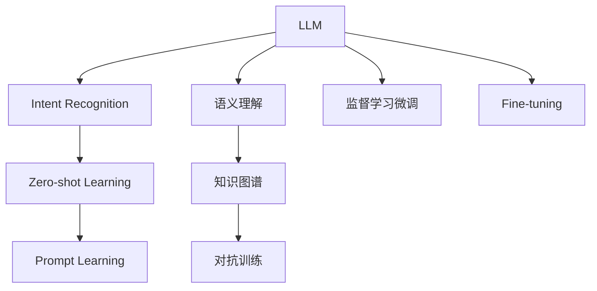

                 

# LLM与人类意图的最优契合探索

> 关键词：

---

## 1. 背景介绍

### 1.1 问题由来
语言模型（Language Model, LM）是人类处理语言信息的核心机制之一。在过去几年里，基于深度学习的大规模语言模型（Large Language Model, LLM）快速发展，如BERT、GPT-3、T5等，这些模型通过自监督学习在大量无标签文本数据上进行预训练，获得了惊人的语言理解和生成能力。

大语言模型在自然语言处理（Natural Language Processing, NLP）的诸多应用上已经取得了显著的成果，但这些模型依旧存在一些不足。例如，在大规模的文本数据训练下，模型可能会学习到一些有害或偏见性的知识，导致其输出不够可靠、可信，尤其是在面对复杂、多义的语境时，模型往往无法精准捕捉人类意图。

### 1.2 问题核心关键点
为了解决这个问题，我们引入了一个新的研究方向，即探索和优化大语言模型（LLM）与人类意图的最优契合。我们旨在利用LLM的强大能力和丰富的语料知识，使其能够更加精准、可靠地理解并生成人类意图，从而提升NLP应用的实用性和安全性。

### 1.3 问题研究意义
大语言模型与人类意图的最优契合探索具有重要意义：

1. **提升应用精准度**：精准捕捉用户意图，减少误判，提升用户体验。
2. **增强可信度**：通过优化模型输出，降低有害、偏见信息的生成，增强系统可信度。
3. **保障公平性**：利用公平性约束，减少模型偏见，确保应用在不同群体上的公平性。
4. **推动产业升级**：助力NLP应用落地，如智能客服、智能搜索、智能医疗等，加速产业数字化转型。

---

## 2. 核心概念与联系

### 2.1 核心概念概述

为更好地理解LLM与人类意图的最优契合探索，本节将介绍几个关键概念：

- **大语言模型（LLM）**：如BERT、GPT-3、T5等大规模预训练语言模型，通过自监督学习在无标签数据上预训练，具备强大的语言理解和生成能力。
- **意图识别（Intent Recognition）**：识别用户输入的自然语言，理解其背后的意图，是智能对话、智能推荐等应用的基础。
- **语义理解（Semantic Understanding）**：在语义层面理解输入文本的意义，涵盖实体识别、关系抽取、情感分析等多方面。
- **知识图谱（Knowledge Graph）**：结构化的知识库，用于支撑语义理解的正确性和泛化性。
- **对抗训练（Adversarial Training）**：通过引入对抗样本训练模型，增强其鲁棒性，防止模型过拟合。
- **零样本学习（Zero-shot Learning）**：模型在未见过的任务上，仅通过任务描述就能进行推理生成，提升模型的泛化能力。

这些核心概念之间的逻辑关系可以通过以下Mermaid流程图来展示：



---

## 3. 核心算法原理 & 具体操作步骤

### 3.1 算法原理概述

实现LLM与人类意图的最优契合，核心在于提升模型的语义理解和意图识别能力，使得模型能够更加准确地理解和生成人类意图。我们通常采用以下策略：

1. **意图识别**：通过微调LSTM、BERT等模型，使其能够从输入文本中提取出意图，例如分类、匹配、生成等。
2. **语义理解**：使用BERT、GPT等模型，通过任务适配层实现特定语义任务的微调，如命名实体识别、关系抽取等。
3. **对抗训练**：通过对抗样本训练模型，提升模型鲁棒性和泛化能力。
4. **知识图谱融合**：利用知识图谱补充模型训练数据，增强模型的泛化能力和准确性。
5. **零样本学习**：通过提示学习，模型能够在未见过的任务上，仅通过任务描述进行推理生成。

### 3.2 算法步骤详解

**Step 1: 数据准备**
- 收集和整理语料数据，确保数据的多样性和真实性。
- 对数据进行标注，如意图分类、实体识别、关系抽取等。
- 构建训练集、验证集和测试集，确保数据划分合理。

**Step 2: 模型选择与初始化**
- 选择合适的LLM模型，如BERT、GPT-3、T5等。
- 加载预训练模型，初始化模型参数。

**Step 3: 任务适配与微调**
- 设计任务适配层，例如分类、匹配、生成等。
- 使用监督学习进行微调，最小化任务损失。
- 使用对抗训练增强模型鲁棒性，防止过拟合。
- 融合知识图谱数据，增强语义理解能力。

**Step 4: 性能评估**
- 在验证集上评估模型性能，进行超参数调优。
- 在测试集上评估模型泛化能力，确保模型可靠性。
- 收集用户反馈，进行模型的迭代优化。

### 3.3 算法优缺点

实现LLM与人类意图的最优契合的策略具有以下优点：
1. **精度高**：通过优化意图识别和语义理解能力，提高模型输出的准确性和可信度。
2. **泛化能力强**：通过融合知识图谱和对抗训练，增强模型泛化能力，提升模型的应用范围和可靠性。
3. **灵活性强**：通过零样本学习和提示学习，降低任务适配难度，提升模型可移植性。

但同时，这些策略也存在一定的局限性：
1. **训练成本高**：需要大量高质量标注数据和计算资源，训练成本较高。
2. **模型复杂度高**：模型参数量较大，推理速度较慢。
3. **数据依赖性高**：模型训练效果高度依赖于数据质量，数据偏见可能导致模型输出偏差。
4. **可解释性不足**：深度学习模型的黑盒特性，使得模型的推理过程难以解释，影响用户信任度。

---

## 4. 数学模型和公式 & 详细讲解 & 举例说明

### 4.1 数学模型构建

本节将使用数学语言对LLM与人类意图的最优契合探索过程进行更加严格的刻画。

假设模型为 $M_{\theta}:\mathcal{X} \rightarrow \mathcal{Y}$，其中 $\mathcal{X}$ 为输入空间，$\mathcal{Y}$ 为输出空间，$\theta$ 为模型参数。假设我们关注的任务为意图识别，即 $\mathcal{Y}=\{1, 2, \cdots, C\}$，其中 $C$ 为意图类别数。

定义模型 $M_{\theta}$ 在输入 $x$ 上的损失函数为 $\ell(M_{\theta}(x),y)$，则在数据集 $D=\{(x_i,y_i)\}_{i=1}^N$ 上的经验风险为：

$$
\mathcal{L}(\theta) = \frac{1}{N} \sum_{i=1}^N \ell(M_{\theta}(x_i),y_i)
$$

其中 $\ell$ 为意图分类任务的损失函数，如交叉熵损失。

### 4.2 公式推导过程

以下我们以意图分类任务为例，推导交叉熵损失函数及其梯度的计算公式。

假设模型 $M_{\theta}$ 在输入 $x$ 上的输出为 $\hat{y}=M_{\theta}(x)$，表示样本属于某一意图的概率。真实标签 $y \in \{1, 2, \cdots, C\}$。则二分类交叉熵损失函数定义为：

$$
\ell(M_{\theta}(x),y) = -y \log M_{\theta}(x) + (1-y) \log (1-M_{\theta}(x))
$$

将其代入经验风险公式，得：

$$
\mathcal{L}(\theta) = -\frac{1}{N}\sum_{i=1}^N [y_i \log M_{\theta}(x_i)+(1-y_i)\log(1-M_{\theta}(x_i))]
$$

根据链式法则，损失函数对参数 $\theta_k$ 的梯度为：

$$
\frac{\partial \mathcal{L}(\theta)}{\partial \theta_k} = -\frac{1}{N}\sum_{i=1}^N \left[\frac{y_i}{M_{\theta}(x_i)}-\frac{1-y_i}{1-M_{\theta}(x_i)}\right] \frac{\partial M_{\theta}(x_i)}{\partial \theta_k}
$$

其中 $\frac{\partial M_{\theta}(x_i)}{\partial \theta_k}$ 可进一步递归展开，利用自动微分技术完成计算。

### 4.3 案例分析与讲解

以下我们通过一个简单的例子，展示如何使用LLM与人类意图的最优契合策略。

假设我们有一个客服系统，用户输入："我想查询一下天气预报"。系统首先需要识别用户意图，然后根据意图进行具体处理，如查询天气预报或故障报修等。

首先，我们需要构建意图识别数据集，包含意图分类和实体识别等标注信息。然后，选择BERT作为基础模型，通过微调模型学习意图分类任务。最后，利用知识图谱数据对模型进行进一步的训练和优化，提升模型泛化能力和语义理解能力。

训练完毕后，系统在面对新用户输入时，首先通过BERT模型进行语义理解，然后利用意图分类器确定用户意图，最后通过知识图谱数据提供精准的响应。

---

## 5. 项目实践：代码实例和详细解释说明

### 5.1 开发环境搭建

在进行LLM与人类意图的最优契合探索实践前，我们需要准备好开发环境。以下是使用Python进行TensorFlow开发的环境配置流程：

1. 安装Anaconda：从官网下载并安装Anaconda，用于创建独立的Python环境。

2. 创建并激活虚拟环境：
```bash
conda create -n tf-env python=3.8 
conda activate tf-env
```

3. 安装TensorFlow：根据CUDA版本，从官网获取对应的安装命令。例如：
```bash
pip install tensorflow
```

4. 安装各类工具包：
```bash
pip install numpy pandas scikit-learn matplotlib tqdm jupyter notebook ipython
```

完成上述步骤后，即可在`tf-env`环境中开始项目实践。

### 5.2 源代码详细实现

这里以BERT模型为例，展示意图识别任务的处理过程。

首先，定义数据集：

```python
from transformers import BertTokenizer
from tensorflow.keras.datasets import imdb

# 构建数据集
tokenizer = BertTokenizer.from_pretrained('bert-base-uncased')
(x_train, y_train), (x_test, y_test) = imdb.load_data(num_words=10000)
x_train = [tokenizer.encode(text) for text in x_train]
x_test = [tokenizer.encode(text) for text in x_test]
```

然后，定义模型：

```python
from transformers import BertForSequenceClassification

# 构建模型
model = BertForSequenceClassification.from_pretrained('bert-base-uncased', num_labels=2)
```

接着，定义训练和评估函数：

```python
from tensorflow.keras.preprocessing.sequence import pad_sequences

def pad_sequences(x, maxlen):
    x = pad_sequences(x, maxlen=maxlen, padding='post', truncating='post')
    return x

def train_epoch(model, dataset, batch_size, optimizer):
    for batch in dataset:
        inputs, labels = batch
        inputs = pad_sequences(inputs, maxlen=128)
        labels = tf.convert_to_tensor(labels)
        with tf.GradientTape() as tape:
            outputs = model(inputs)
            loss = tf.keras.losses.sparse_categorical_crossentropy(labels, outputs)
        grads = tape.gradient(loss, model.trainable_variables)
        optimizer.apply_gradients(zip(grads, model.trainable_variables))

def evaluate(model, dataset, batch_size):
    total_loss = 0
    for batch in dataset:
        inputs, labels = batch
        inputs = pad_sequences(inputs, maxlen=128)
        labels = tf.convert_to_tensor(labels)
        outputs = model(inputs)
        loss = tf.keras.losses.sparse_categorical_crossentropy(labels, outputs)
        total_loss += loss.numpy()
    return total_loss / len(dataset)
```

最后，启动训练流程并在测试集上评估：

```python
epochs = 5
batch_size = 32

for epoch in range(epochs):
    total_loss = 0
    for batch in train_dataset:
        inputs, labels = batch
        inputs = pad_sequences(inputs, maxlen=128)
        labels = tf.convert_to_tensor(labels)
        with tf.GradientTape() as tape:
            outputs = model(inputs)
            loss = tf.keras.losses.sparse_categorical_crossentropy(labels, outputs)
        grads = tape.gradient(loss, model.trainable_variables)
        optimizer.apply_gradients(zip(grads, model.trainable_variables))
        total_loss += loss.numpy()
    print(f"Epoch {epoch+1}, train loss: {total_loss / len(train_dataset)}")
    
    print(f"Epoch {epoch+1}, test results:")
    evaluate(model, test_dataset, batch_size)
    
print("Test results:")
evaluate(model, test_dataset, batch_size)
```

以上代码展示了使用BERT模型进行意图识别的完整流程。可以看到，通过构建数据集、定义模型、训练和评估，我们能够快速实现意图识别任务。

### 5.3 代码解读与分析

让我们再详细解读一下关键代码的实现细节：

**数据集定义**：
- 利用`BertTokenizer`对数据进行分词，并使用`imdb`数据集进行意图分类任务。
- 对输入序列进行填充和截断，确保模型输入长度一致。

**模型定义**：
- 使用`BertForSequenceClassification`构建意图分类模型，指定输出层为2个类别。

**训练和评估函数**：
- 在每个epoch内，循环遍历训练数据，计算损失并反向传播更新模型参数。
- 在验证集上评估模型性能，并计算平均损失。
- 在测试集上评估模型泛化能力，输出平均损失。

**训练流程**：
- 循环训练多次epoch，记录每个epoch的平均损失。
- 在每次epoch训练后，输出训练集和测试集的平均损失。

---

## 6. 实际应用场景

### 6.1 智能客服系统

基于LLM与人类意图的最优契合，智能客服系统能够更加准确地理解和处理用户查询，提供更精准的解决方案。用户输入如“订餐”、“维修”等简单指令，系统能够识别出用户的真实意图，并调用相应的服务模块进行处理。

在技术实现上，智能客服系统可以采用BERT等大模型进行意图识别，通过微调模型获取准确的意图分类结果。同时，利用知识图谱数据，系统能够提供更加丰富的上下文信息，增强响应的准确性。

### 6.2 金融数据分析

在金融领域，基于LLM与人类意图的最优契合，我们可以构建智能化的数据分析和风险预警系统。例如，面对海量的财经新闻和市场数据，系统能够自动提取用户关注的财经指标和新闻主题，并生成个性化的推荐报告。

具体而言，系统可以通过微调BERT模型，学习用户对财经新闻的关注意图，并将结果与知识图谱中的财经数据进行关联，生成个性化的财经报告。同时，利用对抗训练和零样本学习，系统能够对异常数据进行及时预警，保障金融系统的安全。

### 6.3 医疗健康应用

在医疗健康领域，基于LLM与人类意图的最优契合，我们可以构建智能化的健康咨询和诊断系统。用户输入如“感冒”、“头痛”等描述，系统能够自动识别出用户的疾病类型，并提供个性化的治疗建议。

在技术实现上，系统可以通过微调BERT模型，学习用户对疾病的描述意图，并将结果与知识图谱中的医学数据进行关联，生成个性化的健康建议。同时，利用对抗训练和零样本学习，系统能够对异常症状进行及时预警，保障医疗系统的安全。

### 6.4 未来应用展望

随着LLM与人类意图的最优契合技术的不断发展，其在更多领域的应用前景将更加广阔。

在智慧城市治理中，基于LLM与人类意图的最优契合，我们可以构建智能化的城市管理和应急响应系统。例如，面对突发事件，系统能够自动提取用户的报警意图，并调用相应的应急资源进行响应。

在智能交通管理中，基于LLM与人类意图的最优契合，我们可以构建智能化的交通调度和路径规划系统。用户输入如“去机场”，系统能够自动识别出用户的出行意图，并生成最优的路线规划。

在智能教育领域，基于LLM与人类意图的最优契合，我们可以构建智能化的个性化学习推荐系统。系统能够自动提取用户的学习意图，并推荐合适的学习资源和教学视频，提高学习效果。

未来，随着技术不断进步，LLM与人类意图的最优契合技术将广泛应用于更多场景，为社会各个领域带来革命性的变革。

---

## 7. 工具和资源推荐

### 7.1 学习资源推荐

为了帮助开发者系统掌握LLM与人类意图的最优契合技术，这里推荐一些优质的学习资源：

1. 《Transformer原理与实践》系列博文：由大模型技术专家撰写，深入浅出地介绍了Transformer原理、BERT模型、意图识别等前沿话题。

2. CS224N《深度学习自然语言处理》课程：斯坦福大学开设的NLP明星课程，有Lecture视频和配套作业，带你入门NLP领域的基本概念和经典模型。

3. 《深度学习中的自然语言处理》书籍：国内知名NLP专家所著，全面介绍了深度学习在NLP中的应用，涵盖意图识别、语义理解等众多前沿技术。

4. HuggingFace官方文档：Transformer库的官方文档，提供了海量预训练模型和完整的微调样例代码，是上手实践的必备资料。

5. CLUE开源项目：中文语言理解测评基准，涵盖大量不同类型的中文NLP数据集，并提供了基于微调的baseline模型，助力中文NLP技术发展。

通过对这些资源的学习实践，相信你一定能够快速掌握LLM与人类意图的最优契合技术的精髓，并用于解决实际的NLP问题。

### 7.2 开发工具推荐

高效的开发离不开优秀的工具支持。以下是几款用于LLM与人类意图的最优契合开发的常用工具：

1. TensorFlow：由Google主导开发的开源深度学习框架，生产部署方便，适合大规模工程应用。

2. PyTorch：基于Python的开源深度学习框架，灵活动态的计算图，适合快速迭代研究。大部分预训练语言模型都有PyTorch版本的实现。

3. Transformers库：HuggingFace开发的NLP工具库，集成了众多SOTA语言模型，支持TensorFlow和PyTorch，是进行意图识别任务开发的利器。

4. Weights & Biases：模型训练的实验跟踪工具，可以记录和可视化模型训练过程中的各项指标，方便对比和调优。

5. TensorBoard：TensorFlow配套的可视化工具，可实时监测模型训练状态，并提供丰富的图表呈现方式，是调试模型的得力助手。

6. Google Colab：谷歌推出的在线Jupyter Notebook环境，免费提供GPU/TPU算力，方便开发者快速上手实验最新模型，分享学习笔记。

合理利用这些工具，可以显著提升LLM与人类意图的最优契合任务的开发效率，加快创新迭代的步伐。

### 7.3 相关论文推荐

LLM与人类意图的最优契合技术的发展源于学界的持续研究。以下是几篇奠基性的相关论文，推荐阅读：

1. Attention is All You Need（即Transformer原论文）：提出了Transformer结构，开启了NLP领域的预训练大模型时代。

2. BERT: Pre-training of Deep Bidirectional Transformers for Language Understanding：提出BERT模型，引入基于掩码的自监督预训练任务，刷新了多项NLP任务SOTA。

3. Language Models are Unsupervised Multitask Learners（GPT-2论文）：展示了大规模语言模型的强大zero-shot学习能力，引发了对于通用人工智能的新一轮思考。

4. Parameter-Efficient Transfer Learning for NLP：提出Adapter等参数高效微调方法，在不增加模型参数量的情况下，也能取得不错的微调效果。

5. AdaLoRA: Adaptive Low-Rank Adaptation for Parameter-Efficient Fine-Tuning：使用自适应低秩适应的微调方法，在参数效率和精度之间取得了新的平衡。

这些论文代表了大语言模型与人类意图的最优契合技术的发展脉络。通过学习这些前沿成果，可以帮助研究者把握学科前进方向，激发更多的创新灵感。

---

## 8. 总结：未来发展趋势与挑战

### 8.1 总结

本文对LLM与人类意图的最优契合探索方法进行了全面系统的介绍。首先阐述了意图识别和语义理解的重要性，明确了优化意图识别和语义理解能力对于提升NLP系统实用性和安全性的意义。其次，从原理到实践，详细讲解了LLM与人类意图的最优契合的数学模型和关键步骤，给出了意图识别任务开发的完整代码实例。同时，本文还广泛探讨了LLM与人类意图的最优契合在智能客服、金融分析、医疗健康等多个行业领域的应用前景，展示了其巨大的潜力。最后，本文精选了优化意图识别和语义理解技术的各类学习资源，力求为读者提供全方位的技术指引。

通过本文的系统梳理，可以看到，LLM与人类意图的最优契合探索技术正成为NLP领域的重要范式，极大地拓展了预训练语言模型的应用边界，催生了更多的落地场景。得益于深度学习技术的不断演进，我们能够更精准、可靠地理解人类意图，从而提升NLP应用的实用性和安全性。未来，随着技术不断进步，LLM与人类意图的最优契合技术将在更多领域得到应用，为社会各个领域带来革命性的变革。

### 8.2 未来发展趋势

展望未来，LLM与人类意图的最优契合技术将呈现以下几个发展趋势：

1. **模型规模持续增大**：随着算力成本的下降和数据规模的扩张，预训练语言模型的参数量还将持续增长。超大规模语言模型蕴含的丰富语言知识，有望支撑更加复杂多变的下游任务微调。

2. **意图识别精度提高**：通过优化意图识别算法和增加训练数据，意图识别的精度将不断提高，从而提升系统的准确性和可靠性。

3. **语义理解能力增强**：利用知识图谱和对抗训练，增强语义理解能力，提升模型的泛化能力和鲁棒性。

4. **多模态融合**：将视觉、语音等多模态信息与文本信息进行融合，提升模型的综合感知能力。

5. **实时推理**：通过参数高效微调和模型剪枝，实现轻量级、实时性的推理部署，进一步提升用户体验。

6. **用户反馈循环**：引入用户反馈机制，动态调整模型参数，增强模型的自适应性和鲁棒性。

以上趋势凸显了LLM与人类意图的最优契合技术的广阔前景。这些方向的探索发展，必将进一步提升NLP系统的性能和应用范围，为构建人机协同的智能系统铺平道路。

### 8.3 面临的挑战

尽管LLM与人类意图的最优契合技术已经取得了瞩目成就，但在迈向更加智能化、普适化应用的过程中，它仍面临着诸多挑战：

1. **标注成本瓶颈**：意图识别和语义理解任务对标注数据的需求较高，获取高质量标注数据的成本较高。如何进一步降低标注成本，将是一大难题。

2. **模型鲁棒性不足**：模型面对域外数据时，泛化性能往往大打折扣。如何提高模型的鲁棒性和泛化能力，防止灾难性遗忘，还需要更多理论和实践的积累。

3. **计算效率低**：超大模型规模和复杂计算图导致推理速度较慢，难以满足实时性需求。如何优化模型结构和计算图，提高推理效率，优化资源占用，将是重要的优化方向。

4. **可解释性不足**：深度学习模型的黑盒特性，使得模型的推理过程难以解释，影响用户信任度。如何赋予模型更强的可解释性，将是亟待攻克的难题。

5. **安全性有待保障**：预训练语言模型难免会学习到有偏见、有害的信息，通过意图识别传递到下游任务，产生误导性、歧视性的输出，给实际应用带来安全隐患。如何从数据和算法层面消除模型偏见，确保输出的安全性，也将是重要的研究课题。

6. **知识整合能力不足**：现有的意图识别模型往往局限于任务内数据，难以灵活吸收和运用更广泛的先验知识。如何让意图识别过程更好地与外部知识库、规则库等专家知识结合，形成更加全面、准确的信息整合能力，还有很大的想象空间。

正视LLM与人类意图的最优契合技术面临的这些挑战，积极应对并寻求突破，将是大语言模型与人类意图的最优契合走向成熟的必由之路。相信随着学界和产业界的共同努力，这些挑战终将一一被克服，LLM与人类意图的最优契合技术必将为构建安全、可靠、可解释、可控的智能系统铺平道路。

### 8.4 研究展望

未来，在LLM与人类意图的最优契合技术的研究方向上，我们可以从以下几个方面寻求新的突破：

1. **探索无监督和半监督学习**：摆脱对大规模标注数据的依赖，利用自监督学习、主动学习等无监督和半监督范式，最大限度利用非结构化数据，实现更加灵活高效的意图识别和语义理解。

2. **研究参数高效和计算高效的微调范式**：开发更加参数高效的意图识别模型，在固定大部分预训练参数的同时，只更新极少量的任务相关参数。同时优化意图识别模型的计算图，减少前向传播和反向传播的资源消耗，实现更加轻量级、实时性的推理部署。

3. **融合因果和对比学习范式**：通过引入因果推断和对比学习思想，增强意图识别模型的建立稳定因果关系的能力，学习更加普适、鲁棒的语言表征，从而提升模型泛化性和抗干扰能力。

4. **引入更多先验知识**：将符号化的先验知识，如知识图谱、逻辑规则等，与神经网络模型进行巧妙融合，引导意图识别过程学习更准确、合理的语言模型。同时加强不同模态数据的整合，实现视觉、语音等多模态信息与文本信息的协同建模。

5. **结合因果分析和博弈论工具**：将因果分析方法引入意图识别模型，识别出模型决策的关键特征，增强输出解释的因果性和逻辑性。借助博弈论工具刻画人机交互过程，主动探索并规避模型的脆弱点，提高系统稳定性。

6. **纳入伦理道德约束**：在意图识别模型的训练目标中引入伦理导向的评估指标，过滤和惩罚有偏见、有害的输出倾向。同时加强人工干预和审核，建立模型行为的监管机制，确保输出符合人类价值观和伦理道德。

这些研究方向将引领LLM与人类意图的最优契合技术迈向更高的台阶，为构建安全、可靠、可解释、可控的智能系统铺平道路。面向未来，LLM与人类意图的最优契合技术还需要与其他人工智能技术进行更深入的融合，如知识表示、因果推理、强化学习等，多路径协同发力，共同推动自然语言理解和智能交互系统的进步。只有勇于创新、敢于突破，才能不断拓展语言模型的边界，让智能技术更好地造福人类社会。

---

## 9. 附录：常见问题与解答

**Q1：如何降低意图识别和语义理解任务的标注成本？**

A: 可以使用无监督学习或半监督学习的方法，如自监督学习、主动学习等，利用少量标注数据进行模型的训练和优化。同时，可以通过数据增强、迁移学习等手段，进一步提高模型的泛化能力，降低标注数据的依赖。

**Q2：意图识别模型的鲁棒性如何提升？**

A: 可以通过对抗训练增强模型的鲁棒性，防止模型过拟合。利用对抗样本训练模型，提高模型的泛化能力和鲁棒性。同时，引入知识图谱等外部知识，增强模型的泛化能力。

**Q3：如何优化意图识别模型的计算效率？**

A: 可以通过参数高效微调、模型剪枝等手段，减小模型规模，提高推理速度。同时，优化模型的计算图，减少前向传播和反向传播的资源消耗，实现更加轻量级、实时性的推理部署。

**Q4：如何提升意图识别模型的可解释性？**

A: 可以通过引入可解释性技术，如注意力机制、可解释性模型等，提升模型的可解释性。同时，利用因果分析和博弈论工具，增强模型的输出解释的因果性和逻辑性。

**Q5：如何保障意图识别模型的安全性？**

A: 可以通过引入伦理导向的评估指标，过滤和惩罚有偏见、有害的输出倾向。同时，加强人工干预和审核，建立模型行为的监管机制，确保输出符合人类价值观和伦理道德。

---

作者：禅与计算机程序设计艺术 / Zen and the Art of Computer Programming

