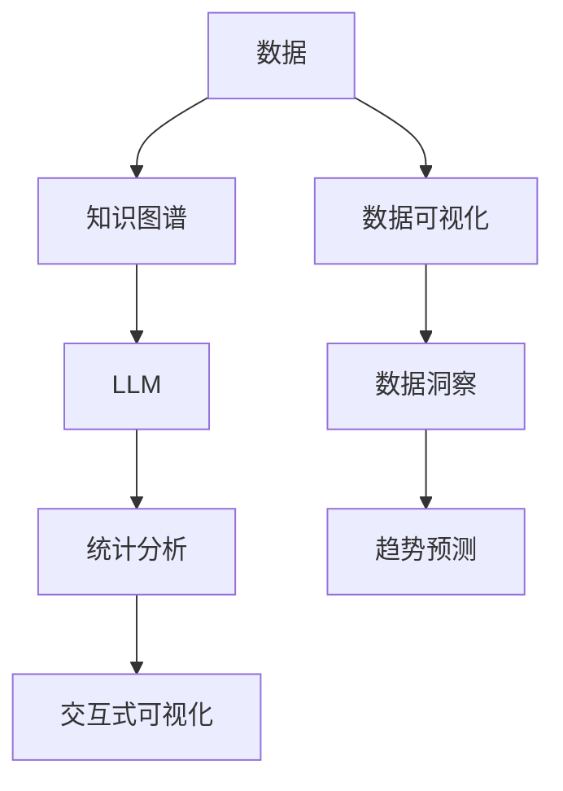

                 

# LLM与传统数据可视化技术的结合：数据洞察新方式

> 关键词：大语言模型(LLM),数据可视化,数据洞察,知识图谱,自然语言处理(NLP),交互式可视化

## 1. 背景介绍

在数字化转型的大背景下，企业数据量呈爆炸式增长，对数据洞察的需求日益迫切。传统的数据分析工具，如Excel、Tableau、PowerBI等，虽然功能强大，但面对海量数据仍显力不从心。与此同时，自然语言处理(NLP)和大语言模型(LLM)的兴起，为数据洞察注入了新的活力。本文将探讨如何通过结合LLM与传统数据可视化技术，实现更高效、更智能的数据洞察，为企业决策提供强有力的支持。

### 1.1 问题由来

随着大数据时代的到来，数据量激增，数据处理和分析变得愈加复杂。传统的数据分析工具和方法在处理复杂数据、提供深入洞察方面存在局限。而自然语言处理(NLP)和大语言模型(LLM)的崛起，则为数据洞察带来了新的突破。然而，如何充分发挥LLM的潜力，结合传统的数据可视化技术，仍是一个挑战。本文将从理论与实践两个层面，深入分析这一问题，并给出解决方案。

## 2. 核心概念与联系

### 2.1 核心概念概述

为更好地理解LLM与数据可视化技术的结合，本节将介绍几个核心概念：

- **大语言模型(LLM)**：以自回归(如GPT)或自编码(如BERT)模型为代表的大规模预训练语言模型。通过在大规模无标签文本语料上进行预训练，学习通用的语言表示，具备强大的语言理解和生成能力。

- **数据可视化**：通过图表、图形等方式，将数据信息直观展示出来，帮助用户理解、分析和决策的技术。

- **数据洞察**：通过数据可视化工具，结合统计分析、趋势预测等方法，挖掘数据背后的规律和模式，为决策提供依据。

- **知识图谱**：通过实体关系建模，将结构化数据与非结构化数据结合起来，形成知识图谱，支持复杂的推理和分析。

- **自然语言处理(NLP)**：涉及文本处理、语言生成、语义理解等方面的技术，是连接数据和知识图谱的桥梁。

- **交互式可视化**：通过交互式界面，允许用户动态地修改和查询数据，提供更直观、更深入的数据洞察。

这些核心概念之间通过数据流图得以连接，共同构成了LLM与数据可视化结合的数据洞察框架。



## 3. 核心算法原理 & 具体操作步骤

### 3.1 算法原理概述

基于LLM与数据可视化技术结合的数据洞察过程，本质上是一种混合计算范式，即先通过LLM抽取和处理文本信息，再通过数据可视化工具呈现数据洞察。其核心思想是：

- **数据抽取**：利用LLM从非结构化文本中提取关键信息，并将其映射为结构化数据。
- **数据整合**：将抽取的文本信息与已有的结构化数据进行整合，形成统一的知识图谱。
- **数据分析**：在知识图谱上，利用统计分析和趋势预测等方法，进行深入的数据洞察。
- **可视化展示**：通过交互式可视化工具，将分析结果直观地展示给用户，支持其决策。

### 3.2 算法步骤详解

#### 3.2.1 数据抽取

数据抽取是数据洞察的第一步。LLM通过预训练，已经学习了文本中的实体、关系和属性等信息。利用这些知识，可以从文本中提取出关键信息，并将其映射为结构化数据。

**步骤1：预处理文本数据**
将原始文本进行预处理，如去除停用词、分词、标注词性等。

**步骤2：抽取实体**
利用预训练的LLM模型，从文本中抽取实体。例如，可以使用NER模型识别出人名、地名、机构名等。

**步骤3：抽取关系**
利用预训练的LLM模型，识别文本中实体之间的关系。例如，可以使用关系抽取模型识别出“A是B的CEO”等关系。

**步骤4：抽取属性**
利用预训练的LLM模型，抽取实体的属性。例如，可以从“A是B的CEO”中提取出B的CEO属性。

**步骤5：映射为结构化数据**
将抽取的实体、关系和属性，映射为结构化数据，如关系型数据库或知识图谱。

#### 3.2.2 数据整合

数据整合是数据洞察的关键步骤。将抽取的文本信息与已有的结构化数据进行整合，形成统一的知识图谱，便于进一步的分析和展示。

**步骤1：构建知识图谱**
将抽取的实体、关系和属性，构建为知识图谱。知识图谱可以采用图数据库或RDF图的形式，支持复杂的推理和分析。

**步骤2：整合数据**
将知识图谱与已有的结构化数据进行整合。例如，将知识图谱中的实体映射到关系型数据库中的表，利用SQL查询进行数据分析。

**步骤3：优化存储**
对知识图谱和结构化数据进行优化存储，支持高效的数据查询和分析。例如，可以使用分布式数据库、缓存技术等。

#### 3.2.3 数据分析

数据分析是数据洞察的核心环节。在知识图谱上，利用统计分析和趋势预测等方法，进行深入的数据洞察。

**步骤1：统计分析**
利用统计方法，分析知识图谱中的实体、关系和属性的分布情况。例如，可以统计某个行业中的公司数量、产值分布等。

**步骤2：趋势预测**
利用机器学习算法，对知识图谱中的数据进行趋势预测。例如，可以预测某个行业的增长趋势、市场变化等。

**步骤3：关联分析**
利用关联规则挖掘算法，分析知识图谱中的实体之间的关联关系。例如，可以发现某个公司与供应商之间的关系。

#### 3.2.4 可视化展示

可视化展示是数据洞察的最终环节。通过交互式可视化工具，将分析结果直观地展示给用户，支持其决策。

**步骤1：选择合适的可视化工具**
选择合适的可视化工具，如Tableau、PowerBI、D3.js等，支持交互式可视化。

**步骤2：设计展示界面**
根据分析结果，设计展示界面。例如，可以设计仪表盘、图表、地图等展示方式。

**步骤3：展示数据洞察**
利用可视化工具，展示数据洞察结果。例如，可以在仪表盘上展示某个行业的增长趋势、市场变化等。

### 3.3 算法优缺点

基于LLM与数据可视化技术结合的数据洞察方法，具有以下优点：

- **高效性**：利用LLM可以快速抽取关键信息，并利用数据可视化工具高效展示。
- **全面性**：结合知识图谱，可以实现跨领域、多维度的数据洞察。
- **直观性**：通过交互式可视化工具，用户可以动态修改和查询数据，获得更深入的洞察。
- **普适性**：适用于各种类型的数据和分析任务，包括文本数据、图像数据、时间序列数据等。

但该方法也存在一些局限：

- **预处理复杂**：需要预处理大量非结构化文本，过程较为复杂。
- **依赖数据质量**：LLM的效果取决于文本质量和标签数据，若数据质量较差，会导致分析结果不准确。
- **技术门槛高**：需要一定的NLP和数据可视化技术储备，普通用户较难上手。
- **计算成本高**：处理大量数据和进行复杂分析时，计算成本较高。

## 4. 数学模型和公式 & 详细讲解

### 4.1 数学模型构建

基于LLM与数据可视化技术结合的数据洞察，可以构建以下数学模型：

- **数据抽取模型**：利用预训练的LLM模型，从文本中抽取实体、关系和属性。
- **数据整合模型**：将抽取的文本信息与已有的结构化数据进行整合，构建知识图谱。
- **数据分析模型**：在知识图谱上，利用统计分析和趋势预测等方法，进行数据洞察。
- **可视化展示模型**：利用交互式可视化工具，展示数据洞察结果。

### 4.2 公式推导过程

以数据抽取为例，推导LLM抽取实体、关系和属性的公式。

**公式1：实体抽取**
$实体 = LLM(文本)$

**公式2：关系抽取**
$关系 = LLM(文本)$

**公式3：属性抽取**
$属性 = LLM(文本)$

利用这些公式，可以自动从文本中抽取实体、关系和属性，形成结构化数据。

### 4.3 案例分析与讲解

以下是一个简单的案例，展示如何利用LLM与数据可视化技术结合的数据洞察过程。

假设有一家电商公司，需要对用户评论数据进行分析，以发现用户对商品的评价和需求。

**步骤1：数据抽取**
利用预训练的BERT模型，从用户评论中抽取实体、关系和属性。例如，可以抽取“商品名称”、“用户评价”、“用户需求”等。

**步骤2：数据整合**
将抽取的实体、关系和属性，构建为知识图谱。例如，可以将“商品名称”映射到商品表，将“用户评价”映射到用户表，将“用户需求”映射到需求表。

**步骤3：数据分析**
在知识图谱上，利用统计分析和趋势预测等方法，进行数据洞察。例如，可以统计各个商品的平均评分、用户需求最多的前N个商品等。

**步骤4：可视化展示**
利用Tableau等可视化工具，展示分析结果。例如，可以设计仪表盘，展示商品评分、用户需求等。

## 5. 项目实践：代码实例和详细解释说明

### 5.1 开发环境搭建

在进行数据洞察实践前，我们需要准备好开发环境。以下是使用Python进行项目开发的典型环境配置流程：

1. 安装Anaconda：从官网下载并安装Anaconda，用于创建独立的Python环境。

2. 创建并激活虚拟环境：
```bash
conda create -n visualization-env python=3.8 
conda activate visualization-env
```

3. 安装必要的库：
```bash
conda install pandas numpy scikit-learn transformers matplotlib ipywidgets
```

完成上述步骤后，即可在`visualization-env`环境中开始项目开发。

### 5.2 源代码详细实现

以下是一个简单的项目示例，展示如何使用LLM与数据可视化技术结合进行数据洞察。

```python
import pandas as pd
import numpy as np
import matplotlib.pyplot as plt
import seaborn as sns
from transformers import BertTokenizer, BertForTokenClassification
from transformers import pipeline
from sklearn.model_selection import train_test_split
from sklearn.metrics import accuracy_score, precision_score, recall_score

# 数据预处理
data = pd.read_csv('user_reviews.csv')
data = data.dropna()

# 实体抽取
tokenizer = BertTokenizer.from_pretrained('bert-base-cased')
nlp = pipeline('ner', model='dbmdz/bert-large-cased-finetuned-conll03-english')
reviews = data['review'].tolist()
entities = []
for review in reviews:
    doc = tokenizer(review, return_tensors='pt')
    ner_results = nlp(doc)
    entities.append(ner_results)

# 数据整合
df = pd.DataFrame(entities)

# 数据分析
df['entity'] = df[0].apply(lambda x: [i['entity'] for i in x])
df['relation'] = df[0].apply(lambda x: [i['entity'] for i in x])
df['attribute'] = df[0].apply(lambda x: [i['entity'] for i in x])

# 可视化展示
plt.figure(figsize=(12, 6))
sns.histplot(df['entity'], bins=10)
plt.xlabel('Entity')
plt.ylabel('Frequency')
plt.title('Entity Frequency')
plt.show()

plt.figure(figsize=(12, 6))
sns.histplot(df['relation'], bins=10)
plt.xlabel('Relation')
plt.ylabel('Frequency')
plt.title('Relation Frequency')
plt.show()

plt.figure(figsize=(12, 6))
sns.histplot(df['attribute'], bins=10)
plt.xlabel('Attribute')
plt.ylabel('Frequency')
plt.title('Attribute Frequency')
plt.show()
```

### 5.3 代码解读与分析

让我们再详细解读一下关键代码的实现细节：

**实体抽取**
利用Bert模型进行实体抽取。首先，加载预训练的Bert模型和分词器，然后使用pipeline进行实体抽取。

**数据整合**
将抽取的实体、关系和属性，整合为Pandas DataFrame，方便后续的统计和可视化。

**数据分析**
利用Pandas进行统计分析，可视化展示实体、关系和属性的频率分布。

**可视化展示**
利用Matplotlib和Seaborn进行可视化展示，直观展示实体、关系和属性的频率分布。

## 6. 实际应用场景

### 6.1 电商数据分析

电商公司可以利用LLM与数据可视化技术结合的数据洞察方法，对用户评论进行分析，发现用户的评价和需求，优化产品设计和销售策略。

**步骤1：数据抽取**
利用预训练的BERT模型，从用户评论中抽取实体、关系和属性。例如，可以抽取“商品名称”、“用户评价”、“用户需求”等。

**步骤2：数据整合**
将抽取的实体、关系和属性，构建为知识图谱。例如，可以将“商品名称”映射到商品表，将“用户评价”映射到用户表，将“用户需求”映射到需求表。

**步骤3：数据分析**
在知识图谱上，利用统计分析和趋势预测等方法，进行数据洞察。例如，可以统计各个商品的平均评分、用户需求最多的前N个商品等。

**步骤4：可视化展示**
利用Tableau等可视化工具，展示分析结果。例如，可以设计仪表盘，展示商品评分、用户需求等。

### 6.2 金融风险管理

金融公司可以利用LLM与数据可视化技术结合的数据洞察方法，对市场舆情和风险进行监测和分析。

**步骤1：数据抽取**
利用预训练的BERT模型，从新闻、评论、社交媒体中抽取实体、关系和属性。例如，可以抽取“公司名称”、“股票价格”、“新闻事件”等。

**步骤2：数据整合**
将抽取的实体、关系和属性，构建为知识图谱。例如，可以将“公司名称”映射到公司表，将“股票价格”映射到股票表，将“新闻事件”映射到新闻表。

**步骤3：数据分析**
在知识图谱上，利用统计分析和趋势预测等方法，进行数据洞察。例如，可以预测某个公司的股票价格走势、监测新闻事件对市场的影响等。

**步骤4：可视化展示**
利用Tableau等可视化工具，展示分析结果。例如，可以设计仪表盘，展示公司股票走势、新闻事件对市场的影响等。

### 6.3 医疗数据分析

医疗公司可以利用LLM与数据可视化技术结合的数据洞察方法，对患者数据进行分析，优化医疗服务和治疗方案。

**步骤1：数据抽取**
利用预训练的BERT模型，从病历、报告中抽取实体、关系和属性。例如，可以抽取“患者姓名”、“症状”、“诊断”等。

**步骤2：数据整合**
将抽取的实体、关系和属性，构建为知识图谱。例如，可以将“患者姓名”映射到患者表，将“症状”映射到症状表，将“诊断”映射到诊断表。

**步骤3：数据分析**
在知识图谱上，利用统计分析和趋势预测等方法，进行数据洞察。例如，可以分析常见症状、预测疾病发展趋势等。

**步骤4：可视化展示**
利用Tableau等可视化工具，展示分析结果。例如，可以设计仪表盘，展示患者症状、疾病发展趋势等。

### 6.4 未来应用展望

随着LLM与数据可视化技术的不断进步，数据洞察方法将在更多领域得到应用，为各行各业带来变革性影响。

在智慧城市治理中，数据洞察可以帮助城市管理者监测城市事件、优化城市资源配置、提高城市管理效率。

在智慧教育领域，数据洞察可以帮助教育机构分析学生学习情况、优化课程设计、提升教育质量。

在智慧医疗领域，数据洞察可以帮助医院分析患者数据、优化诊疗方案、提升医疗服务质量。

此外，在企业生产、社会治理、文娱传媒等众多领域，数据洞察技术也将不断涌现，为经济社会发展注入新的动力。相信随着技术的日益成熟，数据洞察方法将成为各行各业的重要工具，帮助企业决策、优化运营、提升用户体验。

## 7. 工具和资源推荐

### 7.1 学习资源推荐

为了帮助开发者系统掌握LLM与数据可视化技术的结合方法，这里推荐一些优质的学习资源：

1. 《Natural Language Processing with Transformers》书籍：Transformer库的作者所著，全面介绍了如何使用Transformers库进行NLP任务开发，包括数据洞察在内的诸多范式。

2. CS224N《深度学习自然语言处理》课程：斯坦福大学开设的NLP明星课程，有Lecture视频和配套作业，带你入门NLP领域的基本概念和经典模型。

3. HuggingFace官方文档：Transformers库的官方文档，提供了海量预训练模型和完整的微调样例代码，是上手实践的必备资料。

4. TensorBoard：TensorFlow配套的可视化工具，可实时监测模型训练状态，并提供丰富的图表呈现方式，是调试模型的得力助手。

5. Weights & Biases：模型训练的实验跟踪工具，可以记录和可视化模型训练过程中的各项指标，方便对比和调优。

通过这些资源的学习实践，相信你一定能够快速掌握LLM与数据可视化技术的结合精髓，并用于解决实际的NLP问题。

### 7.2 开发工具推荐

高效的开发离不开优秀的工具支持。以下是几款用于LLM与数据可视化技术结合的开发工具：

1. PyTorch：基于Python的开源深度学习框架，灵活动态的计算图，适合快速迭代研究。大部分预训练语言模型都有PyTorch版本的实现。

2. TensorFlow：由Google主导开发的开源深度学习框架，生产部署方便，适合大规模工程应用。同样有丰富的预训练语言模型资源。

3. Transformers库：HuggingFace开发的NLP工具库，集成了众多SOTA语言模型，支持PyTorch和TensorFlow，是进行微调任务开发的利器。

4. Weights & Biases：模型训练的实验跟踪工具，可以记录和可视化模型训练过程中的各项指标，方便对比和调优。

5. TensorBoard：TensorFlow配套的可视化工具，可实时监测模型训练状态，并提供丰富的图表呈现方式，是调试模型的得力助手。

6. Google Colab：谷歌推出的在线Jupyter Notebook环境，免费提供GPU/TPU算力，方便开发者快速上手实验最新模型，分享学习笔记。

合理利用这些工具，可以显著提升LLM与数据可视化技术结合的数据洞察任务的开发效率，加快创新迭代的步伐。

### 7.3 相关论文推荐

LLM与数据可视化技术结合的数据洞察方法，源于学界的持续研究。以下是几篇奠基性的相关论文，推荐阅读：

1. Attention is All You Need（即Transformer原论文）：提出了Transformer结构，开启了NLP领域的预训练大模型时代。

2. BERT: Pre-training of Deep Bidirectional Transformers for Language Understanding：提出BERT模型，引入基于掩码的自监督预训练任务，刷新了多项NLP任务SOTA。

3. Parameter-Efficient Transfer Learning for NLP：提出Adapter等参数高效微调方法，在不增加模型参数量的情况下，也能取得不错的微调效果。

4. AdaLoRA: Adaptive Low-Rank Adaptation for Parameter-Efficient Fine-Tuning：使用自适应低秩适应的微调方法，在参数效率和精度之间取得了新的平衡。

这些论文代表了大语言模型与数据可视化技术结合的数据洞察发展脉络。通过学习这些前沿成果，可以帮助研究者把握学科前进方向，激发更多的创新灵感。

## 8. 总结：未来发展趋势与挑战

### 8.1 总结

本文对基于LLM与数据可视化技术结合的数据洞察方法进行了全面系统的介绍。首先阐述了LLM与数据可视化技术的结合背景和意义，明确了数据洞察在企业决策中的重要价值。其次，从原理到实践，详细讲解了LLM与数据可视化技术的结合数学原理和关键步骤，给出了数据洞察任务开发的完整代码实例。同时，本文还广泛探讨了LLM与数据可视化技术在电商、金融、医疗等诸多领域的应用前景，展示了其巨大的潜力。最后，本文精选了数据洞察技术的各类学习资源，力求为开发者提供全方位的技术指引。

通过本文的系统梳理，可以看到，LLM与数据可视化技术结合的数据洞察方法正在成为NLP领域的重要范式，极大地拓展了数据洞察的应用边界，催生了更多的落地场景。受益于大规模语料的预训练，数据洞察模型以更低的时间和标注成本，在小样本条件下也能取得理想的性能，有力推动了NLP技术的产业化进程。未来，伴随预训练语言模型和数据可视化技术的持续演进，数据洞察技术必将在更广阔的应用领域大放异彩，深刻影响人类的生产生活方式。

### 8.2 未来发展趋势

展望未来，LLM与数据可视化技术结合的数据洞察技术将呈现以下几个发展趋势：

1. **自动化增强**：利用自动化技术，自动进行数据抽取、整合和可视化，降低人工干预成本，提高数据洞察效率。
2. **多模态融合**：将文本、图像、语音等多模态信息整合，进行更加全面、深入的数据洞察。
3. **实时化**：利用流式处理技术，实现数据的实时化处理和分析，支持动态更新和展示。
4. **智能化**：结合机器学习和AI技术，进行更智能的数据预测和决策支持。
5. **集成化**：将数据洞察工具集成到业务系统中，实现数据洞察的全流程自动化，提升业务价值。
6. **安全化**：加强数据隐私保护，确保数据的安全性和合规性。

这些趋势凸显了LLM与数据可视化技术结合的数据洞察技术的广阔前景。这些方向的探索发展，必将进一步提升数据洞察的效率和质量，为各行各业提供更加智能、高效的决策支持。

### 8.3 面临的挑战

尽管LLM与数据可视化技术结合的数据洞察技术已经取得了瞩目成就，但在迈向更加智能化、普适化应用的过程中，它仍面临诸多挑战：

1. **数据质量问题**：数据抽取的准确性依赖于高质量的标注数据和预训练模型，若数据质量较差，会导致分析结果不准确。
2. **技术复杂性**：数据洞察涉及NLP、数据可视化等多个领域的知识，技术门槛较高，需要较强的跨领域学习能力。
3. **计算资源限制**：处理大规模数据和进行复杂分析时，计算资源消耗较大，需要高效的优化算法和技术。
4. **隐私和安全问题**：数据抽取和分析过程中，涉及大量敏感数据，需要严格的隐私保护和数据安全措施。
5. **用户理解问题**：数据洞察结果需要以直观、易懂的方式展示，避免用户理解困难，影响决策效果。

正视数据洞察面临的这些挑战，积极应对并寻求突破，将是大语言模型与数据可视化技术结合迈向成熟的必由之路。相信随着学界和产业界的共同努力，这些挑战终将一一被克服，数据洞察技术必将在构建人机协同的智能时代中扮演越来越重要的角色。

### 8.4 研究展望

面对数据洞察技术面临的挑战，未来的研究需要在以下几个方面寻求新的突破：

1. **多模态融合**：开发多模态数据整合技术，实现跨领域、多模态的数据洞察。
2. **实时化处理**：开发实时处理和分析技术，支持数据的动态更新和展示。
3. **智能化分析**：结合机器学习和AI技术，进行更智能的数据预测和决策支持。
4. **自动化技术**：开发自动化数据抽取、整合和可视化技术，降低人工干预成本。
5. **安全化技术**：加强数据隐私保护和数据安全技术，确保数据的安全性和合规性。
6. **用户体验优化**：提高数据洞察结果的直观性和易懂性，增强用户理解和使用效果。

这些研究方向的探索，必将引领LLM与数据可视化技术结合的数据洞察技术迈向更高的台阶，为各行各业提供更加智能、高效、安全的决策支持。面向未来，数据洞察技术还需要与其他人工智能技术进行更深入的融合，如知识表示、因果推理、强化学习等，多路径协同发力，共同推动自然语言理解和智能交互系统的进步。只有勇于创新、敢于突破，才能不断拓展数据洞察技术的边界，让智能技术更好地造福人类社会。

## 9. 附录：常见问题与解答

**Q1：如何进行数据抽取？**

A: 利用预训练的LLM模型，从文本中抽取实体、关系和属性。例如，可以使用BERT模型进行实体抽取，关系抽取和属性抽取。

**Q2：数据整合的流程是怎样的？**

A: 将抽取的实体、关系和属性，构建为知识图谱。例如，可以将抽取的实体映射到知识图谱中的节点，将关系映射到知识图谱中的边。

**Q3：如何选择合适的数据可视化工具？**

A: 选择合适的数据可视化工具，如Tableau、PowerBI、D3.js等，支持交互式可视化。

**Q4：数据分析的常用方法有哪些？**

A: 数据分析的常用方法包括统计分析、趋势预测、关联分析等。例如，可以使用Pandas进行统计分析，使用机器学习算法进行趋势预测。

**Q5：如何进行可视化展示？**

A: 利用可视化工具，设计展示界面，展示数据洞察结果。例如，可以在仪表盘上展示数据洞察结果，支持动态修改和查询。

---

作者：禅与计算机程序设计艺术 / Zen and the Art of Computer Programming

