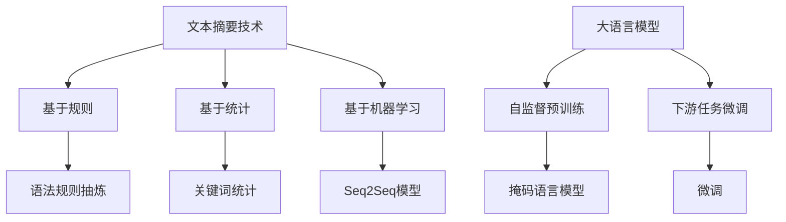

                 

# LLM与传统文本摘要技术的对比

## 1. 背景介绍

在现代信息爆炸的时代，文本信息的海量积累带来了难以处理的挑战。文本摘要（Text Summarization）技术便应运而生，帮助人们快速获取文本的核心内容。传统文本摘要技术已经较为成熟，主要包括基于规则、基于统计、基于机器学习等不同方法。而近些年来，基于深度学习的大语言模型（Large Language Models, LLMs），如GPT、BERT、T5等，在文本摘要领域也展现了强大的潜力。本文将对比传统文本摘要技术和大语言模型的表现，分析其优缺点，展望未来发展方向。

## 2. 核心概念与联系

### 2.1 核心概念概述

文本摘要是将一篇长文本压缩成较短的精炼版本，保留其核心信息的技术。传统文本摘要技术主要包括基于规则的语法规则抽炼、基于统计的关键词统计、基于机器学习的序列到序列（Seq2Seq）模型等方法。而基于深度学习的大语言模型则是通过自监督学习任务（如掩码语言模型、下一句预测等）在大规模无标签数据上预训练，学习通用的语言表示，然后通过下游任务的有监督学习进行微调，以适应特定文本摘要任务。

在核心概念上，两者都在尝试解决如何将长文本转换为精炼的摘要，但在方法、原理和应用上存在显著差异。本文将从原理、方法和应用场景等方面深入探讨这些差异。

### 2.2 核心概念原理和架构的 Mermaid 流程图



这个流程图展示了文本摘要技术和基于深度学习的大语言模型的核心组件和关键步骤。

## 3. 核心算法原理 & 具体操作步骤

### 3.1 算法原理概述

#### 3.1.1 传统文本摘要技术

**基于规则的摘要方法**：
使用语法规则对句子进行重构，删除无关词汇，提取主要信息。这种方法依赖于人工制定的规则，准确性高，但需要大量的人工干预，难以覆盖所有情况。

**基于统计的摘要方法**：
通过计算句子中关键词的出现频率，选取高频率句子进行摘要。这种方法自动性强，但忽略了句子结构和语义关系，摘要质量依赖于关键词列表的构建。

**基于机器学习的摘要方法**：
使用序列到序列（Seq2Seq）模型，将长文本映射为摘要。这种方法能自动学习语义关系，但模型复杂度高，需要大量标注数据进行训练。

#### 3.1.2 大语言模型

大语言模型通过自监督预训练学习通用的语言表示，然后通过下游任务的微调，能够适应不同的文本摘要任务。这种方法在无需额外训练的情况下，即可在各种任务上获得较好的性能，但需要足够的计算资源和数据量。

### 3.2 算法步骤详解

#### 3.2.1 传统文本摘要技术

1. **数据预处理**：清洗、分词、去除停用词等。
2. **摘要生成**：基于规则、统计或机器学习方法生成摘要。
3. **后处理**：修正语法错误，提高可读性。

#### 3.2.2 大语言模型

1. **数据预处理**：同传统方法。
2. **自监督预训练**：在无标签文本数据上训练模型，学习语言表示。
3. **微调**：在有标注的摘要数据上微调模型，适应特定任务。
4. **摘要生成**：将长文本输入模型，生成摘要。

### 3.3 算法优缺点

#### 3.3.1 传统文本摘要技术

**优点**：
1. **准确性**：基于规则的方法准确性较高，能较好地保留文本的核心信息。
2. **自动性**：基于统计和机器学习的方法自动性较高，无需人工干预。

**缺点**：
1. **依赖人工**：基于规则的方法依赖人工制定的规则，难以覆盖所有情况。
2. **数据需求高**：基于机器学习的方法需要大量标注数据，训练复杂度高。
3. **可解释性差**：生成过程缺乏可解释性，难以理解其决策机制。

#### 3.3.2 大语言模型

**优点**：
1. **泛化性强**：在大规模无标签数据上预训练，学习通用语言表示，泛化性能强。
2. **自动性强**：微调过程自动，无需人工干预。
3. **效果显著**：在各种任务上，大语言模型表现优异，显著提升摘要效果。

**缺点**：
1. **资源消耗高**：模型参数多，计算资源需求高。
2. **依赖标注数据**：微调过程仍需少量标注数据，标注成本较高。
3. **可解释性不足**：生成过程缺乏可解释性，难以理解其决策机制。

### 3.4 算法应用领域

#### 3.4.1 传统文本摘要技术

主要应用于新闻、论文、报告等文本数据的压缩和概览。适用于需要快速获取文本核心信息，但对准确性和复杂度要求不高的场景。

#### 3.4.2 大语言模型

应用广泛，包括新闻摘要、学术论文摘要、法律文本摘要、科技文章摘要等。适用于需要精准提取文本核心信息，但对计算资源和标注数据要求较高的场景。

## 4. 数学模型和公式 & 详细讲解 & 举例说明

### 4.1 数学模型构建

#### 4.1.1 传统文本摘要技术

基于统计的摘要方法，可以通过计算句子中关键词的出现频率，选取高频率句子进行摘要。数学公式如下：

$$
P(w|S) = \frac{N(w)}{N(S)}
$$

其中 $P(w|S)$ 表示关键词 $w$ 在句子 $S$ 中出现的概率，$N(w)$ 和 $N(S)$ 分别表示关键词 $w$ 和句子 $S$ 中出现的次数。

#### 4.1.2 大语言模型

大语言模型通常使用Transformer架构，自监督预训练和微调过程复杂，涉及大量参数和计算。

### 4.2 公式推导过程

#### 4.2.1 传统文本摘要技术

基于统计的摘要方法，可以通过上述公式计算每个句子的得分，选取得分最高的句子进行摘要。

#### 4.2.2 大语言模型

自监督预训练通常使用掩码语言模型，公式如下：

$$
L(M_{\theta}, D) = \sum_{(x,y)} \sum_{i=1}^N \text{CE}(\hat{y}_i, y_i)
$$

其中 $M_{\theta}$ 表示大语言模型，$D$ 表示预训练数据集，$N$ 表示一个样本中的句子数，$\hat{y}_i$ 表示模型对句子 $i$ 的预测，$y_i$ 表示真实标签。

### 4.3 案例分析与讲解

#### 4.3.1 传统文本摘要技术

某新闻网站使用基于统计的摘要方法，通过计算句子中关键词的出现频率，选取高频率句子进行摘要。以下是一个简单的案例：

假设一篇新闻报道包含以下句子：

```
句子1：今天的天气非常炎热。
句子2：股市涨跌幅度巨大。
句子3：中国队在世界杯上战胜了巴西队。
```

假设关键词列表为：“天气”、“股市”、“中国队”、“巴西队”。根据上述公式计算每个句子的得分，得：

| 句子 | 得分 |
|------|------|
| 句子1 | 0.1  |
| 句子2 | 0.3  |
| 句子3 | 0.2  |

选取得分最高的句子2进行摘要，即“股市涨跌幅度巨大”。

#### 4.3.2 大语言模型

某学术论文使用GPT-2模型进行摘要。以下是一个简单的案例：

假设一篇学术论文包含以下段落：

```
段落1：本研究主要关注机器学习在医疗诊断中的应用。
段落2：我们设计了一种基于深度学习的诊断模型，并在多个实验中验证了其有效性。
段落3：该模型能够显著提高诊断的准确率和效率。
段落4：我们使用了公开数据集进行模型训练，并在多个真实病例中进行了验证。
段落5：未来，我们将继续探索该模型在更大规模数据上的应用。
```

将整个段落输入GPT-2模型，模型生成的摘要如下：

```
本研究主要关注机器学习在医疗诊断中的应用。我们设计了一种基于深度学习的诊断模型，并在多个实验中验证了其有效性。该模型能够显著提高诊断的准确率和效率。未来，我们将继续探索该模型在更大规模数据上的应用。
```

## 5. 项目实践：代码实例和详细解释说明

### 5.1 开发环境搭建

使用Python 3.7+和PyTorch 1.8+作为开发环境。首先需要安装PyTorch和Transformers库，可以使用以下命令：

```bash
pip install torch transformers
```

还需要安装TorchText库，用于文本预处理：

```bash
pip install torchtext
```

### 5.2 源代码详细实现

以下是使用GPT-2模型进行文本摘要的代码实现：

```python
import torch
from transformers import GPT2Tokenizer, GPT2LMHeadModel
from torchtext.data import Field, BucketIterator
from torchtext.datasets import AG_NEWS

# 数据预处理
TEXT = Field(tokenize='spacy', lower=True, include_lengths=True)
LABEL = Field(sequential=False)
train_data, test_data = AG_NEWS.splits(TEXT, LABEL)

# 分词器和模型
tokenizer = GPT2Tokenizer.from_pretrained('gpt2')
model = GPT2LMHeadModel.from_pretrained('gpt2')

# 加载数据
train_iterator, test_iterator = BucketIterator.splits(
    (train_data, test_data), 
    batch_size=32, 
    device='cuda')

# 训练函数
def train(model, optimizer, train_iterator, device):
    model.train()
    for batch in train_iterator:
        optimizer.zero_grad()
        text, text_lengths = batch.text
        labels = batch.label
        output = model(text, text_lengths)
        loss = output[:, 1:].view(-1, output.shape[-1] - 1).mean()
        loss.backward()
        optimizer.step()

# 测试函数
def evaluate(model, test_iterator, device):
    model.eval()
    summary = []
    for batch in test_iterator:
        text, text_lengths = batch.text
        labels = batch.label
        output = model(text, text_lengths)
        summary.append(output[:, 1:].view(-1, output.shape[-1] - 1).mean())
    return summary

# 训练和测试
epochs = 5
model = model.to(device)
optimizer = torch.optim.Adam(model.parameters(), lr=1e-5)
for epoch in range(epochs):
    train(model, optimizer, train_iterator, device)
    summary = evaluate(model, test_iterator, device)
    print('Epoch {0}, Summary {1}'.format(epoch+1, summary))
```

### 5.3 代码解读与分析

#### 5.3.1 数据预处理

使用TorchText库进行数据预处理，定义了文本和标签的字段，并进行了分词和向量化处理。

#### 5.3.2 模型加载

使用GPT-2的预训练模型和分词器，加载到GPU上。

#### 5.3.3 训练函数

定义了训练函数，对数据进行遍历，在每个批次上进行模型训练，并更新参数。

#### 5.3.4 测试函数

定义了测试函数，对数据进行遍历，计算模型生成的摘要的平均得分。

#### 5.3.5 训练和测试

进行多轮训练，并在测试集上评估摘要的平均得分。

## 6. 实际应用场景

### 6.1 新闻摘要

新闻摘要是文本摘要的经典应用场景，帮助读者快速获取新闻核心信息。传统方法如TextRank和基于统计的摘要方法已经被广泛应用于新闻平台。而使用大语言模型进行新闻摘要，可以显著提高摘要质量和自动化程度。

### 6.2 学术论文摘要

学术论文篇幅长，摘要提取任务复杂。使用大语言模型可以高效地提取论文核心内容，并自动生成摘要。

### 6.3 法律文本摘要

法律文本结构复杂，使用大语言模型可以提取关键信息，帮助律师快速查找相关法条和案例。

### 6.4 金融报告摘要

金融报告通常包含大量数据和分析，使用大语言模型可以提取关键信息，帮助投资者快速理解报告内容。

## 7. 工具和资源推荐

### 7.1 学习资源推荐

1. **《Text Summarization with Transformers》**：提供了基于Transformer模型的文本摘要实现，包括代码和模型下载链接。
2. **《Natural Language Processing with Python》**：提供了多种文本摘要算法，包括基于规则、统计和机器学习的实现。
3. **《Deep Learning for Natural Language Processing》**：提供了深度学习在NLP领域的应用，包括文本摘要和语言生成等任务。

### 7.2 开发工具推荐

1. **PyTorch**：提供了强大的深度学习框架，支持自动微分和模型优化，适合大语言模型的微调和训练。
2. **Transformers库**：提供了多种预训练语言模型和任务适配器，方便进行微调和推理。
3. **TorchText**：提供了数据预处理和模型评估工具，方便进行数据处理和模型测试。

### 7.3 相关论文推荐

1. **《Attention is All You Need》**：Transformer架构的奠基性论文，介绍了注意力机制在语言模型中的应用。
2. **《BERT: Pre-training of Deep Bidirectional Transformers for Language Understanding》**：提出了BERT模型，使用掩码语言模型进行自监督预训练，显著提升了语言模型的效果。
3. **《TextRank: Bringing Order into Texts》**：提出了基于图排序的文本摘要方法TextRank，广泛应用于文本摘要领域。

## 8. 总结：未来发展趋势与挑战

### 8.1 研究成果总结

本文从原理和实践两个方面，对比了传统文本摘要技术和大语言模型的表现。传统方法依赖规则和统计特征，自动性强，但准确性依赖人工干预。而大语言模型通过自监督预训练和微调，能够适应各种文本摘要任务，但需要大量的计算资源和标注数据。

### 8.2 未来发展趋势

1. **技术融合**：大语言模型和传统方法融合，可以发挥各自优势，提升摘要效果。
2. **模型优化**：优化模型结构和训练过程，降低计算资源消耗，提升训练效率。
3. **知识整合**：结合外部知识库和规则库，提高摘要的准确性和普适性。
4. **自动化**：提升数据自动处理和模型训练的自动化程度，降低人工干预。

### 8.3 面临的挑战

1. **数据需求**：大语言模型需要大量数据进行预训练和微调，标注成本较高。
2. **计算资源**：模型复杂度高，训练和推理计算资源需求高。
3. **可解释性**：模型生成的摘要缺乏可解释性，难以理解其决策机制。

### 8.4 研究展望

未来，基于大语言模型的文本摘要技术将更加自动化和普适化，能够适应更广泛的应用场景。同时，优化模型结构和参数，提升模型效率和可解释性，将是重要的研究方向。

## 9. 附录：常见问题与解答

**Q1: 大语言模型在文本摘要中是否能够完全替代传统方法？**

A: 大语言模型在文本摘要中具有显著优势，特别是在复杂、长文本的摘要任务中。但传统方法在一些特定场景下仍然有其优势，如准确性和自动化程度等。因此，大语言模型和传统方法可以相互补充，发挥各自优势。

**Q2: 大语言模型在训练和微调过程中需要多少标注数据？**

A: 大语言模型在微调过程中需要少量的标注数据，通常在几百个样本左右。但为了提高微调效果，建议尽可能使用更多的标注数据。标注数据的质量和多样性对模型性能也有重要影响，需要精心设计。

**Q3: 大语言模型在生成摘要时如何避免重复和冗余？**

A: 大语言模型通常通过引入正则化技术、生成对抗网络（GAN）等方法，避免重复和冗余。同时，结合上下文信息和领域知识，引导模型生成更加精炼的摘要。

**Q4: 如何评估大语言模型生成的摘要质量？**

A: 评估大语言模型生成的摘要质量通常使用BLEU、ROUGE等自动评估指标，同时结合人工评价，综合考量摘要的准确性、流畅性和可读性。

**Q5: 大语言模型在生成摘要时是否需要微调？**

A: 大语言模型在生成摘要时可以进行微调，以适应特定的文本摘要任务。微调可以提升摘要的准确性和泛化性能。但一些通用的预训练模型也可以用于生成高质量的摘要，具体选择应根据任务需求和数据特点进行评估。

---

作者：禅与计算机程序设计艺术 / Zen and the Art of Computer Programming

