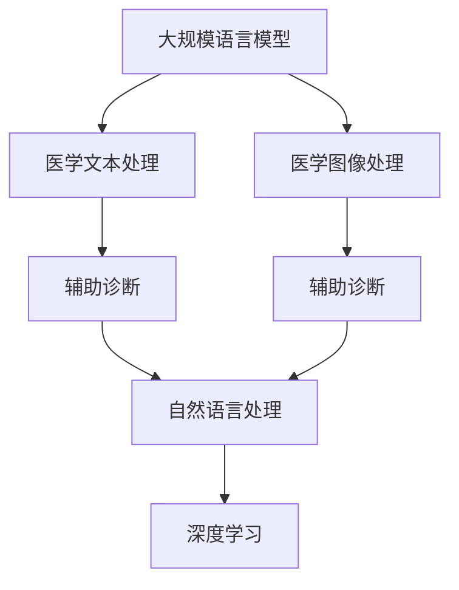

                 

# LLM在医疗诊断中的应用可能性

> 关键词：大规模语言模型,医疗诊断,自然语言处理,医学图像,辅助诊断

## 1. 背景介绍

### 1.1 问题由来
随着人工智能技术的迅猛发展，大规模语言模型（Large Language Model, LLM）在处理自然语言数据方面展现出了强大的能力。在医疗领域，医疗文本数据量庞大且种类繁多，包括电子病历、临床笔记、医学文献等，如何高效处理这些数据成为医学研究的一大难题。传统的文本挖掘和信息提取方法难以满足需求，基于大规模语言模型的医疗应用逐渐引起了学术界和工业界的关注。

### 1.2 问题核心关键点
大语言模型在医疗诊断中的应用，涉及自然语言处理（Natural Language Processing, NLP）、医学图像识别、辅助诊断等多个方面。大语言模型通过预训练和微调，能够在理解自然语言方面取得突破性进展，对医学文本进行深度分析和理解，进而应用于疾病诊断、医学影像分析、患者病历总结等任务。

## 2. 核心概念与联系

### 2.1 核心概念概述

为更好地理解大语言模型在医疗诊断中的应用，本节将介绍几个关键概念：

- 大规模语言模型（LLM）：以自回归模型（如GPT）或自编码模型（如BERT）为代表的大规模预训练语言模型，通过在大规模无标签文本语料上进行预训练，学习通用的语言表示，具备强大的语言理解和生成能力。
- 医学文本：包括电子病历、临床笔记、医学文献等，是医疗诊断的重要数据源。
- 医学图像：如X光片、CT、MRI等影像，提供疾病特征的视觉信息。
- 辅助诊断：通过分析医学文本和医学图像，辅助医生进行诊断和治疗决策，提升医疗服务的质量。
- 自然语言处理（NLP）：利用计算机对自然语言进行处理和分析的技术，包括文本分类、信息提取、问答系统等。
- 医学图像处理（Medical Image Processing）：对医学影像进行预处理、分析、特征提取等技术。
- 深度学习（Deep Learning）：利用多层神经网络进行模型训练和预测的机器学习技术。

这些核心概念之间的逻辑关系可以通过以下Mermaid流程图来展示：



这个流程图展示了大语言模型在医疗诊断中的应用链条：

1. 大语言模型通过预训练获得基础能力。
2. 通过文本处理和图像处理技术，将医学文本和医学图像转化为模型输入。
3. 利用自然语言处理技术，提取医学文本中的关键信息。
4. 结合医学图像处理技术，提取影像中的特征。
5. 将文本和图像信息输入大语言模型进行深度分析和推理。
6. 大语言模型输出诊断结果，辅助医生进行决策。

## 3. 核心算法原理 & 具体操作步骤

### 3.1 算法原理概述

基于大语言模型在医疗诊断中的应用，主要涉及自然语言处理和医学图像处理两个方面。自然语言处理方面，大语言模型可以用于医学文本分类、信息提取、问答系统等任务。医学图像处理方面，大语言模型可以用于图像文本标注、图像描述生成等任务。

### 3.2 算法步骤详解

#### 3.2.1 医学文本处理

1. **数据准备**：收集电子病历、临床笔记、医学文献等医学文本数据，并进行清洗、标注。
2. **预训练模型选择**：选择合适的预训练语言模型，如BERT、GPT等，作为初始化参数。
3. **任务适配层设计**：根据具体任务需求，设计合适的输出层和损失函数。例如，对于疾病分类任务，可以添加一个线性分类器和交叉熵损失函数。
4. **模型微调**：在标注好的医学文本数据集上进行微调，优化模型对特定任务的适应能力。
5. **性能评估**：在验证集和测试集上评估模型性能，调整超参数，提升模型精度。

#### 3.2.2 医学图像处理

1. **数据准备**：收集X光片、CT、MRI等医学影像数据，并进行标注，例如标注病灶位置、大小等。
2. **预训练模型选择**：选择合适的预训练图像处理模型，如ResNet、VGG等，作为初始化参数。
3. **任务适配层设计**：根据具体任务需求，设计合适的输出层和损失函数。例如，对于病灶检测任务，可以添加一个二分类损失函数。
4. **模型微调**：在标注好的医学影像数据集上进行微调，优化模型对特定任务的适应能力。
5. **性能评估**：在验证集和测试集上评估模型性能，调整超参数，提升模型精度。

### 3.3 算法优缺点

#### 3.3.1 优点

1. **高效处理文本数据**：大语言模型在处理文本数据方面具有天然优势，能够自动理解自然语言，提取关键信息。
2. **多模态融合**：大语言模型可以同时处理文本和图像信息，实现多模态数据的深度融合。
3. **泛化能力强**：通过在大规模语料上进行预训练，大语言模型具有较强的泛化能力，能够在多种医疗场景中取得良好表现。
4. **灵活性高**：大语言模型可以根据不同的任务需求进行微调，适应性强。

#### 3.3.2 缺点

1. **数据依赖**：大语言模型的效果很大程度上依赖于训练数据的数量和质量，需要大量标注数据。
2. **计算资源需求高**：大语言模型的训练和推理需要大量的计算资源，对硬件要求较高。
3. **解释性差**：大语言模型的决策过程较为复杂，缺乏可解释性。
4. **模型偏见**：预训练模型可能存在固有偏见，需要通过后期微调进行调整。

### 3.4 算法应用领域

大语言模型在医疗诊断中的应用领域非常广泛，包括但不限于以下几个方面：

1. **医学文本分类**：将医学文本分为不同类型的疾病，如癌症、心血管疾病等。
2. **疾病诊断**：根据患者的症状、病历等文本信息，诊断患者的疾病类型。
3. **医学影像分析**：分析医学影像中的病灶位置、大小、形状等特征，辅助医生进行诊断。
4. **辅助诊断**：通过结合文本和图像信息，辅助医生进行综合诊断和治疗决策。
5. **医疗知识图谱**：构建医学领域的知识图谱，帮助医生快速检索相关知识。
6. **患者病历总结**：自动生成患者的病历摘要，提高医生的工作效率。
7. **医学文献检索**：利用自然语言处理技术，快速检索相关医学文献。

## 4. 数学模型和公式 & 详细讲解 & 举例说明

### 4.1 数学模型构建

假设有一个二分类任务，给定一段医学文本 $x$，要求判断其是否属于某种疾病 $y \in \{0, 1\}$。可以使用大语言模型作为特征提取器，设计一个简单的二分类器。

模型输入为医学文本 $x$，输出为疾病分类 $y$。定义模型在输入 $x$ 上的预测概率为 $P(y|x)$，则损失函数可以定义为：

$$
\mathcal{L} = -\frac{1}{N} \sum_{i=1}^N \left[ y_i \log P(y_i|x_i) + (1-y_i) \log (1-P(y_i|x_i)) \right]
$$

其中，$N$ 为样本数量，$y_i$ 为样本的标签，$P(y_i|x_i)$ 为模型在输入 $x_i$ 上对标签 $y_i$ 的预测概率。

### 4.2 公式推导过程

对于二分类任务，模型输出的概率可以用softmax函数表示：

$$
P(y|x) = \frac{\exp(\mathbf{w}^T \phi(x) + b)}{\sum_{k=1}^K \exp(\mathbf{w}^T \phi_k(x) + b_k)}
$$

其中，$\phi(x)$ 为文本特征表示，$\mathbf{w}$ 为模型参数，$b$ 为偏置项，$K$ 为类别数量。

通过最大化交叉熵损失函数，可以得到模型参数的更新公式：

$$
\mathbf{w} \leftarrow \mathbf{w} - \eta \nabla_{\mathbf{w}}\mathcal{L} \\
b \leftarrow b - \eta \nabla_{b}\mathcal{L}
$$

其中，$\eta$ 为学习率。

### 4.3 案例分析与讲解

#### 4.3.1 医学文本分类

假设有一个二分类任务，将医学文本分为肿瘤和正常两类。使用BERT作为预训练语言模型，构建一个二分类器。首先，将医学文本转换为BERT的输入格式，然后送入BERT进行特征提取，得到文本表示 $\phi(x)$。接着，通过softmax函数计算每个类别的概率 $P(y|x)$，最后使用交叉熵损失函数进行模型更新。

#### 4.3.2 医学影像分析

假设有一个病灶检测任务，要求在医学影像中检测病灶的位置和大小。使用ResNet作为预训练图像处理模型，构建一个二分类器。首先，将医学影像转换为ResNet的输入格式，然后送入ResNet进行特征提取，得到影像表示 $\phi(x)$。接着，通过softmax函数计算每个类别的概率 $P(y|x)$，最后使用交叉熵损失函数进行模型更新。

## 5. 项目实践：代码实例和详细解释说明

### 5.1 开发环境搭建

在进行大语言模型在医疗诊断中的应用实践前，需要准备好开发环境。以下是使用Python进行PyTorch开发的环境配置流程：

1. 安装Anaconda：从官网下载并安装Anaconda，用于创建独立的Python环境。

2. 创建并激活虚拟环境：
```bash
conda create -n pytorch-env python=3.8 
conda activate pytorch-env
```

3. 安装PyTorch：根据CUDA版本，从官网获取对应的安装命令。例如：
```bash
conda install pytorch torchvision torchaudio cudatoolkit=11.1 -c pytorch -c conda-forge
```

4. 安装相关库：
```bash
pip install numpy pandas scikit-learn transformers
```

完成上述步骤后，即可在`pytorch-env`环境中开始项目实践。

### 5.2 源代码详细实现

下面以医学文本分类任务为例，给出使用Transformers库对BERT模型进行微调的PyTorch代码实现。

首先，定义任务的数据处理函数：

```python
from transformers import BertTokenizer
from torch.utils.data import Dataset
import torch

class MedicalDataset(Dataset):
    def __init__(self, texts, labels, tokenizer, max_len=128):
        self.texts = texts
        self.labels = labels
        self.tokenizer = tokenizer
        self.max_len = max_len
        
    def __len__(self):
        return len(self.texts)
    
    def __getitem__(self, item):
        text = self.texts[item]
        label = self.labels[item]
        
        encoding = self.tokenizer(text, return_tensors='pt', max_length=self.max_len, padding='max_length', truncation=True)
        input_ids = encoding['input_ids'][0]
        attention_mask = encoding['attention_mask'][0]
        
        # 将标签转换为one-hot编码
        encoded_labels = torch.zeros_like(input_ids, dtype=torch.long)
        encoded_labels[label] = 1
        
        return {'input_ids': input_ids, 
                'attention_mask': attention_mask,
                'labels': encoded_labels}

# 加载预训练的BERT模型和分词器
tokenizer = BertTokenizer.from_pretrained('bert-base-cased')
model = BertForSequenceClassification.from_pretrained('bert-base-cased', num_labels=2)
```

然后，定义模型和优化器：

```python
from transformers import AdamW

model.to(device)
optimizer = AdamW(model.parameters(), lr=2e-5)
```

接着，定义训练和评估函数：

```python
from torch.utils.data import DataLoader
from tqdm import tqdm

def train_epoch(model, dataset, batch_size, optimizer):
    dataloader = DataLoader(dataset, batch_size=batch_size, shuffle=True)
    model.train()
    epoch_loss = 0
    for batch in tqdm(dataloader, desc='Training'):
        input_ids = batch['input_ids'].to(device)
        attention_mask = batch['attention_mask'].to(device)
        labels = batch['labels'].to(device)
        model.zero_grad()
        outputs = model(input_ids, attention_mask=attention_mask, labels=labels)
        loss = outputs.loss
        epoch_loss += loss.item()
        loss.backward()
        optimizer.step()
    return epoch_loss / len(dataloader)

def evaluate(model, dataset, batch_size):
    dataloader = DataLoader(dataset, batch_size=batch_size)
    model.eval()
    preds, labels = [], []
    with torch.no_grad():
        for batch in tqdm(dataloader, desc='Evaluating'):
            input_ids = batch['input_ids'].to(device)
            attention_mask = batch['attention_mask'].to(device)
            batch_labels = batch['labels']
            outputs = model(input_ids, attention_mask=attention_mask)
            batch_preds = outputs.logits.argmax(dim=1).to('cpu').tolist()
            batch_labels = batch_labels.to('cpu').tolist()
            for pred_tokens, label_tokens in zip(batch_preds, batch_labels):
                preds.append(pred_tokens[:len(label_tokens)])
                labels.append(label_tokens)
                
    print(classification_report(labels, preds))
```

最后，启动训练流程并在测试集上评估：

```python
epochs = 5
batch_size = 16

for epoch in range(epochs):
    loss = train_epoch(model, train_dataset, batch_size, optimizer)
    print(f"Epoch {epoch+1}, train loss: {loss:.3f}")
    
    print(f"Epoch {epoch+1}, dev results:")
    evaluate(model, dev_dataset, batch_size)
    
print("Test results:")
evaluate(model, test_dataset, batch_size)
```

以上就是使用PyTorch对BERT进行医学文本分类任务微调的完整代码实现。可以看到，得益于Transformers库的强大封装，我们可以用相对简洁的代码完成BERT模型的加载和微调。

### 5.3 代码解读与分析

让我们再详细解读一下关键代码的实现细节：

**MedicalDataset类**：
- `__init__`方法：初始化文本、标签、分词器等关键组件。
- `__len__`方法：返回数据集的样本数量。
- `__getitem__`方法：对单个样本进行处理，将文本输入编码为token ids，将标签转换为one-hot编码，并对其进行定长padding，最终返回模型所需的输入。

**标签处理**：
- 将标签转换为one-hot编码，用于模型训练。

**训练和评估函数**：
- 使用PyTorch的DataLoader对数据集进行批次化加载，供模型训练和推理使用。
- 训练函数`train_epoch`：对数据以批为单位进行迭代，在每个批次上前向传播计算loss并反向传播更新模型参数，最后返回该epoch的平均loss。
- 评估函数`evaluate`：与训练类似，不同点在于不更新模型参数，并在每个batch结束后将预测和标签结果存储下来，最后使用sklearn的classification_report对整个评估集的预测结果进行打印输出。

**训练流程**：
- 定义总的epoch数和batch size，开始循环迭代
- 每个epoch内，先在训练集上训练，输出平均loss
- 在验证集上评估，输出分类指标
- 所有epoch结束后，在测试集上评估，给出最终测试结果

可以看到，PyTorch配合Transformers库使得BERT微调的代码实现变得简洁高效。开发者可以将更多精力放在数据处理、模型改进等高层逻辑上，而不必过多关注底层的实现细节。

当然，工业级的系统实现还需考虑更多因素，如模型的保存和部署、超参数的自动搜索、更灵活的任务适配层等。但核心的微调范式基本与此类似。

## 6. 实际应用场景

### 6.1 智能诊断系统

基于大语言模型微调的诊断系统，可以广泛应用于智能诊断系统的构建。传统诊断系统依赖医生经验和知识，需要耗费大量时间和精力，且容易发生误诊。而使用微调后的诊断系统，能够快速准确地进行疾病诊断，提升诊断效率和准确性。

在技术实现上，可以收集大量的电子病历和医学文献数据，将其标注为疾病类型，在此基础上对预训练诊断模型进行微调。微调后的诊断模型能够自动理解患者症状和病历记录，根据患者的病情和症状，推荐可能的疾病类型和诊断建议。

### 6.2 医学影像分析

医学影像分析是大语言模型在医疗诊断中的重要应用之一。传统的影像分析依赖医生手动标注和判断，耗时且易出错。而使用大语言模型微调，可以自动提取影像中的病灶位置、大小等关键信息，辅助医生进行疾病诊断和治疗决策。

在技术实现上，可以收集大量的医学影像数据，并标注病灶位置和大小等关键信息，在此基础上对预训练影像分析模型进行微调。微调后的模型能够自动提取影像中的关键特征，识别出病灶类型和位置，生成影像报告，辅助医生进行诊断和治疗。

### 6.3 医疗知识图谱

医疗知识图谱是大语言模型在医疗领域的另一个重要应用。传统的知识图谱构建依赖人工标注和规则，耗时且易出错。而使用大语言模型微调，可以自动构建医疗领域的知识图谱，帮助医生快速检索相关知识。

在技术实现上，可以收集大量的医学文献和病历数据，提取其中的实体、关系等信息，在此基础上对预训练知识图谱模型进行微调。微调后的模型能够自动构建医疗领域的知识图谱，帮助医生快速检索相关知识，提高诊疗效率和效果。

### 6.4 患者病历总结

患者病历总结是大语言模型在医疗诊断中的另一个重要应用。传统的病历总结依赖医生手动编写，耗时且易出错。而使用大语言模型微调，可以自动生成患者的病历摘要，提高医生的工作效率和质量。

在技术实现上，可以收集大量的患者病历数据，并标注病历摘要，在此基础上对预训练文本生成模型进行微调。微调后的模型能够自动生成患者的病历摘要，帮助医生快速了解患者的病情和诊疗历史，提高诊疗效率和效果。

## 7. 工具和资源推荐

### 7.1 学习资源推荐

为了帮助开发者系统掌握大语言模型在医疗诊断中的应用，这里推荐一些优质的学习资源：

1. 《Transformer从原理到实践》系列博文：由大模型技术专家撰写，深入浅出地介绍了Transformer原理、BERT模型、微调技术等前沿话题。
2. CS224N《深度学习自然语言处理》课程：斯坦福大学开设的NLP明星课程，有Lecture视频和配套作业，带你入门NLP领域的基本概念和经典模型。
3. 《Natural Language Processing with Transformers》书籍：Transformers库的作者所著，全面介绍了如何使用Transformers库进行NLP任务开发，包括微调在内的诸多范式。
4. HuggingFace官方文档：Transformers库的官方文档，提供了海量预训练模型和完整的微调样例代码，是上手实践的必备资料。
5. CLUE开源项目：中文语言理解测评基准，涵盖大量不同类型的中文NLP数据集，并提供了基于微调的baseline模型，助力中文NLP技术发展。

通过对这些资源的学习实践，相信你一定能够快速掌握大语言模型在医疗诊断中的应用精髓，并用于解决实际的医疗问题。

### 7.2 开发工具推荐

高效的开发离不开优秀的工具支持。以下是几款用于大语言模型在医疗诊断中应用的常用工具：

1. PyTorch：基于Python的开源深度学习框架，灵活动态的计算图，适合快速迭代研究。大部分预训练语言模型都有PyTorch版本的实现。
2. TensorFlow：由Google主导开发的开源深度学习框架，生产部署方便，适合大规模工程应用。同样有丰富的预训练语言模型资源。
3. Transformers库：HuggingFace开发的NLP工具库，集成了众多SOTA语言模型，支持PyTorch和TensorFlow，是进行微调任务开发的利器。
4. Weights & Biases：模型训练的实验跟踪工具，可以记录和可视化模型训练过程中的各项指标，方便对比和调优。与主流深度学习框架无缝集成。
5. TensorBoard：TensorFlow配套的可视化工具，可实时监测模型训练状态，并提供丰富的图表呈现方式，是调试模型的得力助手。
6. Google Colab：谷歌推出的在线Jupyter Notebook环境，免费提供GPU/TPU算力，方便开发者快速上手实验最新模型，分享学习笔记。

合理利用这些工具，可以显著提升大语言模型在医疗诊断中的应用效率，加快创新迭代的步伐。

### 7.3 相关论文推荐

大语言模型在医疗诊断中的应用源于学界的持续研究。以下是几篇奠基性的相关论文，推荐阅读：

1. Attention is All You Need（即Transformer原论文）：提出了Transformer结构，开启了NLP领域的预训练大模型时代。
2. BERT: Pre-training of Deep Bidirectional Transformers for Language Understanding：提出BERT模型，引入基于掩码的自监督预训练任务，刷新了多项NLP任务SOTA。
3. Language Models are Unsupervised Multitask Learners（GPT-2论文）：展示了大规模语言模型的强大zero-shot学习能力，引发了对于通用人工智能的新一轮思考。
4. Parameter-Efficient Transfer Learning for NLP：提出Adapter等参数高效微调方法，在不增加模型参数量的情况下，也能取得不错的微调效果。
5. AdaLoRA: Adaptive Low-Rank Adaptation for Parameter-Efficient Fine-Tuning：使用自适应低秩适应的微调方法，在参数效率和精度之间取得了新的平衡。
6. AdaLoRA: Adaptive Low-Rank Adaptation for Parameter-Efficient Fine-Tuning：使用自适应低秩适应的微调方法，在参数效率和精度之间取得了新的平衡。
7. Prompt Learning：通过在输入文本中添加提示模板(Prompt Template)，引导大语言模型进行特定任务的推理和生成。可以在不更新模型参数的情况下，实现零样本或少样本学习。

这些论文代表了大语言模型在医疗诊断中的应用研究的发展脉络。通过学习这些前沿成果，可以帮助研究者把握学科前进方向，激发更多的创新灵感。

## 8. 总结：未来发展趋势与挑战

### 8.1 总结

本文对大语言模型在医疗诊断中的应用进行了全面系统的介绍。首先阐述了大语言模型和微调技术的研究背景和意义，明确了微调在拓展预训练模型应用、提升医疗诊断效果方面的独特价值。其次，从原理到实践，详细讲解了大语言模型在医疗诊断中的核心算法和具体操作步骤，给出了大语言模型在医疗诊断中微调的完整代码实例。同时，本文还广泛探讨了大语言模型在智能诊断、医学影像分析、医疗知识图谱、患者病历总结等多个领域的应用前景，展示了大语言模型微调范式的巨大潜力。此外，本文精选了大语言模型在医疗诊断中的学习资源、开发工具和相关论文，力求为开发者提供全方位的技术指引。

通过本文的系统梳理，可以看到，基于大语言模型的微调方法正在成为医疗诊断的重要范式，极大地拓展了预训练语言模型的应用边界，催生了更多的落地场景。受益于大规模语料的预训练，微调模型以更低的时间和标注成本，在小样本条件下也能取得不俗的效果，有力推动了医疗诊断技术的产业化进程。未来，伴随大语言模型和微调方法的持续演进，基于微调范式必将在医疗诊断领域取得更广泛的应用，为医疗事业的发展注入新的动力。

### 8.2 未来发展趋势

展望未来，大语言模型在医疗诊断中的应用将呈现以下几个发展趋势：

1. 模型规模持续增大。随着算力成本的下降和数据规模的扩张，预训练语言模型的参数量还将持续增长。超大规模语言模型蕴含的丰富语言知识，有望支撑更加复杂多变的医疗诊断场景。
2. 微调方法日趋多样。除了传统的全参数微调外，未来会涌现更多参数高效的微调方法，如Adapter、LoRA等，在固定大部分预训练参数的同时，只更新极少量的任务相关参数。
3. 持续学习成为常态。随着数据分布的不断变化，微调模型也需要持续学习新知识以保持性能。如何在不遗忘原有知识的同时，高效吸收新样本信息，将成为重要的研究课题。
4. 标注样本需求降低。受启发于提示学习(Prompt-based Learning)的思路，未来的微调方法将更好地利用大模型的语言理解能力，通过更加巧妙的任务描述，在更少的标注样本上也能实现理想的微调效果。
5. 多模态微调崛起。当前大语言模型的微调主要聚焦于纯文本数据，未来会进一步拓展到图像、视频、语音等多模态数据微调。多模态信息的融合，将显著提升语言模型对现实世界的理解和建模能力。
6. 模型通用性增强。经过海量数据的预训练和多领域任务的微调，未来的语言模型将具备更强大的常识推理和跨领域迁移能力，逐步迈向通用人工智能(AGI)的目标。

以上趋势凸显了大语言模型在医疗诊断中的广阔前景。这些方向的探索发展，必将进一步提升大语言模型在医疗诊断中的应用效果，为构建安全、可靠、可解释、可控的智能系统铺平道路。

### 8.3 面临的挑战

尽管大语言模型在医疗诊断中取得了显著成效，但在迈向更加智能化、普适化应用的过程中，它仍面临着诸多挑战：

1. 标注成本瓶颈。虽然微调大大降低了标注数据的需求，但对于长尾应用场景，难以获得充足的高质量标注数据，成为制约微调性能的瓶颈。如何进一步降低微调对标注样本的依赖，将是一大难题。
2. 模型鲁棒性不足。当前微调模型面对域外数据时，泛化性能往往大打折扣。对于测试样本的微小扰动，微调模型的预测也容易发生波动。如何提高微调模型的鲁棒性，避免灾难性遗忘，还需要更多理论和实践的积累。
3. 推理效率有待提高。大规模语言模型虽然精度高，但在实际部署时往往面临推理速度慢、内存占用大等效率问题。如何在保证性能的同时，简化模型结构，提升推理速度，优化资源占用，将是重要的优化方向。
4. 可解释性亟需加强。当前微调模型更像是"黑盒"系统，难以解释其内部工作机制和决策逻辑。对于医疗、金融等高风险应用，算法的可解释性和可审计性尤为重要。如何赋予微调模型更强的可解释性，将是亟待攻克的难题。
5. 安全性有待保障。预训练语言模型难免会学习到有偏见、有害的信息，通过微调传递到下游任务，产生误导性、歧视性的输出，给实际应用带来安全隐患。如何从数据和算法层面消除模型偏见，避免恶意用途，确保输出的安全性，也将是重要的研究课题。
6. 知识整合能力不足。现有的微调模型往往局限于任务内数据，难以灵活吸收和运用更广泛的先验知识。如何让微调过程更好地与外部知识库、规则库等专家知识结合，形成更加全面、准确的信息整合能力，还有很大的想象空间。

正视大语言模型在医疗诊断中面临的这些挑战，积极应对并寻求突破，将是大语言模型在医疗诊断中迈向成熟的必由之路。相信随着学界和产业界的共同努力，这些挑战终将一一被克服，大语言模型在医疗诊断中必将在构建安全、可靠、可解释、可控的智能系统方面取得更广泛的应用。

### 8.4 研究展望

面对大语言模型在医疗诊断中所面临的种种挑战，未来的研究需要在以下几个方面寻求新的突破：

1. 探索无监督和半监督微调方法。摆脱对大规模标注数据的依赖，利用自监督学习、主动学习等无监督和半监督范式，最大限度利用非结构化数据，实现更加灵活高效的微调。
2. 研究参数高效和计算高效的微调范式。开发更加参数高效的微调方法，在固定大部分预训练参数的同时，只更新极少量的任务相关参数。同时优化微调模型的计算图，减少前向传播和反向传播的资源消耗，实现更加轻量级、实时性的部署。
3. 融合因果和对比学习范式。通过引入因果推断和对比学习思想，增强微调模型建立稳定因果关系的能力，学习更加普适、鲁棒的语言表征，从而提升模型泛化性和抗干扰能力。
4. 引入更多先验知识。将符号化的先验知识，如知识图谱、逻辑规则等，与神经网络模型进行巧妙融合，引导微调过程学习更准确、合理的语言模型。同时加强不同模态数据的整合，实现视觉、语音等多模态信息与文本信息的协同建模。
5. 结合因果分析和博弈论工具。将因果分析方法引入微调模型，识别出模型决策的关键特征，增强输出解释的因果性和逻辑性。借助博弈论工具刻画人机交互过程，主动探索并规避模型的脆弱点，提高系统稳定性。
6. 纳入伦理道德约束。在模型训练目标中引入伦理导向的评估指标，过滤和惩罚有偏见、有害的输出倾向。同时加强人工干预和审核，建立模型行为的监管机制，确保输出符合人类价值观和伦理道德。

这些研究方向的探索，必将引领大语言模型在医疗诊断中的应用走向更高的台阶，为构建安全、可靠、可解释、可控的智能系统铺平道路。面向未来，大语言模型在医疗诊断中的应用还需要与其他人工智能技术进行更深入的融合，如知识表示、因果推理、强化学习等，多路径协同发力，共同推动自然语言理解和智能交互系统的进步。只有勇于创新、敢于突破，才能不断拓展语言模型的边界，让智能技术更好地造福人类社会。

## 9. 附录：常见问题与解答

**Q1：大语言模型在医疗诊断中是否适用于所有场景？**

A: 大语言模型在医疗诊断中的适用性取决于具体场景和数据分布。对于数据量较大的医疗文本数据，大语言模型能够取得显著的效果。但对于数据量较小或领域特定的医疗数据，大语言模型可能无法充分发挥其优势。因此，在使用大语言模型时，需要根据具体任务需求进行评估和选择。

**Q2：如何选择合适的学习率？**

A: 大语言模型在微调时的学习率一般要比预训练时小1-2个数量级。如果学习率过大，容易破坏预训练权重，导致过拟合。一般建议从1e-5开始调参，逐步减小学习率。同时，不同优化器(如AdamW、Adafactor等)可能需要设置不同的学习率阈值。

**Q3：大语言模型在医疗诊断中会面临哪些资源瓶颈？**

A: 大语言模型在医疗诊断中的资源需求主要体现在计算资源和存储空间上。大模型的参数量较大，训练和推理过程中需要大量的计算资源，特别是在GPU/TPU等高性能设备上。同时，模型存储空间也较大，需要合理规划和管理。为了优化资源使用，可以采用模型裁剪、量化加速等技术，提高推理速度和资源效率。

**Q4：如何缓解微调过程中的过拟合问题？**

A: 过拟合是微调过程中常见的问题，尤其是在标注数据不足的情况下。缓解过拟合的方法包括数据增强、正则化、对抗训练等。具体措施如下：
1. 数据增强：通过回译、近义替换等方式扩充训练集。
2. 正则化：使用L2正则、Dropout、Early Stopping等避免过拟合。
3. 对抗训练：引入对抗样本，提高模型鲁棒性。

**Q5：大语言模型在医疗诊断中如何提高可解释性？**

A: 大语言模型在医疗诊断中的应用通常面临较大的可解释性问题。为了提高模型的可解释性，可以采用以下方法：
1. 引入先验知识：将医学领域的先验知识引入模型，引导模型学习更合理的语言表示。
2. 解释生成：通过生成解释性文本或图像，帮助医生理解模型的决策过程。
3. 多模型集成：将多个模型的输出进行集成，提高模型整体的可解释性。

这些措施可以帮助提升大语言模型在医疗诊断中的可解释性和可审计性，提高医生对模型输出的信任度。

**Q6：大语言模型在医疗诊断中如何确保安全性？**

A: 大语言模型在医疗诊断中的应用需要确保输出的安全性，避免产生误导性、歧视性的输出。为了确保模型安全性，可以采用以下措施：
1. 数据清洗：在数据预处理阶段，清洗掉有偏见、有害的数据。
2. 模型监控：实时监测模型的输出，发现异常情况及时干预。
3. 算法审计：对模型的训练和推理过程进行审计，确保其符合伦理道德规范。

通过这些措施，可以有效降低大语言模型在医疗诊断中的风险，确保其输出的安全性。

---

作者：禅与计算机程序设计艺术 / Zen and the Art of Computer Programming

