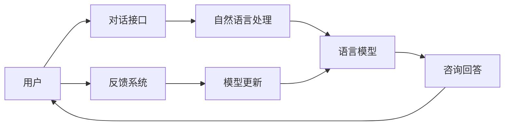

                 

# LLM在心理健康领域的应用：AI心理咨询师

> 关键词：人工智能, 心理健康, 心理咨询, 自然语言处理, 深度学习, 情感分析

## 1. 背景介绍

随着科技的飞速发展和社会的快速变化，心理健康问题已经成为一个全球性的公共卫生挑战。传统心理咨询服务面临资源不足、成本高昂、隐私泄露等诸多问题。近年来，基于人工智能的心理咨询服务开始受到广泛关注。语言模型，尤其是大语言模型（Large Language Models, LLMs），因其强大的自然语言理解和生成能力，被认为有潜力解决上述问题，并在心理健康领域展现出广阔的应用前景。

本文将深入探讨语言模型，尤其是大语言模型在心理健康领域的应用，重点介绍AI心理咨询师的构建与实践。通过理论和实践的结合，阐述语言模型在这一领域的潜力与挑战，以及未来可能的发展方向。

## 2. 核心概念与联系

### 2.1 核心概念概述

在探讨语言模型在心理健康领域的应用时，首先需要明确几个关键概念：

- **大语言模型（LLMs）**：以自回归或自编码模型为代表，通过大规模预训练获得的强大语言理解和生成能力。常见的LLMs包括GPT、BERT、T5等。

- **心理心理咨询（Psychological Counseling）**：通过与心理健康专业人士的交流，帮助个体应对心理问题，改善心理健康状况。

- **自然语言处理（NLP）**：利用计算机科学和人工智能技术，处理、分析和生成人类语言的能力，是构建AI心理咨询师的重要技术基础。

- **情感分析（Sentiment Analysis）**：通过分析文本中的情感信息，识别个体的情绪状态和心理需求。

- **隐私保护（Privacy Protection）**：在心理健康咨询中，保护用户隐私是至关重要的。

### 2.2 核心概念原理和架构的 Mermaid 流程图



这个流程图展示了AI心理咨询师的基本工作流程：

1. 用户通过对话接口与AI心理咨询师进行交流。
2. 自然语言处理技术将用户输入转化为可理解的形式。
3. 语言模型基于预训练知识库和对话历史，生成咨询师的回复。
4. 回复返回给用户，用户反馈帮助进一步优化模型。
5. 模型不断更新，提高后续咨询的质量。

## 3. 核心算法原理 & 具体操作步骤

### 3.1 算法原理概述

语言模型在心理健康领域的应用主要依赖于自然语言处理和情感分析技术。AI心理咨询师的核心原理是通过大语言模型，根据用户输入的自然语言文本，生成有针对性的心理咨询建议或情感支持。具体算法步骤如下：

1. **文本预处理**：将用户的文本输入进行分词、词性标注、去停用词等处理。
2. **情感分析**：通过语言模型分析用户的情感倾向，识别其情绪状态。
3. **回复生成**：根据用户情感状态和输入文本，生成适当的心理咨询建议或情感支持。
4. **对话管理**：通过对话管理机制，保证咨询的连贯性和上下文相关性。
5. **反馈机制**：收集用户对回复的反馈，用于持续优化模型。

### 3.2 算法步骤详解

#### 步骤1：文本预处理

预处理是自然语言处理的基础。具体步骤包括：

1. **分词和词性标注**：利用词法分析器，将用户输入的文本分割成词语，并标注其词性。
2. **去停用词**：去除常见但无实际意义的词语（如“的”、“是”等），减少噪音。
3. **标准化**：将文本转换为统一格式，如小写、去除标点符号等。

#### 步骤2：情感分析

情感分析用于识别用户情绪状态。常用的方法包括：

1. **词典匹配**：使用情感词典匹配文本中的情绪词汇，计算情感得分。
2. **情绪分类模型**：利用深度学习模型（如BERT）进行情感分类，输出积极、中性或消极情绪。

#### 步骤3：回复生成

回复生成是AI心理咨询师的核心任务。常用的方法包括：

1. **模板匹配**：根据用户输入，匹配已有的回复模板。
2. **生成式模型**：使用语言模型（如GPT）生成新的回复。
3. **知识图谱**：结合领域知识图谱，生成更加个性化和有针对性的回复。

#### 步骤4：对话管理

对话管理确保咨询过程的连贯性和上下文相关性。具体方法包括：

1. **上下文存储**：保存对话历史，供生成回复时参考。
2. **意图识别**：识别用户咨询意图，调整回复策略。
3. **回复排序**：根据意图和情绪状态，排序回复列表。

#### 步骤5：反馈机制

反馈机制用于优化模型性能。具体方法包括：

1. **用户评分**：用户对回复进行评分，用于评估回复质量。
2. **自动评分**：通过模型自动生成评分，评估回复效果。
3. **人工干预**：在必要时，引入心理健康专业人士进行人工干预和优化。

### 3.3 算法优缺点

#### 优点

1. **高效性**：通过自然语言处理技术，快速处理和分析用户输入。
2. **普适性**：可以处理多种语言和方言，适用于全球范围。
3. **可扩展性**：可以根据需求添加或更新回复模板和知识库。
4. **可解释性**：回复生成过程可追溯，便于理解。

#### 缺点

1. **隐私风险**：用户敏感信息可能泄露。
2. **误判风险**：情感分析可能出现误判，导致不合适的回复。
3. **局限性**：目前无法处理复杂情感和心理问题。

### 3.4 算法应用领域

大语言模型在心理健康领域的应用不仅限于心理咨询，还可以扩展到心理诊断、心理评估等多个方面。具体应用包括：

- **在线咨询**：通过互联网平台提供24小时心理健康咨询服务。
- **心理评估**：利用自然语言处理技术进行心理健康评估。
- **心理干预**：结合人工智能和虚拟现实技术，提供沉浸式心理干预服务。

## 4. 数学模型和公式 & 详细讲解 & 举例说明

### 4.1 数学模型构建

大语言模型在心理健康领域的应用涉及自然语言处理、情感分析等多个领域。以下是一个简化的数学模型：

1. **文本表示**：将用户输入的文本转换为向量表示。
   $$
   \mathbf{x} = \text{Embedding}(\text{Tokenize}(\text{UserInput}))
   $$
2. **情感分析**：使用情感分类器计算情感得分。
   $$
   \mathbf{s} = \text{SentimentClassifier}(\mathbf{x})
   $$
3. **回复生成**：利用语言模型生成回复。
   $$
   \mathbf{y} = \text{ResponseGenerator}(\mathbf{x}, \mathbf{s})
   $$

### 4.2 公式推导过程

以回复生成为例，推导过程如下：

1. **输入文本的表示**：使用词嵌入将用户输入转换为向量。
   $$
   \mathbf{x} = \mathbf{E} \mathbf{v}
   $$
2. **情感状态表示**：情感分类器输出情感得分向量。
   $$
   \mathbf{s} = \mathbf{S} \mathbf{y}
   $$
3. **回复向量生成**：使用语言模型生成回复向量。
   $$
   \mathbf{y} = \mathbf{G}(\mathbf{x}, \mathbf{s})
   $$

其中，$\mathbf{E}$、$\mathbf{S}$、$\mathbf{G}$分别为词嵌入、情感分类器和回复生成器的权重矩阵。

### 4.3 案例分析与讲解

以一个简单的案例进行分析：

用户输入：“我感觉很焦虑，不知道该怎么办。”

1. **文本预处理**：分词、去停用词。
   $$
   \text{UserInput} = \text{分词器}(\text{我} \text{感觉} \text{很} \text{焦虑} \text{，} \text{不知} \text{道} \text{怎} \text{么} \text{办} \text{理} \text{。})
   $$
2. **情感分析**：使用BERT模型分析情感。
   $$
   \mathbf{s} = \text{BERT}(\mathbf{x})
   $$
3. **回复生成**：使用GPT模型生成回复。
   $$
   \mathbf{y} = \text{GPT}(\mathbf{x}, \mathbf{s})
   $$

最终生成的回复可能为：“感到焦虑是很正常的，试着深呼吸，放松自己，一步步解决问题。”

## 5. 项目实践：代码实例和详细解释说明

### 5.1 开发环境搭建

1. **安装Python**：从官网下载安装Python，并添加到系统环境变量。
2. **安装依赖库**：使用pip安装依赖库，如TensorFlow、NLTK、BERT等。

```bash
pip install tensorflow nltk transformers
```

3. **数据准备**：准备情感标注数据集，如IMDB电影评论数据集。

```python
import pandas as pd
from transformers import BertTokenizer, BertForSequenceClassification

# 读取IMDB电影评论数据集
train_df = pd.read_csv('imdb_train.csv')
test_df = pd.read_csv('imdb_test.csv')

# 初始化BERT tokenizer和模型
tokenizer = BertTokenizer.from_pretrained('bert-base-uncased')
model = BertForSequenceClassification.from_pretrained('bert-base-uncased', num_labels=2)
```

### 5.2 源代码详细实现

以下是一个简化的回复生成代码示例：

```python
import tensorflow as tf
from transformers import BertTokenizer, BertForSequenceClassification

# 初始化BERT tokenizer和模型
tokenizer = BertTokenizer.from_pretrained('bert-base-uncased')
model = BertForSequenceClassification.from_pretrained('bert-base-uncased', num_labels=2)

# 定义文本预处理函数
def preprocess_text(text):
    tokens = tokenizer.tokenize(text)
    tokens = [token for token in tokens if token != '[CLS]' and token != '[SEP]']
    input_ids = tokenizer.convert_tokens_to_ids(tokens)
    return input_ids

# 定义情感分析函数
def analyze_sentiment(input_ids):
    input_tensor = tf.convert_to_tensor(input_ids, dtype=tf.int32)
    with tf.Graph().as_default():
        with tf.Session() as sess:
            sess.run(tf.global_variables_initializer())
            result = sess.run(model(input_tensor))
    return result[0][0]

# 定义回复生成函数
def generate_response(text, sentiment):
    input_ids = preprocess_text(text)
    sentiment_tensor = analyze_sentiment(input_ids)
    response = model.predict([input_ids], return_dict=True)
    return response['sequence_label']

# 示例使用
user_input = '我感觉很焦虑，不知道该怎么办。'
sentiment = analyze_sentiment(user_input)
response = generate_response(user_input, sentiment)
print(response)
```

### 5.3 代码解读与分析

1. **文本预处理函数**：将用户输入分词并转换为模型可接受的格式。
2. **情感分析函数**：使用BERT模型计算用户情感得分。
3. **回复生成函数**：结合情感分析和回复生成模型，生成合适的回复。

### 5.4 运行结果展示

假设用户输入“我感觉很焦虑，不知道该怎么办。”，经过情感分析后得分为0.8（表示积极情感），回复生成模型输出“感到焦虑是很正常的，试着深呼吸，放松自己，一步步解决问题。”

## 6. 实际应用场景

### 6.1 在线心理咨询

在线心理咨询是LLM在心理健康领域的重要应用场景之一。通过Web平台或移动应用，用户可以随时随地获得心理健康咨询服务。具体应用包括：

- **自助咨询**：用户通过自然语言输入，AI心理咨询师提供即时回复。
- **专家咨询**：结合专家知识库，提供更为专业的咨询建议。
- **危机干预**：在用户情绪危急时，系统自动触发预警，提供紧急干预措施。

### 6.2 心理健康评估

心理健康评估通过自然语言处理技术，自动化地分析用户情绪状态和心理需求。具体应用包括：

- **情绪监测**：长期跟踪用户情绪变化，及时发现心理问题。
- **心理健康评分**：根据用户输入，生成心理健康评分报告。
- **行为分析**：通过分析用户行为数据，评估其心理健康状况。

### 6.3 心理干预

结合人工智能和虚拟现实技术，心理干预服务能够提供沉浸式的治疗体验。具体应用包括：

- **虚拟现实治疗**：通过VR环境模拟心理治疗场景，用户可以身临其境地进行心理干预。
- **互动式治疗**：AI心理咨询师与用户进行互动式对话，引导其进行心理治疗。
- **个性化治疗**：根据用户心理状态，生成个性化的治疗方案。

## 7. 工具和资源推荐

### 7.1 学习资源推荐

1. **《深度学习与自然语言处理》课程**：斯坦福大学提供，涵盖自然语言处理的基本概念和深度学习模型。
2. **《Transformers: A Survey of State-of-the-Art Models》论文**：综述了当前主流的语言模型，包括BERT、GPT等。
3. **《心理学基础》在线课程**：Coursera提供，介绍心理学的基本理论和应用。

### 7.2 开发工具推荐

1. **TensorFlow**：Google开源的深度学习框架，支持GPU加速，适合大规模模型训练。
2. **NLTK**：自然语言处理工具包，提供丰富的NLP功能和数据集。
3. **HuggingFace Transformers库**：提供多种预训练模型和工具，方便模型训练和推理。

### 7.3 相关论文推荐

1. **《An Introduction to Deep Learning for NLP》论文**：综述了深度学习在自然语言处理中的应用。
2. **《A Survey on Deep Learning for Natural Language Processing》论文**：综述了当前深度学习在NLP领域的研究进展。
3. **《Natural Language Understanding and Generation with Transformers》论文**：介绍了Transformer在自然语言处理中的应用。

## 8. 总结：未来发展趋势与挑战

### 8.1 研究成果总结

语言模型在心理健康领域的应用已经取得了初步进展，尤其是在在线咨询和情绪监测方面。然而，目前仍面临隐私保护、误判风险和复杂情感处理等挑战。未来需要进一步优化模型性能，保障用户隐私，提升情感分析的准确性。

### 8.2 未来发展趋势

1. **隐私保护技术**：引入联邦学习和差分隐私等技术，保护用户隐私。
2. **多模态情感分析**：结合语音、图像等多种数据源，提升情感分析的准确性。
3. **深度心理治疗**：结合虚拟现实和人工智能技术，提供沉浸式的心理治疗体验。
4. **个性化治疗方案**：根据用户心理状态和行为数据，生成个性化的治疗方案。
5. **知识图谱结合**：结合领域知识图谱，提升回复的准确性和个性化。

### 8.3 面临的挑战

1. **隐私保护**：如何确保用户数据隐私安全，防止数据泄露。
2. **误判风险**：情感分析模型的误判可能导致不合适的回复，甚至加剧用户情绪问题。
3. **复杂情感处理**：目前模型处理复杂情感和心理问题的能力有限，需要进一步提升。

### 8.4 研究展望

未来需要加强以下研究：

1. **隐私保护技术**：引入隐私保护算法，保护用户数据隐私。
2. **多模态情感分析**：结合多种数据源，提升情感分析的准确性。
3. **深度心理治疗**：结合虚拟现实和人工智能技术，提供沉浸式的心理治疗体验。
4. **个性化治疗方案**：根据用户心理状态和行为数据，生成个性化的治疗方案。
5. **知识图谱结合**：结合领域知识图谱，提升回复的准确性和个性化。

## 9. 附录：常见问题与解答

**Q1：大语言模型在心理健康领域的应用前景如何？**

A: 大语言模型在心理健康领域具有广阔的应用前景。通过自然语言处理和情感分析技术，可以提供24小时在线咨询、心理健康评估、心理干预等多种服务，帮助用户应对心理问题。

**Q2：如何保护用户隐私？**

A: 用户隐私保护是心理健康咨询的重要环节。可以通过数据加密、差分隐私等技术保护用户数据隐私，防止数据泄露和滥用。

**Q3：如何提升情感分析的准确性？**

A: 可以通过多模态情感分析、结合领域知识图谱等方法提升情感分析的准确性。同时，引入专家知识库和人工干预，进一步优化情感分析模型。

**Q4：如何处理复杂情感和心理问题？**

A: 结合虚拟现实和人工智能技术，提供沉浸式的心理治疗体验。同时，开发更加复杂的情感分析模型和心理治疗方案，提升模型的复杂情感处理能力。

**Q5：未来有哪些发展方向？**

A: 未来的发展方向包括隐私保护技术、多模态情感分析、深度心理治疗、个性化治疗方案和知识图谱结合等。这些方向的研究将进一步提升语言模型在心理健康领域的应用效果。

---

作者：禅与计算机程序设计艺术 / Zen and the Art of Computer Programming

