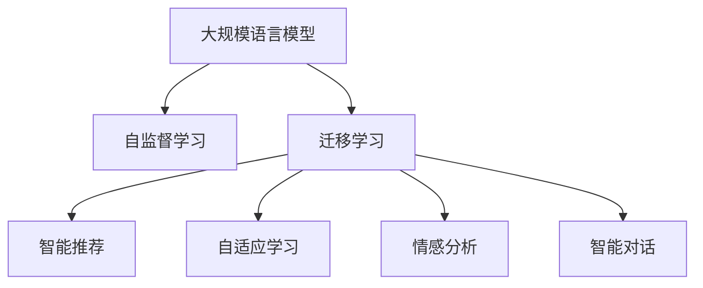

                 

# LLM在智能学习系统中的潜力

> 关键词：智能学习系统, 大规模语言模型(LLM), 深度学习, 教育科技, 个性化推荐, 自适应学习

## 1. 背景介绍

### 1.1 问题由来

随着信息时代的到来，教育和学习方式正在经历着前所未有的变革。传统教育模式中，知识传授主要依赖教师，缺乏个性化和互动性。而智能学习系统则通过数据驱动和算法优化，为每个学生提供个性化的学习路径和资源，大幅提升了学习的效率和效果。

近年来，随着深度学习和大规模语言模型的迅速发展，智能学习系统的智能化水平得到了显著提升。尤其是大规模语言模型(LLM)的引入，使得智能学习系统能够更好地理解和适应学生的学习行为，提供更精准、高效、个性化的学习体验。

### 1.2 问题核心关键点

智能学习系统中的大规模语言模型主要应用于以下几个方面：

- 智能推荐：根据学生的兴趣和学习进度，推荐合适的学习内容。
- 自适应学习：根据学生的反馈和表现，动态调整学习内容和难度。
- 情感分析：通过分析学生的情绪和态度，及时调整教学策略和内容。
- 智能对话：通过与学生的自然对话，解决学习中的疑难问题。

## 2. 核心概念与联系

### 2.1 核心概念概述

为更好地理解LLM在智能学习系统中的应用，本节将介绍几个密切相关的核心概念：

- 大规模语言模型(LLM)：以自回归(如GPT)或自编码(如BERT)模型为代表的大规模预训练语言模型。通过在大规模无标签文本语料上进行预训练，学习通用的语言表示，具备强大的语言理解和生成能力。

- 自监督学习(Self-Supervised Learning)：一种无需人工标注的机器学习方法，通过在大规模无标签数据上设计预测任务，自动学习模型的表示能力。常见的自监督任务包括掩码语言模型、next sentence prediction等。

- 迁移学习(Transfer Learning)：指将一个领域学习到的知识，迁移应用到另一个不同但相关的领域的学习范式。大模型的预训练-微调过程即是一种典型的迁移学习方式。

- 个性化推荐：通过分析学生的学习行为和偏好，推荐合适的学习内容，提升学习效果。

- 自适应学习：根据学生的反馈和表现，动态调整学习内容和难度，以适应不同学生的学习速度和兴趣。

- 智能对话：通过自然语言处理技术，使智能学习系统能够与学生进行自然对话，解答问题，提供指导。

- 自监督学习与监督学习：自监督学习通过无标签数据训练模型，而监督学习则通过有标签数据优化模型。在智能学习系统中，两种方法往往需要结合使用，以充分利用数据的价值。

这些核心概念之间的逻辑关系可以通过以下Mermaid流程图来展示：



这个流程图展示了大语言模型在智能学习系统中的应用框架：

1. 大语言模型通过自监督学习获得语言表示能力。
2. 迁移学习使得通用语言模型能够适应特定领域的学习任务。
3. 智能推荐、自适应学习、情感分析和智能对话等功能，都是基于迁移学习后的大模型进行微调或接口应用，进一步提升系统的智能化水平。

## 3. 核心算法原理 & 具体操作步骤
### 3.1 算法原理概述

基于大规模语言模型(LLM)的智能学习系统，本质上是一种数据驱动的个性化学习推荐系统。其核心思想是：利用大模型的强大语言理解能力，分析学生的学习行为和需求，推荐合适的学习内容，提供个性化的学习路径。

形式化地，假设系统中有 $N$ 名学生，每个学生的学习进度和兴趣可以用向量 $\mathbf{x}_i \in \mathbb{R}^d$ 表示，其中 $d$ 为特征维度。通过学生-内容矩阵 $X \in \mathbb{R}^{N \times d}$ 记录每个学生的学习行为和偏好。系统通过LLM模型 $M_{\theta}$ 计算学生对每个学习内容 $C \in \mathbb{R}^d$ 的兴趣度，构建兴趣矩阵 $I \in \mathbb{R}^{N \times N}$。根据兴趣矩阵，推荐系统能够动态调整推荐内容，使得每个学生都能获得最适合自身的学习路径。

### 3.2 算法步骤详解

基于大规模语言模型的智能学习系统的一般流程如下：

**Step 1: 数据收集与预处理**

- 收集学生的学习行为数据，如阅读时长、答题次数、成绩等，构建学生-内容矩阵 $X$。
- 将学习内容进行编码，构建内容-特征矩阵 $C$。
- 对学生和内容特征进行归一化处理，使得数据适合模型输入。

**Step 2: 构建兴趣矩阵**

- 利用预训练的大语言模型 $M_{\theta}$ 计算每个学生对每个学习内容的兴趣度。
- 计算兴趣矩阵 $I$，其中 $I_{i,j}$ 表示学生 $i$ 对内容 $j$ 的兴趣度。

**Step 3: 推荐系统设计**

- 根据兴趣矩阵 $I$ 和学生-内容矩阵 $X$，设计推荐算法。
- 常见的推荐算法包括协同过滤、基于内容的推荐、混合推荐等。
- 利用推荐算法计算每个学生对每个学习内容的推荐分数 $R$。

**Step 4: 动态调整推荐内容**

- 根据推荐分数 $R$，动态调整推荐内容，使其更加符合学生的学习需求和进度。
- 通过反馈机制收集学生的学习反馈，不断调整兴趣矩阵 $I$ 和推荐分数 $R$。

**Step 5: 实时学习反馈**

- 收集学生的实时学习反馈，如点击率、学习时长等，实时调整推荐内容和策略。
- 通过在线学习算法更新大语言模型参数，以提高推荐系统的精度和效果。

### 3.3 算法优缺点

基于大规模语言模型的智能学习系统具有以下优点：

- 个性化推荐：利用大模型的语言表示能力，可以针对每个学生的特点和需求，推荐最合适的学习内容。
- 自适应学习：动态调整学习内容和难度，以适应学生的学习速度和兴趣。
- 情感分析：通过分析学生的情绪和态度，及时调整教学策略和内容，提高学习效果。
- 智能对话：通过自然语言处理技术，使智能学习系统能够与学生进行自然对话，解答问题，提供指导。

同时，该系统也存在一定的局限性：

- 数据隐私问题：收集和处理学生数据需要考虑隐私保护和数据安全。
- 模型复杂性：大规模语言模型的训练和优化需要大量的计算资源。
- 实时性要求：实时调整推荐内容对系统的计算能力和响应速度提出了较高要求。
- 公平性问题：推荐算法可能存在偏见，导致某些学生被不公平对待。

尽管存在这些局限性，但就目前而言，基于大规模语言模型的智能学习系统仍是大规模个性化推荐和自适应学习的重要手段。未来相关研究的重点在于如何进一步降低系统对标注数据的依赖，提高模型的少样本学习和跨领域迁移能力，同时兼顾可解释性和伦理安全性等因素。

### 3.4 算法应用领域

基于大规模语言模型的智能学习系统已经在诸多领域得到了广泛应用，例如：

- 在线教育：如Khan Academy、Coursera等在线教育平台，通过智能推荐和自适应学习，提升学习效果。
- 企业培训：如Udacity、LinkedIn Learning等，利用个性化推荐和智能对话，提供定制化培训课程。
- 学术研究：如Google Scholar、Semantic Scholar等，通过智能推荐和情感分析，提高学术研究的效率和质量。
- 语言学习：如Duolingo、Memrise等，利用智能推荐和智能对话，提供语言学习资源。

除了上述这些经典应用外，智能学习系统还在更多场景中得到了创新性的应用，如个性化职业规划、在线测评、虚拟实验室等，为教育和学习带来了全新的突破。随着深度学习和大规模语言模型的不断进步，智能学习系统的智能化水平将进一步提升，为人类认知智能的进化带来深远影响。

## 4. 数学模型和公式 & 详细讲解  
### 4.1 数学模型构建

本节将使用数学语言对基于大规模语言模型的智能学习系统进行更加严格的刻画。

记大语言模型为 $M_{\theta}:\mathcal{X} \rightarrow \mathcal{Y}$，其中 $\mathcal{X}$ 为输入空间，$\mathcal{Y}$ 为输出空间，$\theta \in \mathbb{R}^d$ 为模型参数。假设系统中有 $N$ 名学生，每个学生的学习进度和兴趣可以用向量 $\mathbf{x}_i \in \mathbb{R}^d$ 表示，其中 $d$ 为特征维度。通过学生-内容矩阵 $X \in \mathbb{R}^{N \times d}$ 记录每个学生的学习行为和偏好。

定义兴趣矩阵 $I \in \mathbb{R}^{N \times N}$，其中 $I_{i,j}$ 表示学生 $i$ 对内容 $j$ 的兴趣度。系统通过兴趣矩阵 $I$ 和学生-内容矩阵 $X$，计算每个学生对每个学习内容的推荐分数 $R \in \mathbb{R}^{N \times d}$。

最终的推荐内容 $C^*$ 通过优化目标函数 $\mathcal{L}$ 确定，即：

$$
\hat{C}^* = \mathop{\arg\min}_{C} \mathcal{L}(I, R, C)
$$

其中 $\mathcal{L}$ 为损失函数，用于衡量推荐结果与真实标签之间的差异。常见的损失函数包括均方误差损失、交叉熵损失等。

### 4.2 公式推导过程

以下我们以二分类任务为例，推导交叉熵损失函数及其梯度的计算公式。

假设模型 $M_{\theta}$ 在输入 $\mathbf{x}_i$ 上的输出为 $\hat{y}=M_{\theta}(\mathbf{x}_i) \in [0,1]$，表示学生 $i$ 对内容 $j$ 的兴趣度。真实标签 $y \in \{0,1\}$。则二分类交叉熵损失函数定义为：

$$
\ell(M_{\theta}(\mathbf{x}_i),y) = -[y\log \hat{y} + (1-y)\log (1-\hat{y})]
$$

将其代入损失函数公式，得：

$$
\mathcal{L}(I, R, C) = -\frac{1}{N}\sum_{i=1}^N \sum_{j=1}^N [y_i\log \hat{y}_{i,j} + (1-y_i)\log (1-\hat{y}_{i,j})]
$$

其中 $\hat{y}_{i,j}$ 为模型预测的学生 $i$ 对内容 $j$ 的兴趣度。根据链式法则，损失函数对参数 $\theta_k$ 的梯度为：

$$
\frac{\partial \mathcal{L}(I, R, C)}{\partial \theta_k} = -\frac{1}{N}\sum_{i=1}^N \sum_{j=1}^N (\frac{y_i}{\hat{y}_{i,j}}-\frac{1-y_i}{1-\hat{y}_{i,j}}) \frac{\partial \hat{y}_{i,j}}{\partial \theta_k}
$$

其中 $\frac{\partial \hat{y}_{i,j}}{\partial \theta_k}$ 可进一步递归展开，利用自动微分技术完成计算。

在得到损失函数的梯度后，即可带入参数更新公式，完成模型的迭代优化。重复上述过程直至收敛，最终得到适应推荐任务的最优模型参数 $\theta^*$。

## 5. 项目实践：代码实例和详细解释说明
### 5.1 开发环境搭建

在进行智能学习系统开发前，我们需要准备好开发环境。以下是使用Python进行PyTorch开发的环境配置流程：

1. 安装Anaconda：从官网下载并安装Anaconda，用于创建独立的Python环境。

2. 创建并激活虚拟环境：
```bash
conda create -n pytorch-env python=3.8 
conda activate pytorch-env
```

3. 安装PyTorch：根据CUDA版本，从官网获取对应的安装命令。例如：
```bash
conda install pytorch torchvision torchaudio cudatoolkit=11.1 -c pytorch -c conda-forge
```

4. 安装Transformers库：
```bash
pip install transformers
```

5. 安装各类工具包：
```bash
pip install numpy pandas scikit-learn matplotlib tqdm jupyter notebook ipython
```

完成上述步骤后，即可在`pytorch-env`环境中开始智能学习系统的开发。

### 5.2 源代码详细实现

下面我们以推荐系统为例，给出使用Transformers库对BERT模型进行推荐任务开发的PyTorch代码实现。

首先，定义推荐系统的数据处理函数：

```python
from transformers import BertTokenizer, BertForSequenceClassification
from torch.utils.data import Dataset
import torch

class RecommendationDataset(Dataset):
    def __init__(self, texts, interests, tokenizer, max_len=128):
        self.texts = texts
        self.interests = interests
        self.tokenizer = tokenizer
        self.max_len = max_len
        
    def __len__(self):
        return len(self.texts)
    
    def __getitem__(self, item):
        text = self.texts[item]
        interest = self.interests[item]
        
        encoding = self.tokenizer(text, return_tensors='pt', max_length=self.max_len, padding='max_length', truncation=True)
        input_ids = encoding['input_ids'][0]
        attention_mask = encoding['attention_mask'][0]
        
        # 对兴趣度进行编码
        encoded_interest = [1 if i == 1 else 0 for i in interest] 
        encoded_interest.extend([0] * (self.max_len - len(encoded_interest)))
        labels = torch.tensor(encoded_interest, dtype=torch.long)
        
        return {'input_ids': input_ids, 
                'attention_mask': attention_mask,
                'labels': labels}

# 定义推荐系统
tokenizer = BertTokenizer.from_pretrained('bert-base-cased')

train_dataset = RecommendationDataset(train_texts, train_interests, tokenizer)
dev_dataset = RecommendationDataset(dev_texts, dev_interests, tokenizer)
test_dataset = RecommendationDataset(test_texts, test_interests, tokenizer)

model = BertForSequenceClassification.from_pretrained('bert-base-cased', num_labels=2)

optimizer = AdamW(model.parameters(), lr=2e-5)
```

然后，定义训练和评估函数：

```python
from torch.utils.data import DataLoader
from tqdm import tqdm
from sklearn.metrics import accuracy_score

device = torch.device('cuda') if torch.cuda.is_available() else torch.device('cpu')
model.to(device)

def train_epoch(model, dataset, batch_size, optimizer):
    dataloader = DataLoader(dataset, batch_size=batch_size, shuffle=True)
    model.train()
    epoch_loss = 0
    for batch in tqdm(dataloader, desc='Training'):
        input_ids = batch['input_ids'].to(device)
        attention_mask = batch['attention_mask'].to(device)
        labels = batch['labels'].to(device)
        model.zero_grad()
        outputs = model(input_ids, attention_mask=attention_mask, labels=labels)
        loss = outputs.loss
        epoch_loss += loss.item()
        loss.backward()
        optimizer.step()
    return epoch_loss / len(dataloader)

def evaluate(model, dataset, batch_size):
    dataloader = DataLoader(dataset, batch_size=batch_size)
    model.eval()
    preds, labels = [], []
    with torch.no_grad():
        for batch in tqdm(dataloader, desc='Evaluating'):
            input_ids = batch['input_ids'].to(device)
            attention_mask = batch['attention_mask'].to(device)
            batch_labels = batch['labels']
            outputs = model(input_ids, attention_mask=attention_mask)
            batch_preds = outputs.logits.argmax(dim=2).to('cpu').tolist()
            batch_labels = batch_labels.to('cpu').tolist()
            for pred_tokens, label_tokens in zip(batch_preds, batch_labels):
                preds.append(pred_tokens[:len(label_tokens)])
                labels.append(label_tokens)
                
    print('Accuracy:', accuracy_score(labels, preds))
```

最后，启动训练流程并在测试集上评估：

```python
epochs = 5
batch_size = 16

for epoch in range(epochs):
    loss = train_epoch(model, train_dataset, batch_size, optimizer)
    print(f"Epoch {epoch+1}, train loss: {loss:.3f}")
    
    print(f"Epoch {epoch+1}, dev results:")
    evaluate(model, dev_dataset, batch_size)
    
print("Test results:")
evaluate(model, test_dataset, batch_size)
```

以上就是使用PyTorch对BERT进行推荐任务微调的完整代码实现。可以看到，得益于Transformers库的强大封装，我们可以用相对简洁的代码完成BERT模型的加载和微调。

### 5.3 代码解读与分析

让我们再详细解读一下关键代码的实现细节：

**RecommendationDataset类**：
- `__init__`方法：初始化文本、兴趣度等关键组件。
- `__len__`方法：返回数据集的样本数量。
- `__getitem__`方法：对单个样本进行处理，将文本输入编码为token ids，将兴趣度编码为数字，并对其进行定长padding，最终返回模型所需的输入。

**交叉熵损失函数**：
- 使用二分类交叉熵损失函数，计算模型预测兴趣度与真实标签之间的差异。

**训练和评估函数**：
- 使用PyTorch的DataLoader对数据集进行批次化加载，供模型训练和推理使用。
- 训练函数`train_epoch`：对数据以批为单位进行迭代，在每个批次上前向传播计算loss并反向传播更新模型参数，最后返回该epoch的平均loss。
- 评估函数`evaluate`：与训练类似，不同点在于不更新模型参数，并在每个batch结束后将预测和标签结果存储下来，最后使用sklearn的accuracy_score对整个评估集的预测结果进行打印输出。

**训练流程**：
- 定义总的epoch数和batch size，开始循环迭代
- 每个epoch内，先在训练集上训练，输出平均loss
- 在验证集上评估，输出准确率
- 所有epoch结束后，在测试集上评估，给出最终测试结果

可以看到，PyTorch配合Transformers库使得BERT微调的代码实现变得简洁高效。开发者可以将更多精力放在数据处理、模型改进等高层逻辑上，而不必过多关注底层的实现细节。

当然，工业级的系统实现还需考虑更多因素，如模型的保存和部署、超参数的自动搜索、更灵活的任务适配层等。但核心的微调范式基本与此类似。

## 6. 实际应用场景
### 6.1 智能推荐系统

基于大规模语言模型的智能推荐系统，已经在电商、新闻、音乐等领域得到了广泛应用。通过分析用户的浏览行为和反馈，推荐系统能够实时调整推荐内容，提升用户体验和转化率。

在技术实现上，可以收集用户的浏览记录、评分、评论等数据，构建用户行为矩阵 $X$ 和内容特征矩阵 $C$。通过预训练的大语言模型 $M_{\theta}$ 计算用户对内容的兴趣度 $I$，然后根据兴趣度矩阵和用户行为矩阵构建推荐分数 $R$。将推荐分数输入推荐算法，得到最终推荐内容 $C^*$。在实际应用中，推荐系统可以采用协同过滤、基于内容的推荐、混合推荐等多种策略，提升推荐效果。

### 6.2 自适应学习系统

自适应学习系统能够根据学生的学习进度和兴趣，动态调整学习内容和难度，提供个性化的学习路径。通过收集学生的实时反馈和表现，系统能够不断优化推荐内容和策略。

在技术实现上，可以构建学生-内容矩阵 $X$，利用预训练的大语言模型 $M_{\theta}$ 计算每个学生对每个学习内容的兴趣度 $I$。然后根据兴趣度矩阵和学生行为矩阵构建推荐分数 $R$，最后根据推荐分数动态调整学习内容和难度。

### 6.3 智能对话系统

智能对话系统通过自然语言处理技术，使智能学习系统能够与学生进行自然对话，解答问题，提供指导。通过分析学生的提问和回答，系统能够不断优化对话策略，提升用户体验。

在技术实现上，可以使用预训练的对话模型，如GPT-3，构建对话系统。系统能够根据学生的问题，从知识库中匹配最合适的答案，并能够进行多轮对话。通过实时收集学生的反馈和对话记录，系统能够不断优化对话策略，提升对话效果。

### 6.4 未来应用展望

随着深度学习和大规模语言模型的不断发展，基于大规模语言模型的智能学习系统将在更多领域得到应用，为教育和学习带来变革性影响。

在智慧医疗领域，基于大语言模型的智能推荐系统可以推荐合适的医疗资源和信息，帮助患者更快地找到合适的医生和医院。在智能教育领域，微调后的模型可以用于智能辅助教学、在线测评等，提升教育质量。

在智慧城市治理中，基于大语言模型的智能对话系统可以用于智能客服、应急指挥等环节，提高城市管理的自动化和智能化水平。在企业培训领域，微调后的模型可以用于员工培训、绩效评估等，提升企业培训的效果。

此外，在智能推荐、自适应学习、智能对话等众多领域，基于大语言模型的智能学习系统必将带来更多的创新应用，为教育和学习带来全新的突破。相信随着技术的日益成熟，基于大规模语言模型的智能学习系统必将在构建人机协同的智能时代中扮演越来越重要的角色。

## 7. 工具和资源推荐
### 7.1 学习资源推荐

为了帮助开发者系统掌握大语言模型在智能学习系统中的应用，这里推荐一些优质的学习资源：

1. 《Transformer从原理到实践》系列博文：由大模型技术专家撰写，深入浅出地介绍了Transformer原理、BERT模型、智能推荐范式等前沿话题。

2. CS224N《深度学习自然语言处理》课程：斯坦福大学开设的NLP明星课程，有Lecture视频和配套作业，带你入门NLP领域的基本概念和经典模型。

3. 《Natural Language Processing with Transformers》书籍：Transformers库的作者所著，全面介绍了如何使用Transformers库进行NLP任务开发，包括智能推荐在内的诸多范式。

4. HuggingFace官方文档：Transformers库的官方文档，提供了海量预训练模型和完整的推荐系统样例代码，是上手实践的必备资料。

5. Kaggle在线竞赛：提供大量推荐系统、自适应学习等NLP领域的比赛，可以实践和验证模型的效果，积累经验。

通过对这些资源的学习实践，相信你一定能够快速掌握大语言模型在智能学习系统中的应用，并用于解决实际的NLP问题。
###  7.2 开发工具推荐

高效的开发离不开优秀的工具支持。以下是几款用于大语言模型在智能学习系统中应用的常用工具：

1. PyTorch：基于Python的开源深度学习框架，灵活动态的计算图，适合快速迭代研究。大部分预训练语言模型都有PyTorch版本的实现。

2. TensorFlow：由Google主导开发的开源深度学习框架，生产部署方便，适合大规模工程应用。同样有丰富的预训练语言模型资源。

3. Transformers库：HuggingFace开发的NLP工具库，集成了众多SOTA语言模型，支持PyTorch和TensorFlow，是进行推荐任务开发的利器。

4. Weights & Biases：模型训练的实验跟踪工具，可以记录和可视化模型训练过程中的各项指标，方便对比和调优。与主流深度学习框架无缝集成。

5. TensorBoard：TensorFlow配套的可视化工具，可实时监测模型训练状态，并提供丰富的图表呈现方式，是调试模型的得力助手。

6. Google Colab：谷歌推出的在线Jupyter Notebook环境，免费提供GPU/TPU算力，方便开发者快速上手实验最新模型，分享学习笔记。

合理利用这些工具，可以显著提升大语言模型在智能学习系统中的应用效率，加快创新迭代的步伐。

### 7.3 相关论文推荐

大语言模型在智能学习系统中的应用源于学界的持续研究。以下是几篇奠基性的相关论文，推荐阅读：

1. Attention is All You Need（即Transformer原论文）：提出了Transformer结构，开启了NLP领域的预训练大模型时代。

2. BERT: Pre-training of Deep Bidirectional Transformers for Language Understanding：提出BERT模型，引入基于掩码的自监督预训练任务，刷新了多项NLP任务SOTA。

3. Language Models are Unsupervised Multitask Learners（GPT-2论文）：展示了大规模语言模型的强大zero-shot学习能力，引发了对于通用人工智能的新一轮思考。

4. Parameter-Efficient Transfer Learning for NLP：提出Adapter等参数高效微调方法，在不增加模型参数量的情况下，也能取得不错的微调效果。

5. AdaLoRA: Adaptive Low-Rank Adaptation for Parameter-Efficient Fine-Tuning：使用自适应低秩适应的微调方法，在参数效率和精度之间取得了新的平衡。

这些论文代表了大语言模型在智能学习系统中的应用发展脉络。通过学习这些前沿成果，可以帮助研究者把握学科前进方向，激发更多的创新灵感。

## 8. 总结：未来发展趋势与挑战
### 8.1 总结

本文对基于大规模语言模型的智能学习系统进行了全面系统的介绍。首先阐述了LLM在智能学习系统中的作用，明确了其在智能推荐、自适应学习、智能对话等任务中的应用价值。其次，从原理到实践，详细讲解了系统的一般流程和关键技术，给出了具体的代码实现。同时，本文还广泛探讨了智能学习系统的未来发展方向和可能面临的挑战。

通过本文的系统梳理，可以看到，基于大语言模型的智能学习系统正在成为NLP技术的重要应用范式，极大地提升了教育和学习系统的智能化水平。未来，伴随深度学习和大规模语言模型的不断进步，智能学习系统必将在更多领域得到应用，为人类认知智能的进化带来深远影响。

### 8.2 未来发展趋势

展望未来，智能学习系统中的大规模语言模型将呈现以下几个发展趋势：

1. 模型规模持续增大。随着算力成本的下降和数据规模的扩张，预训练语言模型的参数量还将持续增长。超大批次的训练和推理也将成为可能。

2. 微调方法日趋多样。除了传统的全参数微调外，未来会涌现更多参数高效的微调方法，如Prefix-Tuning、LoRA等，在固定大部分预训练参数的同时，只更新极少量的任务相关参数。

3. 自适应学习成为常态。智能学习系统能够根据学生的实时反馈和表现，动态调整学习内容和难度，以适应不同学生的学习速度和兴趣。

4. 多模态学习崛起。智能学习系统可以融合视觉、语音、文本等多模态信息，提供更全面、准确的学习推荐。

5. 智能化程度提升。智能学习系统能够更深入地理解学生的学习行为和需求，提供更精准、高效、个性化的学习体验。

6. 伦理和安全问题重视。智能学习系统需要充分考虑数据隐私、模型偏见、安全防护等问题，保障学生和系统的安全。

这些趋势凸显了智能学习系统中的大规模语言模型的广泛应用前景，未来的研究需要在技术、伦理、应用等多个方面进行协同探索。

### 8.3 面临的挑战

尽管智能学习系统中的大规模语言模型已经取得了瞩目成就，但在迈向更加智能化、普适化应用的过程中，它仍面临着诸多挑战：

1. 数据隐私问题。收集和处理学生数据需要考虑隐私保护和数据安全，防止数据泄露和滥用。

2. 模型鲁棒性不足。智能学习系统面临的测试样本通常复杂多样，模型容易受到输入扰动的影响，泛化能力有限。

3. 实时性要求高。实时调整推荐内容和策略对系统的计算能力和响应速度提出了较高要求。

4. 公平性问题。推荐算法可能存在偏见，导致某些学生被不公平对待。

5. 知识整合能力不足。智能学习系统难以灵活吸收和运用更广泛的先验知识，无法整合多源信息。

6. 可解释性不足。智能学习系统通常是"黑盒"系统，难以解释其内部工作机制和决策逻辑，难以进行调试和优化。

尽管存在这些挑战，但通过不断的研究和实践，这些问题有望逐步得到解决。未来的研究需要从数据、算法、工程、伦理等多个维度进行协同探索，以提升智能学习系统的智能化水平和应用价值。

### 8.4 研究展望

未来的研究可以在以下几个方向上进行：

1. 探索无监督和半监督微调方法。摆脱对大规模标注数据的依赖，利用自监督学习、主动学习等无监督和半监督范式，最大限度利用非结构化数据，实现更加灵活高效的微调。

2. 研究参数高效和计算高效的微调范式。开发更加参数高效的微调方法，在固定大部分预训练参数的同时，只更新极少量的任务相关参数。同时优化微调模型的计算图，减少前向传播和反向传播的资源消耗，实现更加轻量级、实时性的部署。

3. 融合因果和对比学习范式。通过引入因果推断和对比学习思想，增强智能学习系统建立稳定因果关系的能力，学习更加普适、鲁棒的语言表征，从而提升模型泛化性和抗干扰能力。

4. 引入更多先验知识。将符号化的先验知识，如知识图谱、逻辑规则等，与神经网络模型进行巧妙融合，引导智能学习系统的微调过程学习更准确、合理的语言模型。

5. 结合因果分析和博弈论工具。将因果分析方法引入智能学习系统，识别出模型决策的关键特征，增强输出解释的因果性和逻辑性。借助博弈论工具刻画人机交互过程，主动探索并规避模型的脆弱点，提高系统稳定性。

6. 纳入伦理道德约束。在模型训练目标中引入伦理导向的评估指标，过滤和惩罚有偏见、有害的输出倾向。同时加强人工干预和审核，建立模型行为的监管机制，确保输出符合人类价值观和伦理道德。

这些研究方向将推动智能学习系统中的大规模语言模型在更多领域得到应用，为教育和学习带来全新的突破。相信随着学界和产业界的共同努力，这些问题终将一一被克服，智能学习系统必将在构建人机协同的智能时代中扮演越来越重要的角色。

## 9. 附录：常见问题与解答

**Q1：如何提升智能学习系统中的推荐效果？**

A: 推荐系统的效果主要取决于用户行为数据和模型选择。以下是几种提升推荐效果的方法：
1. 收集更多的用户行为数据，包括浏览记录、评分、评论等。
2. 使用多种推荐算法，如协同过滤、基于内容的推荐、混合推荐等。
3. 优化模型参数，使用AdamW等优化器，调整学习率等超参数。
4. 引入先验知识，如知识图谱、逻辑规则等，增强模型的知识整合能力。
5. 考虑用户的反馈和互动，实时调整推荐策略。

**Q2：智能学习系统中的大语言模型如何动态调整学习内容和难度？**

A: 智能学习系统中的大语言模型可以通过以下方法动态调整学习内容和难度：
1. 收集学生的实时反馈和表现，如点击率、学习时长等。
2. 根据反馈调整推荐分数和兴趣度，重新计算学习内容和难度。
3. 引入自适应学习算法，根据学生的学习进度和兴趣，动态调整内容难度。
4. 使用自监督学习技术，不断优化模型的语言表示能力，提升推荐效果。

**Q3：智能学习系统中的大语言模型如何处理多模态数据？**

A: 智能学习系统中的大语言模型可以通过以下方法处理多模态数据：
1. 融合视觉、语音、文本等多模态数据，构建统一的数据表示。
2. 使用多模态自监督学习任务，如视觉描述生成、语音情感识别等，训练模型对多模态数据进行建模。
3. 引入多模态推荐算法，如融合视觉、语音、文本信息的多模态推荐系统。
4. 设计多模态学习策略，如跨模态联合训练、多模态协同优化等，提高系统的智能化水平。

**Q4：智能学习系统中的大语言模型如何保证数据隐私和安全性？**

A: 智能学习系统中的大语言模型可以通过以下方法保证数据隐私和安全性：
1. 采用差分隐私技术，对用户数据进行匿名化处理，防止数据泄露。
2. 设计隐私保护算法，如联邦学习、分布式训练等，保护用户数据的隐私。
3. 加强数据访问控制，确保只有授权人员可以访问用户数据。
4. 设计安全的推荐算法，防止模型被恶意利用。

**Q5：智能学习系统中的大语言模型如何解释其决策过程？**

A: 智能学习系统中的大语言模型可以通过以下方法解释其决策过程：
1. 引入可解释性技术，如特征重要性分析、模型可视化等，解释模型的内部决策机制。
2. 设计可解释性强的模型，如基于规则的模型、逻辑回归等，提供更直观的决策解释。
3. 引入因果分析工具，识别模型决策的关键特征，增强输出解释的因果性和逻辑性。

这些方法可以帮助智能学习系统中的大语言模型更好地理解用户需求，提升系统的可信度和透明度。

---

作者：禅与计算机程序设计艺术 / Zen and the Art of Computer Programming

