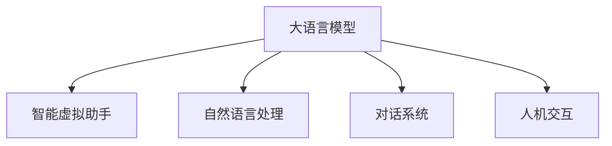

                 

# LLM在智能虚拟助手中的应用探索

> 关键词：大语言模型,智能虚拟助手,自然语言处理,对话系统,人机交互,用户体验,机器学习,人工智能

## 1. 背景介绍

### 1.1 问题由来

在现代社会，人们的生活节奏加快，面对工作、学习、生活等各个方面的挑战，对智能辅助系统的需求日益增长。传统的客服热线、人工智能聊天机器人等系统，已经难以满足用户对于即时响应、高效交互和个性化服务的需求。智能虚拟助手（Intelligent Virtual Assistant, IVAs）作为一种新型的人机交互形式，能够在用户进行信息查询、问题解答、任务执行等方面提供全方位的支持，极大地提升了用户的便利性和满意度。

大语言模型（Large Language Model, LLM）作为当前NLP领域的前沿技术，凭借其强大的语言理解和生成能力，为智能虚拟助手的设计和实现提供了强有力的技术支撑。LLM不仅能够处理自然语言查询和指令，还能够进行多轮对话，理解上下文语境，提供个性化回答。本文将聚焦于LLM在智能虚拟助手中的应用探索，从原理到实践，详细介绍其在智能交互中的应用场景、技术挑战和未来发展方向。

## 2. 核心概念与联系

### 2.1 核心概念概述

为更好地理解LLM在智能虚拟助手中的应用，本节将介绍几个密切相关的核心概念：

- **大语言模型**：指以自回归（如GPT）或自编码（如BERT）模型为代表的大规模预训练语言模型。通过在大规模无标签文本语料上进行预训练，学习到丰富的语言知识和常识，具备强大的语言理解和生成能力。

- **智能虚拟助手**：指通过自然语言处理技术，能够理解用户自然语言指令，执行指定任务或回答问题，提供个性化服务的智能系统。IVAs涵盖了多种形式，包括聊天机器人、语音助手、智能客服等。

- **自然语言处理**：指通过计算机技术使机器能够理解、处理和生成人类语言，包括语言模型、文本分类、命名实体识别、机器翻译等子领域。

- **对话系统**：指能够进行多轮对话，理解上下文语境，提供连续回应的智能系统。对话系统是智能虚拟助手的核心组成部分。

- **人机交互**：指人类与计算机之间的信息交流，包括自然语言、图形界面、手势等多种形式。智能虚拟助手通过自然语言交互，极大地提升了人机交互的效率和体验。

这些核心概念之间的逻辑关系可以通过以下Mermaid流程图来展示：



这个流程图展示了大语言模型在智能虚拟助手中的核心地位和与其他关键技术的关系：

1. 大语言模型通过预训练获得语言知识。
2. 自然语言处理技术使LLM能够理解和处理自然语言。
3. 对话系统将自然语言输入转化为可执行的任务。
4. 人机交互技术确保用户和虚拟助手之间的自然对话。

## 3. 核心算法原理 & 具体操作步骤

### 3.1 算法原理概述

智能虚拟助手的核心算法是自然语言处理技术，其中包括了语音识别、文本预处理、意图识别、实体抽取、对话管理等多个环节。在LLM框架下，这些技术可以高效地结合在一起，提供无缝的智能交互体验。

以语音识别为例，LLM可以通过端到端的语音识别模型将用户语音转换为文本，然后进行意图识别和实体抽取，最终返回任务执行的指令。这种端到端的处理方式，简化了传统的语音识别和自然语言处理之间的转换，提高了交互的实时性和准确性。

### 3.2 算法步骤详解

智能虚拟助手的实现主要包括以下几个关键步骤：

**Step 1: 准备数据集和模型**

- 收集和标注适用于智能虚拟助手任务的数据集，如用户查询、对话记录、意图分类等。
- 选择合适的预训练语言模型，如GPT、BERT等，作为初始化参数。

**Step 2: 文本预处理**

- 对用户输入的文本进行分词、去除停用词、词干提取等预处理操作，提高模型输入的规范性和效率。
- 对于多轮对话，还需要维护上下文信息，用于跟踪对话状态。

**Step 3: 意图识别和实体抽取**

- 使用意图分类模型对用户输入进行意图识别，确定用户希望执行的任务。
- 对于需要特定实体信息的任务，使用实体抽取模型识别并提取关键信息。

**Step 4: 对话管理**

- 根据意图识别和实体抽取的结果，选择并执行相应的任务处理逻辑。
- 对话管理模块负责维护对话上下文，处理多轮交互中的状态转移和回复生成。

**Step 5: 回复生成**

- 使用LLM生成响应文本，或直接执行指定的任务。
- 生成的回复需要考虑用户上下文、任务要求，尽量提供个性化、自然流畅的对话。

**Step 6: 反馈和迭代**

- 对用户的响应进行评估，根据用户反馈调整模型参数或对话管理策略。
- 通过持续的用户交互，不断优化模型性能和对话体验。

### 3.3 算法优缺点

智能虚拟助手中的LLM应用具有以下优点：

1. **高效准确**：LLM在自然语言理解和生成方面表现出色，能够快速准确地理解用户意图，提供个性化回复。
2. **泛化能力强**：经过大规模预训练的LLM，能够适应多种语言和语境，提升系统的泛化能力。
3. **可扩展性好**：LLM可以动态加载到系统中，根据不同的任务需求进行灵活配置。
4. **用户体验友好**：自然语言交互使得智能虚拟助手更加贴近人类沟通方式，提高用户满意度。

然而，LLM在智能虚拟助手中的应用也存在一些缺点：

1. **数据依赖性强**：智能虚拟助手需要高质量的标注数据集，收集和标注数据成本较高。
2. **模型资源消耗大**：LLM通常具有亿级参数，对计算资源和存储资源需求较大。
3. **生成质量不稳定**：LLM生成的回复可能出现语法错误、语义不连贯等问题，需要持续优化和调试。
4. **缺乏社交智能**：LLM在处理复杂社交场景时可能表现不够自然，需要结合社交智能技术进一步提升。

### 3.4 算法应用领域

智能虚拟助手在多个领域具有广泛的应用前景：

- **客户服务**：提供7x24小时的智能客服支持，自动解答常见问题，提高服务效率和用户满意度。
- **医疗健康**：为用户提供健康咨询、预约挂号等服务，改善医疗服务体验。
- **金融理财**：提供投资建议、理财规划等个性化金融服务，帮助用户更好地管理财务。
- **教育培训**：提供智能辅导、作业批改等服务，提升学习效率和教学质量。
- **企业支持**：提供人力资源管理、客户关系管理等企业级应用，帮助企业提高运营效率。

以上应用场景展示了LLM在智能虚拟助手中的巨大潜力，为各行业数字化转型提供了新的技术路径。

## 4. 数学模型和公式 & 详细讲解 & 举例说明

### 4.1 数学模型构建

在智能虚拟助手中，常用的数学模型包括：

- 语音识别模型：使用端到端模型（如CTC）将语音转换为文本。
- 意图识别模型：使用分类模型（如CNN、RNN、Transformer）对用户输入进行意图分类。
- 实体抽取模型：使用序列标注模型（如CRF、BiLSTM-CRF）对文本进行命名实体识别。
- 对话管理模型：使用序列到序列模型（如LSTM、GRU）维护对话状态，生成回复。

以意图识别为例，假设用户输入的文本为 $x$，对应的意图为 $y$，使用softmax分类器进行分类。模型的损失函数为交叉熵损失函数，定义为：

$$
\mathcal{L} = -\frac{1}{N}\sum_{i=1}^N y_i \log \hat{y}_i + (1-y_i) \log (1-\hat{y}_i)
$$

其中 $y_i \in \{0,1\}$ 为真实意图，$\hat{y}_i$ 为模型预测的意图概率。

### 4.2 公式推导过程

对于意图分类问题，假设模型为 $M_{\theta}$，其中 $\theta$ 为模型参数。使用softmax分类器进行分类，损失函数为交叉熵损失，推导过程如下：

1. 对输入 $x$ 进行预处理，得到嵌入向量 $x_{emb}$。
2. 将嵌入向量输入模型，得到分类得分 $\hat{y}$。
3. 计算损失函数 $\mathcal{L}$。
4. 使用梯度下降等优化算法更新模型参数 $\theta$。

具体实现中，可以使用如PyTorch、TensorFlow等深度学习框架，编写模型定义和训练代码。以下是一个简单的PyTorch实现：

```python
import torch
import torch.nn as nn
import torch.optim as optim

class IntentClassifier(nn.Module):
    def __init__(self, input_size, output_size):
        super().__init__()
        self.fc = nn.Linear(input_size, output_size)
        self.softmax = nn.Softmax(dim=1)
    
    def forward(self, x):
        x = self.fc(x)
        y_hat = self.softmax(x)
        return y_hat
    
model = IntentClassifier(input_size, output_size)
optimizer = optim.Adam(model.parameters(), lr=0.001)
criterion = nn.CrossEntropyLoss()

# 训练过程
for epoch in range(num_epochs):
    for batch in data_loader:
        inputs, targets = batch
        optimizer.zero_grad()
        outputs = model(inputs)
        loss = criterion(outputs, targets)
        loss.backward()
        optimizer.step()
```

### 4.3 案例分析与讲解

假设有一款智能虚拟助手，用于用户健康咨询。该系统需要实现健康查询、健康建议、预约挂号等功能。其核心流程如下：

1. 用户输入健康咨询问题，如“我头疼怎么办？”。
2. 系统进行意图识别，判断用户意图为“咨询健康建议”。
3. 系统进行实体抽取，识别出用户提到的“头疼”。
4. 系统调用知识库查询“头疼”的解决办法，并生成回复。
5. 系统生成回复，如“建议您服用头痛药，并注意休息”。

在这个过程中，LLM作为核心的语言理解模型，在自然语言处理和对话管理中发挥了关键作用。通过预训练和微调，LLM能够理解和处理多种自然语言，生成流畅自然的回复，极大地提升了用户体验。

## 5. 项目实践：代码实例和详细解释说明

### 5.1 开发环境搭建

为了实现智能虚拟助手，需要搭建合适的开发环境。以下是一些推荐的环境配置和工具：

1. 使用Python作为编程语言，可以方便地进行深度学习开发。
2. 使用PyTorch、TensorFlow等深度学习框架，可以高效地实现模型定义和训练。
3. 使用NLP库如NLTK、spaCy、Transformers等，可以加速自然语言处理任务的开发。
4. 使用云计算平台如AWS、Google Cloud、阿里云等，可以灵活配置计算资源，支持模型训练和推理。

### 5.2 源代码详细实现

以下是一个基于PyTorch的智能虚拟助手系统的代码实现：

```python
import torch
import torch.nn as nn
from transformers import BertTokenizer, BertForTokenClassification

class IntentClassifier(nn.Module):
    def __init__(self, input_size, output_size):
        super().__init__()
        self.bert = BertForTokenClassification.from_pretrained('bert-base-cased', num_labels=output_size)
        self.fc = nn.Linear(bert.config.hidden_size, output_size)
        self.softmax = nn.Softmax(dim=1)
    
    def forward(self, input_ids, attention_mask):
        outputs = self.bert(input_ids, attention_mask=attention_mask)
        logits = outputs.logits
        y_hat = self.softmax(logits)
        return y_hat
    
model = IntentClassifier(input_size, output_size)
optimizer = optim.Adam(model.parameters(), lr=0.001)
criterion = nn.CrossEntropyLoss()

# 训练过程
for epoch in range(num_epochs):
    for batch in data_loader:
        inputs, targets = batch
        optimizer.zero_grad()
        outputs = model(inputs, attention_mask=targets)
        loss = criterion(outputs, targets)
        loss.backward()
        optimizer.step()

# 推理过程
input_ids = tokenizer.encode('你有什么问题吗？')
attention_mask = [1]*len(input_ids)
outputs = model(input_ids, attention_mask=attention_mask)
y_pred = outputs.argmax(dim=1)
```

这个代码实现使用Bert模型进行意图识别，可以在现有的文本数据集上进行微调，适应特定的健康咨询任务。

### 5.3 代码解读与分析

以上代码中，使用了BertTokenizer进行文本预处理，BertForTokenClassification作为意图分类模型。模型在训练过程中，通过Adam优化器更新参数，使用交叉熵损失函数进行优化。在推理阶段，输入用户自然语言文本，通过模型得到意图分类结果。

## 6. 实际应用场景

### 6.1 智能客服系统

智能客服系统是智能虚拟助手的重要应用场景之一。传统客服中心需要配备大量人力，高峰期响应缓慢，且服务质量难以保证。通过智能虚拟助手，可以7x24小时不间断服务，快速响应客户咨询，提供个性化的客户支持。

例如，某电商平台的智能客服系统，通过微调Bert模型，能够自动理解用户的购物需求，提供商品推荐、订单查询等服务。该系统在大规模客户使用后，显著提高了客户满意度，并降低了客服中心的运营成本。

### 6.2 健康咨询助手

健康咨询助手是智能虚拟助手的另一重要应用场景。通过微调Bert模型，系统能够理解用户的健康咨询问题，提供个性化的健康建议、疾病预防知识等。例如，某在线健康咨询平台，通过微调BERT模型，构建了智能健康咨询助手，帮助用户进行疾病诊断、健康管理等。

### 6.3 教育辅导系统

教育辅导系统也是智能虚拟助手的重要应用之一。通过微调BERT模型，系统能够自动理解学生的学习需求，提供个性化的学习建议、作业批改等服务。例如，某在线教育平台，通过微调BERT模型，构建了智能辅导系统，帮助学生进行学科知识学习、作业批改等。

## 7. 工具和资源推荐

### 7.1 学习资源推荐

为了帮助开发者系统掌握智能虚拟助手的设计和实现，这里推荐一些优质的学习资源：

1. 《自然语言处理入门与实践》：系统介绍了自然语言处理的基本概念和实践技巧，适合初学者入门。
2. 《深度学习》：斯坦福大学李飞飞教授的课程，涵盖了深度学习的理论基础和实践应用，适合进阶学习。
3. 《Transformers库官方文档》：提供了丰富的模型资源和代码示例，是深入学习Transformers库的必备资料。
4. Coursera上的《自然语言处理与深度学习》课程：涵盖了NLP的多个前沿技术，包括BERT、GPT等模型的训练和应用。
5. Kaggle上的NLP竞赛和项目：提供了大量的数据集和挑战任务，适合实战训练。

### 7.2 开发工具推荐

为了提高智能虚拟助手的开发效率，推荐使用以下工具：

1. PyTorch：深度学习领域的主流框架，支持高效的模型定义和训练。
2. TensorFlow：Google开发的深度学习框架，支持大规模分布式训练。
3. spaCy：自然语言处理的常用库，提供了丰富的NLP功能。
4. NLTK：自然语言处理的基本库，支持文本预处理、词性标注等。
5. HuggingFace Transformers库：提供了丰富的预训练模型和微调样例，方便快速开发和部署。

### 7.3 相关论文推荐

智能虚拟助手的研究近年来取得了显著进展，以下几篇论文代表了大语言模型在这一领域的应用方向：

1. "Microsoft Research and Bing's AI Chatbots: 7 Billion Conversations", Microsoft Research（2019）：介绍了Microsoft聊天机器人（MS Chat）的技术架构和应用场景。
2. "Dialogue systems: A survey of approaches, systems and evaluation", Zhou et al.（2018）：综述了对话系统的发展历程和技术细节。
3. "A Survey on Knowledge Graphs for Intelligent Virtual Assistants", Bai et al.（2019）：介绍了知识图谱在智能虚拟助手中的应用，如知识推理、实体抽取等。
4. "A Survey on Multi-Turn Response Generation for Dialogue Systems", Wang et al.（2019）：综述了多轮对话生成的研究进展，如序列到序列模型、注意力机制等。
5. "A Survey on Personalized Conversational Recommendation", Zhou et al.（2020）：综述了个性化对话推荐的研究进展，如用户画像、推荐算法等。

这些论文为智能虚拟助手的研发提供了理论支持和实践指导，值得深入阅读和参考。

## 8. 总结：未来发展趋势与挑战

### 8.1 研究成果总结

智能虚拟助手是大语言模型在NLP领域的重要应用之一，已经在多个领域取得了显著成效。主要的研究成果包括：

1. 自然语言理解：通过预训练和微调，大语言模型能够理解用户的自然语言输入，提供个性化的回答。
2. 多轮对话：大语言模型能够进行多轮对话，维护上下文语境，提供流畅自然的交流体验。
3. 个性化推荐：通过自然语言处理和知识图谱的结合，智能虚拟助手能够提供个性化的推荐服务。
4. 应用广泛：智能虚拟助手已经应用于智能客服、健康咨询、教育辅导等多个领域，提升了用户体验和运营效率。

### 8.2 未来发展趋势

未来，智能虚拟助手的发展将呈现以下几个趋势：

1. 多模态交互：未来的智能虚拟助手将支持多模态输入输出，如语音、图像、视频等，提高人机交互的自然性和便捷性。
2. 智能推理：智能虚拟助手将具备更强的知识推理能力，通过推理和演绎生成更准确的回复。
3. 社交智能：未来的智能虚拟助手将更加注重社交智能，具备情绪理解和共情能力，提高用户情感体验。
4. 个性化服务：通过深度学习和大数据技术，智能虚拟助手将能够提供更加个性化的服务，满足用户的个性化需求。
5. 开放生态：未来的智能虚拟助手将支持开源和标准化，构建开放生态，促进技术创新和应用扩散。

### 8.3 面临的挑战

尽管智能虚拟助手已经取得了一定的进展，但在实际应用中仍面临诸多挑战：

1. 数据隐私和安全：智能虚拟助手需要处理用户的个人信息，如何保障数据隐私和安全，是一个重要的挑战。
2. 语言多样性：智能虚拟助手需要支持多种语言，如何处理语言多样性和文化差异，是一个重要的挑战。
3. 实时性和效率：智能虚拟助手需要具备实时性和高效性，如何在高效计算和用户体验之间取得平衡，是一个重要的挑战。
4. 模型鲁棒性：智能虚拟助手需要具备鲁棒性，避免在复杂多变的环境中发生失效或误判，是一个重要的挑战。
5. 模型可解释性：智能虚拟助手需要具备可解释性，如何解释和调试模型决策过程，是一个重要的挑战。

### 8.4 研究展望

未来，智能虚拟助手的研究将继续探索以下方向：

1. 模型压缩与优化：通过模型压缩和优化技术，减少模型参数和计算资源消耗，提高智能虚拟助手的实时性和效率。
2. 模型迁移学习：通过迁移学习技术，在不同领域和任务间进行知识迁移，提升智能虚拟助手的泛化能力和可扩展性。
3. 知识图谱与逻辑推理：结合知识图谱和逻辑推理技术，提高智能虚拟助手的推理能力和决策质量。
4. 多模态智能融合：结合多模态智能融合技术，提高智能虚拟助手的感知能力和交互体验。
5. 伦理性与安全保障：引入伦理学和安全性约束，确保智能虚拟助手的决策符合人类价值观和伦理道德。

## 9. 附录：常见问题与解答

**Q1：智能虚拟助手如何处理多轮对话？**

A: 智能虚拟助手通过维护对话上下文，实现多轮对话的处理。具体步骤如下：
1. 系统接收到用户输入后，进行意图识别和实体抽取，确定当前对话状态。
2. 根据当前对话状态，选择并执行相应的任务处理逻辑。
3. 系统生成回复，并更新对话上下文。
4. 对话管理模块负责维护对话状态，处理多轮交互中的状态转移和回复生成。

通过这种方式，智能虚拟助手能够理解用户的多轮输入，提供连续的自然语言交互体验。

**Q2：智能虚拟助手如何保证用户数据隐私和安全？**

A: 智能虚拟助手需要采取以下措施来保障用户数据隐私和安全：
1. 数据加密：对用户数据进行加密处理，确保数据在传输和存储过程中的安全性。
2. 匿名化处理：对用户数据进行匿名化处理，防止个人信息泄露。
3. 访问控制：对用户数据进行严格的访问控制，确保只有授权用户才能访问数据。
4. 安全审计：定期进行安全审计，检测和修复系统中的安全隐患。
5. 合规性检查：确保系统符合相关的数据隐私法规和标准。

通过这些措施，智能虚拟助手能够有效保障用户数据隐私和安全，增强用户对系统的信任度。

**Q3：智能虚拟助手如何支持多语言交互？**

A: 智能虚拟助手需要支持多语言交互，可以通过以下方式实现：
1. 多语言模型：使用多语言预训练模型，支持多种语言的自然语言理解和生成。
2. 多语言词典：使用多语言词典进行分词和词性标注，支持多语言的文本处理。
3. 多语言训练数据：收集和标注多语言数据集，进行多语言模型的训练和微调。
4. 语言检测和转换：检测用户输入的语言，并进行语言转换，支持多语言交互。

通过这些技术手段，智能虚拟助手能够支持多种语言的用户交互，提升用户体验和国际化水平。

---

作者：禅与计算机程序设计艺术 / Zen and the Art of Computer Programming

