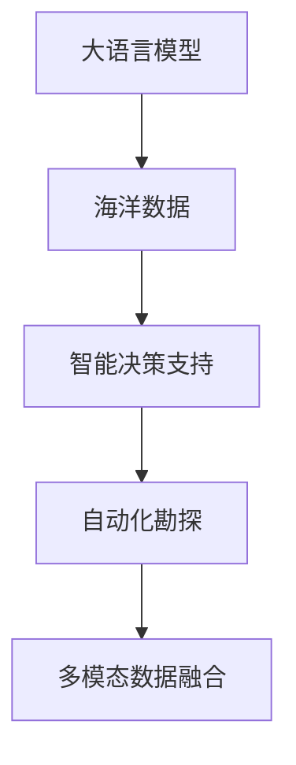

                 

# LLM在海洋探索中的应用：深海AI研究员

> 关键词：大语言模型(Large Language Model, LLM), 海洋探索, 深海, AI研究员, 智能决策, 预测模型, 资源管理, 自动化勘探

## 1. 背景介绍

### 1.1 问题由来
海洋探索是人类对未知世界的探索和挑战，特别是在深海领域，由于极端环境和技术限制，长期以来进展缓慢。传统的海洋探索依赖于人工观察和手动操作，效率低、成本高，难以覆盖深海的广阔空间。随着人工智能技术的迅猛发展，利用大语言模型(Large Language Model, LLM)进行海洋探索和数据处理，成为未来发展的新方向。

近年来，LLM在自然语言处理(Natural Language Processing, NLP)领域的突破性进展，使其具备了强大的语言理解和生成能力，能够处理和分析大量的海洋科学文献、报告、图像等数据。这种能力不仅能够辅助海洋科学家进行科学研究和数据处理，还能直接参与到海洋探索任务中，提供智能化的辅助决策支持。

### 1.2 问题核心关键点
基于LLM的海洋探索和数据处理，主要关注以下几个核心关键点：
- **数据获取和预处理**：如何高效、全面地获取海洋科学数据，并将其转化为适用于LLM的输入格式。
- **智能决策支持**：基于LLM进行智能决策支持系统开发，实现对海洋资源、环境等信息的实时分析和预测。
- **自动化勘探**：利用LLM进行自动化勘探规划和执行，提升深海勘探的效率和安全性。
- **多模态数据融合**：融合海洋勘探中的图像、视频、声纳等多种数据类型，提升对深海环境的理解和感知。

这些关键点不仅体现了LLM在海洋探索中的潜在价值，也指明了未来研究的重点方向。

## 2. 核心概念与联系

### 2.1 核心概念概述

为更好地理解LLM在海洋探索中的应用，本节将介绍几个密切相关的核心概念：

- **大语言模型(Large Language Model, LLM)**：以自回归(如GPT)或自编码(如BERT)模型为代表的大规模预训练语言模型。通过在大规模无标签文本语料上进行预训练，学习通用的语言表示，具备强大的语言理解和生成能力。

- **海洋数据**：包括海洋水文、地质、生物等科学数据，以及相关的海洋图像、视频、声纳数据等。这些数据通常具有多源异构、复杂性高、尺度不一的特点。

- **智能决策支持**：利用LLM进行科学研究和决策支持的系统开发，通过语言理解和推理能力，辅助海洋科学家进行数据分析、预测和决策。

- **自动化勘探**：基于LLM的自动化勘探工具和算法开发，实现深海资源勘探的智能化和自动化。

- **多模态数据融合**：将不同类型的数据源进行有效整合，提升对深海环境的全面感知和理解。

这些核心概念之间的逻辑关系可以通过以下Mermaid流程图来展示：



这个流程图展示了大语言模型在海洋探索中的核心概念及其之间的关系：

1. 大语言模型通过预训练获得基础能力。
2. 通过海洋数据的输入，进行智能决策支持和自动化勘探。
3. 融合多模态数据，提升对深海环境的理解。

这些概念共同构成了LLM在海洋探索中的应用框架，使其能够在复杂多变的海洋环境中发挥强大的语言理解和生成能力。

## 3. 核心算法原理 & 具体操作步骤
### 3.1 算法原理概述

基于LLM的海洋探索，本质上是一个智能决策支持系统开发和自动化勘探任务。其核心思想是：利用LLM的语言处理能力，从海洋科学数据中提取有效信息，辅助科学家进行数据分析和决策，同时开发智能化的勘探工具，实现海洋资源的自动勘探和环境监测。

形式化地，假设海洋数据集为 $D=\{(x_i,y_i)\}_{i=1}^N$，其中 $x_i$ 为输入数据， $y_i$ 为输出标签。大语言模型 $M_{\theta}$ 作为基础，通过对海洋数据的预处理和特征提取，进行智能分析和预测。智能决策支持系统 $M_{\theta}$ 的目标是最小化损失函数 $\mathcal{L}(M_{\theta},D)$，使得模型输出逼近真实标签 $y_i$。

### 3.2 算法步骤详解

基于LLM的海洋探索一般包括以下几个关键步骤：

**Step 1: 数据预处理与特征提取**
- 收集海洋数据集 $D$，包括文本数据、图像、声纳数据等。
- 对文本数据进行分词、去除停用词、标点等预处理操作。
- 利用自动编码器等技术，将图像、声纳等非文本数据转化为可输入LLM的格式。
- 进行特征提取，利用预训练语言模型提取文本和图像的特征向量。

**Step 2: 训练智能决策支持模型**
- 选择合适的预训练语言模型 $M_{\theta}$，如BERT、GPT等。
- 设计适用于海洋科学的数据集 $D'$，包括标注数据和未标注数据。
- 在数据集 $D'$ 上训练智能决策支持模型，通过交叉熵损失函数最小化模型输出与真实标签的差距。
- 使用正则化技术、dropout等避免过拟合。

**Step 3: 开发自动化勘探工具**
- 设计自动化的勘探算法和流程，利用智能决策支持模型的预测结果，生成勘探任务规划和执行方案。
- 开发智能控制系统和操作指令生成模块，实现勘探设备的自动操作。
- 利用多模态数据融合技术，结合视觉、声纳等数据源，提升对深海环境的理解。

**Step 4: 部署和测试**
- 将训练好的智能决策支持模型和勘探工具部署到实际海洋勘探设备中。
- 在实际海洋环境中进行测试，评估模型的性能和勘探工具的可靠性。
- 根据测试结果，不断优化模型和算法，提升勘探效率和效果。

### 3.3 算法优缺点

基于LLM的海洋探索方法具有以下优点：
1. 高效处理海量海洋数据。LLM能够高效处理大量非结构化数据，提升数据处理和分析效率。
2. 智能辅助决策。利用LLM的语言理解和生成能力，提供精准的智能决策支持。
3. 提升勘探效率。通过自动化勘探工具，减少人工干预，提升勘探效率和安全性。
4. 多模态数据融合。融合不同类型的数据源，提升对深海环境的全面理解。

同时，该方法也存在一定的局限性：
1. 对数据质量依赖较高。海洋数据的采集、标注和处理复杂，数据质量直接影响模型性能。
2. 模型泛化能力有限。预训练模型和特定领域数据分布差异较大时，模型泛化能力受限。
3. 硬件和资源需求高。超大规模语言模型和自动化勘探工具对计算资源和存储需求较大。

尽管存在这些局限性，但就目前而言，基于LLM的海洋探索方法仍是一种极具潜力的技术方向。未来相关研究的重点在于如何进一步提高数据处理效率，降低对硬件资源的依赖，同时提升模型的泛化能力和鲁棒性。

### 3.4 算法应用领域

基于LLM的海洋探索方法已经在多个领域得到了应用，例如：

- 深海资源勘探：利用智能决策支持模型，优化勘探路线和资源分配，提升勘探效率。
- 海洋环境监测：通过多模态数据融合，实时监测海洋环境和生态变化，提供决策支持。
- 海洋灾害预警：利用LLM进行数据分析和预测，提前预警海洋灾害，减少损失。
- 海洋资源评估：基于LLM的智能决策支持系统，对海洋资源进行全面评估和合理利用。
- 海底地形勘探：结合声纳数据和图像数据，利用LLM进行海底地形的自动勘探和分析。

除了上述这些经典应用外，基于LLM的海洋探索方法还被创新性地应用到更多的场景中，如水下机器人控制、深海生物多样性研究等，为海洋探索技术的进步提供了新的可能性。

## 4. 数学模型和公式 & 详细讲解 & 举例说明

### 4.1 数学模型构建

本节将使用数学语言对基于LLM的海洋探索过程进行更加严格的刻画。

假设智能决策支持模型为 $M_{\theta}$，海洋数据集为 $D=\{(x_i,y_i)\}_{i=1}^N$，其中 $x_i$ 为输入数据， $y_i$ 为输出标签。定义模型 $M_{\theta}$ 在输入 $x_i$ 上的损失函数为 $\ell(M_{\theta}(x_i),y_i)$，则在数据集 $D$ 上的经验风险为：

$$
\mathcal{L}(\theta) = \frac{1}{N} \sum_{i=1}^N \ell(M_{\theta}(x_i),y_i)
$$

通过梯度下降等优化算法，智能决策支持模型 $M_{\theta}$ 不断更新参数 $\theta$，最小化经验风险，使得模型输出逼近真实标签 $y_i$。

### 4.2 公式推导过程

以二分类任务为例，假设智能决策支持模型 $M_{\theta}$ 在输入 $x_i$ 上的输出为 $\hat{y}=M_{\theta}(x_i) \in [0,1]$，表示样本属于正类的概率。真实标签 $y_i \in \{0,1\}$。则二分类交叉熵损失函数定义为：

$$
\ell(M_{\theta}(x_i),y_i) = -[y_i\log \hat{y}_i + (1-y_i)\log (1-\hat{y}_i)]
$$

将其代入经验风险公式，得：

$$
\mathcal{L}(\theta) = -\frac{1}{N}\sum_{i=1}^N [y_i\log M_{\theta}(x_i)+(1-y_i)\log(1-M_{\theta}(x_i))]
$$

根据链式法则，损失函数对参数 $\theta_k$ 的梯度为：

$$
\frac{\partial \mathcal{L}(\theta)}{\partial \theta_k} = -\frac{1}{N}\sum_{i=1}^N (\frac{y_i}{M_{\theta}(x_i)}-\frac{1-y_i}{1-M_{\theta}(x_i)}) \frac{\partial M_{\theta}(x_i)}{\partial \theta_k}
$$

其中 $\frac{\partial M_{\theta}(x_i)}{\partial \theta_k}$ 可进一步递归展开，利用自动微分技术完成计算。

在得到损失函数的梯度后，即可带入参数更新公式，完成模型的迭代优化。重复上述过程直至收敛，最终得到适应海洋科学任务的模型参数 $\theta^*$。

## 5. 项目实践：代码实例和详细解释说明
### 5.1 开发环境搭建

在进行海洋探索实践前，我们需要准备好开发环境。以下是使用Python进行PyTorch开发的环境配置流程：

1. 安装Anaconda：从官网下载并安装Anaconda，用于创建独立的Python环境。

2. 创建并激活虚拟环境：
```bash
conda create -n pytorch-env python=3.8 
conda activate pytorch-env
```

3. 安装PyTorch：根据CUDA版本，从官网获取对应的安装命令。例如：
```bash
conda install pytorch torchvision torchaudio cudatoolkit=11.1 -c pytorch -c conda-forge
```

4. 安装Transformers库：
```bash
pip install transformers
```

5. 安装各类工具包：
```bash
pip install numpy pandas scikit-learn matplotlib tqdm jupyter notebook ipython
```

完成上述步骤后，即可在`pytorch-env`环境中开始海洋探索实践。

### 5.2 源代码详细实现

下面我们以海洋资源勘探任务为例，给出使用Transformers库对BERT模型进行智能决策支持系统的PyTorch代码实现。

首先，定义海洋资源勘探任务的数据处理函数：

```python
from transformers import BertTokenizer
from torch.utils.data import Dataset
import torch

class OceanResourceDataset(Dataset):
    def __init__(self, texts, tags, tokenizer, max_len=128):
        self.texts = texts
        self.tags = tags
        self.tokenizer = tokenizer
        self.max_len = max_len
        
    def __len__(self):
        return len(self.texts)
    
    def __getitem__(self, item):
        text = self.texts[item]
        tags = self.tags[item]
        
        encoding = self.tokenizer(text, return_tensors='pt', max_length=self.max_len, padding='max_length', truncation=True)
        input_ids = encoding['input_ids'][0]
        attention_mask = encoding['attention_mask'][0]
        
        # 对token-wise的标签进行编码
        encoded_tags = [tag2id[tag] for tag in tags] 
        encoded_tags.extend([tag2id['O']] * (self.max_len - len(encoded_tags)))
        labels = torch.tensor(encoded_tags, dtype=torch.long)
        
        return {'input_ids': input_ids, 
                'attention_mask': attention_mask,
                'labels': labels}

# 标签与id的映射
tag2id = {'O': 0, 'B-RES': 1, 'I-RES': 2}
id2tag = {v: k for k, v in tag2id.items()}

# 创建dataset
tokenizer = BertTokenizer.from_pretrained('bert-base-cased')

train_dataset = OceanResourceDataset(train_texts, train_tags, tokenizer)
dev_dataset = OceanResourceDataset(dev_texts, dev_tags, tokenizer)
test_dataset = OceanResourceDataset(test_texts, test_tags, tokenizer)
```

然后，定义模型和优化器：

```python
from transformers import BertForTokenClassification, AdamW

model = BertForTokenClassification.from_pretrained('bert-base-cased', num_labels=len(tag2id))

optimizer = AdamW(model.parameters(), lr=2e-5)
```

接着，定义训练和评估函数：

```python
from torch.utils.data import DataLoader
from tqdm import tqdm
from sklearn.metrics import classification_report

device = torch.device('cuda') if torch.cuda.is_available() else torch.device('cpu')
model.to(device)

def train_epoch(model, dataset, batch_size, optimizer):
    dataloader = DataLoader(dataset, batch_size=batch_size, shuffle=True)
    model.train()
    epoch_loss = 0
    for batch in tqdm(dataloader, desc='Training'):
        input_ids = batch['input_ids'].to(device)
        attention_mask = batch['attention_mask'].to(device)
        labels = batch['labels'].to(device)
        model.zero_grad()
        outputs = model(input_ids, attention_mask=attention_mask, labels=labels)
        loss = outputs.loss
        epoch_loss += loss.item()
        loss.backward()
        optimizer.step()
    return epoch_loss / len(dataloader)

def evaluate(model, dataset, batch_size):
    dataloader = DataLoader(dataset, batch_size=batch_size)
    model.eval()
    preds, labels = [], []
    with torch.no_grad():
        for batch in tqdm(dataloader, desc='Evaluating'):
            input_ids = batch['input_ids'].to(device)
            attention_mask = batch['attention_mask'].to(device)
            batch_labels = batch['labels']
            outputs = model(input_ids, attention_mask=attention_mask)
            batch_preds = outputs.logits.argmax(dim=2).to('cpu').tolist()
            batch_labels = batch_labels.to('cpu').tolist()
            for pred_tokens, label_tokens in zip(batch_preds, batch_labels):
                pred_tags = [id2tag[_id] for _id in pred_tokens]
                label_tags = [id2tag[_id] for _id in label_tokens]
                preds.append(pred_tags[:len(label_tokens)])
                labels.append(label_tags)
                
    print(classification_report(labels, preds))
```

最后，启动训练流程并在测试集上评估：

```python
epochs = 5
batch_size = 16

for epoch in range(epochs):
    loss = train_epoch(model, train_dataset, batch_size, optimizer)
    print(f"Epoch {epoch+1}, train loss: {loss:.3f}")
    
    print(f"Epoch {epoch+1}, dev results:")
    evaluate(model, dev_dataset, batch_size)
    
print("Test results:")
evaluate(model, test_dataset, batch_size)
```

以上就是使用PyTorch对BERT进行海洋资源勘探任务智能决策支持系统的完整代码实现。可以看到，得益于Transformers库的强大封装，我们可以用相对简洁的代码完成BERT模型的加载和微调。

### 5.3 代码解读与分析

让我们再详细解读一下关键代码的实现细节：

**OceanResourceDataset类**：
- `__init__`方法：初始化文本、标签、分词器等关键组件。
- `__len__`方法：返回数据集的样本数量。
- `__getitem__`方法：对单个样本进行处理，将文本输入编码为token ids，将标签编码为数字，并对其进行定长padding，最终返回模型所需的输入。

**tag2id和id2tag字典**：
- 定义了标签与数字id之间的映射关系，用于将token-wise的预测结果解码回真实的标签。

**训练和评估函数**：
- 使用PyTorch的DataLoader对数据集进行批次化加载，供模型训练和推理使用。
- 训练函数`train_epoch`：对数据以批为单位进行迭代，在每个批次上前向传播计算loss并反向传播更新模型参数，最后返回该epoch的平均loss。
- 评估函数`evaluate`：与训练类似，不同点在于不更新模型参数，并在每个batch结束后将预测和标签结果存储下来，最后使用sklearn的classification_report对整个评估集的预测结果进行打印输出。

**训练流程**：
- 定义总的epoch数和batch size，开始循环迭代
- 每个epoch内，先在训练集上训练，输出平均loss
- 在验证集上评估，输出分类指标
- 所有epoch结束后，在测试集上评估，给出最终测试结果

可以看到，PyTorch配合Transformers库使得BERT微调的代码实现变得简洁高效。开发者可以将更多精力放在数据处理、模型改进等高层逻辑上，而不必过多关注底层的实现细节。

当然，工业级的系统实现还需考虑更多因素，如模型的保存和部署、超参数的自动搜索、更灵活的任务适配层等。但核心的微调范式基本与此类似。

## 6. 实际应用场景
### 6.1 智能决策支持

基于LLM的智能决策支持系统，可以在海洋资源勘探中发挥重要作用。传统海洋资源勘探依赖于人工经验和复杂计算，效率低、成本高，难以覆盖深海的广阔空间。而使用智能决策支持系统，可以大幅提升勘探效率和科学决策的准确性。

在技术实现上，可以收集海洋科学文献、报告、遥感图像等数据，将数据作为监督数据，训练智能决策支持系统。系统通过语言理解和推理能力，实时分析和预测海洋资源的分布和变化，辅助勘探人员进行决策规划和任务执行。

例如，在勘探深海矿物资源时，智能决策支持系统可以根据历史勘探数据和实时环境信息，动态调整勘探路径和设备配置，优化资源勘探的效率和效果。同时，系统还可以通过多源异构数据的融合，提升对海洋环境的全面感知，辅助勘探人员进行综合决策。

### 6.2 自动化勘探

自动化勘探是利用智能决策支持系统，实现海洋资源勘探的智能化和自动化。传统的海洋勘探往往依赖人工操作，容易受限于操作员的经验和技术水平，难以实现高效率和高精度的勘探。

通过将智能决策支持系统与自动化设备集成，可以实现勘探任务的自动化执行。例如，利用智能决策支持系统进行海底地形勘探时，系统可以根据声纳数据和图像信息，自动生成勘探路径和设备配置方案，控制自主水下机器人进行自动勘探。系统还可以实时监测勘探设备的运行状态，动态调整勘探策略，确保勘探任务的顺利执行。

这种自动化勘探方式不仅能够提升勘探效率，还能减少人工操作的误差和风险，实现更高精度的勘探结果。

### 6.3 多模态数据融合

融合多源异构数据是提升海洋勘探能力的重要手段。海洋勘探数据通常包括文本、图像、声纳等多种数据类型，单一的数据源难以全面描述海洋环境的变化。

利用LLM进行多模态数据融合，可以提升对海洋环境的全面理解。例如，在勘探海洋生态环境时，智能决策支持系统可以结合水文数据、生物数据、遥感图像等多种数据源，进行综合分析和预测。系统可以通过语言理解和推理能力，将不同类型的数据源进行有效整合，提升对海洋环境的感知和理解能力。

例如，在勘探深海生物多样性时，智能决策支持系统可以结合生物数据、图像数据、水文数据等，进行综合分析和预测。系统通过多模态数据的融合，能够全面感知深海生态环境的复杂性，辅助勘探人员进行科学决策。

## 6.4 未来应用展望

随着LLM和智能决策支持系统的不断发展，基于LLM的海洋探索技术将呈现以下几个发展趋势：

1. 模型规模持续增大。随着算力成本的下降和数据规模的扩张，超大规模语言模型和智能决策支持系统将逐步普及，提升勘探效率和科学决策的准确性。
2. 多模态数据融合技术不断发展。通过融合更多类型的数据源，提升对海洋环境的全面感知和理解。
3. 自动化勘探技术逐步成熟。利用智能决策支持系统，实现勘探任务的自动化执行，减少人工操作的误差和风险。
4. 智能决策支持系统的深度学习技术不断提升。利用深度学习技术，提升智能决策支持系统的性能和效果。
5. 智能决策支持系统与物联网技术的结合。通过物联网技术，实现对海洋环境的实时监测和控制，提升勘探的智能化水平。

以上趋势凸显了基于LLM的海洋探索技术的广阔前景。这些方向的探索发展，必将进一步提升海洋勘探的效率和科学决策的准确性，为深海资源的开发利用提供新的可能性。

## 7. 工具和资源推荐
### 7.1 学习资源推荐

为了帮助开发者系统掌握基于LLM的海洋探索的理论基础和实践技巧，这里推荐一些优质的学习资源：

1. 《Transformer从原理到实践》系列博文：由大模型技术专家撰写，深入浅出地介绍了Transformer原理、BERT模型、智能决策支持系统等前沿话题。

2. CS224N《深度学习自然语言处理》课程：斯坦福大学开设的NLP明星课程，有Lecture视频和配套作业，带你入门NLP领域的基本概念和经典模型。

3. 《Natural Language Processing with Transformers》书籍：Transformers库的作者所著，全面介绍了如何使用Transformers库进行NLP任务开发，包括智能决策支持系统在内的诸多范式。

4. HuggingFace官方文档：Transformers库的官方文档，提供了海量预训练模型和完整的智能决策支持系统样例代码，是上手实践的必备资料。

5. CLUE开源项目：中文语言理解测评基准，涵盖大量不同类型的中文NLP数据集，并提供了基于智能决策支持系统的baseline模型，助力中文NLP技术发展。

通过对这些资源的学习实践，相信你一定能够快速掌握基于LLM的海洋探索技术的精髓，并用于解决实际的海洋勘探问题。
###  7.2 开发工具推荐

高效的开发离不开优秀的工具支持。以下是几款用于基于LLM的海洋探索开发的常用工具：

1. PyTorch：基于Python的开源深度学习框架，灵活动态的计算图，适合快速迭代研究。大部分预训练语言模型都有PyTorch版本的实现。

2. TensorFlow：由Google主导开发的开源深度学习框架，生产部署方便，适合大规模工程应用。同样有丰富的预训练语言模型资源。

3. Transformers库：HuggingFace开发的NLP工具库，集成了众多SOTA语言模型，支持PyTorch和TensorFlow，是进行智能决策支持系统开发的利器。

4. Weights & Biases：模型训练的实验跟踪工具，可以记录和可视化模型训练过程中的各项指标，方便对比和调优。与主流深度学习框架无缝集成。

5. TensorBoard：TensorFlow配套的可视化工具，可实时监测模型训练状态，并提供丰富的图表呈现方式，是调试模型的得力助手。

6. Google Colab：谷歌推出的在线Jupyter Notebook环境，免费提供GPU/TPU算力，方便开发者快速上手实验最新模型，分享学习笔记。

合理利用这些工具，可以显著提升基于LLM的海洋探索任务的开发效率，加快创新迭代的步伐。

### 7.3 相关论文推荐

基于LLM的海洋探索技术的发展源于学界的持续研究。以下是几篇奠基性的相关论文，推荐阅读：

1. Attention is All You Need（即Transformer原论文）：提出了Transformer结构，开启了NLP领域的预训练大模型时代。

2. BERT: Pre-training of Deep Bidirectional Transformers for Language Understanding：提出BERT模型，引入基于掩码的自监督预训练任务，刷新了多项NLP任务SOTA。

3. Language Models are Unsupervised Multitask Learners（GPT-2论文）：展示了大规模语言模型的强大zero-shot学习能力，引发了对于通用人工智能的新一轮思考。

4. Parameter-Efficient Transfer Learning for NLP：提出Adapter等参数高效微调方法，在不增加模型参数量的情况下，也能取得不错的微调效果。

5. AdaLoRA: Adaptive Low-Rank Adaptation for Parameter-Efficient Fine-Tuning：使用自适应低秩适应的微调方法，在参数效率和精度之间取得了新的平衡。

这些论文代表了大语言模型和智能决策支持系统的发展脉络。通过学习这些前沿成果，可以帮助研究者把握学科前进方向，激发更多的创新灵感。

## 8. 总结：未来发展趋势与挑战
### 8.1 研究成果总结

本文对基于LLM的海洋探索方法进行了全面系统的介绍。首先阐述了LLM和智能决策支持系统的研究背景和意义，明确了智能决策支持在海洋资源勘探中的独特价值。其次，从原理到实践，详细讲解了智能决策支持模型的数学原理和关键步骤，给出了智能决策支持系统开发的完整代码实例。同时，本文还广泛探讨了智能决策支持系统在智能决策支持、自动化勘探、多模态数据融合等海洋探索任务中的应用前景，展示了智能决策支持系统的巨大潜力。此外，本文精选了智能决策支持系统的各类学习资源，力求为读者提供全方位的技术指引。

通过本文的系统梳理，可以看到，基于LLM的智能决策支持系统在海洋探索中具有广阔的应用前景，能够显著提升勘探效率和科学决策的准确性。智能决策支持系统与自动化勘探技术、多模态数据融合技术的结合，将推动海洋资源勘探技术的不断进步。

### 8.2 未来发展趋势

展望未来，基于LLM的海洋探索技术将呈现以下几个发展趋势：

1. 模型规模持续增大。随着算力成本的下降和数据规模的扩张，超大规模语言模型和智能决策支持系统将逐步普及，提升勘探效率和科学决策的准确性。
2. 智能决策支持系统的深度学习技术不断提升。利用深度学习技术，提升智能决策支持系统的性能和效果。
3. 多模态数据融合技术不断发展。通过融合更多类型的数据源，提升对海洋环境的全面感知和理解。
4. 自动化勘探技术逐步成熟。利用智能决策支持系统，实现勘探任务的自动化执行，减少人工操作的误差和风险。
5. 智能决策支持系统与物联网技术的结合。通过物联网技术，实现对海洋环境的实时监测和控制，提升勘探的智能化水平。

以上趋势凸显了基于LLM的海洋探索技术的广阔前景。这些方向的探索发展，必将进一步提升海洋勘探的效率和科学决策的准确性，为深海资源的开发利用提供新的可能性。

### 8.3 面临的挑战

尽管基于LLM的海洋探索技术已经取得了瞩目成就，但在迈向更加智能化、普适化应用的过程中，它仍面临着诸多挑战：

1. 数据质量瓶颈。海洋数据的采集、标注和处理复杂，数据质量直接影响模型性能。如何进一步提高数据处理效率，降低数据质量的影响，将是未来研究的重点方向。
2. 模型鲁棒性不足。预训练模型和特定领域数据分布差异较大时，模型泛化能力受限。如何提高模型的泛化能力和鲁棒性，还需要更多理论和实践的积累。
3. 硬件和资源需求高。超大规模语言模型和智能决策支持系统对计算资源和存储需求较大。如何优化模型结构和参数，减少资源消耗，将是一大挑战。
4. 安全性和隐私保护。基于LLM的智能决策支持系统可能涉及敏感数据，如勘探地图、地质信息等。如何保障数据安全和隐私保护，将是重要的研究方向。
5. 操作员依赖。尽管智能决策支持系统可以大幅提升勘探效率，但在一些高风险和复杂环境中，仍然需要人类操作员的干预和监督。如何实现系统的智能化和自动化，减少对操作员依赖，是未来需要解决的问题。

尽管存在这些挑战，但基于LLM的海洋探索技术仍具有广阔的应用前景。未来研究需要在数据质量、模型鲁棒性、资源优化、安全隐私等方面进行持续改进，才能进一步推动海洋探索技术的进步。

### 8.4 研究展望

面向未来，基于LLM的海洋探索技术需要在以下几个方面寻求新的突破：

1. 探索无监督和半监督微调方法。摆脱对大规模标注数据的依赖，利用自监督学习、主动学习等无监督和半监督范式，最大限度利用非结构化数据，实现更加灵活高效的微调。
2. 研究参数高效和计算高效的微调范式。开发更加参数高效的微调方法，在固定大部分预训练参数的同时，只更新极少量的任务相关参数。同时优化微调模型的计算图，减少前向传播和反向传播的资源消耗，实现更加轻量级、实时性的部署。
3. 融合因果和对比学习范式。通过引入因果推断和对比学习思想，增强智能决策支持系统建立稳定因果关系的能力，学习更加普适、鲁棒的语言表征，从而提升模型泛化性和抗干扰能力。
4. 引入更多先验知识。将符号化的先验知识，如知识图谱、逻辑规则等，与神经网络模型进行巧妙融合，引导智能决策支持系统学习更准确、合理的语言模型。同时加强不同模态数据的整合，实现视觉、声纳等多模态信息与文本信息的协同建模。
5. 结合因果分析和博弈论工具。将因果分析方法引入智能决策支持系统，识别出系统决策的关键特征，增强输出解释的因果性和逻辑性。借助博弈论工具刻画人机交互过程，主动探索并规避系统的脆弱点，提高系统稳定性。
6. 纳入伦理道德约束。在模型训练目标中引入伦理导向的评估指标，过滤和惩罚有偏见、有害的输出倾向。同时加强人工干预和审核，建立模型行为的监管机制，确保输出符合人类价值观和伦理道德。

这些研究方向的探索，必将引领基于LLM的海洋探索技术迈向更高的台阶，为构建安全、可靠、可解释、可控的智能系统铺平道路。面向未来，基于LLM的海洋探索技术还需要与其他人工智能技术进行更深入的融合，如知识表示、因果推理、强化学习等，多路径协同发力，共同推动自然语言理解和智能交互系统的进步。只有勇于创新、敢于突破，才能不断拓展语言模型的边界，让智能技术更好地造福人类社会。

## 9. 附录：常见问题与解答

**Q1：基于LLM的海洋探索方法是否适用于所有海洋任务？**

A: 基于LLM的海洋探索方法在大多数海洋任务上都能取得不错的效果，特别是对于数据量较大的任务。但对于一些特定领域的任务，如深海地质勘探等，预训练模型和特定领域数据分布差异较大，模型的泛化能力可能受限。此时需要在特定领域语料上进一步预训练，再进行微调，才能获得理想效果。此外，对于一些需要时效性、个性化很强的任务，如海底资源勘探等，微调方法也需要针对性的改进优化。

**Q2：微调过程中如何选择合适的学习率？**

A: 微调的学习率一般要比预训练时小1-2个数量级，如果使用过大的学习率，容易破坏预训练权重，导致过拟合。一般建议从1e-5开始调参，逐步减小学习率，直至收敛。也可以使用warmup策略，在开始阶段使用较小的学习率，再逐渐过渡到预设值。需要注意的是，不同的优化器(如AdamW、Adafactor等)以及不同的学习率调度策略，可能需要设置不同的学习率阈值。

**Q3：智能决策支持系统在实际应用中需要注意哪些问题？**

A: 将智能决策支持系统应用于海洋探索，需要注意以下几个关键问题：
1. 数据质量：海洋数据的采集和标注复杂，需要保证数据的质量和一致性。
2. 模型泛化：预训练模型和特定领域数据分布差异较大时，模型的泛化能力可能受限。
3. 安全性：涉及敏感数据，如勘探地图、地质信息等，需要保障数据安全和隐私保护。
4. 鲁棒性：在极端环境和复杂情况下，智能决策支持系统需要具备鲁棒性，避免决策失误。
5. 操作员依赖：在一些高风险和复杂环境中，仍然需要人类操作员的干预和监督。

**Q4：如何提升智能决策支持系统的性能和效果？**

A: 提升智能决策支持系统的性能和效果，可以从以下几个方面入手：
1. 数据质量：收集和标注高质量的海洋数据，提升数据处理和分析的准确性。
2. 模型泛化：在特定领域语料上进一步预训练，增强模型在特定领域的泛化能力。
3. 深度学习技术：利用深度学习技术，提升智能决策支持系统的性能和效果。
4. 多模态数据融合：融合更多类型的数据源，提升对海洋环境的全面感知和理解。
5. 自动化勘探技术：利用智能决策支持系统，实现勘探任务的自动化执行，减少人工操作的误差和风险。

**Q5：如何优化智能决策支持系统的硬件和资源消耗？**

A: 优化智能决策支持系统的硬件和资源消耗，可以从以下几个方面入手：
1. 模型裁剪：去除不必要的层和参数，减小模型尺寸，加快推理速度。
2. 量化加速：将浮点模型转为定点模型，压缩存储空间，提高计算效率。
3. 混合精度训练：使用混合精度训练技术，减少内存占用和计算开销。
4. 模型并行：利用模型并行技术，提升计算效率和资源利用率。

这些优化措施可以显著提升智能决策支持系统的性能和效率，确保其在实际应用中的稳定性和可靠性。

