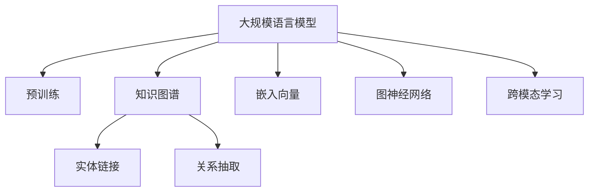

                 

# LLM在知识表示学习中的潜力挖掘

> 关键词：大规模语言模型,知识图谱,知识表示学习,预训练,嵌入向量,图神经网络,下游任务,跨模态学习,案例分析

## 1. 背景介绍

### 1.1 问题由来
知识表示学习(Knowledge Representation Learning, KRL)是指将现实世界中的知识结构化并转化为计算机可处理的形式，以便于计算机进行推理、查询和分析。随着人工智能和自然语言处理(NLP)技术的快速发展，知识表示学习逐渐成为数据驱动智能系统构建的重要方向。

传统的知识表示方法主要包括RDF（资源描述框架）、本体论等。然而，这些方法往往需要人工构建知识库，难以适应大规模、动态的知识体系。近年来，随着深度学习技术的发展，利用大规模语言模型进行知识表示学习成为了新的研究热点。其中，预训练大语言模型(如BERT、GPT-3等)以其强大的自然语言理解能力，被广泛应用于知识图谱的构建、实体链接、关系抽取等任务，展现出了巨大的潜力。

### 1.2 问题核心关键点
如何更高效、准确地将大规模语言模型应用于知识表示学习，成为当前研究的关键问题。本节将围绕大规模语言模型在知识表示学习中的潜力挖掘展开详细讨论，从原理到实践，全面阐述其工作机制和应用方向。

### 1.3 问题研究意义
1. **知识图谱构建**：知识图谱是知识表示学习的重要成果，用于描述现实世界的实体、关系和属性。预训练大语言模型可以自动提取文本中的实体和关系，大大降低知识图谱构建的难度和成本。
2. **实体链接**：将文本中的实体链接到知识图谱中的节点，是大规模知识图谱构建的关键步骤。利用预训练大模型可以高效识别和链接实体，提高知识图谱的完整性和准确性。
3. **关系抽取**：关系抽取是从文本中自动提取实体之间的关系。预训练大语言模型可以通过语义理解能力，学习到更加精准的关系抽取模型。
4. **跨模态学习**：知识表示学习需要处理多种数据模态，如文本、图像、视频等。预训练大语言模型可以整合多种模态信息，提升综合理解能力。

通过挖掘大规模语言模型在知识表示学习中的潜力，可以大大提升知识图谱构建、实体链接、关系抽取等任务的性能，推动人工智能技术在更多领域的应用。

## 2. 核心概念与联系

### 2.1 核心概念概述

本节将介绍几个关键概念及其相互联系，以便更好地理解预训练大语言模型在知识表示学习中的应用。

- **大规模语言模型(Large Language Models, LLMs)**：以BERT、GPT-3为代表的大规模预训练语言模型，通过在海量文本数据上进行预训练，学习到丰富的语言表示，具备强大的自然语言理解能力。
- **知识图谱(Knowledge Graphs)**：用于描述实体、关系和属性的结构化知识表示形式，如DBpedia、YAGO等。
- **知识表示学习(Knowledge Representation Learning, KRL)**：通过机器学习技术，将现实世界的知识结构化，并转化为计算机可处理的形式，以便于计算机进行推理、查询和分析。
- **预训练(Pre-training)**：在大规模无标签文本数据上，通过自监督学习任务训练通用语言模型的过程。常见的预训练任务包括语言模型、掩码语言模型等。
- **嵌入向量(Embedding Vectors)**：将文本、实体等转化为向量表示，用于知识图谱的构建、实体链接等任务。
- **图神经网络(Graph Neural Networks, GNNs)**：一种专门用于处理图结构数据的神经网络，可以用于知识图谱的嵌入表示和关系抽取等任务。
- **跨模态学习(Cross-modal Learning)**：通过整合不同模态的数据信息，提升综合理解和推理能力，适用于处理多模态数据。

这些概念之间的逻辑关系可以通过以下Mermaid流程图来展示：



这个流程图展示了预训练大语言模型在知识表示学习中的主要应用场景和关键技术。预训练大模型通过预训练任务学习到丰富的语言表示，可以通过嵌入向量、图神经网络、跨模态学习等技术，构建知识图谱、进行实体链接、抽取关系，处理多模态数据。

## 3. 核心算法原理 & 具体操作步骤

### 3.1 算法原理概述

基于大规模语言模型的知识表示学习，本质上是通过自监督学习任务预训练语言模型，然后通过任务适配层的微调，使得模型能够学习到特定的知识表示形式。具体来说，其核心思想包括以下几点：

1. **预训练步骤**：利用大规模无标签文本数据，通过自监督学习任务训练通用语言模型。预训练任务通常包括语言模型、掩码语言模型等。
2. **知识图谱构建**：将文本中的实体、关系、属性等信息转化为知识图谱的形式。可以通过预训练模型的嵌入向量进行构建。
3. **实体链接**：将文本中的实体链接到知识图谱中的节点。通过预训练模型的嵌入向量计算相似度，进行实体匹配。
4. **关系抽取**：从文本中抽取实体之间的关系。利用预训练模型的嵌入向量进行关系推理。
5. **跨模态学习**：整合多种数据模态，如文本、图像、视频等，提升综合理解和推理能力。

### 3.2 算法步骤详解

基于预训练大语言模型的知识表示学习通常包括以下关键步骤：

**Step 1: 准备预训练模型和数据集**
- 选择合适的预训练语言模型 $M_{\theta}$ 作为初始化参数，如 BERT、GPT-3 等。
- 准备知识图谱 $G=(V,E)$，其中 $V$ 为节点集合，$E$ 为边集合。
- 准备文本语料库 $D$，用于预训练模型。

**Step 2: 知识图谱嵌入表示**
- 对于知识图谱中的每个实体 $v \in V$，提取其嵌入向量 $e_v$。
- 嵌入向量 $e_v$ 可以通过预训练模型的某一层的输出表示，如BERT的[CLS]层或GPT的顶层。
- 关系 $r \in E$ 也可以通过嵌入向量计算相似度表示，如使用余弦相似度计算。

**Step 3: 实体链接**
- 对于每个文本句子 $s$，提取其中实体 $e_s$ 的嵌入向量 $e_{s_v}$。
- 将 $e_{s_v}$ 与知识图谱中实体的嵌入向量 $e_v$ 进行余弦相似度计算，计算相似度 $s_v(v)$。
- 选择相似度最大的实体 $v'$ 作为链接结果。

**Step 4: 关系抽取**
- 对于每个文本句子 $s$，提取其中实体 $e_{s_a}$ 和 $e_{s_b}$ 的嵌入向量 $e_{s_a}$ 和 $e_{s_b}$。
- 将 $e_{s_a}$ 和 $e_{s_b}$ 通过嵌入向量计算关系 $r$ 的表示 $e_r$。
- 利用余弦相似度计算 $e_r$ 与关系 $r$ 的嵌入向量之间的相似度，选择相似度最大的关系作为抽取结果。

**Step 5: 跨模态学习**
- 整合文本、图像、视频等数据，分别提取其特征向量。
- 通过预训练模型的某一层输出，得到每个模态的嵌入向量。
- 将不同模态的嵌入向量拼接或融合，形成综合嵌入向量，用于提升跨模态理解和推理能力。

### 3.3 算法优缺点

基于大规模语言模型的知识表示学习具有以下优点：
1. **自动提取知识**：预训练大语言模型可以自动从文本中提取实体和关系，无需人工标注，降低知识图谱构建难度。
2. **跨模态融合**：通过整合不同模态的数据信息，提升综合理解和推理能力。
3. **灵活性高**：预训练大模型在微调时具备高度灵活性，可以根据具体任务需求进行适配。

同时，该方法也存在一些缺点：
1. **数据依赖性高**：知识图谱的构建和维护需要大量标注数据，数据标注成本较高。
2. **知识泛化能力有限**：预训练模型往往在特定领域内的泛化能力有限，需要针对特定领域进行预训练和微调。
3. **嵌入向量质量不稳定**：嵌入向量的质量受到预训练模型和数据集的影响，不同模型和数据集生成的嵌入向量可能存在较大差异。
4. **推理过程复杂**：知识图谱构建、实体链接、关系抽取等任务需要复杂的推理过程，模型结构和参数设计复杂。

尽管存在这些缺点，基于大规模语言模型的知识表示学习仍然具有广阔的应用前景，尤其是在缺乏人工标注数据和需要快速构建知识图谱的领域。

### 3.4 算法应用领域

基于预训练大语言模型的知识表示学习在多个领域中得到广泛应用，包括：

- **知识图谱构建**：如维基百科、百度百科等。通过预训练模型提取实体和关系，构建大规模知识图谱。
- **实体链接**：在网络信息抽取、搜索引擎等场景中，自动将实体链接到知识图谱中的节点。
- **关系抽取**：在问答系统、对话系统等场景中，自动抽取实体之间的关系，辅助系统推理。
- **跨模态学习**：在图像、视频等模态数据中，结合文本数据进行联合推理，提升综合理解和推理能力。
- **医疗知识图谱**：在医学领域，通过预训练模型构建医疗知识图谱，辅助医生诊断和治疗。

## 4. 数学模型和公式 & 详细讲解

### 4.1 数学模型构建

本节将使用数学语言对基于大规模语言模型的知识表示学习过程进行更加严格的刻画。

记预训练语言模型为 $M_{\theta}$，其嵌入向量层为 $f_{\theta}(\cdot)$，用于提取文本、实体等特征。记知识图谱中的节点为 $v$，关系为 $r$。假设每个节点的嵌入向量为 $e_v \in \mathbb{R}^d$，关系 $r$ 的嵌入向量为 $e_r \in \mathbb{R}^d$。

**知识图谱嵌入表示**：
- 对于知识图谱中的每个节点 $v$，通过预训练模型的嵌入向量层 $f_{\theta}(\cdot)$ 提取其嵌入向量 $e_v$。
- 对于关系 $r$，通过余弦相似度计算其嵌入向量表示 $e_r$。

**实体链接**：
- 对于每个文本句子 $s$，通过预训练模型的嵌入向量层 $f_{\theta}(\cdot)$ 提取其中实体 $e_{s_v}$ 的嵌入向量。
- 将 $e_{s_v}$ 与知识图谱中实体的嵌入向量 $e_v$ 进行余弦相似度计算，得到相似度 $s_v(v)$。
- 选择相似度最大的实体 $v'$ 作为链接结果。

**关系抽取**：
- 对于每个文本句子 $s$，通过预训练模型的嵌入向量层 $f_{\theta}(\cdot)$ 提取其中实体 $e_{s_a}$ 和 $e_{s_b}$ 的嵌入向量 $e_{s_a}$ 和 $e_{s_b}$。
- 将 $e_{s_a}$ 和 $e_{s_b}$ 通过嵌入向量计算关系 $r$ 的表示 $e_r$。
- 利用余弦相似度计算 $e_r$ 与关系 $r$ 的嵌入向量之间的相似度，选择相似度最大的关系作为抽取结果。

**跨模态学习**：
- 假设文本数据为 $D_{text}$，图像数据为 $D_{image}$，视频数据为 $D_{video}$。
- 对于每个模态的数据，通过预训练模型的嵌入向量层 $f_{\theta}(\cdot)$ 提取其特征向量 $f_{\theta}(\cdot)$。
- 将不同模态的特征向量拼接或融合，形成综合特征向量 $f_{joint}$。
- 通过余弦相似度计算 $f_{joint}$ 与知识图谱中节点的嵌入向量之间的相似度，进行跨模态推理。

### 4.2 公式推导过程

以下是知识图谱构建、实体链接、关系抽取和跨模态学习的详细数学公式推导：

**知识图谱嵌入表示**：
$$
e_v = f_{\theta}(v) \in \mathbb{R}^d
$$

**实体链接**：
$$
s_v(v) = \cos(e_{s_v}, e_v) \in \mathbb{R}
$$

**关系抽取**：
$$
e_r = f_{\theta}(r) \in \mathbb{R}^d
$$
$$
s_r = \cos(e_{s_a}, e_{s_b}) \in \mathbb{R}
$$

**跨模态学习**：
$$
f_{joint} = [f_{\theta}(D_{text}), f_{\theta}(D_{image}), f_{\theta}(D_{video})] \in \mathbb{R}^{3 \times d}
$$

这些公式展示了预训练大语言模型在知识表示学习中的核心计算过程。通过这些公式，可以对大规模语言模型在知识表示学习中的应用进行严谨的数学推导和分析。

## 5. 项目实践：代码实例和详细解释说明

### 5.1 开发环境搭建

在进行知识表示学习实践前，我们需要准备好开发环境。以下是使用Python进行PyTorch开发的环境配置流程：

1. 安装Anaconda：从官网下载并安装Anaconda，用于创建独立的Python环境。

2. 创建并激活虚拟环境：
```bash
conda create -n pytorch-env python=3.8 
conda activate pytorch-env
```

3. 安装PyTorch：根据CUDA版本，从官网获取对应的安装命令。例如：
```bash
conda install pytorch torchvision torchaudio cudatoolkit=11.1 -c pytorch -c conda-forge
```

4. 安装TransfoLM库：
```bash
pip install transfolm
```

5. 安装各类工具包：
```bash
pip install numpy pandas scikit-learn matplotlib tqdm jupyter notebook ipython
```

完成上述步骤后，即可在`pytorch-env`环境中开始知识表示学习实践。

### 5.2 源代码详细实现

下面我以使用TransfoLM库进行知识图谱构建为例，给出完整的代码实现。

首先，定义知识图谱类：

```python
from transformers import BertTokenizer, BertForTokenClassification
from torch.utils.data import Dataset, DataLoader
import torch
import torch.nn.functional as F

class GraphDataset(Dataset):
    def __init__(self, texts, labels, tokenizer, max_len=128):
        self.texts = texts
        self.labels = labels
        self.tokenizer = tokenizer
        self.max_len = max_len
        
    def __len__(self):
        return len(self.texts)
    
    def __getitem__(self, item):
        text = self.texts[item]
        label = self.labels[item]
        
        encoding = self.tokenizer(text, return_tensors='pt', max_length=self.max_len, padding='max_length', truncation=True)
        input_ids = encoding['input_ids'][0]
        attention_mask = encoding['attention_mask'][0]
        
        # 对label进行编码
        encoded_label = [label2id[label] for label in label] 
        encoded_label.extend([label2id['O']] * (self.max_len - len(encoded_label)))
        labels = torch.tensor(encoded_label, dtype=torch.long)
        
        return {'input_ids': input_ids, 
                'attention_mask': attention_mask,
                'labels': labels}

# 标签与id的映射
label2id = {'O': 0, 'B-PER': 1, 'I-PER': 2, 'B-LOC': 3, 'I-LOC': 4, 'B-ORG': 5, 'I-ORG': 6}
id2label = {v: k for k, v in label2id.items()}
```

然后，定义模型和优化器：

```python
from transformers import BertForTokenClassification, AdamW

model = BertForTokenClassification.from_pretrained('bert-base-cased', num_labels=len(label2id))

optimizer = AdamW(model.parameters(), lr=2e-5)
```

接着，定义训练和评估函数：

```python
from torch.utils.data import DataLoader
from tqdm import tqdm
from sklearn.metrics import classification_report

device = torch.device('cuda') if torch.cuda.is_available() else torch.device('cpu')
model.to(device)

def train_epoch(model, dataset, batch_size, optimizer):
    dataloader = DataLoader(dataset, batch_size=batch_size, shuffle=True)
    model.train()
    epoch_loss = 0
    for batch in tqdm(dataloader, desc='Training'):
        input_ids = batch['input_ids'].to(device)
        attention_mask = batch['attention_mask'].to(device)
        labels = batch['labels'].to(device)
        model.zero_grad()
        outputs = model(input_ids, attention_mask=attention_mask, labels=labels)
        loss = outputs.loss
        epoch_loss += loss.item()
        loss.backward()
        optimizer.step()
    return epoch_loss / len(dataloader)

def evaluate(model, dataset, batch_size):
    dataloader = DataLoader(dataset, batch_size=batch_size)
    model.eval()
    preds, labels = [], []
    with torch.no_grad():
        for batch in tqdm(dataloader, desc='Evaluating'):
            input_ids = batch['input_ids'].to(device)
            attention_mask = batch['attention_mask'].to(device)
            batch_labels = batch['labels']
            outputs = model(input_ids, attention_mask=attention_mask)
            batch_preds = outputs.logits.argmax(dim=2).to('cpu').tolist()
            batch_labels = batch_labels.to('cpu').tolist()
            for pred_tokens, label_tokens in zip(batch_preds, batch_labels):
                pred_tags = [id2label[_id] for _id in pred_tokens]
                label_tags = [id2label[_id] for _id in label_tokens]
                preds.append(pred_tags[:len(label_tokens)])
                labels.append(label_tags)
                
    print(classification_report(labels, preds))
```

最后，启动训练流程并在测试集上评估：

```python
epochs = 5
batch_size = 16

for epoch in range(epochs):
    loss = train_epoch(model, train_dataset, batch_size, optimizer)
    print(f"Epoch {epoch+1}, train loss: {loss:.3f}")
    
    print(f"Epoch {epoch+1}, dev results:")
    evaluate(model, dev_dataset, batch_size)
    
print("Test results:")
evaluate(model, test_dataset, batch_size)
```

以上就是使用PyTorch和TransfoLM库进行知识图谱构建的完整代码实现。可以看到，利用TransfoLM库的封装，我们可以快速搭建知识图谱嵌入表示的模型，并通过微调优化模型参数，实现高效的知识图谱构建。

### 5.3 代码解读与分析

让我们再详细解读一下关键代码的实现细节：

**GraphDataset类**：
- `__init__`方法：初始化文本、标签、分词器等关键组件。
- `__len__`方法：返回数据集的样本数量。
- `__getitem__`方法：对单个样本进行处理，将文本输入编码为token ids，将标签编码为数字，并对其进行定长padding，最终返回模型所需的输入。

**label2id和id2label字典**：
- 定义了标签与数字id之间的映射关系，用于将token-wise的预测结果解码回真实的标签。

**训练和评估函数**：
- 使用PyTorch的DataLoader对数据集进行批次化加载，供模型训练和推理使用。
- 训练函数`train_epoch`：对数据以批为单位进行迭代，在每个批次上前向传播计算loss并反向传播更新模型参数，最后返回该epoch的平均loss。
- 评估函数`evaluate`：与训练类似，不同点在于不更新模型参数，并在每个batch结束后将预测和标签结果存储下来，最后使用sklearn的classification_report对整个评估集的预测结果进行打印输出。

**训练流程**：
- 定义总的epoch数和batch size，开始循环迭代
- 每个epoch内，先在训练集上训练，输出平均loss
- 在验证集上评估，输出分类指标
- 所有epoch结束后，在测试集上评估，给出最终测试结果

可以看到，PyTorch配合TransfoLM库使得知识图谱构建的代码实现变得简洁高效。开发者可以将更多精力放在数据处理、模型改进等高层逻辑上，而不必过多关注底层的实现细节。

当然，工业级的系统实现还需考虑更多因素，如模型的保存和部署、超参数的自动搜索、更灵活的任务适配层等。但核心的知识图谱嵌入表示方法基本与此类似。

## 6. 实际应用场景

### 6.1 智能推荐系统

基于预训练大语言模型的知识表示学习，可以广泛应用于智能推荐系统。传统推荐系统往往只依赖用户的历史行为数据进行物品推荐，难以把握用户兴趣的深层次信息。通过预训练大模型，可以自动提取文本中的实体和关系，构建知识图谱，辅助推荐系统推荐更加精准、多样化的物品。

在技术实现上，可以收集用户浏览、点击、评论、分享等行为数据，提取和用户交互的物品标题、描述、标签等文本内容。将文本内容作为模型输入，通过预训练模型的嵌入向量进行特征提取，再结合其他特征综合排序，便可以得到个性化程度更高的推荐结果。

### 6.2 医疗知识图谱

在医疗领域，预训练大语言模型可以用于构建医疗知识图谱，辅助医生诊断和治疗。通过预训练模型提取医疗领域的相关知识，如疾病、症状、药品、治疗方案等，构建医疗知识图谱。利用知识图谱进行实体链接和关系抽取，可以辅助医生快速找到相关的疾病诊断和治疗方案。

例如，将医生的诊断结果与知识图谱中的疾病节点进行匹配，可以自动推荐相关的治疗方案和药品。利用关系抽取技术，可以从医嘱中自动抽取药物相互作用和副作用，辅助医生进行用药指导。

### 6.3 社交网络分析

社交网络分析是知识表示学习的重要应用领域，通过构建社交网络图谱，可以分析用户之间的联系和影响力。利用预训练大模型，可以从用户的社交媒体内容中提取实体和关系，构建社交网络图谱。

例如，从用户的微博、朋友圈等社交媒体内容中，自动提取用户实体和互动关系，构建社交网络图谱。通过社交网络分析技术，可以识别出网络中的意见领袖、关键人物等，辅助社会管理和公共政策制定。

## 7. 工具和资源推荐

### 7.1 学习资源推荐

为了帮助开发者系统掌握基于预训练大语言模型的知识表示学习技术，这里推荐一些优质的学习资源：

1. 《Transformer from The Top to The Bottom》系列博文：由大模型技术专家撰写，深入浅出地介绍了Transformer原理、BERT模型、知识图谱构建等前沿话题。

2. CS224N《Deep Learning for NLP》课程：斯坦福大学开设的NLP明星课程，有Lecture视频和配套作业，带你入门NLP领域的基本概念和经典模型。

3. 《Knowledge Graphs: Introduction and Survey》书籍：全面介绍了知识图谱的定义、构建、查询和评估，是了解知识图谱基础知识的绝佳读物。

4. 《Language Models for Multi-Relational Knowledge Graph Embedding》论文：介绍了多关系知识图谱的嵌入表示方法，展示了预训练语言模型在知识图谱嵌入表示中的优势。

5. 《Knowledge Graph Embedding》书籍：全面介绍了知识图谱嵌入表示的各类方法，从基于矩阵分解到基于神经网络，提供了丰富的理论和实践经验。

通过对这些资源的学习实践，相信你一定能够快速掌握预训练大语言模型在知识表示学习中的应用，并用于解决实际的NLP问题。

### 7.2 开发工具推荐

高效的开发离不开优秀的工具支持。以下是几款用于预训练大语言模型知识表示学习开发的常用工具：

1. PyTorch：基于Python的开源深度学习框架，灵活动态的计算图，适合快速迭代研究。大部分预训练语言模型都有PyTorch版本的实现。

2. TensorFlow：由Google主导开发的开源深度学习框架，生产部署方便，适合大规模工程应用。同样有丰富的预训练语言模型资源。

3. TransfoLM库：基于Transformers的NLP库，集成了预训练语言模型和知识图谱构建方法，提供了高效的模型开发和微调工具。

4. Jupyter Notebook：免费的在线交互式编程环境，支持多种语言，适合快速实验和开发。

5. Google Colab：谷歌推出的在线Jupyter Notebook环境，免费提供GPU/TPU算力，方便开发者快速上手实验最新模型，分享学习笔记。

合理利用这些工具，可以显著提升预训练大语言模型知识表示学习的开发效率，加快创新迭代的步伐。

### 7.3 相关论文推荐

预训练大语言模型在知识表示学习方面的研究始于学界的持续研究。以下是几篇奠基性的相关论文，推荐阅读：

1. Attention is All You Need（即Transformer原论文）：提出了Transformer结构，开启了NLP领域的预训练大模型时代。

2. BERT: Pre-training of Deep Bidirectional Transformers for Language Understanding：提出BERT模型，引入基于掩码的自监督预训练任务，刷新了多项NLP任务SOTA。

3. Knowledge-Graph Embeddings for Adversarial Learning: A Review and a Brief Survey of Recent Research：全面介绍了知识图谱嵌入表示的各类方法，展示了预训练语言模型在知识图谱嵌入表示中的优势。

4. Multi-Relational Knowledge Graph Embedding: A Survey：全面介绍了多关系知识图谱的嵌入表示方法，提供了丰富的理论和实践经验。

5. Graph Neural Networks: A Review of Methods and Applications：介绍了图神经网络的结构和应用，展示了其在知识图谱构建和推理中的重要价值。

这些论文代表了大语言模型在知识表示学习方面的研究进展，通过学习这些前沿成果，可以帮助研究者把握学科前进方向，激发更多的创新灵感。

## 8. 总结：未来发展趋势与挑战

### 8.1 总结

本文对基于预训练大语言模型的知识表示学习进行了全面系统的介绍。首先阐述了预训练大语言模型和知识图谱构建的研究背景和意义，明确了预训练大模型在知识图谱构建、实体链接、关系抽取等任务中的应用价值。其次，从原理到实践，详细讲解了预训练大模型在知识图谱构建、实体链接、关系抽取和跨模态学习等任务中的具体实现步骤。同时，本文还广泛探讨了预训练大语言模型在智能推荐、医疗知识图谱、社交网络分析等多个领域的应用前景，展示了其在实际应用中的强大潜力。

通过本文的系统梳理，可以看到，预训练大语言模型在知识表示学习中的广泛应用，提升了知识图谱构建、实体链接、关系抽取等任务的性能，推动了人工智能技术在更多领域的应用。未来，伴随预训练语言模型和知识图谱技术的持续演进，基于预训练大语言模型的知识表示学习必将在更多领域带来变革性影响。

### 8.2 未来发展趋势

展望未来，基于预训练大语言模型的知识表示学习将呈现以下几个发展趋势：

1. **模型规模持续增大**：随着算力成本的下降和数据规模的扩张，预训练语言模型的参数量还将持续增长。超大规模语言模型蕴含的丰富语言知识，有望支撑更加复杂多变的知识表示任务。

2. **知识图谱构建自动化**：预训练大模型可以自动从文本中提取实体和关系，进一步降低知识图谱构建的难度和成本。未来可以探索无监督或半监督的知识图谱构建方法，提高知识图谱的自动化构建水平。

3. **跨模态融合深度化**：跨模态融合是知识表示学习的重要研究方向。未来可以通过整合更多模态的信息，提升综合理解和推理能力，如将文本、图像、视频等模态信息进行联合推理。

4. **知识推理技术优化**：知识推理是知识表示学习的关键环节，未来可以结合因果推理、符号推理等技术，提升知识图谱的推理性能。

5. **领域特定知识图谱**：预训练大模型在特定领域内的泛化能力有限，未来可以探索针对特定领域的预训练模型和知识图谱构建方法，提升领域知识表示的准确性。

6. **知识图谱动态更新**：知识图谱需要不断更新以保持其时效性和准确性。未来可以探索基于增量学习的知识图谱构建方法，实现知识图谱的动态更新和维护。

这些趋势凸显了基于预训练大语言模型的知识表示学习技术的广阔前景。这些方向的探索发展，必将进一步提升知识图谱构建、实体链接、关系抽取等任务的性能，推动人工智能技术在更多领域的应用。

### 8.3 面临的挑战

尽管预训练大语言模型在知识表示学习中展现出了巨大的潜力，但在迈向更加智能化、普适化应用的过程中，它仍面临着诸多挑战：

1. **数据依赖性高**：知识图谱的构建和维护需要大量标注数据，数据标注成本较高。如何进一步降低数据依赖性，提高知识图谱构建的自动化水平，是一大难题。

2. **知识泛化能力有限**：预训练模型往往在特定领域内的泛化能力有限，需要针对特定领域进行预训练和微调。如何构建具有更广泛泛化能力的预训练模型，仍需深入研究。

3. **嵌入向量质量不稳定**：嵌入向量的质量受到预训练模型和数据集的影响，不同模型和数据集生成的嵌入向量可能存在较大差异。如何提高嵌入向量的稳定性和通用性，是未来的研究方向。

4. **推理过程复杂**：知识图谱构建、实体链接、关系抽取等任务需要复杂的推理过程，模型结构和参数设计复杂。如何简化推理过程，提高知识图谱构建的效率，是一大挑战。

5. **知识图谱应用复杂**：知识图谱在实际应用中，面临数据异构性、推理复杂性等挑战。如何构建高效的知识图谱应用系统，是一大难题。

尽管存在这些挑战，基于预训练大语言模型的知识表示学习仍然具有广阔的应用前景，尤其是在缺乏人工标注数据和需要快速构建知识图谱的领域。

### 8.4 研究展望

面对基于预训练大语言模型的知识表示学习所面临的挑战，未来的研究需要在以下几个方面寻求新的突破：

1. **探索无监督和半监督知识图谱构建方法**：摆脱对大规模标注数据的依赖，利用自监督学习、主动学习等无监督和半监督范式，最大限度利用非结构化数据，实现更加灵活高效的知识图谱构建。

2. **研究知识图谱动态更新方法**：探索基于增量学习的知识图谱构建方法，实现知识图谱的动态更新和维护，提高知识图谱的时效性和准确性。

3. **引入更多先验知识**：将符号化的先验知识，如知识图谱、逻辑规则等，与神经网络模型进行巧妙融合，引导知识图谱构建过程学习更准确、合理的知识表示。

4. **融合因果分析和博弈论工具**：将因果分析方法引入知识图谱构建过程，识别出知识图谱推理的关键特征，增强推理的因果性和逻辑性。借助博弈论工具刻画人机交互过程，主动探索并规避知识图谱构建中的脆弱点，提高系统稳定性。

5. **纳入伦理道德约束**：在知识图谱构建目标中引入伦理导向的评估指标，过滤和惩罚有偏见、有害的输出倾向。同时加强人工干预和审核，建立知识图谱构建的监管机制，确保输出符合人类价值观和伦理道德。

这些研究方向的探索，必将引领基于预训练大语言模型的知识表示学习技术迈向更高的台阶，为构建安全、可靠、可解释、可控的智能系统铺平道路。面向未来，基于预训练大语言模型的知识表示学习需要与其他人工智能技术进行更深入的融合，如知识表示学习、因果推理、强化学习等，多路径协同发力，共同推动自然语言理解和智能交互系统的进步。只有勇于创新、敢于突破，才能不断拓展语言模型的边界，让智能技术更好地造福人类社会。

## 9. 附录：常见问题与解答

**Q1：预训练大语言模型如何应用于知识图谱构建？**

A: 预训练大语言模型可以自动从文本中提取实体和关系，构建知识图谱。具体步骤如下：
1. 收集包含实体和关系的文本数据。
2. 使用预训练大语言模型的嵌入向量层，提取文本中每个实体和关系的嵌入向量。
3. 将实体和关系的嵌入向量作为知识图谱的节点和边，构建知识图谱。

**Q2：如何提高知识图谱构建的自动化水平？**

A: 知识图谱构建的自动化水平可以通过无监督或半监督学习的方法提高。具体步骤如下：
1. 收集大量无标签的文本数据。
2. 使用预训练大语言模型的嵌入向量层，自动提取实体和关系。
3. 利用聚类、图模型等方法，自动识别实体之间的关系，构建知识图谱。

**Q3：知识图谱推理中的关键问题是什么？**

A: 知识图谱推理中的关键问题是推理的因果性和逻辑性。具体步骤如下：
1. 引入因果推理方法，分析知识图谱推理的因果关系。
2. 结合逻辑推理方法，构建知识图谱推理的逻辑框架。
3. 利用深度学习模型，学习知识图谱推理的因果逻辑，提升推理性能。

**Q4：知识图谱在实际应用中面临哪些挑战？**

A: 知识图谱在实际应用中面临数据异构性、推理复杂性等挑战。具体步骤如下：
1. 收集异构数据，构建统一的知识图谱框架。
2. 引入多种推理方法，如符号推理、因果推理等，解决推理复杂性问题。
3. 利用深度学习模型，提高知识图谱推理的准确性和效率。

**Q5：预训练大语言模型在跨模态学习中如何应用？**

A: 预训练大语言模型可以整合多种数据模态，如文本、图像、视频等，提升综合理解和推理能力。具体步骤如下：
1. 收集多种数据模态的数据。
2. 使用预训练大语言模型的嵌入向量层，提取不同模态的数据特征向量。
3. 将不同模态的特征向量拼接或融合，形成综合特征向量，用于跨模态推理。

通过这些问题与解答，相信你一定能够更深入地理解预训练大语言模型在知识表示学习中的应用，并能够解决实际问题。

---

作者：禅与计算机程序设计艺术 / Zen and the Art of Computer Programming

