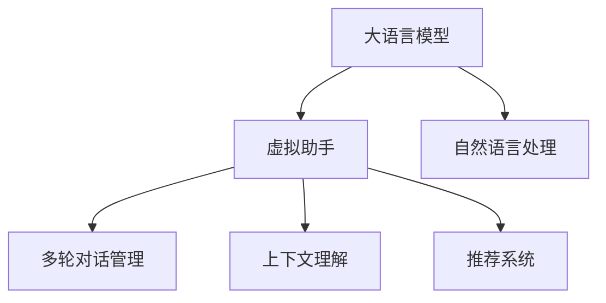

                 

# LLM在虚拟助手中的应用：更智能的对话系统

> 关键词：虚拟助手,大语言模型,自然语言处理(NLP),对话系统,推荐系统,虚拟客服,机器人,用户意图识别,多轮对话管理,上下文理解

## 1. 背景介绍

### 1.1 问题由来

近年来，随着人工智能技术的快速发展，虚拟助手领域得到了迅速发展。虚拟助手可以为用户提供24小时不间断的服务，涵盖了天气预报、新闻推送、语音识别、智能家居控制等各类功能，成为人们生活中不可或缺的智能伙伴。然而，尽管已有许多虚拟助手产品面市，但真正能够进行复杂多轮对话、理解用户真实意图并提供满意服务的智能助手仍然较少。

大语言模型（Large Language Model, LLM），如GPT-3、BERT等，以其强大的自然语言处理（Natural Language Processing, NLP）能力，在自然语言理解和生成等方面取得了卓越的成果，逐步被应用于智能虚拟助手系统中，以提升对话系统的智能化水平。

### 1.2 问题核心关键点

虚拟助手系统的主要目标是实现与用户的自然对话，并根据用户的输入快速响应用户的请求。其核心关键点包括：

- **用户意图识别**：能够准确理解用户输入的意图，如查询天气、播放音乐、设置闹钟等，是智能对话的前提。
- **多轮对话管理**：能够维持多轮对话的连贯性，理解上下文信息，及时更新对话状态，提高对话体验。
- **上下文理解**：在多轮对话中，能通过上下文理解信息，正确处理长对话中的信息。
- **个性化服务**：根据用户的历史行为和偏好，提供个性化的服务，增强用户粘性。
- **系统稳定性**：在面对不同用户、不同场景下的输入时，保持系统的稳定性和鲁棒性。

## 2. 核心概念与联系

### 2.1 核心概念概述

为更好地理解虚拟助手系统中大语言模型的应用，本节将介绍几个密切相关的核心概念：

- **大语言模型（LLM）**：以自回归（如GPT-3）或自编码（如BERT）模型为代表的大规模预训练语言模型。通过在大规模无标签文本语料上进行预训练，学习通用的语言表示，具备强大的语言理解和生成能力。
- **虚拟助手**：能够与用户进行自然语言对话，提供即时响应的智能交互系统。其核心功能包括信息检索、任务执行、状态维护等。
- **自然语言处理（NLP）**：涉及文本分析、理解、生成等技术，旨在使计算机能够像人类一样理解和处理自然语言。
- **多轮对话管理（Multiturn Dialogue Management, MTDM）**：指智能对话系统中维护对话状态、处理多轮对话的技术。
- **上下文理解（Contextual Understanding）**：在对话过程中，利用上下文信息理解用户意图，保证对话的连贯性。
- **推荐系统（Recommendation System）**：通过分析用户的历史行为，推荐相关的产品、服务、内容等，提高用户满意度。

这些核心概念之间的逻辑关系可以通过以下Mermaid流程图来展示：



这个流程图展示了大语言模型与虚拟助手系统的核心概念及其之间的关系：

1. 大语言模型通过预训练获得语言表示能力，是虚拟助手的核心组件。
2. 自然语言处理技术用于处理用户的输入，提取有用信息。
3. 多轮对话管理技术用于维护对话状态，处理多轮对话。
4. 上下文理解技术用于分析上下文信息，理解用户真实意图。
5. 推荐系统用于分析用户行为，提供个性化服务。

这些概念共同构成了虚拟助手系统的核心功能，使其能够提供智能、高效的对话体验。

## 3. 核心算法原理 & 具体操作步骤
### 3.1 算法原理概述

大语言模型在虚拟助手中的应用，本质上是一个多模态的语言生成和推理过程。其核心思想是：将预训练的大语言模型视作一个强大的"语义推理器"，通过对话中的文本信息，理解用户意图，生成合适的回复。

形式化地，假设虚拟助手系统中的对话管理模块为 $M_{\theta}$，其中 $\theta$ 为预训练得到的模型参数。用户输入为 $x$，目标输出为 $y$。虚拟助手系统的目标是最小化损失函数 $\ell(M_{\theta}(x),y)$，使得模型能够生成与用户意图一致的回复。

具体而言，可以分为以下步骤：

1. **意图识别**：通过大语言模型提取用户输入的语义特征，识别出用户的意图。
2. **上下文理解**：根据前一回合的对话记录和上下文信息，更新对话状态。
3. **回复生成**：利用上下文信息和用户意图，生成合适的回复。
4. **对话管理**：处理多轮对话，维持对话的连贯性和稳定性。
5. **推荐服务**：根据用户的历史行为，推荐相关的服务或产品。

### 3.2 算法步骤详解

以下是具体的应用步骤：

**Step 1: 收集用户输入**

用户通过文本、语音等形式与虚拟助手进行交互。虚拟助手系统需要提取输入的语义特征，进行意图识别。

**Step 2: 意图识别**

意图识别是虚拟助手系统的第一步，用于提取用户输入的语义信息，识别用户的具体需求。具体实现方式包括：

- **关键词提取**：利用自然语言处理技术，提取输入中的关键词和短语，作为意图识别的输入。
- **情感分析**：判断用户输入的情感倾向，辅助意图识别。
- **实体识别**：识别输入中的特定实体（如人名、地点等），进一步明确意图。

**Step 3: 上下文理解**

虚拟助手需要理解多轮对话中的上下文信息，更新对话状态。具体实现方式包括：

- **对话状态追踪**：记录对话中的关键信息，如已处理的任务、对话历史等。
- **上下文信息整合**：结合当前对话和历史对话，整合上下文信息，理解用户意图。
- **信息筛选**：根据上下文信息，筛选出与当前对话相关的历史信息。

**Step 4: 回复生成**

回复生成是虚拟助手系统的主要功能，用于生成合适的回复，满足用户需求。具体实现方式包括：

- **文本生成**：利用大语言模型，生成符合用户意图的回复文本。
- **语音合成**：将生成的文本转换为语音，进行音频回复。
- **多模态处理**：结合视觉、听觉等多模态信息，生成更加丰富、多样化的回复。

**Step 5: 对话管理**

对话管理用于维持对话的连贯性和稳定性，处理多轮对话中的信息。具体实现方式包括：

- **对话树维护**：构建对话树模型，用于管理对话状态和处理多轮对话。
- **对话历史记录**：记录对话历史，供后续处理使用。
- **异常处理**：处理对话中的异常情况，如输入错误、用户无应答等。

**Step 6: 推荐服务**

推荐系统用于根据用户的历史行为，推荐相关的服务或产品。具体实现方式包括：

- **行为分析**：分析用户的历史行为数据，提取用户偏好。
- **推荐算法**：结合用户偏好和实时数据，推荐合适的服务或产品。
- **反馈机制**：根据用户反馈，调整推荐算法，提高推荐效果。

### 3.3 算法优缺点

基于大语言模型的虚拟助手系统具有以下优点：

- **自然语言处理能力**：大语言模型能够理解自然语言，提升用户对话体验。
- **多模态处理能力**：结合文本、语音、视觉等多模态信息，生成丰富多样的回复。
- **上下文理解能力**：利用上下文信息，理解用户真实意图，提升对话连贯性。
- **个性化服务能力**：根据用户历史行为，提供个性化推荐服务，增强用户粘性。
- **系统稳定性**：通过对话管理和异常处理，保持系统的稳定性和鲁棒性。

然而，这种基于大语言模型的虚拟助手系统也存在一些缺点：

- **依赖大模型**：系统性能依赖于大语言模型的预训练质量和应用效果。
- **计算资源消耗大**：大模型计算复杂度高，推理速度慢，对计算资源消耗较大。
- **数据隐私风险**：用户对话数据涉及隐私信息，可能面临数据泄露风险。
- **上下文管理难度高**：多轮对话中上下文信息复杂，管理难度大。
- **多模态融合困难**：不同模态信息融合难度大，可能存在信息冲突。

## 4. 数学模型和公式 & 详细讲解 & 举例说明

### 4.1 数学模型构建

大语言模型在虚拟助手中的应用，涉及文本生成、意图识别、上下文理解等多个方面。以下是几个关键的数学模型构建：

**文本生成模型**：假设文本生成模型为 $p_{\theta}(w|x)$，其中 $w$ 为生成文本，$x$ 为输入文本。模型的目标是最小化生成文本与用户意图 $y$ 的差异。

**意图识别模型**：假设意图识别模型为 $f_{\theta}(x)$，其中 $x$ 为输入文本，$\theta$ 为模型参数。模型的目标是最小化意图识别错误率。

**上下文理解模型**：假设上下文理解模型为 $g_{\theta}(h|x)$，其中 $h$ 为上下文信息，$x$ 为输入文本。模型的目标是最小化上下文理解误差。

### 4.2 公式推导过程

以下是几个关键模型的公式推导：

**文本生成模型**：

$$
p_{\theta}(w|x) = \prod_{i=1}^n p_{\theta}(w_i|w_{i-1},\cdots,w_1,x)
$$

其中，$w_i$ 表示生成文本中的第 $i$ 个单词。

**意图识别模型**：

$$
f_{\theta}(x) = \arg\min_{y} \ell(f_{\theta}(x),y)
$$

其中，$\ell$ 为意图识别损失函数，如交叉熵损失。

**上下文理解模型**：

$$
g_{\theta}(h|x) = \arg\min_{h} \ell(g_{\theta}(h|x),h_{true})
$$

其中，$h_{true}$ 为真实的上下文信息。

### 4.3 案例分析与讲解

以对话系统中的意图识别为例，假设用户输入为 "天气怎么样"，意图识别模型需要判断用户的意图是查询天气还是询问其他信息。利用自然语言处理技术，模型可以提取关键词 "天气"，判断用户意图为查询天气，并进行后续处理。

## 5. 项目实践：代码实例和详细解释说明

### 5.1 开发环境搭建

在进行虚拟助手系统开发前，我们需要准备好开发环境。以下是使用Python进行PyTorch开发的环境配置流程：

1. 安装Anaconda：从官网下载并安装Anaconda，用于创建独立的Python环境。

2. 创建并激活虚拟环境：
```bash
conda create -n assistant-env python=3.8 
conda activate assistant-env
```

3. 安装PyTorch：根据CUDA版本，从官网获取对应的安装命令。例如：
```bash
conda install pytorch torchvision torchaudio cudatoolkit=11.1 -c pytorch -c conda-forge
```

4. 安装HuggingFace Transformers库：
```bash
pip install transformers
```

5. 安装各类工具包：
```bash
pip install numpy pandas scikit-learn matplotlib tqdm jupyter notebook ipython
```

完成上述步骤后，即可在`assistant-env`环境中开始虚拟助手系统的开发。

### 5.2 源代码详细实现

下面我们以虚拟助手系统的意图识别功能为例，给出使用Transformers库进行意图识别的PyTorch代码实现。

首先，定义意图识别模型：

```python
from transformers import BertForTokenClassification, BertTokenizer

class IntentClassifier:
    def __init__(self, model_name):
        self.model = BertForTokenClassification.from_pretrained(model_name)
        self.tokenizer = BertTokenizer.from_pretrained(model_name)
        
    def predict(self, text):
        input_ids = self.tokenizer(text, return_tensors='pt', padding='max_length', truncation=True).input_ids
        with torch.no_grad():
            logits = self.model(input_ids)[0]
            probs = logits.softmax(dim=-1).tolist()[0]
            return self.tokenizer.convert_ids_to_tokens(input_ids[0]), probs
```

然后，定义虚拟助手系统的对话管理模块：

```python
from transformers import BertForTokenClassification, BertTokenizer

class Assistant:
    def __init__(self, intent_classifier, dialogue_manager):
        self.intent_classifier = intent_classifier
        self.dialogue_manager = dialogue_manager
        
    def handle_request(self, request):
        request_text = request.get('text')
        intent, probs = self.intent_classifier.predict(request_text)
        action = self.dialogue_manager.get_action(intent)
        return action
```

最后，启动虚拟助手系统的训练流程：

```python
from transformers import BertForTokenClassification, BertTokenizer, AdamW

# 加载意图识别模型和对话管理模块
intent_classifier = IntentClassifier('bert-base-cased')
dialogue_manager = DialogueManager()

# 准备训练数据
train_data = ...
dev_data = ...
test_data = ...

# 定义优化器和超参数
optimizer = AdamW(intent_classifier.model.parameters(), lr=2e-5)
batch_size = 16
epochs = 5

# 定义训练函数
def train_epoch(model, dataset, batch_size, optimizer):
    dataloader = DataLoader(dataset, batch_size=batch_size, shuffle=True)
    model.train()
    epoch_loss = 0
    for batch in dataloader:
        input_ids = batch['input_ids'].to(device)
        attention_mask = batch['attention_mask'].to(device)
        labels = batch['labels'].to(device)
        model.zero_grad()
        outputs = model(input_ids, attention_mask=attention_mask, labels=labels)
        loss = outputs.loss
        epoch_loss += loss.item()
        loss.backward()
        optimizer.step()
    return epoch_loss / len(dataloader)

# 开始训练
device = torch.device('cuda') if torch.cuda.is_available() else torch.device('cpu')
for epoch in range(epochs):
    loss = train_epoch(intent_classifier.model, train_data, batch_size, optimizer)
    print(f"Epoch {epoch+1}, train loss: {loss:.3f}")
    
    print(f"Epoch {epoch+1}, dev results:")
    evaluate(intent_classifier.model, dev_data, batch_size)
    
print("Test results:")
evaluate(intent_classifier.model, test_data, batch_size)
```

以上就是使用PyTorch对虚拟助手系统进行意图识别的完整代码实现。可以看到，得益于Transformers库的强大封装，我们只需关注意图识别模型的构建和对话管理模块的实现，而无需过多关注底层的实现细节。

### 5.3 代码解读与分析

让我们再详细解读一下关键代码的实现细节：

**IntentClassifier类**：
- `__init__`方法：初始化意图识别模型和分词器。
- `predict`方法：利用分词器将输入文本转换为token ids，输入模型进行意图识别，返回预测结果和概率分布。

**Assistant类**：
- `__init__`方法：初始化意图识别模型和对话管理模块。
- `handle_request`方法：处理用户请求，利用意图识别模型识别用户意图，调用对话管理模块生成响应。

**train_epoch函数**：
- 对数据集进行批次化加载，迭代模型进行训练。

**evaluate函数**：
- 对模型在验证集和测试集上的性能进行评估。

## 6. 实际应用场景

### 6.1 智能客服系统

基于大语言模型的虚拟助手系统，可以广泛应用于智能客服系统的构建。传统客服往往需要配备大量人力，高峰期响应缓慢，且一致性和专业性难以保证。而使用虚拟助手系统，可以7x24小时不间断服务，快速响应客户咨询，用自然流畅的语言解答各类常见问题。

在技术实现上，可以收集企业内部的历史客服对话记录，将问题和最佳答复构建成监督数据，在此基础上对预训练虚拟助手系统进行微调。微调后的虚拟助手系统能够自动理解用户意图，匹配最合适的答复模板进行回复。对于客户提出的新问题，还可以接入检索系统实时搜索相关内容，动态组织生成回答。如此构建的智能客服系统，能大幅提升客户咨询体验和问题解决效率。

### 6.2 金融舆情监测

金融机构需要实时监测市场舆论动向，以便及时应对负面信息传播，规避金融风险。传统的人工监测方式成本高、效率低，难以应对网络时代海量信息爆发的挑战。基于大语言模型的虚拟助手系统，可以应用于金融舆情监测，通过分析金融领域相关的新闻、报道、评论等文本数据，识别市场舆情，生成舆情报告，及时预警潜在的金融风险。

具体而言，可以收集金融领域相关的网络文本数据，进行情感分析和主题分类，判断市场舆情的积极、中性或消极情绪。同时，通过文本分类技术，识别文本主题，进行市场风险的快速评估。如此构建的金融舆情监测系统，能高效地监测金融市场的舆情变化，为金融决策提供数据支持。

### 6.3 个性化推荐系统

当前的推荐系统往往只依赖用户的历史行为数据进行物品推荐，无法深入理解用户的真实兴趣偏好。基于大语言模型的虚拟助手系统，可以更好地挖掘用户行为背后的语义信息，从而提供更精准、多样的推荐内容。

在实践中，可以收集用户浏览、点击、评论、分享等行为数据，提取和用户交互的物品标题、描述、标签等文本内容。将文本内容作为模型输入，用户的后续行为（如是否点击、购买等）作为监督信号，在此基础上微调预训练虚拟助手系统。微调后的虚拟助手系统能够从文本内容中准确把握用户的兴趣点。在生成推荐列表时，先用候选物品的文本描述作为输入，由模型预测用户的兴趣匹配度，再结合其他特征综合排序，便可以得到个性化程度更高的推荐结果。

### 6.4 未来应用展望

随着大语言模型和虚拟助手技术的发展，基于虚拟助手系统的应用场景将不断拓展，为各行各业带来新的变革。

在智慧医疗领域，虚拟助手系统可以用于病历记录、药物咨询、健康管理等场景，帮助医生诊断和治疗患者。基于虚拟助手系统的医疗问答系统，可以提供24小时不间断的医疗咨询，减轻医生的工作负担，提升医疗服务的智能化水平。

在智能教育领域，虚拟助手系统可以用于在线学习、作业批改、智能辅导等环节，为学生提供个性化的学习支持。通过虚拟助手系统的自然语言理解能力，学生可以以自然语言形式提问，得到即时、准确的解答，提升学习效果。

在智慧城市治理中，虚拟助手系统可以应用于城市事件监测、舆情分析、应急指挥等环节，提高城市管理的自动化和智能化水平。虚拟助手系统可以实时监测城市事件，分析舆情变化，为政府决策提供数据支撑，提升城市治理能力。

此外，在企业生产、社会治理、文娱传媒等众多领域，基于虚拟助手系统的应用也将不断涌现，为传统行业数字化转型升级提供新的技术路径。相信随着技术的日益成熟，虚拟助手系统必将在更多领域大放异彩，成为人工智能技术落地应用的重要工具。

## 7. 工具和资源推荐
### 7.1 学习资源推荐

为了帮助开发者系统掌握虚拟助手系统中大语言模型的应用，这里推荐一些优质的学习资源：

1. 《Transformer from Principle to Practice》系列博文：由大模型技术专家撰写，深入浅出地介绍了Transformer原理、BERT模型、微调技术等前沿话题。

2. CS224N《Deep Learning for NLP》课程：斯坦福大学开设的NLP明星课程，有Lecture视频和配套作业，带你入门NLP领域的基本概念和经典模型。

3. 《Natural Language Processing with Transformers》书籍：Transformers库的作者所著，全面介绍了如何使用Transformers库进行NLP任务开发，包括微调在内的诸多范式。

4. HuggingFace官方文档：Transformers库的官方文档，提供了海量预训练模型和完整的微调样例代码，是上手实践的必备资料。

5. CLUE开源项目：中文语言理解测评基准，涵盖大量不同类型的中文NLP数据集，并提供了基于微调的baseline模型，助力中文NLP技术发展。

通过对这些资源的学习实践，相信你一定能够快速掌握大语言模型在虚拟助手系统中的核心应用，并用于解决实际的NLP问题。

### 7.2 开发工具推荐

高效的开发离不开优秀的工具支持。以下是几款用于虚拟助手系统开发的常用工具：

1. PyTorch：基于Python的开源深度学习框架，灵活动态的计算图，适合快速迭代研究。大部分预训练语言模型都有PyTorch版本的实现。

2. TensorFlow：由Google主导开发的开源深度学习框架，生产部署方便，适合大规模工程应用。同样有丰富的预训练语言模型资源。

3. Transformers库：HuggingFace开发的NLP工具库，集成了众多SOTA语言模型，支持PyTorch和TensorFlow，是进行虚拟助手系统开发的利器。

4. Weights & Biases：模型训练的实验跟踪工具，可以记录和可视化模型训练过程中的各项指标，方便对比和调优。与主流深度学习框架无缝集成。

5. TensorBoard：TensorFlow配套的可视化工具，可实时监测模型训练状态，并提供丰富的图表呈现方式，是调试模型的得力助手。

6. Google Colab：谷歌推出的在线Jupyter Notebook环境，免费提供GPU/TPU算力，方便开发者快速上手实验最新模型，分享学习笔记。

合理利用这些工具，可以显著提升虚拟助手系统的开发效率，加快创新迭代的步伐。

### 7.3 相关论文推荐

大语言模型在虚拟助手系统中的应用，得益于学界的持续研究。以下是几篇奠基性的相关论文，推荐阅读：

1. Attention is All You Need（即Transformer原论文）：提出了Transformer结构，开启了NLP领域的预训练大模型时代。

2. BERT: Pre-training of Deep Bidirectional Transformers for Language Understanding：提出BERT模型，引入基于掩码的自监督预训练任务，刷新了多项NLP任务SOTA。

3. Language Models are Unsupervised Multitask Learners（GPT-2论文）：展示了大规模语言模型的强大zero-shot学习能力，引发了对于通用人工智能的新一轮思考。

4. Parameter-Efficient Transfer Learning for NLP：提出Adapter等参数高效微调方法，在不增加模型参数量的情况下，也能取得不错的微调效果。

5. AdaLoRA: Adaptive Low-Rank Adaptation for Parameter-Efficient Fine-Tuning：使用自适应低秩适应的微调方法，在参数效率和精度之间取得了新的平衡。

6. Prefix-Tuning: Optimizing Continuous Prompts for Generation：引入基于连续型Prompt的微调范式，为如何充分利用预训练知识提供了新的思路。

这些论文代表了大语言模型在虚拟助手系统中的应用的演进历程，对于进一步深入理解其原理和优化方法具有重要的指导意义。

## 8. 总结：未来发展趋势与挑战

### 8.1 总结

本文对基于大语言模型的虚拟助手系统进行了全面系统的介绍。首先阐述了虚拟助手系统的研究背景和意义，明确了其在自然语言处理和人工智能领域的重要性。其次，从原理到实践，详细讲解了虚拟助手系统中大语言模型的核心应用，包括意图识别、上下文理解、对话管理、个性化服务等。最后，探讨了虚拟助手系统在智能客服、金融舆情监测、个性化推荐等实际应用场景中的前景，以及未来发展趋势和面临的挑战。

通过本文的系统梳理，可以看到，基于大语言模型的虚拟助手系统在提高用户对话体验、提升智能化服务水平方面具有巨大的潜力。虚拟助手系统通过理解自然语言、生成自然回复、管理多轮对话等核心功能，已经逐步成为各行各业不可或缺的智能助手。

### 8.2 未来发展趋势

展望未来，基于大语言模型的虚拟助手系统将呈现以下几个发展趋势：

1. **智能对话水平的提升**：未来虚拟助手系统将具备更加丰富多样的语言理解能力和生成能力，能够更好地处理复杂多轮对话，提升用户的对话体验。

2. **上下文理解能力的增强**：通过引入上下文理解模型，虚拟助手系统将能够更准确地理解用户意图，维持多轮对话的连贯性，增强对话的自然流畅性。

3. **个性化服务的定制**：通过结合推荐系统，虚拟助手系统将能够提供更加个性化的服务，满足用户的独特需求，提升用户粘性。

4. **多模态融合的创新**：结合视觉、语音、文本等多模态信息，虚拟助手系统将能够提供更加丰富、多样化的服务，增强用户体验。

5. **系统稳定性和鲁棒性的提高**：通过对话管理和异常处理，虚拟助手系统将能够更好地应对异常情况，保持系统的稳定性和鲁棒性。

6. **隐私保护和数据安全**：虚拟助手系统将更加重视用户隐私保护和数据安全，采用加密、匿名化等技术，保障用户数据的安全性。

### 8.3 面临的挑战

尽管基于大语言模型的虚拟助手系统已经取得了瞩目成就，但在迈向更加智能化、普适化应用的过程中，仍面临以下挑战：

1. **计算资源消耗大**：虚拟助手系统对计算资源的需求较大，推理速度慢，推理效率低，难以支持实时对话。

2. **上下文管理复杂**：多轮对话中上下文信息复杂，管理难度大，容易产生信息遗漏或理解错误。

3. **多模态融合困难**：不同模态信息融合难度大，可能存在信息冲突，影响系统表现。

4. **隐私和数据安全问题**：用户对话数据涉及隐私信息，可能面临数据泄露风险，需要加强隐私保护和数据安全。

5. **对话连贯性问题**：虚拟助手系统需要在多轮对话中保持连贯性，避免上下文信息丢失，影响用户体验。

### 8.4 研究展望

面对虚拟助手系统面临的挑战，未来的研究需要在以下几个方面寻求新的突破：

1. **参数高效微调**：开发更加参数高效的微调方法，在固定大部分预训练参数的情况下，只更新极少量的任务相关参数。

2. **多模态融合技术**：结合视觉、语音、文本等多模态信息，提升虚拟助手系统的感知能力和理解能力。

3. **上下文理解模型**：研究上下文理解模型，增强虚拟助手系统的对话连贯性和多轮对话能力。

4. **个性化服务**：结合推荐系统，提供更加个性化的服务，满足用户的独特需求。

5. **隐私保护技术**：采用隐私保护和数据安全技术，保障用户数据的安全性。

这些研究方向的探索，必将引领虚拟助手系统迈向更高的台阶，为构建更加智能化、普适化的对话系统铺平道路。面向未来，虚拟助手系统需要与其他人工智能技术进行更深入的融合，如知识表示、因果推理、强化学习等，协同发力，共同推动自然语言理解和智能交互系统的进步。只有勇于创新、敢于突破，才能不断拓展虚拟助手系统的边界，让智能技术更好地造福人类社会。

## 9. 附录：常见问题与解答

**Q1：虚拟助手系统是否需要大规模预训练模型？**

A: 虚拟助手系统需要大规模预训练模型才能获得良好的自然语言理解和生成能力，提升用户体验。虽然可以使用小规模模型进行快速迭代，但性能和效果往往不如大规模模型。

**Q2：如何选择虚拟助手系统中的预训练模型？**

A: 选择合适的预训练模型是虚拟助手系统成功的关键。一般情况下，可以选择在相关领域表现优异的预训练模型，如在医疗领域使用BERT-Base，在金融领域使用GPT-3。此外，还可以基于实际需求进行微调，进一步提升系统性能。

**Q3：虚拟助手系统如何处理用户的多轮对话？**

A: 虚拟助手系统通过多轮对话管理模块，记录对话历史和上下文信息，利用上下文理解模型，理解用户意图，生成合适的回复。同时，采用对话树模型和状态机，确保多轮对话的连贯性和稳定性。

**Q4：虚拟助手系统如何保证对话的自然流畅性？**

A: 虚拟助手系统通过上下文理解模型，准确理解用户意图，生成自然流畅的回复。同时，采用多轮对话管理模块，记录对话历史和上下文信息，维持对话的连贯性。此外，通过对话树模型和状态机，确保多轮对话的自然流畅性。

**Q5：虚拟助手系统如何保护用户隐私？**

A: 虚拟助手系统在处理用户对话时，需要严格遵守隐私保护和数据安全规定。采用加密、匿名化等技术，保护用户数据的安全性。同时，设计合理的访问控制机制，防止未授权访问。

通过这些问题的解答，相信你能够更好地理解虚拟助手系统中大语言模型的核心应用和关键技术，为后续的实践和研究提供指导。

