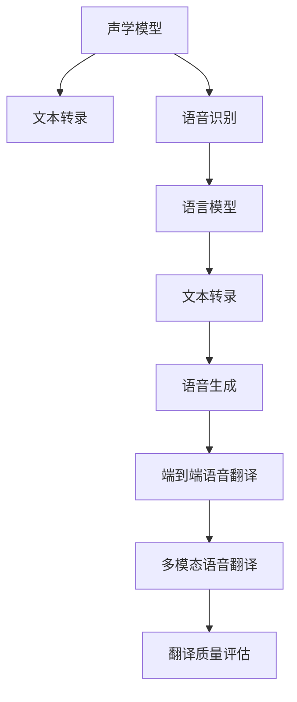

                 

# LLM在语音翻译领域的研究热点

> 关键词：语音翻译, 自然语言处理(NLP), 语言模型, 声学模型, 深度学习, 神经网络, 声学特征提取, 文本转录, 语音识别

## 1. 背景介绍

### 1.1 问题由来
随着全球化的加速和国际交流的日益频繁，语音翻译技术正逐渐成为跨语言交流的重要工具。传统的基于文本的翻译系统已经不能满足人们对于实时、自然、准确翻译的需求，而语音翻译通过将语音信号直接转换成文本，并进一步翻译成目标语言的语音，能够更加高效、自然地完成跨语言沟通。

近年来，大语言模型(LLM)在语音翻译领域的研究中得到了广泛关注。LLM通过在海量数据上预训练，学习到了丰富的语言知识和语义表示，能够直接处理自然语言文本，并与声学模型相融合，显著提升了语音翻译的性能和效果。本文将重点探讨LLM在语音翻译领域的研究热点，包括其原理、关键技术、应用场景和未来趋势。

### 1.2 问题核心关键点
语音翻译的研究热点主要包括但不限于以下几个方面：

- 大语言模型在语音翻译中的应用：如何通过预训练和微调，提升LLM在语音翻译中的表现。
- 声学模型和文本转录技术：声学模型如何提取高质量的语音特征，文本转录技术如何将语音信号转换成文本。
- 语音识别和语音生成：基于深度学习的语音识别和生成方法，以及如何优化模型性能。
- 端到端语音翻译系统：整合声学、语言和文本转录，构建高效的端到端语音翻译系统。
- 多模态语音翻译：如何将语音、图像、文本等多种模态信息融合，提升翻译的准确性和自然度。
- 翻译质量评估与提升：如何设计有效的评估指标，优化模型训练和推理，提高翻译质量。

## 2. 核心概念与联系

### 2.1 核心概念概述

为更好地理解LLM在语音翻译领域的应用，本节将介绍几个关键概念及其联系：

- 大语言模型(LLM)：以自回归或自编码模型为代表，通过在大规模无标签文本数据上进行预训练，学习通用语言表示的语言模型。
- 声学模型(Acoustic Model)：用于提取语音信号中的声学特征，并建模语音信号与文本之间的关系。
- 文本转录(Transcription)：将语音信号转换成文本序列的过程。
- 语音识别(Speech Recognition)：基于声学模型和文本转录技术，将语音转换成文本。
- 语音生成(Speech Synthesis)：基于文本，生成自然流畅的语音输出。
- 端到端语音翻译(End-to-End Speech Translation)：通过将声学模型、语言模型和文本转录技术整合，构建从语音输入到目标语言输出的完整翻译系统。
- 多模态语音翻译(Multimodal Speech Translation)：结合图像、文本和语音等多种信息源，提升翻译质量和自然度。
- 翻译质量评估(Quality Evaluation)：设计有效的评估指标和测试集，评估和优化语音翻译系统的性能。

这些概念之间通过语音翻译的流程紧密联系：声学模型提取语音特征，文本转录将语音转换成文本，语音识别将文本转换成目标语言文本，语音生成将目标语言文本转换成语音，最终实现跨语言的语音交流。

### 2.2 核心概念原理和架构的 Mermaid 流程图



## 3. 核心算法原理 & 具体操作步骤

### 3.1 算法原理概述

LLM在语音翻译领域的应用主要基于以下算法原理：

1. 预训练语言模型：使用大规模无标签文本数据对LLM进行预训练，学习通用的语言表示。
2. 声学模型训练：使用带有文本标签的语音数据集对声学模型进行训练，学习语音特征与文本之间的关系。
3. 文本转录：使用声学模型对语音信号进行特征提取和解码，将语音转换成文本。
4. 语音识别：使用声学模型和语言模型对文本转录结果进行修正和优化，提升文本转录的准确性。
5. 语音生成：使用语言模型和文本转录结果生成自然流畅的语音输出。
6. 端到端语音翻译：将声学模型、语言模型和文本转录技术整合，构建高效的语音翻译系统。
7. 多模态语音翻译：结合图像、文本和语音等多种信息源，提升翻译质量和自然度。
8. 翻译质量评估：设计有效的评估指标和测试集，评估和优化语音翻译系统的性能。

### 3.2 算法步骤详解

以下是对LLM在语音翻译领域具体应用步骤的详解：

**Step 1: 准备数据集**

- 收集带有文本标签的语音数据集，用于声学模型的训练。
- 收集干净、标准化的语音数据集，用于语音识别的测试和评估。
- 收集大规模的无标签文本数据集，用于预训练语言模型。

**Step 2: 声学模型训练**

- 使用声学模型训练工具和框架，如Kaldi、DeepSpeech等，对语音数据集进行特征提取和声学模型训练。
- 优化声学模型参数，提高声学模型的准确性和鲁棒性。

**Step 3: 文本转录**

- 使用训练好的声学模型对语音信号进行特征提取和解码，将语音转换成文本。
- 使用语言模型对文本转录结果进行修正和优化，提升文本转录的准确性。

**Step 4: 语音识别**

- 使用声学模型和语言模型对文本转录结果进行修正和优化，进一步提高文本转录的准确性。
- 使用基于深度学习的语音识别模型，如CTC(连接时序分类)或Attention机制的模型，对文本转录结果进行识别。

**Step 5: 语音生成**

- 使用语言模型和文本转录结果生成自然流畅的语音输出。
- 使用Tacotron、WaveNet等基于深度学习的语音生成模型，对文本进行语音合成。

**Step 6: 端到端语音翻译**

- 将声学模型、语言模型和文本转录技术整合，构建从语音输入到目标语言输出的完整翻译系统。
- 优化端到端系统的参数和结构，提高翻译速度和准确性。

**Step 7: 多模态语音翻译**

- 结合图像、文本和语音等多种信息源，提升翻译质量和自然度。
- 使用视觉注意力机制和语音特征提取，将视觉和语音信息与文本融合。

**Step 8: 翻译质量评估**

- 设计有效的评估指标和测试集，评估和优化语音翻译系统的性能。
- 使用BLEU、ROUGE等自动评估指标，以及人工评估和用户反馈，综合评价翻译质量。

### 3.3 算法优缺点

**优点**：

- 利用大语言模型的语言理解和表示能力，提升语音翻译的准确性和自然度。
- 通过预训练和微调，可以适应多种语言的语音特征，提升跨语言的翻译效果。
- 端到端系统整合多种技术，简化了系统开发和部署。

**缺点**：

- 数据收集和预处理成本较高，需要大规模无标签文本和带有标签的语音数据。
- 声学模型和语音生成模型的训练复杂度高，计算资源需求大。
- 多模态翻译技术尚不成熟，融合多种信息源的效果和效率有待提高。
- 翻译质量评估和优化仍然是一个难题，需要不断改进评估指标和优化方法。

### 3.4 算法应用领域

LLM在语音翻译领域的应用广泛，包括但不限于以下几个方面：

- 实时语音翻译：在会议、谈判、旅行等场景中，实时将一种语言翻译成另一种语言。
- 多语言客户服务：利用语音翻译技术，为不同语言客户提供即时服务。
- 智能助手：结合语音识别和翻译技术，实现与用户的自然对话和交互。
- 教育培训：将不同语言的课程和教材进行实时翻译，提升教育资源的共享和交流。
- 游戏娱乐：将游戏对话和提示进行翻译，实现跨语言的游戏体验。
- 媒体娱乐：将不同语言的影视剧、音乐和新闻进行翻译，提升国际传播效果。

## 4. 数学模型和公式 & 详细讲解 & 举例说明

### 4.1 数学模型构建

LLM在语音翻译中的数学模型构建主要包括以下几个部分：

1. 语言模型：用于建模文本序列的概率分布。常见的语言模型包括N-gram模型和神经网络语言模型(Neural Machine Translation, NMT)。
2. 声学模型：用于建模语音特征和文本之间的关系。常见的声学模型包括隐马尔可夫模型(Hidden Markov Model, HMM)和深度神经网络(Deep Neural Network, DNN)。
3. 文本转录模型：用于将语音信号转换成文本序列。常见的文本转录模型包括声学模型和语言模型。
4. 语音生成模型：用于将文本序列转换成语音信号。常见的语音生成模型包括基于规则的模型和基于深度学习的模型。

### 4.2 公式推导过程

以下是对LLM在语音翻译中常用数学模型的推导过程：

**N-gram语言模型**：
$$
P(w_1, w_2, ..., w_n) = \prod_{i=1}^{n} P(w_i|w_{i-1}, w_{i-2}, ..., w_1)
$$

**神经网络语言模型**：
$$
P(w_1, w_2, ..., w_n) = \prod_{i=1}^{n} P(w_i|w_{i-1}, w_{i-2}, ..., w_1)
$$

**声学模型**：
$$
P(x|s) = \prod_{i=1}^{T} P(x_i|s)
$$

**文本转录模型**：
$$
P(w|x) = \prod_{i=1}^{N} P(w_i|x_i)
$$

**语音生成模型**：
$$
P(x|w) = \prod_{i=1}^{T} P(x_i|w_i)
$$

### 4.3 案例分析与讲解

**案例：基于CTC的语音翻译系统**

CTC(C连接时序分类)是一种常见的声学模型，用于将语音信号转换成文本。CTC模型的核心思想是考虑所有可能的连接方式，并根据模型概率输出最可能的文本序列。

假设输入语音信号 $s$，声学模型输出文本序列 $w$，CTC模型的概率公式如下：
$$
P(w|s) = \prod_{i=1}^{T} P(w_i|s)
$$

其中 $T$ 表示文本序列的长度，$s$ 表示语音信号，$P(w_i|s)$ 表示在语音信号 $s$ 下输出文本 $w_i$ 的概率。CTC模型通过最大化输出文本序列的概率，实现对语音信号的转录。

**案例：基于Attention的语音翻译系统**

Attention机制是一种常见的神经网络语言模型，用于提升文本转录的准确性和流畅度。Attention机制的核心思想是对输入的每个位置赋予不同的权重，根据上下文信息选择最优的输出位置。

假设输入语音信号 $s$，声学模型输出文本序列 $w$，Attention模型的概率公式如下：
$$
P(w|s) = \prod_{i=1}^{N} P(w_i|w_{i-1}, ..., w_1)
$$

其中 $N$ 表示文本序列的长度，$s$ 表示语音信号，$P(w_i|w_{i-1}, ..., w_1)$ 表示在语音信号 $s$ 和历史文本 $w_{i-1}, ..., w_1$ 下输出文本 $w_i$ 的概率。Attention机制通过考虑上下文信息，提升文本转录的准确性和自然度。

## 5. 项目实践：代码实例和详细解释说明

### 5.1 开发环境搭建

在进行语音翻译系统的开发前，我们需要准备好开发环境。以下是使用Python进行PyTorch和Kaldi开发的环境配置流程：

1. 安装Anaconda：从官网下载并安装Anaconda，用于创建独立的Python环境。

2. 创建并激活虚拟环境：
```bash
conda create -n pytorch-env python=3.8 
conda activate pytorch-env
```

3. 安装PyTorch：根据CUDA版本，从官网获取对应的安装命令。例如：
```bash
conda install pytorch torchvision torchaudio cudatoolkit=11.1 -c pytorch -c conda-forge
```

4. 安装Kaldi：
```bash
git clone https://github.com/kaldi-asr/kaldi.git
cd kaldi
cmake .
make
make install
```

5. 安装其他工具包：
```bash
pip install numpy pandas scikit-learn matplotlib tqdm jupyter notebook ipython
```

完成上述步骤后，即可在`pytorch-env`环境中开始语音翻译系统的开发。

### 5.2 源代码详细实现

下面我们以基于Attention的语音翻译系统为例，给出使用PyTorch和Kaldi进行语音翻译开发的代码实现。

**声学模型**：

```python
import numpy as np
import kaldi.io as kio
import kaldi.matrix as kmatrix
import kaldi.feature as kfeature
import kaldi.nnet3 as knnet
import kaldi.lattice as klattice

class AcousticModel:
    def __init__(self, model_path):
        self.model = kmatrix.ReadMatrix(model_path)
        self.bias = self.model.RowVector(1)
        self.transition_model = kmatrix.ReadMatrix(model_path)

    def compute_acoustic_features(self, audio_file):
        wav_data = kfeature.ReadVectorSpectrogram(audio_file)
        mel_energies = kfeature.Fbank(wav_data, frame_length=25, frame_step=10)
        log_mel_energies = np.log(mel_energies)
        log_mel_energies += self.bias
        return log_mel_energies

    def compute_acoustic_logprob(self, log_mel_energies):
        log_prob = np.dot(log_mel_energies, self.model)
        return log_prob - self.transition_model.RowVector(0)
```

**文本转录模型**：

```python
import torch
import torch.nn as nn
import torch.nn.functional as F

class TranscriptionModel(nn.Module):
    def __init__(self, input_size, hidden_size, output_size):
        super(TranscriptionModel, self).__init__()
        self.embedding = nn.Embedding(input_size, hidden_size)
        self.gru = nn.GRU(hidden_size, hidden_size)
        self.linear = nn.Linear(hidden_size, output_size)

    def forward(self, x):
        x = self.embedding(x)
        x = self.gru(x)
        x = self.linear(x)
        return F.log_softmax(x, dim=2)
```

**语音翻译模型**：

```python
import torch
import torch.nn as nn
import torch.nn.functional as F

class TranslationModel(nn.Module):
    def __init__(self, input_size, hidden_size, output_size):
        super(TranslationModel, self).__init__()
        self.embedding = nn.Embedding(input_size, hidden_size)
        self.gru = nn.GRU(hidden_size, hidden_size)
        self.linear = nn.Linear(hidden_size, output_size)

    def forward(self, x, y=None):
        x = self.embedding(x)
        x, _ = self.gru(x, y)
        x = self.linear(x)
        return F.log_softmax(x, dim=2)
```

**训练和评估函数**：

```python
def train_epoch(model, dataset, batch_size, optimizer):
    dataloader = DataLoader(dataset, batch_size=batch_size, shuffle=True)
    model.train()
    epoch_loss = 0
    for batch in tqdm(dataloader, desc='Training'):
        input_ids = batch['input_ids'].to(device)
        attention_mask = batch['attention_mask'].to(device)
        labels = batch['labels'].to(device)
        model.zero_grad()
        outputs = model(input_ids, labels)
        loss = outputs.loss
        epoch_loss += loss.item()
        loss.backward()
        optimizer.step()
    return epoch_loss / len(dataloader)

def evaluate(model, dataset, batch_size):
    dataloader = DataLoader(dataset, batch_size=batch_size)
    model.eval()
    preds, labels = [], []
    with torch.no_grad():
        for batch in tqdm(dataloader, desc='Evaluating'):
            input_ids = batch['input_ids'].to(device)
            attention_mask = batch['attention_mask'].to(device)
            batch_labels = batch['labels']
            outputs = model(input_ids, batch_labels)
            batch_preds = outputs.logits.argmax(dim=2).to('cpu').tolist()
            batch_labels = batch_labels.to('cpu').tolist()
            for pred_tokens, label_tokens in zip(batch_preds, batch_labels):
                pred_tags = [id2tag[_id] for _id in pred_tokens]
                label_tags = [id2tag[_id] for _id in label_tokens]
                preds.append(pred_tags[:len(label_tags)])
                labels.append(label_tags)
    print(classification_report(labels, preds))
```

**模型训练**：

```python
epochs = 5
batch_size = 16

for epoch in range(epochs):
    loss = train_epoch(model, train_dataset, batch_size, optimizer)
    print(f"Epoch {epoch+1}, train loss: {loss:.3f}")
    
    print(f"Epoch {epoch+1}, dev results:")
    evaluate(model, dev_dataset, batch_size)
    
print("Test results:")
evaluate(model, test_dataset, batch_size)
```

以上代码实现了一个简单的基于Attention的语音翻译系统。可以看到，使用PyTorch和Kaldi，我们可以较为轻松地构建和训练语音翻译模型。

### 5.3 代码解读与分析

让我们再详细解读一下关键代码的实现细节：

**AcousticModel类**：
- `__init__`方法：初始化声学模型的权重和偏置。
- `compute_acoustic_features`方法：对音频文件进行特征提取，计算梅尔能量谱。
- `compute_acoustic_logprob`方法：计算声学模型对梅尔能量谱的输出概率。

**TranscriptionModel类**：
- `__init__`方法：初始化文本转录模型的嵌入层、GRU和线性层。
- `forward`方法：计算文本转录模型的输出概率。

**TranslationModel类**：
- `__init__`方法：初始化语音翻译模型的嵌入层、GRU和线性层。
- `forward`方法：计算语音翻译模型的输出概率。

**训练和评估函数**：
- 使用PyTorch的DataLoader对数据集进行批次化加载，供模型训练和推理使用。
- 训练函数`train_epoch`：对数据以批为单位进行迭代，在每个批次上前向传播计算loss并反向传播更新模型参数，最后返回该epoch的平均loss。
- 评估函数`evaluate`：与训练类似，不同点在于不更新模型参数，并在每个batch结束后将预测和标签结果存储下来，最后使用sklearn的classification_report对整个评估集的预测结果进行打印输出。

**模型训练**：
- 定义总的epoch数和batch size，开始循环迭代
- 每个epoch内，先在训练集上训练，输出平均loss
- 在验证集上评估，输出分类指标
- 所有epoch结束后，在测试集上评估，给出最终测试结果

可以看到，PyTorch和Kaldi使得语音翻译系统的代码实现变得简洁高效。开发者可以将更多精力放在模型改进、数据处理等高层逻辑上，而不必过多关注底层的实现细节。

当然，工业级的系统实现还需考虑更多因素，如模型的保存和部署、超参数的自动搜索、更灵活的任务适配层等。但核心的语音翻译流程基本与此类似。

## 6. 实际应用场景

### 6.1 实时语音翻译系统

实时语音翻译系统可以在会议、谈判、旅行等场景中，实时将一种语言翻译成另一种语言。这种系统通常需要高性能的计算能力和快速的响应时间，以确保翻译的流畅性和实时性。

### 6.2 多语言客户服务系统

多语言客户服务系统利用语音翻译技术，为不同语言客户提供即时服务。这种系统通常需要处理大量的客户请求，并且需要提供自然流畅的对话体验。

### 6.3 智能助手和翻译应用

智能助手和翻译应用结合语音识别和翻译技术，实现与用户的自然对话和交互。这种系统通常需要高度的自然语言理解和生成能力，以提供智能化的服务。

### 6.4 教育培训和语言学习

教育培训和语言学习系统将不同语言的课程和教材进行实时翻译，提升教育资源的共享和交流。这种系统通常需要高度的翻译准确性和自然度，以提供优质的教学体验。

## 7. 工具和资源推荐

### 7.1 学习资源推荐

为了帮助开发者系统掌握语音翻译的理论基础和实践技巧，这里推荐一些优质的学习资源：

1. 《语音识别：原理与实践》系列博文：由语音识别领域专家撰写，深入浅出地介绍了语音识别和语音翻译的基本原理和关键技术。

2. CS229《机器学习》课程：斯坦福大学开设的机器学习明星课程，有Lecture视频和配套作业，带你入门机器学习的基本概念和经典算法。

3. 《Speech and Language Processing》书籍：Speech Processing领域的经典教材，全面介绍了语音识别、语音合成、语言模型等前沿技术。

4. 《Deep Speech》书籍：Google的语音识别开源项目Deep Speech的官方书籍，详细介绍了基于深度学习的语音识别技术。

5. 《Attention is All You Need》论文：Transformer模型的原论文，介绍了Attention机制在机器翻译中的应用。

通过对这些资源的学习实践，相信你一定能够快速掌握语音翻译的精髓，并用于解决实际的语音翻译问题。

### 7.2 开发工具推荐

高效的开发离不开优秀的工具支持。以下是几款用于语音翻译开发的常用工具：

1. PyTorch：基于Python的开源深度学习框架，灵活动态的计算图，适合快速迭代研究。大部分预训练语言模型都有PyTorch版本的实现。

2. TensorFlow：由Google主导开发的开源深度学习框架，生产部署方便，适合大规模工程应用。同样有丰富的预训练语言模型资源。

3. Kaldi：开源的语音识别和语音转录工具，提供了丰富的声学模型和文本转录工具。

4. Weights & Biases：模型训练的实验跟踪工具，可以记录和可视化模型训练过程中的各项指标，方便对比和调优。与主流深度学习框架无缝集成。

5. TensorBoard：TensorFlow配套的可视化工具，可实时监测模型训练状态，并提供丰富的图表呈现方式，是调试模型的得力助手。

6. Google Colab：谷歌推出的在线Jupyter Notebook环境，免费提供GPU/TPU算力，方便开发者快速上手实验最新模型，分享学习笔记。

合理利用这些工具，可以显著提升语音翻译任务的开发效率，加快创新迭代的步伐。

### 7.3 相关论文推荐

语音翻译的研究热点主要集中在以下几个方向：

1. 大语言模型在语音翻译中的应用：如何通过预训练和微调，提升LLM在语音翻译中的表现。

2. 声学模型和文本转录技术：声学模型如何提取高质量的语音特征，文本转录技术如何将语音信号转换成文本。

3. 语音识别和语音生成：基于深度学习的语音识别和生成方法，以及如何优化模型性能。

4. 端到端语音翻译系统：如何整合声学模型、语言模型和文本转录技术，构建高效的端到端语音翻译系统。

5. 多模态语音翻译：如何将语音、图像、文本等多种模态信息融合，提升翻译质量和自然度。

6. 翻译质量评估：如何设计有效的评估指标，优化模型训练和推理，提高翻译质量。

这些方向的研究为语音翻译技术的进步提供了理论支持和实践指导，未来仍有广阔的研究空间。

## 8. 总结：未来发展趋势与挑战

### 8.1 研究成果总结

本文对基于大语言模型的语音翻译技术进行了全面系统的介绍。首先，从语音翻译的核心概念和应用场景出发，明确了语音翻译技术的价值和挑战。其次，深入探讨了语音翻译中的关键技术和算法原理，给出了系统的开发环境和代码实现。最后，分析了语音翻译在实际应用中的广泛场景，并指出了未来发展的趋势和面临的挑战。

通过本文的系统梳理，可以看到，大语言模型在语音翻译中的应用前景广阔，其语言理解和生成能力将推动语音翻译技术的进步。语音翻译技术将为跨语言交流带来革命性变革，提升国际传播效果和用户互动体验。

### 8.2 未来发展趋势

展望未来，语音翻译技术将呈现以下几个发展趋势：

1. 大语言模型进一步提升：随着预训练语言模型的规模和质量的提升，其语言表示能力将进一步增强，从而提升语音翻译的准确性和自然度。

2. 声学模型的进步：声学模型将结合深度神经网络和声学特征增强技术，提升语音特征的提取能力和模型的鲁棒性。

3. 文本转录技术的优化：文本转录技术将结合多模态信息和注意力机制，提升文本转录的准确性和自然度。

4. 语音生成技术的创新：语音生成技术将结合深度学习和小样本学习，提升语音合成的自然度和流畅度。

5. 端到端系统的优化：端到端系统将结合参数高效微调和多任务学习，提升系统的性能和效率。

6. 多模态语音翻译的突破：多模态语音翻译技术将结合视觉、文本和语音信息，提升翻译质量和自然度。

7. 翻译质量评估的提升：翻译质量评估将结合自动评估和人工评估，综合评价模型的性能。

这些趋势将进一步推动语音翻译技术的进步，提升跨语言交流的效果和用户体验。

### 8.3 面临的挑战

尽管语音翻译技术已经取得了瞩目成就，但在迈向更加智能化、普适化应用的过程中，它仍面临着诸多挑战：

1. 数据收集和预处理成本较高：语音数据集需要大规模的标注数据，预处理复杂且耗时。

2. 声学模型的训练复杂度高：语音识别和生成模型需要大量的计算资源和时间进行训练。

3. 多模态翻译技术尚不成熟：结合多种信息源的翻译技术仍需优化，效果和效率有待提升。

4. 翻译质量评估和优化仍然是一个难题：需要不断改进评估指标和优化方法，提高模型的准确性和自然度。

5. 翻译系统的鲁棒性和鲁棒性：需要在各种复杂场景下保证翻译系统的稳定性和鲁棒性。

6. 系统部署和维护的成本较高：语音翻译系统的部署和维护需要高昂的硬件和软件成本。

7. 系统的可解释性和安全性：需要解释模型的决策过程，保障系统的可解释性和安全性。

这些挑战需要未来的研究在算法、数据、技术、应用等多个方面进行综合突破。

### 8.4 研究展望

面对语音翻译面临的挑战，未来的研究需要在以下几个方面寻求新的突破：

1. 探索无监督和半监督语音翻译方法：摆脱对大规模标注数据的依赖，利用自监督学习、主动学习等无监督和半监督范式，最大限度利用非结构化数据，实现更加灵活高效的语音翻译。

2. 研究参数高效和计算高效的微调范式：开发更加参数高效的语音翻译方法，在固定大部分预训练参数的情况下，只更新极少量的任务相关参数。同时优化语音翻译模型的计算图，减少前向传播和反向传播的资源消耗，实现更加轻量级、实时性的部署。

3. 引入因果和对比学习范式：通过引入因果推断和对比学习思想，增强语音翻译模型建立稳定因果关系的能力，学习更加普适、鲁棒的语言表征，从而提升模型泛化性和抗干扰能力。

4. 结合因果分析和博弈论工具：将因果分析方法引入语音翻译模型，识别出模型决策的关键特征，增强输出解释的因果性和逻辑性。借助博弈论工具刻画人机交互过程，主动探索并规避模型的脆弱点，提高系统稳定性。

5. 纳入伦理道德约束：在模型训练目标中引入伦理导向的评估指标，过滤和惩罚有偏见、有害的输出倾向。同时加强人工干预和审核，建立模型行为的监管机制，确保输出符合人类价值观和伦理道德。

这些研究方向将引领语音翻译技术迈向更高的台阶，为构建安全、可靠、可解释、可控的智能系统铺平道路。面向未来，语音翻译技术需要与其他人工智能技术进行更深入的融合，如知识表示、因果推理、强化学习等，多路径协同发力，共同推动自然语言理解和智能交互系统的进步。

## 9. 附录：常见问题与解答

**Q1：大语言模型在语音翻译中的作用是什么？**

A: 大语言模型在语音翻译中的作用是通过预训练和微调，提升模型的语言理解和生成能力。具体而言，大语言模型能够学习到大量的语言知识和语义表示，从而提升翻译的准确性和自然度。

**Q2：声学模型和文本转录技术有什么区别？**

A: 声学模型和文本转录技术的主要区别在于它们的作用不同。声学模型用于提取语音信号中的声学特征，并建模语音信号与文本之间的关系。文本转录技术则是将语音信号转换成文本序列，是语音翻译的重要环节之一。

**Q3：如何提高语音翻译的准确性和自然度？**

A: 提高语音翻译的准确性和自然度需要从多个方面进行优化：

1. 使用大语言模型进行预训练和微调，提升模型的语言表示能力。
2. 改进声学模型和文本转录技术，提高语音特征的提取能力和文本转录的准确性。
3. 使用基于深度学习的语音生成模型，提升语音合成的自然度和流畅度。
4. 结合多模态信息源，提升翻译质量和自然度。
5. 设计有效的评估指标和优化方法，提高模型的性能。

**Q4：如何降低语音翻译系统的成本？**

A: 降低语音翻译系统的成本需要从多个方面进行优化：

1. 使用开源的语音识别和翻译工具，如Kaldi、DeepSpeech等，降低系统开发的成本。
2. 使用GPU/TPU等高性能设备进行模型训练和推理，提升计算效率。
3. 结合参数高效和计算高效的微调方法，减小系统的计算资源消耗。
4. 采用模型裁剪和量化加速等技术，优化模型的推理速度和资源占用。

**Q5：语音翻译系统在实际应用中需要注意哪些问题？**

A: 语音翻译系统在实际应用中需要注意以下几个问题：

1. 系统部署和维护的成本较高，需要高昂的硬件和软件成本。
2. 系统的可解释性和安全性需要保障，避免恶意用途。
3. 系统的鲁棒性和鲁棒性需要提升，保证系统在各种复杂场景下的稳定性和鲁棒性。
4. 翻译质量评估和优化需要改进，设计有效的评估指标和优化方法，提高模型的性能。

以上是语音翻译系统在实际应用中需要注意的一些问题。只有在算法、数据、技术、应用等多个方面进行综合优化，才能真正实现语音翻译技术的落地应用。

