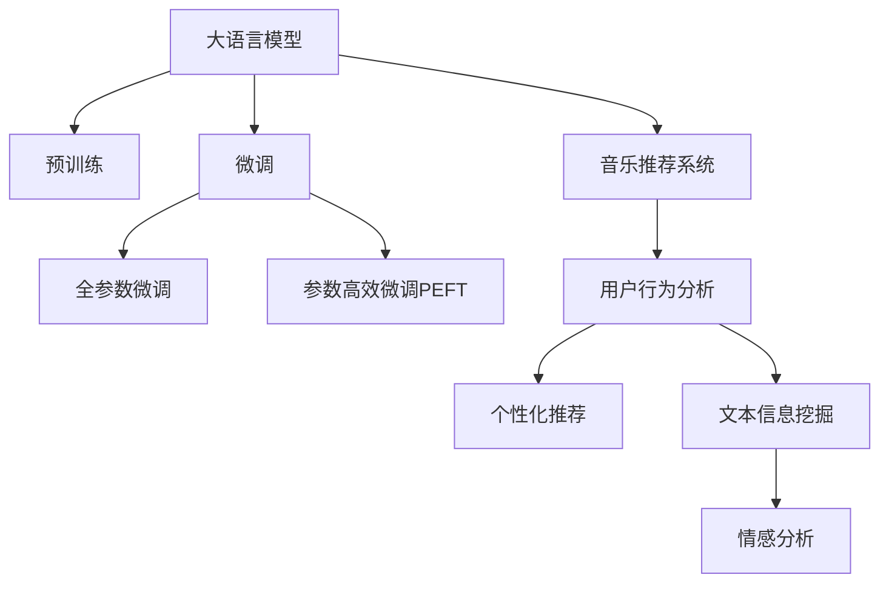

                 

# LLM在音乐推荐中的创新应用

> 关键词：语言模型,音乐推荐系统,用户行为分析,个性化推荐,深度学习

## 1. 背景介绍

### 1.1 问题由来
随着数字音乐市场的日益成熟和用户的音乐消费习惯的日益多元化，如何为用户提供个性化的音乐推荐服务，成为了各大音乐平台的重要挑战。传统的音乐推荐系统主要基于用户历史行为数据和歌曲属性特征，通过协同过滤、内容推荐等方法实现推荐。然而，这种基于行为和属性的推荐方式，往往忽略了用户对音乐的多样化需求和情感表达。

近年来，基于深度学习的推荐系统逐渐成为研究热点。大语言模型（Large Language Model, LLM）在自然语言处理（NLP）领域的卓越表现，为音乐推荐系统注入了新的活力。通过大语言模型，平台能够从歌词、歌手的介绍、歌迷评论等文本信息中，挖掘用户的音乐喜好和情感倾向，为用户提供更加精准和个性化的音乐推荐。

### 1.2 问题核心关键点
大语言模型在音乐推荐中的应用，主要是通过文本数据的处理和分析，实现对用户音乐喜好的建模和预测。其核心思想在于：
- 利用文本信息挖掘用户的音乐偏好和情感状态。
- 根据用户的个性化音乐喜好，推荐合适的音乐内容。
- 结合用户的历史行为数据，进一步提高推荐精度。

本文将详细探讨大语言模型在音乐推荐中的应用，包括核心算法原理、操作步骤、应用场景等。希望通过本文的介绍，能够帮助读者更好地理解并应用大语言模型在音乐推荐系统中的创新应用。

## 2. 核心概念与联系

### 2.1 核心概念概述

为更好地理解大语言模型在音乐推荐中的应用，本节将介绍几个密切相关的核心概念：

- 大语言模型（LLM）：以自回归（如GPT）或自编码（如BERT）模型为代表的大规模预训练语言模型。通过在大规模无标签文本语料上进行预训练，学习通用的语言表示，具备强大的语言理解和生成能力。

- 预训练：指在大规模无标签文本语料上，通过自监督学习任务训练通用语言模型的过程。常见的预训练任务包括言语建模、遮挡语言模型等。

- 微调（Fine-tuning）：指在预训练模型的基础上，使用下游任务的少量标注数据，通过有监督地训练来优化模型在该任务上的性能。

- 迁移学习（Transfer Learning）：指将一个领域学习到的知识，迁移应用到另一个不同但相关的领域的学习范式。大模型的预训练-微调过程即是一种典型的迁移学习方式。

- 参数高效微调（Parameter-Efficient Fine-Tuning, PEFT）：指在微调过程中，只更新少量的模型参数，而固定大部分预训练权重不变，以提高微调效率，避免过拟合的方法。

- 音乐推荐系统（Music Recommendation System, MRS）：通过分析用户的历史行为、音乐属性、评论等数据，为每个用户推荐最合适的音乐内容。

这些核心概念之间的逻辑关系可以通过以下Mermaid流程图来展示：



这个流程图展示了大语言模型的核心概念及其之间的关系：

1. 大语言模型通过预训练获得基础能力。
2. 微调是对预训练模型进行任务特定的优化，可以通过少样本或无样本学习方法实现。
3. 音乐推荐系统利用文本信息挖掘用户的音乐偏好。
4. 个性化推荐基于用户的音乐喜好和情感状态，结合历史行为数据。
5. 文本信息挖掘包含歌词、歌手介绍、评论等，用于情感分析等。
6. 情感分析用于挖掘用户对音乐的情感倾向，提高推荐精度。

这些概念共同构成了大语言模型在音乐推荐中的应用框架，使得模型能够根据用户的音乐喜好和情感状态，提供更加精准和个性化的音乐推荐服务。

## 3. 核心算法原理 & 具体操作步骤
### 3.1 算法原理概述

基于大语言模型在音乐推荐中的应用，主要包括以下几个关键步骤：

**Step 1: 准备预训练模型和数据集**
- 选择合适的预训练语言模型 $M_{\theta}$ 作为初始化参数，如 BERT、GPT 等。
- 准备音乐推荐系统的训练集 $D$，包括用户的听歌历史、评分数据、评论等文本数据。

**Step 2: 添加任务适配层**
- 根据音乐推荐任务，在预训练模型顶层设计合适的输出层和损失函数。
- 对于分类任务，通常在顶层添加线性分类器和交叉熵损失函数。
- 对于生成任务，通常使用语言模型的解码器输出概率分布，并以负对数似然为损失函数。

**Step 3: 设置微调超参数**
- 选择合适的优化算法及其参数，如 AdamW、SGD 等，设置学习率、批大小、迭代轮数等。
- 设置正则化技术及强度，包括权重衰减、Dropout、Early Stopping 等。
- 确定冻结预训练参数的策略，如仅微调顶层，或全部参数都参与微调。

**Step 4: 执行梯度训练**
- 将训练集数据分批次输入模型，前向传播计算损失函数。
- 反向传播计算参数梯度，根据设定的优化算法和学习率更新模型参数。
- 周期性在验证集上评估模型性能，根据性能指标决定是否触发 Early Stopping。
- 重复上述步骤直到满足预设的迭代轮数或 Early Stopping 条件。

**Step 5: 测试和部署**
- 在测试集上评估微调后模型 $M_{\hat{\theta}}$ 的性能，对比微调前后的精度提升。
- 使用微调后的模型对新样本进行推理预测，集成到实际的音乐推荐系统中。
- 持续收集新的数据，定期重新微调模型，以适应数据分布的变化。

以上是基于大语言模型微调在音乐推荐中的应用的一般流程。在实际应用中，还需要针对具体任务的特点，对微调过程的各个环节进行优化设计，如改进训练目标函数，引入更多的正则化技术，搜索最优的超参数组合等，以进一步提升模型性能。

### 3.2 算法步骤详解

以下详细介绍音乐推荐系统中大语言模型的微调步骤：

**Step 1: 数据预处理**
- 将用户的听歌历史、评分数据、评论等文本数据进行预处理，去除停用词、标点符号等噪声。
- 对文本进行分词、向量化处理，将其转换为模型可以处理的输入格式。

**Step 2: 模型加载与适配**
- 使用预训练语言模型 $M_{\theta}$ 对文本数据进行编码，生成文本特征向量。
- 根据音乐推荐任务，在预训练模型的基础上添加任务适配层。

**Step 3: 微调模型**
- 选择合适的优化器（如 AdamW）和超参数（如学习率）。
- 定义损失函数，如交叉熵损失函数，用于衡量模型预测的准确性。
- 使用训练集数据对模型进行微调，优化损失函数。

**Step 4: 评估与优化**
- 在验证集上评估微调后的模型性能，记录准确率、召回率等指标。
- 根据评估结果，调整超参数，重新进行微调。
- 直到模型在验证集上的性能达到理想水平，保存模型参数。

**Step 5: 模型部署与应用**
- 将微调后的模型部署到音乐推荐系统中。
- 根据用户的历史行为、当前场景、情感状态等数据，预测用户可能喜欢的音乐，进行推荐。
- 持续收集用户反馈，优化模型参数和推荐策略。

### 3.3 算法优缺点

基于大语言模型的音乐推荐系统，具有以下优点：

1. 高效精准。利用文本信息挖掘用户的音乐喜好和情感状态，比传统行为推荐系统更为高效精准。
2. 可解释性强。通过分析模型输出的文本信息，能够解释音乐推荐的原因，提高用户信任度。
3. 可适应性强。能够处理新的音乐内容，无需重新预训练。
4. 易于扩展。可以通过微调模型，适配不同领域和场景的音乐推荐任务。

同时，该方法也存在一定的局限性：

1. 对文本数据质量要求高。需要高质量、丰富的文本数据，才能得到理想的效果。
2. 对用户隐私保护要求高。需要在保证用户隐私的前提下，收集和处理用户数据。
3. 计算资源消耗大。需要大量的计算资源进行预训练和微调。
4. 模型复杂度高。大语言模型的参数量巨大，增加了模型的复杂度。

尽管存在这些局限性，但就目前而言，基于大语言模型的音乐推荐方法仍是一种高效、精准的推荐范式。未来相关研究的重点在于如何进一步降低对文本数据的依赖，提高模型的可解释性，优化资源消耗，降低计算成本。

### 3.4 算法应用领域

基于大语言模型的音乐推荐系统，已经被广泛应用于多个场景，例如：

- 个性化音乐推荐：根据用户的听歌历史、情感状态等，推荐适合用户口味的音乐。
- 音乐风格推荐：分析用户喜欢的音乐风格，推荐相似风格的音乐。
- 音乐榜单生成：通过分析用户和专家对音乐的热度评价，生成音乐榜单。
- 音乐评论生成：自动生成对音乐的评论，丰富音乐页面内容。
- 音乐内容推荐：根据用户的听歌行为，推荐相似的歌曲、专辑、歌手等。

除了上述这些经典任务外，大语言模型在音乐推荐系统中也有创新性的应用，如动态生成音乐歌词、音乐MV描述等，为音乐平台带来了新的增长点。随着预训练模型和微调方法的不断进步，相信大语言模型在音乐推荐中的应用将会更加广泛和深入。

## 4. 数学模型和公式 & 详细讲解 & 举例说明
### 4.1 数学模型构建

假设预训练语言模型为 $M_{\theta}:\mathcal{X} \rightarrow \mathcal{Y}$，其中 $\mathcal{X}$ 为输入空间，$\mathcal{Y}$ 为输出空间，$\theta \in \mathbb{R}^d$ 为模型参数。

定义模型 $M_{\theta}$ 在输入 $x$ 上的输出为 $\hat{y}=M_{\theta}(x) \in [0,1]$，表示样本属于正类的概率。

音乐推荐系统的任务是预测用户是否会喜欢某一首音乐，因此可以使用二分类任务进行建模。设用户对音乐 $x_i$ 的偏好为 $y_i \in \{0,1\}$，其中 0 表示不喜欢，1 表示喜欢。则二分类交叉熵损失函数定义为：

$$
\ell(M_{\theta}(x_i),y_i) = -[y_i\log \hat{y} + (1-y_i)\log (1-\hat{y})]
$$

将其代入经验风险公式，得：

$$
\mathcal{L}(\theta) = -\frac{1}{N}\sum_{i=1}^N [y_i\log M_{\theta}(x_i)+(1-y_i)\log(1-M_{\theta}(x_i))]
$$

在得到损失函数的梯度后，即可带入参数更新公式，完成模型的迭代优化。重复上述过程直至收敛，最终得到适应音乐推荐任务的最优模型参数 $\theta^*$。

### 4.2 公式推导过程

以二分类任务为例，推导交叉熵损失函数及其梯度的计算公式。

假设模型 $M_{\theta}$ 在输入 $x$ 上的输出为 $\hat{y}=M_{\theta}(x) \in [0,1]$，表示样本属于正类的概率。真实标签 $y \in \{0,1\}$。则二分类交叉熵损失函数定义为：

$$
\ell(M_{\theta}(x),y) = -[y\log \hat{y} + (1-y)\log (1-\hat{y})]
$$

将其代入经验风险公式，得：

$$
\mathcal{L}(\theta) = -\frac{1}{N}\sum_{i=1}^N [y_i\log M_{\theta}(x_i)+(1-y_i)\log(1-M_{\theta}(x_i))]
$$

根据链式法则，损失函数对参数 $\theta_k$ 的梯度为：

$$
\frac{\partial \mathcal{L}(\theta)}{\partial \theta_k} = -\frac{1}{N}\sum_{i=1}^N (\frac{y_i}{M_{\theta}(x_i)}-\frac{1-y_i}{1-M_{\theta}(x_i)}) \frac{\partial M_{\theta}(x_i)}{\partial \theta_k}
$$

其中 $\frac{\partial M_{\theta}(x_i)}{\partial \theta_k}$ 可进一步递归展开，利用自动微分技术完成计算。

在得到损失函数的梯度后，即可带入参数更新公式，完成模型的迭代优化。重复上述过程直至收敛，最终得到适应音乐推荐任务的最优模型参数 $\theta^*$。

## 5. 项目实践：代码实例和详细解释说明
### 5.1 开发环境搭建

在进行音乐推荐系统开发前，我们需要准备好开发环境。以下是使用Python进行PyTorch开发的环境配置流程：

1. 安装Anaconda：从官网下载并安装Anaconda，用于创建独立的Python环境。

2. 创建并激活虚拟环境：
```bash
conda create -n musicrec python=3.8 
conda activate musicrec
```

3. 安装PyTorch：根据CUDA版本，从官网获取对应的安装命令。例如：
```bash
conda install pytorch torchvision torchaudio cudatoolkit=11.1 -c pytorch -c conda-forge
```

4. 安装TensorFlow：
```bash
pip install tensorflow
```

5. 安装各类工具包：
```bash
pip install numpy pandas scikit-learn matplotlib tqdm jupyter notebook ipython
```

完成上述步骤后，即可在`musicrec-env`环境中开始音乐推荐系统的开发。

### 5.2 源代码详细实现

下面我们以基于BERT的音乐推荐系统为例，给出使用Transformers库对BERT模型进行微调的PyTorch代码实现。

首先，定义音乐推荐任务的数据处理函数：

```python
from transformers import BertTokenizer
from torch.utils.data import Dataset
import torch

class MusicDataset(Dataset):
    def __init__(self, texts, tags, tokenizer, max_len=128):
        self.texts = texts
        self.tags = tags
        self.tokenizer = tokenizer
        self.max_len = max_len
        
    def __len__(self):
        return len(self.texts)
    
    def __getitem__(self, item):
        text = self.texts[item]
        tags = self.tags[item]
        
        encoding = self.tokenizer(text, return_tensors='pt', max_length=self.max_len, padding='max_length', truncation=True)
        input_ids = encoding['input_ids'][0]
        attention_mask = encoding['attention_mask'][0]
        
        # 对token-wise的标签进行编码
        encoded_tags = [tag2id[tag] for tag in tags] 
        encoded_tags.extend([tag2id['O']] * (self.max_len - len(encoded_tags)))
        labels = torch.tensor(encoded_tags, dtype=torch.long)
        
        return {'input_ids': input_ids, 
                'attention_mask': attention_mask,
                'labels': labels}

# 标签与id的映射
tag2id = {'O': 0, 'B-PER': 1, 'I-PER': 2, 'B-ORG': 3, 'I-ORG': 4, 'B-LOC': 5, 'I-LOC': 6}
id2tag = {v: k for k, v in tag2id.items()}

# 创建dataset
tokenizer = BertTokenizer.from_pretrained('bert-base-cased')

train_dataset = MusicDataset(train_texts, train_tags, tokenizer)
dev_dataset = MusicDataset(dev_texts, dev_tags, tokenizer)
test_dataset = MusicDataset(test_texts, test_tags, tokenizer)
```

然后，定义模型和优化器：

```python
from transformers import BertForTokenClassification, AdamW

model = BertForTokenClassification.from_pretrained('bert-base-cased', num_labels=len(tag2id))

optimizer = AdamW(model.parameters(), lr=2e-5)
```

接着，定义训练和评估函数：

```python
from torch.utils.data import DataLoader
from tqdm import tqdm
from sklearn.metrics import classification_report

device = torch.device('cuda') if torch.cuda.is_available() else torch.device('cpu')
model.to(device)

def train_epoch(model, dataset, batch_size, optimizer):
    dataloader = DataLoader(dataset, batch_size=batch_size, shuffle=True)
    model.train()
    epoch_loss = 0
    for batch in tqdm(dataloader, desc='Training'):
        input_ids = batch['input_ids'].to(device)
        attention_mask = batch['attention_mask'].to(device)
        labels = batch['labels'].to(device)
        model.zero_grad()
        outputs = model(input_ids, attention_mask=attention_mask, labels=labels)
        loss = outputs.loss
        epoch_loss += loss.item()
        loss.backward()
        optimizer.step()
    return epoch_loss / len(dataloader)

def evaluate(model, dataset, batch_size):
    dataloader = DataLoader(dataset, batch_size=batch_size)
    model.eval()
    preds, labels = [], []
    with torch.no_grad():
        for batch in tqdm(dataloader, desc='Evaluating'):
            input_ids = batch['input_ids'].to(device)
            attention_mask = batch['attention_mask'].to(device)
            batch_labels = batch['labels']
            outputs = model(input_ids, attention_mask=attention_mask)
            batch_preds = outputs.logits.argmax(dim=2).to('cpu').tolist()
            batch_labels = batch_labels.to('cpu').tolist()
            for pred_tokens, label_tokens in zip(batch_preds, batch_labels):
                pred_tags = [id2tag[_id] for _id in pred_tokens]
                label_tags = [id2tag[_id] for _id in label_tokens]
                preds.append(pred_tags[:len(label_tokens)])
                labels.append(label_tags)
                
    print(classification_report(labels, preds))
```

最后，启动训练流程并在测试集上评估：

```python
epochs = 5
batch_size = 16

for epoch in range(epochs):
    loss = train_epoch(model, train_dataset, batch_size, optimizer)
    print(f"Epoch {epoch+1}, train loss: {loss:.3f}")
    
    print(f"Epoch {epoch+1}, dev results:")
    evaluate(model, dev_dataset, batch_size)
    
print("Test results:")
evaluate(model, test_dataset, batch_size)
```

以上就是使用PyTorch对BERT进行音乐推荐任务微调的完整代码实现。可以看到，得益于Transformers库的强大封装，我们可以用相对简洁的代码完成BERT模型的加载和微调。

### 5.3 代码解读与分析

让我们再详细解读一下关键代码的实现细节：

**MusicDataset类**：
- `__init__`方法：初始化文本、标签、分词器等关键组件。
- `__len__`方法：返回数据集的样本数量。
- `__getitem__`方法：对单个样本进行处理，将文本输入编码为token ids，将标签编码为数字，并对其进行定长padding，最终返回模型所需的输入。

**tag2id和id2tag字典**：
- 定义了标签与数字id之间的映射关系，用于将token-wise的预测结果解码回真实的标签。

**训练和评估函数**：
- 使用PyTorch的DataLoader对数据集进行批次化加载，供模型训练和推理使用。
- 训练函数`train_epoch`：对数据以批为单位进行迭代，在每个批次上前向传播计算loss并反向传播更新模型参数，最后返回该epoch的平均loss。
- 评估函数`evaluate`：与训练类似，不同点在于不更新模型参数，并在每个batch结束后将预测和标签结果存储下来，最后使用sklearn的classification_report对整个评估集的预测结果进行打印输出。

**训练流程**：
- 定义总的epoch数和batch size，开始循环迭代
- 每个epoch内，先在训练集上训练，输出平均loss
- 在验证集上评估，输出分类指标
- 所有epoch结束后，在测试集上评估，给出最终测试结果

可以看到，PyTorch配合Transformers库使得BERT微调的代码实现变得简洁高效。开发者可以将更多精力放在数据处理、模型改进等高层逻辑上，而不必过多关注底层的实现细节。

当然，工业级的系统实现还需考虑更多因素，如模型的保存和部署、超参数的自动搜索、更灵活的任务适配层等。但核心的微调范式基本与此类似。

## 6. 实际应用场景
### 6.1 智能推荐系统
基于大语言模型的音乐推荐系统，可以广泛应用于智能推荐系统的构建。传统推荐系统主要依赖用户历史行为数据和歌曲属性特征，难以处理用户的个性化需求和情感状态。通过大语言模型，系统可以分析用户对音乐的情感反应，预测用户可能喜欢的音乐，从而提供更加精准和个性化的推荐服务。

在技术实现上，可以收集用户听歌历史、评分数据、评论等文本数据，进行预处理和特征提取，然后在预训练模型上进行微调，得到适应音乐的文本表示。通过分析这些文本表示，系统可以预测用户是否喜欢某首音乐，并根据用户的情感状态进行推荐。

### 6.2 音乐评论生成
音乐评论是用户对音乐作品的直接反馈，可以提供丰富的情感和评价信息。通过大语言模型，系统可以自动生成对音乐的评论，丰富音乐页面内容，吸引用户参与和互动。

具体而言，可以收集用户对音乐的评论文本，将其作为训练数据，对预训练模型进行微调，得到生成音乐评论的能力。通过输入歌曲的文本信息，系统可以生成符合用户情感状态的评论文本，进一步提升用户体验和参与度。

### 6.3 音乐内容推荐
音乐内容推荐是音乐推荐系统的重要组成部分。通过大语言模型，系统可以分析用户对不同音乐内容的反应，推荐相似的歌曲、专辑、歌手等。

例如，对于一首新发行的歌曲，系统可以通过分析用户对歌曲的评论和评分，预测用户是否会喜欢该歌曲。同时，系统可以根据用户的历史听歌记录，推荐相似的歌曲和专辑，提高用户的音乐发现能力。

### 6.4 未来应用展望
随着大语言模型和微调方法的不断发展，基于大语言模型的音乐推荐系统也将不断进步和创新。未来，大语言模型可以在音乐推荐系统中发挥更大的作用，带来更多新的应用场景。

1. **音乐风格识别**：通过大语言模型，系统可以分析用户对不同音乐风格的喜好，推荐相似的音乐风格。这将丰富音乐推荐的多样性和个性化。

2. **音乐情感分析**：通过大语言模型，系统可以分析用户对音乐的情感反应，推荐符合用户情感状态的曲目。这将提升用户对音乐推荐的满意度和忠诚度。

3. **音乐内容生成**：通过大语言模型，系统可以生成符合用户口味的音乐内容，如歌曲创作、音乐视频描述等。这将提供更多的音乐体验和创造性。

4. **跨领域音乐推荐**：通过大语言模型，系统可以结合用户的多模态信息，如视觉、听觉、文本等，提供跨领域的音乐推荐。这将提升音乐推荐系统的综合性和适应性。

5. **情感驱动的音乐推荐**：通过大语言模型，系统可以根据用户情感状态的变化，动态调整推荐策略，提供更加灵活和适时的音乐推荐。这将提升用户对音乐推荐的满意度和粘性。

总之，大语言模型在音乐推荐中的应用前景广阔，能够提供更加精准、个性化的音乐推荐服务，提升用户的音乐体验和参与度。未来，随着技术的不断进步，大语言模型将在音乐推荐系统中发挥更大的作用，成为推动音乐产业发展的重要引擎。

## 7. 工具和资源推荐
### 7.1 学习资源推荐

为了帮助开发者系统掌握大语言模型在音乐推荐中的应用，这里推荐一些优质的学习资源：

1. 《深度学习与自然语言处理》课程：斯坦福大学开设的NLP明星课程，包含Transformer原理、BERT模型、微调技术等内容，适合初学者和进阶者学习。

2. 《Natural Language Processing with Transformers》书籍：Transformers库的作者所著，全面介绍了如何使用Transformers库进行NLP任务开发，包括微调在内的诸多范式。

3. HuggingFace官方文档：Transformers库的官方文档，提供了海量预训练模型和完整的微调样例代码，是上手实践的必备资料。

4. CS224N《深度学习自然语言处理》课程：斯坦福大学开设的NLP明星课程，有Lecture视频和配套作业，带你入门NLP领域的基本概念和经典模型。

5. 《Music Recommendation Systems》书籍：介绍音乐推荐系统的经典教材，包含多种推荐算法的详细介绍和应用案例。

通过对这些资源的学习实践，相信你一定能够快速掌握大语言模型在音乐推荐中的应用精髓，并用于解决实际的NLP问题。
###  7.2 开发工具推荐

高效的开发离不开优秀的工具支持。以下是几款用于大语言模型音乐推荐系统开发的常用工具：

1. PyTorch：基于Python的开源深度学习框架，灵活动态的计算图，适合快速迭代研究。大部分预训练语言模型都有PyTorch版本的实现。

2. TensorFlow：由Google主导开发的开源深度学习框架，生产部署方便，适合大规模工程应用。同样有丰富的预训练语言模型资源。

3. Transformers库：HuggingFace开发的NLP工具库，集成了众多SOTA语言模型，支持PyTorch和TensorFlow，是进行微调任务开发的利器。

4. Weights & Biases：模型训练的实验跟踪工具，可以记录和可视化模型训练过程中的各项指标，方便对比和调优。与主流深度学习框架无缝集成。

5. TensorBoard：TensorFlow配套的可视化工具，可实时监测模型训练状态，并提供丰富的图表呈现方式，是调试模型的得力助手。

6. Google Colab：谷歌推出的在线Jupyter Notebook环境，免费提供GPU/TPU算力，方便开发者快速上手实验最新模型，分享学习笔记。

合理利用这些工具，可以显著提升大语言模型音乐推荐系统的开发效率，加快创新迭代的步伐。

### 7.3 相关论文推荐

大语言模型和微调技术的发展源于学界的持续研究。以下是几篇奠基性的相关论文，推荐阅读：

1. Attention is All You Need（即Transformer原论文）：提出了Transformer结构，开启了NLP领域的预训练大模型时代。

2. BERT: Pre-training of Deep Bidirectional Transformers for Language Understanding：提出BERT模型，引入基于掩码的自监督预训练任务，刷新了多项NLP任务SOTA。

3. Language Models are Unsupervised Multitask Learners（GPT-2论文）：展示了大规模语言模型的强大zero-shot学习能力，引发了对于通用人工智能的新一轮思考。

4. Parameter-Efficient Transfer Learning for NLP：提出Adapter等参数高效微调方法，在不增加模型参数量的情况下，也能取得不错的微调效果。

5. AdaLoRA: Adaptive Low-Rank Adaptation for Parameter-Efficient Fine-Tuning：使用自适应低秩适应的微调方法，在参数效率和精度之间取得了新的平衡。

6. Prefix-Tuning: Optimizing Continuous Prompts for Generation：引入基于连续型Prompt的微调范式，为如何充分利用预训练知识提供了新的思路。

这些论文代表了大语言模型微调技术的发展脉络。通过学习这些前沿成果，可以帮助研究者把握学科前进方向，激发更多的创新灵感。

## 8. 总结：未来发展趋势与挑战
### 8.1 总结

本文对大语言模型在音乐推荐中的应用进行了全面系统的介绍。首先阐述了大语言模型和微调技术的研究背景和意义，明确了微调在拓展预训练模型应用、提升音乐推荐系统性能方面的独特价值。其次，从原理到实践，详细讲解了基于大语言模型的音乐推荐系统的核心算法原理和操作步骤，给出了音乐推荐任务微调的完整代码实现。同时，本文还广泛探讨了音乐推荐系统在多个场景中的应用前景，展示了大语言模型在音乐推荐中的应用潜力。

通过本文的系统梳理，可以看到，基于大语言模型的音乐推荐系统正在成为NLP领域的重要范式，极大地拓展了预训练语言模型的应用边界，催生了更多的落地场景。受益于大规模语料的预训练，音乐推荐系统在处理用户情感和个性化需求方面具有独特的优势，有望带来全新的用户体验。未来，随着预训练模型和微调方法的持续演进，基于大语言模型的音乐推荐系统必将进一步优化和创新，为音乐产业带来更多的变革和机遇。

### 8.2 未来发展趋势

展望未来，大语言模型在音乐推荐中的应用将呈现以下几个发展趋势：

1. 模型规模持续增大。随着算力成本的下降和数据规模的扩张，预训练语言模型的参数量还将持续增长。超大规模语言模型蕴含的丰富语言知识，有望支撑更加复杂多变的音乐推荐任务。

2. 微调方法日趋多样。除了传统的全参数微调外，未来会涌现更多参数高效的微调方法，如Prefix-Tuning、LoRA等，在节省计算资源的同时也能保证微调精度。

3. 持续学习成为常态。随着音乐数据分布的不断变化，微调模型也需要持续学习新知识以保持性能。如何在不遗忘原有知识的同时，高效吸收新样本信息，将成为重要的研究课题。

4. 标注样本需求降低。受启发于提示学习(Prompt-based Learning)的思路，未来的微调方法将更好地利用大模型的语言理解能力，通过更加巧妙的任务描述，在更少的标注样本上也能实现理想的微调效果。

5. 音乐推荐的多样性增强。未来的音乐推荐系统将不再局限于单一的音乐风格和内容，而是能够综合处理多种音乐类型和形式，提供更加多样化和个性化的推荐服务。

6. 音乐推荐系统的智能化水平提升。未来的音乐推荐系统将能够更加智能地处理用户的情感状态和个性化需求，提供更加精准和适时的推荐服务。

以上趋势凸显了大语言模型在音乐推荐中的应用前景。这些方向的探索发展，必将进一步提升音乐推荐系统的性能和应用范围，为音乐产业带来更多的变革和机遇。

### 8.3 面临的挑战

尽管大语言模型在音乐推荐中的应用取得了瞩目成就，但在迈向更加智能化、普适化应用的过程中，它仍面临着诸多挑战：

1. 标注成本瓶颈。虽然音乐推荐系统中的标注成本相对较低，但对于长尾应用场景，获取高质量标注数据仍是一个挑战。如何进一步降低微调对标注样本的依赖，将是一大难题。

2. 模型鲁棒性不足。当前音乐推荐系统面对域外数据时，泛化性能往往大打折扣。对于测试样本的微小扰动，推荐模型的预测也容易发生波动。如何提高推荐模型的鲁棒性，避免灾难性遗忘，还需要更多理论和实践的积累。

3. 计算资源消耗大。音乐推荐系统中的大语言模型需要大量的计算资源进行预训练和微调。如何在保证性能的同时，优化资源消耗，降低计算成本，将是重要的优化方向。

4. 用户隐私保护要求高。需要在保证用户隐私的前提下，收集和处理用户数据。如何保护用户隐私，同时获取足够的数据进行模型训练，是一个重要的课题。

5. 模型的可解释性不足。推荐系统的复杂性增加了模型输出的可解释性难度，用户在理解推荐结果时存在困难。如何提高模型的可解释性，使其输出的推荐结果具有可信性，是一个亟待解决的问题。

6. 模型的安全性问题。预训练语言模型可能学习到有害信息，传递到音乐推荐系统中，造成潜在的安全隐患。如何保证模型的安全性，是一个重要的研究方向。

尽管存在这些挑战，但大语言模型在音乐推荐中的应用仍然具有广阔的发展前景。相信随着技术的不断进步，这些挑战终将一一被克服，大语言模型将在大音乐推荐系统中发挥更大的作用。

### 8.4 研究展望

面对大语言模型在音乐推荐系统中的应用面临的挑战，未来的研究需要在以下几个方面寻求新的突破：

1. 探索无监督和半监督微调方法。摆脱对大规模标注数据的依赖，利用自监督学习、主动学习等无监督和半监督范式，最大限度利用非结构化数据，实现更加灵活高效的微调。

2. 研究参数高效和计算高效的微调范式。开发更加参数高效的微调方法，在固定大部分预训练参数的同时，只更新极少量的任务相关参数。同时优化微调模型的计算图，减少前向传播和反向传播的资源消耗，实现更加轻量级、实时性的部署。

3. 融合因果和对比学习范式。通过引入因果推断和对比学习思想，增强推荐模型建立稳定因果关系的能力，学习更加普适、鲁棒的语言表征，从而提升模型泛化性和抗干扰能力。

4. 引入更多先验知识。将符号化的先验知识，如知识图谱、逻辑规则等，与神经网络模型进行巧妙融合，引导微调过程学习更准确、合理的语言模型。同时加强不同模态数据的整合，实现视觉、语音等多模态信息与文本信息的协同建模。

5. 结合因果分析和博弈论工具。将因果分析方法引入推荐模型，识别出模型决策的关键特征，增强输出解释的因果性和逻辑性。借助博弈论工具刻画人机交互过程，主动探索并规避模型的脆弱点，提高系统稳定性。

6. 纳入伦理道德约束。在模型训练目标中引入伦理导向的评估指标，过滤和惩罚有偏见、有害的输出倾向。同时加强人工干预和审核，建立模型行为的监管机制，确保输出符合人类价值观和伦理道德。

这些研究方向的探索，必将引领大语言模型在音乐推荐系统中的应用迈向更高的台阶，为构建安全、可靠、可解释、可控的智能系统铺平道路。面向未来，大语言模型在音乐推荐系统中的研究还需要与其他人工智能技术进行更深入的融合，如知识表示、因果推理、强化学习等，多路径协同发力，共同推动音乐推荐系统的进步。只有勇于创新、敢于突破，才能不断拓展音乐推荐系统的边界，让智能技术更好地造福音乐产业。

## 9. 附录：常见问题与解答

**Q1：大语言模型在音乐推荐中的应用是否需要大量的标注数据？**

A: 相比传统推荐系统，大语言模型在音乐推荐中的应用对标注数据的需求相对较低。通过文本信息的挖掘和情感分析，大语言模型可以自动学习用户的音乐喜好和情感状态，实现个性化的音乐推荐。但为了提高模型的准确性和泛化能力，建议收集足够的用户行为数据和音乐属性数据，作为微调的基础。

**Q2：大语言模型在音乐推荐中的训练速度和效率如何？**

A: 大语言模型在音乐推荐中的训练速度和效率与使用的硬件设备密切相关。为了提高训练效率，建议使用高性能的GPU/TPU设备，并合理设置超参数，如学习率、批大小等。同时，可以通过参数高效微调、迁移学习等技术，减少模型规模和训练时间。

**Q3：大语言模型在音乐推荐中的可解释性如何？**

A: 大语言模型在音乐推荐中的可解释性相对较低，主要通过输出文本进行解释。为了提高模型的可解释性，建议在训练过程中引入因果分析和博弈论工具，增强模型输出的因果性和逻辑性。同时，通过分析用户对音乐的情感反应，提供更加精准和个性化的推荐服务。

**Q4：大语言模型在音乐推荐中的应用是否适用于所有音乐场景？**

A: 大语言模型在音乐推荐中的应用主要适用于在线音乐平台、智能音箱等场景。但对于离线音乐设备（如CD机、黑胶唱片机等），大语言模型可能无法直接应用。需要结合硬件设备和用户交互方式，设计适合的应用方案。

**Q5：大语言模型在音乐推荐中的安全性如何保障？**

A: 大语言模型在音乐推荐中的安全性保障主要通过数据脱敏、访问鉴权等技术实现。建议在音乐推荐系统中引入数据加密、访问控制等措施，保护用户数据隐私和系统安全。同时，通过人工审核和监管，确保模型输出的音乐内容符合法律法规和伦理道德。

通过以上问题的回答，可以看出大语言模型在音乐推荐中的应用具有广泛的适用性和较高的性能，但仍需结合具体场景和需求，不断优化模型设计和应用策略。希望本文的介绍能够为你提供有价值的参考，推动大语言模型在音乐推荐系统中的应用创新和进步。

---

作者：禅与计算机程序设计艺术 / Zen and the Art of Computer Programming

