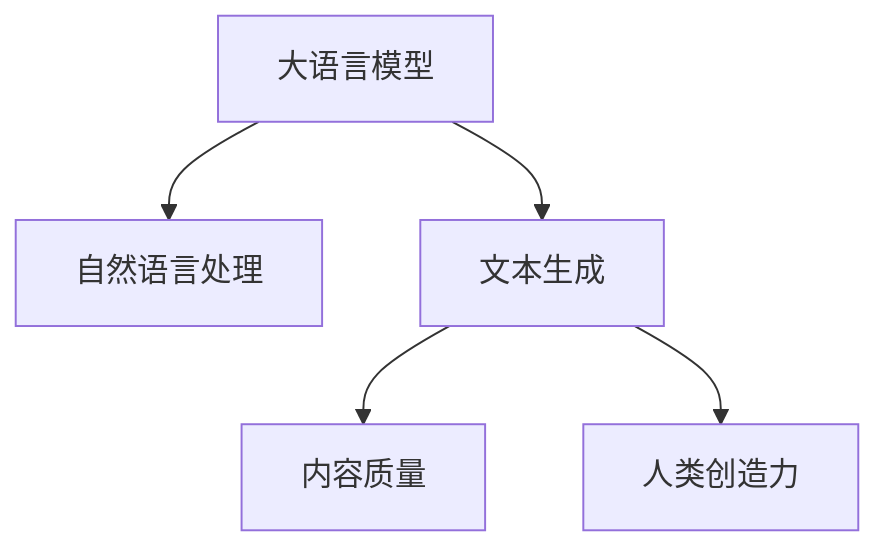

                 

# LLM对传统内容创作的挑战

> 关键词：大语言模型,自然语言处理,内容创作,文本生成,内容质量,人类创造力

## 1. 背景介绍

随着人工智能技术的迅猛发展，大语言模型（Large Language Model, LLM）在自然语言处理（Natural Language Processing, NLP）领域取得了突破性进展。特别是基于Transformer架构的模型，如GPT-3、ChatGPT等，展示了前所未有的语言理解和生成能力。这些模型在生成文章、翻译、摘要、对话等方面表现出色，引起了广泛关注。然而，大语言模型对传统内容创作的挑战也不容忽视。本文将深入探讨大语言模型对内容创作的潜在影响，并分析其在新闻、文学、广告等不同领域的具体表现。

## 2. 核心概念与联系

### 2.1 核心概念概述

为了更好地理解大语言模型对内容创作的影响，本节将介绍几个核心概念及其之间的联系：

- 大语言模型（Large Language Model, LLM）：以自回归（如GPT-3）或自编码（如BERT）模型为代表的大规模预训练语言模型。通过在大规模无标签文本语料上进行预训练，学习通用的语言表示，具备强大的语言理解和生成能力。

- 自然语言处理（Natural Language Processing, NLP）：研究如何使计算机理解、处理、生成人类语言的技术。大语言模型是NLP研究的重要成果之一。

- 文本生成（Text Generation）：使用大语言模型自动生成文本，包括文章、对话、摘要等。文本生成是大语言模型的典型应用之一。

- 内容质量（Content Quality）：衡量生成的文本在语法、逻辑、创意等方面的综合质量。大语言模型生成的文本需要满足特定的质量要求。

- 人类创造力（Human Creativity）：人类创作内容的独特性和创新性。大语言模型的生成内容应与人类创作相媲美，甚至在某些方面超越。

这些核心概念之间的逻辑关系可以通过以下Mermaid流程图来展示：



这个流程图展示了大语言模型如何通过自然语言处理技术，生成符合内容质量标准的文本，并通过创新性地融合人类创造力，提升内容创作水平。

## 3. 核心算法原理 & 具体操作步骤
### 3.1 算法原理概述

大语言模型对内容创作的核心算法原理，是基于监督学习进行文本生成。通过在大规模标注数据集上进行微调，模型学习如何在特定任务下生成符合要求的文本。其关键在于如何将语言知识与任务需求相结合，生成具有创新性和创造性的内容。

### 3.2 算法步骤详解

大语言模型对内容创作的步骤主要包括以下几个方面：

**Step 1: 数据预处理**
- 收集标注数据集，确保数据的多样性和代表性。
- 对数据进行清洗、标注、分词等预处理，为模型训练做准备。

**Step 2: 模型训练**
- 选择合适的模型架构和超参数，如Transformer、GPT等。
- 在标注数据集上进行训练，使用交叉熵、均方误差等损失函数，最小化预测与真实标签的差异。
- 通过反向传播算法，更新模型参数，使其更好地适应生成任务。

**Step 3: 内容创作**
- 使用微调后的模型，对特定任务输入进行前向传播，生成文本。
- 评估生成的文本，确保其满足质量标准和创新性要求。
- 根据评估结果，对模型进行迭代优化，提升生成效果。

**Step 4: 模型部署**
- 将优化后的模型保存为可部署的形式，如静态模型、API接口等。
- 将模型集成到实际应用中，如新闻报道、文学创作、广告宣传等。
- 实时监控模型性能，根据需求进行持续优化。

### 3.3 算法优缺点

大语言模型对内容创作的优点包括：

1. **高效性**：相对于传统内容创作，大语言模型可以快速生成大量高质量文本。
2. **多样性**：模型可以生成多种风格和类型的文本，满足不同需求。
3. **创新性**：通过融合人类的创造力，大语言模型可以生成具有创新性的内容。

其缺点主要包括：

1. **依赖数据**：模型的性能高度依赖于标注数据的质量和数量。数据偏差可能导致生成内容的偏见。
2. **内容质量不稳定**：由于模型的不确定性，生成的文本质量可能不稳定，存在语法错误、逻辑混乱等问题。
3. **缺乏深度理解**：模型虽然可以生成结构完整的文本，但对内容的深层理解和上下文逻辑的理解仍有局限。

### 3.4 算法应用领域

大语言模型对内容创作的广泛应用涵盖了多个领域，例如：

- **新闻报道**：自动生成新闻稿件、新闻摘要等。大语言模型可以实时监控新闻事件，自动生成相关报道。
- **文学创作**：生成小说、诗歌、散文等文学作品。模型可以模仿不同风格和流派的作家，创作原创文学作品。
- **广告宣传**：自动生成广告文案、推广语等。模型可以根据市场和用户反馈，不断优化生成的广告内容。
- **市场营销**：生成营销邮件、社交媒体内容等。模型可以个性化推荐内容，提升用户参与度。
- **教育培训**：生成教学材料、辅导题目等。模型可以根据学生的学习情况，自动生成个性化的学习内容。

这些应用领域展示了大语言模型对内容创作的巨大潜力，但也需要注意其局限性。

## 4. 数学模型和公式 & 详细讲解 & 举例说明

### 4.1 数学模型构建

假设我们有一个二分类文本生成任务，模型需要生成文本并判断其情感极性（正向或负向）。我们可以使用交叉熵损失函数来衡量模型预测与真实标签的差异。

设 $M_{\theta}$ 为预训练语言模型，$y_i$ 为第 $i$ 个文本的情感标签，$\hat{y}_i$ 为模型预测的情感标签，则交叉熵损失函数定义为：

$$
\mathcal{L}(y_i, \hat{y}_i) = -y_i \log \hat{y}_i - (1 - y_i) \log (1 - \hat{y}_i)
$$

在训练过程中，我们需要最小化损失函数 $\mathcal{L}$：

$$
\theta^* = \mathop{\arg\min}_{\theta} \frac{1}{N} \sum_{i=1}^N \mathcal{L}(y_i, \hat{y}_i)
$$

### 4.2 公式推导过程

我们以GPT-3为例，介绍其文本生成的具体过程。GPT-3模型采用自回归方式，通过生成下一个词汇预测下一个词汇。假设输入文本为 $x_1, x_2, \cdots, x_{n-1}$，模型需要生成下一个词汇 $x_n$。则其概率计算公式为：

$$
p(x_n | x_1, x_2, \cdots, x_{n-1}) = \frac{e^{E_{\theta}(x_n | x_1, x_2, \cdots, x_{n-1})}}{\sum_{x' \in \mathcal{V}} e^{E_{\theta}(x' | x_1, x_2, \cdots, x_{n-1})}}
$$

其中 $E_{\theta}$ 为模型的能量函数，$\mathcal{V}$ 为词汇表。模型的输出 $x_n$ 为生成词汇，通过最大化概率 $p(x_n | x_1, x_2, \cdots, x_{n-1})$ 来选择最优生成词汇。

### 4.3 案例分析与讲解

以新闻报道为例，我们可以将大语言模型应用于实时生成新闻摘要。具体步骤如下：

1. 收集新闻报道的标题和内容作为训练数据，标注情感极性。
2. 使用GPT-3等大语言模型对新闻内容进行微调，学习情感分类任务。
3. 在新的新闻报道上输入标题，模型自动生成摘要，并预测情感极性。
4. 根据生成摘要的质量和情感分类准确性，不断优化模型。

## 5. 项目实践：代码实例和详细解释说明

### 5.1 开发环境搭建

在进行文本生成实践前，我们需要准备好开发环境。以下是使用Python进行PyTorch开发的环境配置流程：

1. 安装Anaconda：从官网下载并安装Anaconda，用于创建独立的Python环境。
2. 创建并激活虚拟环境：
```bash
conda create -n pytorch-env python=3.8 
conda activate pytorch-env
```

3. 安装PyTorch：根据CUDA版本，从官网获取对应的安装命令。例如：
```bash
conda install pytorch torchvision torchaudio cudatoolkit=11.1 -c pytorch -c conda-forge
```

4. 安装Transformers库：
```bash
pip install transformers
```

5. 安装各类工具包：
```bash
pip install numpy pandas scikit-learn matplotlib tqdm jupyter notebook ipython
```

完成上述步骤后，即可在`pytorch-env`环境中开始文本生成实践。

### 5.2 源代码详细实现

下面以GPT-3文本生成为例，给出使用Transformers库的PyTorch代码实现。

首先，定义数据处理函数：

```python
from transformers import GPT3Tokenizer, GPT3ForSequenceClassification

def prepare_data(data, tokenizer, max_length):
    tokenized_texts = tokenizer(data, max_length=max_length, truncation=True, padding='max_length', return_tensors='pt')
    input_ids = tokenized_texts['input_ids']
    attention_mask = tokenized_texts['attention_mask']
    labels = torch.tensor(tokenized_texts['labels'])
    return input_ids, attention_mask, labels

tokenizer = GPT3Tokenizer.from_pretrained('gpt3')
model = GPT3ForSequenceClassification.from_pretrained('gpt3', num_labels=2)

input_ids, attention_mask, labels = prepare_data(train_data, tokenizer, max_length=512)
```

然后，定义训练和评估函数：

```python
from torch.utils.data import DataLoader
from tqdm import tqdm
from sklearn.metrics import accuracy_score

device = torch.device('cuda') if torch.cuda.is_available() else torch.device('cpu')
model.to(device)

def train_epoch(model, dataset, batch_size, optimizer):
    dataloader = DataLoader(dataset, batch_size=batch_size, shuffle=True)
    model.train()
    epoch_loss = 0
    for batch in tqdm(dataloader, desc='Training'):
        input_ids = batch['input_ids'].to(device)
        attention_mask = batch['attention_mask'].to(device)
        labels = batch['labels'].to(device)
        model.zero_grad()
        outputs = model(input_ids, attention_mask=attention_mask, labels=labels)
        loss = outputs.loss
        epoch_loss += loss.item()
        loss.backward()
        optimizer.step()
    return epoch_loss / len(dataloader)

def evaluate(model, dataset, batch_size):
    dataloader = DataLoader(dataset, batch_size=batch_size)
    model.eval()
    preds, labels = [], []
    with torch.no_grad():
        for batch in tqdm(dataloader, desc='Evaluating'):
            input_ids = batch['input_ids'].to(device)
            attention_mask = batch['attention_mask'].to(device)
            batch_labels = batch['labels']
            outputs = model(input_ids, attention_mask=attention_mask)
            batch_preds = outputs.logits.argmax(dim=2).to('cpu').tolist()
            batch_labels = batch_labels.to('cpu').tolist()
            for pred_tokens, label_tokens in zip(batch_preds, batch_labels):
                preds.append(pred_tokens[:len(label_tokens)])
                labels.append(label_tokens)
    print(accuracy_score(labels, preds))
```

最后，启动训练流程并在测试集上评估：

```python
epochs = 5
batch_size = 16

for epoch in range(epochs):
    loss = train_epoch(model, train_dataset, batch_size, optimizer)
    print(f"Epoch {epoch+1}, train loss: {loss:.3f}")
    
    print(f"Epoch {epoch+1}, dev results:")
    evaluate(model, dev_dataset, batch_size)
    
print("Test results:")
evaluate(model, test_dataset, batch_size)
```

以上就是使用PyTorch对GPT-3进行文本生成任务微调的完整代码实现。可以看到，得益于Transformers库的强大封装，我们可以用相对简洁的代码完成GPT-3模型的加载和微调。

### 5.3 代码解读与分析

让我们再详细解读一下关键代码的实现细节：

**GPT3Tokenizer和GPT3ForSequenceClassification**：
- `GPT3Tokenizer`：用于对输入文本进行分词和编码，生成模型需要的输入格式。
- `GPT3ForSequenceClassification`：基于GPT-3模型，并在此基础上添加序列分类器的任务适配层，用于情感分类任务。

**prepare_data函数**：
- 将输入文本转换为模型所需的格式，并进行归一化处理。
- 将文本转换为模型所需的输入序列和注意力掩码。
- 将标签转换为模型所需的格式。

**train_epoch函数**：
- 对数据进行批次化加载，供模型训练使用。
- 在每个批次上前向传播计算损失函数。
- 反向传播计算参数梯度，根据设定的优化算法和学习率更新模型参数。
- 周期性在验证集上评估模型性能，根据性能指标决定是否触发Early Stopping。

**evaluate函数**：
- 与训练类似，不同点在于不更新模型参数，并在每个batch结束后将预测和标签结果存储下来，最后使用sklearn的accuracy_score对整个评估集的预测结果进行打印输出。

**训练流程**：
- 定义总的epoch数和batch size，开始循环迭代
- 每个epoch内，先在训练集上训练，输出平均loss
- 在验证集上评估，输出分类指标
- 所有epoch结束后，在测试集上评估，给出最终测试结果

可以看到，PyTorch配合Transformers库使得GPT-3微调的代码实现变得简洁高效。开发者可以将更多精力放在数据处理、模型改进等高层逻辑上，而不必过多关注底层的实现细节。

当然，工业级的系统实现还需考虑更多因素，如模型的保存和部署、超参数的自动搜索、更灵活的任务适配层等。但核心的微调范式基本与此类似。

## 6. 实际应用场景
### 6.1 新闻报道

大语言模型在新闻报道中的应用，主要体现在生成新闻摘要和实时报道上。传统的新闻报道需要耗费大量人力和时间，且难以保证报道的及时性和全面性。大语言模型可以通过对海量新闻数据的预训练和微调，自动生成高质量的新闻摘要和实时报道，提升新闻生产效率和报道质量。

具体而言，可以收集各类新闻报道作为训练数据，标注情感极性。然后对大语言模型进行微调，使其在给定新闻标题的条件下，自动生成新闻摘要和情感分类。生成的摘要可以为新闻编辑提供参考，自动分类可以辅助新闻推送，提升用户体验。

### 6.2 文学创作

大语言模型在文学创作方面的应用，主要体现在自动生成小说、诗歌、散文等文学作品。传统文学创作依赖于作者的灵感和创造力，创作周期长、难度大。而大语言模型可以通过学习大量文学作品，自动生成符合特定风格和主题的文学作品，甚至可以在不同文学流派间进行创作。

具体而言，可以收集经典文学作品和现代文学作品，标注不同的文学流派和主题。然后对大语言模型进行微调，使其在特定风格和主题的条件下，自动生成文学作品。生成的作品可以用于文学评论、推荐、版权保护等领域。

### 6.3 广告宣传

大语言模型在广告宣传中的应用，主要体现在自动生成广告文案和推广语。传统广告宣传需要耗费大量人力和资金，且效果难以评估。大语言模型可以通过对大量广告数据进行预训练和微调，自动生成符合市场和用户需求的高质量广告文案，提升广告效果和ROI。

具体而言，可以收集各类广告数据，标注广告类型和用户反馈。然后对大语言模型进行微调，使其在特定广告类型和用户反馈的条件下，自动生成广告文案和推广语。生成的文案可以用于广告投放、市场调研、客户反馈分析等领域。

### 6.4 未来应用展望

随着大语言模型和微调方法的不断发展，其在内容创作中的应用前景广阔。未来，大语言模型可能会在更多领域得到应用，为传统行业带来变革性影响。

在智慧医疗领域，基于大语言模型的新闻报道、病历分析、药物研发等应用将提升医疗服务的智能化水平，辅助医生诊疗，加速新药开发进程。

在智能教育领域，微调技术可应用于作业批改、学情分析、知识推荐等方面，因材施教，促进教育公平，提高教学质量。

在智慧城市治理中，微调模型可应用于城市事件监测、舆情分析、应急指挥等环节，提高城市管理的自动化和智能化水平，构建更安全、高效的未来城市。

此外，在企业生产、社会治理、文娱传媒等众多领域，基于大语言模型微调的人工智能应用也将不断涌现，为经济社会发展注入新的动力。

## 7. 工具和资源推荐
### 7.1 学习资源推荐

为了帮助开发者系统掌握大语言模型微调的理论基础和实践技巧，这里推荐一些优质的学习资源：

1. 《Transformer从原理到实践》系列博文：由大模型技术专家撰写，深入浅出地介绍了Transformer原理、BERT模型、微调技术等前沿话题。

2. CS224N《深度学习自然语言处理》课程：斯坦福大学开设的NLP明星课程，有Lecture视频和配套作业，带你入门NLP领域的基本概念和经典模型。

3. 《Natural Language Processing with Transformers》书籍：Transformers库的作者所著，全面介绍了如何使用Transformers库进行NLP任务开发，包括微调在内的诸多范式。

4. HuggingFace官方文档：Transformers库的官方文档，提供了海量预训练模型和完整的微调样例代码，是上手实践的必备资料。

5. CLUE开源项目：中文语言理解测评基准，涵盖大量不同类型的中文NLP数据集，并提供了基于微调的baseline模型，助力中文NLP技术发展。

通过对这些资源的学习实践，相信你一定能够快速掌握大语言模型微调的精髓，并用于解决实际的NLP问题。

### 7.2 开发工具推荐

高效的开发离不开优秀的工具支持。以下是几款用于大语言模型微调开发的常用工具：

1. PyTorch：基于Python的开源深度学习框架，灵活动态的计算图，适合快速迭代研究。大部分预训练语言模型都有PyTorch版本的实现。

2. TensorFlow：由Google主导开发的开源深度学习框架，生产部署方便，适合大规模工程应用。同样有丰富的预训练语言模型资源。

3. Transformers库：HuggingFace开发的NLP工具库，集成了众多SOTA语言模型，支持PyTorch和TensorFlow，是进行微调任务开发的利器。

4. Weights & Biases：模型训练的实验跟踪工具，可以记录和可视化模型训练过程中的各项指标，方便对比和调优。与主流深度学习框架无缝集成。

5. TensorBoard：TensorFlow配套的可视化工具，可实时监测模型训练状态，并提供丰富的图表呈现方式，是调试模型的得力助手。

6. Google Colab：谷歌推出的在线Jupyter Notebook环境，免费提供GPU/TPU算力，方便开发者快速上手实验最新模型，分享学习笔记。

合理利用这些工具，可以显著提升大语言模型微调任务的开发效率，加快创新迭代的步伐。

### 7.3 相关论文推荐

大语言模型和微调技术的发展源于学界的持续研究。以下是几篇奠基性的相关论文，推荐阅读：

1. Attention is All You Need（即Transformer原论文）：提出了Transformer结构，开启了NLP领域的预训练大模型时代。

2. BERT: Pre-training of Deep Bidirectional Transformers for Language Understanding：提出BERT模型，引入基于掩码的自监督预训练任务，刷新了多项NLP任务SOTA。

3. Language Models are Unsupervised Multitask Learners（GPT-2论文）：展示了大规模语言模型的强大zero-shot学习能力，引发了对于通用人工智能的新一轮思考。

4. Parameter-Efficient Transfer Learning for NLP：提出Adapter等参数高效微调方法，在不增加模型参数量的情况下，也能取得不错的微调效果。

5. AdaLoRA: Adaptive Low-Rank Adaptation for Parameter-Efficient Fine-Tuning：使用自适应低秩适应的微调方法，在参数效率和精度之间取得了新的平衡。

这些论文代表了大语言模型微调技术的发展脉络。通过学习这些前沿成果，可以帮助研究者把握学科前进方向，激发更多的创新灵感。

## 8. 总结：未来发展趋势与挑战

### 8.1 总结

本文对大语言模型对内容创作的影响进行了全面系统的介绍。首先阐述了大语言模型和微调技术的研究背景和意义，明确了其在新闻报道、文学创作、广告宣传等不同领域的应用前景。其次，从原理到实践，详细讲解了大语言模型对内容创作的数学原理和关键步骤，给出了微调任务开发的完整代码实例。同时，本文还广泛探讨了大语言模型在新闻、文学、广告等不同领域的具体表现，展示了其在内容创作中的巨大潜力。

通过本文的系统梳理，可以看到，大语言模型对内容创作的挑战与机遇并存。未来，随着大语言模型和微调方法的不断演进，其在内容创作中的应用将更加广泛，为NLP技术带来新的突破和应用场景。

### 8.2 未来发展趋势

展望未来，大语言模型对内容创作的趋势包括：

1. **模型规模持续增大**：随着算力成本的下降和数据规模的扩张，大语言模型的参数量还将持续增长。超大规模语言模型蕴含的丰富语言知识，将进一步提升内容创作的水平。

2. **生成内容质量提升**：大语言模型的预训练和微调技术不断进步，生成的文本质量将逐步提高，内容更加符合语法、逻辑和创意要求。

3. **内容创作工具化**：大语言模型将与内容创作工具深度融合，提供更智能、更个性化的创作建议，提升创作效率和质量。

4. **跨领域应用拓展**：大语言模型将应用于更多领域，如医疗、教育、旅游等，生成专业性、多样化的内容，满足不同需求。

5. **人机协同创作**：大语言模型将与人类创作深度协同，自动生成初步草稿，人类进行后期修改和完善，实现“人机合作”的创作模式。

6. **内容生成过程透明化**：大语言模型将提供更详细的生成过程解释，提升内容创作的可解释性和可控性。

以上趋势凸显了大语言模型对内容创作的广阔前景。这些方向的探索发展，必将进一步提升大语言模型在内容创作中的应用价值，为NLP技术带来新的突破和创新。

### 8.3 面临的挑战

尽管大语言模型对内容创作具有广阔的应用前景，但在迈向更加智能化、普适化应用的过程中，它仍面临诸多挑战：

1. **数据依赖性**：大语言模型生成的文本质量高度依赖于训练数据的数量和质量。高质量标注数据的获取成本较高，且数据偏差可能导致生成内容的偏见。

2. **创新性不足**：尽管大语言模型可以生成结构完整的文本，但生成的内容可能缺乏创意和深度理解，难以超越人类创作的水平。

3. **可解释性不足**：大语言模型生成的内容通常缺乏可解释性，难以理解和调试其内部工作机制和决策逻辑，尤其是在文学、广告等领域，内容质量需要严格把关。

4. **版权和伦理问题**：生成内容可能涉及版权和伦理问题，如抄袭、侵权、误导等，需要建立相应的法律法规和伦理规范。

5. **技术瓶颈**：大语言模型的推理速度和资源占用仍需优化，需要开发更加高效、轻量化的模型架构和技术手段。

6. **环境和社会影响**：大规模内容生成可能对社会环境产生影响，如加剧信息过载、影响就业市场等，需要综合考虑技术伦理和社会责任。

这些挑战需要学术界、工业界和政策制定者共同努力，探索解决方案，确保大语言模型对内容创作的正面影响。

### 8.4 研究展望

面对大语言模型对内容创作的挑战，未来的研究需要在以下几个方面寻求新的突破：

1. **无监督和半监督微调方法**：探索基于非结构化数据和主动学习的微调方法，摆脱对大规模标注数据的依赖。

2. **创新性和创意生成**：研究如何通过更复杂的模型架构和任务设计，提升内容创作的创新性和深度理解。

3. **可解释性和透明化**：开发可解释的生成模型，提供生成过程的详细解释，提升内容的可控性和可信度。

4. **版权和伦理保护**：研究如何建立内容的版权保护机制，确保生成内容的合法性和伦理规范。

5. **高效模型架构**：开发更高效、更轻量化的模型架构，提升内容的生成速度和资源利用率。

6. **人机协作**：研究人机协同的创作模式，将大语言模型与人类创作深度融合，提升创作效率和质量。

这些研究方向的探索，将引领大语言模型对内容创作的进一步发展，为NLP技术带来新的突破和创新。

## 9. 附录：常见问题与解答

**Q1：大语言模型生成的内容是否具有创新性和深度理解？**

A: 大语言模型可以生成结构完整的文本，但生成的内容可能缺乏创意和深度理解，难以超越人类创作的水平。尽管如此，大语言模型在某些情况下，仍能生成符合特定风格和主题的高质量文本，甚至在某些领域可以表现出色。然而，内容创作的创新性和深度理解仍需依赖人类的智慧和创造力。

**Q2：大语言模型生成的内容是否涉及版权和伦理问题？**

A: 生成内容可能涉及版权和伦理问题，如抄袭、侵权、误导等。因此，在使用大语言模型生成内容时，需要建立相应的法律法规和伦理规范，确保生成的内容符合版权和伦理要求，避免不必要的法律风险。

**Q3：大语言模型生成的内容如何应用于实际场景？**

A: 大语言模型生成的内容可以应用于新闻报道、文学创作、广告宣传、市场调研等多个场景。具体而言，可以通过自动生成新闻摘要、文学作品、广告文案等方式，提升内容生产效率和质量。但在实际应用中，仍需结合人类的智慧和经验，进行内容审核和优化，确保内容的合法性和高质量。

通过本文的系统梳理，可以看到，大语言模型对内容创作的挑战与机遇并存。未来，随着大语言模型和微调方法的不断演进，其在内容创作中的应用将更加广泛，为NLP技术带来新的突破和创新。

