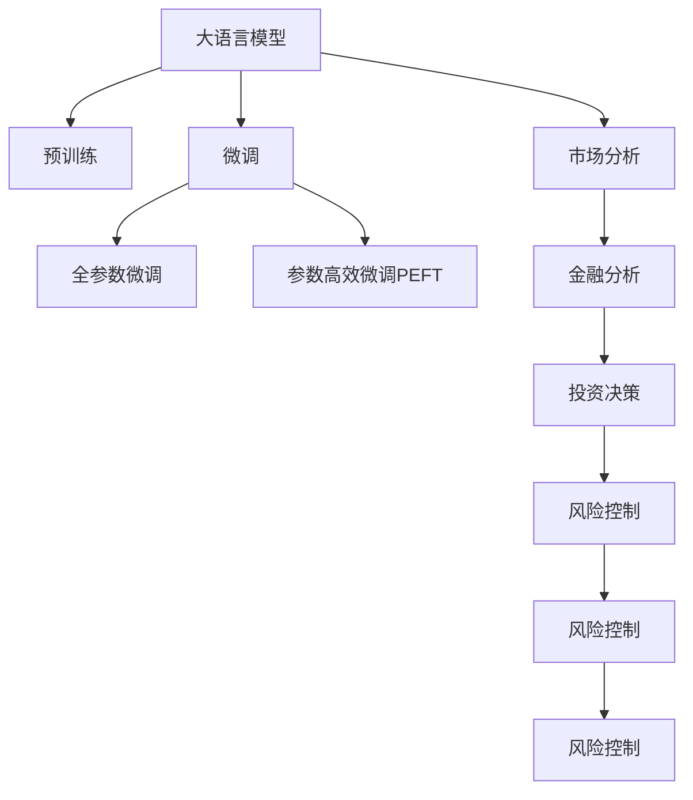

                 

# LLM对传统市场分析方法的革新

> 关键词：大语言模型(LLM),市场分析,自然语言处理(NLP),金融分析,投资决策,风险控制

## 1. 背景介绍

### 1.1 问题由来
市场分析一直是金融和经济领域的重要环节。传统的市场分析方法依赖于人工分析和数据挖掘，对专业知识和大量数据进行复杂计算，耗时耗力且容易出错。而随着大语言模型（Large Language Models, LLMs）技术的发展，市场分析领域正经历着一次深刻的变革。

### 1.2 问题核心关键点
LLM在自然语言处理（Natural Language Processing, NLP）领域的突破性进展，使得其在市场分析中的应用变得可能。LLM通过大规模文本语料进行预训练，能够理解和生成复杂的文本信息，从而取代传统的人工分析方式，提升了市场分析的效率和准确性。

### 1.3 问题研究意义
大语言模型在市场分析领域的应用，能够提升金融预测的精度和可靠性，优化投资决策，降低风险，加速金融智能化的进程。这将对金融机构的决策支持、风险控制和客户服务产生深远影响。

## 2. 核心概念与联系

### 2.1 核心概念概述

为更好地理解LLM在市场分析中的应用，本节将介绍几个关键概念及其联系：

- 大语言模型(Large Language Model, LLM)：以自回归或自编码模型为代表的大规模预训练语言模型。通过在大规模无标签文本语料上进行预训练，学习通用的语言表示，具备强大的语言理解和生成能力。

- 预训练(Pre-training)：指在大规模无标签文本语料上，通过自监督学习任务训练通用语言模型的过程。常见的预训练任务包括言语建模、遮挡语言模型等。

- 微调(Fine-tuning)：指在预训练模型的基础上，使用下游任务的少量标注数据，通过有监督学习优化模型在特定任务上的性能。

- 市场分析(Market Analysis)：通过收集和分析市场数据，预测市场走势，评估投资价值，进行风险控制等。

- 自然语言处理(Natural Language Processing, NLP)：利用计算机技术对自然语言数据进行自动化处理，包括文本分析、情感分析、命名实体识别等。

- 金融分析(Financial Analysis)：通过分析金融市场的历史和实时数据，评估金融资产的投资价值和风险，辅助金融决策。

- 投资决策(Investment Decision)：根据市场分析结果，制定投资策略，选择买卖时机，优化投资组合。

- 风险控制(Risk Control)：通过市场分析预测风险，采取相应的风险管理措施，确保投资安全。

这些概念之间的逻辑关系可以通过以下Mermaid流程图来展示：



这个流程图展示了大语言模型在市场分析中的应用流程：

1. 大语言模型通过预训练获得基础能力。
2. 微调是对预训练模型进行任务特定的优化，使得模型在特定市场分析任务上表现更好。
3. 金融分析、投资决策、风险控制等应用都可通过微调后的模型进行自动化处理。
4. 市场分析与金融分析、投资决策、风险控制等应用相辅相成，构成完整的金融市场分析体系。

## 3. 核心算法原理 & 具体操作步骤
### 3.1 算法原理概述

基于大语言模型的市场分析方法，本质上是将LLM作为强大的文本处理工具，应用于金融和经济领域的数据分析任务。其核心思想是：通过大语言模型对市场报告、新闻、公告、社交媒体等文本数据进行自动化分析，从中提取有用的信息，辅助决策和风险控制。

形式化地，假设市场分析任务 $T$ 的文本数据集为 $D=\{(x_i,y_i)\}_{i=1}^N, x_i \in \mathcal{X}, y_i \in \mathcal{Y}$，其中 $x_i$ 为市场文本，$y_i$ 为分析结果（如价格预测、情感倾向等）。定义模型 $M_{\theta}$ 在输入 $x$ 上的输出为 $\hat{y}=M_{\theta}(x)$，即市场分析模型。则在数据集 $D$ 上的经验风险为：

$$
\mathcal{L}(\theta) = \frac{1}{N} \sum_{i=1}^N \ell(M_{\theta}(x_i),y_i)
$$

其中 $\ell$ 为损失函数，用于衡量模型预测结果与真实标签之间的差异。

### 3.2 算法步骤详解

基于大语言模型的市场分析一般包括以下几个关键步骤：

**Step 1: 准备预训练模型和数据集**
- 选择合适的预训练语言模型 $M_{\theta}$ 作为初始化参数，如 GPT、BERT 等。
- 准备市场分析任务的文本数据集 $D$，划分为训练集、验证集和测试集。

**Step 2: 添加任务适配层**
- 根据任务类型，在预训练模型顶层设计合适的输出层和损失函数。
- 对于分类任务，通常在顶层添加线性分类器和交叉熵损失函数。
- 对于回归任务，通常使用均方误差损失函数。

**Step 3: 设置微调超参数**
- 选择合适的优化算法及其参数，如 Adam、SGD 等，设置学习率、批大小、迭代轮数等。
- 设置正则化技术及强度，包括权重衰减、Dropout、Early Stopping 等。
- 确定冻结预训练参数的策略，如仅微调顶层，或全部参数都参与微调。

**Step 4: 执行梯度训练**
- 将训练集数据分批次输入模型，前向传播计算损失函数。
- 反向传播计算参数梯度，根据设定的优化算法和学习率更新模型参数。
- 周期性在验证集上评估模型性能，根据性能指标决定是否触发 Early Stopping。
- 重复上述步骤直到满足预设的迭代轮数或 Early Stopping 条件。

**Step 5: 测试和部署**
- 在测试集上评估微调后模型 $M_{\hat{\theta}}$ 的性能，对比微调前后的精度提升。
- 使用微调后的模型对新样本进行推理预测，集成到实际的应用系统中。
- 持续收集新的数据，定期重新微调模型，以适应数据分布的变化。

以上是基于大语言模型的市场分析的一般流程。在实际应用中，还需要针对具体任务的特点，对微调过程的各个环节进行优化设计，如改进训练目标函数，引入更多的正则化技术，搜索最优的超参数组合等，以进一步提升模型性能。

### 3.3 算法优缺点

基于大语言模型的市场分析方法具有以下优点：
1. 高效自动化。相较于人工分析，LLM能够自动处理大量文本数据，显著提升分析速度。
2. 准确性高。LLM可以捕捉到细微的语言信息，提供更精确的市场分析结果。
3. 可解释性强。LLM分析过程具有可解释性，便于理解模型的推理逻辑。
4. 适应性强。LLM可以实时更新，适应不断变化的金融市场。

同时，该方法也存在一定的局限性：
1. 依赖高质量数据。LLM分析结果依赖于文本数据的质量，需要标注大量高质量的市场文本。
2. 复杂性高。大语言模型结构和超参数复杂，需要经验丰富的工程师进行调优。
3. 可控性差。LLM分析结果易受数据偏差和语言表达的影响，需要人工干预。
4. 计算资源需求高。大语言模型通常需要高性能的计算资源进行训练和推理。

尽管存在这些局限性，但就目前而言，基于大语言模型的市场分析方法仍是市场分析领域的重要范式。未来相关研究的重点在于如何进一步降低计算资源需求，提高可控性和解释性，以更好地应用于实际场景。

### 3.4 算法应用领域

基于大语言模型的市场分析方法，在金融和经济领域已经得到了广泛的应用，覆盖了金融市场分析、企业财务分析、投资策略制定等多个方面。以下是几个典型的应用场景：

- **金融市场分析**：通过对历史和实时市场数据进行文本分析，预测股票、债券、商品等金融资产的价格走势。
- **企业财务分析**：分析企业的财务报表、新闻报道等文本信息，评估企业的财务状况和投资价值。
- **投资策略制定**：结合市场分析结果，制定投资组合、买卖时机、风险控制策略。
- **风险控制**：通过文本分析预测市场风险，采取相应的风险管理措施，如资产配置、对冲策略等。

除了上述这些经典应用外，大语言模型还被创新性地应用于舆情分析、用户情绪监测、金融舆情预测等场景，为金融分析和市场决策提供了新的视角。随着预训练语言模型和微调方法的不断进步，相信大语言模型市场分析技术将在更多领域得到应用，为金融和经济决策提供更科学、更高效的支持。

## 4. 数学模型和公式 & 详细讲解  
### 4.1 数学模型构建

本节将使用数学语言对基于大语言模型的市场分析过程进行更加严格的刻画。

记市场分析任务 $T$ 的文本数据集为 $D=\{(x_i,y_i)\}_{i=1}^N, x_i \in \mathcal{X}, y_i \in \mathcal{Y}$。假设模型 $M_{\theta}$ 在输入 $x$ 上的输出为 $\hat{y}=M_{\theta}(x) \in \mathcal{Y}$。

定义模型 $M_{\theta}$ 在输入 $x$ 上的损失函数为 $\ell(M_{\theta}(x),y)$，则在数据集 $D$ 上的经验风险为：

$$
\mathcal{L}(\theta) = \frac{1}{N} \sum_{i=1}^N \ell(M_{\theta}(x_i),y_i)
$$

在微调过程中，目标是最小化经验风险，即找到最优参数：

$$
\theta^* = \mathop{\arg\min}_{\theta} \mathcal{L}(\theta)
$$

在得到损失函数的梯度后，即可带入参数更新公式，完成模型的迭代优化。重复上述过程直至收敛，最终得到适应市场分析任务的最优模型参数 $\theta^*$。

### 4.2 公式推导过程

以下我们以股票价格预测任务为例，推导均方误差损失函数及其梯度的计算公式。

假设模型 $M_{\theta}$ 在输入 $x$ 上的输出为 $\hat{y}=M_{\theta}(x)$，其中 $x$ 为市场报告、新闻等文本，$\hat{y}$ 为股票价格预测值，$y$ 为真实股票价格。则均方误差损失函数定义为：

$$
\ell(M_{\theta}(x),y) = \frac{1}{N} \sum_{i=1}^N (M_{\theta}(x_i) - y_i)^2
$$

将其代入经验风险公式，得：

$$
\mathcal{L}(\theta) = \frac{1}{N} \sum_{i=1}^N (M_{\theta}(x_i) - y_i)^2
$$

根据链式法则，损失函数对参数 $\theta_k$ 的梯度为：

$$
\frac{\partial \mathcal{L}(\theta)}{\partial \theta_k} = \frac{1}{N} \sum_{i=1}^N -2 \frac{\partial M_{\theta}(x_i)}{\partial \theta_k} (M_{\theta}(x_i) - y_i)
$$

其中 $\frac{\partial M_{\theta}(x_i)}{\partial \theta_k}$ 可进一步递归展开，利用自动微分技术完成计算。

在得到损失函数的梯度后，即可带入参数更新公式，完成模型的迭代优化。重复上述过程直至收敛，最终得到适应市场分析任务的最优模型参数 $\theta^*$。

## 5. 项目实践：代码实例和详细解释说明
### 5.1 开发环境搭建

在进行市场分析实践前，我们需要准备好开发环境。以下是使用Python进行PyTorch开发的环境配置流程：

1. 安装Anaconda：从官网下载并安装Anaconda，用于创建独立的Python环境。

2. 创建并激活虚拟环境：
```bash
conda create -n market-env python=3.8 
conda activate market-env
```

3. 安装PyTorch：根据CUDA版本，从官网获取对应的安装命令。例如：
```bash
conda install pytorch torchvision torchaudio cudatoolkit=11.1 -c pytorch -c conda-forge
```

4. 安装Transformers库：
```bash
pip install transformers
```

5. 安装各类工具包：
```bash
pip install numpy pandas scikit-learn matplotlib tqdm jupyter notebook ipython
```

完成上述步骤后，即可在`market-env`环境中开始市场分析实践。

### 5.2 源代码详细实现

这里我们以股票价格预测任务为例，给出使用Transformers库对BERT模型进行市场分析微调的PyTorch代码实现。

首先，定义市场分析任务的数据处理函数：

```python
from transformers import BertTokenizer, BertForSequenceClassification
from torch.utils.data import Dataset
import torch

class MarketDataset(Dataset):
    def __init__(self, texts, prices, tokenizer, max_len=128):
        self.texts = texts
        self.prices = prices
        self.tokenizer = tokenizer
        self.max_len = max_len
        
    def __len__(self):
        return len(self.texts)
    
    def __getitem__(self, item):
        text = self.texts[item]
        price = self.prices[item]
        
        encoding = self.tokenizer(text, return_tensors='pt', max_length=self.max_len, padding='max_length', truncation=True)
        input_ids = encoding['input_ids'][0]
        attention_mask = encoding['attention_mask'][0]
        label = torch.tensor(price, dtype=torch.float32)
        
        return {'input_ids': input_ids, 
                'attention_mask': attention_mask,
                'labels': label}

# 定义市场数据
texts = [...]  # 股票市场报告文本数据
prices = [...]  # 股票价格数据

tokenizer = BertTokenizer.from_pretrained('bert-base-uncased')

train_dataset = MarketDataset(train_texts, train_prices, tokenizer)
dev_dataset = MarketDataset(dev_texts, dev_prices, tokenizer)
test_dataset = MarketDataset(test_texts, test_prices, tokenizer)
```

然后，定义模型和优化器：

```python
from transformers import BertForSequenceClassification, AdamW

model = BertForSequenceClassification.from_pretrained('bert-base-uncased', num_labels=1)

optimizer = AdamW(model.parameters(), lr=2e-5)
```

接着，定义训练和评估函数：

```python
from torch.utils.data import DataLoader
from tqdm import tqdm
from sklearn.metrics import mean_squared_error

device = torch.device('cuda') if torch.cuda.is_available() else torch.device('cpu')
model.to(device)

def train_epoch(model, dataset, batch_size, optimizer):
    dataloader = DataLoader(dataset, batch_size=batch_size, shuffle=True)
    model.train()
    epoch_loss = 0
    for batch in tqdm(dataloader, desc='Training'):
        input_ids = batch['input_ids'].to(device)
        attention_mask = batch['attention_mask'].to(device)
        labels = batch['labels'].to(device)
        model.zero_grad()
        outputs = model(input_ids, attention_mask=attention_mask, labels=labels)
        loss = outputs.loss
        epoch_loss += loss.item()
        loss.backward()
        optimizer.step()
    return epoch_loss / len(dataloader)

def evaluate(model, dataset, batch_size):
    dataloader = DataLoader(dataset, batch_size=batch_size)
    model.eval()
    total_loss = 0
    total_mse = 0
    with torch.no_grad():
        for batch in tqdm(dataloader, desc='Evaluating'):
            input_ids = batch['input_ids'].to(device)
            attention_mask = batch['attention_mask'].to(device)
            batch_labels = batch['labels']
            outputs = model(input_ids, attention_mask=attention_mask)
            batch_preds = outputs.predictions[0].detach().cpu().numpy()
            batch_labels = batch_labels.to('cpu').numpy()
            total_loss += batch_loss.item()
            total_mse += mean_squared_error(batch_labels, batch_preds)
                
    mse = total_mse / len(dataloader)
    return mse
```

最后，启动训练流程并在测试集上评估：

```python
epochs = 5
batch_size = 16

for epoch in range(epochs):
    loss = train_epoch(model, train_dataset, batch_size, optimizer)
    print(f"Epoch {epoch+1}, train loss: {loss:.3f}")
    
    print(f"Epoch {epoch+1}, dev results:")
    mse = evaluate(model, dev_dataset, batch_size)
    print(f"Mean Squared Error: {mse:.4f}")
    
print("Test results:")
mse = evaluate(model, test_dataset, batch_size)
print(f"Mean Squared Error: {mse:.4f}")
```

以上就是使用PyTorch对BERT进行股票价格预测任务市场分析微调的完整代码实现。可以看到，得益于Transformers库的强大封装，我们可以用相对简洁的代码完成BERT模型的加载和微调。

### 5.3 代码解读与分析

让我们再详细解读一下关键代码的实现细节：

**MarketDataset类**：
- `__init__`方法：初始化文本、价格、分词器等关键组件。
- `__len__`方法：返回数据集的样本数量。
- `__getitem__`方法：对单个样本进行处理，将文本输入编码为token ids，将价格转换为标签，并进行定长padding，最终返回模型所需的输入。

**训练和评估函数**：
- 使用PyTorch的DataLoader对数据集进行批次化加载，供模型训练和推理使用。
- 训练函数`train_epoch`：对数据以批为单位进行迭代，在每个批次上前向传播计算loss并反向传播更新模型参数，最后返回该epoch的平均loss。
- 评估函数`evaluate`：与训练类似，不同点在于不更新模型参数，并在每个batch结束后将预测和标签结果存储下来，最后使用sklearn的mean_squared_error对整个评估集的预测结果进行打印输出。

**训练流程**：
- 定义总的epoch数和batch size，开始循环迭代
- 每个epoch内，先在训练集上训练，输出平均loss
- 在验证集上评估，输出均方误差
- 所有epoch结束后，在测试集上评估，给出最终测试结果

可以看到，PyTorch配合Transformers库使得BERT微调的市场分析任务代码实现变得简洁高效。开发者可以将更多精力放在数据处理、模型改进等高层逻辑上，而不必过多关注底层的实现细节。

当然，工业级的系统实现还需考虑更多因素，如模型的保存和部署、超参数的自动搜索、更灵活的任务适配层等。但核心的微调范式基本与此类似。

## 6. 实际应用场景
### 6.1 金融舆情监测

基于大语言模型的市场分析方法，可以广泛应用于金融舆情监测。传统的金融舆情监测依赖于人工分析和情绪分析，容易受到人为因素的影响，且效率低下。而使用微调后的市场分析模型，能够实时监测金融市场的舆情动态，自动化分析市场新闻、公告、社交媒体等文本数据，提供实时的舆情预警。

在技术实现上，可以收集金融市场相关的文本数据，如新闻、公告、社交媒体评论等，并使用微调后的市场分析模型进行实时监测。当模型检测到负面舆情时，自动发出警报，帮助金融机构及时应对市场波动，规避风险。

### 6.2 投资策略制定

微调后的市场分析模型可以帮助投资者制定更加科学、高效的投资策略。传统的投资策略依赖于经验丰富的分析师手动分析市场数据，容易受到主观偏见的影响。而使用微调后的市场分析模型，可以自动分析市场数据，提取有用的信息，预测市场走势，辅助投资者制定投资决策。

在实践中，可以收集历史和实时的市场数据，并使用微调后的市场分析模型进行自动化分析。模型可以识别市场中的关键信息和趋势，预测价格走势，生成投资建议，帮助投资者优化投资组合，提升收益。

### 6.3 风险控制

风险控制是金融市场分析的重要应用场景。传统的风险控制依赖于人工分析和经验判断，容易受到人为因素的影响，且难以快速反应市场变化。而使用微调后的市场分析模型，可以实时监测市场风险，预测潜在风险，采取相应的风险管理措施，确保投资安全。

在技术实现上，可以收集市场数据，并使用微调后的市场分析模型进行实时监测。当模型检测到潜在风险时，自动发出警报，帮助金融机构及时采取风险控制措施，如对冲策略、资产配置调整等，降低投资风险。

### 6.4 未来应用展望

随着大语言模型市场分析技术的发展，未来在金融和经济领域的应用前景将更加广阔。

在智慧金融领域，基于市场分析的智能投顾、财富管理、风险评估等应用将为投资者提供更智能、高效的服务。

在智慧政府领域，基于市场分析的宏观经济预测、政策制定、公共服务优化等应用将提升政府治理水平，服务社会民生。

在智慧企业领域，基于市场分析的企业财务分析、投资决策、市场监测等应用将提升企业竞争力，加速数字化转型。

除了上述这些经典应用外，大语言模型市场分析技术还将被创新性地应用于更多场景中，如智能推荐、金融安全、市场合规等，为金融和经济决策提供更全面、更可靠的支持。

## 7. 工具和资源推荐
### 7.1 学习资源推荐

为了帮助开发者系统掌握大语言模型市场分析的理论基础和实践技巧，这里推荐一些优质的学习资源：

1. 《Transformers from Jupyter Notebooks》系列博文：由大模型技术专家撰写，深入浅出地介绍了Transformer原理、BERT模型、市场分析技术等前沿话题。

2. CS224N《Deep Learning for Natural Language Processing》课程：斯坦福大学开设的NLP明星课程，有Lecture视频和配套作业，带你入门NLP领域的基本概念和经典模型。

3. 《Natural Language Processing with PyTorch》书籍：使用PyTorch进行NLP任务开发的全面教程，包括微调技术在内的诸多范式。

4. Weights & Biases：模型训练的实验跟踪工具，可以记录和可视化模型训练过程中的各项指标，方便对比和调优。与主流深度学习框架无缝集成。

5. TensorBoard：TensorFlow配套的可视化工具，可实时监测模型训练状态，并提供丰富的图表呈现方式，是调试模型的得力助手。

通过对这些资源的学习实践，相信你一定能够快速掌握大语言模型市场分析的精髓，并用于解决实际的金融和经济问题。
###  7.2 开发工具推荐

高效的开发离不开优秀的工具支持。以下是几款用于大语言模型市场分析开发的常用工具：

1. PyTorch：基于Python的开源深度学习框架，灵活动态的计算图，适合快速迭代研究。大部分预训练语言模型都有PyTorch版本的实现。

2. TensorFlow：由Google主导开发的开源深度学习框架，生产部署方便，适合大规模工程应用。同样有丰富的预训练语言模型资源。

3. Transformers库：HuggingFace开发的NLP工具库，集成了众多SOTA语言模型，支持PyTorch和TensorFlow，是进行市场分析微调任务的开发利器。

4. Weights & Biases：模型训练的实验跟踪工具，可以记录和可视化模型训练过程中的各项指标，方便对比和调优。与主流深度学习框架无缝集成。

5. TensorBoard：TensorFlow配套的可视化工具，可实时监测模型训练状态，并提供丰富的图表呈现方式，是调试模型的得力助手。

6. Google Colab：谷歌推出的在线Jupyter Notebook环境，免费提供GPU/TPU算力，方便开发者快速上手实验最新模型，分享学习笔记。

合理利用这些工具，可以显著提升大语言模型市场分析任务的开发效率，加快创新迭代的步伐。

### 7.3 相关论文推荐

大语言模型在市场分析领域的应用，源于学界的持续研究。以下是几篇奠基性的相关论文，推荐阅读：

1. Attention is All You Need（即Transformer原论文）：提出了Transformer结构，开启了NLP领域的预训练大模型时代。

2. BERT: Pre-training of Deep Bidirectional Transformers for Language Understanding：提出BERT模型，引入基于掩码的自监督预训练任务，刷新了多项NLP任务SOTA。

3. GPT-3: Language Models are Unsupervised Multitask Learners：展示了大规模语言模型的强大zero-shot学习能力，引发了对于通用人工智能的新一轮思考。

4. Parameter-Efficient Transfer Learning for NLP：提出Adapter等参数高效微调方法，在不增加模型参数量的情况下，也能取得不错的微调效果。

5. Adaptation Without Labeling: Automated Generalization of Pre-trained Language Models to New Tasks and Languages：提出Adaptation方法，通过自动化适应新任务，提升模型的通用性和可迁移性。

这些论文代表了大语言模型市场分析技术的发展脉络。通过学习这些前沿成果，可以帮助研究者把握学科前进方向，激发更多的创新灵感。

## 8. 总结：未来发展趋势与挑战

### 8.1 总结

本文对基于大语言模型的市场分析方法进行了全面系统的介绍。首先阐述了大语言模型和市场分析的研究背景和意义，明确了微调在提升金融预测精度、优化投资决策等方面的独特价值。其次，从原理到实践，详细讲解了微调的数学原理和关键步骤，给出了市场分析任务开发的完整代码实例。同时，本文还广泛探讨了微调方法在金融舆情监测、投资策略制定、风险控制等多个领域的应用前景，展示了微调范式的巨大潜力。此外，本文精选了微调技术的各类学习资源，力求为读者提供全方位的技术指引。

通过本文的系统梳理，可以看到，基于大语言模型的市场分析方法正在成为金融分析的重要范式，极大地提升了市场预测和风险控制的效率和准确性。未来，伴随大语言模型和微调方法的不断进步，相信市场分析技术将在更多领域得到应用，为金融和经济决策提供更科学、更高效的支持。

### 8.2 未来发展趋势

展望未来，大语言模型市场分析技术将呈现以下几个发展趋势：

1. 模型规模持续增大。随着算力成本的下降和数据规模的扩张，预训练语言模型的参数量还将持续增长。超大规模语言模型蕴含的丰富语言知识，有望支撑更加复杂多变的市场分析任务。

2. 微调方法日趋多样。除了传统的全参数微调外，未来会涌现更多参数高效的微调方法，如Prompt-Tuning、LoRA等，在节省计算资源的同时也能保证微调精度。

3. 持续学习成为常态。随着数据分布的不断变化，微调模型也需要持续学习新知识以保持性能。如何在不遗忘原有知识的同时，高效吸收新样本信息，将成为重要的研究课题。

4. 标注样本需求降低。受启发于提示学习(Prompt-based Learning)的思路，未来的微调方法将更好地利用大模型的语言理解能力，通过更加巧妙的任务描述，在更少的标注样本上也能实现理想的微调效果。

5. 多模态微调崛起。当前的微调主要聚焦于纯文本数据，未来会进一步拓展到图像、视频、语音等多模态数据微调。多模态信息的融合，将显著提升语言模型对现实世界的理解和建模能力。

6. 模型通用性增强。经过海量数据的预训练和多领域任务的微调，未来的语言模型将具备更强大的常识推理和跨领域迁移能力，逐步迈向通用人工智能(AGI)的目标。

以上趋势凸显了大语言模型市场分析技术的广阔前景。这些方向的探索发展，必将进一步提升金融和市场分析的智能化水平，为决策者提供更全面、更可靠的市场预测和风险控制支持。

### 8.3 面临的挑战

尽管大语言模型市场分析技术已经取得了瞩目成就，但在迈向更加智能化、普适化应用的过程中，它仍面临着诸多挑战：

1. 标注成本瓶颈。虽然微调大大降低了标注数据的需求，但对于长尾应用场景，难以获得充足的高质量标注数据，成为制约微调性能的瓶颈。如何进一步降低微调对标注样本的依赖，将是一大难题。

2. 模型鲁棒性不足。当前微调模型面对域外数据时，泛化性能往往大打折扣。对于测试样本的微小扰动，微调模型的预测也容易发生波动。如何提高微调模型的鲁棒性，避免灾难性遗忘，还需要更多理论和实践的积累。

3. 推理效率有待提高。大规模语言模型虽然精度高，但在实际部署时往往面临推理速度慢、内存占用大等效率问题。如何在保证性能的同时，简化模型结构，提升推理速度，优化资源占用，将是重要的优化方向。

4. 可解释性亟需加强。当前微调模型更像是"黑盒"系统，难以解释其内部工作机制和决策逻辑。对于金融、经济等领域，算法的可解释性和可审计性尤为重要。如何赋予微调模型更强的可解释性，将是亟待攻克的难题。

5. 安全性有待保障。预训练语言模型难免会学习到有偏见、有害的信息，通过微调传递到市场分析任务，产生误导性、歧视性的输出，给实际应用带来安全隐患。如何从数据和算法层面消除模型偏见，避免恶意用途，确保输出的安全性，也将是重要的研究课题。

6. 知识整合能力不足。现有的微调模型往往局限于任务内数据，难以灵活吸收和运用更广泛的先验知识。如何让微调过程更好地与外部知识库、规则库等专家知识结合，形成更加全面、准确的信息整合能力，还有很大的想象空间。

正视市场分析面临的这些挑战，积极应对并寻求突破，将是大语言模型市场分析走向成熟的必由之路。相信随着学界和产业界的共同努力，这些挑战终将一一被克服，大语言模型市场分析技术必将在构建智能金融和市场分析系统方面发挥更大的作用。

### 8.4 研究展望

面对大语言模型市场分析所面临的种种挑战，未来的研究需要在以下几个方面寻求新的突破：

1. 探索无监督和半监督市场分析方法。摆脱对大规模标注数据的依赖，利用自监督学习、主动学习等无监督和半监督范式，最大限度利用非结构化数据，实现更加灵活高效的市场分析。

2. 研究参数高效和计算高效的微调范式。开发更加参数高效的微调方法，在固定大部分预训练参数的同时，只更新极少量的任务相关参数。同时优化微调模型的计算图，减少前向传播和反向传播的资源消耗，实现更加轻量级、实时性的部署。

3. 融合因果和对比学习范式。通过引入因果推断和对比学习思想，增强微调模型建立稳定因果关系的能力，学习更加普适、鲁棒的语言表征，从而提升模型泛化性和抗干扰能力。

4. 引入更多先验知识。将符号化的先验知识，如知识图谱、逻辑规则等，与神经网络模型进行巧妙融合，引导微调过程学习更准确、合理的语言模型。同时加强不同模态数据的整合，实现视觉、语音等多模态信息与文本信息的协同建模。

5. 结合因果分析和博弈论工具。将因果分析方法引入微调模型，识别出模型决策的关键特征，增强输出解释的因果性和逻辑性。借助博弈论工具刻画人机交互过程，主动探索并规避模型的脆弱点，提高系统稳定性。

6. 纳入伦理道德约束。在模型训练目标中引入伦理导向的评估指标，过滤和惩罚有偏见、有害的输出倾向。同时加强人工干预和审核，建立模型行为的监管机制，确保输出符合人类价值观和伦理道德。

这些研究方向的探索，必将引领大语言模型市场分析技术迈向更高的台阶，为构建安全、可靠、可解释、可控的智能金融和市场分析系统铺平道路。面向未来，大语言模型市场分析技术还需要与其他人工智能技术进行更深入的融合，如知识表示、因果推理、强化学习等，多路径协同发力，共同推动金融和经济决策的智能化进程。只有勇于创新、敢于突破，才能不断拓展语言模型的边界，让智能技术更好地造福人类社会。

## 9. 附录：常见问题与解答
### Q1：大语言模型市场分析是否适用于所有市场分析任务？

A: 大语言模型市场分析在大多数市场分析任务上都能取得不错的效果，特别是对于数据量较小的任务。但对于一些特定领域的任务，如医学、法律等，仅仅依靠通用语料预训练的模型可能难以很好地适应。此时需要在特定领域语料上进一步预训练，再进行微调，才能获得理想效果。此外，对于一些需要时效性、个性化很强的任务，如金融舆情监测、投资策略制定等，微调方法也需要针对性的改进优化。

### Q2：微调过程中如何选择合适的学习率？

A: 微调的学习率一般要比预训练时小1-2个数量级，如果使用过大的学习率，容易破坏预训练权重，导致过拟合。一般建议从1e-5开始调参，逐步减小学习率，直至收敛。也可以使用warmup策略，在开始阶段使用较小的学习率，再逐渐过渡到预设值。需要注意的是，不同的优化器(如Adam、Adafactor等)以及不同的学习率调度策略，可能需要设置不同的学习率阈值。

### Q3：采用大语言模型市场分析时会面临哪些资源瓶颈？

A: 目前主流的预训练大模型动辄以亿计的参数规模，对算力、内存、存储都提出了很高的要求。GPU/TPU等高性能设备是必不可少的，但即便如此，超大批次的训练和推理也可能遇到显存不足的问题。因此需要采用一些资源优化技术，如梯度积累、混合精度训练、模型并行等，来突破硬件瓶颈。同时，模型的存储和读取也可能占用大量时间和空间，需要采用模型压缩、稀疏化存储等方法进行优化。

### Q4：如何缓解微调过程中的过拟合问题？

A: 过拟合是微调面临的主要挑战，尤其是在标注数据不足的情况下。常见的缓解策略包括：
1. 数据增强：通过回译、近义替换等方式扩充训练集
2. 正则化：使用L2正则、Dropout、Early Stopping等避免过拟合
3. 对抗训练：引入对抗样本，提高模型鲁棒性
4. 参数高效微调：只调整少量参数(如Adapter、Prompt等)，减小过拟合风险
5. 多模型集成：训练多个微调模型，取平均输出，抑制过拟合

这些策略往往需要根据具体任务和数据特点进行灵活组合。只有在数据、模型、训练、推理等各环节进行全面优化，才能最大限度地发挥大语言模型市场分析的威力。

### Q5：微调模型在落地部署时需要注意哪些问题？

A: 将微调模型转化为实际应用，还需要考虑以下因素：
1. 模型裁剪：去除不必要的层和参数，减小模型尺寸，加快推理速度
2. 量化加速：将浮点模型转为定点模型，压缩存储空间，提高计算效率
3. 服务化封装：将模型封装为标准化服务接口，便于集成调用
4. 弹性伸缩：根据请求流量动态调整资源配置，平衡服务质量和成本
5. 监控告警：实时采集系统指标，设置异常告警阈值，确保服务稳定性
6. 安全防护：采用访问鉴权、数据脱敏等措施，保障数据和模型安全

大语言模型市场分析为金融和经济决策提供了新的视角，但如何将强大的性能转化为稳定、高效、安全的业务价值，还需要工程实践的不断打磨。唯有从数据、算法、工程、业务等多个维度协同发力，才能真正实现大语言模型市场分析技术的落地应用。总之，微调需要开发者根据具体任务，不断迭代和优化模型、数据和算法，方能得到理想的效果。

---

作者：禅与计算机程序设计艺术 / Zen and the Art of Computer Programming

