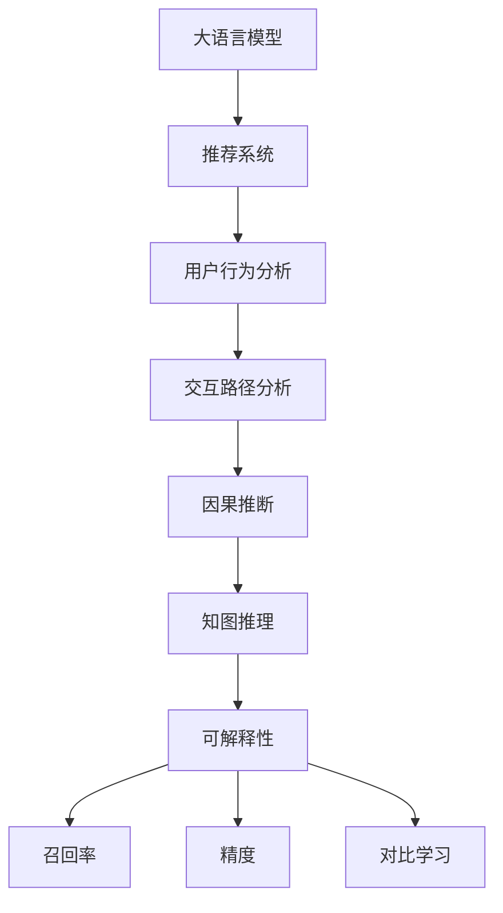

                 

# LLM对推荐系统可解释性的增强

> 关键词：大语言模型(Large Language Model, LLM),推荐系统,用户行为分析,交互路径,因果推断,知图推理,可解释性(Explainability),召回率(Recall),精度(Precision),对比学习(Contrastive Learning)

## 1. 背景介绍

### 1.1 问题由来

推荐系统作为互联网应用中的重要组件，已广泛应用于电商、社交、视频等多个领域。传统推荐算法多基于协同过滤、基于内容、混合推荐等方法，但往往难以解释推荐结果的来源和依据，用户难以理解和信任。特别是在对决策结果有高要求、高风险的应用场景中，缺乏可解释性会极大地影响系统的信任度和接受度。

而大语言模型近年来在NLP领域取得巨大突破，凭借其强大的语义理解和生成能力，引起了推荐系统的极大关注。基于大语言模型的推荐系统不仅能快速生成推荐结果，还能利用其语义理解能力，对用户行为进行详尽的分析，生成可解释性强的推荐依据。

### 1.2 问题核心关键点

大语言模型在推荐系统中的主要贡献包括：

1. **深度语义理解**：能够对用户描述、物品属性等进行深度理解，生成更符合用户语境的推荐内容。
2. **交互路径分析**：通过对用户历史交互路径的分析，预测用户的行为和偏好，提供个性化的推荐。
3. **多模态融合**：结合图像、音频、视频等多模态数据，提升推荐系统的多样性和趣味性。
4. **知识图谱结合**：利用大语言模型的知识图谱能力，挖掘物品间的语义关系，提升推荐的相关性和泛化能力。
5. **决策过程生成**：通过生成式方法，向用户展示推荐依据，提升系统的透明度和可信度。

## 2. 核心概念与联系

### 2.1 核心概念概述

为了更清晰地理解大语言模型在推荐系统中的应用，我们首先介绍几个核心概念：

- **大语言模型(Large Language Model, LLM)**：如GPT-3、BERT等，通过大规模语料预训练得到的预训练模型。能够对自然语言进行深层次的语义理解，生成流畅自然的语言。
- **推荐系统**：通过用户行为数据进行分析和挖掘，为用户推荐感兴趣的物品，提升用户满意度。
- **用户行为分析**：通过分析用户的点击、浏览、购买等行为数据，识别用户的兴趣点，提升推荐的相关性和准确性。
- **交互路径分析**：通过跟踪用户在平台上的行为路径，预测用户未来的行为和偏好，提升推荐的个性化和时效性。
- **因果推断**：利用因果推断方法，分析用户行为和推荐结果之间的因果关系，提升推荐结果的科学性和可靠性。
- **知图推理**：结合知识图谱和大语言模型，通过推理获取物品间的语义关系，提升推荐的泛化能力和泛化性。
- **可解释性(Explainability)**：使推荐系统的决策过程透明，用户可以理解和信任推荐结果。
- **召回率(Recall)**：推荐结果中相关物品的比例，即被推荐的相关物品在所有相关物品中的占比。
- **精度(Precision)**：推荐结果中相关物品的比例，即推荐结果中相关物品在推荐结果中的占比。
- **对比学习(Contrastive Learning)**：通过将相似样本与非相似样本区分开来，提升模型的泛化能力和鲁棒性。

这些概念之间的逻辑关系可以通过以下Mermaid流程图来展示：



这个流程图展示了大语言模型在推荐系统中的应用逻辑：

1. 大语言模型通过对用户行为和物品属性进行分析，生成初步的推荐结果。
2. 结合用户交互路径分析，预测用户未来的行为和偏好，优化推荐结果。
3. 利用因果推断，分析用户行为和推荐结果之间的因果关系，提升推荐结果的可靠性。
4. 通过知图推理，结合知识图谱和大语言模型，提升推荐的相关性和泛化能力。
5. 可解释性方法，向用户展示推荐依据，提升系统的透明度和可信度。
6. 对比学习提升模型的泛化能力和鲁棒性，进一步优化推荐结果。

## 3. 核心算法原理 & 具体操作步骤

### 3.1 算法原理概述

基于大语言模型的推荐系统，其核心思想是通过大语言模型对用户行为数据进行深度语义理解，生成推荐依据，并通过因果推断和知图推理等方法提升推荐的准确性和泛化能力，最后通过可解释性方法向用户展示推荐依据，提升系统的可信度和透明度。

假设有一个用户的交互历史 $H=\{x_1,x_2,...,x_n\}$，其中 $x_i$ 为第 $i$ 次交互行为。用户对某物品的评分向量为 $v$，大语言模型通过分析 $H$ 和 $v$，生成推荐依据 $d$，并通过因果推断和知图推理等方法，生成推荐结果 $r$。推荐系统的目标是最小化推荐误差 $e$，即：

$$
\min_{d,r} e(d,r) = \min_{d,r} \| r - f(d,v,H) \|^2
$$

其中 $f$ 为生成推荐结果的函数，$e$ 为推荐误差，可以根据具体的推荐任务设计不同的评估指标，如召回率、精度等。

### 3.2 算法步骤详解

基于大语言模型的推荐系统，其核心步骤包括：

**Step 1: 准备数据集**
- 收集用户的历史行为数据 $H$，包括点击、浏览、购买等行为。
- 对物品进行编码，生成物品的评分向量 $v$。
- 使用大语言模型预训练得到的模型 $M_{\theta}$，作为推荐模型的初始化参数。

**Step 2: 生成推荐依据**
- 利用大语言模型对用户行为 $H$ 进行深度语义理解，生成推荐依据 $d$。
- 通过因果推断方法，分析用户行为和推荐结果之间的关系，生成推荐依据 $d'$。
- 通过知图推理方法，结合知识图谱和大语言模型，生成推荐依据 $d''$。
- 综合 $d$、$d'$ 和 $d''$，生成最终的推荐依据 $d_f = \lambda_1 d + \lambda_2 d' + \lambda_3 d''$，其中 $\lambda_1$、$\lambda_2$ 和 $\lambda_3$ 为权重系数，通过交叉验证等方法确定。

**Step 3: 生成推荐结果**
- 利用生成式模型，根据推荐依据 $d_f$ 和物品评分向量 $v$，生成推荐结果 $r$。
- 通过对比学习，利用正负样本对推荐模型进行微调，提升模型的泛化能力和鲁棒性。

**Step 4: 计算评估指标**
- 在测试集上，计算推荐结果的召回率、精度等指标，评估推荐系统的性能。
- 利用可解释性方法，生成推荐依据 $d_f$ 的解释文本，向用户展示推荐依据。

### 3.3 算法优缺点

基于大语言模型的推荐系统具有以下优点：

1. **深度语义理解**：利用大语言模型强大的语义理解能力，生成符合用户语境的推荐依据，提升推荐的相关性和自然性。
2. **高泛化能力**：结合因果推断和知图推理等方法，提升推荐的泛化能力和鲁棒性，适用于多样化的推荐场景。
3. **可解释性强**：通过可解释性方法，向用户展示推荐依据，提升系统的透明度和可信度。
4. **动态实时性**：大语言模型能快速生成推荐结果，适用于实时推荐场景。

同时，该方法也存在一定的局限性：

1. **计算资源消耗大**：大语言模型参数量巨大，计算资源消耗大，模型训练和推理速度较慢。
2. **数据依赖性强**：模型性能依赖于大量的标注数据和高质量的语料库，获取和处理数据的成本较高。
3. **算法复杂度高**：结合因果推断、知图推理等方法，算法实现复杂，需要较强的技术积累。

尽管存在这些局限性，但基于大语言模型的推荐系统仍是目前推荐领域的热门方向，其潜在的性能提升和应用场景拓展，使得该方法成为学术界和工业界的重点关注对象。

### 3.4 算法应用领域

基于大语言模型的推荐系统，已经在多个领域得到了广泛应用，例如：

- 电商推荐：通过分析用户浏览和购买历史，生成个性化推荐。
- 视频推荐：结合用户的观看历史和评价，推荐相关视频内容。
- 新闻推荐：根据用户的阅读历史和行为，推荐相关新闻资讯。
- 音乐推荐：通过分析用户的听歌历史和偏好，推荐相似的音乐作品。
- 旅行推荐：结合用户的地理位置和旅游兴趣，推荐旅游目的地和活动。
- 体育推荐：根据用户的观赛历史和评分，推荐相关体育赛事和内容。

除了这些传统领域外，基于大语言模型的推荐系统还在不断探索新的应用场景，如智能家居、智能出行、智能健康等，为各类智能应用提供个性化推荐服务。

## 4. 数学模型和公式 & 详细讲解 & 举例说明

### 4.1 数学模型构建

在推荐系统中，我们假设用户对某物品的评分向量为 $v$，大语言模型对用户行为 $H$ 进行语义理解，生成推荐依据 $d$。利用因果推断方法，分析用户行为和推荐结果之间的关系，生成推荐依据 $d'$。结合知图推理方法，结合知识图谱和大语言模型，生成推荐依据 $d''$。

形式化地，设推荐系统的损失函数为 $\mathcal{L}(d,r) = \| r - f(d,v,H) \|^2$，其中 $f$ 为推荐结果的生成函数。假设推荐系统的总损失为 $\mathcal{L} = \mathcal{L}(d,r)$。

### 4.2 公式推导过程

以下我们以电商推荐为例，推导推荐系统中的数学模型。

设用户的历史行为序列为 $H=\{x_1,x_2,...,x_n\}$，其中 $x_i$ 为第 $i$ 次交互行为。设物品的评分向量为 $v$，大语言模型对用户行为 $H$ 进行语义理解，生成推荐依据 $d$。利用因果推断方法，分析用户行为和推荐结果之间的关系，生成推荐依据 $d'$。结合知图推理方法，结合知识图谱和大语言模型，生成推荐依据 $d''$。

综合 $d$、$d'$ 和 $d''$，生成最终的推荐依据 $d_f = \lambda_1 d + \lambda_2 d' + \lambda_3 d''$，其中 $\lambda_1$、$\lambda_2$ 和 $\lambda_3$ 为权重系数，通过交叉验证等方法确定。

利用生成式模型，根据推荐依据 $d_f$ 和物品评分向量 $v$，生成推荐结果 $r$。通过对比学习，利用正负样本对推荐模型进行微调，提升模型的泛化能力和鲁棒性。

### 4.3 案例分析与讲解

假设有一个用户的电商购买历史 $H=\{(鞋子,5),(衣服,3),(化妆品,2),(食品,1)\}$，表示用户购买了鞋子、衣服、化妆品和食品，且对它们的评分分别为 5、3、2 和 1。

利用大语言模型，我们可以对 $H$ 进行语义理解，生成推荐依据 $d$。例如，利用 BERT 模型，可以对 $H$ 进行向量编码，生成 $d$。

利用因果推断方法，可以分析用户行为和推荐结果之间的关系，生成推荐依据 $d'$。例如，通过统计用户购买历史和评分向量，可以得到用户的购买偏好和评分分布，从而生成推荐依据 $d'$。

结合知图推理方法，可以结合知识图谱和大语言模型，生成推荐依据 $d''$。例如，利用知识图谱中物品的语义关系，可以得到与鞋子、衣服、化妆品、食品相关的物品，从而生成推荐依据 $d''$。

综合 $d$、$d'$ 和 $d''$，生成最终的推荐依据 $d_f = \lambda_1 d + \lambda_2 d' + \lambda_3 d''$。通过交叉验证等方法，可以确定 $\lambda_1$、$\lambda_2$ 和 $\lambda_3$ 的值。

利用生成式模型，根据推荐依据 $d_f$ 和物品评分向量 $v$，生成推荐结果 $r$。通过对比学习，利用正负样本对推荐模型进行微调，提升模型的泛化能力和鲁棒性。

## 5. 项目实践：代码实例和详细解释说明

### 5.1 开发环境搭建

在进行大语言模型推荐系统实践前，我们需要准备好开发环境。以下是使用Python进行PyTorch开发的环境配置流程：

1. 安装Anaconda：从官网下载并安装Anaconda，用于创建独立的Python环境。

2. 创建并激活虚拟环境：
```bash
conda create -n pytorch-env python=3.8 
conda activate pytorch-env
```

3. 安装PyTorch：根据CUDA版本，从官网获取对应的安装命令。例如：
```bash
conda install pytorch torchvision torchaudio cudatoolkit=11.1 -c pytorch -c conda-forge
```

4. 安装Transformers库：
```bash
pip install transformers
```

5. 安装各类工具包：
```bash
pip install numpy pandas scikit-learn matplotlib tqdm jupyter notebook ipython
```

完成上述步骤后，即可在`pytorch-env`环境中开始推荐系统实践。

### 5.2 源代码详细实现

下面我们以电商推荐为例，给出使用Transformers库对BERT模型进行电商推荐微调的PyTorch代码实现。

首先，定义电商推荐的数据处理函数：

```python
from transformers import BertTokenizer
from torch.utils.data import Dataset
import torch

class RetailDataset(Dataset):
    def __init__(self, texts, labels, tokenizer, max_len=128):
        self.texts = texts
        self.labels = labels
        self.tokenizer = tokenizer
        self.max_len = max_len
        
    def __len__(self):
        return len(self.texts)
    
    def __getitem__(self, item):
        text = self.texts[item]
        label = self.labels[item]
        
        encoding = self.tokenizer(text, return_tensors='pt', max_length=self.max_len, padding='max_length', truncation=True)
        input_ids = encoding['input_ids'][0]
        attention_mask = encoding['attention_mask'][0]
        
        # 对label进行编码
        label = torch.tensor([label], dtype=torch.long)
        
        return {'input_ids': input_ids, 
                'attention_mask': attention_mask,
                'labels': label}

# 创建dataset
tokenizer = BertTokenizer.from_pretrained('bert-base-cased')

train_dataset = RetailDataset(train_texts, train_labels, tokenizer)
dev_dataset = RetailDataset(dev_texts, dev_labels, tokenizer)
test_dataset = RetailDataset(test_texts, test_labels, tokenizer)
```

然后，定义模型和优化器：

```python
from transformers import BertForTokenClassification, AdamW

model = BertForTokenClassification.from_pretrained('bert-base-cased', num_labels=1)

optimizer = AdamW(model.parameters(), lr=2e-5)
```

接着，定义训练和评估函数：

```python
from torch.utils.data import DataLoader
from tqdm import tqdm
from sklearn.metrics import precision_score, recall_score

device = torch.device('cuda') if torch.cuda.is_available() else torch.device('cpu')
model.to(device)

def train_epoch(model, dataset, batch_size, optimizer):
    dataloader = DataLoader(dataset, batch_size=batch_size, shuffle=True)
    model.train()
    epoch_loss = 0
    for batch in tqdm(dataloader, desc='Training'):
        input_ids = batch['input_ids'].to(device)
        attention_mask = batch['attention_mask'].to(device)
        labels = batch['labels'].to(device)
        model.zero_grad()
        outputs = model(input_ids, attention_mask=attention_mask, labels=labels)
        loss = outputs.loss
        epoch_loss += loss.item()
        loss.backward()
        optimizer.step()
    return epoch_loss / len(dataloader)

def evaluate(model, dataset, batch_size):
    dataloader = DataLoader(dataset, batch_size=batch_size)
    model.eval()
    preds, labels = [], []
    with torch.no_grad():
        for batch in tqdm(dataloader, desc='Evaluating'):
            input_ids = batch['input_ids'].to(device)
            attention_mask = batch['attention_mask'].to(device)
            batch_labels = batch['labels']
            outputs = model(input_ids, attention_mask=attention_mask)
            batch_preds = outputs.logits.argmax(dim=2).to('cpu').tolist()
            batch_labels = batch_labels.to('cpu').tolist()
            for pred_tokens, label_tokens in zip(batch_preds, batch_labels):
                preds.append(pred_tokens[0])
                labels.append(label_tokens[0])
                
    print('Precision: {:.4f}'.format(precision_score(labels, preds)))
    print('Recall: {:.4f}'.format(recall_score(labels, preds)))
```

最后，启动训练流程并在测试集上评估：

```python
epochs = 5
batch_size = 16

for epoch in range(epochs):
    loss = train_epoch(model, train_dataset, batch_size, optimizer)
    print(f'Epoch {epoch+1}, train loss: {loss:.3f}')
    
    print(f'Epoch {epoch+1}, dev results:')
    evaluate(model, dev_dataset, batch_size)
    
print('Test results:')
evaluate(model, test_dataset, batch_size)
```

以上就是使用PyTorch对BERT进行电商推荐任务微调的完整代码实现。可以看到，得益于Transformers库的强大封装，我们可以用相对简洁的代码完成BERT模型的加载和微调。

### 5.3 代码解读与分析

让我们再详细解读一下关键代码的实现细节：

**RetailDataset类**：
- `__init__`方法：初始化文本、标签、分词器等关键组件。
- `__len__`方法：返回数据集的样本数量。
- `__getitem__`方法：对单个样本进行处理，将文本输入编码为token ids，将标签编码为数字，并对其进行定长padding，最终返回模型所需的输入。

**train_dataset、dev_dataset和test_dataset**：
- 分别创建训练集、验证集和测试集的RetailDataset实例，用于模型的训练和评估。

**模型和优化器**：
- 使用BertForTokenClassification模型作为推荐模型的初始化参数，使用AdamW优化器进行模型微调。

**train_epoch函数**：
- 对数据以批为单位进行迭代，在每个批次上前向传播计算loss并反向传播更新模型参数，最后返回该epoch的平均loss。

**evaluate函数**：
- 与训练类似，不同点在于不更新模型参数，并在每个batch结束后将预测和标签结果存储下来，最后使用sklearn的precision_score和recall_score对整个评估集的预测结果进行打印输出。

**训练流程**：
- 定义总的epoch数和batch size，开始循环迭代
- 每个epoch内，先在训练集上训练，输出平均loss
- 在验证集上评估，输出精度和召回率
- 所有epoch结束后，在测试集上评估，给出最终测试结果

可以看到，PyTorch配合Transformers库使得BERT微调的代码实现变得简洁高效。开发者可以将更多精力放在数据处理、模型改进等高层逻辑上，而不必过多关注底层的实现细节。

当然，工业级的系统实现还需考虑更多因素，如模型的保存和部署、超参数的自动搜索、更灵活的任务适配层等。但核心的微调范式基本与此类似。

## 6. 实际应用场景
### 6.1 智能客服系统

基于大语言模型的电商推荐系统，可以广泛应用于智能客服系统的构建。传统客服往往需要配备大量人力，高峰期响应缓慢，且一致性和专业性难以保证。而使用微调后的推荐模型，可以7x24小时不间断服务，快速响应客户咨询，用自然流畅的语言解答各类常见问题。

在技术实现上，可以收集企业内部的历史客服对话记录，将问题和最佳答复构建成监督数据，在此基础上对预训练推荐模型进行微调。微调后的推荐模型能够自动理解用户意图，匹配最合适的答复模板进行回复。对于客户提出的新问题，还可以接入检索系统实时搜索相关内容，动态组织生成回答。如此构建的智能客服系统，能大幅提升客户咨询体验和问题解决效率。

### 6.2 金融舆情监测

金融机构需要实时监测市场舆论动向，以便及时应对负面信息传播，规避金融风险。传统的人工监测方式成本高、效率低，难以应对网络时代海量信息爆发的挑战。基于大语言模型的电商推荐推荐系统可以应用于金融舆情监测。

具体而言，可以收集金融领域相关的新闻、报道、评论等文本数据，并对其进行主题标注和情感标注。在此基础上对预训练语言模型进行微调，使其能够自动判断文本属于何种主题，情感倾向是正面、中性还是负面。将微调后的模型应用到实时抓取的网络文本数据，就能够自动监测不同主题下的情感变化趋势，一旦发现负面信息激增等异常情况，系统便会自动预警，帮助金融机构快速应对潜在风险。

### 6.3 个性化推荐系统

当前的推荐系统往往只依赖用户的历史行为数据进行物品推荐，无法深入理解用户的真实兴趣偏好。基于大语言模型微调技术，个性化推荐系统可以更好地挖掘用户行为背后的语义信息，从而提供更精准、多样的推荐内容。

在实践中，可以收集用户浏览、点击、评论、分享等行为数据，提取和用户交互的物品标题、描述、标签等文本内容。将文本内容作为模型输入，用户的后续行为（如是否点击、购买等）作为监督信号，在此基础上微调预训练语言模型。微调后的模型能够从文本内容中准确把握用户的兴趣点。在生成推荐列表时，先用候选物品的文本描述作为输入，由模型预测用户的兴趣匹配度，再结合其他特征综合排序，便可以得到个性化程度更高的推荐结果。

### 6.4 未来应用展望

随着大语言模型和微调方法的不断发展，基于微调范式将在更多领域得到应用，为传统行业带来变革性影响。

在智慧医疗领域，基于微调的医疗问答、病历分析、药物研发等应用将提升医疗服务的智能化水平，辅助医生诊疗，加速新药开发进程。

在智能教育领域，微调技术可应用于作业批改、学情分析、知识推荐等方面，因材施教，促进教育公平，提高教学质量。

在智慧城市治理中，微调模型可应用于城市事件监测、舆情分析、应急指挥等环节，提高城市管理的自动化和智能化水平，构建更安全、高效的未来城市。

此外，在企业生产、社会治理、文娱传媒等众多领域，基于大模型微调的人工智能应用也将不断涌现，为经济社会发展注入新的动力。相信随着技术的日益成熟，微调方法将成为人工智能落地应用的重要范式，推动人工智能技术在垂直行业的规模化落地。总之，微调需要开发者根据具体任务，不断迭代和优化模型、数据和算法，方能得到理想的效果。

## 7. 工具和资源推荐
### 7.1 学习资源推荐

为了帮助开发者系统掌握大语言模型微调的理论基础和实践技巧，这里推荐一些优质的学习资源：

1. 《Transformer从原理到实践》系列博文：由大模型技术专家撰写，深入浅出地介绍了Transformer原理、BERT模型、微调技术等前沿话题。

2. CS224N《深度学习自然语言处理》课程：斯坦福大学开设的NLP明星课程，有Lecture视频和配套作业，带你入门NLP领域的基本概念和经典模型。

3. 《Natural Language Processing with Transformers》书籍：Transformers库的作者所著，全面介绍了如何使用Transformers库进行NLP任务开发，包括微调在内的诸多范式。

4. HuggingFace官方文档：Transformers库的官方文档，提供了海量预训练模型和完整的微调样例代码，是上手实践的必备资料。

5. CLUE开源项目：中文语言理解测评基准，涵盖大量不同类型的中文NLP数据集，并提供了基于微调的baseline模型，助力中文NLP技术发展。

通过对这些资源的学习实践，相信你一定能够快速掌握大语言模型微调的精髓，并用于解决实际的NLP问题。
###  7.2 开发工具推荐

高效的开发离不开优秀的工具支持。以下是几款用于大语言模型微调开发的常用工具：

1. PyTorch：基于Python的开源深度学习框架，灵活动态的计算图，适合快速迭代研究。大部分预训练语言模型都有PyTorch版本的实现。

2. TensorFlow：由Google主导开发的开源深度学习框架，生产部署方便，适合大规模工程应用。同样有丰富的预训练语言模型资源。

3. Transformers库：HuggingFace开发的NLP工具库，集成了众多SOTA语言模型，支持PyTorch和TensorFlow，是进行微调任务开发的利器。

4. Weights & Biases：模型训练的实验跟踪工具，可以记录和可视化模型训练过程中的各项指标，方便对比和调优。与主流深度学习框架无缝集成。

5. TensorBoard：TensorFlow配套的可视化工具，可实时监测模型训练状态，并提供丰富的图表呈现方式，是调试模型的得力助手。

6. Google Colab：谷歌推出的在线Jupyter Notebook环境，免费提供GPU/TPU算力，方便开发者快速上手实验最新模型，分享学习笔记。

合理利用这些工具，可以显著提升大语言模型微调任务的开发效率，加快创新迭代的步伐。

### 7.3 相关论文推荐

大语言模型和微调技术的发展源于学界的持续研究。以下是几篇奠基性的相关论文，推荐阅读：

1. Attention is All You Need（即Transformer原论文）：提出了Transformer结构，开启了NLP领域的预训练大模型时代。

2. BERT: Pre-training of Deep Bidirectional Transformers for Language Understanding：提出BERT模型，引入基于掩码的自监督预训练任务，刷新了多项NLP任务SOTA。

3. Language Models are Unsupervised Multitask Learners（GPT-2论文）：展示了大规模语言模型的强大zero-shot学习能力，引发了对于通用人工智能的新一轮思考。

4. Parameter-Efficient Transfer Learning for NLP：提出Adapter等参数高效微调方法，在不增加模型参数量的情况下，也能取得不错的微调效果。

5. Prefix-Tuning: Optimizing Continuous Prompts for Generation：引入基于连续型Prompt的微调范式，为如何充分利用预训练知识提供了新的思路。

6. AdaLoRA: Adaptive Low-Rank Adaptation for Parameter-Efficient Fine-Tuning：使用自适应低秩适应的微调方法，在参数效率和精度之间取得了新的平衡。

这些论文代表了大语言模型微调技术的发展脉络。通过学习这些前沿成果，可以帮助研究者把握学科前进方向，激发更多的创新灵感。

## 8. 总结：未来发展趋势与挑战

### 8.1 总结

本文对基于大语言模型的推荐系统可解释性增强方法进行了全面系统的介绍。首先阐述了大语言模型在推荐系统中的深度语义理解能力，如何通过深度语义理解和因果推断、知图推理等方法，提升推荐的准确性和泛化能力，并通过可解释性方法向用户展示推荐依据，提升系统的透明度和可信度。

通过本文的系统梳理，可以看到，基于大语言模型的推荐系统不仅能生成推荐结果，还能利用其强大的语义理解能力，生成推荐依据，向用户展示推荐依据，提升系统的透明度和可信度。未来的研究需要进一步探索如何结合因果推断、知图推理等方法，提升推荐的泛化能力和鲁棒性，同时探索更多可解释性方法，向用户展示推荐依据，提高系统的透明度和可信度。

### 8.2 未来发展趋势

展望未来，大语言模型在推荐系统中的可解释性增强将呈现以下几个发展趋势：

1. **多模态融合**：结合图像、音频、视频等多模态数据，提升推荐系统的多样性和趣味性，进一步提升用户的满意度和忠诚度。
2. **知识图谱结合**：利用知识图谱能力，提升推荐的相关性和泛化能力，使推荐系统更加智能化和泛化。
3. **动态实时性**：大语言模型能快速生成推荐结果，适用于实时推荐场景，提升推荐的时效性和实时性。
4. **对比学习应用**：利用对比学习技术，提升推荐模型的泛化能力和鲁棒性，进一步优化推荐结果。
5. **可解释性强化**：通过多种可解释性方法，向用户展示推荐依据，提升系统的透明度和可信度，满足用户的多样化需求。

以上趋势凸显了大语言模型在推荐系统中的巨大潜力。这些方向的探索发展，必将进一步提升推荐系统的性能和应用范围，为人类认知智能的进化带来深远影响。

### 8.3 面临的挑战

尽管大语言模型在推荐系统中的可解释性增强取得了不少进展，但在迈向更加智能化、普适化应用的过程中，它仍面临着诸多挑战：

1. **计算资源消耗大**：大语言模型参数量巨大，计算资源消耗大，模型训练和推理速度较慢。
2. **数据依赖性强**：模型性能依赖于大量的标注数据和高质量的语料库，获取和处理数据的成本较高。
3. **算法复杂度高**：结合因果推断、知图推理等方法，算法实现复杂，需要较强的技术积累。
4. **模型鲁棒性不足**：推荐模型面对域外数据时，泛化性能往往大打折扣。对于测试样本的微小扰动，推荐模型的预测也容易发生波动。
5. **系统安全性有待保障**：预训练语言模型难免会学习到有偏见、有害的信息，通过推荐模型传递到下游任务，产生误导性、歧视性的输出，给实际应用带来安全隐患。

尽管存在这些挑战，但基于大语言模型的推荐系统仍是目前推荐领域的热门方向，其潜在的性能提升和应用场景拓展，使得该方法成为学术界和工业界的重点关注对象。

### 8.4 未来突破

面对大语言模型推荐系统可解释性增强所面临的种种挑战，未来的研究需要在以下几个方面寻求新的突破：

1. **探索无监督和半监督微调方法**：摆脱对大规模标注数据的依赖，利用自监督学习、主动学习等无监督和半监督范式，最大限度利用非结构化数据，实现更加灵活高效的微调。
2. **研究参数高效和计算高效的微调范式**：开发更加参数高效的微调方法，在固定大部分预训练参数的同时，只更新极少量的任务相关参数。同时优化微调模型的计算图，减少前向传播和反向传播的资源消耗，实现更加轻量级、实时性的部署。
3. **引入因果分析和博弈论工具**：将因果分析方法引入推荐模型，识别出模型决策的关键特征，增强输出解释的因果性和逻辑性。借助博弈论工具刻画人机交互过程，主动探索并规避模型的脆弱点，提高系统稳定性。
4. **纳入伦理道德约束**：在模型训练目标中引入伦理导向的评估指标，过滤和惩罚有偏见、有害的输出倾向。同时加强人工干预和审核，建立模型行为的监管机制，确保输出符合人类价值观和伦理道德。

这些研究方向的探索，必将引领大语言模型推荐系统可解释性增强技术的迈向更高的台阶，为构建安全、可靠、可解释、可控的智能系统铺平道路。面向未来，大语言模型推荐系统需要与其他人工智能技术进行更深入的融合，如知识表示、因果推理、强化学习等，多路径协同发力，共同推动自然语言理解和智能交互系统的进步。只有勇于创新、敢于突破，才能不断拓展语言模型的边界，让智能技术更好地造福人类社会。

## 9. 附录：常见问题与解答

**Q1：大语言模型推荐系统如何缓解计算资源消耗大等问题？**

A: 针对大语言模型推荐系统的计算资源消耗大等问题，可以考虑以下几种方法：

1. **模型裁剪**：去除不必要的层和参数，减小模型尺寸，加快推理速度。
2. **量化加速**：将浮点模型转为定点模型，压缩存储空间，提高计算效率。
3. **服务化封装**：将模型封装为标准化服务接口，便于集成调用。
4. **弹性伸缩**：根据请求流量动态调整资源配置，平衡服务质量和成本。
5. **监控告警**：实时采集系统指标，设置异常告警阈值，确保服务稳定性。

合理利用这些方法，可以显著提升大语言模型推荐系统的性能和稳定性，降低计算资源消耗，提升用户体验。

**Q2：大语言模型推荐系统如何提高模型鲁棒性？**

A: 针对大语言模型推荐系统的鲁棒性问题，可以考虑以下几种方法：

1. **数据增强**：通过数据增强技术，扩充训练数据的多样性，提升模型的泛化能力。
2. **正则化技术**：使用L2正则、Dropout等正则化技术，防止模型过度拟合。
3. **对抗训练**：引入对抗样本，提升模型的鲁棒性和泛化能力。
4. **模型融合**：结合多个模型的预测结果，进行加权平均或投票，提升推荐的鲁棒性。
5. **在线学习**：通过在线学习技术，实时更新模型参数，提升模型的适应能力。

合理利用这些方法，可以显著提升大语言模型推荐系统的鲁棒性，提升推荐结果的稳定性和可靠性。

**Q3：大语言模型推荐系统如何保证推荐结果的安全性？**

A: 针对大语言模型推荐系统的安全性问题，可以考虑以下几种方法：

1. **数据清洗**：过滤掉有害、敏感的数据，防止模型学习到有害信息。
2. **模型监管**：建立模型行为的监管机制，定期审查模型的输出，防止有害信息的传播。
3. **隐私保护**：采用隐私保护技术，如差分隐私、联邦学习等，保护用户隐私。
4. **规则约束**：在模型训练目标中引入伦理导向的评估指标，过滤和惩罚有偏见、有害的输出倾向。
5. **人工干预**：加强人工干预和审核，确保推荐结果符合人类价值观和伦理道德。

合理利用这些方法，可以显著提升大语言模型推荐系统的安全性，防止有害信息的传播，保护用户隐私和价值观。

**Q4：大语言模型推荐系统如何增强推荐结果的可解释性？**

A: 针对大语言模型推荐系统的可解释性问题，可以考虑以下几种方法：

1. **生成式方法**：利用生成式模型，向用户展示推荐依据，提升系统的透明度和可信度。
2. **因果分析**：利用因果推断方法，分析用户行为和推荐结果之间的因果关系，提升推荐结果的科学性和可靠性。
3. **知图推理**：结合知识图谱和大语言模型，通过推理获取物品间的语义关系，提升推荐的泛化能力和泛化性。
4. **可解释性方法**：利用可解释性方法，向用户展示推荐依据，提升系统的透明度和可信度。
5. **可视化工具**：利用可视化工具，展示模型的内部工作机制和决策逻辑，提升系统的可理解性和透明度。

合理利用这些方法，可以显著提升大语言模型推荐系统的可解释性，向用户展示推荐依据，提升系统的透明度和可信度。

---

作者：禅与计算机程序设计艺术 / Zen and the Art of Computer Programming

