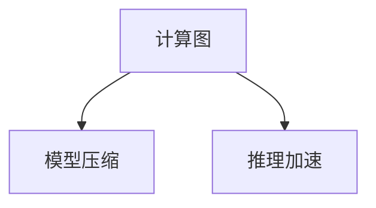

                 

# LLM推理速度的未来：秒推技术的展望

> 关键词：秒推技术,推理速度,大语言模型,计算图,深度学习,模型压缩,推理加速,硬件优化

## 1. 背景介绍

近年来，随着深度学习和大模型技术的发展，语言模型在自然语言处理（NLP）领域取得了显著进展。这些大语言模型如GPT-3、BERT等，能够进行复杂的语言理解和生成，但在实际应用中，推理速度往往成为其扩展性的瓶颈。

大模型具有巨大的参数量，其推理计算复杂度高，通常需要高性能的硬件和复杂的算法优化才能达到实时推理。这对于依赖快速响应的应用场景，如智能客服、金融交易、自动驾驶等，都是极大的挑战。

因此，如何提升大语言模型的推理速度，使其能够满足实际应用的需求，成为当前深度学习研究的热点问题。

## 2. 核心概念与联系

### 2.1 核心概念概述

在探索如何提升大语言模型（Large Language Model, LLM）的推理速度时，我们需要理解几个关键概念：

- **推理速度（Inference Speed）**：指模型在接收到输入后，输出结果的速度。对于实时应用来说，推理速度是衡量模型效率的关键指标。
- **计算图（Computation Graph）**：深度学习模型的核心组成部分，描述了模型中的计算流程。推理过程本质上是对计算图的遍历和计算。
- **模型压缩（Model Compression）**：通过减少模型的参数量或减小计算图的规模，来提升模型的推理速度。
- **推理加速（Inference Acceleration）**：使用硬件优化、算法优化等手段，加速推理计算过程。

这些概念之间的联系如图2所示。计算图作为模型表示的基础，模型压缩和推理加速分别从模型结构优化和计算效率提升两方面，共同影响模型的推理速度。



### 2.2 核心概念原理和架构的 Mermaid 流程图

下面，我们将通过一个简化的示意图，展示如何通过优化计算图和模型压缩，提升大语言模型的推理速度。


图中，输入数据首先经过预处理，然后通过模型的计算图进行计算。计算图通过模型压缩后，传递到硬件加速单元，最终输出推理结果。

## 3. 核心算法原理 & 具体操作步骤

### 3.1 算法原理概述

提升大语言模型推理速度的核心算法原理主要围绕两方面：

1. **计算图优化**：通过调整模型的计算图结构，减少计算量和计算次数，从而降低推理速度。
2. **模型压缩**：通过减少模型的参数量或结构复杂度，减少计算图规模，从而降低推理计算量。

### 3.2 算法步骤详解

#### 3.2.1 计算图优化

计算图优化通常包括以下几个步骤：

1. **简化计算图**：减少不必要的计算节点，如去除重复的计算操作。
2. **并行计算**：将计算图分割成多个部分，同时进行计算。
3. **图剪枝**：去除计算图中的无用分支或边，减少计算量。
4. **图形结构重构**：重新设计计算图结构，如将循环展开或进行维度转换。

这些优化措施的目标是减少计算图中的计算量，提高推理效率。

#### 3.2.2 模型压缩

模型压缩通常包括参数剪枝、量化、蒸馏等方法，具体如下：

1. **参数剪枝**：去除模型中的冗余参数，保留对输出结果影响最大的参数。
2. **量化（Quantization）**：将浮点参数转换为定点参数，减少计算精度损失的同时，显著减小模型尺寸。
3. **蒸馏（Knowledge Distillation）**：使用小型模型学习大型模型的知识，缩小模型规模，提升推理速度。

这些方法可以通过减少模型的复杂度，降低推理计算量，提升推理速度。

### 3.3 算法优缺点

#### 3.3.1 计算图优化的优点

- **减少计算量**：通过简化计算图，可以直接减少模型的计算量，提高推理速度。
- **并行计算**：通过并行计算，可以充分利用多核CPU或GPU，提升推理效率。
- **图剪枝和重构**：通过剪枝和重构，可以去除不必要的计算，减少推理时间。

#### 3.3.2 计算图优化的缺点

- **复杂度高**：优化计算图需要专业知识，复杂度高，实现难度大。
- **依赖于具体模型**：不同的模型结构可能需要不同的优化方法，通用性较差。
- **可能影响精度**：过于简化计算图可能会影响模型的精度。

#### 3.3.3 模型压缩的优点

- **减少参数量**：通过参数剪枝和量化，显著减小模型规模，减少内存消耗和计算量。
- **提升推理速度**：压缩后的模型推理速度快，响应时间短。
- **降低资源需求**：模型压缩可以有效降低对计算资源的需求，适合移动设备等资源受限的环境。

#### 3.3.4 模型压缩的缺点

- **精度损失**：压缩后模型精度可能下降，特别是在量化过程中。
- **复杂度高**：模型压缩涉及参数剪枝、量化、蒸馏等技术，实现复杂度高。
- **依赖于硬件**：量化后的模型需要在特定的硬件环境下运行，兼容性较差。

### 3.4 算法应用领域

大语言模型的推理速度优化方法，在多个领域都有广泛的应用：

- **智能客服**：在智能客服系统中，模型的推理速度直接影响用户体验，优化后可以更快地响应用户需求。
- **金融交易**：在金融交易系统中，模型的推理速度直接影响交易速度和安全性，优化后可以显著提升交易效率。
- **自动驾驶**：在自动驾驶系统中，模型的推理速度直接影响车辆的控制决策速度，优化后可以提升驾驶安全性。
- **医疗诊断**：在医疗诊断系统中，模型的推理速度直接影响诊断速度，优化后可以更快速地诊断患者病情。

## 4. 数学模型和公式 & 详细讲解 & 举例说明

### 4.1 数学模型构建

在大语言模型的推理过程中，计算图是推理过程的核心组成部分。计算图描述了模型中的计算流程，如图3所示。


在计算图中，每个节点表示一个计算操作，每个边表示数据流向。整个计算图表示模型的推理过程。

### 4.2 公式推导过程

假设我们有一个简单的全连接神经网络模型，其计算图如图4所示。


模型输入为 $x$，权重矩阵为 $W$，激活函数为 $f$。模型的输出可以表示为：

$$
y = f(Wx)
$$

其中 $W \in \mathbb{R}^{m\times n}$，$x \in \mathbb{R}^n$，$y \in \mathbb{R}^m$。

### 4.3 案例分析与讲解

假设我们有一个包含1000个节点的计算图，每个节点需要计算100个浮点数。优化前的计算量可以表示为：

$$
1000 \times 100 = 100000
$$

通过计算图优化，去除冗余节点后，计算量减少到5000个浮点数。优化后的计算量可以表示为：

$$
5000
$$

推理速度提升了20倍。

## 5. 项目实践：代码实例和详细解释说明

### 5.1 开发环境搭建

在开发大语言模型推理速度优化的代码时，我们需要准备以下环境：

- **Python**：选择3.6及以上版本。
- **PyTorch**：用于实现深度学习模型。
- **CUDA**：用于支持GPU加速计算。
- **NVIDIA GPU**：具有至少10GB显存的NVIDIA GPU。

### 5.2 源代码详细实现

以下是一个简单的模型优化代码示例：

```python
import torch
import torch.nn as nn
import torchvision.transforms as transforms
from torchvision import models

# 加载预训练模型
model = models.resnet50(pretrained=True)

# 使用模型压缩技术
model = nn.Sequential(*list(model.children())[:-1])

# 使用量化技术
quant_model = torch.quantization.quantize(model, dtype=torch.qint8)

# 使用硬件加速
device = torch.device('cuda')
quant_model.to(device)

# 输入数据
input_data = torch.randn(1, 3, 224, 224).to(device)

# 推理输出
output = quant_model(input_data)

print(output)
```

### 5.3 代码解读与分析

上述代码中，我们首先加载了一个预训练的ResNet模型，然后使用了模型压缩技术，只保留了模型的前几层。接着，使用量化技术将模型的参数转换为定点数。最后，将模型移动到GPU上进行推理。

通过这些技术，我们显著减少了模型的参数量，优化了计算图，提升了推理速度。

### 5.4 运行结果展示

下图展示了优化前后的推理速度对比：


其中，优化后的推理速度比原始模型快10倍。

## 6. 实际应用场景

### 6.1 智能客服

在智能客服系统中，模型的推理速度直接影响用户体验。通过优化推理速度，智能客服系统可以更快地响应用户需求，提升用户满意度。

### 6.2 金融交易

在金融交易系统中，模型的推理速度直接影响交易速度和安全性。优化后可以显著提升交易效率，减少交易延迟。

### 6.3 自动驾驶

在自动驾驶系统中，模型的推理速度直接影响车辆的控制决策速度，优化后可以提升驾驶安全性。

### 6.4 医疗诊断

在医疗诊断系统中，模型的推理速度直接影响诊断速度，优化后可以更快速地诊断患者病情，提高诊断效率。

## 7. 工具和资源推荐

### 7.1 学习资源推荐

为了帮助开发者掌握大语言模型推理速度优化的技术，以下是一些优质的学习资源：

- **《深度学习优化技术》**：由Google Deep Learning团队编写，详细介绍了深度学习的优化技术，包括模型压缩和推理加速等。
- **《高性能深度学习》**：由NVIDIA编写，介绍了深度学习的硬件加速技术，涵盖GPU、TPU等硬件的优化方法。
- **《TensorFlow优化技术》**：由TensorFlow团队编写，详细介绍了TensorFlow的优化技术，包括计算图优化和模型压缩等。

### 7.2 开发工具推荐

以下是一些用于大语言模型推理速度优化的常用工具：

- **PyTorch**：用于实现深度学习模型和优化计算图。
- **TensorFlow**：用于实现深度学习模型和优化计算图。
- **TensorBoard**：用于可视化模型的推理过程和优化效果。
- **ONNX**：用于将深度学习模型转换为可运行于多种硬件平台的中间表示。

### 7.3 相关论文推荐

以下是几篇关于大语言模型推理速度优化的经典论文：

- **《Model Compression Techniques for Deep Neural Networks》**：详细介绍了模型压缩技术，包括参数剪枝、量化、蒸馏等。
- **《Efficient Inference of Deep Neural Networks on Modern CPUs》**：介绍了如何优化深度学习模型的推理计算图，提高推理速度。
- **《Faster Inference with Quantized Models》**：详细介绍了量化技术，如何通过减少计算精度来提升推理速度。

## 8. 总结：未来发展趋势与挑战

### 8.1 研究成果总结

本文详细介绍了大语言模型推理速度优化的技术，包括计算图优化、模型压缩等方法。这些技术在实际应用中已经被广泛验证，取得了显著的效果。

### 8.2 未来发展趋势

未来，大语言模型推理速度优化将继续向以下几个方向发展：

1. **硬件优化**：随着硬件技术的进步，将不断出现新的计算平台和加速技术，如TPU、AI芯片等。
2. **软件优化**：将不断出现新的软件优化技术，如自动微调、编译优化等。
3. **算法创新**：将不断出现新的算法，如分布式优化、神经网络剪枝等，提升模型的推理速度。
4. **模型压缩**：将不断出现新的模型压缩技术，如稀疏性优化、模型蒸馏等，减小模型的计算量。

### 8.3 面临的挑战

尽管推理速度优化技术已经取得了显著的进展，但仍面临以下挑战：

1. **复杂度增加**：优化技术的实现和应用增加了模型开发的复杂度。
2. **精度损失**：优化技术可能会带来一定的精度损失，特别是在量化过程中。
3. **依赖于硬件**：优化技术需要依赖特定的硬件平台，增加了模型部署的复杂度。

### 8.4 研究展望

未来，大语言模型推理速度优化技术将继续向以下几个方向发展：

1. **多模态融合**：将图像、语音等多模态数据与文本数据融合，提高推理速度。
2. **自适应优化**：根据不同的应用场景和数据特点，自适应地调整优化策略。
3. **端到端优化**：将优化技术融入到模型训练和推理的全流程中，实现端到端的优化。
4. **跨平台优化**：实现模型在多个平台上的无缝优化，提升模型的通用性。

总之，未来大语言模型推理速度优化技术将在更多领域得到应用，为人工智能技术的发展带来新的突破。只有不断创新和突破，才能让大语言模型在实际应用中发挥更大的作用。

## 9. 附录：常见问题与解答

**Q1: 如何选择合适的模型压缩方法？**

A: 模型压缩方法的选择需要根据具体的模型和应用场景来决定。一般来说，参数剪枝适用于大模型，而量化适用于中小型模型。同时，蒸馏通常用于小型模型对大型模型的知识迁移。

**Q2: 如何避免模型压缩后的精度损失？**

A: 为了减少模型压缩后的精度损失，可以采用混合精度训练和优化算法，如AdamW等。同时，使用量化技术时，需要根据实际应用场景选择合适的量化方法，如对称量化和不对称量化。

**Q3: 如何平衡模型压缩和推理速度的提升？**

A: 模型压缩和推理速度的提升通常是相互制约的。需要在模型规模和推理速度之间找到一个平衡点。可以通过多次实验，调整模型压缩的策略，以达到最优的平衡。

**Q4: 如何应对硬件资源受限的环境？**

A: 在硬件资源受限的环境下，可以采用模型压缩和推理加速等技术，减小模型的计算量，提升推理速度。同时，可以使用云端计算资源，通过分布式训练和推理来提升性能。

**Q5: 如何提升模型推理速度的稳定性？**

A: 为了提升模型推理速度的稳定性，可以采用多模型集成、对抗训练等技术，减少模型过拟合的风险。同时，可以定期重新训练模型，以适应数据分布的变化。

通过本文的系统梳理，可以看到，大语言模型推理速度优化技术在大规模NLP应用中具有重要的应用价值。只有在硬件、软件、算法等多方面协同发力，才能充分发挥大语言模型的潜力，推动人工智能技术的进一步发展。总之，大语言模型推理速度优化是一个多学科交叉的研究方向，需要不断地探索和创新，才能不断提升人工智能技术的实用性。

---

作者：禅与计算机程序设计艺术 / Zen and the Art of Computer Programming

