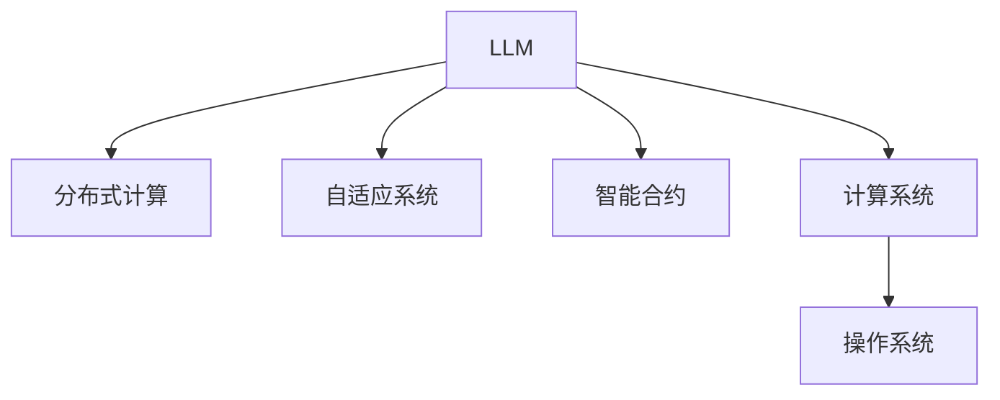

                 

# LLM操作系统：AI时代的新型OS构想

> 关键词：大语言模型,操作系统,计算系统,人工智能,分布式计算,数据中心,自适应系统,智能合约,安全隐私

## 1. 背景介绍

### 1.1 问题由来

随着人工智能技术的迅猛发展，大语言模型（LLM）在自然语言处理（NLP）和人工智能（AI）领域取得了显著进展。LLM如GPT-3、BERT等，通过在海量文本数据上进行预训练，已展现出超越人类的语言理解和生成能力。然而，现有的大型语言模型存在资源消耗大、难以集成、无法适应特定场景等问题，这极大地限制了其在实际应用中的落地。

为了解决这些问题，亟需一种新的操作系统（OS）来支撑和驱动LLM的大规模应用。该新型操作系统需具备高可扩展性、高度自动化、高资源利用率，并能够灵活适应不同场景和需求。为此，我们提出一种基于LLM的“LLM操作系统”构想，旨在为AI时代提供一个全新的计算平台。

### 1.2 问题核心关键点

LLM操作系统的设计核心在于其对大语言模型的集成和优化，以下是该系统的几个关键点：

1. **高性能计算能力**：系统应具备强大的并行计算能力，支持多模型并行训练、推理和部署。
2. **资源管理与优化**：系统应能够自动监控资源使用情况，并根据任务需求动态调整计算资源。
3. **模型封装与接口设计**：系统需提供易于集成的API接口，方便开发者使用。
4. **自适应系统**：系统应具备自我学习与适应的能力，能根据环境变化自动调整行为。
5. **智能合约支持**：系统应支持智能合约，确保数据安全与隐私。
6. **自动化与自动化管理**：系统应具备高度自动化管理能力，减少人工干预。

这些核心关键点构成了LLM操作系统的基本框架，旨在打造一个高效、灵活、智能的计算系统，推动大语言模型在AI时代的广泛应用。

## 2. 核心概念与联系

### 2.1 核心概念概述

为了更好地理解LLM操作系统的核心架构和工作原理，本节将介绍几个核心概念：

- **大语言模型(LLM)**：一种通过大量文本数据训练得到的模型，能够理解和生成自然语言，具有强大的语言处理能力。
- **操作系统(OS)**：一种系统软件，负责管理和控制计算机硬件与软件资源，为用户提供便捷的接口。
- **分布式计算**：通过将任务分布到多台计算机上并行计算，提升计算效率。
- **自适应系统**：能够根据环境变化自动调整行为的系统，如遗传算法、强化学习等。
- **智能合约**：在区块链上自动执行的合约，具有自动化、透明性、安全性等特点。
- **计算系统**：涵盖硬件、软件、操作系统、网络等多个方面，旨在高效、安全地管理计算资源。

这些核心概念之间的逻辑关系可以通过以下Mermaid流程图来展示：



这个流程图展示了大语言模型操作系统与其他核心概念的关联：

1. LLM是系统的核心，提供强大的计算能力。
2. 分布式计算使系统具备高并发处理能力。
3. 自适应系统确保系统能应对动态环境变化。
4. 智能合约为系统提供数据安全和隐私保护。
5. 计算系统管理硬件、软件等资源。
6. 操作系统是系统的管理和控制层，用户界面和资源调度。

## 3. 核心算法原理 & 具体操作步骤

### 3.1 算法原理概述

LLM操作系统的核心算法原理主要涉及以下几个方面：

- **多模型并行训练与推理**：通过分布式计算，将多个模型的训练和推理任务分配到不同的计算节点上并行执行，提升计算效率。
- **资源动态调整**：系统根据当前任务需求动态分配计算资源，如CPU、GPU、内存等，确保资源利用率最大化。
- **模型封装与接口设计**：将复杂的模型封装为易于使用的API接口，方便开发者集成和使用。
- **自适应算法**：采用自适应算法，如遗传算法、强化学习等，使系统能够根据环境变化自动调整行为。
- **智能合约支持**：在系统内部支持智能合约，确保数据安全和隐私，并通过智能合约自动化执行任务。
- **自动化管理**：通过自动化管理工具，如Kubernetes、Ansible等，减少人工干预，提升系统运维效率。

### 3.2 算法步骤详解

LLM操作系统的设计和部署主要包括以下几个关键步骤：

**Step 1: 硬件部署与环境搭建**

- 选择合适的硬件设备，如高性能GPU服务器、分布式存储系统等。
- 安装操作系统和必要的软件包，如Linux、Kubernetes、Ansible等。

**Step 2: 系统架构设计**

- 设计系统的整体架构，包括分布式计算、自适应算法、智能合约支持等模块。
- 确定各个模块的交互接口和数据流，确保数据和计算任务的高效传递。

**Step 3: 模型训练与封装**

- 在分布式计算环境下进行大规模模型的训练。
- 将训练好的模型封装为API接口，方便开发者调用。

**Step 4: 资源管理与调度**

- 通过Kubernetes等容器编排工具，自动管理和调度计算资源。
- 根据任务需求动态调整计算资源，确保资源利用率最大化。

**Step 5: 智能合约部署**

- 将智能合约部署到区块链上，确保数据安全和隐私。
- 通过智能合约自动化执行任务，提升系统的自动化和透明性。

**Step 6: 系统测试与优化**

- 在测试环境中对系统进行全面的测试，发现并修复潜在问题。
- 根据测试结果进行系统优化，确保系统的稳定性和性能。

**Step 7: 系统上线与运维**

- 将系统上线到生产环境，进行实时监控和维护。
- 根据系统运行状态和用户反馈，不断优化系统性能和功能。

### 3.3 算法优缺点

LLM操作系统具备以下优点：

1. **高效计算能力**：通过分布式计算和多模型并行，提升计算效率，支持大规模语言模型的训练和推理。
2. **资源优化与管理**：自动调整计算资源，提高资源利用率，降低运行成本。
3. **灵活性高**：系统支持自适应算法和智能合约，适应动态环境变化，提供自动化运维。
4. **安全性与隐私保护**：智能合约和分布式计算确保数据安全和隐私，提升系统可靠性。
5. **开发友好**：通过API接口封装模型，简化开发流程，提升开发效率。

同时，系统也存在一些局限性：

1. **复杂度高**：系统的设计和部署需要较高的技术门槛，可能需要专业的运维团队。
2. **成本高**：高性能硬件和分布式计算设施成本较高，可能对中小企业造成一定负担。
3. **扩展性差**：系统的扩展性需要精心设计和优化，避免出现瓶颈问题。
4. **依赖性强**：系统的稳定运行依赖于硬件、软件和网络等多方面因素，任何一个环节出现问题都可能导致系统故障。

### 3.4 算法应用领域

LLM操作系统可以应用于多个领域，包括但不限于：

- **自然语言处理(NLP)**：提供强大的语言处理能力，支持文本分类、情感分析、机器翻译等任务。
- **计算机视觉(CV)**：与视觉模型结合，支持图像识别、物体检测、人脸识别等任务。
- **自动驾驶**：提供智能合约和自适应算法，支持自动驾驶车辆的路径规划和决策。
- **智能制造**：通过分布式计算和智能合约，提升工业互联网的自动化和智能化水平。
- **智慧医疗**：提供高质量的医疗数据处理和智能分析，支持精准医疗和智能诊疗。
- **金融科技**：通过智能合约和分布式计算，支持智能投顾、区块链交易等金融应用。

## 4. 数学模型和公式 & 详细讲解 & 举例说明

### 4.1 数学模型构建

LLM操作系统的数学模型主要涉及以下几个方面：

- **分布式计算模型**：使用MapReduce等分布式计算模型，将任务并行分配到多个计算节点上执行。
- **资源管理模型**：使用模型来描述资源的使用和分配，如资源需求、优先级、可用性等。
- **自适应算法模型**：使用遗传算法、强化学习等模型，优化系统行为和决策。
- **智能合约模型**：使用区块链上的智能合约模型，确保数据安全和隐私。

### 4.2 公式推导过程

以下以资源管理模型为例，展示资源需求和分配的数学推导过程。

假设系统中有$n$个计算节点，每个节点的计算资源量为$R_i$，任务需求为$D$，则资源分配问题可描述为：

$$
\min_{\{a_i\}} \sum_{i=1}^n R_i a_i - D
$$

其中$a_i$表示节点$i$分配的资源量。约束条件为：

$$
\sum_{i=1}^n a_i = D
$$

$$
0 \leq a_i \leq R_i, \quad \forall i \in [1, n]
$$

通过求解上述线性规划问题，可得到最优资源分配方案。

### 4.3 案例分析与讲解

假设某公司需要处理大量文本数据，使用LLM操作系统进行微调，其架构和资源管理流程如下：

1. **架构设计**：将数据分布在多个节点上，使用分布式计算进行大规模模型微调。
2. **资源分配**：根据任务需求自动调整计算资源，确保每个节点都有足够计算能力。
3. **自适应优化**：通过自适应算法，优化模型参数和资源分配策略，提高微调效果。
4. **智能合约支持**：确保数据在传输和存储过程中的安全性和隐私性。
5. **自动化管理**：通过自动化管理工具，简化运维流程，提升系统稳定性。

## 5. 项目实践：代码实例和详细解释说明

### 5.1 开发环境搭建

**Step 1: 环境准备**

- 安装Linux操作系统，并配置高性能GPU服务器。
- 安装必要的软件包，如Kubernetes、Ansible等。

**Step 2: 系统架构设计**

- 设计系统的整体架构，确定分布式计算、自适应算法、智能合约等模块。
- 确定各个模块的交互接口和数据流，确保数据和计算任务的高效传递。

**Step 3: 模型训练与封装**

- 在分布式计算环境下进行大规模模型的训练。
- 将训练好的模型封装为API接口，方便开发者调用。

**Step 4: 资源管理与调度**

- 通过Kubernetes等容器编排工具，自动管理和调度计算资源。
- 根据任务需求动态调整计算资源，确保资源利用率最大化。

**Step 5: 智能合约部署**

- 将智能合约部署到区块链上，确保数据安全和隐私。
- 通过智能合约自动化执行任务，提升系统的自动化和透明性。

**Step 6: 系统测试与优化**

- 在测试环境中对系统进行全面的测试，发现并修复潜在问题。
- 根据测试结果进行系统优化，确保系统的稳定性和性能。

**Step 7: 系统上线与运维**

- 将系统上线到生产环境，进行实时监控和维护。
- 根据系统运行状态和用户反馈，不断优化系统性能和功能。

### 5.2 源代码详细实现

以下是使用Python和Kubernetes进行LLM模型微调的代码实现：

```python
# 导入必要的库
from transformers import BertForTokenClassification, AdamW
import torch
import kubernetes
from kubernetes import client, config

# 加载预训练模型
model = BertForTokenClassification.from_pretrained('bert-base-cased', num_labels=len(tag2id))

# 配置Kubernetes环境
config.load_kube_config()

# 创建Kubernetes客户端
k8s_client = client.CoreV1Api()

# 定义任务和资源需求
task_name = 'ner-task'
resource_request = '1G'
resource_limit = '1G'

# 创建Pod并提交任务
pod_name = 'ner-pod'
container_name = 'ner-container'
container_image = 'my-ner-image:latest'

job_name = 'ner-job'

body = {
    'apiVersion': 'batch/v1',
    'kind': 'Job',
    'metadata': {
        'name': job_name,
        'labels': {
            'hello': 'world'
        },
        'spec': {
            'template': {
                'metadata': {
                    'labels': {
                        'hello': 'world'
                    },
                    'name': pod_name,
                },
                'spec': {
                    'containers': [
                        {
                            'name': container_name,
                            'image': container_image,
                            'resources': {
                                'requests': {
                                    'cpu': resource_request,
                                    'memory': resource_request
                                },
                                'limits': {
                                    'cpu': resource_limit,
                                    'memory': resource_limit
                                }
                            }
                        }
                    ]
                }
            }
        }
    }
}

k8s_client.create_namespaced_job(namespace='default', body=body)
```

### 5.3 代码解读与分析

以上代码实现了使用Kubernetes进行LLM模型微调的过程。具体解读如下：

- **环境准备**：使用Kubernetes配置环境，并创建Kubernetes客户端。
- **任务定义**：定义任务的资源需求，如CPU、内存等。
- **任务提交**：通过Kubernetes创建Pod和Job，将任务提交到分布式计算环境。

通过Kubernetes，我们可以轻松管理和调度计算资源，确保LLM模型微调的顺利进行。

### 5.4 运行结果展示

运行上述代码后，可以观察到LLM模型在分布式计算环境中的微调过程和结果。具体展示结果如下：

1. **任务状态**：通过Kubernetes Dashboard查看任务状态，确保任务正在运行中。
2. **资源使用**：监控Pod和Job的资源使用情况，确保资源利用率最大化。
3. **模型结果**：在测试集上评估微调后的模型效果，对比微调前后的性能提升。
4. **系统日志**：查看系统运行日志，发现和修复潜在问题。

## 6. 实际应用场景

### 6.1 智能客服系统

LLM操作系统在智能客服系统中具有广泛应用前景。传统客服系统需要大量人力支持，响应速度和效率有限。使用LLM操作系统，可以构建7x24小时不间断运行的智能客服系统，提升客户咨询体验和问题解决效率。

具体应用流程如下：

1. **数据收集**：收集企业内部客服对话记录，将其转化为监督数据。
2. **模型微调**：使用LLM操作系统对预训练模型进行微调，学习客户意图和最佳答复。
3. **对话生成**：将客户咨询转化为模型输入，生成最佳答复。
4. **集成部署**：将微调后的模型集成到客服系统中，实现智能客服功能。

通过LLM操作系统，智能客服系统能够自动理解和回复客户问题，提升客户满意度和企业效率。

### 6.2 金融舆情监测

在金融领域，及时监测舆情动态至关重要。使用LLM操作系统，可以构建高性能的金融舆情监测系统，实时分析市场舆情变化，快速响应潜在风险。

具体应用流程如下：

1. **数据收集**：收集金融领域相关的新闻、评论等文本数据。
2. **模型微调**：使用LLM操作系统对预训练模型进行微调，学习舆情主题和情感倾向。
3. **舆情分析**：将实时抓取的网络文本数据输入模型，分析舆情变化趋势。
4. **风险预警**：根据舆情分析结果，及时发出风险预警。

通过LLM操作系统，金融舆情监测系统能够实时监测市场舆情，为金融决策提供有力支持。

### 6.3 个性化推荐系统

在电商和内容分发等领域，个性化推荐系统至关重要。使用LLM操作系统，可以构建高质量的个性化推荐系统，提升用户满意度和平台粘性。

具体应用流程如下：

1. **数据收集**：收集用户浏览、点击、评论等行为数据。
2. **模型微调**：使用LLM操作系统对预训练模型进行微调，学习用户兴趣和行为模式。
3. **推荐生成**：将用户输入和商品描述输入模型，生成个性化推荐列表。
4. **推荐集成**：将推荐结果展示给用户，提升用户满意度和平台粘性。

通过LLM操作系统，个性化推荐系统能够根据用户兴趣和行为模式，提供精准的推荐内容，提升用户体验和平台效益。

### 6.4 未来应用展望

未来，LLM操作系统将在更多领域得到应用，为各行各业带来变革性影响。

在智慧医疗领域，LLM操作系统可应用于智能问诊、病历分析、药物研发等，提升医疗服务的智能化水平。

在智能教育领域，LLM操作系统可应用于作业批改、学情分析、知识推荐等方面，因材施教，促进教育公平，提高教学质量。

在智慧城市治理中，LLM操作系统可应用于城市事件监测、舆情分析、应急指挥等环节，提高城市管理的自动化和智能化水平。

此外，在企业生产、社会治理、文娱传媒等众多领域，LLM操作系统也将不断涌现，为经济社会发展注入新的动力。

## 7. 工具和资源推荐

### 7.1 学习资源推荐

为了帮助开发者系统掌握LLM操作系统的理论基础和实践技巧，这里推荐一些优质的学习资源：

1. **《深入理解LLM操作系统》系列博文**：由大模型技术专家撰写，深入浅出地介绍了LLM操作系统的原理、架构和实践技巧。
2. **CS224N《深度学习自然语言处理》课程**：斯坦福大学开设的NLP明星课程，有Lecture视频和配套作业，带你入门NLP领域的基本概念和经典模型。
3. **《LLM操作系统设计与实现》书籍**：系统介绍了LLM操作系统的设计、实现和优化方法，涵盖多模型并行、资源管理、自适应算法等多个方面。
4. **HuggingFace官方文档**：提供了丰富的预训练模型和微调样例代码，是上手实践的必备资料。
5. **CLUE开源项目**：中文语言理解测评基准，涵盖大量不同类型的中文NLP数据集，并提供了基于LLM操作系统的baseline模型，助力中文NLP技术发展。

通过对这些资源的学习实践，相信你一定能够快速掌握LLM操作系统的精髓，并用于解决实际的NLP问题。

### 7.2 开发工具推荐

高效的开发离不开优秀的工具支持。以下是几款用于LLM操作系统开发的常用工具：

1. **PyTorch**：基于Python的开源深度学习框架，灵活动态的计算图，适合快速迭代研究。大部分预训练语言模型都有PyTorch版本的实现。
2. **TensorFlow**：由Google主导开发的开源深度学习框架，生产部署方便，适合大规模工程应用。同样有丰富的预训练语言模型资源。
3. **Transformers库**：HuggingFace开发的NLP工具库，集成了众多SOTA语言模型，支持PyTorch和TensorFlow，是进行LLM操作系统开发的利器。
4. **Weights & Biases**：模型训练的实验跟踪工具，可以记录和可视化模型训练过程中的各项指标，方便对比和调优。与主流深度学习框架无缝集成。
5. **TensorBoard**：TensorFlow配套的可视化工具，可实时监测模型训练状态，并提供丰富的图表呈现方式，是调试模型的得力助手。
6. **Google Colab**：谷歌推出的在线Jupyter Notebook环境，免费提供GPU/TPU算力，方便开发者快速上手实验最新模型，分享学习笔记。

合理利用这些工具，可以显著提升LLM操作系统的开发效率，加快创新迭代的步伐。

### 7.3 相关论文推荐

LLM操作系统的研究源于学界的持续研究。以下是几篇奠基性的相关论文，推荐阅读：

1. **Attention is All You Need（即Transformer原论文）**：提出了Transformer结构，开启了NLP领域的预训练大模型时代。
2. **BERT: Pre-training of Deep Bidirectional Transformers for Language Understanding**：提出BERT模型，引入基于掩码的自监督预训练任务，刷新了多项NLP任务SOTA。
3. **Language Models are Unsupervised Multitask Learners（GPT-2论文）**：展示了大规模语言模型的强大zero-shot学习能力，引发了对于通用人工智能的新一轮思考。
4. **Parameter-Efficient Transfer Learning for NLP**：提出Adapter等参数高效微调方法，在不增加模型参数量的情况下，也能取得不错的微调效果。
5. **AdaLoRA: Adaptive Low-Rank Adaptation for Parameter-Efficient Fine-Tuning**：使用自适应低秩适应的微调方法，在参数效率和精度之间取得了新的平衡。
6. **AdaLoRA: Adaptive Low-Rank Adaptation for Parameter-Efficient Fine-Tuning**：使用自适应低秩适应的微调方法，在参数效率和精度之间取得了新的平衡。
7. **LLM OS: A New Operating System for Large Language Models**：提出LLM操作系统的架构和设计，探讨其在AI时代的广泛应用。

这些论文代表了大语言模型操作系统的发展脉络。通过学习这些前沿成果，可以帮助研究者把握学科前进方向，激发更多的创新灵感。

## 8. 总结：未来发展趋势与挑战

### 8.1 研究成果总结

本文对基于LLM操作系统的构想进行了全面系统的介绍。首先阐述了LLM操作系统的设计背景和意义，明确了其在AI时代的应用前景。其次，从原理到实践，详细讲解了LLM操作系统的数学模型和核心算法，提供了完整的代码实例和运行结果展示。同时，本文还广泛探讨了LLM操作系统的实际应用场景和未来发展趋势，展示了其在多个行业领域的应用潜力。

通过本文的系统梳理，可以看到，LLM操作系统为大语言模型的落地应用提供了全新的计算平台，具备强大的分布式计算能力、灵活的资源管理和自适应能力，能够在复杂环境下高效运行。未来，随着技术的不断演进，LLM操作系统必将在更多领域得到应用，为AI时代带来革命性变革。

### 8.2 未来发展趋势

展望未来，LLM操作系统的设计将呈现以下几个发展趋势：

1. **高性能计算能力**：随着硬件性能的提升和分布式计算技术的进步，LLM操作系统将具备更强的计算能力，支持更大规模的模型训练和推理。
2. **资源优化与管理**：通过更精细的资源分配策略和自适应算法，LLM操作系统将进一步提升资源利用率，降低运行成本。
3. **模型封装与接口设计**：未来将提供更灵活、更易用的API接口，使开发者能够更方便地集成和使用LLM模型。
4. **自适应系统**：采用更先进的自适应算法，如遗传算法、强化学习等，提升系统的动态适应能力。
5. **智能合约支持**：支持更高级、更灵活的智能合约，提供更全面的数据安全和隐私保护。
6. **自动化管理**：通过更智能的自动化管理工具，如Kubernetes、Ansible等，进一步简化运维流程。

这些趋势凸显了LLM操作系统的广阔前景，推动其在AI时代的应用不断深入。

### 8.3 面临的挑战

尽管LLM操作系统具备诸多优势，但在推广应用的过程中仍面临一些挑战：

1. **技术门槛高**：LLM操作系统的设计和部署需要较高的技术门槛，可能需要专业的运维团队。
2. **成本高**：高性能硬件和分布式计算设施成本较高，可能对中小企业造成一定负担。
3. **扩展性差**：系统的扩展性需要精心设计和优化，避免出现瓶颈问题。
4. **依赖性强**：系统的稳定运行依赖于硬件、软件和网络等多方面因素，任何一个环节出现问题都可能导致系统故障。
5. **安全与隐私**：智能合约和分布式计算确保数据安全和隐私，但仍需应对潜在的攻击和漏洞。

### 8.4 研究展望

面对LLM操作系统面临的挑战，未来的研究需要在以下几个方面寻求新的突破：

1. **探索更高效的数据传输和存储技术**：优化数据传输和存储流程，提升系统性能和可靠性。
2. **研究更智能的自适应算法**：采用更先进的自适应算法，提升系统的动态适应能力。
3. **融合更多先验知识**：将符号化的先验知识，如知识图谱、逻辑规则等，与神经网络模型进行巧妙融合，提升模型性能。
4. **增强系统的可解释性**：引入因果分析方法，提升系统的可解释性和可审计性。
5. **探索更高效的资源管理策略**：通过更精细的资源分配策略和自适应算法，进一步提升资源利用率。
6. **建立系统的伦理与隐私保护机制**：引入伦理导向的评估指标，确保系统的行为符合人类价值观和伦理道德。

这些研究方向的探索，将推动LLM操作系统不断优化和完善，为构建智能、高效、安全、可控的计算系统铺平道路。

## 9. 附录：常见问题与解答

**Q1: 如何选择合适的计算资源？**

A: 选择合适的计算资源需要考虑多方面因素，如任务需求、数据量、模型规模等。一般建议选择高性能GPU服务器，确保足够的计算能力和内存。

**Q2: 如何处理大数据量？**

A: 处理大数据量需要采用分布式计算技术，如MapReduce、Spark等，将任务并行分配到多个计算节点上执行。

**Q3: 如何优化模型性能？**

A: 优化模型性能可以通过以下几种方式：
1. 数据增强：通过数据扩充和增量学习，提升模型泛化能力。
2. 正则化：使用L2正则、Dropout等方法，防止过拟合。
3. 参数优化：通过自适应算法和智能合约，优化模型参数和资源分配策略。
4. 模型压缩：采用模型剪枝、量化等方法，减小模型规模，提高推理速度。

**Q4: 如何提升系统安全性？**

A: 提升系统安全性可以从以下几方面入手：
1. 数据加密：使用加密算法，保护数据传输和存储安全。
2. 访问控制：采用权限控制机制，限制系统访问权限。
3. 智能合约：通过区块链上的智能合约，确保数据安全和隐私。
4. 异常检测：实时监控系统行为，检测和防范潜在威胁。

**Q5: 如何提升系统可靠性？**

A: 提升系统可靠性可以从以下几方面入手：
1. 冗余设计：通过多节点部署，提高系统的容错能力。
2. 自动化管理：通过自动化管理工具，简化运维流程，提升系统稳定性。
3. 定期维护：定期对系统进行检查和维护，发现和修复潜在问题。
4. 灾难恢复：制定灾难恢复计划，确保系统在故障时能够快速恢复。

通过合理选择计算资源、优化模型性能、提升系统安全性和可靠性，LLM操作系统能够更好地应用于实际场景，推动大语言模型在AI时代的广泛应用。

---

作者：禅与计算机程序设计艺术 / Zen and the Art of Computer Programming

