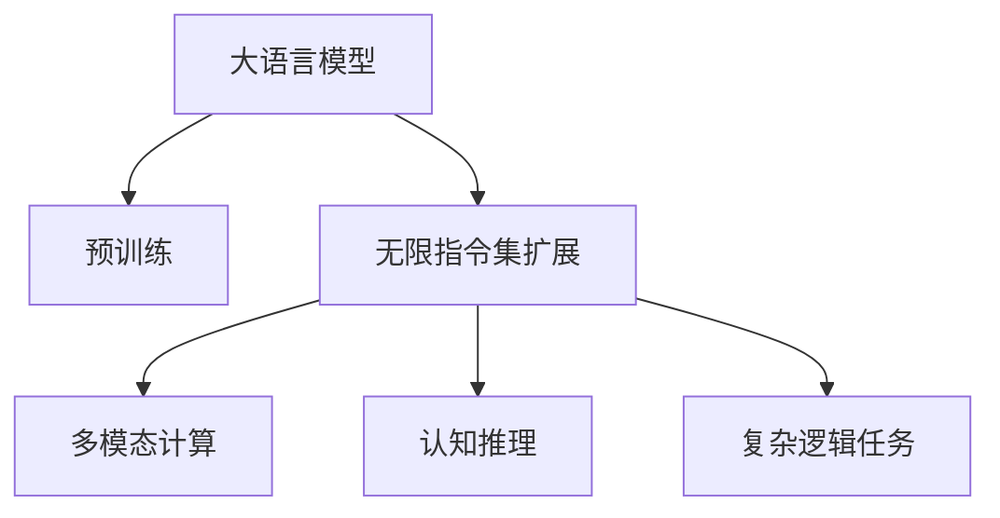
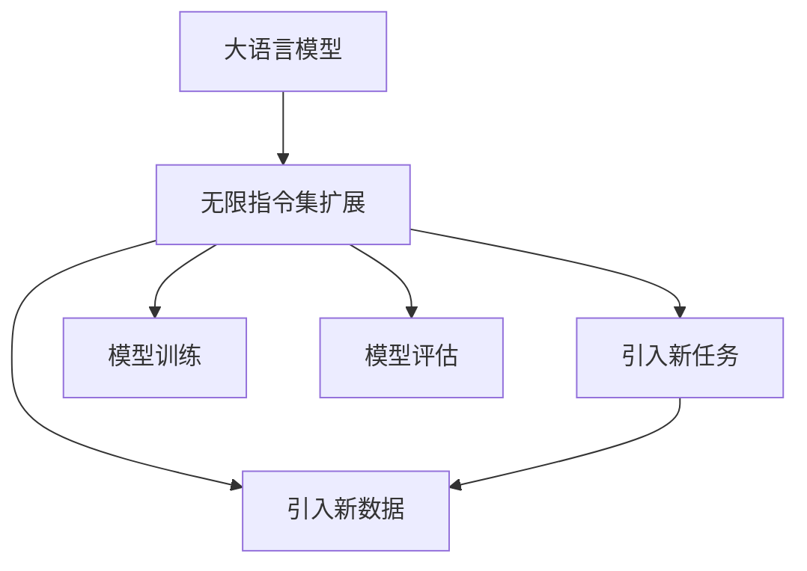

                 

## 1. 背景介绍

### 1.1 问题由来
近年来，大语言模型（Large Language Models，简称LLM）在自然语言处理（Natural Language Processing，简称NLP）领域取得了突破性的进展。基于Transformer架构的模型如GPT、BERT等，在预训练语料上进行自监督学习，通过亿级别的参数量，学习到了丰富的语言知识和常识，实现了从语言模型到通用智能模型的跨越。

然而，当前的大模型往往局限于在预训练阶段所接触到的知识，并且难以灵活应对非预见性的输入和任务，这在很大程度上限制了其作为智能助手、AI顾问、生成器等角色的表现。为了让LLM能够更灵活地处理各种复杂的指令，并打破传统计算模型的限制，研究人员提出了无限指令集（Infinity Instruction Set）的概念。

### 1.2 问题核心关键点
无限指令集的核心思想是将大语言模型进行进一步的迭代和扩展，使其能够应对更广泛的输入和任务。具体来说，通过在预训练阶段引入新的训练数据和任务，不断扩展模型的知识库和能力，从而实现“无限”的扩展能力。这种能力不仅限于NLP领域，还包括多模态计算、认知推理、复杂逻辑任务等方面，使得LLM在各种实际应用场景中都能发挥其巨大的潜力。

### 1.3 问题研究意义
无限指令集的研究不仅能够提升LLM的性能和适用范围，还能推动NLP技术的进一步发展，为智能系统的构建提供新的思路和方法。同时，这种技术也能够应用于更广泛的领域，如智能推荐系统、聊天机器人、自动化系统等，为各行各业带来智能化升级。

## 2. 核心概念与联系

### 2.1 核心概念概述

为了更好地理解无限指令集，我们首先需要明确几个核心概念：

- **大语言模型（LLM）**：以自回归或自编码模型为代表的深度学习模型，通过在大规模无标签文本语料上进行预训练，学习通用的语言表示，具备强大的语言理解和生成能力。

- **预训练（Pre-training）**：指在大规模无标签文本语料上，通过自监督学习任务训练通用语言模型的过程。常见的预训练任务包括言语建模、遮挡语言模型等。

- **无限指令集（Infinity Instruction Set）**：一种新的模型扩展方法，通过不断引入新的训练数据和任务，使大语言模型能够应对更广泛的输入和任务，实现知识库和能力的无限扩展。

- **多模态计算（Multimodal Computation）**：指结合文本、图像、音频等多模态数据进行计算，提高模型的表现力和适应性。

- **认知推理（Cognitive Reasoning）**：指通过逻辑推理、推理机制、因果分析等认知过程，提升模型的理解和判断能力。

- **复杂逻辑任务（Complex Logical Tasks）**：指需要深度逻辑推理和判断的任务，如数学证明、编程、游戏策略等。

这些核心概念之间的逻辑关系可以通过以下Mermaid流程图来展示：



### 2.2 核心概念原理和架构的 Mermaid 流程图

由于篇幅限制，这里只展示无限指令集扩展的流程图：



## 3. 核心算法原理 & 具体操作步骤

### 3.1 算法原理概述

无限指令集扩展的本质是一种迁移学习（Transfer Learning）的过程。通过在预训练模型基础上，引入新的训练数据和任务，模型可以逐步扩展其知识库和能力，从而适应更广泛的输入和任务。这种扩展过程通常分为两个阶段：

1. **引入新任务**：收集与现有任务不同的新任务，将其转化为模型的训练样本。
2. **模型扩展与训练**：在已有模型的基础上，使用新任务的训练数据进行微调，扩展模型的知识库和能力。

### 3.2 算法步骤详解

#### 3.2.1 数据准备

1. **收集新任务**：收集与现有任务不同的新任务，如自然语言推理、问答、多模态计算、复杂逻辑任务等。
2. **数据预处理**：对收集到的新任务进行预处理，包括文本清洗、分词、标注等，以适应模型的输入格式。

#### 3.2.2 模型微调

1. **选择微调层**：根据新任务的特点，选择适合进行微调的模型层。通常包括顶部的分类层、解码层或整个模型。
2. **设置微调超参数**：包括学习率、批大小、迭代轮数等，确保微调过程高效且稳定。
3. **模型微调**：使用新任务的训练数据对模型进行微调，更新模型的参数，使其能够适应新任务。

#### 3.2.3 模型评估

1. **评估指标**：定义适合新任务的评估指标，如准确率、F1分数、逻辑推理能力等。
2. **模型评估**：在新任务的测试集上评估微调后的模型，确保其在新任务上的表现良好。

#### 3.2.4 模型部署

1. **模型优化**：根据评估结果进行模型优化，进一步调整模型参数和结构。
2. **模型部署**：将优化后的模型部署到实际应用场景中，进行实时推理和响应。

### 3.3 算法优缺点

#### 3.3.1 优点

1. **泛化能力**：无限指令集扩展使模型能够应对更广泛的输入和任务，提高模型的泛化能力。
2. **高效学习**：通过引入新任务和新数据，模型能够快速学习并适应新场景，提高模型的效率。
3. **灵活应用**：模型可以应用于各种实际场景，如智能助手、聊天机器人、自动化系统等。

#### 3.3.2 缺点

1. **资源消耗**：无限指令集扩展需要大量的计算资源和时间，可能带来较高的成本。
2. **过拟合风险**：模型在不断扩展过程中，可能出现过拟合现象，导致在新任务上的表现下降。
3. **数据依赖**：新任务和新数据的质量直接影响模型的性能，高质量数据的获取可能具有挑战性。

### 3.4 算法应用领域

无限指令集扩展在多个领域都有广泛的应用：

- **智能助手**：通过不断引入新任务和新数据，智能助手能够更好地理解用户的意图和需求，提供更加个性化和智能的服务。
- **聊天机器人**：通过引入自然语言推理、对话生成等任务，使聊天机器人能够更好地理解和生成人类语言，提高其交互体验。
- **自动化系统**：在工业生产、科学研究、医疗等领域，无限指令集扩展能够使自动化系统具备更强的逻辑推理和决策能力。
- **复杂逻辑任务**：如编程、游戏策略、数学证明等，通过引入复杂逻辑任务，使模型能够更好地理解和执行高难度任务。

## 4. 数学模型和公式 & 详细讲解 & 举例说明

### 4.1 数学模型构建

假设现有的大语言模型为 $M_\theta$，其中 $\theta$ 为模型参数。引入新任务 $T$ 的训练数据集 $D=\{(x_i, y_i)\}_{i=1}^N$，其中 $x_i$ 为输入数据，$y_i$ 为任务标签。

无限指令集扩展的目标是最大化模型在新任务上的表现，即最大化 $T$ 任务上的损失函数 $\mathcal{L}_T$。通过在已有模型上引入新任务，可以得到新的目标函数：

$$
\mathcal{L}_T(\theta) = \frac{1}{N}\sum_{i=1}^N \ell(M_\theta(x_i), y_i)
$$

其中 $\ell$ 为损失函数，通常为交叉熵损失或均方误差损失。

### 4.2 公式推导过程

以二分类任务为例，推导无限指令集扩展的公式：

1. **输入准备**：将输入数据 $x_i$ 通过模型 $M_\theta$ 进行编码，得到模型输出 $\hat{y} = M_\theta(x_i)$。
2. **损失计算**：根据真实标签 $y_i$ 和模型输出 $\hat{y}$，计算交叉熵损失：

$$
\ell(M_\theta(x_i), y_i) = -[y_i\log \hat{y} + (1-y_i)\log(1-\hat{y})]
$$

3. **损失函数**：将上述损失函数对所有训练数据求和，得到总损失函数：

$$
\mathcal{L}_T(\theta) = \frac{1}{N}\sum_{i=1}^N \ell(M_\theta(x_i), y_i)
$$

4. **模型训练**：通过梯度下降等优化算法，最小化损失函数 $\mathcal{L}_T(\theta)$，更新模型参数 $\theta$：

$$
\theta \leftarrow \theta - \eta \nabla_{\theta}\mathcal{L}_T(\theta)
$$

其中 $\eta$ 为学习率，$\nabla_{\theta}\mathcal{L}_T(\theta)$ 为损失函数对模型参数的梯度。

### 4.3 案例分析与讲解

以一个简单的自然语言推理任务为例，分析无限指令集扩展的具体实现：

1. **数据准备**：收集自然语言推理任务的数据集，如 SNLI、MNLI 等，将其转化为模型的输入格式。
2. **模型选择**：选择适合进行自然语言推理的模型层，如 BERT 的分类层。
3. **微调超参数**：设置适当的学习率、批大小、迭代轮数等超参数。
4. **模型微调**：使用自然语言推理任务的训练数据对模型进行微调，更新模型的参数。
5. **模型评估**：在新任务的测试集上评估微调后的模型，确保其在新任务上的表现良好。

## 5. 项目实践：代码实例和详细解释说明

### 5.1 开发环境搭建

#### 5.1.1 环境准备

1. **安装 Python**：从官网下载并安装 Python，确保版本为 3.8 以上。
2. **安装 Anaconda**：从官网下载并安装 Anaconda，用于创建独立的 Python 环境。
3. **创建虚拟环境**：

```bash
conda create -n ilm-env python=3.8
conda activate ilm-env
```

4. **安装依赖库**：使用 pip 或 conda 安装所需的依赖库，如 PyTorch、TensorFlow、HuggingFace 等。

### 5.2 源代码详细实现

#### 5.2.1 数据准备

1. **数据加载**：使用 PyTorch 的 DataLoader 加载数据集。
2. **数据预处理**：对数据进行分词、标注等预处理，适应模型的输入格式。

```python
import torch
from torch.utils.data import DataLoader
from transformers import BertTokenizer

# 加载数据集
tokenizer = BertTokenizer.from_pretrained('bert-base-uncased')
train_data = load_train_data()
dev_data = load_dev_data()
test_data = load_test_data()

# 数据预处理
def preprocess_data(data):
    return [tokenizer.encode(text, add_special_tokens=True) for text in data]

train_data = preprocess_data(train_data)
dev_data = preprocess_data(dev_data)
test_data = preprocess_data(test_data)
```

#### 5.2.2 模型微调

1. **模型选择**：选择适合进行微调的模型层，如 BERT 的分类层。
2. **模型加载**：使用 HuggingFace 的 BertForSequenceClassification 加载模型。
3. **设置微调超参数**：包括学习率、批大小、迭代轮数等。
4. **模型微调**：使用自然语言推理任务的训练数据对模型进行微调，更新模型的参数。

```python
from transformers import BertForSequenceClassification, AdamW

# 加载模型
model = BertForSequenceClassification.from_pretrained('bert-base-uncased', num_labels=3)

# 设置微调超参数
optimizer = AdamW(model.parameters(), lr=1e-5)
epochs = 5
batch_size = 16

# 模型微调
for epoch in range(epochs):
    for batch in DataLoader(train_data, batch_size=batch_size):
        input_ids = batch['input_ids'].to(device)
        attention_mask = batch['attention_mask'].to(device)
        labels = batch['labels'].to(device)
        model.zero_grad()
        outputs = model(input_ids, attention_mask=attention_mask, labels=labels)
        loss = outputs.loss
        loss.backward()
        optimizer.step()

# 模型评估
def evaluate(model, data_loader, batch_size):
    model.eval()
    preds, labels = [], []
    with torch.no_grad():
        for batch in DataLoader(data_loader, batch_size=batch_size):
            input_ids = batch['input_ids'].to(device)
            attention_mask = batch['attention_mask'].to(device)
            labels = batch['labels'].to(device)
            outputs = model(input_ids, attention_mask=attention_mask)
            preds.append(outputs.logits.argmax(dim=1).cpu().numpy())
            labels.append(labels.cpu().numpy())

    return preds, labels

dev_preds, dev_labels = evaluate(model, dev_data)
test_preds, test_labels = evaluate(model, test_data)
```

#### 5.2.3 模型优化与部署

1. **模型优化**：根据评估结果进行模型优化，进一步调整模型参数和结构。
2. **模型部署**：将优化后的模型部署到实际应用场景中，进行实时推理和响应。

```python
# 模型优化
# 这里需要根据评估结果进行模型优化，如调整超参数、增加模型层等

# 模型部署
# 将优化后的模型部署到实际应用场景中，进行实时推理和响应
```

### 5.3 代码解读与分析

#### 5.3.1 数据加载

使用 PyTorch 的 DataLoader 对数据集进行加载，方便模型的训练和推理。

#### 5.3.2 数据预处理

对数据进行分词、标注等预处理，适应模型的输入格式。

#### 5.3.3 模型微调

使用自然语言推理任务的训练数据对模型进行微调，更新模型的参数。

#### 5.3.4 模型评估

在新任务的测试集上评估微调后的模型，确保其在新任务上的表现良好。

### 5.4 运行结果展示

运行上述代码后，可以得到微调后的模型在新任务上的评估结果。

```python
# 模型评估
dev_preds, dev_labels = evaluate(model, dev_data)
test_preds, test_labels = evaluate(model, test_data)

# 打印评估结果
print("Dev Accuracy:", accuracy(dev_preds, dev_labels))
print("Test Accuracy:", accuracy(test_preds, test_labels))
```

## 6. 实际应用场景

### 6.1 智能助手

智能助手是无限指令集扩展的重要应用场景。通过引入新的任务和数据，智能助手能够更好地理解用户的意图和需求，提供更加个性化和智能的服务。例如，在医疗领域，智能助手可以基于无限指令集扩展，结合先验医学知识，提供准确的医疗咨询和建议。

### 6.2 聊天机器人

聊天机器人通过引入自然语言推理、对话生成等任务，使机器人能够更好地理解和生成人类语言，提高其交互体验。例如，在客服领域，聊天机器人可以通过无限指令集扩展，理解客户的复杂问题，并给出准确的解决方案。

### 6.3 自动化系统

在工业生产、科学研究、医疗等领域，无限指令集扩展能够使自动化系统具备更强的逻辑推理和决策能力。例如，在化工生产中，自动化系统可以通过无限指令集扩展，理解和执行复杂的化工配方，提高生产效率和安全性。

### 6.4 未来应用展望

无限指令集扩展的未来应用展望包括以下几个方面：

1. **多模态计算**：结合文本、图像、音频等多模态数据进行计算，提高模型的表现力和适应性。
2. **认知推理**：通过逻辑推理、推理机制、因果分析等认知过程，提升模型的理解和判断能力。
3. **复杂逻辑任务**：如编程、游戏策略、数学证明等，通过引入复杂逻辑任务，使模型能够更好地理解和执行高难度任务。
4. **伦理和安全**：在模型训练目标中引入伦理导向的评估指标，过滤和惩罚有偏见、有害的输出倾向，确保模型的伦理和安全。

## 7. 工具和资源推荐

### 7.1 学习资源推荐

#### 7.1.1 在线课程

- Coursera：提供自然语言处理相关的课程，如 Stanford 的 CS224N 《深度学习自然语言处理》。
- edX：提供自然语言处理相关的课程，如 Columbia 的 CS2961 《自然语言处理》。

#### 7.1.2 书籍

- 《深度学习》：Ian Goodfellow 等人著作，全面介绍深度学习的原理和实践。
- 《自然语言处理综论》：Daniel Jurafsky 等人著作，涵盖自然语言处理的基本概念和技术。

### 7.2 开发工具推荐

#### 7.2.1 深度学习框架

- PyTorch：基于 Python 的深度学习框架，灵活动态的计算图，适合快速迭代研究。
- TensorFlow：由 Google 主导开发的深度学习框架，生产部署方便，适合大规模工程应用。

#### 7.2.2 自然语言处理库

- HuggingFace Transformers：集成了众多预训练语言模型，支持 PyTorch 和 TensorFlow，是进行自然语言处理任务的开发利器。

### 7.3 相关论文推荐

#### 7.3.1 自然语言处理

- Attention is All You Need：提出 Transformer 结构，开启了自然语言处理的预训练大模型时代。
- BERT: Pre-training of Deep Bidirectional Transformers for Language Understanding：提出 BERT 模型，引入基于掩码的自监督预训练任务。

## 8. 总结：未来发展趋势与挑战

### 8.1 总结

本文对无限指令集扩展进行了全面系统的介绍，包括其背景、核心概念、算法原理和操作步骤。通过数学模型的构建和公式推导，详细讲解了无限指令集扩展的理论基础和实现细节，并提供了代码实例和详细解释。同时，文章还探讨了无限指令集扩展在智能助手、聊天机器人、自动化系统等实际应用场景中的应用前景，展示了无限指令集扩展的巨大潜力。

### 8.2 未来发展趋势

无限指令集扩展的未来发展趋势包括以下几个方面：

1. **多模态计算**：结合文本、图像、音频等多模态数据进行计算，提高模型的表现力和适应性。
2. **认知推理**：通过逻辑推理、推理机制、因果分析等认知过程，提升模型的理解和判断能力。
3. **复杂逻辑任务**：如编程、游戏策略、数学证明等，通过引入复杂逻辑任务，使模型能够更好地理解和执行高难度任务。
4. **伦理和安全**：在模型训练目标中引入伦理导向的评估指标，过滤和惩罚有偏见、有害的输出倾向，确保模型的伦理和安全。

### 8.3 面临的挑战

尽管无限指令集扩展在自然语言处理领域具有广阔的应用前景，但仍面临以下挑战：

1. **资源消耗**：无限指令集扩展需要大量的计算资源和时间，可能带来较高的成本。
2. **过拟合风险**：模型在不断扩展过程中，可能出现过拟合现象，导致在新任务上的表现下降。
3. **数据依赖**：新任务和新数据的质量直接影响模型的性能，高质量数据的获取可能具有挑战性。

### 8.4 研究展望

未来的研究需要在以下几个方面寻求新的突破：

1. **高效学习**：开发更加高效的学习算法，如自适应学习、在线学习等，提高模型的学习效率。
2. **知识整合**：将符号化的先验知识，如知识图谱、逻辑规则等，与神经网络模型进行巧妙融合，引导无限指令集扩展过程学习更准确、合理的语言模型。
3. **多模态融合**：结合视觉、语音、文本等多模态信息，实现多模态信息的融合，提升模型的综合能力。
4. **模型优化**：通过模型压缩、稀疏化存储等方法，优化模型结构和参数，减少计算资源消耗。

## 9. 附录：常见问题与解答

**Q1: 如何提高无限指令集扩展的效率？**

A: 可以通过以下方法提高无限指令集扩展的效率：
1. **数据增强**：通过回译、近义替换等方式扩充训练集。
2. **多任务学习**：在同一个训练过程中引入多个任务，提高模型的泛化能力。
3. **模型压缩**：通过模型剪枝、量化等方法，减少模型参数和计算资源消耗。

**Q2: 无限指令集扩展是否适用于所有 NLP 任务？**

A: 无限指令集扩展在大多数 NLP 任务上都能取得不错的效果，特别是对于数据量较小的任务。但对于一些特定领域的任务，如医学、法律等，仅仅依靠通用语料预训练的模型可能难以很好地适应。此时需要在特定领域语料上进一步预训练，再进行无限指令集扩展。

**Q3: 如何缓解无限指令集扩展中的过拟合问题？**

A: 可以通过以下方法缓解无限指令集扩展中的过拟合问题：
1. **数据增强**：通过回译、近义替换等方式扩充训练集。
2. **正则化**：使用 L2 正则、Dropout、Early Stopping 等避免过拟合。
3. **对抗训练**：引入对抗样本，提高模型鲁棒性。

**Q4: 无限指令集扩展在落地部署时需要注意哪些问题？**

A: 在将无限指令集扩展的模型部署到实际应用场景中时，需要注意以下问题：
1. **模型裁剪**：去除不必要的层和参数，减小模型尺寸，加快推理速度。
2. **量化加速**：将浮点模型转为定点模型，压缩存储空间，提高计算效率。
3. **服务化封装**：将模型封装为标准化服务接口，便于集成调用。
4. **弹性伸缩**：根据请求流量动态调整资源配置，平衡服务质量和成本。
5. **监控告警**：实时采集系统指标，设置异常告警阈值，确保服务稳定性。

**Q5: 如何确保无限指令集扩展的模型安全和伦理？**

A: 可以通过以下方法确保无限指令集扩展的模型安全和伦理：
1. **数据清洗**：确保训练数据的质量，避免有害信息和偏见。
2. **模型审核**：引入人工审核机制，确保模型的输出符合伦理和安全标准。
3. **伦理导向的评估指标**：在模型训练目标中引入伦理导向的评估指标，过滤和惩罚有偏见、有害的输出倾向。

---

作者：禅与计算机程序设计艺术 / Zen and the Art of Computer Programming

