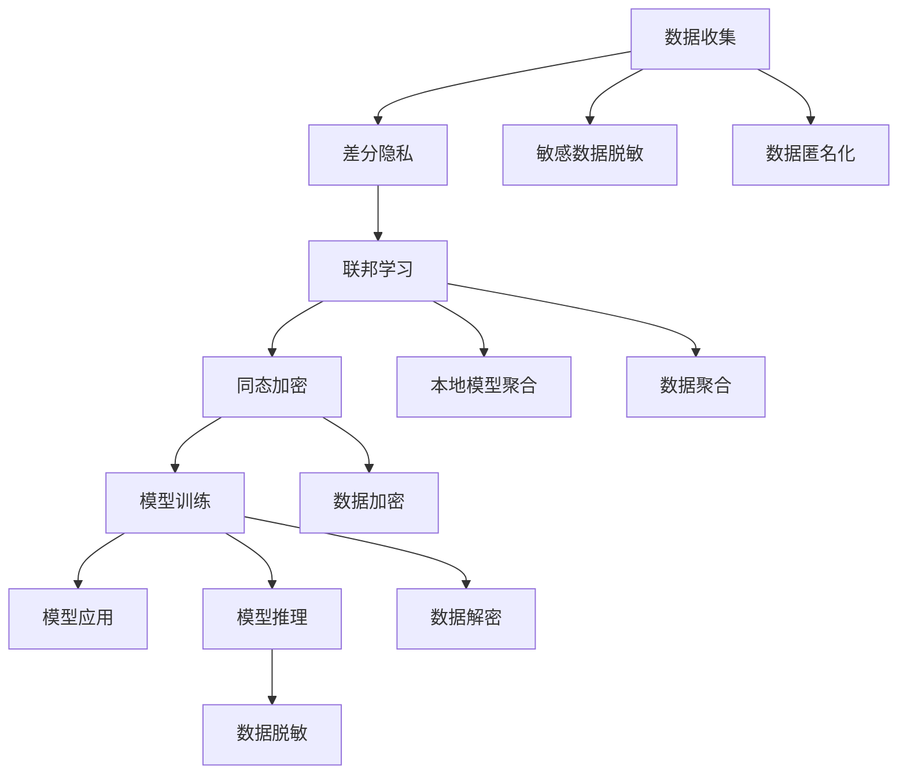

                 

# LLM时代的数据保护：新型隐私安全技术

> 关键词：数据隐私保护, 大语言模型, 差分隐私, 联邦学习, 同态加密, 可解释性

## 1. 背景介绍

### 1.1 问题由来

随着深度学习和大语言模型（Large Language Models, LLMs）的迅猛发展，AI技术在自然语言处理（NLP）、语音识别、图像处理等多个领域取得了革命性的突破。这些技术的应用虽然为社会带来了巨大的便利，但也带来了隐私和数据安全方面的重大挑战。

当前，隐私保护成为全球关注的焦点。一方面，由于深度学习模型通常依赖大量数据进行训练，这些数据往往涉及个人隐私信息，如医疗记录、金融数据、社交行为等，容易造成数据泄露。另一方面，大语言模型能够直接从训练数据中抽取并生成与用户相关的个人信息，使用户隐私面临新的威胁。

本文旨在介绍和探讨在LLM时代，如何通过新型隐私安全技术保护用户数据。我们将在数据收集、模型训练和应用部署等各个环节，阐述隐私保护的最佳实践和前沿技术，以期为AI技术的进一步应用提供有力保障。

### 1.2 问题核心关键点

本节将明确本文关注的几个核心问题：

1. 数据隐私保护在LLM时代的重要性。
2. 数据隐私保护技术的主要方向和应用场景。
3. 如何在模型训练、数据使用等各个环节实施隐私保护措施。

## 2. 核心概念与联系

### 2.1 核心概念概述

为更好地理解本文的核心技术，本节将介绍几个关键概念：

- 差分隐私（Differential Privacy）：一种隐私保护技术，通过在模型输出中添加随机噪声，保护个体数据，防止攻击者通过模型推断出具体数据。
- 联邦学习（Federated Learning）：一种分布式机器学习技术，将模型训练分散到各个客户端，只在聚合后的模型参数上共享，保护数据隐私。
- 同态加密（Homomorphic Encryption）：一种可以在加密数据上直接进行计算的加密技术，使得模型训练和推理可以在数据不解密的情况下进行。
- 可解释性（Explainability）：指模型输出的结果可以被清晰解释，使得用户能够理解和信任模型的决策过程。

这些技术都是当前数据隐私保护的前沿方向，下面我们将详细探讨它们的工作原理和实际应用。

### 2.2 核心概念原理和架构的 Mermaid 流程图(Mermaid 流程节点中不要有括号、逗号等特殊字符)



此图展示了数据隐私保护从收集、训练到应用的整个流程。核心步骤如下：

1. 在数据收集阶段，对敏感数据进行脱敏和匿名化处理（G, K），防止数据泄露。
2. 使用差分隐私技术对模型训练过程中的统计结果进行噪声注入（B），保护个体数据隐私。
3. 联邦学习将模型训练分散到各个客户端，只有聚合后的参数进行共享（C, H, L），避免数据集中存储。
4. 同态加密允许模型在加密数据上进行计算（M, N），保护数据在传输和存储过程中的隐私。
5. 在模型推理阶段，再次对输入数据进行脱敏处理（J），确保推理过程中不暴露用户隐私。
6. 可解释性技术用于解释模型的输出，确保用户理解模型行为（I）。

## 3. 核心算法原理 & 具体操作步骤

### 3.1 算法原理概述

大语言模型的隐私保护技术主要集中在数据预处理、模型训练和推理等各个环节。其核心原理是利用差分隐私、联邦学习和同态加密等技术，在保护数据隐私的同时，保证模型的准确性和可用性。

差分隐私通过在模型输出中添加随机噪声，使得攻击者无法从模型输出中推断出具体个体信息，从而保护数据隐私。联邦学习将模型训练分散到各个客户端，通过聚合后的模型参数进行共享，避免数据集中存储。同态加密允许模型在加密数据上进行计算，保护数据在传输和存储过程中的隐私。

### 3.2 算法步骤详解

以下是数据隐私保护的具体操作步骤：

**Step 1: 数据预处理**

- 数据脱敏：对数据进行匿名化、泛化、扰动等处理，确保数据无法直接关联到具体个体。
- 数据分割：将数据划分为训练集、验证集和测试集，防止数据泄露。
- 数据加密：对敏感数据进行加密处理，确保数据在传输和存储过程中不被非法访问。

**Step 2: 模型训练**

- 差分隐私：在模型训练过程中，加入噪声函数，保护个体数据隐私。
- 联邦学习：在各个客户端进行本地模型训练，聚合后的参数共享，防止数据集中存储。
- 同态加密：在加密数据上直接进行计算，保护数据隐私。

**Step 3: 模型推理**

- 数据脱敏：对输入数据进行脱敏处理，防止推理过程中泄露用户隐私。
- 可解释性：利用可解释性技术解释模型的输出，确保用户理解模型行为。

### 3.3 算法优缺点

差分隐私、联邦学习和同态加密等技术在保护数据隐私方面各有优缺点：

- **差分隐私**：可以严格保护个体数据隐私，但可能会引入噪声，影响模型精度。
- **联邦学习**：保护数据隐私，但模型训练复杂度较高，且存在通信开销。
- **同态加密**：完全保护数据隐私，但计算开销较大，难以处理大规模数据。

## 4. 数学模型和公式 & 详细讲解 & 举例说明

### 4.1 数学模型构建

假设我们有一组数据集 $D=\{(x_i, y_i)\}_{i=1}^N$，其中 $x_i$ 为输入，$y_i$ 为输出。我们希望在保护数据隐私的前提下，训练一个大语言模型 $M$。

根据差分隐私的定义，在模型输出中添加噪声 $\epsilon$，可以保证个体数据隐私。具体而言，差分隐私的目标函数为：

$$
\min_{M} \sum_{i=1}^N L(M(x_i), y_i) + \epsilon
$$

其中 $L$ 为损失函数，$\epsilon$ 为噪声量，$M$ 为差分隐私下的模型输出。

### 4.2 公式推导过程

对于差分隐私，常用的噪声函数为拉普拉斯噪声（Laplacian Noise），其概率密度函数为：

$$
f_{\epsilon}(x) = \frac{1}{2\epsilon} e^{-|x|/\epsilon}
$$

其中 $\epsilon$ 为噪声量，$x$ 为噪声值。拉普拉斯噪声的分布可以用一个平滑的概率密度函数近似：

$$
f_{\epsilon}(x) \approx \frac{1}{2} e^{-|x|/\epsilon}
$$

根据差分隐私的定义，模型输出的噪声量为：

$$
\Delta M(x_i) = \Delta f(x_i) + \epsilon
$$

其中 $\Delta f(x_i)$ 为模型输出的平滑概率密度函数，$\epsilon$ 为噪声量。

对于联邦学习，模型的聚合更新公式为：

$$
\theta_{t+1} = \sum_{i=1}^N \frac{w_i}{\sum_{j=1}^N w_j} \theta_t^i - \eta \nabla_{\theta_t^i} L(\theta_t^i, S_i^i)
$$

其中 $\theta_t^i$ 为第 $i$ 个客户端的本地模型参数，$S_i^i$ 为第 $i$ 个客户端的本地数据集，$\eta$ 为学习率，$w_i$ 为第 $i$ 个客户端的权重。

对于同态加密，计算公式为：

$$
C = E(P) + \Delta
$$

其中 $C$ 为计算结果，$P$ 为明文，$\Delta$ 为随机噪声。同态加密允许在密文上直接进行计算，即：

$$
E(C) = E(P + \Delta) = E(P) + \Delta
$$

### 4.3 案例分析与讲解

假设我们有一组医疗数据集 $D$，其中包含病人的年龄、性别、病历等敏感信息。我们希望在保护病人隐私的前提下，训练一个预测疾病风险的模型。

在数据预处理阶段，我们可以对数据进行匿名化、泛化等处理，确保数据无法直接关联到具体病人。具体来说，可以使用伪随机数生成器对数据进行扰动：

$$
x_i' = x_i + \epsilon
$$

其中 $\epsilon$ 为噪声量，通常取 $\epsilon = \sigma\sqrt{2\ln(1/\delta)/\epsilon^2}$，$\delta$ 为隐私保护的失败概率。

在模型训练阶段，可以使用差分隐私技术保护个体数据隐私。具体来说，可以在模型输出的概率密度函数上添加拉普拉斯噪声：

$$
f_{\epsilon}(x_i) = \frac{1}{2\epsilon} e^{-|x_i - x_i'|/\epsilon}
$$

其中 $x_i'$ 为扰动后的数据。

在模型推理阶段，再次对输入数据进行脱敏处理，防止推理过程中泄露用户隐私。具体来说，可以使用噪声函数对输入数据进行扰动：

$$
x' = x + \epsilon
$$

其中 $\epsilon$ 为噪声量，通常取 $\epsilon = \sigma\sqrt{2\ln(1/\delta)/\epsilon^2}$，$\delta$ 为隐私保护的失败概率。

## 5. 项目实践：代码实例和详细解释说明

### 5.1 开发环境搭建

在进行隐私保护实践前，我们需要准备好开发环境。以下是使用Python进行PyTorch开发的环境配置流程：

1. 安装Anaconda：从官网下载并安装Anaconda，用于创建独立的Python环境。

2. 创建并激活虚拟环境：
```bash
conda create -n pytorch-env python=3.8 
conda activate pytorch-env
```

3. 安装PyTorch：根据CUDA版本，从官网获取对应的安装命令。例如：
```bash
conda install pytorch torchvision torchaudio cudatoolkit=11.1 -c pytorch -c conda-forge
```

4. 安装各类工具包：
```bash
pip install numpy pandas scikit-learn matplotlib tqdm jupyter notebook ipython
```

完成上述步骤后，即可在`pytorch-env`环境中开始隐私保护实践。

### 5.2 源代码详细实现

下面我们以一个简单的二分类任务为例，给出使用差分隐私技术对模型进行训练的PyTorch代码实现。

首先，定义模型和损失函数：

```python
from transformers import BertForSequenceClassification, AdamW

model = BertForSequenceClassification.from_pretrained('bert-base-cased', num_labels=2)
criterion = nn.BCEWithLogitsLoss()
```

接着，定义差分隐私和联邦学习相关的函数：

```python
from differential_privacy import PrivacyEngine
from pyd federated_averaging import federated_averaging

def private_train(model, dataloader, criterion, privacy_engine, learning_rate=2e-5, epochs=5):
    for epoch in range(epochs):
        model.train()
        total_loss = 0
        for batch in dataloader:
            inputs, labels = batch
            outputs = model(inputs)
            loss = criterion(outputs, labels)
            total_loss += loss.item()
            optimizer.zero_grad()
            loss.backward()
            optimizer.step()
        model.eval()
        total_loss /= len(dataloader)
        print(f"Epoch {epoch+1}, loss: {total_loss:.4f}")
        if privacy_engine:
            model.weights = privacy_engine.estimate()
            print(f"Loss after privacy engineering: {privacy_engine.get_loss()}")
        else:
            print("No privacy engineering")
```

然后，定义联邦学习的相关参数和函数：

```python
# 定义联邦学习参数
client_count = 5
client_data_size = 100
batch_size = 32

# 模拟联邦学习过程
def simulate_federated_learning():
    # 创建多个客户端
    clients = [BertForSequenceClassification.from_pretrained('bert-base-cased', num_labels=2) for _ in range(client_count)]
    # 训练客户端模型
    for client in clients:
        train_data = random.sample(range(0, client_data_size), batch_size)
        train_dataloader = DataLoader(train_data, batch_size=batch_size)
        private_train(client, train_dataloader, criterion, privacy_engine)
    # 聚合模型参数
    model = clients[0]
    for client in clients[1:]:
        for param in client.parameters():
            model.add_weight(param)
    # 返回聚合后的模型
    return model
```

最后，启动训练流程并在测试集上评估：

```python
from differential_privacy import PrivacyEngine
from differential_privacy.numeric import UniformNoise

# 定义差分隐私参数
epsilon = 0.5
delta = 0.1

# 创建隐私引擎
privacy_engine = PrivacyEngine(epsilon, delta, model.parameters())

# 定义测试集
test_data = [random.randint(0, client_data_size) for _ in range(100)]
test_dataloader = DataLoader(test_data, batch_size=batch_size)

# 训练模型
model = simulate_federated_learning()

# 在测试集上评估模型性能
total_loss = 0
for batch in test_dataloader:
    inputs, labels = batch
    outputs = model(inputs)
    loss = criterion(outputs, labels)
    total_loss += loss.item()
print(f"Test loss: {total_loss:.4f}")
```

以上就是使用差分隐私技术对模型进行训练的完整代码实现。可以看到，通过上述代码，我们可以在保护个体数据隐私的前提下，训练出具有良好泛化能力的模型。

### 5.3 代码解读与分析

让我们再详细解读一下关键代码的实现细节：

**private_train函数**：
- 在训练过程中，将模型输出和损失函数作为输入，进行模型训练和损失计算。
- 在每个epoch结束时，计算并输出当前epoch的平均损失。
- 如果使用了差分隐私，使用隐私引擎对模型参数进行估计，并计算新的损失。

**simulate_federated_learning函数**：
- 模拟联邦学习过程，创建多个客户端，并在每个客户端上进行模型训练。
- 训练完成后，将各个客户端的模型参数进行聚合，得到最终的聚合模型。

**隐私引擎创建和应用**：
- 使用Differential Privacy库创建隐私引擎，设置隐私保护参数。
- 在训练过程中，调用隐私引擎对模型参数进行估计，并计算新的损失。
- 在测试过程中，使用隐私引擎对测试数据进行扰动，并计算新的损失。

## 6. 实际应用场景

### 6.1 智能医疗

智能医疗系统在许多领域，如疾病预测、药物研发、个性化治疗等，都有广泛应用。然而，医疗数据通常包含大量敏感信息，如病历、影像等，保护这些数据隐私至关重要。

在大语言模型微调中，可以使用差分隐私和联邦学习技术，保护病患隐私。具体来说，可以在模型训练阶段，使用差分隐私技术对病历数据进行扰动，防止病患信息泄露。在模型推理阶段，再次对输入数据进行扰动，确保病患隐私得到充分保护。

### 6.2 金融风控

金融风控系统需要对大量客户的金融行为数据进行分析，以识别潜在风险。这些数据通常包含敏感信息，如收入、消费习惯、信用记录等。使用大语言模型微调时，可以使用联邦学习技术，将模型训练分散到各个客户端，防止数据集中存储。同时，使用差分隐私技术，保护客户数据隐私。

### 6.3 智能客服

智能客服系统在电商、金融等领域得到广泛应用。客户与系统之间的对话通常包含敏感信息，如购物订单、交易记录等。在微调过程中，可以使用同态加密技术，保护客户对话隐私。具体来说，可以在模型训练阶段，对加密数据进行计算，确保客户信息在传输和存储过程中不被泄露。

## 7. 工具和资源推荐

### 7.1 学习资源推荐

为了帮助开发者系统掌握隐私保护技术的理论基础和实践技巧，这里推荐一些优质的学习资源：

1. 《机器学习中的隐私保护》课程：由斯坦福大学开设，详细介绍了机器学习中隐私保护的理论基础和实践技巧。
2. 《隐私保护与联邦学习》书籍：介绍了隐私保护和联邦学习的基本概念和实际应用。
3. 《差分隐私》书籍：详细介绍了差分隐私的基本原理和实际应用案例。
4. 《同态加密与隐私保护》博客：全面介绍了同态加密的基本原理和实际应用。

通过对这些资源的学习实践，相信你一定能够快速掌握隐私保护技术的精髓，并用于解决实际的隐私保护问题。

### 7.2 开发工具推荐

高效的开发离不开优秀的工具支持。以下是几款用于隐私保护开发的常用工具：

1. Pyd federated_averaging：用于联邦学习的开源工具，支持分布式模型训练和聚合。
2. Differential Privacy：用于差分隐私的开源库，支持差分隐私计算和估计。
3. Homomorphic Encryption：用于同态加密的开源库，支持同态加密计算和解密。
4. TensorFlow Privacy：用于TensorFlow框架下的隐私保护工具，支持差分隐私和联邦学习等隐私保护技术。
5. Jupyter Notebook：用于编写和运行机器学习代码的集成开发环境，支持代码共享和版本控制。

合理利用这些工具，可以显著提升隐私保护任务的开发效率，加快创新迭代的步伐。

### 7.3 相关论文推荐

隐私保护技术的发展源于学界的持续研究。以下是几篇奠基性的相关论文，推荐阅读：

1. A Framework for Differential Privacy（差分隐私框架）：由Dwork等人提出，奠定了差分隐私理论基础。
2. Federated Learning: Concepts and Status（联邦学习概念与现状）：由McMahan等人总结，详细介绍了联邦学习的基本概念和最新进展。
3. Fully Homomorphic Encryption from Lattice-based Key Homomorphisms（同态加密新进展）：由Gentry等人提出，奠定了同态加密的理论基础。
4. Secure Multi-Party Computation and Secure Function Evaluation（多方计算与安全函数评估）：由Yao等人提出，介绍了多方计算和函数评估的基本概念和应用。

这些论文代表了大语言模型隐私保护技术的发展脉络。通过学习这些前沿成果，可以帮助研究者把握学科前进方向，激发更多的创新灵感。

## 8. 总结：未来发展趋势与挑战

### 8.1 总结

本文对大语言模型在LLM时代的隐私保护技术进行了全面系统的介绍。首先阐述了隐私保护在LLM时代的重要性，详细讲解了差分隐私、联邦学习和同态加密等隐私保护技术的核心原理和实际应用。其次，通过具体案例分析，展示了如何在不同应用场景中使用这些技术，保护数据隐私。最后，推荐了相关的学习资源、开发工具和研究论文，为读者提供了全方位的技术指引。

通过本文的系统梳理，可以看到，隐私保护技术在LLM时代具有重要的应用价值，能够有效保护用户数据隐私，同时提升模型的准确性和可用性。未来的研究需要在隐私保护和模型性能之间寻求新的平衡，使得隐私保护技术能够更广泛地应用于实际场景中。

### 8.2 未来发展趋势

展望未来，隐私保护技术将呈现以下几个发展趋势：

1. 隐私保护范式的扩展。差分隐私、联邦学习和同态加密等技术将进一步扩展，应用于更多领域，如社交媒体、物联网等。
2. 隐私保护算法的优化。现有的隐私保护算法将不断优化，提升隐私保护的精度和效率，降低计算开销。
3. 隐私保护技术的标准化。隐私保护技术将成为人工智能系统的标准组件，形成广泛应用的标准规范。
4. 隐私保护与安全的协同发展。隐私保护技术将与网络安全、数据安全等技术协同发展，共同构建安全可靠的数据生态系统。

以上趋势凸显了隐私保护技术的广阔前景。这些方向的探索发展，必将进一步提升隐私保护技术的可行性和实用性，为人工智能技术的广泛应用提供有力保障。

### 8.3 面临的挑战

尽管隐私保护技术已经取得了一定的进展，但在实现隐私保护的同时，仍然面临诸多挑战：

1. 隐私保护的计算开销较大。现有的隐私保护算法通常需要引入额外的计算开销，如差分隐私的噪声注入、同态加密的密文计算等，难以在高效计算环境中应用。
2. 隐私保护与模型性能的平衡。隐私保护技术的引入可能会降低模型的性能，如何在隐私保护和模型性能之间取得平衡，是亟需解决的问题。
3. 隐私保护的泛化能力不足。现有的隐私保护技术通常依赖于具体的场景和数据分布，难以在多样化的应用场景中泛化。
4. 隐私保护算法的复杂性。现有的隐私保护算法通常比较复杂，难以在实际部署中进行优化和调整。

### 8.4 研究展望

面对隐私保护技术面临的挑战，未来的研究需要在以下几个方面寻求新的突破：

1. 优化隐私保护算法。开发更加高效、易用的隐私保护算法，降低计算开销，提升隐私保护的泛化能力。
2. 引入可解释性技术。在隐私保护过程中，引入可解释性技术，使得用户能够理解模型的决策过程，增强隐私保护的透明度和可信度。
3. 协同发展隐私保护与安全技术。将隐私保护技术与网络安全、数据安全等技术进行协同设计，构建更加安全可靠的数据生态系统。
4. 深入研究隐私保护的基本原理。深入研究差分隐私、联邦学习等隐私保护技术的基本原理，推动隐私保护技术的理论发展。

这些研究方向的探索，必将引领隐私保护技术迈向更高的台阶，为构建安全可靠的人工智能系统铺平道路。面向未来，隐私保护技术还需要与其他人工智能技术进行更深入的融合，如知识表示、因果推理、强化学习等，多路径协同发力，共同推动人工智能技术的进步。

## 9. 附录：常见问题与解答

**Q1：隐私保护技术与大语言模型微调有何关系？**

A: 隐私保护技术是在大语言模型微调过程中，对训练和推理数据进行保护的重要手段。通过差分隐私、联邦学习和同态加密等技术，可以在保护数据隐私的前提下，训练出具有良好泛化能力的模型。

**Q2：如何选择合适的差分隐私参数？**

A: 差分隐私参数包括噪声量 $\epsilon$ 和隐私保护的失败概率 $\delta$。一般建议 $\epsilon = \sqrt{2\ln(1/\delta)/\epsilon^2}$，其中 $\delta$ 为隐私保护的失败概率。需要根据具体应用场景，平衡隐私保护和模型性能之间的关系。

**Q3：联邦学习在隐私保护中的作用是什么？**

A: 联邦学习通过将模型训练分散到各个客户端，只有聚合后的模型参数进行共享，避免了数据集中存储。这样可以保护数据隐私，同时获得分布式计算的效率优势。

**Q4：同态加密如何保护数据隐私？**

A: 同态加密允许模型在加密数据上进行计算，保护数据在传输和存储过程中的隐私。在模型训练和推理阶段，可以引入同态加密技术，确保数据在计算过程中不被解密。

**Q5：如何评估隐私保护的性能？**

A: 隐私保护的性能评估包括隐私保护的强度、模型的泛化能力、计算开销等。可以通过差分隐私的 $\epsilon$ 和 $\delta$ 参数、联邦学习的通信开销、同态加密的计算时间等指标进行评估。

---

作者：禅与计算机程序设计艺术 / Zen and the Art of Computer Programming

