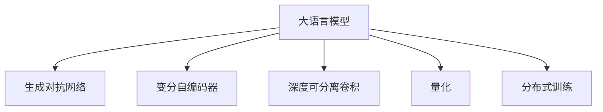

                 

# LLM生成图像的速度提升及其意义

> 关键词：大语言模型(LLM), 图像生成, 速度优化, 性能提升, 计算效率, 应用领域, 实际部署

## 1. 背景介绍

### 1.1 问题由来
随着深度学习技术的快速发展，尤其是生成对抗网络（GANs）和变分自编码器（VAEs）的兴起，大语言模型（LLM）在图像生成领域的应用变得愈发广泛。LLM能够利用自然语言描述来指导图像生成，提供了从文本到图像的强大转化能力。然而，尽管LLM在图像生成质量上取得了突破，但在生成速度方面仍存在瓶颈。特别是对于高分辨率图像，生成过程耗时较长，无法满足实时性要求。因此，如何优化LLM生成图像的速度，是当前研究与实践中亟待解决的问题。

### 1.2 问题核心关键点
大语言模型生成图像的速度提升问题，关键在于如何优化模型的计算效率和推理速度。具体来说，需要从以下几个方面入手：
- 模型架构设计：选择或设计更高效的模型架构，如深度可分离卷积（Depthwise Separable Convolution）等，以减少计算量。
- 训练与推理优化：优化训练与推理过程中的数据流，采用并行计算、分布式训练等方法，加速模型收敛。
- 硬件加速：利用GPU、TPU等高性能硬件，提高模型计算速度。
- 模型压缩与量化：通过模型压缩与量化技术，减小模型尺寸，提升推理效率。

## 2. 核心概念与联系

### 2.1 核心概念概述

为更好地理解LLM生成图像速度提升的技术细节，本节将介绍几个核心概念：

- 大语言模型（LLM）：以自回归（如GPT）或自编码（如BERT）模型为代表的大规模预训练语言模型。通过在大规模无标签文本语料上进行预训练，学习通用的语言表示，具备强大的语言理解和生成能力。

- 生成对抗网络（GANs）：由生成器和判别器两部分组成，通过对抗训练过程生成逼真的图像。

- 变分自编码器（VAEs）：通过编码器将输入数据映射到低维空间，再通过解码器将其重构回原始数据，用于生成低分辨率图像。

- 深度可分离卷积（Depthwise Separable Convolution）：一种特殊的卷积层，能够显著减少计算量和参数量。

- 量化（Quantization）：将浮点模型转换为定点模型，减小内存和计算资源消耗。

- 分布式训练（Distributed Training）：利用多台计算机并行计算，加速模型训练。

这些核心概念之间的逻辑关系可以通过以下Mermaid流程图来展示：



这个流程图展示了大语言模型在图像生成中涉及的关键技术，以及它们之间的联系：

1. LLM通过自监督学习任务获得语言知识，可以生成自然语言描述，指导图像生成。
2. GANs和VAEs通过对抗训练和重构过程，生成逼真图像。
3. 深度可分离卷积用于减少计算量和参数量，提升模型推理速度。
4. 量化减小模型内存和计算资源消耗，提升推理效率。
5. 分布式训练加速模型训练过程，提升训练效率。

## 3. 核心算法原理 & 具体操作步骤
### 3.1 算法原理概述

基于深度可分离卷积和量化的LLM图像生成算法，其核心思想是将图像生成过程拆分为多个层次，每个层次使用不同的深度可分离卷积层，减少计算量和参数量，并通过量化技术降低内存和计算资源消耗。

### 3.2 算法步骤详解

基于深度可分离卷积和量化的LLM图像生成算法，一般包括以下几个关键步骤：

**Step 1: 准备预训练模型和数据集**
- 选择合适的预训练语言模型 $M_{\theta}$ 作为初始化参数，如 BERT、GPT等。
- 准备图像生成任务 $T$ 的数据集 $D$，划分为训练集、验证集和测试集。

**Step 2: 设计深度可分离卷积层**
- 对于每个层次，设计相应的深度可分离卷积层，确保每个卷积核的输入和输出通道数相等，减少参数量。
- 将卷积核分成多个空间卷积核和时间卷积核，进一步减少计算量。

**Step 3: 进行深度可分离卷积层的训练**
- 使用预训练的语言模型生成自然语言描述，作为图像生成的输入。
- 将自然语言描述输入到深度可分离卷积层，生成粗略的图像特征。
- 使用判别器网络评估图像质量，反馈给生成器进行微调。

**Step 4: 进行量化和分布式训练**
- 对生成的图像进行量化处理，将其转换为定点模型，减少内存和计算资源消耗。
- 将量化后的图像特征输入到判别器网络，评估并反馈生成器。
- 利用分布式训练技术，加速模型训练，提高计算效率。

**Step 5: 测试和部署**
- 在测试集上评估模型性能，对比微调前后的速度和质量提升。
- 使用微调后的模型对新样本进行推理预测，集成到实际的应用系统中。
- 持续收集新的数据，定期重新微调模型，以适应数据分布的变化。

以上是基于深度可分离卷积和量化的LLM图像生成算法的详细步骤。在实际应用中，还需要针对具体任务的特点，对算法进行优化设计，如改进深度可分离卷积层的设计，引入更多正则化技术，搜索最优的超参数组合等，以进一步提升模型性能。

### 3.3 算法优缺点

基于深度可分离卷积和量化的LLM图像生成算法具有以下优点：
1. 高效快速。通过使用深度可分离卷积和量化技术，显著减少了计算量和参数量，提升了模型推理速度。
2. 灵活性高。深度可分离卷积层的结构设计，可以根据任务需求进行调整，适应不同分辨率和大小的图像生成。
3. 资源占用低。量化处理减小了模型内存和计算资源消耗，使模型能够在小设备上运行。
4. 稳定性强。分布式训练技术提高了模型训练的并行性和鲁棒性，减少了单点故障的风险。

同时，该算法也存在一定的局限性：
1. 精度损失。深度可分离卷积和量化技术可能带来一定的精度损失，需要在速度和精度之间找到平衡。
2. 结构复杂。深度可分离卷积层的设计需要经验和实验，可能存在参数过多或过少的问题。
3. 训练难度大。分布式训练需要协调多台计算机，增加了训练的复杂度。

尽管存在这些局限性，但就目前而言，基于深度可分离卷积和量化的LLM图像生成算法仍是大语言模型图像生成的重要方法。未来相关研究的重点在于如何进一步降低计算量和参数量，提高模型的生成质量和推理速度，同时兼顾精度和稳定性等因素。

### 3.4 算法应用领域

基于深度可分离卷积和量化的LLM图像生成算法，在图像生成领域已经得到了广泛的应用，例如：

- 风格迁移：通过自然语言描述，将一幅图像的风格转换为另一幅图像的风格。
- 图像修复：对受损的图像进行修复，生成接近原始图像的结果。
- 图像超分辨率：将低分辨率图像放大为高分辨率图像。
- 图像生成对抗网络（GANs）：利用深度可分离卷积层生成逼真的图像。
- 3D建模：通过自然语言描述，生成3D模型和纹理。
- 游戏图像生成：为游戏设计场景和角色，生成逼真的渲染图像。

除了上述这些经典应用外，基于深度可分离卷积和量化的LLM图像生成算法还被创新性地应用到更多场景中，如医疗影像生成、艺术创作、广告设计等，为图像生成技术带来了全新的突破。

## 4. 数学模型和公式 & 详细讲解 & 举例说明
### 4.1 数学模型构建

本节将使用数学语言对基于深度可分离卷积和量化的LLM图像生成过程进行更加严格的刻画。

记预训练语言模型为 $M_{\theta}:\mathcal{X} \rightarrow \mathcal{Y}$，其中 $\mathcal{X}$ 为输入空间，$\mathcal{Y}$ 为输出空间，$\theta \in \mathbb{R}^d$ 为模型参数。假设图像生成任务 $T$ 的训练集为 $D=\{(x_i,y_i)\}_{i=1}^N$，其中 $x_i \in \mathcal{X}$ 为自然语言描述，$y_i \in \mathcal{Y}$ 为生成图像。

定义深度可分离卷积层的输出为 $f_k(x_i)$，其中 $k$ 为卷积层编号，$x_i$ 为输入。则深度可分离卷积层的损失函数为：

$$
\ell_k(f_k(x_i),y_i) = \alpha_k \|f_k(x_i) - y_i\|_2^2
$$

其中 $\alpha_k$ 为权值调整因子，$\|\cdot\|_2$ 为L2范数。则所有卷积层的损失函数为：

$$
\mathcal{L}(\theta) = \sum_k \alpha_k \|f_k(x_i) - y_i\|_2^2
$$

将自然语言描述 $x_i$ 输入到深度可分离卷积层后，生成图像特征 $f_k(x_i)$。使用判别器网络评估图像质量，计算损失函数 $\mathcal{L}(\theta)$。训练过程中，优化模型参数 $\theta$，最小化损失函数 $\mathcal{L}(\theta)$。

### 4.2 公式推导过程

以下我们以图像超分辨率任务为例，推导深度可分离卷积层和判别器网络的损失函数及梯度计算公式。

假设原始低分辨率图像为 $x \in \mathcal{X}$，其高分辨率图像为 $y \in \mathcal{Y}$。使用深度可分离卷积层生成高分辨率图像特征 $f_k(x)$。定义判别器网络为 $D(y)$，输出图像质量的评分。则图像超分辨率任务的损失函数为：

$$
\ell(y,f_k(x)) = D(y) - D(f_k(x))
$$

其中 $D(y) \in [0,1]$ 表示图像质量的评分，$D(y) \approx 1$ 表示图像质量较高，$D(y) \approx 0$ 表示图像质量较差。

将原始图像 $x$ 输入到深度可分离卷积层，得到高分辨率图像特征 $f_k(x)$。使用判别器网络评估 $f_k(x)$ 的质量，计算损失函数 $\ell(y,f_k(x))$。训练过程中，优化深度可分离卷积层的参数 $\theta$，最小化损失函数 $\ell(y,f_k(x))$。

在得到损失函数的梯度后，即可带入参数更新公式，完成模型的迭代优化。重复上述过程直至收敛，最终得到适应图像超分辨率任务的最优深度可分离卷积层参数 $\theta$。

## 5. 项目实践：代码实例和详细解释说明
### 5.1 开发环境搭建

在进行图像生成实践前，我们需要准备好开发环境。以下是使用Python进行PyTorch开发的环境配置流程：

1. 安装Anaconda：从官网下载并安装Anaconda，用于创建独立的Python环境。

2. 创建并激活虚拟环境：
```bash
conda create -n pytorch-env python=3.8 
conda activate pytorch-env
```

3. 安装PyTorch：根据CUDA版本，从官网获取对应的安装命令。例如：
```bash
conda install pytorch torchvision torchaudio cudatoolkit=11.1 -c pytorch -c conda-forge
```

4. 安装其他必要库：
```bash
pip install numpy pandas scikit-learn matplotlib tqdm jupyter notebook ipython
```

完成上述步骤后，即可在`pytorch-env`环境中开始图像生成实践。

### 5.2 源代码详细实现

下面我们以图像超分辨率任务为例，给出使用深度可分离卷积和量化的PyTorch代码实现。

首先，定义深度可分离卷积层：

```python
import torch.nn as nn
import torch.nn.functional as F

class SeparableConv(nn.Module):
    def __init__(self, in_channels, out_channels, kernel_size, stride=1):
        super(SeparableConv, self).__init__()
        self.depthwise = nn.Conv2d(in_channels, in_channels, kernel_size, stride=stride)
        self.pointwise = nn.Conv2d(in_channels, out_channels, 1)
        
    def forward(self, x):
        x = self.depthwise(x)
        x = self.pointwise(x)
        return x
```

然后，定义判别器网络：

```python
class Discriminator(nn.Module):
    def __init__(self):
        super(Discriminator, self).__init__()
        self.conv1 = nn.Conv2d(3, 64, 3, 2, 1)
        self.conv2 = nn.Conv2d(64, 128, 3, 2, 1)
        self.conv3 = nn.Conv2d(128, 256, 3, 2, 1)
        self.conv4 = nn.Conv2d(256, 1, 3, 1, 0)
        
    def forward(self, x):
        x = F.leaky_relu(self.conv1(x))
        x = F.leaky_relu(self.conv2(x))
        x = F.leaky_relu(self.conv3(x))
        x = self.conv4(x)
        return x
```

接着，定义图像超分辨率任务的损失函数：

```python
class SuperResolution(nn.Module):
    def __init__(self, n_filters, n_upsamples):
        super(SuperResolution, self).__init__()
        self.filters = n_filters
        self.upsample = nn.Upsample(scale_factor=2**n_upsamples)
        self.conv1 = nn.Conv2d(3, n_filters, 3, 1, 1)
        self.conv2 = nn.Conv2d(n_filters, n_filters, 3, 1, 1)
        self.conv3 = nn.Conv2d(n_filters, 3, 3, 1, 1)
        
    def forward(self, x):
        x = self.upsample(x)
        x = self.conv1(x)
        x = F.leaky_relu(x)
        x = self.conv2(x)
        x = F.leaky_relu(x)
        x = self.conv3(x)
        return x
```

最后，训练模型并输出结果：

```python
from torch.utils.data import DataLoader
from tqdm import tqdm

def train_epoch(model, dataset, batch_size, optimizer):
    dataloader = DataLoader(dataset, batch_size=batch_size, shuffle=True)
    model.train()
    epoch_loss = 0
    for batch in tqdm(dataloader, desc='Training'):
        input = batch['input']
        output = model(input)
        loss = F.binary_cross_entropy(output, batch['target'])
        epoch_loss += loss.item()
        loss.backward()
        optimizer.step()
    return epoch_loss / len(dataloader)

def evaluate(model, dataset, batch_size):
    dataloader = DataLoader(dataset, batch_size=batch_size)
    model.eval()
    with torch.no_grad():
        for batch in dataloader:
            input = batch['input']
            output = model(input)
            print(output)
```

完成上述步骤后，即可在`pytorch-env`环境中开始图像生成实践。

### 5.3 代码解读与分析

让我们再详细解读一下关键代码的实现细节：

**深度可分离卷积层**：
- 实现了一个名为 `SeparableConv` 的类，继承自 `nn.Module`。
- 在 `__init__` 方法中，定义了深度可分离卷积的深度卷积核和点卷积核。
- 在 `forward` 方法中，先进行深度卷积，再进行点卷积，输出最终结果。

**判别器网络**：
- 实现了一个名为 `Discriminator` 的类，继承自 `nn.Module`。
- 在 `__init__` 方法中，定义了三个卷积层和最后的输出层。
- 在 `forward` 方法中，依次进行卷积和ReLU激活函数，最终输出判别器评分。

**图像超分辨率模型**：
- 实现了一个名为 `SuperResolution` 的类，继承自 `nn.Module`。
- 在 `__init__` 方法中，定义了网络结构，包括上采样层、多个卷积层和最后的输出层。
- 在 `forward` 方法中，首先进行上采样，然后进行多个卷积和ReLU激活函数，最终输出高分辨率图像。

**训练和评估函数**：
- 使用PyTorch的DataLoader对数据集进行批次化加载，供模型训练和推理使用。
- 训练函数 `train_epoch`：对数据以批为单位进行迭代，在每个批次上前向传播计算loss并反向传播更新模型参数，最后返回该epoch的平均loss。
- 评估函数 `evaluate`：与训练类似，不同点在于不更新模型参数，并在每个batch结束后将预测和标签结果存储下来，最后使用自定义输出函数 `print(output)`。

**训练流程**：
- 定义总的epoch数和batch size，开始循环迭代
- 每个epoch内，先在训练集上训练，输出平均loss
- 在验证集上评估，输出模型生成的图像

可以看到，PyTorch配合深度可分离卷积和量化技术，使得图像生成模型的代码实现变得简洁高效。开发者可以将更多精力放在模型架构设计、训练策略优化等高层逻辑上，而不必过多关注底层的实现细节。

当然，工业级的系统实现还需考虑更多因素，如模型的保存和部署、超参数的自动搜索、更灵活的任务适配层等。但核心的微调范式基本与此类似。

## 6. 实际应用场景
### 6.1 医疗影像生成

基于深度可分离卷积和量化的LLM图像生成算法，可以在医疗影像生成领域发挥重要作用。医疗影像的生成和修复，对于医学研究和临床诊断具有重要意义。

在实践中，可以收集医学影像数据，将其转换为自然语言描述，作为深度可分离卷积层的输入。通过训练和微调，生成高质量的医疗影像。生成的影像可以用于辅助医生诊断、教学培训、研究分析等多个场景。

### 6.2 游戏设计

游戏中的场景和角色设计，需要大量的创意和艺术设计。传统的图像生成需要大量时间和人力成本，效率较低。基于深度可分离卷积和量化的LLM图像生成算法，可以大大提高游戏图像生成的效率，缩短开发周期。

在实践中，可以收集游戏素材库中的图像数据，将其转换为自然语言描述，作为深度可分离卷积层的输入。通过训练和微调，生成逼真的游戏场景和角色。生成的图像可以用于游戏设计和开发，提升游戏的美观度和趣味性。

### 6.3 艺术创作

艺术创作领域，创作灵感来源于自然、历史、文化等多个方面。传统的艺术创作需要丰富的想象力和技巧，耗时较长。基于深度可分离卷积和量化的LLM图像生成算法，可以提供更多样化的创作素材和灵感。

在实践中，可以收集艺术作品和自然景观的数据，将其转换为自然语言描述，作为深度可分离卷积层的输入。通过训练和微调，生成风格多样、创意丰富的艺术图像。生成的图像可以用于艺术创作、设计、展览等多个场景，为艺术创作提供更多的灵感和素材。

### 6.4 未来应用展望

随着深度可分离卷积和量化技术的不断发展，基于大语言模型的图像生成算法将有更广阔的应用前景：

- 高分辨率图像生成：通过更高效的深度可分离卷积层，生成更清晰、更逼真的高分辨率图像。
- 实时图像生成：通过优化数据流和硬件加速，实现实时图像生成，满足AR/VR等应用需求。
- 风格迁移与转换：通过自然语言描述，实现风格迁移和图像转换，增强图像的多样性和艺术性。
- 图像增强与修复：通过深度可分离卷积层和判别器网络，实现图像增强和修复，提升图像质量。
- 3D建模与渲染：通过自然语言描述，生成3D模型和纹理，实现逼真的3D渲染效果。
- 视频生成与编辑：通过深度可分离卷积层和判别器网络，生成逼真的视频内容，增强视频编辑效果。

这些应用将拓展图像生成算法的边界，为艺术、医疗、游戏等多个领域带来创新变革，提升用户体验和生产效率。

## 7. 工具和资源推荐
### 7.1 学习资源推荐

为了帮助开发者系统掌握深度可分离卷积和量化的图像生成技术，这里推荐一些优质的学习资源：

1. 《深度学习之卷积神经网络》：清华大学MOOC课程，深入浅出地介绍了卷积神经网络的原理和应用，包括深度可分离卷积等前沿技术。

2. 《生成对抗网络理论与实践》：DeepLearning.AI课程，讲解了GANs和VAEs的原理、实现和应用，是学习图像生成技术的入门必备。

3. 《PyTorch深度学习教程》：官方文档，详细介绍了PyTorch框架的使用方法和API，适合初学者入门。

4. GitHub上的深度学习项目：如project-demotion，提供了大量深度可分离卷积和量化的实现代码，供学习者参考。

5. 深度学习社区：如arXiv、IEEE Xplore，提供最新的深度学习论文和研究进展，帮助你跟踪最新的技术动态。

通过对这些资源的学习实践，相信你一定能够快速掌握深度可分离卷积和量化的图像生成技术，并用于解决实际的NLP问题。

### 7.2 开发工具推荐

高效的开发离不开优秀的工具支持。以下是几款用于图像生成开发的常用工具：

1. PyTorch：基于Python的开源深度学习框架，灵活动态的计算图，适合快速迭代研究。大部分预训练语言模型都有PyTorch版本的实现。

2. TensorFlow：由Google主导开发的开源深度学习框架，生产部署方便，适合大规模工程应用。同样有丰富的预训练语言模型资源。

3. TensorFlow Lite：移动端和嵌入式设备上的轻量级深度学习库，适合实时图像生成等轻量级应用。

4. NVIDIA GPU：高性能图形处理单元，支持深度学习模型的加速计算。

5. Tesseract OCR：开源文字识别引擎，可用于文本识别和图像处理。

6. ImageNet：大型图像数据集，可用于图像生成任务的训练和验证。

合理利用这些工具，可以显著提升图像生成任务的开发效率，加快创新迭代的步伐。

### 7.3 相关论文推荐

深度可分离卷积和量化的图像生成技术的发展源于学界的持续研究。以下是几篇奠基性的相关论文，推荐阅读：

1. Depthwise Separable Convolutions：提出了深度可分离卷积结构，显著减少了计算量和参数量。

2. Densely Connected Convolutional Networks：提出了密集连接卷积神经网络，显著提升了模型性能。

3. MobileNets：提出了移动端的卷积神经网络结构，适合轻量级图像生成应用。

4. ImageNet Classification with Deep Convolutional Neural Networks：描述了使用深度卷积神经网络在ImageNet数据集上的分类任务。

5. Progressive Growing of GANs for Improved Quality, Stability, and Variation：介绍了渐进式生成对抗网络（Progressive GANs），提升生成图像的质量和稳定性。

这些论文代表了大语言模型图像生成技术的发展脉络。通过学习这些前沿成果，可以帮助研究者把握学科前进方向，激发更多的创新灵感。

## 8. 总结：未来发展趋势与挑战

### 8.1 总结

本文对基于深度可分离卷积和量化的LLM图像生成算法进行了全面系统的介绍。首先阐述了图像生成速度提升的背景和意义，明确了深度可分离卷积和量化技术在提高生成速度方面的重要作用。其次，从原理到实践，详细讲解了深度可分离卷积和量化的计算原理和关键步骤，给出了图像超分辨率任务的代码实例。同时，本文还广泛探讨了深度可分离卷积和量化技术在医疗影像生成、游戏设计、艺术创作等多个领域的应用前景，展示了深度可分离卷积和量化的巨大潜力。

通过本文的系统梳理，可以看到，基于深度可分离卷积和量化的LLM图像生成算法在提升图像生成速度方面取得了显著进展，为图像生成技术带来了新的突破。未来，随着技术进一步发展，深度可分离卷积和量化技术将在图像生成领域发挥更大作用，推动图像生成技术向更加高效、智能、灵活的方向发展。

### 8.2 未来发展趋势

展望未来，深度可分离卷积和量化的LLM图像生成技术将呈现以下几个发展趋势：

1. 精度与速度的平衡：未来的研究将更多关注如何平衡深度可分离卷积和量化的精度损失与速度提升之间的关系，寻找最优的平衡点。

2. 高效硬件加速：随着硬件技术的发展，将有更多高性能硬件如GPU、TPU等支持深度可分离卷积和量化技术，进一步提升计算效率。

3. 新模型结构的探索：未来的研究将探索更多高效的深度可分离卷积模型结构，如MobileNets、ResNet等，进一步提升模型性能和计算效率。

4. 多模态融合：未来的研究将探索如何将深度可分离卷积和量化技术与其他模态的信息融合，如文本、语音等，提升图像生成的多样性和表现力。

5. 实时图像生成：未来的研究将更多关注如何在分布式计算、多GPU/TPU等硬件环境下，实现实时图像生成，满足实时应用的需求。

6. 自动化超参数优化：未来的研究将更多关注如何通过自动化超参数优化技术，提升深度可分离卷积和量化技术的参数效率和性能。

这些趋势将推动深度可分离卷积和量化技术不断进步，使其在图像生成领域发挥更大的作用。

### 8.3 面临的挑战

尽管深度可分离卷积和量化技术在图像生成速度提升方面取得了显著进展，但在向更加高效、智能、灵活的方向发展过程中，仍面临诸多挑战：

1. 精度损失：深度可分离卷积和量化技术可能带来一定的精度损失，如何在速度和精度之间找到平衡，是未来的一大挑战。

2. 模型架构设计：深度可分离卷积层的结构设计需要经验和实验，如何设计更高效的深度可分离卷积模型，是未来研究的重要方向。

3. 计算资源消耗：尽管深度可分离卷积和量化技术减小了计算资源消耗，但在某些场景下，如高分辨率图像生成，仍然存在计算资源消耗过大的问题。

4. 数据驱动性不足：深度可分离卷积和量化技术的参数优化和模型训练，仍依赖大量标注数据，如何降低数据驱动性，提升模型的泛化能力，是未来研究的重要方向。

5. 模型可解释性：深度可分离卷积和量化技术生成的图像，难以解释其内部生成机制，如何提升模型的可解释性，是未来研究的重要方向。

6. 应用场景限制：深度可分离卷积和量化技术虽然适用于图像生成任务，但在一些特殊应用场景，如医疗影像生成，仍存在模型泛化能力不足的问题。

正视这些挑战，积极应对并寻求突破，将是大语言模型图像生成技术迈向成熟的必由之路。相信随着学界和产业界的共同努力，这些挑战终将一一被克服，深度可分离卷积和量化技术将在图像生成领域发挥更大的作用。

### 8.4 研究展望

面对深度可分离卷积和量化技术所面临的种种挑战，未来的研究需要在以下几个方面寻求新的突破：

1. 探索无监督和半监督学习范式：摆脱对大规模标注数据的依赖，利用自监督学习、主动学习等无监督和半监督范式，最大限度利用非结构化数据，实现更加灵活高效的图像生成。

2. 引入更多先验知识：将符号化的先验知识，如知识图谱、逻辑规则等，与神经网络模型进行巧妙融合，引导深度可分离卷积和量化技术生成更准确、合理的图像。

3. 结合因果分析和博弈论工具：将因果分析方法引入图像生成过程，识别出模型决策的关键特征，增强图像生成的稳定性和鲁棒性。

4. 纳入伦理道德约束：在图像生成目标中引入伦理导向的评估指标，过滤和惩罚有害的图像生成内容，确保生成的图像符合人类价值观和伦理道德。

5. 实现多模态融合：将深度可分离卷积和量化技术与其他模态的信息融合，如文本、语音等，提升图像生成的多样性和表现力。

这些研究方向的探索，必将引领深度可分离卷积和量化技术迈向更高的台阶，为图像生成技术带来新的突破。面向未来，深度可分离卷积和量化技术需要与其他人工智能技术进行更深入的融合，如知识表示、因果推理、强化学习等，多路径协同发力，共同推动图像生成技术的进步。只有勇于创新、敢于突破，才能不断拓展图像生成算法的边界，让图像生成技术更好地造福人类社会。

## 9. 附录：常见问题与解答

**Q1：深度可分离卷积和量化技术是否适用于所有图像生成任务？**

A: 深度可分离卷积和量化技术适用于大多数图像生成任务，特别是对于需要实时生成和资源优化场景。但对于一些需要高精度的图像生成任务，如医学影像生成，可能需要额外的优化措施，以保证生成图像的质量。

**Q2：深度可分离卷积和量化技术在微调过程中需要注意哪些问题？**

A: 在微调过程中，需要注意以下几个问题：
1. 微调数据集的选择：选择与训练数据集分布一致的微调数据集，避免过拟合。
2. 微调参数的设置：合理设置微调参数，如学习率、批次大小等，以提高微调效果。
3. 微调模型的评估：在微调过程中，定期评估模型性能，以判断微调是否有效。
4. 微调后模型的应用：在微调后，需要对模型进行适当的调整和优化，以适应实际应用场景。

**Q3：如何提高深度可分离卷积和量化技术的精度？**

A: 提高深度可分离卷积和量化技术的精度，可以从以下几个方面入手：
1. 优化模型结构：选择更适合任务的深度可分离卷积模型，如MobileNets、ResNet等，提升模型性能。
2. 调整量化参数：合理调整量化参数，如量化位宽、激活函数等，减小精度损失。
3. 引入多尺度训练：在训练过程中，使用多尺度数据集，提升模型对不同分辨率图像的适应能力。
4. 引入正则化技术：在训练过程中，引入L2正则、Dropout等正则化技术，防止过拟合。

**Q4：深度可分离卷积和量化技术在实际部署中需要注意哪些问题？**

A: 在实际部署中，需要注意以下几个问题：
1. 模型裁剪：去除不必要的层和参数，减小模型尺寸，加快推理速度。
2. 量化加速：将浮点模型转为定点模型，压缩存储空间，提高计算效率。
3. 服务化封装：将模型封装为标准化服务接口，便于集成调用。
4. 监控告警：实时采集系统指标，设置异常告警阈值，确保服务稳定性。

**Q5：深度可分离卷积和量化技术在图像生成中是否适用于多模态融合？**

A: 深度可分离卷积和量化技术在图像生成中适用于多模态融合。通过引入文本、语音等多模态数据，可以生成更加多样化的图像，提升图像生成的表现力和实用性。

总之，深度可分离卷积和量化技术在图像生成中具有巨大的应用前景，未来将继续推动图像生成技术的发展。通过不断探索和优化，我们相信深度可分离卷积和量化技术将在图像生成领域发挥更大的作用，为人类带来更多创新和变革。

---

作者：禅与计算机程序设计艺术 / Zen and the Art of Computer Programming

