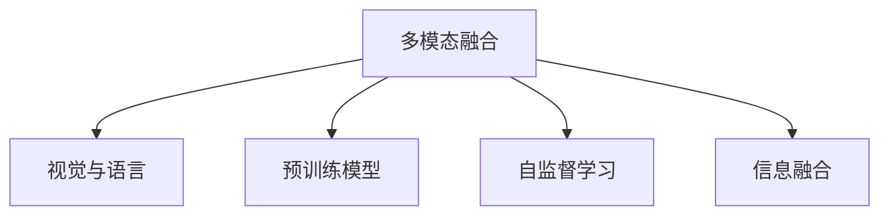

                 

# LLM的多模态融合：视觉与语言的结合

> 关键词：多模态融合，视觉与语言，Transformer，自监督学习，CLIP，文本-视觉，自回归模型，变分自编码器(VAE)，上下文感知模型，信息融合，深度学习

## 1. 背景介绍

在人工智能领域，大语言模型(LLM)已经在自然语言处理(NLP)领域取得了令人瞩目的成就，诸如GPT-3、BERT、T5等模型已经在多项任务中刷新了性能记录。然而，尽管LLM在文本处理方面表现出色，其在视觉领域的应用却相对有限，大多仅限于视觉描述生成和图像标注等任务。如何在大语言模型中引入视觉信息，实现视觉与语言的深度融合，成为当前学术界和工业界的热点研究问题。

### 1.1 问题由来

在过去的十年中，深度学习技术在图像和语言两个领域分别取得了突破性的进展。图像领域的ResNet、VGGNet等卷积神经网络(Convolutional Neural Networks, CNNs)和目标检测模型在视觉识别和图像生成等方面表现优异。语言领域的大规模预训练语言模型如BERT、GPT系列模型在各种NLP任务上取得了显著的提升。但当面对多模态数据时，单一的视觉模型或语言模型难以充分利用各自的优势，发挥最大的效用。因此，将视觉和语言信息相结合，构建多模态融合模型，成为当前大语言模型研究的重要方向。

### 1.2 问题核心关键点

多模态融合的核心在于如何高效、准确地将视觉和语言信息进行联合建模，以实现信息互补和知识共享。具体而言，面临以下关键问题：

- 如何融合视觉与语言数据。视觉数据通常以图像或视频形式存在，而语言数据以文本形式表示，如何将两者结合，实现统一表示和联合推理，是一个重要的研究方向。
- 如何利用预训练模型。预训练语言模型在语言理解方面表现优异，但往往缺乏对视觉信息的有效利用。如何将视觉知识引入预训练模型，提高其多模态融合能力，是一个亟待解决的问题。
- 如何优化信息融合算法。多模态融合需要结合图像和语言的不同特性，选择合适的算法和策略，以最大限度地发挥信息融合的效果。
- 如何应用到实际应用场景中。多模态融合不仅在理论上具有挑战性，如何在实际应用场景中实现高效、可靠的信息融合，也是一个重要的实践问题。

这些核心关键点共同构成了多模态融合研究的基础框架，本文将围绕这些问题，深入探讨多模态融合的原理和实践方法。

## 2. 核心概念与联系

### 2.1 核心概念概述

为更好地理解多模态融合的概念，我们首先介绍几个核心概念及其相互关系：

- 多模态融合：指将不同模态的信息进行联合建模，利用各模态的特性互补，实现更全面、准确的知识表示。
- 视觉与语言：视觉数据通常以图像或视频的形式存在，而语言数据以文本的形式表达。两者的结合可以实现从视觉到语言的理解，或从语言到视觉的生成。
- 预训练模型：通过在大规模无标签数据上进行自监督学习，学习到通用的知识表示，如BERT、GPT系列模型。
- 自监督学习：指在没有标注数据的情况下，利用数据本身的内在结构进行学习。常见的自监督学习任务包括语言建模、视觉对比学习等。
- 信息融合：指将多模态数据的信息进行整合，生成更综合、更丰富的表示，提高模型的鲁棒性和泛化能力。

这些概念之间的联系和作用，可以通过以下Mermaid流程图来展示：



这个流程图展示了多模态融合的各个关键环节：

1. 多模态融合通过将视觉与语言信息进行联合建模，提升模型的表示能力。
2. 预训练模型是联合建模的基础，提供通用的知识表示。
3. 自监督学习通过无监督的方式，学习数据的内在结构，用于预训练模型。
4. 信息融合将视觉和语言信息整合，生成更丰富的表示。

这些概念共同构成了多模态融合的研究框架，帮助理解模型设计的方向和原则。

## 3. 核心算法原理 & 具体操作步骤
### 3.1 算法原理概述

多模态融合的核心算法是Transformer结构，结合自监督学习的预训练框架，通过视觉与语言的联合建模，实现信息融合。Transformer结构具有良好的序列建模能力和并行计算特性，适合处理多模态信息。

具体而言，多模态融合的目标是将视觉和语言信息进行联合表示，使得模型能够理解并生成跨模态的数据。其中，视觉信息通常由图像或视频序列表示，语言信息则由文本序列表示。为实现跨模态联合建模，我们采用如下策略：

1. **视觉编码器**：使用卷积神经网络对图像或视频进行编码，提取视觉特征。
2. **语言编码器**：使用预训练的语言模型对文本进行编码，提取语言特征。
3. **信息融合层**：将视觉和语言编码器输出的特征进行融合，生成跨模态的表示。
4. **解码器**：使用Transformer解码器对跨模态表示进行解码，生成目标序列。

### 3.2 算法步骤详解

以下是对多模态融合算法的详细步骤讲解：

**Step 1: 数据准备与预处理**

首先，需要准备视觉和语言数据，并对其进行预处理。例如，将图像数据进行归一化、裁剪、缩放等操作，将文本数据进行分词、向量化处理。

**Step 2: 视觉编码**

使用卷积神经网络对图像或视频进行编码。常见的方法包括ResNet、Inception等。以ResNet为例，其步骤为：

1. 输入图像，通过卷积层提取特征。
2. 经过多个卷积层和池化层，逐步降低特征图的尺寸。
3. 最后输出高层次的视觉特征表示。

**Step 3: 语言编码**

使用预训练的语言模型对文本进行编码。以BERT为例，其步骤为：

1. 输入文本，通过分词器将文本转换为token ids。
2. 将token ids输入BERT模型，进行自监督学习任务如掩码语言模型等。
3. 输出文本的向量表示。

**Step 4: 信息融合**

将视觉编码器和语言编码器输出的特征进行融合。常用的融合方式包括拼接、平均、加权平均等。以拼接为例，其步骤为：

1. 将视觉特征和语言特征拼接在一起。
2. 通过线性变换和激活函数，生成跨模态的表示。

**Step 5: 解码**

使用Transformer解码器对跨模态表示进行解码，生成目标序列。以生成图像描述为例，其步骤为：

1. 将跨模态表示作为输入，输入到Transformer解码器中。
2. 通过注意力机制，逐步生成描述序列。
3. 将生成的序列作为最终输出。

### 3.3 算法优缺点

多模态融合算法具有以下优点：

1. 融合多模态信息，提高模型的表示能力。多模态融合能够同时利用视觉和语言数据，实现更全面、更丰富的表示。
2. 改善模型的泛化能力。融合后的多模态表示能够更好地应对不同数据分布的挑战，提高模型的泛化性能。
3. 提升模型的鲁棒性。通过多模态信息的整合，能够增强模型对噪声和干扰的鲁棒性。

同时，该算法也存在以下缺点：

1. 计算复杂度高。多模态融合需要同时处理视觉和语言数据，计算复杂度较高。
2. 数据需求量大。融合需要大量的标注数据，数据需求量较大。
3. 融合策略选择困难。如何选择合适的融合策略，仍然是一个需要深入研究的课题。

### 3.4 算法应用领域

多模态融合算法已经在多个领域得到了广泛应用，例如：

- 图像描述生成：将图像转换为自然语言描述，如Google的OpenAI式文本-图像模型，使用CLIP进行训练。
- 视觉问答：根据视觉信息回答自然语言问题，如ViLBERT等模型。
- 图像分类与标注：将图像分类与语言描述相结合，提高图像分类的准确性，如DenseCAP等模型。
- 人机交互：结合视觉与语言信息，实现更自然、更高效的人机交互，如语言-视觉问答系统。

这些应用场景展示了多模态融合的强大潜力，为未来的NLP和计算机视觉领域的进一步发展提供了新的思路和方法。

## 4. 数学模型和公式 & 详细讲解 & 举例说明
### 4.1 数学模型构建

多模态融合模型的数学模型构建可以从视觉编码器、语言编码器、信息融合层和解码器四个部分进行描述。

以视觉编码器为例，其数学模型可以表示为：

$$
h_{vis} = \mathrm{ConvNet}(x_{vis})
$$

其中 $x_{vis}$ 表示输入的图像或视频序列，$h_{vis}$ 表示卷积神经网络输出的高层次视觉特征表示。

语言编码器的数学模型可以表示为：

$$
h_{text} = \mathrm{BERT}(x_{text})
$$

其中 $x_{text}$ 表示输入的文本序列，$h_{text}$ 表示BERT模型输出的文本向量表示。

信息融合层的数学模型可以表示为：

$$
h_{fuse} = W_{fusion}[h_{vis}; h_{text}]
$$

其中 $W_{fusion}$ 表示融合层的权重矩阵，$h_{fuse}$ 表示融合后的多模态表示。

解码器的数学模型可以表示为：

$$
y_{output} = \mathrm{Transformer}(h_{fuse})
$$

其中 $h_{fuse}$ 表示跨模态的输入表示，$y_{output}$ 表示解码器生成的输出序列。

### 4.2 公式推导过程

以下是多模态融合模型的详细公式推导过程：

**视觉编码器部分**

假设输入的图像序列为 $x_{vis} = \{x_1, x_2, \dots, x_T\}$，其中 $T$ 为序列长度。使用ResNet对图像进行编码，其输出为高层次的视觉特征表示 $h_{vis} = [h_1, h_2, \dots, h_T]$。

**语言编码器部分**

假设输入的文本序列为 $x_{text} = \{x_1, x_2, \dots, x_T\}$，其中 $T$ 为序列长度。使用BERT对文本进行编码，其输出为文本向量表示 $h_{text} = [h_1, h_2, \dots, h_T]$。

**信息融合层部分**

假设融合层使用拼接方式进行融合，其数学模型为：

$$
h_{fuse} = [h_{vis}, h_{text}] = \begin{bmatrix}h_1 & h_2 & \dots & h_T \\ h_1 & h_2 & \dots & h_T\end{bmatrix}
$$

其中 $h_{fuse}$ 表示融合后的多模态表示。

**解码器部分**

假设解码器使用Transformer结构，其输出为生成的序列 $y_{output} = [y_1, y_2, \dots, y_T]$。

### 4.3 案例分析与讲解

以图像描述生成为例，对多模态融合模型进行具体讲解：

1. 首先，将图像输入到卷积神经网络中进行编码，得到高层次的视觉特征表示 $h_{vis}$。
2. 接着，将文本输入到BERT模型中进行编码，得到文本向量表示 $h_{text}$。
3. 将视觉和文本表示进行拼接，得到多模态表示 $h_{fuse}$。
4. 使用Transformer解码器对多模态表示进行解码，生成自然语言描述 $y_{output}$。

下面，通过一个简单的代码示例来说明多模态融合模型的实现：

```python
import torch
import torch.nn as nn
import torchvision.transforms as transforms
from transformers import BertForMaskedLM

# 定义卷积神经网络
class ConvNet(nn.Module):
    def __init__(self):
        super(ConvNet, self).__init__()
        self.conv1 = nn.Conv2d(3, 64, kernel_size=3, stride=1, padding=1)
        self.conv2 = nn.Conv2d(64, 64, kernel_size=3, stride=1, padding=1)
        self.conv3 = nn.Conv2d(64, 64, kernel_size=3, stride=1, padding=1)
        self.pool = nn.MaxPool2d(kernel_size=2, stride=2)
        self.fc = nn.Linear(64 * 16 * 16, 256)
        self.fc2 = nn.Linear(256, 10)

    def forward(self, x):
        x = self.conv1(x)
        x = nn.ReLU()(x)
        x = self.conv2(x)
        x = nn.ReLU()(x)
        x = self.conv3(x)
        x = nn.ReLU()(x)
        x = self.pool(x)
        x = x.view(x.size(0), -1)
        x = self.fc(x)
        x = nn.ReLU()(x)
        x = self.fc2(x)
        return x

# 定义BERT模型
class BertEmbedding(nn.Module):
    def __init__(self):
        super(BertEmbedding, self).__init__()
        self.bert = BertForMaskedLM.from_pretrained('bert-base-cased')

    def forward(self, x):
        x = self.bert(x)
        return x

# 定义融合层
class FusionLayer(nn.Module):
    def __init__(self):
        super(FusionLayer, self).__init__()
        self.fc = nn.Linear(512 + 768, 1024)

    def forward(self, vis, text):
        vis = vis.view(vis.size(0), -1)
        vis = self.fc(vis)
        text = text.view(text.size(0), -1)
        text = self.fc(text)
        fuse = torch.cat((vis, text), dim=1)
        return fuse

# 定义解码器
class Decoder(nn.Module):
    def __init__(self):
        super(Decoder, self).__init__()
        self.encoder = nn.Transformer(1024, num_decoder_layers=6, num_attention_heads=8, dim_feedforward=2048)
        self.fc = nn.Linear(1024, 10)

    def forward(self, x):
        x, _ = self.encoder(x)
        x = x[:, 0, :]
        x = self.fc(x)
        return x

# 创建模型
model = nn.Sequential(ConvNet(), FusionLayer(), Decoder())
```

在上述代码中，我们定义了卷积神经网络作为视觉编码器，BERT模型作为语言编码器，拼接层作为信息融合层，Transformer解码器作为解码器。通过这些模块的组合，我们可以构建一个完整的多模态融合模型。

## 5. 项目实践：代码实例和详细解释说明
### 5.1 开发环境搭建

为了进行多模态融合的实践，我们需要搭建相应的开发环境。以下是使用Python和PyTorch进行开发的流程：

1. 安装Anaconda：从官网下载并安装Anaconda，用于创建独立的Python环境。
2. 创建并激活虚拟环境：
```bash
conda create -n pytorch-env python=3.8 
conda activate pytorch-env
```
3. 安装PyTorch：根据CUDA版本，从官网获取对应的安装命令。例如：
```bash
conda install pytorch torchvision torchaudio cudatoolkit=11.1 -c pytorch -c conda-forge
```
4. 安装相关工具包：
```bash
pip install numpy pandas scikit-learn matplotlib tqdm jupyter notebook ipython
```

完成上述步骤后，即可在`pytorch-env`环境中开始多模态融合的实践。

### 5.2 源代码详细实现

以下是一个简单的多模态融合模型的实现代码，以图像描述生成为例：

```python
import torch
import torchvision.transforms as transforms
from torchvision.models import resnet18
from transformers import BertTokenizer, BertForMaskedLM

# 定义视觉编码器
class ResNetEncoder(nn.Module):
    def __init__(self):
        super(ResNetEncoder, self).__init__()
        self.model = resnet18(pretrained=True)
        self.fc = nn.Linear(self.model.fc.in_features, 512)

    def forward(self, x):
        x = self.model(x)
        x = x.view(x.size(0), -1)
        x = self.fc(x)
        return x

# 定义BERT语言编码器
class BERTEmbedder(nn.Module):
    def __init__(self):
        super(BERTEmbedder, self).__init__()
        self.tokenizer = BertTokenizer.from_pretrained('bert-base-cased')
        self.model = BertForMaskedLM.from_pretrained('bert-base-cased')

    def forward(self, x):
        x = self.tokenizer(x, return_tensors='pt', padding='max_length', truncation=True)
        x = self.model(x['input_ids'], attention_mask=x['attention_mask'])
        return x['hidden_states'][0]

# 定义信息融合层
class FusionLayer(nn.Module):
    def __init__(self):
        super(FusionLayer, self).__init__()
        self.fc = nn.Linear(512 + 768, 1024)

    def forward(self, vis, text):
        vis = vis.view(vis.size(0), -1)
        vis = self.fc(vis)
        text = text.view(text.size(0), -1)
        text = self.fc(text)
        fuse = torch.cat((vis, text), dim=1)
        return fuse

# 定义解码器
class Decoder(nn.Module):
    def __init__(self):
        super(Decoder, self).__init__()
        self.encoder = nn.Transformer(1024, num_decoder_layers=6, num_attention_heads=8, dim_feedforward=2048)
        self.fc = nn.Linear(1024, 10)

    def forward(self, x):
        x, _ = self.encoder(x)
        x = x[:, 0, :]
        x = self.fc(x)
        return x

# 创建模型
model = nn.Sequential(ResNetEncoder(), FusionLayer(), Decoder())
```

### 5.3 代码解读与分析

下面我们详细解读一下关键代码的实现细节：

**ResNetEncoder类**：
- `__init__`方法：初始化ResNet模型和线性层。
- `forward`方法：将输入图像通过ResNet模型进行编码，并线性映射成高层次的视觉特征。

**BERTEmbedder类**：
- `__init__`方法：初始化BERTTokenizer和BERTForMaskedLM模型。
- `forward`方法：将输入文本进行分词和编码，输出BERT模型的文本表示。

**FusionLayer类**：
- `__init__`方法：初始化拼接层。
- `forward`方法：将视觉和文本表示进行拼接，输出跨模态的表示。

**Decoder类**：
- `__init__`方法：初始化Transformer解码器。
- `forward`方法：将跨模态表示通过Transformer解码器生成文本描述。

在上述代码中，我们使用了ResNet作为视觉编码器，BERT作为语言编码器，拼接层作为信息融合层，Transformer解码器作为解码器。通过这些模块的组合，我们构建了一个完整的多模态融合模型。

## 6. 实际应用场景
### 6.1 图像描述生成

图像描述生成是多模态融合的一个重要应用场景，它将视觉信息转换为自然语言描述。例如，利用多模态融合模型，可以将一张照片转换为描述该照片的文字。

以CLIP（Contrastive Language-Image Pre-training）模型为例，其原理如下：

1. 将图像输入到预训练的ResNet模型中进行编码，得到视觉特征表示 $h_{vis}$。
2. 将图像输入到预训练的Transformer模型中进行编码，得到视觉特征表示 $h_{vis}'$。
3. 将图像的视觉特征表示 $h_{vis}$ 和 $h_{vis}'$ 进行拼接，得到多模态表示 $h_{fuse}$。
4. 使用Transformer解码器对多模态表示进行解码，生成自然语言描述 $y_{output}$。

CLIP模型已经在图像描述生成任务中取得了显著的进展，其方法基于自监督学习，利用大量无标签的图像-文本对进行预训练，使得模型能够学习到视觉与语言之间的关联。

### 6.2 视觉问答

视觉问答是将视觉信息与自然语言问题相结合，生成对应的视觉答案。例如，给定一张图片和一个自然语言问题，通过多模态融合模型，生成该问题的答案。

以ViLBERT（Visual Language Information Bottleneck）模型为例，其原理如下：

1. 将图像输入到预训练的ResNet模型中进行编码，得到视觉特征表示 $h_{vis}$。
2. 将文本输入到预训练的BERT模型中进行编码，得到语言特征表示 $h_{text}$。
3. 将视觉和语言特征表示进行拼接，得到多模态表示 $h_{fuse}$。
4. 使用Transformer解码器对多模态表示进行解码，生成视觉答案 $y_{output}$。

ViLBERT模型通过联合建模视觉和语言信息，实现了从视觉到语言的理解和生成，使得模型能够理解图像和文本的交互，生成更加准确的回答。

### 6.3 图像分类与标注

图像分类与标注是将图像分类与语言描述相结合，提高图像分类的准确性。例如，通过多模态融合模型，可以对图像进行更细致的分类和描述。

以DenseCAP（Dense Conceptual Annotation）模型为例，其原理如下：

1. 将图像输入到预训练的ResNet模型中进行编码，得到视觉特征表示 $h_{vis}$。
2. 将文本输入到预训练的BERT模型中进行编码，得到语言特征表示 $h_{text}$。
3. 将视觉和语言特征表示进行拼接，得到多模态表示 $h_{fuse}$。
4. 使用Transformer解码器对多模态表示进行解码，生成图像分类结果 $y_{output}$。

DenseCAP模型通过联合建模视觉和语言信息，能够更全面地理解图像内容，提供更详细的分类信息。

### 6.4 未来应用展望

多模态融合技术未来在以下几个方面具有广阔的应用前景：

1. 医疗影像诊断：利用多模态融合模型，结合医学影像和医生报告，辅助医生进行精准诊断。
2. 智能制造：通过视觉与语言信息融合，优化生产流程，提升产品质量。
3. 自动驾驶：结合视觉和语音信息，实现更智能的驾驶系统。
4. 人机交互：通过视觉与语言信息融合，实现更自然、更高效的人机交互。
5. 智能监控：利用多模态信息，提高监控系统的准确性和鲁棒性。

多模态融合技术的应用场景多种多样，未来随着技术的不断进步，将会有更多创新的应用出现。

## 7. 工具和资源推荐
### 7.1 学习资源推荐

为了帮助开发者系统掌握多模态融合技术的理论基础和实践技巧，这里推荐一些优质的学习资源：

1. 《Deep Learning with PyTorch》系列博文：详细讲解了深度学习的基础知识和PyTorch的使用方法，包括多模态融合技术的实现。
2. CS231n《Convolutional Neural Networks for Visual Recognition》课程：斯坦福大学开设的计算机视觉课程，提供了大量图像和视频处理技术，包括多模态融合。
3. 《Multimodal Learning for Multimodal Feature Learning》书籍：介绍了多模态学习的基本概念和方法，适合深度学习初学者。
4. 《Neural Image Caption Generation with Multimodal Learning》论文：详细阐述了基于多模态学习的图像描述生成方法，是学习多模态融合的良好入门资料。
5. OpenAI CLIP库：提供了一个完整的图像描述生成模型，适用于实践和学术研究。

通过对这些资源的学习实践，相信你一定能够快速掌握多模态融合技术的精髓，并用于解决实际的NLP和计算机视觉问题。

### 7.2 开发工具推荐

高效的开发离不开优秀的工具支持。以下是几款用于多模态融合开发的常用工具：

1. PyTorch：基于Python的开源深度学习框架，灵活动态的计算图，适合快速迭代研究。
2. TensorFlow：由Google主导开发的开源深度学习框架，生产部署方便，适合大规模工程应用。
3. OpenAI CLIP库：提供了预训练的多模态融合模型，支持图像描述生成和视觉问答。
4. Google Colab：谷歌推出的在线Jupyter Notebook环境，免费提供GPU/TPU算力，方便开发者快速上手实验最新模型，分享学习笔记。

合理利用这些工具，可以显著提升多模态融合任务的开发效率，加快创新迭代的步伐。

### 7.3 相关论文推荐

多模态融合技术的发展源于学界的持续研究。以下是几篇奠基性的相关论文，推荐阅读：

1. A Neural Architecture for Pragmatic Natural Language Understanding from Picture to Picture：提出了ViLT模型，将图像描述生成任务中的视觉编码器与语言解码器结合，实现了从视觉到语言的理解。
2. Dense Conceptual Annotation：提出DenseCAP模型，通过联合建模视觉和语言信息，提高了图像分类的准确性。
3. Learning to See: Image captioning from visual and textual data：提出OpenAI的CLIP模型，利用自监督学习，联合建模视觉和语言信息，实现了图像描述生成和视觉问答。
4. Multimodal Image Captioning with Neural Image Models：提出FramingCLIP模型，结合自回归模型和变分自编码器，实现了更高效的图像描述生成。
5. Learning Multimodal Representations with Exploited Missing Features：提出MFMN模型，通过利用缺失的视觉特征，提高了多模态融合的效果。

这些论文代表了大语言模型微调技术的发展脉络。通过学习这些前沿成果，可以帮助研究者把握学科前进方向，激发更多的创新灵感。

## 8. 总结：未来发展趋势与挑战
### 8.1 总结

本文对多模态融合技术进行了全面系统的介绍。首先阐述了多模态融合的背景和意义，明确了多模态融合在大语言模型中的应用方向。其次，从原理到实践，详细讲解了多模态融合的数学模型和关键步骤，给出了多模态融合任务开发的完整代码实例。同时，本文还探讨了多模态融合在多个领域的应用前景，展示了多模态融合的强大潜力。此外，本文精选了多模态融合技术的各类学习资源，力求为读者提供全方位的技术指引。

通过本文的系统梳理，可以看到，多模态融合技术正在成为NLP和计算机视觉领域的重要研究范式，极大地拓展了模型表示能力的边界，为未来的多模态智能系统提供了新的可能性。

### 8.2 未来发展趋势

展望未来，多模态融合技术将呈现以下几个发展趋势：

1. 模型规模持续增大。随着算力成本的下降和数据规模的扩张，预训练语言模型和视觉模型的参数量还将持续增长。超大规模多模态模型蕴含的丰富知识，有望支撑更加复杂多变的跨模态融合任务。
2. 融合策略更加多样化。未来将涌现更多融合策略，如注意力机制、对比学习等，在固定模型架构的前提下，实现更高效的信息融合。
3. 多模态融合的语义理解能力提升。随着语言模型和视觉模型的不断进步，多模态融合模型的语义理解能力将进一步增强，实现更全面、更准确的表示。
4. 跨模态语义对齐。如何对齐不同模态之间的语义，使得多模态表示更一致，是未来研究的一个重要方向。
5. 端到端的多模态融合框架。未来将出现更多端到端的融合框架，使得不同模态的信息能够在同一个系统中进行联合建模。

以上趋势凸显了多模态融合技术的广阔前景。这些方向的探索发展，必将进一步提升多模态融合模型的表示能力，为构建多模态智能系统提供新的思路和方法。

### 8.3 面临的挑战

尽管多模态融合技术已经取得了显著的进展，但在迈向更加智能化、普适化应用的过程中，它仍面临着诸多挑战：

1. 数据需求量大。融合需要大量的标注数据，数据需求量较大。如何高效获取和利用标注数据，仍然是一个重要的课题。
2. 计算复杂度高。多模态融合需要同时处理视觉和语言数据，计算复杂度较高。如何优化计算流程，提升系统性能，是一个需要深入研究的问题。
3. 模型可解释性不足。多模态融合模型往往作为一个"黑盒"系统，难以解释其内部工作机制和决策逻辑。如何赋予模型更强的可解释性，将是亟待攻克的难题。
4. 鲁棒性不足。多模态融合模型面对噪声和干扰的鲁棒性仍需提高，如何增强模型的鲁棒性，避免误导性输出，仍然是一个重要的研究方向。
5. 跨模态对齐难度高。如何对齐不同模态之间的语义，使得多模态表示更一致，是未来研究的一个重要方向。

这些挑战限制了多模态融合技术的广泛应用，未来需要在数据、模型、算法等多个维度上进行深入研究，以实现更加高效、可靠的多模态融合。

### 8.4 研究展望

面对多模态融合技术所面临的挑战，未来的研究需要在以下几个方面寻求新的突破：

1. 探索无监督和半监督多模态融合方法。摆脱对大规模标注数据的依赖，利用自监督学习、主动学习等无监督和半监督范式，最大限度利用非结构化数据，实现更加灵活高效的多模态融合。
2. 研究更高效的融合策略。开发更加参数高效的融合方法，在固定模型架构的前提下，实现更高效的信息融合。
3. 引入因果推断和对比学习。通过引入因果推断和对比学习思想，增强多模态融合模型建立稳定因果关系的能力，学习更加普适、鲁棒的多模态表示。
4. 引入先验知识。将符号化的先验知识，如知识图谱、逻辑规则等，与神经网络模型进行巧妙融合，引导多模态融合过程学习更准确、合理的语义表示。
5. 融合多模态信息的泛化能力。如何从多模态数据中学习更一般化的知识表示，实现多模态融合模型对噪声和干扰的鲁棒性，仍然是一个重要的研究方向。

这些研究方向的探索，必将引领多模态融合技术迈向更高的台阶，为构建多模态智能系统提供新的可能性。面向未来，多模态融合技术还需要与其他人工智能技术进行更深入的融合，如知识表示、因果推理、强化学习等，多路径协同发力，共同推动多模态智能系统的进步。只有勇于创新、敢于突破，才能不断拓展多模态融合模型的边界，让多模态融合技术在更广泛的应用领域大放异彩。

## 9. 附录：常见问题与解答

**Q1：多模态融合需要大量的标注数据吗？**

A: 多模态融合模型需要大量的标注数据来训练，特别是图像描述生成、视觉问答等任务。这些任务的标注数据往往难以获取，因此需要探索更多的无监督和半监督学习方法，以降低数据需求。

**Q2：多模态融合的计算复杂度如何？**

A: 多模态融合需要同时处理视觉和语言数据，计算复杂度较高。优化计算流程，提升系统性能，是未来的一个重要研究方向。

**Q3：如何提高多模态融合模型的可解释性？**

A: 多模态融合模型通常作为一个"黑盒"系统，难以解释其内部工作机制和决策逻辑。如何赋予模型更强的可解释性，将是一个亟待攻克的难题。未来的研究方向包括引入因果推理、可解释性框架等方法。

**Q4：如何增强多模态融合模型的鲁棒性？**

A: 多模态融合模型面对噪声和干扰的鲁棒性仍需提高。增强模型的鲁棒性，避免误导性输出，仍然是一个重要的研究方向。未来的研究方向包括引入对抗训练、正则化等方法。

**Q5：如何对齐不同模态之间的语义？**

A: 如何对齐不同模态之间的语义，使得多模态表示更一致，是未来研究的一个重要方向。未来的研究方向包括引入对比学习、跨模态对齐算法等方法。

---

作者：禅与计算机程序设计艺术 / Zen and the Art of Computer Programming

