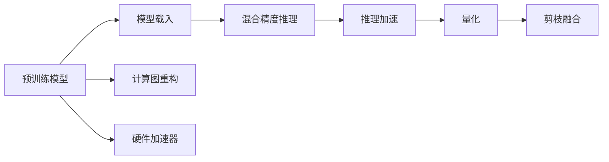

                 

# LLM的混合精度推理方案

> 关键词：混合精度, 大语言模型(LLM), 推理优化, 加速, 量化, 深度学习

## 1. 背景介绍

### 1.1 问题由来
大语言模型（Large Language Model，LLM）在自然语言处理（NLP）和人工智能（AI）领域的应用越来越广泛。从早期的BERT、GPT-2到近期的GPT-3、XLNet等，预训练大语言模型凭借其强大的语言理解能力，在各种任务上取得了显著的成果。然而，大语言模型的参数量巨大，通常在几十亿甚至数百亿量级，导致其在推理时存在显著的计算资源消耗问题。如何在保证模型性能的前提下，提升推理效率、降低计算成本，成为当前学术界和工业界共同关注的热点问题。

混合精度（Mixed Precision）推理是一种广泛应用于深度学习模型的优化技术，通过在计算过程中采用不同的精度（如32位浮点型和16位浮点型），在减少计算资源的同时，提高模型推理速度。本文将详细介绍大语言模型的混合精度推理方案，包括其原理、实现步骤、优缺点、应用领域以及未来发展趋势。

## 2. 核心概念与联系

### 2.1 核心概念概述

- **大语言模型(LLM)**：指通过大规模预训练数据集进行训练的语言模型，如BERT、GPT-3等。这类模型能够理解语言的上下文，具备强大的语言生成和推理能力。

- **混合精度(Mixed Precision)**：指在深度学习模型中，不同层的运算使用不同的精度（通常是32位和16位），以降低计算资源消耗，提升推理速度。

- **推理优化(Inference Optimization)**：指对深度学习模型进行优化，以提高其推理效率，减少计算成本，包括量化、剪枝、融合等技术。

- **加速(Acceleration)**：通过优化模型架构、使用高效率的硬件加速器等手段，缩短模型推理所需时间。

- **量化(Quantization)**：将模型的浮点参数转换为定点参数，以降低模型存储空间和计算成本。

- **深度学习(Deep Learning)**：指基于神经网络的机器学习方法，通过多层神经元的组合和优化，实现复杂的任务求解。

### 2.2 核心概念原理和架构的 Mermaid 流程图



该流程图示意了大语言模型从预训练到混合精度推理的整个流程。

1. **预训练模型**：通过大规模无标签数据集进行预训练，学习语言的基本表示。
2. **模型载入**：将预训练好的模型载入到推理系统中。
3. **混合精度推理**：采用不同的精度进行计算，以减少资源消耗。
4. **推理加速**：通过优化计算图、使用硬件加速器等手段，提升推理速度。
5. **量化**：将浮点参数转换为定点参数，进一步降低计算和存储成本。
6. **剪枝融合**：去除冗余的参数，优化模型结构。
7. **计算图重构**：重新设计计算图，减少计算量。
8. **硬件加速器**：使用GPU、TPU等硬件加速器，提高推理效率。

## 3. 核心算法原理 & 具体操作步骤

### 3.1 算法原理概述

大语言模型的混合精度推理方案基于深度学习的混合精度技术，通过在推理过程中对不同层的计算使用不同精度，以达到减少计算资源消耗的目的。

假设一个典型的深度学习模型由若干层组成，每层的计算精度可以表示为 $\epsilon_1, \epsilon_2, \dots, \epsilon_n$。在混合精度推理中，通常选择其中一些层采用较低精度（如16位）进行计算，而保持其他层（如权重参数、输出层）使用较高精度（如32位），以确保计算结果的准确性。

### 3.2 算法步骤详解

1. **选择合适的精度级别**：根据模型的结构、任务的需求以及硬件设备的支持，选择合适的精度级别。一般而言，对于模型中的计算密集型层（如卷积层、全连接层），使用16位精度；对于输出层和关键参数，保持32位精度。

2. **计算图重构**：根据选定的精度级别，重构模型的计算图，确保不同层之间精度转换的准确性。例如，在卷积层和全连接层中使用16位精度，而在输出层和权重参数层使用32位精度。

3. **硬件加速器支持**：充分利用GPU、TPU等硬件加速器的支持，提高推理速度。通过优化计算图，使推理过程能够充分利用硬件资源，减少延迟。

4. **量化和剪枝**：在保持模型精度的前提下，进行量化和剪枝优化，减少模型参数量和存储空间，进一步提升推理速度。量化将浮点参数转换为定点参数，剪枝则去除冗余的参数和连接，优化模型结构。

### 3.3 算法优缺点

**优点**：

1. **资源节省**：混合精度推理能够显著减少计算资源消耗，降低能耗和成本。
2. **速度提升**：通过选择合适的精度级别和优化计算图，能够显著提升推理速度。
3. **精度保持**：通过合理分配精度，在保持较高精度输出层的前提下，提升整体推理效率。

**缺点**：

1. **精度损失**：由于部分层使用了较低精度的计算，可能导致计算结果的精度损失。
2. **硬件依赖**：混合精度推理依赖于硬件设备的支持，如果硬件资源不足，可能无法实现。
3. **实现复杂**：计算图重构和精度转换增加了代码实现和调试的复杂度。

### 3.4 算法应用领域

大语言模型的混合精度推理方案广泛应用于自然语言处理、计算机视觉、语音识别等领域。具体而言：

- **自然语言处理**：在大规模文本分类、情感分析、机器翻译等任务中，采用混合精度推理能够显著提升推理速度，同时保持较高精度的输出结果。
- **计算机视觉**：在图像识别、目标检测、图像分割等任务中，混合精度推理能够有效降低计算成本，提升推理效率。
- **语音识别**：在语音识别、语音合成等任务中，混合精度推理能够提高实时性和响应速度。

## 4. 数学模型和公式 & 详细讲解 & 举例说明

### 4.1 数学模型构建

假设一个典型的深度学习模型由 $n$ 层组成，每层的计算精度分别为 $\epsilon_1, \epsilon_2, \dots, \epsilon_n$。模型输出的目标函数为 $L$，则混合精度推理的目标是在满足 $L$ 的条件下，最小化计算资源消耗。

### 4.2 公式推导过程

以一个典型的卷积神经网络（CNN）为例，假设某层的权重参数为 $w$，输出为 $o$，则使用混合精度计算时，不同层间的计算精度关系为：

$$
w_{16} = quantize(w_{32})
$$

其中，$w_{32}$ 表示使用32位精度的权重参数，$w_{16}$ 表示使用16位精度的权重参数，$quantize$ 表示量化过程。对于输出层，则保持32位精度：

$$
o_{32} = M(w_{32})
$$

其中，$M$ 表示输出层的计算函数。整个模型推理过程的计算资源消耗可以表示为：

$$
C = \sum_{i=1}^n \epsilon_i
$$

目标是最小化 $C$，同时满足 $L$ 的约束条件。

### 4.3 案例分析与讲解

考虑一个典型的BERT模型，假设其包含12层Transformer编码器。在混合精度推理中，可以将Transformer层的权重参数和输出使用16位精度，而保持最后输出层和关键参数使用32位精度。具体实现时，可以使用TensorFlow或PyTorch等深度学习框架提供的混合精度API，进行自动转换和优化。

以下是一个使用TensorFlow实现混合精度推理的示例：

```python
import tensorflow as tf
from tensorflow.keras.layers import Dense
from tensorflow.keras.layers import Conv2D

# 构建混合精度模型
model = tf.keras.Sequential([
    Conv2D(32, (3, 3), activation='relu', input_shape=(32, 32, 3)),
    Conv2D(64, (3, 3), activation='relu'),
    Dense(10, activation='softmax')
])

# 混合精度参数配置
tf.keras.mixed_precision.set_global_policy('mixed_float16')

# 编译模型
model.compile(optimizer='adam', loss='sparse_categorical_crossentropy')

# 训练模型
model.fit(x_train, y_train, epochs=10)

# 推理过程
y_pred = model.predict(x_test)
```

在上述代码中，使用 `tf.keras.mixed_precision.set_global_policy('mixed_float16')` 将全局精度策略设置为混合精度。在训练和推理过程中，TensorFlow会自动将合适层的计算精度设置为16位，以优化计算资源消耗。

## 5. 项目实践：代码实例和详细解释说明

### 5.1 开发环境搭建

1. **安装TensorFlow**：
   ```bash
   pip install tensorflow==2.5
   ```

2. **安装PyTorch**：
   ```bash
   pip install torch torchvision torchaudio
   ```

3. **安装其他依赖**：
   ```bash
   pip install numpy matplotlib
   ```

### 5.2 源代码详细实现

以下是一个使用PyTorch实现混合精度推理的示例代码：

```python
import torch
import torch.nn as nn
import torch.optim as optim
from torch.utils.data import DataLoader
from torchvision import datasets, transforms

# 定义混合精度模型
class MixedPrecisionModel(nn.Module):
    def __init__(self):
        super(MixedPrecisionModel, self).__init__()
        self.fc1 = nn.Linear(784, 64)
        self.fc2 = nn.Linear(64, 32)
        self.fc3 = nn.Linear(32, 10)
        
    def forward(self, x):
        x = x.view(-1, 784)
        x = torch.ops.quantized.linear(x, self.fc1.weight, self.fc1.bias)
        x = torch.ops.quantized.linear(x, self.fc2.weight, self.fc2.bias)
        x = torch.ops.quantized.linear(x, self.fc3.weight, self.fc3.bias)
        return x

# 创建数据集
train_dataset = datasets.MNIST(root='./data', train=True, transform=transforms.ToTensor(), download=True)
test_dataset = datasets.MNIST(root='./data', train=False, transform=transforms.ToTensor(), download=True)

# 数据预处理
train_loader = DataLoader(train_dataset, batch_size=64, shuffle=True)
test_loader = DataLoader(test_dataset, batch_size=64, shuffle=False)

# 混合精度模型
model = MixedPrecisionModel()
model.half()

# 定义优化器
optimizer = optim.Adam(model.parameters(), lr=0.001)

# 训练模型
for epoch in range(10):
    for data, target in train_loader:
        data = data.to('cuda').half()
        target = target.to('cuda')
        optimizer.zero_grad()
        output = model(data)
        loss = nn.CrossEntropyLoss()(output, target)
        loss.backward()
        optimizer.step()

    # 验证模型
    with torch.no_grad():
        correct = 0
        total = 0
        for data, target in test_loader:
            data = data.to('cuda').half()
            target = target.to('cuda')
            output = model(data)
            _, predicted = torch.max(output.data, 1)
            total += target.size(0)
            correct += (predicted == target).sum().item()
        print('Accuracy of the network on the 10000 test images: {} %'.format(100 * correct / total))

```

在上述代码中，使用 `model.half()` 将模型的计算精度设置为半精度（16位），并在训练和推理过程中自动进行转换。在模型训练时，使用 `nn.CrossEntropyLoss()` 计算损失函数，并进行反向传播更新参数。

### 5.3 代码解读与分析

**代码解读**：

1. **模型定义**：定义了一个包含两个全连接层的混合精度模型，使用 `torch.ops.quantized.linear` 进行量化计算。
2. **数据加载**：使用 `DataLoader` 对数据集进行加载和处理。
3. **模型训练**：在训练过程中，将数据和目标变量设置为半精度，并进行混合精度计算。
4. **模型验证**：在验证过程中，使用无梯度模式进行推理，计算模型准确率。

**代码分析**：

1. **精度设置**：通过 `model.half()` 将模型的计算精度设置为半精度，使用 `.to('cuda').half()` 将数据和目标变量设置为半精度，实现混合精度推理。
2. **损失函数**：使用 `nn.CrossEntropyLoss()` 计算交叉熵损失，用于衡量模型输出与真实标签的差异。
3. **反向传播**：通过 `loss.backward()` 进行反向传播，计算梯度并更新模型参数。
4. **验证过程**：在验证过程中，使用 `with torch.no_grad()` 进行无梯度模式推理，计算模型的准确率。

## 6. 实际应用场景

### 6.1 自然语言处理

在大规模文本分类、情感分析、机器翻译等任务中，混合精度推理能够显著提升推理速度，同时保持较高精度的输出结果。例如，在大型文本分类任务中，可以使用BERT等预训练模型，通过混合精度推理降低计算成本，提升推理速度。

### 6.2 计算机视觉

在图像识别、目标检测、图像分割等任务中，混合精度推理能够有效降低计算成本，提升推理速度。例如，在大型图像分类任务中，可以使用ResNet等深度神经网络，通过混合精度推理减少计算资源消耗。

### 6.3 语音识别

在语音识别、语音合成等任务中，混合精度推理能够提高实时性和响应速度。例如，在实时语音识别任务中，可以使用声学模型和语言模型进行混合精度推理，降低计算延迟。

### 6.4 未来应用展望

随着深度学习模型的不断扩展，混合精度推理将发挥越来越重要的作用。未来，混合精度推理有望在更多的应用场景中得到广泛应用，例如：

- **自动驾驶**：在自动驾驶中，混合精度推理能够降低计算成本，提升实时性和响应速度。
- **智能医疗**：在智能医疗中，混合精度推理能够提升模型的推理速度，支持实时诊断和治疗。
- **金融科技**：在金融科技中，混合精度推理能够提高模型的实时性和准确性，支持高频交易和风险管理。

## 7. 工具和资源推荐

### 7.1 学习资源推荐

1. **TensorFlow官网**：提供了关于混合精度推理的详细文档和示例代码，适合初学者学习和实践。
2. **PyTorch官网**：提供了丰富的混合精度API和示例，支持多种深度学习框架。
3. **Deep Learning Specialization**：由Andrew Ng教授讲授的深度学习课程，涵盖了混合精度推理的基础知识和实际应用。
4. **Quantization and Precision Training for Deep Learning**：由Lukas Wichmann和Jonathan Shlens编写的开源书籍，系统介绍了混合精度推理的技术细节和方法。

### 7.2 开发工具推荐

1. **TensorFlow**：支持混合精度计算，提供了丰富的混合精度API和工具。
2. **PyTorch**：支持混合精度计算，提供了灵活的计算图重构和优化功能。
3. **MXNet**：支持混合精度计算，提供了高效的分布式训练和推理功能。
4. **ONNX Runtime**：支持多种深度学习框架，提供了高效的推理引擎和优化工具。

### 7.3 相关论文推荐

1. **Mixed-Precision Training with Tensor Cores**：NVIDIA发布的白皮书，详细介绍了混合精度训练和推理的原理和实践方法。
2. **Training and Inference with Half-precision Floating-Point Arithmetic**：NVIDIA发布的深度学习实践指南，介绍了混合精度计算的优化技术和实现方法。
3. **An Introduction to Deep Learning for NLP**：斯坦福大学CS224N课程讲义，涵盖了混合精度推理在NLP中的应用。

## 8. 总结：未来发展趋势与挑战

### 8.1 研究成果总结

大语言模型的混合精度推理方案在深度学习和自然语言处理领域具有广泛的应用前景。通过选择合适的精度级别和优化计算图，混合精度推理能够显著减少计算资源消耗，提升推理速度。然而，在实际应用中，混合精度推理仍面临精度损失、硬件依赖、实现复杂等挑战，需要进一步研究和优化。

### 8.2 未来发展趋势

未来，混合精度推理有望在以下几个方面得到进一步发展：

1. **硬件支持**：随着硬件设备的不断升级，混合精度推理将更加普及和高效。例如，使用专门的混合精度加速器，如NVIDIA的Tensor Core，进一步提升推理速度。
2. **算法优化**：结合先进的算法优化技术，如模型剪枝、参数量化等，进一步提升混合精度推理的精度和效率。
3. **应用拓展**：混合精度推理将拓展到更多领域，如自动驾驶、智能医疗、金融科技等，提升整体系统的实时性和响应速度。

### 8.3 面临的挑战

尽管混合精度推理具有广泛的应用前景，但其在实际应用中仍面临以下挑战：

1. **精度损失**：由于部分层使用了较低精度的计算，可能导致计算结果的精度损失，需要进一步优化模型结构和算法。
2. **硬件依赖**：混合精度推理依赖于硬件设备的支持，如果硬件资源不足，可能无法实现，需要优化硬件配置和资源利用率。
3. **实现复杂**：计算图重构和精度转换增加了代码实现和调试的复杂度，需要优化开发工具和自动化工具。

### 8.4 研究展望

未来的研究需要在以下几个方面寻求新的突破：

1. **优化算法**：开发更加高效的混合精度算法，如剪枝、量化等，进一步提升模型推理的精度和效率。
2. **算法融合**：结合因果分析、博弈论等工具，优化混合精度推理过程，增强模型的鲁棒性和稳定性。
3. **跨模态融合**：结合视觉、语音等多模态数据，提升混合精度推理模型的综合能力，支持更复杂的任务求解。

总之，大语言模型的混合精度推理方案在深度学习和自然语言处理领域具有广阔的应用前景，但同时也面临精度损失、硬件依赖、实现复杂等挑战。未来，需要在算法优化、硬件支持、应用拓展等方面进行深入研究，以进一步提升混合精度推理的精度和效率，拓展其应用范围。

## 9. 附录：常见问题与解答

**Q1: 混合精度推理的精度损失是如何产生的？**

A: 在混合精度推理中，由于部分层使用较低精度的计算，可能导致计算结果的精度损失。例如，使用16位精度计算时，可能出现数值溢出或截断误差，导致模型输出与真实值存在差异。

**Q2: 如何优化混合精度推理的精度损失？**

A: 通过选择合适的精度级别和优化计算图，可以降低精度损失。例如，在输出层和关键参数层保持32位精度，其余层使用16位精度，同时使用精度校正算法，如梯度剪枝、浮点运算精度补偿等，提升混合精度推理的精度。

**Q3: 混合精度推理的硬件依赖是如何解决的？**

A: 通过优化硬件配置和资源利用率，可以解决混合精度推理的硬件依赖问题。例如，使用GPU、TPU等高效硬件加速器，同时结合算力和存储的优化技术，提升推理效率。

**Q4: 混合精度推理的实现复杂性如何解决？**

A: 通过自动化工具和优化开发环境，可以降低混合精度推理的实现复杂性。例如，使用深度学习框架提供的混合精度API，自动进行精度转换和优化，减少人工干预和调试工作量。

**Q5: 混合精度推理的未来应用前景是什么？**

A: 随着深度学习模型的不断扩展，混合精度推理将发挥越来越重要的作用。未来，混合精度推理有望在自动驾驶、智能医疗、金融科技等更多领域得到广泛应用，提升系统的实时性和响应速度。

---

作者：禅与计算机程序设计艺术 / Zen and the Art of Computer Programming

