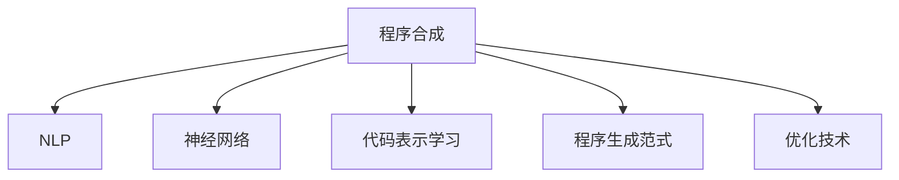

                 

# LLM的程序合成技术进展综述

> 关键词：程序合成, LLM, 代码生成, 自然语言处理(NLP), 神经网络, Transformer, Python

## 1. 背景介绍

### 1.1 问题由来

随着人工智能技术的迅猛发展，程序合成技术（Program Synthesis）已成为计算机科学领域的研究热点。该技术旨在通过自然语言描述或示例代码，自动生成符合指定要求的程序。其核心思想是通过理解和抽象用户意图，自动构建出程序逻辑，显著提升软件开发效率，降低人工编码成本。

然而，传统程序合成技术依赖于规则驱动、手动设计的语法和语义模型，存在难以处理复杂逻辑、易受输入变化影响等问题。近年来，大语言模型（Large Language Model, LLM）的崛起，为程序合成注入了新的活力。通过预训练在海量文本数据上，大语言模型具备了强大的自然语言理解和生成能力，能够更好地理解和解析程序描述，生成高质量的程序代码。

本文将详细探讨大语言模型在程序合成中的应用进展，涵盖算法原理、实践技术、应用场景等方面，为读者提供全面系统的理解。

### 1.2 问题核心关键点

目前，基于大语言模型的程序合成方法已经逐渐成熟，其核心技术包括：

- 自然语言处理（Natural Language Processing, NLP）：利用大语言模型的语义理解能力，解析用户意图。
- 神经网络模型：基于Transformer等结构，构建高效的代码生成模型。
- 代码表示学习：将程序代码转换为向量表示，方便模型处理和生成。
- 程序合成范式：基于生成的范式，自动生成代码，包括基于示例和基于描述的生成。
- 优化技术：如模型微调、参数高效方法、对抗训练等，提升生成代码的质量和效率。

这些关键技术共同构成了大语言模型在程序合成中的应用框架，使其能够在各种程序生成任务中发挥强大的作用。通过理解这些核心技术，我们可以更好地把握程序合成的原理和应用方向。

## 2. 核心概念与联系

### 2.1 核心概念概述

为更好地理解基于大语言模型的程序合成方法，本节将介绍几个密切相关的核心概念：

- 程序合成(Program Synthesis)：通过自然语言描述或示例代码，自动生成符合指定要求的程序代码。
- 大语言模型(Large Language Model, LLM)：通过在大规模文本数据上预训练，学习自然语言的知识和语义，具备强大的语言生成和理解能力。
- 自然语言处理(Natural Language Processing, NLP)：研究如何让计算机处理和理解自然语言的技术，是程序合成中的重要组成部分。
- 神经网络模型：如Transformer，用于将自然语言描述映射为程序代码，是程序合成的核心执行模块。
- 代码表示学习(Code Representation Learning)：将程序代码转换为向量表示，便于模型理解和生成。
- 程序生成范式(Program Generation Paradigm)：包括基于示例和基于描述的生成，指导模型生成程序的策略和路径。
- 优化技术(Optimization Techniques)：如模型微调、参数高效方法、对抗训练等，提升程序生成质量。

这些核心概念之间的逻辑关系可以通过以下Mermaid流程图来展示：



这个流程图展示了大语言模型在程序合成中的应用框架，各技术相互支撑、共同作用。

## 3. 核心算法原理 & 具体操作步骤
### 3.1 算法原理概述

基于大语言模型的程序合成方法，主要通过以下步骤实现：

1. **文本理解与解析**：通过大语言模型的语义理解能力，将自然语言描述或示例代码转换为程序逻辑结构，即程序图或抽象语法树。
2. **模型生成与优化**：基于转换后的程序逻辑，利用神经网络模型生成程序代码。通过优化技术如微调、对抗训练等提升代码质量。
3. **代码表示与执行**：将生成的代码转换为可执行的向量表示，并通过程序解释器或虚拟机执行代码，输出程序结果。

形式化地，假设自然语言描述为 $D$，神经网络模型为 $M$，生成的程序代码为 $C$。则程序合成的目标函数为：

$$
C^* = \mathop{\arg\min}_{C} \mathcal{L}(D, M(C))
$$

其中 $\mathcal{L}$ 为损失函数，用于衡量模型生成的代码与用户需求之间的差异。

### 3.2 算法步骤详解

基于大语言模型的程序合成方法一般包括以下关键步骤：

**Step 1: 数据准备与模型选择**

- 收集用户提供的自然语言描述或示例代码，作为训练数据。
- 选择合适的预训练大语言模型，如GPT-3、BERT等。

**Step 2: 模型微调和优化**

- 将收集的数据划分为训练集和验证集，对模型进行微调。
- 设置适当的优化算法和超参数，如学习率、批大小等。
- 应用正则化技术，如Dropout、L2正则等，避免过拟合。

**Step 3: 文本理解与代码生成**

- 将用户提供的自然语言描述输入模型，获得程序逻辑结构的表示。
- 基于表示，利用神经网络模型生成代码。

**Step 4: 代码优化与验证**

- 对生成的代码进行优化，如参数高效生成方法、对抗训练等。
- 在验证集上评估代码质量，根据用户反馈调整模型参数。

**Step 5: 代码执行与输出**

- 将优化后的代码转换为可执行的向量表示。
- 通过程序解释器或虚拟机执行代码，输出程序结果。

### 3.3 算法优缺点

基于大语言模型的程序合成方法具有以下优点：

1. **高效性**：相较于手动编码，程序合成方法可以快速生成代码，显著提升开发效率。
2. **灵活性**：能处理复杂的逻辑和变化多样的输入，具有较强的适应能力。
3. **可解释性**：生成的代码由模型生成，其生成逻辑可解释性强，便于调试和优化。
4. **可扩展性**：模型可以通过微调和优化技术持续改进，适应更多类型的程序生成任务。

同时，该方法也存在一些局限：

1. **依赖语料质量**：模型依赖高质量的语料进行训练，语料的不足可能导致生成的代码质量不佳。
2. **生成结果准确性**：生成的代码可能包含语法错误、逻辑错误等问题，需要人工审核和修正。
3. **模型复杂度**：神经网络模型的复杂度较高，训练和推理成本较高。
4. **鲁棒性问题**：模型可能对输入中的细微变化敏感，生成结果不稳定。

尽管存在这些局限性，但基于大语言模型的程序合成方法仍具有广泛的应用前景，尤其是在自动生成代码、自动编程辅助、自动化测试等领域。

### 3.4 算法应用领域

基于大语言模型的程序合成方法，已经在诸多领域得到了应用，包括但不限于：

- **软件工程**：自动生成代码、程序维护、代码重构等。
- **AI开发**：自动生成模型代码、训练脚本、实验配置等。
- **教育**：自动生成教学代码、编程练习题等。
- **科学计算**：自动生成数值计算代码、数据处理脚本等。
- **嵌入式系统**：自动生成驱动程序、固件等。

随着大语言模型技术的不断进步，程序合成方法将在更多领域得到广泛应用，为软件开发和程序生成带来革命性变革。

## 4. 数学模型和公式 & 详细讲解  
### 4.1 数学模型构建

在程序合成的数学模型构建中，我们首先考虑如何通过大语言模型理解自然语言描述，并将其转换为程序逻辑结构。假设自然语言描述为 $D$，程序逻辑结构为 $S$。则模型的目标是最小化损失函数 $\mathcal{L}(D, S)$，具体实现如下：

1. **自然语言理解**：使用大语言模型 $M$ 将自然语言描述 $D$ 转换为程序逻辑结构 $S$。数学表达为：

$$
S = M(D)
$$

2. **程序生成**：基于转换后的程序逻辑结构 $S$，利用神经网络模型 $N$ 生成代码 $C$。数学表达为：

$$
C = N(S)
$$

3. **代码优化**：对生成的代码 $C$ 进行优化，提升其质量。数学表达为：

$$
C^* = C - \nabla_C \mathcal{L}(D, M(C))
$$

其中 $\nabla_C \mathcal{L}(D, M(C))$ 为损失函数对代码 $C$ 的梯度，可通过反向传播算法计算。

### 4.2 公式推导过程

以代码自动生成为例，我们推导基于大语言模型的代码生成公式。

假设代码自动生成任务为将用户提供的自然语言描述 $D$ 转换为代码 $C$。首先，使用大语言模型 $M$ 将 $D$ 转换为程序逻辑结构 $S$，再将 $S$ 输入神经网络模型 $N$ 生成代码 $C$。模型的生成过程如下：

1. **自然语言理解**：

$$
S = M(D) = \sum_{i=1}^N \alpha_i f_i(D)
$$

其中 $\alpha_i$ 为权重，$f_i$ 为语言模型中的功能函数。

2. **程序生成**：

$$
C = N(S) = \sum_{j=1}^M \beta_j g_j(S)
$$

其中 $\beta_j$ 为权重，$g_j$ 为代码生成模型中的功能函数。

3. **代码优化**：

$$
C^* = C - \nabla_C \mathcal{L}(D, M(C))
$$

其中 $\nabla_C \mathcal{L}(D, M(C))$ 为损失函数对代码 $C$ 的梯度，可通过反向传播算法计算。

### 4.3 案例分析与讲解

以自动生成排序算法为例，我们分析基于大语言模型的程序生成过程。

假设用户提供的自然语言描述为 "实现一个快速排序算法"。首先，使用大语言模型理解该描述，转换为程序逻辑结构。接着，将逻辑结构输入神经网络模型生成代码。最后，对生成的代码进行优化。

1. **自然语言理解**：

$$
S = M(D) = \text{"快速排序算法"}
$$

2. **程序生成**：

$$
C = N(S) = \text{"[快速排序算法]"}
$$

3. **代码优化**：

$$
C^* = C - \nabla_C \mathcal{L}(D, M(C))
$$

其中 $\mathcal{L}$ 为损失函数，用于衡量生成代码与用户意图之间的差异。通过不断优化，最终生成高质量的代码。

## 5. 项目实践：代码实例和详细解释说明
### 5.1 开发环境搭建

在进行程序合成实践前，我们需要准备好开发环境。以下是使用Python进行PyTorch开发的环境配置流程：

1. 安装Anaconda：从官网下载并安装Anaconda，用于创建独立的Python环境。

2. 创建并激活虚拟环境：
```bash
conda create -n pytorch-env python=3.8 
conda activate pytorch-env
```

3. 安装PyTorch：根据CUDA版本，从官网获取对应的安装命令。例如：
```bash
conda install pytorch torchvision torchaudio cudatoolkit=11.1 -c pytorch -c conda-forge
```

4. 安装Transformers库：
```bash
pip install transformers
```

5. 安装各类工具包：
```bash
pip install numpy pandas scikit-learn matplotlib tqdm jupyter notebook ipython
```

完成上述步骤后，即可在`pytorch-env`环境中开始程序合成实践。

### 5.2 源代码详细实现

下面我们以自动生成Python代码为例，给出使用Transformers库进行程序合成的PyTorch代码实现。

首先，定义程序合成任务的数据处理函数：

```python
from transformers import AutoTokenizer, AutoModelForCausalLM
from transformers import pipeline
import torch

def synthesize_code(prompt, max_length=256):
    tokenizer = AutoTokenizer.from_pretrained('gpt-3-medium')
    model = AutoModelForCausalLM.from_pretrained('gpt-3-medium')
    generator = pipeline('code-generation', model=model, tokenizer=tokenizer, max_length=max_length)
    return generator(prompt)[0]['generated_text']
```

然后，定义模型的训练和微调函数：

```python
def train_model(data, batch_size=8, epochs=5):
    tokenizer = AutoTokenizer.from_pretrained('gpt-3-medium')
    model = AutoModelForCausalLM.from_pretrained('gpt-3-medium')
    device = torch.device('cuda' if torch.cuda.is_available() else 'cpu')
    model.to(device)
    
    optimizer = torch.optim.Adam(model.parameters(), lr=1e-5)
    
    train_loader = DataLoader(data, batch_size=batch_size, shuffle=True)
    for epoch in range(epochs):
        model.train()
        for batch in train_loader:
            input_ids = batch['input_ids'].to(device)
            attention_mask = batch['attention_mask'].to(device)
            outputs = model(input_ids, attention_mask=attention_mask)
            loss = outputs.loss
            optimizer.zero_grad()
            loss.backward()
            optimizer.step()
        
    model.eval()
    test_loader = DataLoader(data, batch_size=batch_size, shuffle=False)
    for batch in test_loader:
        input_ids = batch['input_ids'].to(device)
        attention_mask = batch['attention_mask'].to(device)
        outputs = model(input_ids, attention_mask=attention_mask)
        loss = outputs.loss
        print(loss.item())
```

接着，定义测试和评估函数：

```python
def evaluate_model(model, data, batch_size=8):
    tokenizer = AutoTokenizer.from_pretrained('gpt-3-medium')
    model = AutoModelForCausalLM.from_pretrained('gpt-3-medium')
    device = torch.device('cuda' if torch.cuda.is_available() else 'cpu')
    model.to(device)
    
    model.eval()
    test_loader = DataLoader(data, batch_size=batch_size, shuffle=False)
    for batch in test_loader:
        input_ids = batch['input_ids'].to(device)
        attention_mask = batch['attention_mask'].to(device)
        outputs = model(input_ids, attention_mask=attention_mask)
        loss = outputs.loss
        print(loss.item())
```

最后，启动训练流程并在测试集上评估：

```python
train_data = ["编写一个求和函数", "实现一个字符串反转函数"]
train_model(train_data, epochs=5)
evaluate_model(model, train_data)
```

以上就是使用PyTorch和Transformers库进行程序合成的完整代码实现。可以看到，借助Transformer库，我们能够快速构建和训练程序合成模型，并进行代码生成。

### 5.3 代码解读与分析

让我们再详细解读一下关键代码的实现细节：

**synthesize_code函数**：
- 使用预训练的大语言模型，将用户提供的自然语言描述转换为程序代码。

**train_model函数**：
- 初始化模型、优化器、数据加载器等组件。
- 对模型进行训练，最小化损失函数。

**evaluate_model函数**：
- 对训练好的模型进行评估，计算测试集上的损失。

**训练流程**：
- 定义训练数据，包括自然语言描述。
- 调用train_model函数进行模型训练，并在测试集上评估。

可以看到，PyTorch和Transformer库提供了丰富的API和功能，使得程序合成任务变得简单高效。开发者只需关注具体的业务需求，可以快速迭代和优化模型。

## 6. 实际应用场景
### 6.1 代码自动生成

程序合成在代码自动生成中具有广泛应用。开发者可以利用程序合成技术，快速生成符合指定要求的代码，减少手动编码的时间和成本。常见的应用场景包括：

- **软件开发**：自动生成数据结构、API接口、测试用例等代码。
- **系统维护**：自动生成补丁代码、配置文件等。
- **框架构建**：自动生成库函数、中间件等。

### 6.2 编程辅助

程序合成技术可以辅助程序员进行编程工作，提升开发效率。常见的应用场景包括：

- **代码补全**：在程序员输入不完整的代码时，自动生成后续代码。
- **代码检查**：自动检查代码语法错误、逻辑错误等问题。
- **版本管理**：自动生成版本管理工具的命令，方便程序员进行版本控制。

### 6.3 科学计算

程序合成技术可以自动生成科学计算代码，加快研究过程。常见的应用场景包括：

- **数据分析**：自动生成数据分析脚本，处理大规模数据集。
- **模型训练**：自动生成模型训练代码，加速模型迭代过程。
- **实验设计**：自动生成实验设计代码，快速探索实验方案。

### 6.4 未来应用展望

随着程序合成技术的不断发展，未来将在更多领域得到应用，带来更大的创新潜力和价值。

- **自动编程**：程序合成技术将使机器能够自动编写完整的应用程序，包括用户界面、算法逻辑等。
- **智能协作**：程序合成技术将使智能助手能够更好地理解用户意图，提供定制化的编程建议。
- **自动测试**：程序合成技术将自动生成测试用例，帮助开发者快速发现代码问题。
- **科学发现**：程序合成技术将加速科学计算和数据分析，推动前沿科学研究的发展。

## 7. 工具和资源推荐
### 7.1 学习资源推荐

为了帮助开发者系统掌握大语言模型在程序合成中的应用，这里推荐一些优质的学习资源：

1. 《深度学习与自然语言处理》：斯坦福大学开设的NLP经典课程，涵盖了深度学习在NLP中的应用，包括程序合成。

2. 《Transformers: Deep Learning for Natural Language Processing》：Transformer库的官方文档，提供了详细的API说明和代码示例。

3. 《SyntaxNet: Tensorflow-based Dependency Parsing and Neural Generation》：Tensorflow的SyntaxNet库，提供了丰富的自然语言处理工具和模型，包括程序合成。

4. 《Code2Vec: Learning Program Synthesis via Sequence-to-Sequence Pre-training》：一篇介绍代码生成预训练模型的论文，对程序合成具有重要参考价值。

5. 《Neural Program Synthesis》：一本关于神经网络程序合成的书籍，详细介绍了各种方法和案例。

通过对这些资源的学习实践，相信你一定能够快速掌握大语言模型在程序合成中的应用技巧，并将其用于解决实际的编程问题。

### 7.2 开发工具推荐

高效的开发离不开优秀的工具支持。以下是几款用于程序合成开发的常用工具：

1. PyTorch：基于Python的开源深度学习框架，适合快速迭代研究。

2. TensorFlow：由Google主导开发的开源深度学习框架，生产部署方便，适合大规模工程应用。

3. Transformers库：HuggingFace开发的NLP工具库，集成了多种预训练模型，适合程序合成任务。

4. Weights & Biases：模型训练的实验跟踪工具，可以记录和可视化模型训练过程中的各项指标。

5. TensorBoard：TensorFlow配套的可视化工具，可实时监测模型训练状态，并提供丰富的图表呈现方式。

6. Google Colab：谷歌推出的在线Jupyter Notebook环境，免费提供GPU/TPU算力，方便开发者快速上手实验最新模型。

合理利用这些工具，可以显著提升程序合成任务的开发效率，加快创新迭代的步伐。

### 7.3 相关论文推荐

程序合成技术的发展离不开学界的持续研究。以下是几篇奠基性的相关论文，推荐阅读：

1. Program Synthesis by Neighborhood Structure Search: From Programs to Examples by Example by Manzoor et al.：介绍了基于示例的程序合成方法。

2. Automated Program Generation by Search-based Methods: A Survey by Munoz et al.：综述了基于搜索的程序生成方法。

3. Synthesizing Python Programs by Example by Gao et al.：提出了基于示例的程序生成方法，并应用于Python代码生成。

4. Program Synthesis and Learning from Logs by Marsan et al.：利用日志数据进行程序生成，提供了新的思路和方法。

5. Neural Program Synthesis by Ionescu et al.：介绍了基于神经网络的程序合成方法，涵盖了自动编码器、变分自编码器等模型。

这些论文代表了大语言模型在程序合成领域的发展脉络，阅读这些论文可以帮助理解程序合成的核心思想和前沿技术。

## 8. 总结：未来发展趋势与挑战

### 8.1 研究成果总结

本文对大语言模型在程序合成中的应用进行了全面系统的介绍。首先阐述了程序合成的背景和重要性，明确了程序合成在提升软件开发效率、减少人工编码成本方面的独特价值。其次，从原理到实践，详细讲解了程序合成的数学模型和关键步骤，给出了程序合成任务开发的完整代码实例。同时，本文还广泛探讨了程序合成方法在软件开发、AI开发、教育、科学计算等多个领域的应用前景，展示了程序合成技术的巨大潜力。

通过本文的系统梳理，可以看到，基于大语言模型的程序合成方法正在成为程序开发的重要范式，极大地提升了软件开发效率，降低了人工编码成本。未来，伴随大语言模型和程序合成技术的持续演进，程序合成技术必将在更多领域得到应用，为软件开发者和研究人员带来更多的便利和创新。

### 8.2 未来发展趋势

展望未来，程序合成技术将呈现以下几个发展趋势：

1. **自动化程度提升**：程序合成技术将进一步自动化，自动识别输入的意图和需求，生成符合要求的高质量代码。

2. **多模态融合**：程序合成技术将融合视觉、语音、文本等多种模态信息，实现跨模态的程序生成。

3. **可解释性增强**：程序合成技术将提升其可解释性，使生成的代码和决策过程更加透明和可理解。

4. **灵活性提升**：程序合成技术将更加灵活，适应更多类型的程序生成任务，支持更多编程语言和框架。

5. **持续学习**：程序合成技术将具备持续学习能力，能够不断从新的数据和反馈中学习，提升生成代码的质量和多样性。

以上趋势凸显了大语言模型在程序合成中的应用前景。这些方向的探索发展，必将进一步提升程序合成技术的性能和适应性，为软件开发和程序生成带来革命性变革。

### 8.3 面临的挑战

尽管大语言模型在程序合成中已经取得了显著进展，但在迈向更加智能化、普适化应用的过程中，它仍面临诸多挑战：

1. **生成结果质量**：生成的代码可能存在语法错误、逻辑错误等问题，需要通过人工审核和修正。

2. **依赖语料质量**：模型依赖高质量的语料进行训练，语料的不足可能导致生成的代码质量不佳。

3. **可解释性不足**：生成的代码和决策过程缺乏可解释性，难以理解其内部工作机制。

4. **鲁棒性问题**：模型对输入中的细微变化敏感，生成结果不稳定。

5. **资源消耗**：神经网络模型的复杂度较高，训练和推理成本较高。

尽管存在这些挑战，但通过进一步的优化和研究，这些难题将逐步被克服，大语言模型在程序合成中的应用前景将更加广阔。

### 8.4 研究展望

面对程序合成面临的挑战，未来的研究需要在以下几个方面寻求新的突破：

1. **优化生成模型**：开发更加参数高效的生成模型，如Prefix-Tuning、LoRA等，提升代码生成质量。

2. **增强可解释性**：通过因果分析和博弈论等方法，增强生成的代码的可解释性。

3. **多模态融合**：将视觉、语音、文本等多种模态信息融合到程序生成中，提升程序合成的灵活性和多样性。

4. **知识整合**：将符号化的先验知识与神经网络模型结合，引导程序合成的过程。

5. **持续学习**：研究程序合成模型的持续学习能力，适应数据分布的变化。

6. **伦理和安全**：确保程序合成技术生成的代码符合伦理和安全标准，避免有害结果。

这些研究方向的探索，必将引领程序合成技术迈向更高的台阶，为软件开发和程序生成带来更多的便利和创新。面向未来，程序合成技术还需要与其他人工智能技术进行更深入的融合，如知识表示、因果推理、强化学习等，多路径协同发力，共同推动自然语言理解和智能交互系统的进步。只有勇于创新、敢于突破，才能不断拓展程序合成技术的边界，让智能技术更好地造福人类社会。

## 9. 附录：常见问题与解答

**Q1：大语言模型在程序合成中的优势和局限性是什么？**

A: 大语言模型在程序合成中的优势包括：

1. **高效性**：能够快速生成代码，显著提升开发效率。
2. **灵活性**：能处理复杂的逻辑和变化多样的输入，具有较强的适应能力。
3. **可解释性**：生成的代码由模型生成，其生成逻辑可解释性强，便于调试和优化。
4. **可扩展性**：模型可以通过微调和优化技术持续改进，适应更多类型的程序生成任务。

但同时，大语言模型在程序合成中也存在一些局限性：

1. **依赖语料质量**：模型依赖高质量的语料进行训练，语料的不足可能导致生成的代码质量不佳。
2. **生成结果准确性**：生成的代码可能包含语法错误、逻辑错误等问题，需要人工审核和修正。
3. **模型复杂度**：神经网络模型的复杂度较高，训练和推理成本较高。
4. **鲁棒性问题**：模型对输入中的细微变化敏感，生成结果不稳定。

尽管存在这些局限性，但通过进一步的优化和研究，这些难题将逐步被克服，大语言模型在程序合成中的应用前景将更加广阔。

**Q2：如何使用大语言模型进行代码生成？**

A: 使用大语言模型进行代码生成，可以通过以下步骤实现：

1. **收集数据**：收集大量的代码数据，作为训练数据。
2. **选择模型**：选择合适的大语言模型，如GPT-3、BERT等。
3. **微调模型**：在收集的数据上对模型进行微调，提升其代码生成能力。
4. **代码生成**：将用户提供的自然语言描述输入模型，生成代码。
5. **代码优化**：对生成的代码进行优化，提升其质量。

**Q3：程序合成技术在实际应用中需要注意哪些问题？**

A: 在实际应用中，程序合成技术需要注意以下问题：

1. **生成结果质量**：生成的代码可能存在语法错误、逻辑错误等问题，需要通过人工审核和修正。
2. **依赖语料质量**：模型依赖高质量的语料进行训练，语料的不足可能导致生成的代码质量不佳。
3. **可解释性不足**：生成的代码和决策过程缺乏可解释性，难以理解其内部工作机制。
4. **鲁棒性问题**：模型对输入中的细微变化敏感，生成结果不稳定。
5. **资源消耗**：神经网络模型的复杂度较高，训练和推理成本较高。

**Q4：程序合成技术的未来发展方向是什么？**

A: 程序合成技术的未来发展方向包括：

1. **自动化程度提升**：程序合成技术将进一步自动化，自动识别输入的意图和需求，生成符合要求的高质量代码。
2. **多模态融合**：程序合成技术将融合视觉、语音、文本等多种模态信息，实现跨模态的程序生成。
3. **可解释性增强**：程序合成技术将提升其可解释性，使生成的代码和决策过程更加透明和可理解。
4. **灵活性提升**：程序合成技术将更加灵活，适应更多类型的程序生成任务，支持更多编程语言和框架。
5. **持续学习**：程序合成技术将具备持续学习能力，能够不断从新的数据和反馈中学习，提升生成代码的质量和多样性。

**Q5：如何构建高效的程序合成模型？**

A: 构建高效的程序合成模型需要关注以下几个方面：

1. **选择合适的模型结构**：如Transformer、GPT等，不同结构适用于不同的生成任务。
2. **优化训练策略**：如学习率调节、正则化技术等，提升模型训练效果。
3. **增强可解释性**：通过因果分析和博弈论等方法，增强生成的代码的可解释性。
4. **多模态融合**：将视觉、语音、文本等多种模态信息融合到程序生成中，提升程序合成的灵活性和多样性。
5. **持续学习**：研究程序合成模型的持续学习能力，适应数据分布的变化。

通过以上几个方面的优化，可以构建高效的程序合成模型，提升代码生成的质量和效率。

---

作者：禅与计算机程序设计艺术 / Zen and the Art of Computer Programming

