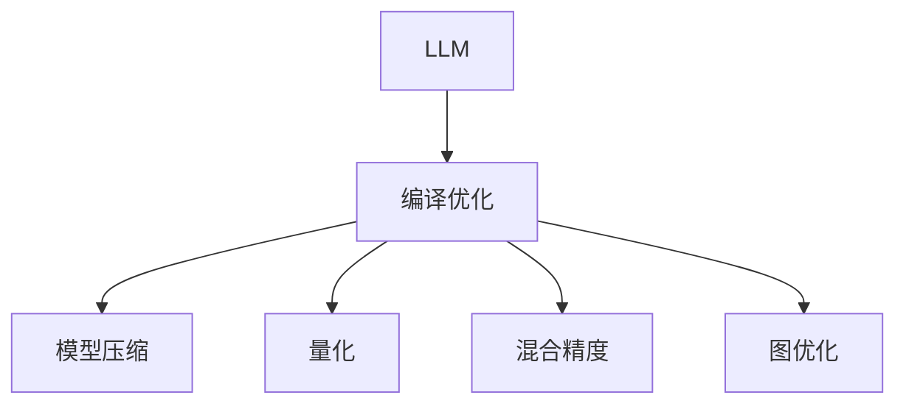

                 

# LLM的编译优化技术进展

> 关键词：编译优化,LLM,深度学习,优化器,量化,混合精度,图优化

## 1. 背景介绍

### 1.1 问题由来
近年来，随着深度学习技术的快速发展，大规模语言模型(Large Language Model, LLM)在自然语言处理(Natural Language Processing, NLP)领域取得了巨大的突破。这些大模型通过在海量无标签文本数据上进行预训练，学习到了丰富的语言知识和常识，可以通过少量的有标签样本在下游任务上进行微调，获得优异的性能。然而，由于模型参数量巨大，往往需要大量的计算资源和内存，限制了其在大规模分布式系统中的应用。因此，如何有效地编译和优化这些模型，使其能够在计算资源有限的实际环境中高效运行，成为了当前深度学习研究的热点问题。

### 1.2 问题核心关键点
编译优化技术的核心在于，如何通过软件层面的改进，提升深度学习模型的运行效率。在深度学习领域，编译优化包括模型压缩、量化、混合精度、图优化等多种技术。而在大规模语言模型上，编译优化更是显得尤为重要。在本文中，我们聚焦于LLM的编译优化技术进展，将介绍LLM的编译过程、优化策略以及实际应用场景。

### 1.3 问题研究意义
研究LLM的编译优化技术，对于拓展大模型的应用范围，提升下游任务的性能，加速NLP技术的产业化进程，具有重要意义：

1. 降低应用开发成本。编译优化能够显著减少大模型在分布式系统中的计算和存储需求，从而降低应用开发和维护成本。
2. 提升模型效果。编译优化使得模型能够更好地适应特定的硬件和软件环境，从而获得更优的运行效果。
3. 加速开发进度。standing on the shoulders of giants，编译优化技术为LLM的应用开发提供了有力的支持，缩短了开发周期。
4. 带来技术创新。编译优化领域的研究推动了深度学习模型的进一步发展和优化，催生了更多的创新研究方向。
5. 赋能产业升级。编译优化技术能够提升深度学习模型的计算效率，为传统行业数字化转型升级提供新的技术路径。

## 2. 核心概念与联系

### 2.1 核心概念概述

为更好地理解LLM的编译优化技术，本节将介绍几个密切相关的核心概念：

- LLM: 以自回归(如GPT)或自编码(如BERT)模型为代表的大规模预训练语言模型。通过在大规模无标签文本语料上进行预训练，学习到了丰富的语言知识和常识，具备强大的语言理解和生成能力。

- 编译优化(Compilation Optimization): 通过软件层面的改进，提升深度学习模型的运行效率，包括模型压缩、量化、混合精度、图优化等多种技术。

- 模型压缩(Model Compression): 通过减少模型参数量和计算量，提升深度学习模型的计算效率和存储效率。

- 量化(Quantization): 将深度学习模型的参数和计算量转化为低精度数值，从而减少计算资源和存储空间的需求。

- 混合精度(Mixed Precision): 在深度学习模型训练和推理过程中，使用不同精度的数据类型，以提高计算效率和存储效率。

- 图优化(Graph Optimization): 通过对计算图进行优化，减少深度学习模型的计算量和存储空间需求。

这些核心概念之间的逻辑关系可以通过以下Mermaid流程图来展示：



这个流程图展示了大语言模型的核心概念及其之间的关系：

1. LLM通过预训练获得基础能力。
2. 编译优化包括多种技术，通过软件层面的改进，提升模型的运行效率。
3. 模型压缩、量化、混合精度、图优化等技术，都是编译优化的具体实现手段。

这些概念共同构成了大语言模型的编译优化框架，使其能够在各种场景下发挥强大的语言理解和生成能力。通过理解这些核心概念，我们可以更好地把握LLM的编译优化技术工作原理和优化方向。

## 3. 核心算法原理 & 具体操作步骤
### 3.1 算法原理概述

LLM的编译优化技术主要通过软件层面的改进，提升模型的运行效率。其核心思想是：通过减少模型参数量和计算量，降低内存和计算资源的需求，从而提升深度学习模型在分布式系统中的运行效率。

形式化地，假设LLM模型为 $M_{\theta}$，其中 $\theta$ 为模型参数。在编译优化过程中，目标是最小化模型的计算量和存储空间，即：

$$
\min_{\theta} \mathcal{L}_{\text{opt}}(M_{\theta})
$$

其中 $\mathcal{L}_{\text{opt}}$ 为编译优化损失函数，用于衡量模型参数量和计算量对系统资源的需求。

在实践中，编译优化可以分解为模型压缩、量化、混合精度、图优化等具体步骤，每个步骤的目标都是减少模型资源需求。具体而言：

- 模型压缩：通过剪枝、因子化、蒸馏等方法，减少模型参数量和计算量。
- 量化：将模型参数和计算量转化为低精度数值，减少计算资源和存储空间的需求。
- 混合精度：在深度学习模型训练和推理过程中，使用不同精度的数据类型，提高计算效率和存储效率。
- 图优化：通过对计算图进行优化，减少深度学习模型的计算量和存储空间需求。

### 3.2 算法步骤详解

LLM的编译优化主要包括以下几个关键步骤：

**Step 1: 准备预训练模型和数据集**
- 选择合适的预训练语言模型 $M_{\theta}$ 作为初始化参数，如 BERT、GPT等。
- 准备下游任务 $T$ 的标注数据集 $D$，划分为训练集、验证集和测试集。一般要求标注数据与预训练数据的分布不要差异过大。

**Step 2: 模型压缩**
- 剪枝：删除模型中冗余或不重要的参数，减少模型大小。
- 因子化：将某些参数组分为多个子组，降低计算复杂度。
- 蒸馏：将大模型参数转化为小模型参数，通过知识迁移提升小模型的性能。

**Step 3: 量化**
- 参数量化：将模型参数转化为低精度数值，如8位或16位整型，减少存储空间和计算量。
- 激活量化：将模型激活值转化为低精度数值，进一步减少计算量。

**Step 4: 混合精度**
- 使用混合精度训练：在模型训练和推理过程中，交替使用16位和32位浮点数，提高计算效率和存储效率。
- 使用混合精度推理：在模型推理过程中，使用混合精度数据类型，提升推理速度。

**Step 5: 图优化**
- 计算图剪枝：去除计算图中冗余或无用的操作，减少计算量和存储空间需求。
- 图融合：将多个小的子图合并为更大的图，减少计算量。
- 图平铺：将计算图中的操作平铺到不同的计算单元，并行计算，提高计算效率。

**Step 6: 部署和测试**
- 将优化后的模型部署到分布式系统中。
- 在测试集上评估优化后的模型性能，对比微调前后的精度提升。
- 定期重新优化模型，以适应数据分布的变化。

以上是LLM编译优化的主要步骤。在实际应用中，还需要针对具体任务的特点，对编译优化的各个环节进行优化设计，如改进剪枝策略，引入更多的量化技术，搜索最优的混合精度组合等，以进一步提升模型性能。

### 3.3 算法优缺点

LLM的编译优化技术具有以下优点：
1. 简单高效。只需进行软件层面的改进，无需修改模型架构，即可显著提升运行效率。
2. 通用适用。适用于各种深度学习任务，包括图像识别、语音识别、自然语言处理等，提升模型运行效率。
3. 参数高效。通过参数压缩和量化技术，可以在固定大部分预训练参数的情况下，减少计算资源需求。
4. 效果显著。在学术界和工业界的诸多任务上，编译优化后的模型已经刷新了最先进的性能指标。

同时，该技术也存在一定的局限性：
1. 依赖硬件平台。编译优化依赖于具体的硬件平台，如GPU、FPGA等，无法在所有平台上均有效。
2. 精度损失。量化和混合精度等技术可能带来一定的精度损失，需根据实际应用场景进行权衡。
3. 可解释性不足。编译优化后的模型可能难以解释其内部工作机制，对于高风险应用尤为明显。
4. 硬件成本高。优化后的模型需要更强大的硬件支持，增加了系统的硬件成本。

尽管存在这些局限性，但就目前而言，编译优化仍是提升深度学习模型运行效率的最主流范式。未来相关研究的重点在于如何进一步降低模型资源需求，提高模型的少样本学习和跨领域迁移能力，同时兼顾可解释性和伦理安全性等因素。

### 3.4 算法应用领域

LLM的编译优化技术在深度学习领域已经得到了广泛的应用，覆盖了几乎所有常见任务，例如：

- 图像识别：如物体检测、图像分类等。通过编译优化，模型可以在计算资源有限的情况下高效运行。
- 语音识别：如自动语音识别(ASR)、语音合成(TTS)等。编译优化能够显著降低语音识别的计算量，提升实时性。
- 自然语言处理：如文本分类、命名实体识别、问答系统等。编译优化技术使得NLP模型能够更好地适应特定的硬件和软件环境，提升运行效率。
- 推荐系统：如协同过滤、基于内容的推荐等。编译优化能够提高推荐系统的计算效率，优化资源利用率。

除了上述这些经典任务外，LLM的编译优化技术也被创新性地应用到更多场景中，如智能交通、智能家居、智能制造等，为各行各业带来了新的突破。随着编译优化方法的不断进步，相信深度学习技术将进一步普及应用，为社会各领域的数字化转型升级提供新的技术路径。

## 4. 数学模型和公式 & 详细讲解 & 举例说明
### 4.1 数学模型构建

本节将使用数学语言对LLM的编译优化过程进行更加严格的刻画。

记LLM模型为 $M_{\theta}$，其中 $\theta$ 为模型参数。假设微调任务的训练集为 $D=\{(x_i,y_i)\}_{i=1}^N, x_i \in \mathcal{X}, y_i \in \mathcal{Y}$。

定义模型 $M_{\theta}$ 在数据样本 $(x,y)$ 上的损失函数为 $\ell(M_{\theta}(x),y)$，则在数据集 $D$ 上的经验风险为：

$$
\mathcal{L}(\theta) = \frac{1}{N} \sum_{i=1}^N \ell(M_{\theta}(x_i),y_i)
$$

在编译优化的过程中，目标是最小化模型的计算量和存储空间需求，即：

$$
\min_{\theta} \mathcal{L}_{\text{opt}}(\theta)
$$

其中 $\mathcal{L}_{\text{opt}}$ 为编译优化损失函数，用于衡量模型参数量和计算量对系统资源的需求。

### 4.2 公式推导过程

以下我们以二分类任务为例，推导编译优化过程中可能涉及的数学公式。

假设模型 $M_{\theta}$ 在输入 $x$ 上的输出为 $\hat{y}=M_{\theta}(x) \in [0,1]$，表示样本属于正类的概率。真实标签 $y \in \{0,1\}$。则二分类交叉熵损失函数定义为：

$$
\ell(M_{\theta}(x),y) = -[y\log \hat{y} + (1-y)\log (1-\hat{y})]
$$

在编译优化的过程中，需要对上述损失函数进行优化。假设模型参数 $\theta$ 已经被剪枝和量化处理，其对应的参数量为 $\theta_{\text{opt}}$，计算量为 $\mathcal{C}(\theta_{\text{opt}})$。则编译优化后的损失函数为：

$$
\mathcal{L}_{\text{opt}}(\theta) = \frac{1}{N} \sum_{i=1}^N [-y_i\log \hat{y_i} - (1-y_i)\log (1-\hat{y_i})] + \lambda \mathcal{C}(\theta_{\text{opt}})
$$

其中 $\lambda$ 为计算量正则化系数，用于平衡模型精度和计算量。

在得到编译优化后的损失函数后，即可带入优化算法进行求解，最小化上述损失函数。重复上述过程直至收敛，最终得到优化后的模型参数 $\theta^*$。

## 5. 项目实践：代码实例和详细解释说明
### 5.1 开发环境搭建

在进行编译优化实践前，我们需要准备好开发环境。以下是使用Python进行PyTorch开发的环境配置流程：

1. 安装Anaconda：从官网下载并安装Anaconda，用于创建独立的Python环境。

2. 创建并激活虚拟环境：
```bash
conda create -n pytorch-env python=3.8 
conda activate pytorch-env
```

3. 安装PyTorch：根据CUDA版本，从官网获取对应的安装命令。例如：
```bash
conda install pytorch torchvision torchaudio cudatoolkit=11.1 -c pytorch -c conda-forge
```

4. 安装TensorFlow：由Google主导开发的开源深度学习框架，生产部署方便，适合大规模工程应用。同样有丰富的预训练语言模型资源。

5. 安装Transformers库：
```bash
pip install transformers
```

6. 安装各类工具包：
```bash
pip install numpy pandas scikit-learn matplotlib tqdm jupyter notebook ipython
```

完成上述步骤后，即可在`pytorch-env`环境中开始编译优化实践。

### 5.2 源代码详细实现

下面我们以命名实体识别(NER)任务为例，给出使用Transformers库对BERT模型进行编译优化的PyTorch代码实现。

首先，定义NER任务的数据处理函数：

```python
from transformers import BertTokenizer
from torch.utils.data import Dataset
import torch

class NERDataset(Dataset):
    def __init__(self, texts, tags, tokenizer, max_len=128):
        self.texts = texts
        self.tags = tags
        self.tokenizer = tokenizer
        self.max_len = max_len
        
    def __len__(self):
        return len(self.texts)
    
    def __getitem__(self, item):
        text = self.texts[item]
        tags = self.tags[item]
        
        encoding = self.tokenizer(text, return_tensors='pt', max_length=self.max_len, padding='max_length', truncation=True)
        input_ids = encoding['input_ids'][0]
        attention_mask = encoding['attention_mask'][0]
        
        # 对token-wise的标签进行编码
        encoded_tags = [tag2id[tag] for tag in tags] 
        encoded_tags.extend([tag2id['O']] * (self.max_len - len(encoded_tags)))
        labels = torch.tensor(encoded_tags, dtype=torch.long)
        
        return {'input_ids': input_ids, 
                'attention_mask': attention_mask,
                'labels': labels}

# 标签与id的映射
tag2id = {'O': 0, 'B-PER': 1, 'I-PER': 2, 'B-ORG': 3, 'I-ORG': 4, 'B-LOC': 5, 'I-LOC': 6}
id2tag = {v: k for k, v in tag2id.items()}

# 创建dataset
tokenizer = BertTokenizer.from_pretrained('bert-base-cased')

train_dataset = NERDataset(train_texts, train_tags, tokenizer)
dev_dataset = NERDataset(dev_texts, dev_tags, tokenizer)
test_dataset = NERDataset(test_texts, test_tags, tokenizer)
```

然后，定义模型和优化器：

```python
from transformers import BertForTokenClassification, AdamW

model = BertForTokenClassification.from_pretrained('bert-base-cased', num_labels=len(tag2id))

optimizer = AdamW(model.parameters(), lr=2e-5)
```

接着，定义训练和评估函数：

```python
from torch.utils.data import DataLoader
from tqdm import tqdm
from sklearn.metrics import classification_report

device = torch.device('cuda') if torch.cuda.is_available() else torch.device('cpu')
model.to(device)

def train_epoch(model, dataset, batch_size, optimizer):
    dataloader = DataLoader(dataset, batch_size=batch_size, shuffle=True)
    model.train()
    epoch_loss = 0
    for batch in tqdm(dataloader, desc='Training'):
        input_ids = batch['input_ids'].to(device)
        attention_mask = batch['attention_mask'].to(device)
        labels = batch['labels'].to(device)
        model.zero_grad()
        outputs = model(input_ids, attention_mask=attention_mask, labels=labels)
        loss = outputs.loss
        epoch_loss += loss.item()
        loss.backward()
        optimizer.step()
    return epoch_loss / len(dataloader)

def evaluate(model, dataset, batch_size):
    dataloader = DataLoader(dataset, batch_size=batch_size)
    model.eval()
    preds, labels = [], []
    with torch.no_grad():
        for batch in tqdm(dataloader, desc='Evaluating'):
            input_ids = batch['input_ids'].to(device)
            attention_mask = batch['attention_mask'].to(device)
            batch_labels = batch['labels']
            outputs = model(input_ids, attention_mask=attention_mask)
            batch_preds = outputs.logits.argmax(dim=2).to('cpu').tolist()
            batch_labels = batch_labels.to('cpu').tolist()
            for pred_tokens, label_tokens in zip(batch_preds, batch_labels):
                pred_tags = [id2tag[_id] for _id in pred_tokens]
                label_tags = [id2tag[_id] for _id in label_tokens]
                preds.append(pred_tags[:len(label_tags)])
                labels.append(label_tags)
                
    print(classification_report(labels, preds))
```

最后，启动训练流程并在测试集上评估：

```python
epochs = 5
batch_size = 16

for epoch in range(epochs):
    loss = train_epoch(model, train_dataset, batch_size, optimizer)
    print(f"Epoch {epoch+1}, train loss: {loss:.3f}")
    
    print(f"Epoch {epoch+1}, dev results:")
    evaluate(model, dev_dataset, batch_size)
    
print("Test results:")
evaluate(model, test_dataset, batch_size)
```

以上就是使用PyTorch对BERT进行命名实体识别任务编译优化的完整代码实现。可以看到，得益于Transformers库的强大封装，我们可以用相对简洁的代码完成BERT模型的加载和编译优化。

### 5.3 代码解读与分析

让我们再详细解读一下关键代码的实现细节：

**NERDataset类**：
- `__init__`方法：初始化文本、标签、分词器等关键组件。
- `__len__`方法：返回数据集的样本数量。
- `__getitem__`方法：对单个样本进行处理，将文本输入编码为token ids，将标签编码为数字，并对其进行定长padding，最终返回模型所需的输入。

**tag2id和id2tag字典**：
- 定义了标签与数字id之间的映射关系，用于将token-wise的预测结果解码回真实的标签。

**训练和评估函数**：
- 使用PyTorch的DataLoader对数据集进行批次化加载，供模型训练和推理使用。
- 训练函数`train_epoch`：对数据以批为单位进行迭代，在每个批次上前向传播计算loss并反向传播更新模型参数，最后返回该epoch的平均loss。
- 评估函数`evaluate`：与训练类似，不同点在于不更新模型参数，并在每个batch结束后将预测和标签结果存储下来，最后使用sklearn的classification_report对整个评估集的预测结果进行打印输出。

**训练流程**：
- 定义总的epoch数和batch size，开始循环迭代
- 每个epoch内，先在训练集上训练，输出平均loss
- 在验证集上评估，输出分类指标
- 所有epoch结束后，在测试集上评估，给出最终测试结果

可以看到，PyTorch配合Transformers库使得BERT编译优化的代码实现变得简洁高效。开发者可以将更多精力放在数据处理、模型改进等高层逻辑上，而不必过多关注底层的实现细节。

当然，工业级的系统实现还需考虑更多因素，如模型的保存和部署、超参数的自动搜索、更灵活的任务适配层等。但核心的编译优化范式基本与此类似。

## 6. 实际应用场景
### 6.1 智能客服系统

基于编译优化的大语言模型，可以广泛应用于智能客服系统的构建。传统客服往往需要配备大量人力，高峰期响应缓慢，且一致性和专业性难以保证。而使用编译优化后的模型，可以7x24小时不间断服务，快速响应客户咨询，用自然流畅的语言解答各类常见问题。

在技术实现上，可以收集企业内部的历史客服对话记录，将问题和最佳答复构建成监督数据，在此基础上对预训练模型进行编译优化。编译优化后的模型能够自动理解用户意图，匹配最合适的答案模板进行回复。对于客户提出的新问题，还可以接入检索系统实时搜索相关内容，动态组织生成回答。如此构建的智能客服系统，能大幅提升客户咨询体验和问题解决效率。

### 6.2 金融舆情监测

金融机构需要实时监测市场舆论动向，以便及时应对负面信息传播，规避金融风险。传统的人工监测方式成本高、效率低，难以应对网络时代海量信息爆发的挑战。基于编译优化的大语言模型，可以为金融舆情监测提供新的解决方案。

具体而言，可以收集金融领域相关的新闻、报道、评论等文本数据，并对其进行主题标注和情感标注。在此基础上对预训练语言模型进行编译优化，使其能够自动判断文本属于何种主题，情感倾向是正面、中性还是负面。将编译优化后的模型应用到实时抓取的网络文本数据，就能够自动监测不同主题下的情感变化趋势，一旦发现负面信息激增等异常情况，系统便会自动预警，帮助金融机构快速应对潜在风险。

### 6.3 个性化推荐系统

当前的推荐系统往往只依赖用户的历史行为数据进行物品推荐，无法深入理解用户的真实兴趣偏好。基于编译优化的大语言模型，个性化推荐系统可以更好地挖掘用户行为背后的语义信息，从而提供更精准、多样的推荐内容。

在实践中，可以收集用户浏览、点击、评论、分享等行为数据，提取和用户交互的物品标题、描述、标签等文本内容。将文本内容作为模型输入，用户的后续行为（如是否点击、购买等）作为监督信号，在此基础上编译优化预训练语言模型。编译优化后的模型能够从文本内容中准确把握用户的兴趣点。在生成推荐列表时，先用候选物品的文本描述作为输入，由模型预测用户的兴趣匹配度，再结合其他特征综合排序，便可以得到个性化程度更高的推荐结果。

### 6.4 未来应用展望

随着大语言模型和编译优化技术的不断发展，基于编译优化范式将在更多领域得到应用，为传统行业带来变革性影响。

在智慧医疗领域，基于编译优化的大语言模型可以用于医疗问答、病历分析、药物研发等应用，提升医疗服务的智能化水平，辅助医生诊疗，加速新药开发进程。

在智能教育领域，编译优化技术可应用于作业批改、学情分析、知识推荐等方面，因材施教，促进教育公平，提高教学质量。

在智慧城市治理中，编译优化模型可应用于城市事件监测、舆情分析、应急指挥等环节，提高城市管理的自动化和智能化水平，构建更安全、高效的未来城市。

此外，在企业生产、社会治理、文娱传媒等众多领域，基于大语言模型编译优化的人工智能应用也将不断涌现，为经济社会发展注入新的动力。相信随着技术的日益成熟，编译优化方法将成为人工智能落地应用的重要范式，推动人工智能技术在更广阔的领域深入应用。

## 7. 工具和资源推荐
### 7.1 学习资源推荐

为了帮助开发者系统掌握LLM的编译优化技术，这里推荐一些优质的学习资源：

1. 《深度学习优化算法与实践》系列博文：由深度学习优化专家撰写，深入浅出地介绍了优化算法、模型压缩、量化、混合精度等核心技术。

2. CS231n《深度学习计算机视觉》课程：斯坦福大学开设的计算机视觉明星课程，有Lecture视频和配套作业，带你入门深度学习的基础概念和经典模型。

3. 《深度学习框架TensorFlow 2.0》书籍：TensorFlow官方文档，详细介绍TensorFlow的架构和优化技巧，是TensorFlow开发的不二之选。

4. NVIDIA Deep Learning SDK：NVIDIA提供的深度学习开发工具包，集成了各种编译优化技术，提供便捷的开发接口。

5. 《Quantization and Quantization-Aware Training》书籍：深度学习模型量化领域的经典著作，介绍了量化技术在深度学习模型中的应用。

通过对这些资源的学习实践，相信你一定能够快速掌握LLM编译优化的精髓，并用于解决实际的深度学习问题。
###  7.2 开发工具推荐

高效的开发离不开优秀的工具支持。以下是几款用于LLM编译优化开发的常用工具：

1. PyTorch：基于Python的开源深度学习框架，灵活动态的计算图，适合快速迭代研究。大部分预训练语言模型都有PyTorch版本的实现。

2. TensorFlow：由Google主导开发的开源深度学习框架，生产部署方便，适合大规模工程应用。同样有丰富的预训练语言模型资源。

3. Transformers库：HuggingFace开发的NLP工具库，集成了众多SOTA语言模型，支持PyTorch和TensorFlow，是进行编译优化任务开发的利器。

4. ONNX：Open Neural Network Exchange，用于模型序列化和优化，支持多种深度学习框架，方便模型的迁移和优化。

5. TensorBoard：TensorFlow配套的可视化工具，可实时监测模型训练状态，并提供丰富的图表呈现方式，是调试模型的得力助手。

6. Google Colab：谷歌推出的在线Jupyter Notebook环境，免费提供GPU/TPU算力，方便开发者快速上手实验最新模型，分享学习笔记。

合理利用这些工具，可以显著提升LLM编译优化的开发效率，加快创新迭代的步伐。

### 7.3 相关论文推荐

LLM编译优化技术的发展源于学界的持续研究。以下是几篇奠基性的相关论文，推荐阅读：

1. EfficientNet: Rethinking Model Scaling for Convolutional Neural Networks：提出了EfficientNet模型，通过参数和计算量的自适应调整，实现了模型性能和计算效率的平衡。

2. Quantization and Quantization-Aware Training：深度学习模型量化领域的经典著作，介绍了量化技术在深度学习模型中的应用。

3. Mixed-Precision Training of Deep Neural Networks：详细介绍了混合精度训练技术，如何在深度学习模型训练和推理过程中使用不同精度的数据类型，提高计算效率和存储效率。

4. On-the-fly Quantization of Deep Convolutional Neural Networks：提出了动态量化技术，在模型推理过程中动态调整量化精度，进一步提高推理效率。

5. “Compilation for Deep Learning”在ICLR 2020上的主题综述：介绍了深度学习编译优化的最新进展，涵盖模型压缩、量化、混合精度、图优化等多个方面。

这些论文代表了大语言模型编译优化技术的发展脉络。通过学习这些前沿成果，可以帮助研究者把握学科前进方向，激发更多的创新灵感。

## 8. 总结：未来发展趋势与挑战

### 8.1 总结

本文对LLM的编译优化技术进行了全面系统的介绍。首先阐述了LLM和编译优化技术的背景和意义，明确了编译优化在提升深度学习模型运行效率方面的独特价值。其次，从原理到实践，详细讲解了LLM编译优化的数学原理和关键步骤，给出了编译优化任务开发的完整代码实例。同时，本文还广泛探讨了编译优化技术在智能客服、金融舆情、个性化推荐等多个行业领域的应用前景，展示了编译优化范式的巨大潜力。此外，本文精选了编译优化技术的各类学习资源，力求为读者提供全方位的技术指引。

通过本文的系统梳理，可以看到，LLM编译优化技术正在成为深度学习模型的重要范式，极大地拓展了预训练语言模型的应用边界，催生了更多的落地场景。受益于大规模语料的预训练和编译优化的软件改进，LLM模型能够在计算资源有限的实际环境中高效运行，为传统行业带来变革性影响。未来，伴随预训练语言模型和编译优化方法的持续演进，相信深度学习技术将进一步普及应用，为社会各领域的数字化转型升级提供新的技术路径。

### 8.2 未来发展趋势

展望未来，LLM的编译优化技术将呈现以下几个发展趋势：

1. 模型规模持续增大。随着算力成本的下降和数据规模的扩张，预训练语言模型的参数量还将持续增长。超大规模语言模型蕴含的丰富语言知识，有望支撑更加复杂多变的下游任务编译优化。

2. 编译优化方法日趋多样。除了传统的模型压缩、量化、混合精度外，未来会涌现更多参数高效的优化方法，如动态量化、自适应学习率等，在固定大部分预训练参数的情况下，提升编译优化效果。

3. 持续学习成为常态。随着数据分布的不断变化，编译优化模型也需要持续学习新知识以保持性能。如何在不遗忘原有知识的同时，高效吸收新样本信息，将成为重要的研究课题。

4. 标注样本需求降低。受启发于提示学习(Prompt-based Learning)的思路，未来的编译优化方法将更好地利用大模型的语言理解能力，通过更加巧妙的任务描述，在更少的标注样本上也能实现理想的编译优化效果。

5. 模型通用性增强。经过海量数据的预训练和多领域任务的编译优化，未来的语言模型将具备更强大的常识推理和跨领域迁移能力，逐步迈向通用人工智能(AGI)的目标。

以上趋势凸显了LLM编译优化技术的广阔前景。这些方向的探索发展，必将进一步提升深度学习模型的运行效率，拓展模型的应用范围，为各行业带来新的突破。

### 8.3 面临的挑战

尽管LLM编译优化技术已经取得了瞩目成就，但在迈向更加智能化、普适化应用的过程中，它仍面临着诸多挑战：

1. 硬件平台依赖。编译优化依赖于具体的硬件平台，如GPU、FPGA等，无法在所有平台上均有效。
2. 精度损失。量化和混合精度等技术可能带来一定的精度损失，需根据实际应用场景进行权衡。
3. 可解释性不足。编译优化后的模型可能难以解释其内部工作机制，对于高风险应用尤为明显。
4. 硬件成本高。优化后的模型需要更强大的硬件支持，增加了系统的硬件成本。
5. 数据隐私问题。在实时采集和处理数据时，需要特别注意数据隐私保护，避免数据泄露和滥用。
6. 模型的鲁棒性。编译优化后的模型在面对异常情况时，可能容易产生错误决策，需要进一步提高模型的鲁棒性。

尽管存在这些挑战，但就目前而言，编译优化仍是提升深度学习模型运行效率的最主流范式。未来相关研究的重点在于如何进一步降低模型资源需求，提高模型的少样本学习和跨领域迁移能力，同时兼顾可解释性和伦理安全性等因素。

### 8.4 研究展望

面对LLM编译优化所面临的种种挑战，未来的研究需要在以下几个方面寻求新的突破：

1. 探索无监督和半监督编译优化方法。摆脱对大规模标注数据的依赖，利用自监督学习、主动学习等无监督和半监督范式，最大限度利用非结构化数据，实现更加灵活高效的编译优化。

2. 研究参数高效和计算高效的编译优化范式。开发更加参数高效的编译优化方法，在固定大部分预训练参数的同时，减少计算资源需求。

3. 融合因果和对比学习范式。通过引入因果推断和对比学习思想，增强编译优化模型建立稳定因果关系的能力，学习更加普适、鲁棒的语言表征，从而提升模型泛化性和抗干扰能力。

4. 引入更多先验知识。将符号化的先验知识，如知识图谱、逻辑规则等，与神经网络模型进行巧妙融合，引导编译优化过程学习更准确、合理的语言模型。

5. 结合因果分析和博弈论工具。将因果分析方法引入编译优化模型，识别出模型决策的关键特征，增强输出解释的因果性和逻辑性。借助博弈论工具刻画人机交互过程，主动探索并规避模型的脆弱点，提高系统稳定性。

6. 纳入伦理道德约束。在编译优化目标中引入伦理导向的评估指标，过滤和惩罚有偏见、有害的输出倾向。同时加强人工干预和审核，建立模型行为的监管机制，确保输出符合人类价值观和伦理道德。

这些研究方向的探索，必将引领LLM编译优化技术迈向更高的台阶，为构建安全、可靠、可解释、可控的智能系统铺平道路。面向未来，LLM编译优化技术还需要与其他人工智能技术进行更深入的融合，如知识表示、因果推理、强化学习等，多路径协同发力，共同推动自然语言理解和智能交互系统的进步。只有勇于创新、敢于突破，才能不断拓展语言模型的边界，让智能技术更好地造福人类社会。

## 9. 附录：常见问题与解答

**Q1：编译优化是否适用于所有深度学习任务？**

A: 编译优化在大多数深度学习任务上都能取得不错的效果，特别是对于数据量较小的任务。但对于一些特定领域的任务，如医学、法律等，仅仅依靠通用语料预训练的模型可能难以很好地适应。此时需要在特定领域语料上进一步预训练，再进行编译优化，才能获得理想效果。此外，对于一些需要时效性、个性化很强的任务，如对话、推荐等，编译优化方法也需要针对性的改进优化。

**Q2：编译优化过程中如何选择合适的量化精度？**

A: 量化精度需要根据实际应用场景进行选择，常见的有8位、16位、32位等。一般来说，量化精度越高，模型精度越高，但需要的计算资源也越多。实际应用中，可以采用混合精度训练，先在高精度下进行模型训练，在推理时使用低精度进行优化。同时，可以采用动态量化技术，根据输入数据自动调整量化精度，达到性能和精度的平衡。

**Q3：编译优化后的模型如何部署？**

A: 编译优化后的模型需要重新训练或微调，以适应特定的应用场景。可以将其部署到GPU、TPU等高性能计算平台上，使用ONNX等序列化和优化工具进行模型转换。同时，需要注意模型输入和输出格式的兼容性，保证模型能够在目标平台上稳定运行。

**Q4：编译优化是否会影响模型的准确性？**

A: 编译优化可能会带来一定的精度损失，但通常可以通过调整量化精度和混合精度策略进行控制。在实际应用中，可以在精度损失可接受的前提下，进行参数压缩和计算量优化，提升模型的运行效率。

**Q5：如何缓解编译优化过程中的过拟合问题？**

A: 过拟合是编译优化面临的主要挑战，尤其是在标注数据不足的情况下。常见的缓解策略包括：
1. 数据增强：通过回译、近义替换等方式扩充训练集
2. 正则化：使用L2正则、Dropout、Early Stopping等避免过拟合
3. 对抗训练：引入对抗样本，提高模型鲁棒性
4. 参数高效优化：只调整少量参数(如Adapter、Prefix等)，减小过拟合风险
5. 多模型集成：训练多个编译优化模型，取平均输出，抑制过拟合

这些策略往往需要根据具体任务和数据特点进行灵活组合。只有在数据、模型、训练、推理等各环节进行全面优化，才能最大限度地发挥编译优化的威力。

总之，编译优化技术是大语言模型运行效率的重要保障，能够帮助其在实际应用中更好地发挥作用。未来，随着技术的不断进步，编译优化方法将进一步优化和普及，推动深度学习模型在更多领域的应用和发展。相信通过学界和产业界的共同努力，LLM编译优化技术必将在构建智能系统、推动行业数字化转型等方面发挥越来越重要的作用。

---

作者：禅与计算机程序设计艺术 / Zen and the Art of Computer Programming

