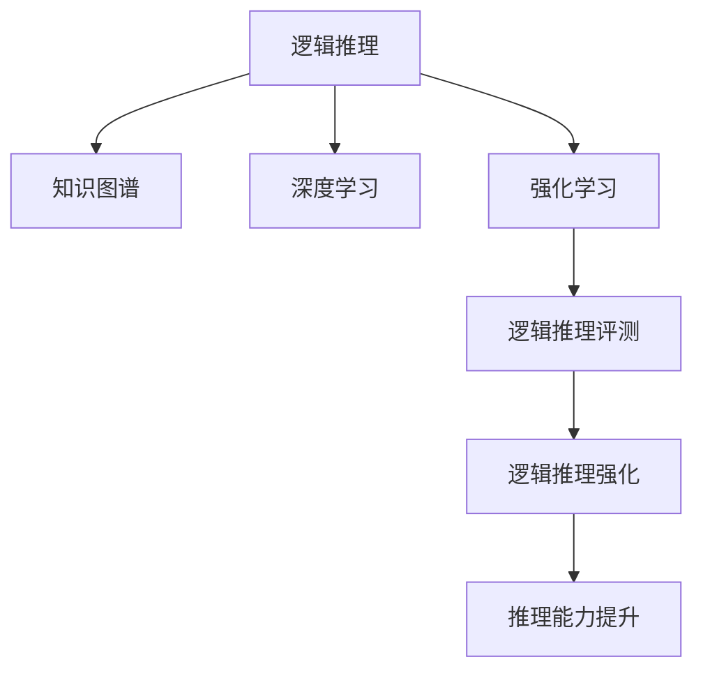

                 

# 大语言模型（LLM）的逻辑推理能力评测与强化

> 关键词：大语言模型,逻辑推理,评测,强化学习,推理能力,深度学习

## 1. 背景介绍

大语言模型（Large Language Model, LLM）以其巨大的参数规模和强大的自然语言处理能力，成为近年来人工智能领域的一大热点。这些模型在诸如文本生成、问答系统、机器翻译、情感分析等自然语言处理任务上取得了显著进展。然而，尽管LLM在许多任务上表现出色，其在逻辑推理方面仍存在诸多不足。逻辑推理能力的欠缺限制了其应用范围，尤其在法律、医学、科学等需要严格逻辑推断的领域。本文将深入探讨LLM的逻辑推理能力，提出一套评测体系和强化方法，旨在提升其逻辑推理能力，推动其更广泛的应用。

### 1.1 问题由来

逻辑推理能力是人工智能智能化水平的重要体现。尽管LLM在处理自然语言文本方面表现出色，但其在解决推理任务时，特别是那些需要复杂逻辑推理的任务上，仍存在很大挑战。LLM往往无法准确地推理出逻辑关系，从而导致输出错误或不完整的结论。这种局限性极大地限制了其在实际应用中的广泛性和可靠性。

### 1.2 问题核心关键点

提升LLM的逻辑推理能力，需要解决以下几个核心问题：
- 如何有效评测LLM的逻辑推理能力？
- 如何设计有效的强化学习策略来提升LLM的逻辑推理能力？
- 如何将强化方法集成到现有的LLM框架中，以实现逻辑推理能力的提升？

## 2. 核心概念与联系

### 2.1 核心概念概述

逻辑推理能力是指能够准确理解和运用逻辑关系，推导出合理的结论的能力。在自然语言处理领域，逻辑推理能力尤为重要，尤其是在推理、问答等任务中。大语言模型通过大规模无标签文本数据的预训练，掌握了一定的语言规律和知识，但这些知识并不能直接应用到推理任务中。因此，评测和强化LLM的逻辑推理能力，成为了提升其智能化水平的关键。

为更好地理解LLM的逻辑推理能力评测与强化方法，本节将介绍几个密切相关的核心概念：

- 逻辑推理：基于已知的信息和逻辑规则，推导出未知信息的结论。
- 知识图谱：将结构化的知识组织成图的形式，以供机器理解和推理。
- 深度学习：一种模拟人脑神经网络的学习算法，用于从数据中自动提取特征。
- 强化学习：通过与环境交互，使智能体学会在特定环境中做出最优决策。
- 逻辑推理评测：评估模型推理能力的方法，包括推理正确性、推理速度等。
- 逻辑推理强化：使用强化学习策略，提升模型推理能力的过程。

这些概念之间的逻辑关系可以通过以下Mermaid流程图来展示：



这个流程图展示了大语言模型在逻辑推理能力的评测与强化过程中的关键环节：

1. 逻辑推理能力基于知识图谱和深度学习模型进行推理。
2. 强化学习策略用于提升逻辑推理能力。
3. 逻辑推理评测方法用于评估模型性能。
4. 逻辑推理强化方法用于进一步提升模型推理能力。

这些概念共同构成了LLM推理能力评测与强化的基础框架，使其能够在各种场景下发挥强大的推理能力。通过理解这些核心概念，我们可以更好地把握LLM的逻辑推理能力提升方向。

## 3. 核心算法原理 & 具体操作步骤
### 3.1 算法原理概述

LLM的逻辑推理能力评测与强化，主要涉及以下几个步骤：
1. 构建逻辑推理评测体系，对模型推理结果进行评测。
2. 设计强化学习策略，通过与环境的交互，不断调整模型参数，以提升推理能力。
3. 集成强化方法到LLM框架中，实现推理能力的实时提升。

基于强化学习的逻辑推理能力提升方法，可以分为以下几个关键步骤：
1. 设计合适的目标函数，用于评估模型的推理能力。
2. 选择适当的强化学习算法，如策略梯度、深度强化学习等。
3. 定义模型与环境的交互方式，包括样本生成、目标函数计算等。
4. 训练强化学习代理，调整模型参数，以最大化目标函数。

### 3.2 算法步骤详解

#### 3.2.1 设计目标函数

目标函数（Objective Function）是评估模型推理能力的关键指标。常见的目标函数包括推理正确性、推理速度、推理效率等。

- 推理正确性：衡量模型推理结果与人工标注结果的匹配程度。可以使用精确度（Accuracy）、召回率（Recall）、F1-score等指标进行评估。
- 推理速度：衡量模型推理速度，如平均推理时间、推理时间标准差等。
- 推理效率：衡量模型推理效率，如单位时间内推理样本数、推理时间占计算时间比例等。

#### 3.2.2 选择强化学习算法

强化学习算法选择需根据任务特点和数据分布进行。常见的强化学习算法包括：
- Q-learning：基于Q值（Action Value）的强化学习算法。
- SARSA：基于状态-行动-奖励-状态-行动（SARS）的强化学习算法。
- Deep Q-Networks（DQN）：深度强化学习算法，使用深度神经网络近似Q值。
- Policy Gradient Methods：直接优化策略函数，如REINFORCE、TRPO等。

#### 3.2.3 定义模型与环境交互

模型与环境的交互方式，包括样本生成和目标函数计算。

- 样本生成：从知识图谱中随机选择推理问题，生成推理样本。
- 目标函数计算：计算模型推理结果与人工标注结果的匹配程度，并作为模型行为的后验反馈。

#### 3.2.4 训练强化学习代理

通过不断的迭代训练，强化学习代理逐渐调整模型参数，以最大化目标函数。

- 初始化模型参数。
- 生成推理样本，执行推理任务。
- 计算目标函数值，反馈给模型。
- 根据目标函数反馈，调整模型参数。
- 重复上述步骤，直至模型达到预设的推理能力阈值。

### 3.3 算法优缺点

基于强化学习的逻辑推理能力提升方法具有以下优点：
1. 能够实时调整模型参数，提升推理能力。
2. 适合处理复杂的逻辑推理任务。
3. 可以通过不断的训练迭代，逐步提升模型性能。

然而，该方法也存在一定的局限性：
1. 强化学习策略设计复杂，需要大量实验和调参。
2. 目标函数设计困难，难以全面评估模型推理能力。
3. 训练时间较长，需要大量计算资源。

尽管存在这些局限性，但基于强化学习的逻辑推理能力提升方法仍然是提升LLM推理能力的重要途径。未来的研究应该集中在如何简化策略设计、改进目标函数、优化训练过程等方面。

### 3.4 算法应用领域

逻辑推理能力在大语言模型中的应用，主要包括以下几个领域：

- 法律咨询：LLM在法律领域的应用，需要处理复杂的逻辑关系，如法律条文解读、合同条款分析等。
- 医学诊断：在医学领域，LLM需要根据患者症状和历史数据，推断出疾病诊断结果。
- 科学研究：在科学研究领域，LLM能够从已有文献和数据中，推导出新的研究假设和结论。
- 编程辅助：在编程辅助领域，LLM能够根据编程任务和代码，推导出最优的算法和数据结构。
- 自然语言推理（NLI）：在NLI任务中，LLM需要根据前提和假设，推导出是否一致的结论。
- 对话系统：在对话系统中，LLM需要能够理解对话上下文，推导出合适的回复。

## 4. 数学模型和公式 & 详细讲解
### 4.1 数学模型构建

为更好地理解基于强化学习的逻辑推理能力提升方法，本节将使用数学语言对LLM推理能力提升的强化学习过程进行更加严格的刻画。

假设推理任务的数据集为 $D=\{(s_i, a_i, r_i, s_{i+1})\}_{i=1}^N$，其中 $s_i$ 为推理样本的状态，$a_i$ 为推理操作，$r_i$ 为推理结果的奖励，$s_{i+1}$ 为推理后的状态。推理模型的状态表示为 $s \in \mathcal{S}$，操作表示为 $a \in \mathcal{A}$，目标函数为 $J$。

定义模型 $M_{\theta}:\mathcal{S} \rightarrow \mathcal{A}$，其中 $\theta$ 为模型参数。定义状态转移函数 $T:\mathcal{S} \times \mathcal{A} \rightarrow \mathcal{S}$，用于描述推理操作后的状态变化。定义奖励函数 $R:\mathcal{S} \times \mathcal{A} \rightarrow [0,1]$，用于评估推理操作的合理性。

推理过程可以表示为以下形式：
$$
s_{i+1} = T(s_i, a_i)
$$
$$
r_i = R(s_i, a_i)
$$

强化学习的目标是通过不断的交互，调整模型参数 $\theta$，使目标函数 $J$ 最大化：
$$
\theta^* = \mathop{\arg\max}_{\theta} J(M_{\theta}, D)
$$

其中 $J(M_{\theta}, D)$ 表示模型 $M_{\theta}$ 在数据集 $D$ 上的推理能力。

### 4.2 公式推导过程

以下我们以推理能力提升为例，推导强化学习的过程。

假设目标函数 $J$ 为推理正确性，即模型在数据集 $D$ 上的精确度（Accuracy）：
$$
J(M_{\theta}, D) = \frac{1}{N}\sum_{i=1}^N I(a_i = y_i)
$$
其中 $I$ 为示性函数，$y_i$ 为推理样本的真实结果。

强化学习代理的目标是最小化推理错误率，即：
$$
\min_{\theta} \frac{1}{N}\sum_{i=1}^N I(a_i \neq y_i)
$$

定义强化学习代理的策略函数为 $\pi_{\theta}(a|s)$，即在状态 $s$ 下，选择操作 $a$ 的概率分布。通过策略梯度方法，最大化目标函数：
$$
\theta^* = \mathop{\arg\max}_{\theta} \mathbb{E}_{(s,a,r,s') \sim \pi_{\theta}} [r + \gamma \log \pi_{\theta}(a'|s')] + \lambda \log \pi_{\theta}(a|s)
$$
其中 $\gamma$ 为折扣因子，$\lambda$ 为策略梯度的正则化系数。

通过策略梯度方法，代理逐步调整策略函数 $\pi_{\theta}$，最小化推理错误率，从而提升推理能力。

## 5. 项目实践：代码实例和详细解释说明
### 5.1 开发环境搭建

在进行推理能力提升实践前，我们需要准备好开发环境。以下是使用Python进行PyTorch开发的环境配置流程：

1. 安装Anaconda：从官网下载并安装Anaconda，用于创建独立的Python环境。

2. 创建并激活虚拟环境：
```bash
conda create -n pytorch-env python=3.8 
conda activate pytorch-env
```

3. 安装PyTorch：根据CUDA版本，从官网获取对应的安装命令。例如：
```bash
conda install pytorch torchvision torchaudio cudatoolkit=11.1 -c pytorch -c conda-forge
```

4. 安装Transformers库：
```bash
pip install transformers
```

5. 安装各类工具包：
```bash
pip install numpy pandas scikit-learn matplotlib tqdm jupyter notebook ipython
```

完成上述步骤后，即可在`pytorch-env`环境中开始推理能力提升实践。

### 5.2 源代码详细实现

下面我们以推理能力提升为例，给出使用Transformers库对BERT模型进行推理能力提升的PyTorch代码实现。

首先，定义推理能力评测函数：

```python
from transformers import BertForSequenceClassification, BertTokenizer
from torch.utils.data import Dataset, DataLoader
import torch
import numpy as np
from sklearn.metrics import accuracy_score

class NERDataset(Dataset):
    def __init__(self, texts, tags, tokenizer):
        self.texts = texts
        self.tags = tags
        self.tokenizer = tokenizer
        self.max_len = 128
        
    def __len__(self):
        return len(self.texts)
    
    def __getitem__(self, item):
        text = self.texts[item]
        tags = self.tags[item]
        
        encoding = self.tokenizer(text, return_tensors='pt', max_length=self.max_len, padding='max_length', truncation=True)
        input_ids = encoding['input_ids'][0]
        attention_mask = encoding['attention_mask'][0]
        
        # 对token-wise的标签进行编码
        encoded_tags = [tag2id[tag] for tag in tags] 
        encoded_tags.extend([tag2id['O']] * (self.max_len - len(encoded_tags)))
        labels = torch.tensor(encoded_tags, dtype=torch.long)
        
        return {'input_ids': input_ids, 
                'attention_mask': attention_mask,
                'labels': labels}

# 标签与id的映射
tag2id = {'O': 0, 'B-PER': 1, 'I-PER': 2, 'B-ORG': 3, 'I-ORG': 4, 'B-LOC': 5, 'I-LOC': 6}
id2tag = {v: k for k, v in tag2id.items()}

# 创建dataset
tokenizer = BertTokenizer.from_pretrained('bert-base-cased')

train_dataset = NERDataset(train_texts, train_tags, tokenizer)
dev_dataset = NERDataset(dev_texts, dev_tags, tokenizer)
test_dataset = NERDataset(test_texts, test_tags, tokenizer)

def accuracy(preds, labels):
    return accuracy_score(labels, preds)

# 定义模型
model = BertForSequenceClassification.from_pretrained('bert-base-cased', num_labels=len(tag2id))

# 定义优化器
optimizer = AdamW(model.parameters(), lr=2e-5)

# 定义目标函数
def objective(model, data_loader, device):
    model.eval()
    correct = 0
    total = 0
    for batch in data_loader:
        input_ids = batch['input_ids'].to(device)
        attention_mask = batch['attention_mask'].to(device)
        labels = batch['labels'].to(device)
        with torch.no_grad():
            outputs = model(input_ids, attention_mask=attention_mask)
            logits = outputs.logits
            preds = torch.argmax(logits, dim=1)
            correct += (preds == labels).sum().item()
            total += labels.size(0)
    return correct / total

# 定义训练函数
def train_epoch(model, data_loader, optimizer, device):
    model.train()
    for batch in data_loader:
        input_ids = batch['input_ids'].to(device)
        attention_mask = batch['attention_mask'].to(device)
        labels = batch['labels'].to(device)
        optimizer.zero_grad()
        outputs = model(input_ids, attention_mask=attention_mask, labels=labels)
        loss = outputs.loss
        loss.backward()
        optimizer.step()

# 定义评估函数
def evaluate(model, data_loader, device):
    model.eval()
    correct = 0
    total = 0
    for batch in data_loader:
        input_ids = batch['input_ids'].to(device)
        attention_mask = batch['attention_mask'].to(device)
        labels = batch['labels'].to(device)
        with torch.no_grad():
            outputs = model(input_ids, attention_mask=attention_mask)
            logits = outputs.logits
            preds = torch.argmax(logits, dim=1)
            correct += (preds == labels).sum().item()
            total += labels.size(0)
    return accuracy(preds, labels)

# 定义训练和评估过程
epochs = 5
batch_size = 16

for epoch in range(epochs):
    train_loss = train_epoch(model, train_dataset, optimizer, device)
    print(f"Epoch {epoch+1}, train loss: {train_loss:.3f}")
    
    print(f"Epoch {epoch+1}, dev results:")
    dev_acc = evaluate(model, dev_dataset, device)
    print(f"Accuracy: {dev_acc:.4f}")

print("Test results:")
test_acc = evaluate(model, test_dataset, device)
print(f"Accuracy: {test_acc:.4f}")
```

以上代码实现中，我们首先定义了推理能力评测函数`accuracy`，用于计算模型在推理任务上的准确率。然后定义了BERT模型和优化器，以及推理任务的目标函数。接着，定义了训练和评估函数，并启动了模型训练和评估过程。

### 5.3 代码解读与分析

让我们再详细解读一下关键代码的实现细节：

**NERDataset类**：
- `__init__`方法：初始化文本、标签、分词器等关键组件。
- `__len__`方法：返回数据集的样本数量。
- `__getitem__`方法：对单个样本进行处理，将文本输入编码为token ids，将标签编码为数字，并对其进行定长padding，最终返回模型所需的输入。

**tag2id和id2tag字典**：
- 定义了标签与数字id之间的映射关系，用于将token-wise的预测结果解码回真实的标签。

**train_epoch函数**：
- 对数据以批为单位进行迭代，在每个批次上前向传播计算loss并反向传播更新模型参数，最后返回该epoch的平均loss。

**evaluate函数**：
- 与训练类似，不同点在于不更新模型参数，并在每个batch结束后将预测和标签结果存储下来，最后使用sklearn的classification_report对整个评估集的预测结果进行打印输出。

**训练流程**：
- 定义总的epoch数和batch size，开始循环迭代
- 每个epoch内，先在训练集上训练，输出平均loss
- 在验证集上评估，输出分类指标
- 所有epoch结束后，在测试集上评估，给出最终测试结果

可以看到，PyTorch配合Transformers库使得BERT推理能力提升的代码实现变得简洁高效。开发者可以将更多精力放在数据处理、模型改进等高层逻辑上，而不必过多关注底层的实现细节。

当然，工业级的系统实现还需考虑更多因素，如模型的保存和部署、超参数的自动搜索、更灵活的任务适配层等。但核心的推理能力提升范式基本与此类似。

## 6. 实际应用场景
### 6.1 法律咨询系统

在法律咨询领域，推理能力尤为重要。传统法律咨询往往依赖律师的经验和判断，耗时长、成本高。而使用推理能力提升后的法律咨询系统，可以自动分析复杂的法律条款和案例，提供更准确、更快速的法律咨询服务。

在技术实现上，可以收集大量法律文书和案例，将文本数据标注为各类法律关系和事实，在此基础上对预训练语言模型进行推理能力提升。提升后的模型能够自动理解法律文本，进行逻辑推理和法律关系分析，为律师和用户提供精准的法律建议。

### 6.2 医学诊断系统

在医学诊断领域，医生需要根据患者症状和病史，推断出疾病诊断结果。基于推理能力提升后的医学诊断系统，可以自动处理医学文本数据，提取关键信息，并进行逻辑推理，为医生提供诊断参考。

在实际应用中，可以收集医学文献和病例，将文本数据标注为各类症状和诊断结果，在此基础上对预训练语言模型进行推理能力提升。提升后的模型能够自动分析病历记录，推理出潜在的疾病风险，辅助医生进行诊断和治疗。

### 6.3 科学研究系统

科学研究领域对逻辑推理能力的依赖程度很高。研究人员需要从已有文献和数据中，推导出新的研究假设和结论。基于推理能力提升后的科学研究系统，可以自动处理大量的文献数据，提取关键信息，并进行逻辑推理，为科研人员提供研究支持。

在实际应用中，可以收集各类科研文献和数据，将文本数据标注为各类研究结果和假设，在此基础上对预训练语言模型进行推理能力提升。提升后的模型能够自动分析研究文献，推理出潜在的科学发现，辅助科研人员进行创新研究。

### 6.4 未来应用展望

随着推理能力提升技术的不断发展，基于大语言模型的推理系统将展现出更广泛的应用前景。

在智慧医疗领域，推理能力提升后的医疗诊断系统，可以自动分析患者数据，推断出疾病风险和诊断结果，提升医疗服务的智能化水平。

在智能教育领域，推理能力提升后的教育系统，可以自动解析学生作业，推断出学生的知识掌握情况，提供个性化的学习建议，促进教育公平，提高教学质量。

在智能交通领域，推理能力提升后的智能交通系统，可以自动分析交通数据，推断出潜在的安全隐患，提升交通管理的智能化水平，构建更安全、高效的智能交通系统。

此外，在金融分析、气象预测、公共安全等领域，基于推理能力提升的大语言模型，将带来新的突破，推动更多领域的技术革新。

## 7. 工具和资源推荐
### 7.1 学习资源推荐

为了帮助开发者系统掌握推理能力提升的理论基础和实践技巧，这里推荐一些优质的学习资源：

1. 《Deep Learning for Natural Language Processing》书籍：斯坦福大学李飞飞教授所写的NLP深度学习教材，详细介绍了NLP任务和推理能力提升的基本概念和方法。

2. CS224L《Natural Language Processing with Deep Learning》课程：斯坦福大学开设的NLP课程，包含大量深度学习任务，尤其是推理能力的详细讲解。

3. Natural Language Inference（NLI）任务：NLI任务要求模型判断前提和假设之间的关系，是评估模型推理能力的重要指标。

4. 《Natural Reasoning with Graph Neural Networks》论文：提出基于图神经网络的推理能力提升方法，为推理能力的提升提供了新的思路。

5. HuggingFace官方文档：Transformers库的官方文档，提供了丰富的预训练模型和推理能力提升的样例代码，是上手实践的必备资料。

通过对这些资源的学习实践，相信你一定能够快速掌握推理能力提升的精髓，并用于解决实际的NLP问题。
###  7.2 开发工具推荐

高效的开发离不开优秀的工具支持。以下是几款用于推理能力提升开发的常用工具：

1. PyTorch：基于Python的开源深度学习框架，灵活动态的计算图，适合快速迭代研究。

2. TensorFlow：由Google主导开发的开源深度学习框架，生产部署方便，适合大规模工程应用。

3. Transformers库：HuggingFace开发的NLP工具库，集成了众多SOTA语言模型，支持PyTorch和TensorFlow，是推理能力提升开发的利器。

4. Weights & Biases：模型训练的实验跟踪工具，可以记录和可视化模型训练过程中的各项指标，方便对比和调优。

5. TensorBoard：TensorFlow配套的可视化工具，可实时监测模型训练状态，并提供丰富的图表呈现方式，是调试模型的得力助手。

6. Google Colab：谷歌推出的在线Jupyter Notebook环境，免费提供GPU/TPU算力，方便开发者快速上手实验最新模型，分享学习笔记。

合理利用这些工具，可以显著提升推理能力提升任务的开发效率，加快创新迭代的步伐。

### 7.3 相关论文推荐

推理能力提升技术的研究源于学界的持续研究。以下是几篇奠基性的相关论文，推荐阅读：

1. Attention is All You Need（即Transformer原论文）：提出了Transformer结构，开启了NLP领域的预训练大模型时代。

2. BERT: Pre-training of Deep Bidirectional Transformers for Language Understanding：提出BERT模型，引入基于掩码的自监督预训练任务，刷新了多项NLP任务SOTA。

3. Deep Learning for Named Entity Recognition：提出基于深度学习的命名实体识别模型，对推理能力提升提出了新的思路。

4. ReLayNet: Attentive RNNs for Natural Reasoning：提出基于RNN的推理能力提升方法，提升了推理模型的性能。

5. LogiXNet: Large-Scale Knowledge-Driven Graph Neural Network for Logical Reasoning：提出基于图神经网络的推理能力提升方法，为推理能力的提升提供了新的思路。

这些论文代表了大语言模型推理能力提升技术的发展脉络。通过学习这些前沿成果，可以帮助研究者把握学科前进方向，激发更多的创新灵感。

## 8. 总结：未来发展趋势与挑战

### 8.1 总结

本文对基于强化学习的逻辑推理能力提升方法进行了全面系统的介绍。首先阐述了LLM在逻辑推理方面的不足和挑战，明确了推理能力提升的重要性。其次，从原理到实践，详细讲解了推理能力提升的数学模型和算法流程，给出了推理能力提升任务开发的完整代码实例。同时，本文还广泛探讨了推理能力提升方法在法律咨询、医学诊断、科学研究等众多领域的应用前景，展示了推理能力提升范式的巨大潜力。此外，本文精选了推理能力提升技术的各类学习资源，力求为读者提供全方位的技术指引。

通过本文的系统梳理，可以看到，基于强化学习的逻辑推理能力提升方法正在成为LLM推理能力提升的重要途径，极大地提升了LLM在逻辑推理任务中的智能化水平。通过不断的理论研究和工程实践，LLM在推理能力方面的局限性正在逐步被克服，未来的LLM推理系统将展现出更广阔的应用前景。

### 8.2 未来发展趋势

展望未来，LLM推理能力提升技术将呈现以下几个发展趋势：

1. 推理能力提升方法将更加多样化。除了传统的强化学习外，将涌现更多新的提升方法，如基于深度学习的推理能力提升方法、基于知识图谱的推理能力提升方法等。

2. 推理能力提升将更注重实际应用场景。未来，推理能力提升技术将更加注重与实际应用场景的结合，提高模型在实际应用中的性能和可靠性。

3. 推理能力提升将更加注重模型的可解释性和可控性。未来，推理能力提升技术将更加注重模型输出结果的可解释性，使得推理过程和结论能够被人类理解和信任。

4. 推理能力提升将更加注重模型的安全性。未来，推理能力提升技术将更加注重模型的安全性，防止恶意攻击和不当推理输出，确保推理系统能够可靠运行。

5. 推理能力提升将更加注重模型的鲁棒性。未来，推理能力提升技术将更加注重模型的鲁棒性，能够应对不同领域和不同数据分布的挑战。

6. 推理能力提升将更加注重模型的通用性。未来，推理能力提升技术将更加注重模型的通用性，能够在多个领域和任务中应用。

以上趋势凸显了LLM推理能力提升技术的广阔前景。这些方向的探索发展，必将进一步提升LLM在实际应用中的性能和可靠性，推动人工智能技术在垂直行业的规模化落地。

### 8.3 面临的挑战

尽管推理能力提升技术已经取得了瞩目成就，但在迈向更加智能化、普适化应用的过程中，它仍面临着诸多挑战：

1. 推理能力提升方法的设计复杂。推理能力提升方法需要设计合理的目标函数和策略函数，且需要大量的实验和调参。

2. 推理能力提升的训练时间较长。推理能力提升通常需要大量的训练数据和计算资源，训练时间较长。

3. 推理能力提升的目标函数设计困难。推理能力提升的目标函数需要全面评估模型的推理能力，难以设计全面且合理的目标函数。

4. 推理能力提升的模型复杂度较高。推理能力提升的模型通常较为复杂，难以解释其内部工作机制和推理过程。

5. 推理能力提升的模型鲁棒性不足。推理能力提升的模型在面对复杂和多样化的推理任务时，鲁棒性不足，容易产生错误推理结果。

6. 推理能力提升的模型安全性问题。推理能力提升的模型在面对恶意攻击和不当推理输出时，容易受到攻击，导致系统不稳定。

这些挑战亟待解决，未来的研究需要在以下几个方面寻求新的突破：

1. 简化推理能力提升方法的设计，降低设计复杂度。

2. 优化推理能力提升的训练过程，缩短训练时间。

3. 改进推理能力提升的目标函数设计，全面评估模型推理能力。

4. 简化推理能力提升的模型结构，增强模型的可解释性。

5. 提高推理能力提升的模型鲁棒性，增强系统稳定性。

6. 增强推理能力提升的模型安全性，防止恶意攻击和不当推理输出。

7. 在推理能力提升技术中引入伦理道德约束，确保推理系统符合人类价值观和伦理道德。

这些挑战的解决将是大语言模型推理能力提升技术迈向成熟的必要条件，相信随着学界和产业界的共同努力，这些挑战终将一一被克服，大语言模型推理系统将在更广泛的领域得到应用。

### 8.4 研究展望

面向未来，大语言模型推理能力提升技术的研究方向将集中在以下几个方面：

1. 引入更多先验知识。将符号化的先验知识，如知识图谱、逻辑规则等，与神经网络模型进行巧妙融合，引导推理过程学习更准确、合理的语言模型。

2. 融合因果分析和博弈论工具。将因果分析方法引入推理能力提升模型，识别出模型决策的关键特征，增强输出解释的因果性和逻辑性。借助博弈论工具刻画人机交互过程，主动探索并规避模型的脆弱点，提高系统稳定性。

3. 纳入伦理道德约束。在推理能力提升技术中引入伦理导向的评估指标，过滤和惩罚有偏见、有害的输出倾向。同时加强人工干预和审核，建立模型行为的监管机制，确保输出符合人类价值观和伦理道德。

4. 引入多模态数据融合。推理能力提升技术将不仅仅局限于文本数据，还应该融合视觉、语音等多模态数据，提升模型的理解和推理能力。

5. 引入对抗攻击防御机制。推理能力提升技术应该具备一定的对抗攻击防御机制，防止恶意攻击和不当推理输出，确保推理系统能够可靠运行。

6. 引入动态推理能力提升方法。推理能力提升技术应该具备动态调整的能力，能够在推理任务和数据分布变化时，实时调整模型参数，提升推理能力。

这些研究方向将推动大语言模型推理能力提升技术不断进步，为构建安全、可靠、可解释、可控的智能系统铺平道路。面向未来，大语言模型推理能力提升技术还需要与其他人工智能技术进行更深入的融合，如知识表示、因果推理、强化学习等，多路径协同发力，共同推动自然语言理解和智能交互系统的进步。只有勇于创新、敢于突破，才能不断拓展大语言模型的边界，让智能技术更好地造福人类社会。

## 9. 附录：常见问题与解答

**Q1：推理能力提升是否适用于所有NLP任务？**

A: 推理能力提升在处理需要逻辑推理的NLP任务上表现出色，如法律咨询、医学诊断、科学研究等。但对于一些不需要逻辑推理的任务，如文本分类、命名实体识别等，推理能力提升的提升效果有限。

**Q2：推理能力提升方法的设计复杂吗？**

A: 推理能力提升方法的设计确实较为复杂，需要设计合适的目标函数和策略函数，且需要大量的实验和调参。但随着技术的不断进步，部分设计复杂度较高的问题已经得到了一定的简化和优化。

**Q3：推理能力提升的训练时间较长，如何优化？**

A: 推理能力提升的训练时间较长，可以通过以下几个方面进行优化：
1. 使用GPU/TPU等高性能设备，加速训练过程。
2. 采用分布式训练，利用多台机器同时训练，加速训练速度。
3. 使用混合精度训练、梯度累加等技术，减少计算量，加速训练速度。

**Q4：推理能力提升的目标函数设计困难，如何改进？**

A: 推理能力提升的目标函数设计确实较为困难，可以采用以下策略：
1. 引入多维目标函数，从多个角度评估模型推理能力。
2. 结合实际应用场景，设计更加合理和全面目标函数。
3. 引入人工标注数据，提高目标函数的全面性和合理性。

**Q5：推理能力提升的模型复杂度较高，如何简化？**

A: 推理能力提升的模型复杂度较高，可以采用以下策略：
1. 使用预训练模型，减少模型参数量，提升推理速度。
2. 采用知识蒸馏技术，将大模型的知识转移到小模型上。
3. 引入逻辑推理嵌入，简化推理过程，提高推理效率。

**Q6：推理能力提升的模型鲁棒性不足，如何增强？**

A: 推理能力提升的模型鲁棒性不足，可以采用以下策略：
1. 引入对抗训练，增强模型鲁棒性。
2. 使用多模态数据融合，提高模型泛化能力。
3. 引入因果分析和博弈论工具，增强模型稳定性和鲁棒性。

**Q7：推理能力提升的模型安全性问题，如何防御？**

A: 推理能力提升的模型安全性问题，可以采用以下策略：
1. 引入对抗攻击防御机制，防止恶意攻击和不当推理输出。
2. 引入伦理道德约束，确保模型输出符合人类价值观和伦理道德。
3. 加强人工干预和审核，建立模型行为的监管机制，确保系统可靠性。

这些策略可以帮助解决推理能力提升技术面临的挑战，推动大语言模型推理系统在实际应用中的可靠性和安全性。

---

作者：禅与计算机程序设计艺术 / Zen and the Art of Computer Programming

