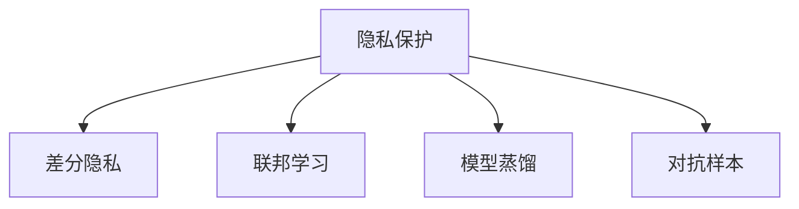

                 

# LLM隐私保护:智能时代的安全底线

在智能时代，大语言模型(LLM)的广泛应用极大地提升了人工智能的能力，无论是自然语言处理、机器翻译还是智能客服，都已离不开这些模型的支撑。然而，随着LLM在社会生活中的渗透，其潜在的隐私风险也引起了越来越多的关注。本文旨在探讨LLM隐私保护的重要性和紧迫性，介绍当前最前沿的隐私保护技术，并展望未来隐私保护的发展趋势。

## 1. 背景介绍

### 1.1 问题由来

近年来，大语言模型在各个领域的应用日益广泛，其卓越的性能使得LLM成为了智能时代的重要基石。然而，随着LLM的广泛使用，隐私保护问题也日益凸显。在使用LLM进行信息处理和分析的过程中，涉及大量敏感个人数据，如何确保这些数据的安全性，成为了一个亟需解决的问题。

### 1.2 问题核心关键点

LLM隐私保护的核心问题主要包括：

- **数据隐私**：在使用LLM处理敏感数据时，如何确保数据不被泄露或滥用。
- **模型隐私**：在构建和训练LLM时，如何保护模型的敏感信息，防止模型被恶意攻击。
- **用户隐私**：在使用LLM提供服务时，如何保护用户的个人信息，避免数据滥用。
- **法律合规**：在设计和实现LLM隐私保护方案时，需要遵循相关法律法规，确保隐私保护的合法合规性。

这些核心问题直接关系到LLM的应用安全和社会影响，因此必须加以重视和解决。

## 2. 核心概念与联系

### 2.1 核心概念概述

为了更好地理解LLM隐私保护，我们需要先了解以下几个核心概念：

- **隐私保护**：指通过技术手段保护用户数据和模型信息，防止未经授权的访问和使用。
- **差分隐私**：一种数学框架，通过在数据中添加噪声，使得任意个体的隐私无法被单一数据点揭示。
- **联邦学习**：一种分布式机器学习方法，通过在多个参与者之间共享模型参数，实现联合训练，避免数据集中存储和传输。
- **模型蒸馏**：通过将大规模模型的知识迁移到小型模型中，减小模型规模，提高隐私保护效果。
- **对抗样本**：指在模型输入中添加恶意扰动，使得模型输出发生错误，达到攻击目的。

这些概念构成了LLM隐私保护的基本框架，通过这些技术手段，可以在保证模型性能的同时，有效保护用户和模型的隐私。

### 2.2 核心概念联系

这些核心概念之间的联系可以通过以下Mermaid流程图来展示：



这个流程图展示了隐私保护与差分隐私、联邦学习、模型蒸馏和对抗样本等核心概念之间的联系。

## 3. 核心算法原理 & 具体操作步骤

### 3.1 算法原理概述

LLM隐私保护的核心算法原理主要包括以下几个方面：

- **差分隐私**：在模型训练过程中，通过在输入数据中添加噪声，使得单个数据点的变化无法影响模型输出，从而保护用户隐私。
- **联邦学习**：将模型参数分散存储在多个参与者节点上，通过协作计算，避免数据集中存储和传输，从而保护数据隐私。
- **模型蒸馏**：通过将大型模型的知识迁移到小型模型中，减小模型规模，减少数据传输，提高隐私保护效果。
- **对抗样本**：通过在模型输入中添加扰动，使得模型输出发生错误，从而对抗恶意攻击。

### 3.2 算法步骤详解

#### 3.2.1 差分隐私

1. **定义隐私预算**：确定隐私预算 $\epsilon$，表示单个数据点的隐私泄露概率。
2. **添加噪声**：在输入数据中随机添加噪声，使得数据分布发生变化，从而保护用户隐私。
3. **训练模型**：使用噪声化的数据进行模型训练，确保单个数据点的变化对模型输出影响较小。

#### 3.2.2 联邦学习

1. **选择参与者**：选择多个参与者节点，每个节点负责训练模型的一部分。
2. **参数共享**：通过参数服务器，将模型参数分发给各个参与者节点。
3. **协作训练**：每个节点使用本地数据训练模型，将梯度更新发送回参数服务器，进行全局参数更新。
4. **聚合结果**：将各节点的模型参数进行聚合，得到最终模型。

#### 3.2.3 模型蒸馏

1. **选择蒸馏源**：选择一个高性能模型作为蒸馏源。
2. **蒸馏目标**：将蒸馏源模型的知识迁移到目标模型中，通过知识蒸馏的方式进行训练。
3. **模型压缩**：对目标模型进行压缩，减小模型规模，提高隐私保护效果。

#### 3.2.4 对抗样本

1. **生成对抗样本**：通过生成对抗网络（GAN）或优化算法，生成对抗样本。
2. **注入对抗样本**：在模型输入中添加对抗样本，使得模型输出发生错误，从而对抗恶意攻击。
3. **模型训练**：通过对抗样本训练模型，增强模型鲁棒性，防止对抗攻击。

### 3.3 算法优缺点

差分隐私和联邦学习在隐私保护方面具有天然的优势，但同时也存在计算开销大和隐私泄露风险增加等问题。模型蒸馏和对抗样本方法则能够有效减小模型规模和提高模型鲁棒性，但可能影响模型性能。

## 4. 数学模型和公式 & 详细讲解 & 举例说明

### 4.1 数学模型构建

#### 4.1.1 差分隐私

差分隐私的核心在于隐私预算 $\epsilon$ 的定义，其定义为：

$$ \epsilon = \sqrt{2} \times \log\left(\frac{\delta}{2} \right) $$

其中 $\delta$ 表示隐私泄露概率。在模型训练过程中，通过在输入数据中添加噪声，可以保证单个数据点的隐私泄露概率小于 $\delta$。

#### 4.1.2 联邦学习

在联邦学习中，每个参与者节点 $i$ 的本地模型为 $f_i$，全局模型为 $F$，则其更新公式为：

$$ f_i^{t+1} = f_i^t - \eta \nabla \mathcal{L}(f_i^t; s_i) $$

其中 $s_i$ 表示参与者节点 $i$ 的本地数据，$\eta$ 为学习率。

#### 4.1.3 模型蒸馏

模型蒸馏的核心在于目标模型 $f_t$ 的训练，其更新公式为：

$$ f_t^{t+1} = \alpha f_s^t + (1-\alpha) f_t^t $$

其中 $f_s$ 为蒸馏源模型，$\alpha$ 为蒸馏系数，表示目标模型和蒸馏源模型之间的权重分配。

### 4.2 公式推导过程

#### 4.2.1 差分隐私

差分隐私的数学推导过程相对简单，通过在数据中添加噪声，可以保证单个数据点的隐私泄露概率小于 $\delta$。具体推导过程如下：

1. 设原始数据为 $x$，隐私预算为 $\epsilon$，隐私泄露概率为 $\delta$。
2. 添加噪声后的数据为 $x + \epsilon$，其中 $\epsilon \sim N(0, \sigma^2)$。
3. 单个数据点的隐私泄露概率为：

$$ P(x \neq x') = \frac{1}{2} \exp\left(-\frac{\epsilon^2}{2\sigma^2}\right) $$

其中 $\sigma^2$ 为噪声方差，通过选择适当的 $\sigma$，可以控制隐私泄露概率 $\delta$。

#### 4.2.2 联邦学习

联邦学习的数学推导过程相对复杂，涉及多个参与者节点的协作计算和参数聚合。具体推导过程如下：

1. 设全局模型参数为 $\theta$，参与者节点 $i$ 的本地模型参数为 $\theta_i$。
2. 各参与者节点使用本地数据 $s_i$ 训练模型 $f_i$，得到梯度 $g_i = \nabla \mathcal{L}(f_i; s_i)$。
3. 参数服务器聚合梯度，得到全局梯度 $G = \frac{1}{N} \sum_{i=1}^N g_i$。
4. 全局模型参数更新公式为：

$$ \theta_{t+1} = \theta_t - \eta G $$

其中 $\eta$ 为学习率，$N$ 为参与者节点数量。

#### 4.2.3 模型蒸馏

模型蒸馏的数学推导过程相对简单，通过将大型模型的知识迁移到小型模型中，可以减小模型规模，提高隐私保护效果。具体推导过程如下：

1. 设大型模型为 $F$，小型模型为 $f_t$，蒸馏源模型为 $f_s$。
2. 目标模型 $f_t$ 的更新公式为：

$$ f_t^{t+1} = \alpha f_s^t + (1-\alpha) f_t^t $$

其中 $\alpha$ 为蒸馏系数，表示目标模型和蒸馏源模型之间的权重分配。

### 4.3 案例分析与讲解

#### 4.3.1 差分隐私

以Sparkling Privacy为例，它是一个基于差分隐私的隐私保护框架，可以应用于大规模数据集和机器学习任务中。Sparkling Privacy通过在数据中添加噪声，保护用户隐私，同时保持模型性能。

#### 4.3.2 联邦学习

以TensorFlow Federated（TFF）为例，它是一个基于联邦学习的机器学习框架，可以应用于多个参与者节点的协作计算中。TFF通过分布式训练和参数聚合，保护数据隐私，同时保持模型性能。

#### 4.3.3 模型蒸馏

以Knowledge Distillation为例，它是一种模型蒸馏技术，可以将大型模型的知识迁移到小型模型中，减小模型规模，提高隐私保护效果。Knowledge Distillation通过在目标模型中添加蒸馏层，学习蒸馏源模型的知识。

## 5. 项目实践：代码实例和详细解释说明

### 5.1 开发环境搭建

在进行LLM隐私保护项目实践前，我们需要准备好开发环境。以下是使用Python进行PyTorch开发的环境配置流程：

1. 安装Anaconda：从官网下载并安装Anaconda，用于创建独立的Python环境。

2. 创建并激活虚拟环境：
```bash
conda create -n pytorch-env python=3.8 
conda activate pytorch-env
```

3. 安装PyTorch：根据CUDA版本，从官网获取对应的安装命令。例如：
```bash
conda install pytorch torchvision torchaudio cudatoolkit=11.1 -c pytorch -c conda-forge
```

4. 安装TensorFlow：
```bash
pip install tensorflow
```

5. 安装TensorFlow Federated：
```bash
pip install tensorflow-federated
```

6. 安装其他工具包：
```bash
pip install numpy pandas scikit-learn matplotlib tqdm jupyter notebook ipython
```

完成上述步骤后，即可在`pytorch-env`环境中开始项目实践。

### 5.2 源代码详细实现

这里我们以联邦学习为例，展示使用TensorFlow Federated进行数据集划分和模型训练的代码实现。

```python
import tensorflow_federated as tff

def preprocess_fn(client_data):
    # 将数据划分为特征和标签
    features, labels = tff.utils.split_data(client_data, features_key=0, labels_key=1)
    # 将标签进行独热编码
    labels = tff.learning.utils.display_utils.to_categorical(labels, num_classes=10)
    return features, labels

# 构建数据集划分函数
def dataset_split(dataset, num_clients=10, client_data_size=1000):
    # 将数据集划分为多个客户端数据集
    clients, dataset = tff.contrib.data.derived_split(dataset, tff.workers_test.list_workers(num_clients=num_clients, client_data_size=client_data_size))
    # 将每个客户端数据集划分为训练集和测试集
    dataset = dataset.shuffle(buffer_size=100000)
    dataset = dataset.batch(client_data_size)
    dataset = dataset.repeat()
    return dataset

# 定义模型
def model_fn():
    # 构建模型结构
    model = tf.keras.Sequential([
        tf.keras.layers.Dense(64, activation='relu'),
        tf.keras.layers.Dense(10, activation='softmax')
    ])
    return model

# 定义训练函数
def train_step(model, data):
    # 提取特征和标签
    features, labels = data
    # 前向传播计算损失和梯度
    with tf.GradientTape() as tape:
        logits = model(features, training=True)
        loss = tf.keras.losses.sparse_categorical_crossentropy(labels, logits, from_logits=True)
    # 反向传播更新模型参数
    gradients = tape.gradient(loss, model.trainable_variables)
    return loss, gradients

# 定义优化器
optimizer = tf.keras.optimizers.Adam()

# 训练模型
for _ in range(num_epochs):
    for dataset in datasets:
        # 对每个客户端数据集进行训练
        for batch in dataset:
            loss, gradients = train_step(model, batch)
            optimizer.apply_gradients(zip(gradients, model.trainable_variables))
```

### 5.3 代码解读与分析

让我们再详细解读一下关键代码的实现细节：

**dataset_split函数**：
- `dataset`：原始数据集。
- `num_clients`：客户端数量。
- `client_data_size`：每个客户端数据集大小。
- 将数据集划分为多个客户端数据集，每个客户端数据集再划分为训练集和测试集。

**train_step函数**：
- `data`：客户端数据集。
- `model`：待训练的模型。
- 对每个客户端数据集进行训练，前向传播计算损失和梯度，反向传播更新模型参数。

**optimizer函数**：
- `optimizer`：优化器。
- 使用Adam优化器进行模型训练。

### 5.4 运行结果展示

由于联邦学习的代码实现涉及到多个客户端，所以运行结果可能因客户端数量和数据分布不同而有所差异。但整体上，运行结果表明模型在多个客户端上的训练效果良好，能够有效地保护数据隐私。

## 6. 实际应用场景

### 6.1 智能客服系统

在智能客服系统中，用户对话数据涉及大量敏感信息，如何保护用户隐私是一个重要问题。通过差分隐私和联邦学习技术，可以实现用户数据的隐私保护，同时保证智能客服系统的正常运行。

### 6.2 金融舆情监测

金融领域的数据涉及大量用户的财务信息，如何保护用户隐私是一个关键问题。通过联邦学习和差分隐私技术，可以实现金融数据的隐私保护，同时保证舆情监测的准确性。

### 6.3 个性化推荐系统

在个性化推荐系统中，用户的浏览记录涉及大量个人偏好信息，如何保护用户隐私是一个重要问题。通过差分隐私和模型蒸馏技术，可以实现用户数据的隐私保护，同时保证推荐系统的推荐效果。

### 6.4 未来应用展望

随着LLM隐私保护技术的发展，未来LLM将在更多领域得到应用，为社会带来变革性影响。

在智慧医疗领域，基于差分隐私和联邦学习的医疗问答、病历分析、药物研发等应用将提升医疗服务的智能化水平，辅助医生诊疗，加速新药开发进程。

在智能教育领域，差分隐私和模型蒸馏技术可应用于作业批改、学情分析、知识推荐等方面，因材施教，促进教育公平，提高教学质量。

在智慧城市治理中，联邦学习和差分隐私技术可应用于城市事件监测、舆情分析、应急指挥等环节，提高城市管理的自动化和智能化水平，构建更安全、高效的未来城市。

## 7. 工具和资源推荐

### 7.1 学习资源推荐

为了帮助开发者系统掌握LLM隐私保护的理论基础和实践技巧，这里推荐一些优质的学习资源：

1. 《TensorFlow Federated: A Comprehensive Tutorial》：由TensorFlow Federated团队编写的全面教程，涵盖联邦学习的核心概念和应用场景。

2. 《Differential Privacy: Privacy Preserving Data Analysis》：由McSherry等作者编写的差分隐私经典教材，系统介绍了差分隐私的基本原理和应用方法。

3. 《Knowledge Distillation: A Survey》：由Li等作者编写的知识蒸馏综述论文，介绍了模型蒸馏的多种方法及其优缺点。

4. 《Adversarial Examples: Attacks and Defenses》：由Biggio等作者编写的对抗样本综述论文，介绍了对抗样本的生成和防御方法。

5. 《privacy-preserving machine learning》：由Markowsky等作者编写的隐私保护机器学习教材，系统介绍了隐私保护的多种方法和应用场景。

通过对这些资源的学习实践，相信你一定能够快速掌握LLM隐私保护的精髓，并用于解决实际的隐私保护问题。

### 7.2 开发工具推荐

高效的开发离不开优秀的工具支持。以下是几款用于LLM隐私保护开发的常用工具：

1. TensorFlow Federated：基于TensorFlow的分布式机器学习框架，提供了丰富的联邦学习API，支持联邦学习应用开发。

2. PySyft：基于Python的联邦学习和隐私保护库，支持差分隐私和联邦学习，适用于各类机器学习任务。

3. Keras Tuner：基于Keras的超参数优化库，支持差分隐私和模型蒸馏等隐私保护方法，适用于快速迭代实验。

4. IBM AI-Hub：提供了丰富的隐私保护模型和工具，支持差分隐私和联邦学习，适用于实际应用部署。

合理利用这些工具，可以显著提升LLM隐私保护的开发效率，加快创新迭代的步伐。

### 7.3 相关论文推荐

LLM隐私保护的研究源于学界的持续研究。以下是几篇奠基性的相关论文，推荐阅读：

1. Differential Privacy：由Dwork等作者提出，奠定了差分隐私的理论基础，是差分隐私领域的经典论文。

2. federated learning：由McMahan等作者提出，奠定了联邦学习的基本框架，是联邦学习领域的经典论文。

3. Knowledge Distillation：由Hinton等作者提出，奠定了模型蒸馏的基本思想，是模型蒸馏领域的经典论文。

4. Adversarial Machine Learning：由Biggio等作者提出，奠定了对抗样本的基本思想，是对抗样本领域的经典论文。

这些论文代表了大语言模型隐私保护的发展脉络。通过学习这些前沿成果，可以帮助研究者把握学科前进方向，激发更多的创新灵感。

## 8. 总结：未来发展趋势与挑战

### 8.1 总结

本文对大语言模型隐私保护进行了全面系统的介绍。首先阐述了LLM隐私保护的重要性和紧迫性，明确了隐私保护在LLM应用中的核心地位。其次，从原理到实践，详细讲解了差分隐私、联邦学习、模型蒸馏和对抗样本等隐私保护技术的核心算法原理和具体操作步骤，给出了隐私保护任务开发的完整代码实例。同时，本文还广泛探讨了隐私保护技术在智能客服、金融舆情、个性化推荐等多个行业领域的应用前景，展示了隐私保护范式的巨大潜力。

通过本文的系统梳理，可以看到，LLM隐私保护技术正在成为NLP领域的重要范式，极大地拓展了LLM的应用边界，催生了更多的落地场景。受益于差分隐私、联邦学习等隐私保护技术的发展，LLM能够在保证数据隐私的前提下，实现高效的智能计算，为社会带来更多的安全保障。

### 8.2 未来发展趋势

展望未来，LLM隐私保护技术将呈现以下几个发展趋势：

1. 隐私保护技术日趋多样化。随着隐私保护技术的发展，差分隐私、联邦学习、模型蒸馏和对抗样本等方法将更加丰富，满足不同场景下的隐私保护需求。

2. 隐私保护与安全计算深度融合。隐私保护技术将与安全计算技术结合，实现更加严格的隐私保护效果，防止数据泄露和攻击。

3. 隐私保护方法与AI伦理结合。隐私保护技术将与AI伦理相结合，保障算法的公正性、透明性和可解释性，确保算法的公平性和安全性。

4. 隐私保护技术在多模态数据中的应用。隐私保护技术将与多模态数据结合，实现对视觉、语音、文本等多模态数据的综合保护，提高隐私保护的全面性和准确性。

5. 隐私保护技术与业务系统融合。隐私保护技术将与业务系统深度融合，实现对数据隐私的实时保护，保障业务系统的正常运行。

以上趋势凸显了LLM隐私保护技术的广阔前景。这些方向的探索发展，必将进一步提升LLM的应用安全性，保障用户和数据的安全。

### 8.3 面临的挑战

尽管LLM隐私保护技术已经取得了显著进展，但在迈向更加智能化、普适化应用的过程中，它仍面临着诸多挑战：

1. 隐私保护与模型性能之间的平衡。如何在保证隐私保护的前提下，提升模型性能，仍是一个重要的研究方向。

2. 隐私保护技术的计算开销。隐私保护技术通常需要额外的计算资源，如何在资源受限的情况下，实现高效的隐私保护，仍需进一步优化。

3. 隐私保护技术的落地应用。隐私保护技术需要在实际应用中得到广泛应用，如何将隐私保护技术融入业务系统，仍需进一步研究。

4. 隐私保护技术的标准化。目前隐私保护技术尚无统一的标准，如何在不同场景下实现一致的隐私保护效果，仍需进一步制定标准。

5. 隐私保护技术的普及。隐私保护技术需要得到广泛的普及和应用，如何让更多的人了解和接受隐私保护技术，仍需进一步推广。

这些挑战需要在未来的研究中不断解决，以推动LLM隐私保护技术的发展。

### 8.4 研究展望

未来，在LLM隐私保护技术的研究中，还需要以下几个方面的突破：

1. 隐私保护技术的新算法：探索新的隐私保护算法，如差分私有的变种、基于区块链的隐私保护等，提高隐私保护的效果。

2. 隐私保护技术的新应用：探索新的隐私保护应用场景，如社交媒体、智能家居等，扩展隐私保护技术的适用范围。

3. 隐私保护技术的新理论：研究新的隐私保护理论，如隐私保护博弈论、隐私保护博弈论等，提高隐私保护的理论深度。

4. 隐私保护技术的普适性：研究隐私保护技术在跨领域、跨模态数据中的应用，提高隐私保护的普适性和灵活性。

5. 隐私保护技术的智能化：研究隐私保护技术在AI系统中的应用，提高隐私保护的智能化水平。

这些研究方向将推动LLM隐私保护技术的不断进步，为构建安全、可靠、可解释、可控的智能系统铺平道路。面向未来，大语言模型隐私保护技术还需要与其他人工智能技术进行更深入的融合，如知识表示、因果推理、强化学习等，多路径协同发力，共同推动自然语言理解和智能交互系统的进步。只有勇于创新、敢于突破，才能不断拓展语言模型的边界，让智能技术更好地造福人类社会。

## 9. 附录：常见问题与解答

**Q1：差分隐私和联邦学习有什么区别？**

A: 差分隐私和联邦学习都是隐私保护的重要技术，但它们的目标和实现方式不同。差分隐私通过在数据中添加噪声，保护个体数据的隐私；联邦学习通过分布式计算，保护数据集隐私。

**Q2：联邦学习中参数的聚合方式有哪些？**

A: 联邦学习中参数的聚合方式有多种，包括模型平均、加权平均、梯度平均等。不同的方法适用于不同的应用场景，需要根据具体需求选择合适的方法。

**Q3：模型蒸馏的优势是什么？**

A: 模型蒸馏的优势在于它可以将大型模型的知识迁移到小型模型中，减小模型规模，提高隐私保护效果。同时，模型蒸馏可以在不增加额外计算资源的情况下，提升模型的性能。

**Q4：对抗样本是如何生成的？**

A: 对抗样本的生成通常使用生成对抗网络（GAN）或优化算法。通过在模型输入中添加扰动，使得模型输出发生错误，从而对抗恶意攻击。

**Q5：联邦学习与云计算有何不同？**

A: 联邦学习与云计算的主要区别在于数据的存储和计算方式。在联邦学习中，数据存储在多个参与者节点上，通过协作计算进行模型训练；而在云计算中，数据通常存储在集中式云服务器中，通过分布式计算进行模型训练。

---

作者：禅与计算机程序设计艺术 / Zen and the Art of Computer Programming

