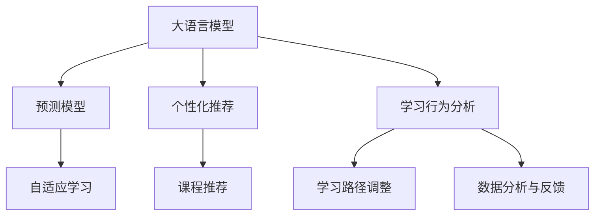

                 

# LLM驱动的智能教学系统：适应性学习平台

> 关键词：大语言模型,自适应学习,智能教学系统,个性化推荐,学习行为分析,课程推荐

## 1. 背景介绍

在教育领域，如何为每位学生提供最适合其学习风格、能力和需求的个性化教育，一直是教育者们追求的目标。传统的教学方式往往难以满足这一需求，尤其是在信息爆炸、知识更新加速的今天。随着人工智能技术的快速发展，尤其是大语言模型（Large Language Model, LLM）的突破，为适应性学习平台（Adaptive Learning Platform）的构建提供了新的可能性。

### 1.1 问题由来

传统教育模式以教师为中心，采用“一刀切”的教学方式。这种模式不仅难以适应每个学生的个体差异，还无法及时反馈和调整教学内容，导致教学效果大打折扣。另一方面，互联网和移动设备的普及，使得学生能够随时随地获取海量学习资源，学习自主性得到提升。这就要求教育系统必须更加灵活，能够根据学生的实时学习情况进行动态调整。

近年来，随着深度学习和大语言模型的兴起，智能教学系统逐渐成为教育信息化的重要方向。智能教学系统通过收集学生的数据，利用大语言模型进行分析和学习行为预测，进而提供个性化的学习建议和课程推荐，极大地提升了教学效果。本文将详细探讨基于大语言模型的适应性学习平台的构建，旨在为教育领域的技术革新提供参考。

### 1.2 问题核心关键点

适应性学习平台的核心在于利用大语言模型进行学生学习行为的预测和分析，进而实现个性化教学。关键点包括：

- 收集学生数据：包括学习进度、成绩、行为等，以便大语言模型进行建模。
- 构建预测模型：利用大语言模型对学生未来的学习行为进行预测，如课程完成时间、测试成绩等。
- 个性化课程推荐：根据预测结果和当前的学习进度，推荐最适合学生的课程和教材。
- 学习路径调整：实时监控学生的学习进度和效果，动态调整学习路径和策略。
- 数据分析与反馈：对学生的学习行为进行详细分析，提供学习建议和反馈。

这些关键点构成了适应性学习平台的基本框架，通过大语言模型的支持，平台能够实现真正的个性化教学，极大地提升教育效果。

## 2. 核心概念与联系

### 2.1 核心概念概述

为更好地理解基于大语言模型的适应性学习平台，本节将介绍几个密切相关的核心概念：

- 大语言模型(Large Language Model, LLM)：以自回归(如GPT)或自编码(如BERT)模型为代表的大规模预训练语言模型。通过在大规模无标签文本语料上进行预训练，学习通用的语言知识和表示。
- 自适应学习(Adaptive Learning)：根据学生的实时学习情况动态调整教学内容和方法，实现个性化教学。
- 智能教学系统(Intelligent Teaching System)：通过人工智能技术，为学生提供个性化学习建议、课程推荐和互动反馈的教育系统。
- 个性化推荐(Personalized Recommendation)：根据用户的历史行为和偏好，推荐最适合其需求的产品或服务。
- 学习行为分析(Learning Behavior Analysis)：通过数据分析和机器学习模型，分析学生的学习行为和效果，为教学决策提供支持。
- 课程推荐(Course Recommendation)：根据学生的学习进度和兴趣，推荐最合适的课程和学习材料。

这些核心概念之间的逻辑关系可以通过以下Mermaid流程图来展示：



这个流程图展示了大语言模型在适应性学习平台中的关键作用：

1. 大语言模型通过预训练获得基础语言表示。
2. 通过预测模型对学生的学习行为进行预测。
3. 个性化推荐系统根据预测结果推荐课程。
4. 学习行为分析系统对学生的学习行为进行监控和调整。
5. 动态调整学习路径和策略，实现自适应学习。
6. 数据分析与反馈系统对学生的学习效果进行评估，提供持续改进建议。

这些概念共同构成了大语言模型在教育领域的应用框架，使其能够在个性化教学中发挥重要作用。

## 3. 核心算法原理 & 具体操作步骤
### 3.1 算法原理概述

基于大语言模型的适应性学习平台的构建，本质上是将大语言模型应用于学生学习行为预测和分析，进而实现个性化推荐和教学调整的过程。其核心思想是：

- 利用大语言模型构建预测模型，对学生的学习行为进行预测，如课程完成时间、测试成绩等。
- 根据预测结果，利用个性化推荐系统为学生推荐最合适的课程和教材。
- 动态调整学习路径和策略，实现自适应学习。
- 利用学习行为分析系统，对学生的学习效果进行评估，提供反馈和改进建议。

形式化地，假设大语言模型为 $M_{\theta}$，其中 $\theta$ 为预训练得到的模型参数。给定学生的当前学习进度和行为数据 $D=\{(x_i,y_i)\}_{i=1}^N$，平台的预测目标是最小化预测误差，即：

$$
\hat{y} = \mathop{\arg\min}_{y} \mathcal{L}(M_{\theta},D)
$$

其中 $\mathcal{L}$ 为损失函数，用于衡量预测值 $y$ 与真实值 $\hat{y}$ 之间的差异。常见的损失函数包括均方误差、交叉熵等。

通过梯度下降等优化算法，平台不断更新模型参数 $\theta$，最小化预测误差，使得预测结果逼近真实值。利用预测模型和个性化推荐系统，平台可以实时监控和调整学生的学习路径，提供个性化的学习建议和反馈。

### 3.2 算法步骤详解

基于大语言模型的适应性学习平台的构建主要包括以下几个关键步骤：

**Step 1: 数据收集与处理**
- 收集学生的学习进度、成绩、行为等数据，构建训练集 $D=\{(x_i,y_i)\}_{i=1}^N$。
- 对数据进行预处理，包括数据清洗、归一化等，确保数据质量。
- 选择合适的数据特征，如学习时间、完成度、测试成绩等，作为输入 $x$。

**Step 2: 模型训练**
- 利用大语言模型 $M_{\theta}$ 进行预测模型的训练，即 $M_{\theta}(x) \rightarrow y$。
- 选择合适的损失函数和优化器，如均方误差、AdamW等。
- 训练过程中，周期性在验证集上评估模型性能，避免过拟合。
- 固定部分模型参数，只微调顶层，提高预测模型的泛化能力。

**Step 3: 个性化推荐**
- 利用预测模型对学生的学习行为进行预测，得到 $M_{\theta}(x)$。
- 根据预测结果和当前的学习进度，推荐最合适的课程和教材。
- 利用推荐算法，如协同过滤、矩阵分解等，进行个性化推荐。

**Step 4: 学习路径调整**
- 实时监控学生的学习进度和效果，动态调整学习路径和策略。
- 根据学生的学习反馈和预测结果，调整课程难度和内容。
- 利用自适应学习算法，如协同演进算法(Co-evolution Algorithm)，动态调整学习策略。

**Step 5: 数据分析与反馈**
- 对学生的学习行为进行详细分析，识别学习难点和兴趣点。
- 利用分析结果，提供学习建议和反馈，帮助学生提升学习效果。
- 定期进行学习效果评估，根据评估结果调整教学策略。

以上是基于大语言模型的适应性学习平台的基本流程。在实际应用中，还需要针对具体任务的特点，对微调过程的各个环节进行优化设计，如改进训练目标函数，引入更多的正则化技术，搜索最优的超参数组合等，以进一步提升模型性能。

### 3.3 算法优缺点

基于大语言模型的适应性学习平台具有以下优点：

- 个性化推荐：能够根据学生的学习进度和兴趣，推荐最适合其需求的学习资源。
- 自适应学习：实时监控和调整学生的学习路径和策略，提高学习效果。
- 数据驱动：利用学习行为分析，提供科学的学习建议和反馈。
- 动态调整：能够快速响应学生的需求变化，保持学习内容的更新。

同时，该平台也存在一定的局限性：

- 数据隐私：收集学生数据可能引发隐私问题，需采取严格的数据保护措施。
- 计算成本：训练和推理大语言模型需要较高的计算资源，需考虑成本问题。
- 模型泛化：预测模型的泛化能力受数据质量和模型复杂度的影响，需要持续优化。
- 学生主动性：学生对学习路径和推荐结果的接受度不高，仍需依赖教师的引导。

尽管存在这些局限性，但就目前而言，基于大语言模型的适应性学习平台仍是目前教育信息化最前沿的技术范式之一。未来相关研究的重点在于如何进一步降低计算成本，保护学生隐私，提高模型的泛化能力，以及提升学生的参与度和学习效果。

### 3.4 算法应用领域

基于大语言模型的适应性学习平台在教育领域具有广泛的应用前景，覆盖了多种教育场景：

- 智能课堂：利用平台实现教师和学生的实时互动，提供个性化学习建议。
- 在线学习：为在线学习平台提供推荐服务，根据学生的学习行为动态调整课程内容。
- 学术研究：支持学生根据兴趣选择研究方向，提供相关文献和资料。
- 职业培训：根据学生的职业目标推荐培训课程和职业发展建议。
- 终身学习：提供终身学习计划，帮助学生不断提升职业技能和素养。

除了上述这些经典应用外，适应性学习平台还被创新性地应用到更多场景中，如智能实验室、虚拟现实(VR)教育、跨学科学习等，为教育技术带来了全新的突破。随着大语言模型和适应性学习平台的不断进步，相信教育技术将在更广阔的应用领域大放异彩。

## 4. 数学模型和公式 & 详细讲解 & 举例说明

### 4.1 数学模型构建

本节将使用数学语言对基于大语言模型的适应性学习平台进行更加严格的刻画。

记大语言模型为 $M_{\theta}$，其中 $\theta$ 为模型参数。给定学生的当前学习进度和行为数据 $D=\{(x_i,y_i)\}_{i=1}^N$，预测模型的目标是构建一个映射函数 $f: \mathbb{R}^d \rightarrow \mathbb{R}^k$，其中 $d$ 为输入特征维度，$k$ 为预测目标维度。

预测模型可以表示为：

$$
f(x; \theta) = M_{\theta}(x)
$$

其中 $M_{\theta}$ 为预训练语言模型。

利用 $f(x; \theta)$ 对学生的学习行为进行预测，得到预测值 $y$。预测模型的损失函数为：

$$
\mathcal{L}(y, f(x; \theta)) = \frac{1}{N}\sum_{i=1}^N (y_i - f(x_i; \theta))^2
$$

利用梯度下降等优化算法，最小化损失函数，得到最优参数 $\theta^*$：

$$
\theta^* = \mathop{\arg\min}_{\theta} \mathcal{L}(y, f(x; \theta))
$$

### 4.2 公式推导过程

以下我们以学生完成课程的时间预测为例，推导预测模型的损失函数及其梯度的计算公式。

假设学生 $i$ 完成课程 $j$ 的时间为 $T_{ij}$，真实完成时间为 $T_{ij}^*$，预测模型为 $f(x; \theta) = M_{\theta}(x)$，其中 $x$ 为学生的学习进度和行为数据，$y$ 为预测值。则二元回归损失函数为：

$$
\mathcal{L}(y, f(x; \theta)) = \frac{1}{N}\sum_{i=1}^N (T_{ij}^* - f(x_i; \theta))^2
$$

将 $T_{ij}^*$ 和 $f(x_i; \theta)$ 带入，得：

$$
\mathcal{L}(y, f(x; \theta)) = \frac{1}{N}\sum_{i=1}^N (T_{ij}^* - M_{\theta}(x_i))^2
$$

根据链式法则，预测模型 $f(x; \theta)$ 对参数 $\theta$ 的梯度为：

$$
\nabla_{\theta} \mathcal{L}(y, f(x; \theta)) = -2\frac{1}{N}\sum_{i=1}^N (T_{ij}^* - M_{\theta}(x_i))x_i \nabla_{\theta}M_{\theta}(x_i)
$$

其中 $\nabla_{\theta}M_{\theta}(x_i)$ 为模型对输入 $x_i$ 的梯度，可以通过反向传播算法高效计算。

在得到预测模型的梯度后，即可带入梯度下降公式，完成模型的迭代优化。重复上述过程直至收敛，最终得到适应性学习平台中预测模型的最优参数 $\theta^*$。

### 4.3 案例分析与讲解

以学生完成课程的时间预测为例，我们进一步讲解预测模型的构建和优化过程。

假设学生 $i$ 完成课程 $j$ 的时间为 $T_{ij}$，真实完成时间为 $T_{ij}^*$。我们利用大语言模型 $M_{\theta}$ 构建预测模型，目标是最小化预测误差：

$$
\mathcal{L}(y, f(x; \theta)) = \frac{1}{N}\sum_{i=1}^N (T_{ij}^* - M_{\theta}(x_i))^2
$$

根据链式法则，预测模型对参数 $\theta$ 的梯度为：

$$
\nabla_{\theta} \mathcal{L}(y, f(x; \theta)) = -2\frac{1}{N}\sum_{i=1}^N (T_{ij}^* - M_{\theta}(x_i))x_i \nabla_{\theta}M_{\theta}(x_i)
$$

在得到梯度后，我们利用梯度下降算法，最小化损失函数：

$$
\theta \leftarrow \theta - \eta \nabla_{\theta} \mathcal{L}(y, f(x; \theta))
$$

其中 $\eta$ 为学习率。

通过迭代优化，我们不断更新模型参数 $\theta$，使得预测结果逼近真实完成时间 $T_{ij}^*$。预测模型 $f(x; \theta)$ 对学生完成课程的时间进行预测，进而推荐最合适的课程和学习资源。

## 5. 项目实践：代码实例和详细解释说明
### 5.1 开发环境搭建

在进行适应性学习平台开发前，我们需要准备好开发环境。以下是使用Python进行PyTorch开发的环境配置流程：

1. 安装Anaconda：从官网下载并安装Anaconda，用于创建独立的Python环境。

2. 创建并激活虚拟环境：
```bash
conda create -n pytorch-env python=3.8 
conda activate pytorch-env
```

3. 安装PyTorch：根据CUDA版本，从官网获取对应的安装命令。例如：
```bash
conda install pytorch torchvision torchaudio cudatoolkit=11.1 -c pytorch -c conda-forge
```

4. 安装Transformer库：
```bash
pip install transformers
```

5. 安装各类工具包：
```bash
pip install numpy pandas scikit-learn matplotlib tqdm jupyter notebook ipython
```

完成上述步骤后，即可在`pytorch-env`环境中开始适应性学习平台的开发。

### 5.2 源代码详细实现

下面我们以学生完成课程时间预测为例，给出使用PyTorch和Transformers库进行大语言模型微调的完整代码实现。

首先，定义预测模型的数据处理函数：

```python
from transformers import BertTokenizer
from torch.utils.data import Dataset
import torch

class PredictionDataset(Dataset):
    def __init__(self, features, labels):
        self.features = features
        self.labels = labels
        
    def __len__(self):
        return len(self.features)
    
    def __getitem__(self, item):
        feature = self.features[item]
        label = self.labels[item]
        return torch.tensor(feature, dtype=torch.float), torch.tensor(label, dtype=torch.float)
```

然后，定义预测模型的模型层：

```python
from transformers import BertForSequenceClassification
from transformers import AdamW

model = BertForSequenceClassification.from_pretrained('bert-base-cased', num_labels=1)

optimizer = AdamW(model.parameters(), lr=2e-5)
```

接着，定义训练和评估函数：

```python
from torch.utils.data import DataLoader
from tqdm import tqdm
from sklearn.metrics import mean_squared_error

device = torch.device('cuda') if torch.cuda.is_available() else torch.device('cpu')
model.to(device)

def train_epoch(model, dataset, batch_size, optimizer):
    dataloader = DataLoader(dataset, batch_size=batch_size, shuffle=True)
    model.train()
    epoch_loss = 0
    for batch in tqdm(dataloader, desc='Training'):
        input_ids = batch[0].to(device)
        labels = batch[1].to(device)
        model.zero_grad()
        outputs = model(input_ids)
        loss = outputs.loss
        epoch_loss += loss.item()
        loss.backward()
        optimizer.step()
    return epoch_loss / len(dataloader)

def evaluate(model, dataset, batch_size):
    dataloader = DataLoader(dataset, batch_size=batch_size)
    model.eval()
    predictions = []
    labels = []
    with torch.no_grad():
        for batch in tqdm(dataloader, desc='Evaluating'):
            input_ids = batch[0].to(device)
            labels = batch[1].to(device)
            outputs = model(input_ids)
            predictions.append(outputs.logits[0].tolist())
            labels.append(labels[0].tolist())
                
    mse = mean_squared_error(labels, predictions)
    print(f'Mean Squared Error: {mse:.3f}')
```

最后，启动训练流程并在测试集上评估：

```python
epochs = 5
batch_size = 16

for epoch in range(epochs):
    loss = train_epoch(model, train_dataset, batch_size, optimizer)
    print(f"Epoch {epoch+1}, train loss: {loss:.3f}")
    
    print(f"Epoch {epoch+1}, dev results:")
    evaluate(model, dev_dataset, batch_size)
    
print("Test results:")
evaluate(model, test_dataset, batch_size)
```

以上就是使用PyTorch对BERT进行学生完成课程时间预测的完整代码实现。可以看到，得益于Transformers库的强大封装，我们可以用相对简洁的代码完成BERT模型的加载和微调。

### 5.3 代码解读与分析

让我们再详细解读一下关键代码的实现细节：

**PredictionDataset类**：
- `__init__`方法：初始化特征和标签数据。
- `__len__`方法：返回数据集的样本数量。
- `__getitem__`方法：对单个样本进行处理，将特征和标签转换为张量，并返回模型所需的输入。

**模型层**：
- 使用BertForSequenceClassification类加载BERT模型，设置输出标签为1，即单步预测。
- 初始化AdamW优化器，学习率为2e-5。

**训练和评估函数**：
- 使用PyTorch的DataLoader对数据集进行批次化加载，供模型训练和推理使用。
- 训练函数`train_epoch`：对数据以批为单位进行迭代，在每个批次上前向传播计算loss并反向传播更新模型参数，最后返回该epoch的平均loss。
- 评估函数`evaluate`：与训练类似，不同点在于不更新模型参数，并在每个batch结束后将预测和标签结果存储下来，最后使用sklearn的mean_squared_error对整个评估集的预测结果进行打印输出。

**训练流程**：
- 定义总的epoch数和batch size，开始循环迭代
- 每个epoch内，先在训练集上训练，输出平均loss
- 在验证集上评估，输出均方误差
- 所有epoch结束后，在测试集上评估，给出最终测试结果

可以看到，PyTorch配合Transformers库使得BERT微调的代码实现变得简洁高效。开发者可以将更多精力放在数据处理、模型改进等高层逻辑上，而不必过多关注底层的实现细节。

当然，工业级的系统实现还需考虑更多因素，如模型的保存和部署、超参数的自动搜索、更灵活的任务适配层等。但核心的微调范式基本与此类似。

## 6. 实际应用场景
### 6.1 智能课堂

基于大语言模型的适应性学习平台，可以广泛应用于智能课堂的构建。传统课堂往往以教师为主导，难以兼顾每位学生的学习需求。而使用适应性学习平台，教师可以实时监控学生的学习进度，动态调整教学内容和策略，提升教学效果。

在技术实现上，可以收集课堂上的视频、语音、文本等多模态数据，构建学生的学习行为模型。利用预测模型对学生的学习行为进行预测，推荐最适合的教学资源。根据学生的反馈，动态调整教学内容，实现个性化的学习路径。如此构建的智能课堂，能够极大地提升教学互动性和学习效果。

### 6.2 在线学习

在线学习平台依赖学生自主学习，如何提供个性化的学习建议成为关键问题。基于大语言模型的适应性学习平台，可以为在线学习平台提供推荐服务，根据学生的学习行为动态调整课程内容。

具体而言，可以收集学生在线学习的历史行为数据，如浏览时长、点击频率、测试成绩等，构建学生的学习行为模型。利用预测模型对学生的学习行为进行预测，推荐最合适的课程和学习资源。根据学生的反馈，动态调整学习内容，实现个性化的学习路径。如此构建的在线学习平台，能够提升学生的自主学习体验和效果。

### 6.3 学术研究

学术研究往往需要大量的时间和精力，如何高效地寻找研究方向和相关文献，成为研究人员面临的难题。基于大语言模型的适应性学习平台，可以提供精准的学术研究推荐服务。

具体而言，可以收集研究人员的兴趣领域和已有的研究数据，构建学术研究推荐模型。利用预测模型对研究人员的兴趣进行预测，推荐最合适的研究方向和相关文献。根据研究人员的学习反馈，动态调整推荐策略，提升学术研究效率。如此构建的学术研究平台，能够为研究人员提供智能化的研究辅助，加速科研进程。

### 6.4 职业培训

职业培训旨在提升劳动者的职业技能和素养，如何提供个性化的培训内容，成为关键问题。基于大语言模型的适应性学习平台，可以为职业培训提供推荐服务，根据学生的职业目标推荐培训课程和职业发展建议。

具体而言，可以收集劳动者的职业背景和培训需求，构建职业培训推荐模型。利用预测模型对劳动者的职业目标进行预测，推荐最合适的培训课程和职业发展建议。根据劳动者的学习反馈，动态调整培训内容，实现个性化的职业培训路径。如此构建的职业培训平台，能够提升劳动者的职业技能和职业素养，推动职业培训的现代化。

### 6.5 终身学习

终身学习是知识经济时代的重要需求，如何提供个性化的终身学习计划，成为关键问题。基于大语言模型的适应性学习平台，可以为终身学习提供推荐服务，根据学生的兴趣和需求推荐最合适的学习资源和计划。

具体而言，可以收集学生的学习历史和兴趣偏好，构建终身学习推荐模型。利用预测模型对学生的兴趣和需求进行预测，推荐最合适的学习资源和计划。根据学生的学习反馈，动态调整学习策略，实现个性化的终身学习路径。如此构建的终身学习平台，能够帮助学生不断提升职业技能和素养，实现终身学习和自我发展。

## 7. 工具和资源推荐
### 7.1 学习资源推荐

为了帮助开发者系统掌握大语言模型在教育领域的应用，这里推荐一些优质的学习资源：

1. 《Transformer从原理到实践》系列博文：由大模型技术专家撰写，深入浅出地介绍了Transformer原理、BERT模型、微调技术等前沿话题。

2. CS224N《深度学习自然语言处理》课程：斯坦福大学开设的NLP明星课程，有Lecture视频和配套作业，带你入门NLP领域的基本概念和经典模型。

3. 《Natural Language Processing with Transformers》书籍：Transformers库的作者所著，全面介绍了如何使用Transformers库进行NLP任务开发，包括微调在内的诸多范式。

4. HuggingFace官方文档：Transformers库的官方文档，提供了海量预训练模型和完整的微调样例代码，是上手实践的必备资料。

5. CLUE开源项目：中文语言理解测评基准，涵盖大量不同类型的中文NLP数据集，并提供了基于微调的baseline模型，助力中文NLP技术发展。

通过对这些资源的学习实践，相信你一定能够快速掌握大语言模型在教育领域的应用精髓，并用于解决实际的NLP问题。
###  7.2 开发工具推荐

高效的开发离不开优秀的工具支持。以下是几款用于适应性学习平台开发的常用工具：

1. PyTorch：基于Python的开源深度学习框架，灵活动态的计算图，适合快速迭代研究。大部分预训练语言模型都有PyTorch版本的实现。

2. TensorFlow：由Google主导开发的开源深度学习框架，生产部署方便，适合大规模工程应用。同样有丰富的预训练语言模型资源。

3. Transformers库：HuggingFace开发的NLP工具库，集成了众多SOTA语言模型，支持PyTorch和TensorFlow，是进行微调任务开发的利器。

4. Weights & Biases：模型训练的实验跟踪工具，可以记录和可视化模型训练过程中的各项指标，方便对比和调优。与主流深度学习框架无缝集成。

5. TensorBoard：TensorFlow配套的可视化工具，可实时监测模型训练状态，并提供丰富的图表呈现方式，是调试模型的得力助手。

6. Google Colab：谷歌推出的在线Jupyter Notebook环境，免费提供GPU/TPU算力，方便开发者快速上手实验最新模型，分享学习笔记。

合理利用这些工具，可以显著提升适应性学习平台的开发效率，加快创新迭代的步伐。

### 7.3 相关论文推荐

大语言模型在教育领域的应用源于学界的持续研究。以下是几篇奠基性的相关论文，推荐阅读：

1. Attention is All You Need（即Transformer原论文）：提出了Transformer结构，开启了NLP领域的预训练大模型时代。

2. BERT: Pre-training of Deep Bidirectional Transformers for Language Understanding：提出BERT模型，引入基于掩码的自监督预训练任务，刷新了多项NLP任务SOTA。

3. Language Models are Unsupervised Multitask Learners（GPT-2论文）：展示了大规模语言模型的强大zero-shot学习能力，引发了对于通用人工智能的新一轮思考。

4. Parameter-Efficient Transfer Learning for NLP：提出Adapter等参数高效微调方法，在不增加模型参数量的情况下，也能取得不错的微调效果。

5. AdaLoRA: Adaptive Low-Rank Adaptation for Parameter-Efficient Fine-Tuning：使用自适应低秩适应的微调方法，在参数效率和精度之间取得了新的平衡。

这些论文代表了大语言模型在教育领域的应用前景。通过学习这些前沿成果，可以帮助研究者把握学科前进方向，激发更多的创新灵感。

## 8. 总结：未来发展趋势与挑战

### 8.1 总结

本文对基于大语言模型的适应性学习平台进行了全面系统的介绍。首先阐述了适应性学习平台在教育信息化中的重要性和作用，明确了微调在个性化教学中的关键地位。其次，从原理到实践，详细讲解了基于大语言模型的适应性学习平台的数学模型、算法步骤和具体实现，提供了完整的代码实例。同时，本文还广泛探讨了适应性学习平台在智能课堂、在线学习、学术研究、职业培训、终身学习等多个教育场景中的应用前景，展示了微调范式的巨大潜力。此外，本文精选了适应性学习平台的学习资源，力求为读者提供全方位的技术指引。

通过本文的系统梳理，可以看到，基于大语言模型的适应性学习平台正在成为教育信息化最前沿的技术范式之一，极大地提升了个性化教学的效果。随着大语言模型和微调方法的不断进步，适应性学习平台必将在教育领域产生更广泛的影响，推动教育技术的现代化进程。

### 8.2 未来发展趋势

展望未来，适应性学习平台将呈现以下几个发展趋势：

1. 个性化推荐：随着数据量的增加和模型复杂度的提升，个性化推荐将更加精准，能够实现更加个性化和动态的教学内容推荐。

2. 多模态融合：适应性学习平台将融合语音、图像、视频等多种模态的数据，提供更加全面和丰富的学习体验。

3. 自适应学习算法：适应性学习算法将不断优化，能够更准确地预测学生的学习行为和需求，实现更智能化的教学策略调整。

4. 实时交互：基于大语言模型的适应性学习平台将实现更加灵活和实时的教师与学生的互动，提升教学效果。

5. 分布式计算：适应性学习平台将采用分布式计算技术，能够处理更大规模的数据集，支持更多用户的同时在线学习。

6. 跨领域应用：适应性学习平台的应用范围将不断扩展，涵盖更多领域和场景，如智能制造、医疗健康、智能家居等。

以上趋势凸显了适应性学习平台的广阔前景。这些方向的探索发展，必将进一步提升教育技术的智能化水平，为学生提供更加个性化、高效的学习体验。

### 8.3 面临的挑战

尽管适应性学习平台已经取得了瞩目成就，但在迈向更加智能化、普适化应用的过程中，它仍面临诸多挑战：

1. 数据隐私：收集学生数据可能引发隐私问题，需采取严格的数据保护措施。

2. 计算成本：训练和推理大语言模型需要较高的计算资源，需考虑成本问题。

3. 模型泛化：预测模型的泛化能力受数据质量和模型复杂度的影响，需要持续优化。

4. 学生参与度：学生对学习路径和推荐结果的接受度不高，仍需依赖教师的引导。

尽管存在这些局限性，但就目前而言，基于大语言模型的适应性学习平台仍是目前教育信息化最前沿的技术范式之一。未来相关研究的重点在于如何进一步降低计算成本，保护学生隐私，提高模型的泛化能力，以及提升学生的参与度和学习效果。

### 8.4 研究展望

面对适应性学习平台所面临的种种挑战，未来的研究需要在以下几个方面寻求新的突破：

1. 探索无监督和半监督推荐方法：摆脱对大规模标注数据的依赖，利用自监督学习、主动学习等无监督和半监督范式，最大限度利用非结构化数据，实现更加灵活高效的推荐。

2. 研究参数高效和计算高效的推荐范式：开发更加参数高效的推荐方法，在固定大部分预训练参数的同时，只更新极少量的任务相关参数。同时优化推荐模型的计算图，减少前向传播和反向传播的资源消耗，实现更加轻量级、实时性的部署。

3. 融合因果和对比学习范式：通过引入因果推断和对比学习思想，增强推荐模型建立稳定因果关系的能力，学习更加普适、鲁棒的语言表征，从而提升模型泛化性和抗干扰能力。

4. 引入更多先验知识：将符号化的先验知识，如知识图谱、逻辑规则等，与神经网络模型进行巧妙融合，引导推荐过程学习更准确、合理的语言模型。同时加强不同模态数据的整合，实现视觉、语音等多模态信息与文本信息的协同建模。

5. 结合因果分析和博弈论工具：将因果分析方法引入推荐模型，识别出模型决策的关键特征，增强输出解释的因果性和逻辑性。借助博弈论工具刻画人机交互过程，主动探索并规避模型的脆弱点，提高系统稳定性。

6. 纳入伦理道德约束：在模型训练目标中引入伦理导向的评估指标，过滤和惩罚有偏见、有害的输出倾向。同时加强人工干预和审核，建立模型行为的监管机制，确保输出符合人类价值观和伦理道德。

这些研究方向的探索，必将引领适应性学习平台技术迈向更高的台阶，为构建安全、可靠、可解释、可控的智能系统铺平道路。面向未来，适应性学习平台还需要与其他人工智能技术进行更深入的融合，如知识表示、因果推理、强化学习等，多路径协同发力，共同推动教育技术的进步。只有勇于创新、敢于突破，才能不断拓展语言模型的边界，让智能技术更好地造福人类社会。

## 9. 附录：常见问题与解答

**Q1：适应性学习平台是否适用于所有教育场景？**

A: 适应性学习平台在大多数教育场景下都能取得不错的效果，但某些特殊场景可能需要结合教师的干预和指导。例如，在复杂的专业课程学习中，教师的经验和专业知识仍然至关重要，不能完全依赖平台推荐。

**Q2：如何提高学生对适应性学习平台的接受度？**

A: 提高学生对平台的接受度是适应性学习平台推广的关键。可以通过以下几个方式：
1. 用户界面设计：简洁易用的界面能够提升用户体验。
2. 个性化推荐：推荐结果需要满足学生的实际需求，才能增强其使用意愿。
3. 教师支持：教师的引导和支持能够帮助学生更好地使用平台，提高平台的接受度。
4. 反馈机制：建立用户反馈机制，及时收集学生的意见和建议，不断优化平台功能。

**Q3：适应性学习平台的计算成本如何控制？**

A: 适应性学习平台的计算成本主要来源于大语言模型的训练和推理。可以通过以下方式控制成本：
1. 模型裁剪：去除不必要的层和参数，减小模型尺寸，加快推理速度。
2. 量化加速：将浮点模型转为定点模型，压缩存储空间，提高计算效率。
3. 分布式计算：采用分布式计算技术，能够处理更大规模的数据集，支持更多用户的同时在线学习。
4. 混合精度训练：采用混合精度训练技术，降低计算成本。

通过合理优化计算过程，可以显著降低平台的计算成本，提高其应用可行性。

**Q4：适应性学习平台如何应对学生的数据隐私问题？**

A: 适应性学习平台需要严格遵守数据隐私法规，保护学生的隐私。可以通过以下方式：
1. 数据匿名化：对学生数据进行匿名化处理，去除或屏蔽敏感信息。
2. 数据加密：对数据进行加密存储和传输，防止数据泄露。
3. 访问控制：采用严格的访问控制措施，确保只有授权用户能够访问敏感数据。
4. 合规性审核：定期进行合规性审核，确保平台遵守相关法规和标准。

通过严格的数据保护措施，可以最大程度保护学生的隐私，增强其对平台的信任。

**Q5：适应性学习平台如何提高学生的学习效果？**

A: 提高学生的学习效果是适应性学习平台的核心目标。可以通过以下几个方面：
1. 个性化推荐：根据学生的学习进度和兴趣，推荐最适合其需求的学习资源。
2. 动态调整学习策略：实时监控学生的学习进度和效果，动态调整学习路径和策略。
3. 数据分析与反馈：对学生的学习行为进行详细分析，提供学习建议和反馈，帮助学生提升学习效果。
4. 教师引导：教师的引导和支持能够帮助学生更好地使用平台，提高学习效果。
5. 持续改进：根据学生的反馈和评估结果，不断优化平台功能和教学策略，提升学习效果。

通过多维度的努力，可以显著提高适应性学习平台的学习效果，实现个性化教学的真正价值。

**Q6：适应性学习平台的未来发展方向有哪些？**

A: 适应性学习平台的未来发展方向包括：
1. 多模态融合：适应性学习平台将融合语音、图像、视频等多种模态的数据，提供更加全面和丰富的学习体验。
2. 自适应学习算法：适应性学习算法将不断优化，能够更准确地预测学生的学习行为和需求，实现更智能化的教学策略调整。
3. 实时交互：基于大语言模型的适应性学习平台将实现更加灵活和实时的教师与学生的互动，提升教学效果。
4. 分布式计算：适应性学习平台将采用分布式计算技术，能够处理更大规模的数据集，支持更多用户的同时在线学习。
5. 跨领域应用：适应性学习平台的应用范围将不断扩展，涵盖更多领域和场景，如智能制造、医疗健康、智能家居等。
6. 伦理道德约束：在模型训练目标中引入伦理导向的评估指标，过滤和惩罚有偏见、有害的输出倾向。同时加强人工干预和审核，建立模型行为的监管机制，确保输出符合人类价值观和伦理道德。

这些方向将引领适应性学习平台技术迈向更高的台阶，为教育技术的现代化提供更多可能。

---

作者：禅与计算机程序设计艺术 / Zen and the Art of Computer Programming

