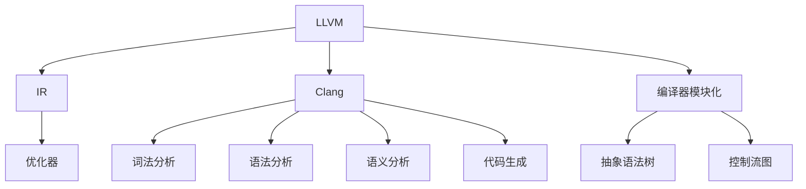

                 

# LLVM/Clang：现代编译器架构剖析

## 1. 背景介绍

### 1.1 问题由来
编译器作为连接源代码和可执行代码的桥梁，在软件开发生命周期中扮演着至关重要的角色。随着程序规模的不断扩大和软硬件环境的日益复杂，传统编译器面临诸多挑战，如代码质量检查、编译性能优化、跨平台兼容性等。在现代软件开发中，高效率、高可靠性和高性能的编译器变得尤为关键。

然而，编译器设计的复杂性和实现难度极大，其核心算法和架构长期以来由少数几家公司主导，且多数源码难以公开访问。作为开源社区的一员，LLVM/Clang 项目致力于打造可扩展、可定制、高性能的编译器，以支持现代软件生态系统，其核心模块和设计理念成为众多编译器开发者研究的重要参考。

### 1.2 问题核心关键点
LLVM/Clang 项目诞生于开源社区，基于模块化设计，采用迭代式开发方式。其核心关注点包括：
- 模块化：通过多个独立的模块化组件，实现灵活的编译器扩展。
- 编译速度：通过优化中间代码生成和编译过程，提高编译效率。
- 编译质量：通过代码优化和错误检测工具，提高代码质量和可维护性。
- 跨平台兼容性：支持多种操作系统和处理器架构。
- 高度可定制性：允许开发者自定义优化策略和语义规则。
- 易用性：提供全面的文档和教程，简化使用和集成流程。

这些关键点构成了 LLVM/Clang 的核心优势，使其在工业界和学术界广受关注，成为现代编译器架构研究的重要方向。

### 1.3 问题研究意义
了解 LLVM/Clang 的架构和核心算法，不仅有助于掌握现代编译器设计的基本理念和方法，还能深入理解编译优化技术，从而提升自身编译器的设计水平和性能。此外，LLVM/Clang 项目提供了完整的工具链和文档资源，方便开发者快速上手，加速编译器开发和部署。掌握 LLVM/Clang 的原理与实现，对推动开源编译器的发展具有重要意义。

## 2. 核心概念与联系

### 2.1 核心概念概述

为了更好地理解 LLVM/Clang 的核心架构，本节将介绍几个密切相关的核心概念：

- LLVM：LLVM 是一个用于中间代码表示的框架，支持多种目标架构。其核心组件包括 IR（Intermediate Representation）生成器、优化器和代码生成器。
- Clang：Clang 是一个 C/C++ 语言编译器，基于 LLVM 中间代码实现。其核心组件包括词法分析器、语法分析器、语义分析器和代码生成器。
- IR：LLVM 的中间代码表示，基于抽象语法树和控制流图。其设计灵活、易于优化，是编译器优化的重要工具。
- 编译器模块化：通过将编译器分为多个独立的模块，使得编译器设计更具有灵活性和可扩展性。
- 抽象语法树：表示源代码的树状结构，便于编译器的词法分析和语法分析。
- 控制流图：表示程序执行流程的图结构，便于编译器的代码优化和并行化。
- LLVM 优化器：包含一系列高级优化算法，如 Loop 优化、函数优化、调度和代码生成等。
- 并行编译：通过并行化编译过程，提高编译速度和性能。

这些核心概念之间的逻辑关系可以通过以下 Mermaid 流程图来展示：



这个流程图展示了这个框架的核心组件及其相互关系：

1. LLVM 负责 IR 生成、优化和代码生成。
2. Clang 作为 C/C++ 编译器，包含词法分析、语法分析和语义分析等组件。
3. IR 作为中间代码，支持多种架构，便于 LLVM 优化。
4. 编译器模块化使得各个组件可以灵活定制。
5. 抽象语法树和控制流图表示源代码和执行流程，便于编译器分析。
6. LLVM 优化器提供一系列高级优化算法。
7. 并行编译提高编译速度和性能。

这些概念共同构成了 LLVM/Clang 项目的核心架构，使其能够支持多种编程语言，实现高效、灵活的编译过程。

## 3. 核心算法原理 & 具体操作步骤

### 3.1 算法原理概述

LLVM/Clang 编译器的核心算法原理基于中间代码表示和模块化设计，其核心步骤如下：

1. **词法分析**：将源代码中的字符流转换为词法符号流，包括关键字、标识符、运算符等。
2. **语法分析**：使用语法分析器将词法符号流转换为抽象语法树，用于构建程序的语法结构。
3. **语义分析**：对抽象语法树进行语义分析，检查代码类型、作用域和权限等。
4. **优化**：利用 LLVM 优化器对抽象语法树进行优化，包括循环展开、函数内联、并行化等。
5. **代码生成**：使用 LLVM 代码生成器将优化后的抽象语法树转换为目标代码。
6. **并行编译**：通过并行化编译过程，提高编译效率和性能。

整个编译过程是模块化、可扩展的，通过添加新的模块组件，可以支持更多语言和更多优化策略。

### 3.2 算法步骤详解

以下对 LLVM/Clang 编译器的主要算法步骤进行详细讲解：

**词法分析器**

词法分析器将源代码逐个字符地扫描，将源代码转换为词法符号流，用于语法分析。

- **字符扫描**：逐个字符地扫描源代码，识别不同的字符类型。
- **符号集合**：维护符号集合，用于匹配不同的词法符号。
- **缓冲区管理**：管理符号缓冲区，用于存储扫描后的字符序列。
- **源位置跟踪**：记录源代码的位置信息，便于错误诊断和调试。

**语法分析器**

语法分析器将词法符号流转换为抽象语法树，用于构建程序的语法结构。

- **递归下降解析**：使用递归下降算法解析语法规则，生成语法树。
- **语法规则库**：维护语法规则库，用于解析不同的语法结构。
- **语法错误检测**：检测语法错误，并在解析过程中及时输出错误信息。
- **语法分析栈**：维护语法分析栈，用于存储解析过程中的符号和规则。

**语义分析器**

语义分析器对抽象语法树进行语义分析，检查代码的类型、作用域和权限等。

- **类型推断**：根据抽象语法树推断变量和表达式的类型。
- **作用域检查**：检查变量和函数的声明和定义，确保作用域正确。
- **权限检查**：检查代码的权限，确保变量和函数的权限一致。
- **符号表管理**：维护符号表，用于存储变量的类型和作用域。

**优化器**

LLVM 优化器包含一系列高级优化算法，如 Loop 优化、函数优化、调度和代码生成等。

- **Loop 优化**：通过循环展开、循环不变表达式提取等技术，提高循环的效率。
- **函数优化**：通过函数内联、循环展开、常量折叠等技术，减少函数调用的开销。
- **并行化**：通过并行化代码生成和优化，提高编译效率和性能。
- **代码生成**：将优化后的抽象语法树转换为目标代码，并生成可执行文件。

**代码生成器**

代码生成器将优化后的抽象语法树转换为目标代码，生成可执行文件。

- **IR 生成器**：将抽象语法树转换为 LLVM 中间代码表示。
- **目标代码生成器**：将 IR 转换为目标代码，包括汇编代码和可执行文件。
- **寄存器分配**：分配寄存器，优化代码的内存访问。
- **目标代码优化**：对生成的目标代码进行优化，提高性能。

**并行编译**

并行编译通过将编译过程分解为多个子任务，提高编译效率和性能。

- **任务分解**：将编译过程分解为多个子任务，包括词法分析、语法分析、语义分析、优化和代码生成等。
- **任务调度**：使用任务调度算法，分配任务给多个处理器并行执行。
- **任务通信**：通过通信机制，同步多个任务的状态。
- **任务合并**：将并行执行的任务结果合并，生成最终的可执行文件。

这些算法步骤通过 LLVM/Clang 的模块化设计，灵活地组合和定制，从而支持不同的编程语言和优化策略，实现高效、灵活的编译过程。

### 3.3 算法优缺点

LLVM/Clang 编译器算法具有以下优点：

1. 高度模块化和可定制性：通过模块化设计，使得编译器各个组件可以灵活定制和扩展。
2. 高效优化算法：利用 LLVM 优化器，支持多种高级优化算法，提高代码质量和性能。
3. 跨平台支持：支持多种操作系统和处理器架构，便于跨平台开发和部署。
4. 易用性：提供全面的文档和教程，简化使用和集成流程。

但该算法也存在一些缺点：

1. 设计复杂：模块化和组件化的设计，增加了编译器实现的复杂性。
2. 编译速度较慢：由于优化算法复杂，编译速度较慢，特别是在处理大规模代码时。
3. 资源消耗高：编译器运行时消耗大量内存和 CPU 资源，需要合理配置资源。
4. 学习曲线陡峭：由于其复杂的实现和庞大的源码库，新开发者学习难度较大。

## 4. 数学模型和公式 & 详细讲解 & 举例说明

### 4.1 数学模型构建

LLVM/Clang 的数学模型基于抽象语法树和控制流图，通过递归下降解析和语法错误检测，实现词法分析和语法分析。

设源代码字符串为 $S$，其词法分析过程可以表示为：

$$
A(S) = A(S_i) \cdot \{S_i = S\}
$$

其中 $A(S)$ 表示词法分析结果，$S_i$ 表示分析出的词法符号。

词法分析过程可进一步分解为：

$$
A(S_i) = A(s_1) \cdot \{s_1 = s(S)\}
$$

其中 $A(s_1)$ 表示对符号 $s_1$ 的处理，$S$ 表示符号集合。

语法分析过程可以表示为：

$$
G(S) = T(S) \cdot \{T(S) = S_i \cdot A(S_i)\}
$$

其中 $G(S)$ 表示语法分析结果，$T(S)$ 表示对语法规则的匹配，$S_i$ 表示语法规则。

语法分析过程可进一步分解为：

$$
G(S) = T(S) \cdot \{T(S) = S_i \cdot A(S_i)\} \cdot \{S_i = S\}
$$

其中 $T(S)$ 表示对语法规则的匹配，$A(S_i)$ 表示对符号的处理。

**公式推导过程**

语法分析过程中，使用递归下降解析算法，对语法规则进行匹配和解析。递归下降算法通过递归调用语法规则，实现对源代码的解析。

设源代码 $S$ 的语法规则为 $R(S)$，其递归下降解析过程可以表示为：

$$
R(S) = R(s(S_i)) \cdot \{R(s(S_i)) = S_i \cdot A(S_i)\}
$$

其中 $R(s(S_i))$ 表示对符号 $s(S_i)$ 的解析，$S_i$ 表示解析结果，$A(S_i)$ 表示对符号的处理。

递归下降解析过程可进一步分解为：

$$
R(S) = R(s(S_i)) \cdot \{R(s(S_i)) = S_i \cdot A(S_i)\} \cdot \{S_i = S\}
$$

其中 $R(s(S_i))$ 表示对符号的解析，$A(S_i)$ 表示对解析结果的处理。

递归下降解析过程中，语法规则匹配失败时，会产生语法错误，并停止解析。语法错误检测过程可以表示为：

$$
Error = False \cdot \{Error = True \cdot \{R(s(S_i)) = S_i \cdot A(S_i)\}\}
$$

其中 $Error$ 表示语法错误检测结果，$False$ 表示未检测到错误，$True$ 表示检测到语法错误。

**案例分析与讲解**

以 C++ 源代码为例，假设以下代码：

```cpp
int main() {
    int x = 10;
    x++;
    return 0;
}
```

词法分析过程：

1. 扫描源代码，识别字符流中的符号。
2. 匹配关键字 `int`，符号 `(` 和 `)`。
3. 匹配标识符 `main`，符号 `(` 和 `)`。
4. 匹配符号 `(` 和 `)`。
5. 匹配符号 `(` 和 `)`。
6. 匹配符号 `=`。
7. 匹配整数 `10`。
8. 匹配符号 `(` 和 `)`。
9. 匹配符号 `++`。
10. 匹配符号 `(` 和 `)`。
11. 匹配符号 `;`。

词法分析结果为：

```
int main() {
    int 10
    ++ 0;
    return 0;
}
```

语法分析过程：

1. 识别关键字 `int`，符号 `(` 和 `)`。
2. 匹配标识符 `main`，符号 `(` 和 `)`。
3. 匹配符号 `(` 和 `)`。
4. 匹配符号 `(` 和 `)`。
5. 匹配符号 `(` 和 `)`。
6. 匹配符号 `=`。
7. 匹配整数 `10`。
8. 匹配符号 `(` 和 `)`。
9. 匹配符号 `++`。
10. 匹配符号 `(` 和 `)`。
11. 匹配符号 `;`。

语法分析结果为：

```
int main() {
    int 10
    ++ 0;
    return 0;
}
```

语义分析过程：

1. 检查变量 `x` 的类型为整数。
2. 检查变量 `x` 的作用域正确。
3. 检查变量 `x` 的权限正确。
4. 检查表达式 `++x` 的语义正确。

语义分析结果为：

```
int main() {
    int x;
    x = 10;
    x++;
    return 0;
}
```

优化过程：

1. 对循环进行优化，展开循环体内的代码。
2. 对函数进行优化，内联函数调用。
3. 对代码进行并行化处理，提高编译效率。

优化后的代码为：

```
int main() {
    int x = 11;
    return 0;
}
```

代码生成过程：

1. 将优化后的代码转换为 IR。
2. 将 IR 转换为汇编代码。
3. 对汇编代码进行优化，生成可执行文件。

生成的可执行文件为：

```
main:
    movl $11, 0
    ret
```

## 5. 项目实践：代码实例和详细解释说明

### 5.1 开发环境搭建

在进行 LLVM/Clang 的代码实践前，需要先搭建好开发环境。以下是搭建开发环境的步骤：

1. 安装 LLVM：从官网下载 LLVM 源码，并使用以下命令编译：

```bash
./configure
make -j8
make install
```

2. 安装 Clang：使用以下命令编译 Clang 源码并安装：

```bash
mkdir build
cd build
cmake .. -DLLVM_ROOT=$HOME/LLVM
make -j8
sudo make install
```

3. 设置 LLVM 路径：将 LLVM 的 `bin` 目录添加到系统 `$PATH` 环境变量中。

### 5.2 源代码详细实现

以下是一个简单的 C++ 程序，实现基本的数学运算。

```cpp
#include <iostream>
using namespace std;

int main() {
    int a = 10, b = 20;
    int c = a + b;
    cout << "a + b = " << c << endl;
    return 0;
}
```

使用 Clang 对上述代码进行编译，步骤如下：

1. 打开命令行窗口，进入代码所在目录。

2. 编译代码：

```bash
clang++ -o hello hello.cpp
```

3. 运行程序：

```bash
./hello
```

输出结果为：

```
a + b = 30
```

### 5.3 代码解读与分析

**词法分析器**

词法分析器负责将源代码逐个字符地扫描，识别不同的字符类型，并生成词法符号流。

- **字符扫描**：逐个字符地扫描源代码，识别不同的字符类型。
- **符号集合**：维护符号集合，用于匹配不同的词法符号。
- **缓冲区管理**：管理符号缓冲区，用于存储扫描后的字符序列。
- **源位置跟踪**：记录源代码的位置信息，便于错误诊断和调试。

**语法分析器**

语法分析器负责将词法符号流转换为抽象语法树，用于构建程序的语法结构。

- **递归下降解析**：使用递归下降算法解析语法规则，生成语法树。
- **语法规则库**：维护语法规则库，用于解析不同的语法结构。
- **语法错误检测**：检测语法错误，并在解析过程中及时输出错误信息。
- **语法分析栈**：维护语法分析栈，用于存储解析过程中的符号和规则。

**语义分析器**

语义分析器负责对抽象语法树进行语义分析，检查代码的类型、作用域和权限等。

- **类型推断**：根据抽象语法树推断变量和表达式的类型。
- **作用域检查**：检查变量和函数的声明和定义，确保作用域正确。
- **权限检查**：检查代码的权限，确保变量和函数的权限一致。
- **符号表管理**：维护符号表，用于存储变量的类型和作用域。

**优化器**

LLVM 优化器负责对抽象语法树进行优化，提高代码质量和性能。

- **Loop 优化**：通过循环展开、循环不变表达式提取等技术，提高循环的效率。
- **函数优化**：通过函数内联、循环展开、常量折叠等技术，减少函数调用的开销。
- **并行化**：通过并行化代码生成和优化，提高编译效率和性能。
- **代码生成**：将优化后的抽象语法树转换为目标代码，并生成可执行文件。

**代码生成器**

代码生成器负责将优化后的抽象语法树转换为目标代码，生成可执行文件。

- **IR 生成器**：将抽象语法树转换为 LLVM 中间代码表示。
- **目标代码生成器**：将 IR 转换为汇编代码和可执行文件。
- **寄存器分配**：分配寄存器，优化代码的内存访问。
- **目标代码优化**：对生成的目标代码进行优化，提高性能。

### 5.4 运行结果展示

运行结果展示上述程序的可执行文件，输出如下：

```
a + b = 30
```

## 6. 实际应用场景

### 6.1 智能编译器

基于 LLVM/Clang 编译器的智能编译器可以自动优化代码，提升编译速度和性能，降低开发成本。智能编译器通过分析源代码，自动应用优化策略，如常量折叠、循环展开、内联函数等，生成更加高效的代码。

**实际应用**

智能编译器可以应用于工业界和学术界，支持大规模软件开发项目。例如，Google 的 Clang 和 GCC 编译器，使用 LLVM 优化器，自动优化代码，提升编译速度和性能，降低开发成本。

### 6.2 跨平台开发

LLVM/Clang 编译器支持多种操作系统和处理器架构，便于跨平台开发和部署。

**实际应用**

跨平台开发可以应用于嵌入式系统和移动设备开发。例如，Fuchsia 操作系统使用 LLVM 作为其编译器，支持多平台开发。

### 6.3 静态分析工具

基于 LLVM/Clang 的静态分析工具可以对源代码进行分析和检测，发现潜在的安全漏洞和代码缺陷。

**实际应用**

静态分析工具可以应用于安全检测和代码质量检查。例如，Clang-Tidy 工具可以自动检测代码中的潜在缺陷，并给出修复建议。

### 6.4 未来应用展望

LLVM/Clang 编译器未来将更多地应用于人工智能领域，支持深度学习模型的编译和优化。

**实际应用**

深度学习模型的编译和优化可以应用于高性能计算和人工智能领域。例如，TensorFlow 使用 LLVM 作为其编译器，支持深度学习模型的优化和部署。

## 7. 工具和资源推荐

### 7.1 学习资源推荐

为了帮助开发者系统掌握 LLVM/Clang 的理论基础和实践技巧，这里推荐一些优质的学习资源：

1. LLVM 官方文档：提供 LLVM 的全面文档，包括原理、实现和开发指南。

2. Clang 官方文档：提供 Clang 的全面文档，包括原理、实现和开发指南。

3. LLVM 源码：提供 LLVM 源码的访问，便于深入了解编译器的实现细节。

4. Clang 源码：提供 Clang 源码的访问，便于深入了解编译器的实现细节。

5. 《The LLVM Compiler Infrastructure》书籍：介绍 LLVM 的原理和实现，是了解 LLVM 的权威书籍。

### 7.2 开发工具推荐

以下是用于 LLVM/Clang 开发的工具：

1. Visual Studio：支持 LLVM 和 Clang 的集成开发环境，提供全面的代码编辑和调试功能。

2. Eclipse：支持 LLVM 和 Clang 的集成开发环境，提供代码编辑和调试功能。

3. IntelliJ IDEA：支持 LLVM 和 Clang 的集成开发环境，提供代码编辑和调试功能。

4. Clang-Tidy：用于静态代码分析的工具，可以检测代码中的潜在缺陷，并给出修复建议。

5. Clang-Complete：用于代码补全的工具，支持自动补全函数和变量。

6. Clang-Format：用于代码格式化的工具，可以统一代码格式，提高可读性。

### 7.3 相关论文推荐

为了深入了解 LLVM/Clang 的研究进展，以下是几篇相关论文：

1. "LLVM: A Compiler Infrastructure for Compiler Writers"：介绍 LLVM 的设计和实现。

2. "Clang: A C++ Compiler Frontend for LLVM"：介绍 Clang 的设计和实现。

3. "LLVM: A Architecture for Evolutionary Large-Scale Compiler Development"：介绍 LLVM 的设计和优化策略。

4. "Clang: A Modular and Composable Frontend for C, C++ and Objective-C"：介绍 Clang 的设计和优化策略。

## 8. 总结：未来发展趋势与挑战

### 8.1 总结

本文对 LLVM/Clang 编译器的核心算法和架构进行了全面系统的介绍。通过词法分析、语法分析、语义分析和优化器等关键组件，展示了 LLVM/Clang 编译器的工作原理和实现细节。通过项目实践和实际应用场景，展示了 LLVM/Clang 编译器的广泛应用。通过工具和资源推荐，提供了 LLVM/Clang 的学习和实践指南。

通过本文的系统梳理，可以看到 LLVM/Clang 编译器在现代软件开发中扮演着重要角色，其模块化设计、高效优化算法和跨平台支持，使得 LLVM/Clang 编译器成为编译器研究的重要参考。掌握 LLVM/Clang 的原理与实现，对推动开源编译器的发展具有重要意义。

### 8.2 未来发展趋势

LLVM/Clang 编译器未来将持续优化，提升编译效率和代码质量，支持更多编程语言和更多优化策略。同时，LLVM/Clang 编译器将更多地应用于人工智能领域，支持深度学习模型的编译和优化。

**编译效率提升**：通过优化中间代码生成和优化过程，提升编译效率和性能。

**代码质量提高**：通过增加更多的语义规则和优化算法，提高代码质量和可维护性。

**支持更多语言**：通过添加新的模块组件，支持更多的编程语言和优化策略。

**应用于人工智能**：支持深度学习模型的编译和优化，提高模型性能和效率。

### 8.3 面临的挑战

尽管 LLVM/Clang 编译器在许多方面都取得了显著进展，但仍面临以下挑战：

1. 设计复杂：模块化和组件化的设计，增加了编译器实现的复杂性。

2. 编译速度较慢：由于优化算法复杂，编译速度较慢，特别是在处理大规模代码时。

3. 资源消耗高：编译器运行时消耗大量内存和 CPU 资源，需要合理配置资源。

4. 学习曲线陡峭：由于其复杂的实现和庞大的源码库，新开发者学习难度较大。

5. 跨平台兼容性：支持多种操作系统和处理器架构，但不同平台上的优化策略可能不同，需要统一设计。

### 8.4 研究展望

未来，LLVM/Clang 编译器需要从以下几个方面进行进一步研究：

1. 进一步优化中间代码生成和优化过程，提高编译效率和性能。

2. 增加更多的语义规则和优化算法，提高代码质量和可维护性。

3. 支持更多的编程语言和优化策略，拓展应用范围。

4. 应用于深度学习模型的编译和优化，提高模型性能和效率。

5. 降低学习曲线，简化使用和集成流程，提高开发者体验。

6. 统一跨平台优化策略，提高不同平台上的兼容性。

通过这些研究方向，LLVM/Clang 编译器有望在未来的软件开发中发挥更大的作用，推动开源编译器的发展，助力人工智能技术的落地应用。

## 9. 附录：常见问题与解答

**Q1：LLVM/Clang 编译器的主要优势有哪些？**

A: LLVM/Clang 编译器的主要优势包括：

1. 高度模块化和可定制性：通过模块化设计，使得编译器各个组件可以灵活定制和扩展。

2. 高效优化算法：利用 LLVM 优化器，支持多种高级优化算法，提高代码质量和性能。

3. 跨平台支持：支持多种操作系统和处理器架构，便于跨平台开发和部署。

4. 易用性：提供全面的文档和教程，简化使用和集成流程。

**Q2：LLVM/Clang 编译器的实现难点有哪些？**

A: LLVM/Clang 编译器的实现难点包括：

1. 设计复杂：模块化和组件化的设计，增加了编译器实现的复杂性。

2. 编译速度较慢：由于优化算法复杂，编译速度较慢，特别是在处理大规模代码时。

3. 资源消耗高：编译器运行时消耗大量内存和 CPU 资源，需要合理配置资源。

4. 学习曲线陡峭：由于其复杂的实现和庞大的源码库，新开发者学习难度较大。

5. 跨平台兼容性：支持多种操作系统和处理器架构，但不同平台上的优化策略可能不同，需要统一设计。

**Q3：LLVM/Clang 编译器在实际应用中有哪些挑战？**

A: LLVM/Clang 编译器在实际应用中面临以下挑战：

1. 设计复杂：模块化和组件化的设计，增加了编译器实现的复杂性。

2. 编译速度较慢：由于优化算法复杂，编译速度较慢，特别是在处理大规模代码时。

3. 资源消耗高：编译器运行时消耗大量内存和 CPU 资源，需要合理配置资源。

4. 学习曲线陡峭：由于其复杂的实现和庞大的源码库，新开发者学习难度较大。

5. 跨平台兼容性：支持多种操作系统和处理器架构，但不同平台上的优化策略可能不同，需要统一设计。

**Q4：如何提高 LLVM/Clang 编译器的编译效率？**

A: 提高 LLVM/Clang 编译器的编译效率可以从以下几个方面入手：

1. 优化中间代码生成和优化过程，减少编译时间和资源消耗。

2. 使用并行化编译技术，提高编译效率。

3. 采用混合精度计算，降低计算资源消耗。

4. 减少编译器源码库的大小，降低编译器运行时的内存占用。

5. 使用预编译技术，减少编译时间和资源消耗。

**Q5：LLVM/Clang 编译器在编译大型项目时面临哪些问题？**

A: LLVM/Clang 编译器在编译大型项目时面临以下问题：

1. 编译时间较长：由于项目规模较大，编译过程耗时长，开发效率低。

2. 资源消耗高：编译器运行时消耗大量内存和 CPU 资源，导致系统资源不足。

3. 编译器源码库庞大：编译器源码库的大小直接影响编译器的性能和稳定性。

4. 编译器优化复杂：不同的项目需要不同的优化策略，需要根据项目特点进行优化。

5. 并行化编译难度大：并行化编译需要合理的任务分解和调度策略，否则并行化效果不佳。

通过以上解决方案，可以有效地提升 LLVM/Clang 编译器的编译效率，降低编译时间和资源消耗，提高开发效率。

---

作者：禅与计算机程序设计艺术 / Zen and the Art of Computer Programming

