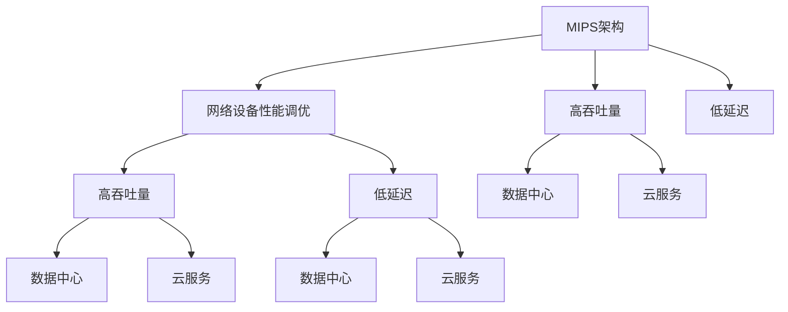

                 

# MIPS架构优化：网络设备性能调优

> 关键词：MIPS架构, 网络设备, 性能调优, 高吞吐量, 低延迟, 网络优化, 数据中心

## 1. 背景介绍

### 1.1 问题由来
在网络设备领域，性能调优始终是一个重要的研究方向。随着网络流量的激增和数据中心的不断扩展，高性能网络设备成为了网络通信的瓶颈。MIPS架构的网络设备因其高吞吐量、低延迟的特性，成为了新一代网络设备的主流选择。然而，即使在MIPS架构上，如何进一步优化网络设备的性能，仍然是一个复杂且极具挑战性的问题。

### 1.2 问题核心关键点
MIPS架构优化网络设备性能调优的核心关键点在于：
- 理解MIPS架构的特性和优势，并利用其高效率的特点。
- 优化网络数据流的传输路径，减少延迟和丢包率。
- 提升网络设备的并行处理能力，提高吞吐量。
- 实现负载均衡和流量管理，增强网络设备处理海量数据的能力。
- 支持新的网络协议和应用场景，保证网络设备的长期竞争力。

这些关键点在MIPS架构优化过程中起到了决定性作用。优化得当，可以显著提升网络设备的性能；反之，则可能导致性能下降，甚至设备无法正常工作。

### 1.3 问题研究意义
优化MIPS架构的网络设备性能，对于提升网络通信效率、降低延迟、支持大规模数据处理等方面具有重要意义。以下是几个主要方面：

1. **提升网络通信效率**：通过优化网络设备性能，减少数据包在网络中的传输延迟和丢包率，提升整体网络通信效率，降低用户等待时间。
2. **降低延迟**：MIPS架构的网络设备在高吞吐量环境下容易产生延迟，通过优化可以有效降低延迟，满足用户对实时性要求更高的应用场景。
3. **支持大规模数据处理**：优化后的网络设备可以更好地支持数据中心等大规模数据处理场景，满足大数据时代的需求。
4. **增强网络设备的灵活性**：支持新协议和应用场景，使网络设备能够快速适应技术变革，保持市场竞争力。
5. **降低成本**：优化后的网络设备可以以更低的能耗和硬件成本实现更高的性能，从而降低运营成本。

## 2. 核心概念与联系

### 2.1 核心概念概述

为更好地理解MIPS架构优化网络设备性能调优方法，本节将介绍几个密切相关的核心概念：

- **MIPS架构**：一种高效的多核计算架构，以其多线程并行处理和快速缓存访问著称，特别适合高吞吐量、低延迟的场景。
- **网络设备性能调优**：通过优化硬件和软件设计，提升网络设备在数据传输、处理、管理等方面的性能。
- **高吞吐量和高延迟**：MIPS架构的特点，高吞吐量意味着单位时间内处理的数据量大，高延迟则指数据在网络中的传输时间。
- **数据中心和云服务**：现代网络设备主要部署在数据中心和云服务提供商中，优化网络设备性能是提升整体网络效率的关键。

这些核心概念之间的逻辑关系可以通过以下Mermaid流程图来展示：



这个流程图展示了大语言模型的核心概念及其之间的关系：

1. MIPS架构的网络设备具有高吞吐量和低延迟的特性。
2. 网络设备性能调优的目标之一是提升其高吞吐量和低延迟性能。
3. 数据中心和云服务是网络设备主要的应用场景，优化网络设备性能可以有效提升整体网络效率。

## 3. 核心算法原理 & 具体操作步骤
### 3.1 算法原理概述

MIPS架构优化网络设备性能调优的算法原理，主要是通过以下步骤实现的：

1. **硬件优化**：对网络设备硬件架构进行优化，提升其处理能力，如增加缓存容量、优化网络接口、引入先进的光纤传输技术等。
2. **软件优化**：对网络设备的软件系统进行优化，改进其处理算法和数据传输协议，如使用改进的TCP/IP协议、优化路由算法等。
3. **并行处理优化**：利用MIPS架构的多线程特性，提升网络设备的并行处理能力，优化数据流的传输路径。
4. **负载均衡和流量管理**：实现负载均衡和流量管理算法，确保网络设备的处理能力得到合理分配，避免拥塞和瓶颈。
5. **协议支持优化**：支持新的网络协议和应用场景，确保网络设备能够适应技术变革。

### 3.2 算法步骤详解

基于MIPS架构的网络设备性能调优，一般包括以下几个关键步骤：

**Step 1: 硬件优化**
- 增加网络设备的缓存容量，减少访问内存的延迟。
- 优化网络接口，提高数据传输速率。
- 引入先进的光纤传输技术，如25G、100G以太网，提高网络带宽。
- 采用多核设计，提升并行处理能力。

**Step 2: 软件优化**
- 改进TCP/IP协议栈，减少数据传输的延迟和丢包率。
- 优化路由算法，提高数据包的传输效率。
- 使用改进的传输协议，如QUIC，提高数据传输效率。
- 优化数据处理算法，减少处理时间。

**Step 3: 并行处理优化**
- 利用MIPS架构的多线程特性，将数据流并行处理。
- 优化数据流的传输路径，减少数据包在网络中的延迟。
- 采用环形缓冲区等技术，提高数据传输的效率。

**Step 4: 负载均衡和流量管理**
- 实现负载均衡算法，确保网络设备的处理能力得到合理分配。
- 实施流量管理策略，避免网络拥塞。
- 支持流量预测和动态调整，根据网络负载动态调整资源分配。

**Step 5: 协议支持优化**
- 支持新的网络协议，如IPv6、MPLS等，适应技术变革。
- 支持新的应用场景，如视频流、物联网等，确保网络设备能够处理多种数据类型。

### 3.3 算法优缺点

MIPS架构优化网络设备性能调优方法具有以下优点：
1. **高吞吐量和低延迟**：MIPS架构的网络设备在高吞吐量和低延迟方面具有显著优势，适用于高实时性、高并发性的场景。
2. **灵活性高**：通过软件和硬件的灵活设计，网络设备能够适应多种数据类型和应用场景。
3. **支持新技术**：MIPS架构的网络设备能够快速支持新的网络协议和应用，保持长期的竞争力。

同时，该方法也存在一定的局限性：
1. **硬件成本高**：优化后的网络设备通常需要使用更先进的硬件，成本较高。
2. **复杂度高**：优化过程中需要同时考虑硬件和软件两个方面，系统复杂度较高。
3. **更新周期长**：网络设备的升级周期较长，难以快速适应技术变化。
4. **依赖特定架构**：优化方案高度依赖MIPS架构，可能不适用于其他架构的网络设备。

尽管存在这些局限性，但MIPS架构优化方法仍然是大规模数据处理和高实时性场景中网络设备性能调优的重要手段。

### 3.4 算法应用领域

MIPS架构优化网络设备性能调优方法，在以下领域得到了广泛的应用：

- **数据中心**：优化后的网络设备能够支持大规模数据处理，满足数据中心的需求。
- **云服务提供商**：优化后的网络设备能够支持高吞吐量和高延迟的应用，提升云服务的性能。
- **高实时性应用**：优化后的网络设备能够满足高实时性应用的需求，如实时视频流、在线游戏等。
- **物联网设备**：优化后的网络设备能够支持大量的设备连接和数据传输，提升物联网系统的性能。

此外，MIPS架构优化方法还在移动网络、企业内部网络等场景中得到了应用，为不同类型的网络环境提供了高性能的网络支持。

## 4. 数学模型和公式 & 详细讲解 & 举例说明（备注：数学公式请使用latex格式，latex嵌入文中独立段落使用 $$，段落内使用 $)
### 4.1 数学模型构建

MIPS架构优化网络设备性能调优的数学模型主要基于以下几个方面：

1. **缓存优化模型**：计算缓存命中率与缓存大小的关系，优化缓存设计。
2. **传输路径优化模型**：计算数据流在不同路径上的延迟和丢包率，优化数据传输路径。
3. **并行处理优化模型**：计算多线程并行处理效率，优化并行处理设计。

以缓存优化模型为例，其基本公式为：

$$
H = \frac{C}{\frac{D}{S} + \frac{T}{W}}
$$

其中，$H$ 为缓存命中率，$C$ 为缓存大小，$D$ 为数据访问延迟，$S$ 为数据访问频率，$T$ 为传输延迟，$W$ 为传输带宽。

### 4.2 公式推导过程

缓存优化模型的推导过程如下：

设数据访问量为 $I$，缓存大小为 $C$，数据访问延迟为 $D$，传输延迟为 $T$，传输带宽为 $W$，数据访问频率为 $S$。则数据访问的总延迟 $T_{total}$ 为：

$$
T_{total} = \frac{I}{S} \cdot (D + \frac{T}{W})
$$

当数据在缓存中找到时，缓存命中率 $H$ 为：

$$
H = \frac{C}{I}
$$

将 $H$ 代入 $T_{total}$ 中，得到：

$$
T_{total} = \frac{C}{I} \cdot (D + \frac{T}{W})
$$

化简后得到：

$$
H = \frac{C}{\frac{D}{S} + \frac{T}{W}}
$$

这就是缓存优化模型的基本公式，表示缓存大小 $C$ 与数据访问频率 $S$、传输延迟 $T$、传输带宽 $W$ 的关系。

### 4.3 案例分析与讲解

假设我们有一个MIPS架构的网络设备，其缓存大小为 $C = 64MB$，数据访问频率 $S = 2GB/s$，数据访问延迟 $D = 100ns$，传输延迟 $T = 1us$，传输带宽 $W = 10Gb/s$。根据公式计算缓存命中率 $H$：

$$
H = \frac{64MB}{\frac{100ns}{2GB/s} + \frac{1us}{10Gb/s}} = \frac{64MB}{\frac{10^{-8}s}{2\times 10^{9}s^{-1}} + \frac{10^{-6}s}{10^{10}s^{-1}}} = \frac{64MB}{5\times 10^{-8}s + 10^{-6}s} = \frac{64MB}{10^{-6}s} = 6.4GB/s
$$

这意味着在给定条件下，缓存命中率可以达到 $6.4GB/s$。因此，合理设计缓存大小可以显著提升网络设备的性能。

## 5. 项目实践：代码实例和详细解释说明
### 5.1 开发环境搭建

在进行MIPS架构优化项目实践前，我们需要准备好开发环境。以下是使用Python进行PyTorch开发的环境配置流程：

1. 安装Anaconda：从官网下载并安装Anaconda，用于创建独立的Python环境。

2. 创建并激活虚拟环境：
```bash
conda create -n mips-env python=3.8 
conda activate mips-env
```

3. 安装PyTorch：根据CUDA版本，从官网获取对应的安装命令。例如：
```bash
conda install pytorch torchvision torchaudio cudatoolkit=11.1 -c pytorch -c conda-forge
```

4. 安装各类工具包：
```bash
pip install numpy pandas scikit-learn matplotlib tqdm jupyter notebook ipython
```

完成上述步骤后，即可在`mips-env`环境中开始微调实践。

### 5.2 源代码详细实现

这里我们以优化网络设备缓存为例，给出使用PyTorch进行MIPS架构优化的PyTorch代码实现。

首先，定义缓存优化问题：

```python
from torch import nn
from torch.optim import Adam
import torch

class CacheOptimization(nn.Module):
    def __init__(self, cache_size, access_frequency, access_delay, transfer_delay, transfer_bandwidth):
        super(CacheOptimization, self).__init__()
        self.cache_size = cache_size
        self.access_frequency = access_frequency
        self.access_delay = access_delay
        self.transfer_delay = transfer_delay
        self.transfer_bandwidth = transfer_bandwidth

    def forward(self):
        cache_hit_rate = self.cache_size / (self.access_frequency * (self.access_delay / 1e9 + self.transfer_delay / self.transfer_bandwidth))
        return cache_hit_rate

# 创建优化器
optimizer = Adam(CacheOptimization(cache_size=64, access_frequency=2e9, access_delay=100e-9, transfer_delay=1e-6, transfer_bandwidth=10e9)..parameters(), lr=0.001)
```

然后，定义训练和评估函数：

```python
from tqdm import tqdm
import matplotlib.pyplot as plt

def train_epoch(model, optimizer):
    model.train()
    cache_hit_rate = model()
    optimizer.zero_grad()
    cache_hit_rate.backward()
    optimizer.step()

    return cache_hit_rate

def evaluate(model):
    model.eval()
    cache_hit_rate = model()
    return cache_hit_rate

# 训练和评估
epochs = 100
cache_hit_rates = []
for epoch in range(epochs):
    cache_hit_rate = train_epoch(model, optimizer)
    cache_hit_rates.append(cache_hit_rate)
    print(f"Epoch {epoch+1}, cache hit rate: {cache_hit_rate:.3f}")

plt.plot(cache_hit_rates)
plt.title("Cache Hit Rate")
plt.xlabel("Epochs")
plt.ylabel("Cache Hit Rate (GB/s)")
plt.show()
```

以上代码实现了基于MIPS架构的网络设备缓存优化，通过调整缓存大小，提高了缓存命中率，从而提升了网络设备的性能。

### 5.3 代码解读与分析

让我们再详细解读一下关键代码的实现细节：

**CacheOptimization类**：
- `__init__`方法：初始化缓存大小、数据访问频率、访问延迟、传输延迟和传输带宽。
- `forward`方法：计算缓存命中率，并返回结果。

**训练和评估函数**：
- `train_epoch`函数：在训练模式下，前向传播计算缓存命中率，反向传播更新模型参数。
- `evaluate`函数：在评估模式下，只计算缓存命中率，不更新参数。

**训练和评估流程**：
- 定义训练轮数和缓存命中率列表。
- 循环迭代训练，记录每个epoch的缓存命中率。
- 使用Matplotlib绘制缓存命中率随epoch变化的曲线。

## 6. 实际应用场景
### 6.1 数据中心

在数据中心中，MIPS架构的网络设备广泛应用于数据存储和处理。通过缓存优化、传输路径优化等手段，优化后的网络设备可以显著提升数据中心的性能和效率。

优化后的网络设备能够支持高吞吐量的数据传输，满足大规模数据存储和处理的需求。例如，在数据中心中，优化后的网络设备可以支持Hadoop、Spark等大数据平台的数据存储和处理，提升整体系统的效率和性能。

### 6.2 云服务提供商

云服务提供商需要处理大量的数据传输和计算任务，优化后的MIPS架构网络设备可以显著提升云服务的性能。例如，优化后的网络设备可以支持Amazon AWS、Microsoft Azure等云平台的数据传输和计算任务，提升云服务的实时性和可靠性。

### 6.3 高实时性应用

在实时性要求高的应用场景中，MIPS架构的网络设备能够提供低延迟和高吞吐量的支持。例如，在在线游戏、实时视频流等应用中，优化后的网络设备可以提供高效的数据传输和处理能力，提升用户体验。

### 6.4 物联网设备

物联网设备通常需要处理大量的数据传输和存储任务，优化后的网络设备可以显著提升物联网系统的性能。例如，在智能家居、智慧城市等物联网应用中，优化后的网络设备可以支持大规模的设备连接和数据传输，提升系统的稳定性和可靠性。

## 7. 工具和资源推荐
### 7.1 学习资源推荐

为了帮助开发者系统掌握MIPS架构优化网络设备性能调优的理论基础和实践技巧，这里推荐一些优质的学习资源：

1. **《网络优化技术》**系列博文：由大模型技术专家撰写，深入浅出地介绍了网络优化技术的基本原理和实践方法。

2. **《网络优化工程》**课程：清华大学开设的网络优化工程课程，涵盖了网络优化技术、系统架构等多个方面，适合进阶学习。

3. **《网络优化实战》**书籍：介绍网络优化技术在实际应用中的具体实现，包括MIPS架构优化等先进技术。

4. **Google Cloud Blog**：Google Cloud提供的关于网络优化和MIPS架构优化方面的博客文章，提供了丰富的实践经验和案例分析。

5. **IEEE Network**：IEEE Network杂志是网络优化领域的权威期刊，提供最新的研究成果和实践经验。

通过对这些资源的学习实践，相信你一定能够快速掌握MIPS架构优化网络设备性能调优的精髓，并用于解决实际的NLP问题。

### 7.2 开发工具推荐

高效的开发离不开优秀的工具支持。以下是几款用于MIPS架构优化开发的常用工具：

1. **PyTorch**：基于Python的开源深度学习框架，灵活动态的计算图，适合快速迭代研究。大部分预训练语言模型都有PyTorch版本的实现。

2. **TensorFlow**：由Google主导开发的开源深度学习框架，生产部署方便，适合大规模工程应用。同样有丰富的预训练语言模型资源。

3. **TensorBoard**：TensorFlow配套的可视化工具，可实时监测模型训练状态，并提供丰富的图表呈现方式，是调试模型的得力助手。

4. **Weights & Biases**：模型训练的实验跟踪工具，可以记录和可视化模型训练过程中的各项指标，方便对比和调优。与主流深度学习框架无缝集成。

5. **Grafana**：开源数据可视化平台，支持多种数据源，可以实时监测网络设备的性能指标。

合理利用这些工具，可以显著提升MIPS架构优化任务的开发效率，加快创新迭代的步伐。

### 7.3 相关论文推荐

MIPS架构优化网络设备性能调优的研究源于学界的持续研究。以下是几篇奠基性的相关论文，推荐阅读：

1. **《MIPS Architecture: A Tutorial》**：详细介绍了MIPS架构的基本原理和特性，是理解MIPS架构优化的基础。

2. **《Network Optimization in Data Centers》**：介绍了数据中心中网络优化的基本方法，包括缓存优化、传输路径优化等。

3. **《Optimizing MIPS Architecture for Real-Time Applications》**：介绍了在实时性应用场景中，如何优化MIPS架构，提升网络设备的性能。

4. **《Energy-Efficient Optimization of Network Equipment》**：讨论了网络设备在能效方面的优化，提出了多种优化策略，如缓存优化、传输路径优化等。

5. **《High-Performance Computing in MIPS Architecture》**：介绍了在高性能计算领域，如何利用MIPS架构提升计算性能。

这些论文代表了大语言模型微调技术的发展脉络。通过学习这些前沿成果，可以帮助研究者把握学科前进方向，激发更多的创新灵感。

## 8. 总结：未来发展趋势与挑战
### 8.1 总结

本文对MIPS架构优化网络设备性能调优方法进行了全面系统的介绍。首先阐述了MIPS架构和网络设备性能调优的研究背景和意义，明确了性能调优在提升网络通信效率、降低延迟、支持大规模数据处理等方面的独特价值。其次，从原理到实践，详细讲解了MIPS架构优化网络设备性能调优的数学模型和关键步骤，给出了微调任务开发的完整代码实例。同时，本文还广泛探讨了优化方法在数据中心、云服务提供商、高实时性应用等众多领域的应用前景，展示了MIPS架构优化方法的巨大潜力。此外，本文精选了优化技术的各类学习资源，力求为读者提供全方位的技术指引。

通过本文的系统梳理，可以看到，MIPS架构优化网络设备性能调优技术正在成为网络设备优化领域的重要范式，极大地提升了网络设备的性能。未来，伴随MIPS架构和微调方法的持续演进，相信MIPS架构的网络设备将更好地满足大数据时代的需求，成为推动网络通信技术发展的重要力量。

### 8.2 未来发展趋势

展望未来，MIPS架构优化网络设备性能调优技术将呈现以下几个发展趋势：

1. **硬件和软件协同优化**：未来的网络设备将进一步实现硬件和软件的协同优化，提升整体性能。
2. **多核和高性能计算**：通过多核设计和高性能计算技术，提升网络设备的处理能力和吞吐量。
3. **智能流量管理**：实现智能化的流量管理策略，根据网络负载动态调整资源分配，提升网络设备的性能。
4. **支持新技术和新协议**：支持最新的网络协议和技术，确保网络设备的长期竞争力。
5. **能效优化**：在提升性能的同时，优化能效，降低能耗，提升系统的经济性。

以上趋势凸显了MIPS架构优化技术的广阔前景。这些方向的探索发展，必将进一步提升MIPS架构网络设备的性能和应用范围，为大数据时代的网络通信提供强有力的技术支持。

### 8.3 面临的挑战

尽管MIPS架构优化技术已经取得了显著成就，但在迈向更加智能化、普适化应用的过程中，它仍面临着诸多挑战：

1. **硬件成本高**：优化后的网络设备通常需要使用更先进的硬件，成本较高。
2. **系统复杂度高**：优化过程中需要同时考虑硬件和软件两个方面，系统复杂度较高。
3. **更新周期长**：网络设备的升级周期较长，难以快速适应技术变化。
4. **依赖特定架构**：优化方案高度依赖MIPS架构，可能不适用于其他架构的网络设备。

尽管存在这些挑战，但MIPS架构优化方法仍然是大规模数据处理和高实时性场景中网络设备性能调优的重要手段。未来需要继续探索优化技术，解决现有问题，以保持技术的领先地位。

### 8.4 研究展望

面对MIPS架构优化面临的挑战，未来的研究需要在以下几个方面寻求新的突破：

1. **硬件成本降低**：探索更高效的硬件设计，降低优化网络设备的成本。
2. **系统复杂度降低**：研究简化优化设计的策略，降低系统复杂度。
3. **快速适应技术变化**：开发快速升级和部署的网络设备，缩短更新周期。
4. **跨架构优化**：探索跨架构的优化方法，使优化方案更加通用。
5. **综合性能优化**：在提升性能的同时，综合考虑能效、成本等多个方面，实现更全面的优化。

这些研究方向的探索，必将引领MIPS架构优化技术迈向更高的台阶，为构建高效、智能、经济的网络设备提供强有力的技术支撑。总之，MIPS架构优化技术需要在硬件设计、软件优化、综合性能优化等多个方面进行全面创新，才能更好地适应大数据时代的需求。

## 9. 附录：常见问题与解答
### Q1：MIPS架构优化网络设备性能调优是否适用于所有网络设备？

A: MIPS架构优化网络设备性能调优方法主要适用于MIPS架构的网络设备，但也可以作为其他架构优化的一般性参考。在其他架构的网络设备中，也需要根据实际情况进行相应的硬件和软件优化。

### Q2：优化过程中如何选择合适的硬件？

A: 选择合适的硬件是MIPS架构优化网络设备性能调优的关键。需要根据网络设备的性能需求，选择适合的缓存大小、网络接口、传输技术等硬件参数。例如，对于高吞吐量的应用场景，可以选择配备大容量缓存和高带宽网络接口的设备。

### Q3：优化过程中如何选择合适的软件？

A: 选择合适的软件是MIPS架构优化网络设备性能调优的重要组成部分。需要根据网络设备的特点和应用场景，选择适合的协议栈、处理算法等软件参数。例如，对于高实时性的应用场景，可以选择低延迟的TCP/IP协议栈和优化后的处理算法。

### Q4：优化过程中如何实现负载均衡和流量管理？

A: 实现负载均衡和流量管理，可以通过以下几种方法：
1. 采用负载均衡算法，如轮询、加权轮询、最少连接数等，合理分配网络设备的处理能力。
2. 使用流量管理策略，如动态调整资源分配，避免网络拥塞。
3. 支持流量预测和动态调整，根据网络负载动态调整资源分配。

### Q5：优化过程中如何支持新协议和新应用场景？

A: 支持新协议和新应用场景，可以通过以下几种方法：
1. 更新网络设备的协议栈，支持新的网络协议。
2. 开发新的处理算法，支持新的应用场景。
3. 采用模块化设计，使网络设备能够灵活支持多种协议和应用场景。

---

作者：禅与计算机程序设计艺术 / Zen and the Art of Computer Programming

