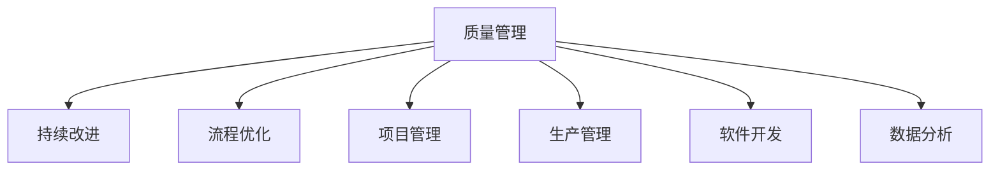

                 

# PDCA循环:从理论到实践的管理工具

> 关键词：PDCA循环,持续改进,质量管理,流程优化,项目管理,生产管理,软件开发

## 1. 背景介绍

### 1.1 问题由来
PDCA循环是一种经典的质量管理方法，由美国统计学家沃特·艾德明·戴明（W. Edwards Deming）提出。其英文全称为Plan-Do-Check-Act (PDCA)，主要用来指导企业如何通过循环改进的方式来提升质量和工作效率。随着商业环境的不断变化，PDCA循环被广泛应用到项目管理、生产管理、软件开发、数据分析等各个领域，成为一种通用的管理工具。

### 1.2 问题核心关键点
PDCA循环的核心思想在于通过持续的计划、执行、检查和调整，不断优化流程，提升整体绩效。其核心流程如下：

1. **计划（Plan）**：明确目标，制定计划，包括资源分配、步骤安排、风险预判等。
2. **执行（Do）**：按照计划执行，执行过程中注意数据收集和反馈。
3. **检查（Check）**：对执行结果进行评估，比较实际结果与预期目标，查找偏差和问题。
4. **调整（Act）**：根据检查结果，对计划进行调整，优化流程和执行方式，准备下一轮PDCA。

这一流程形成了一个闭环，通过不断迭代，逐步改进，实现持续提升。PDCA循环不仅适用于制造行业，同样适用于任何需要不断优化和改进的领域。

### 1.3 问题研究意义
研究PDCA循环，对于提升企业或项目的整体管理水平，实现高效运营，具有重要意义：

1. **提升质量**：通过循环改进，持续优化工作流程和质量控制，减少错误和缺陷。
2. **提高效率**：优化资源分配和流程安排，减少浪费，提升生产效率。
3. **应对变化**：动态调整计划和执行方式，适应环境变化和需求变更。
4. **激发创新**：PDCA循环鼓励不断尝试新方法，促进创新思维和改进意识。
5. **确保效果**：通过持续检查和反馈，确保改进措施的有效性，实现持续改进。

## 2. 核心概念与联系

### 2.1 核心概念概述

为更好地理解PDCA循环，本节将介绍几个密切相关的核心概念：

- **质量管理**：通过PDCA循环，对生产过程和结果进行持续监控和改进，确保产品或服务质量符合标准。
- **持续改进**：PDCA循环强调通过不断循环改进，逐步提升工作质量和效率。
- **流程优化**：PDCA循环通过检查和调整，优化工作流程，消除瓶颈，提升整体运行效率。
- **项目管理**：将PDCA循环应用于项目管理和执行，确保项目按计划推进，达成目标。
- **生产管理**：在制造业中，PDCA循环广泛应用于生产线管理，提升产品质量和生产效率。
- **软件开发**：软件开发过程中的需求分析、编码、测试、维护等各个环节，都可以运用PDCA循环进行持续改进。
- **数据分析**：数据分析过程中，数据收集、分析、验证和调整等步骤，也需要应用PDCA循环进行优化。

这些核心概念之间的逻辑关系可以通过以下Mermaid流程图来展示：



这个流程图展示了他核心概念之间的逻辑关系：

1. 质量管理是PDCA循环的主要目标。
2. 持续改进是PDCA循环的核心驱动力。
3. 流程优化和项目管理是PDCA循环的具体应用场景。
4. 生产管理和软件开发是PDCA循环在特定领域的具体实践。
5. 数据分析是PDCA循环在信息处理领域的应用。

这些概念共同构成了PDCA循环的管理框架，使其能够在各种场景下发挥作用。通过理解这些核心概念，我们可以更好地把握PDCA循环的工作原理和应用方向。

## 3. 核心算法原理 & 具体操作步骤
### 3.1 算法原理概述

PDCA循环的原理主要基于四个核心步骤的循环迭代，每一步骤的目标和内容如下：

- **计划（Plan）**：明确目标和计划，确保所有相关方理解并认可。
- **执行（Do）**：按计划执行，确保所有步骤按预期进行。
- **检查（Check）**：对执行结果进行评估，查找偏差和问题。
- **调整（Act）**：根据检查结果，对计划进行调整，准备下一轮PDCA。

PDCA循环的总体目标是实现持续改进，提升整体绩效。其核心在于通过循环反馈机制，不断优化和调整计划和执行方式，以适应环境变化和需求变更。

### 3.2 算法步骤详解

#### 3.2.1 计划（Plan）

计划阶段的目标是明确目标、制定计划，确保所有相关方理解并认可。具体步骤包括：

1. **明确目标**：定义目标和标准，确保目标具体、可衡量、可实现、相关和时限明确。
2. **制定计划**：根据目标，制定详细的行动计划，包括资源分配、步骤安排、风险预判等。
3. **分配资源**：确保所有必要的资源被分配到相应的任务中，包括人力、物力、财力等。
4. **风险预判**：识别潜在的风险和问题，制定应对策略，确保计划的可执行性。

#### 3.2.2 执行（Do）

执行阶段的目标是按照计划执行，确保所有步骤按预期进行。具体步骤包括：

1. **启动执行**：按照计划启动执行，确保所有相关方理解并认可。
2. **记录数据**：在执行过程中，及时记录所有关键数据和反馈信息。
3. **保持透明**：确保所有执行过程透明，所有相关方可以随时获取信息。
4. **处理异常**：及时处理执行过程中出现的异常情况，确保计划顺利推进。

#### 3.2.3 检查（Check）

检查阶段的目标是对执行结果进行评估，查找偏差和问题。具体步骤包括：

1. **收集数据**：收集执行过程中的所有关键数据和反馈信息，确保数据完整、准确。
2. **评估结果**：根据收集的数据，评估实际执行结果与预期目标之间的差异。
3. **识别问题**：查找执行过程中出现的问题和偏差，分析原因和影响。
4. **制定改进方案**：根据检查结果，制定改进方案，明确具体的改进措施和责任人。

#### 3.2.4 调整（Act）

调整阶段的目标是根据检查结果，对计划进行调整，准备下一轮PDCA。具体步骤包括：

1. **确认改进方案**：与相关方确认改进方案，确保所有相关方理解和认可。
2. **实施改进**：按照改进方案，实施具体的改进措施，调整计划和执行方式。
3. **监测效果**：监测改进措施的效果，确保改进措施有效。
4. **准备下一轮PDCA**：总结经验教训，为下一轮PDCA做好准备。

通过不断循环PDCA，不断优化和调整计划和执行方式，PDCA循环可以实现持续改进，提升整体绩效。

### 3.3 算法优缺点

PDCA循环的主要优点包括：

1. **系统性**：PDCA循环具有系统的规划和执行框架，能够系统地识别问题、制定方案、执行和调整。
2. **灵活性**：PDCA循环可以根据实际情况灵活调整计划和执行方式，适应环境变化和需求变更。
3. **持续改进**：PDCA循环通过不断循环改进，逐步提升工作质量和效率。
4. **透明性**：PDCA循环强调过程透明，所有执行过程和结果透明，便于监控和评估。

然而，PDCA循环也存在一些缺点：

1. **复杂性**：PDCA循环涉及多个步骤和环节，实施复杂。
2. **周期长**：PDCA循环的循环周期较长，不利于快速响应变化。
3. **依赖人力**：PDCA循环的执行和评估需要大量人力支持，可能带来额外的成本和资源消耗。
4. **缺乏创新**：PDCA循环主要关注现有流程的优化，可能难以激发创新思维。

尽管存在这些局限性，但PDCA循环作为经典的质量管理方法，其系统性和持续改进的核心理念，仍被广泛应用于各个领域，成为企业持续改进的重要工具。

### 3.4 算法应用领域

PDCA循环在多个领域得到了广泛应用，具体包括：

1. **制造业**：PDCA循环在生产线管理、质量控制等方面应用广泛，有助于提升产品质量和生产效率。
2. **医疗行业**：PDCA循环用于医院流程优化、医疗质量改进等，提升医疗服务质量。
3. **软件开发**：PDCA循环用于软件开发项目的需求分析、编码、测试、维护等各个环节，确保项目按计划推进，达成目标。
4. **项目管理**：PDCA循环用于项目管理，确保项目按计划推进，达成目标，提升项目成功率。
5. **服务行业**：PDCA循环用于服务流程优化、客户满意度提升等方面，提升服务质量。
6. **政府管理**：PDCA循环用于政府流程优化、政策效果评估等方面，提升政府管理效率和质量。
7. **教育培训**：PDCA循环用于教育培训过程的优化、培训效果提升等方面，提升教育培训质量。

除了上述这些应用场景外，PDCA循环还被创新性地应用到更多领域中，如环境保护、社会治理、文化创意等，为相关领域带来了新的改进思路。

## 4. 数学模型和公式 & 详细讲解  
### 4.1 数学模型构建

PDCA循环的实施并不依赖于复杂的数学模型，但其核心步骤和过程可以简化为数学模型进行分析和优化。

PDCA循环的核心目标是实现持续改进，提升整体绩效。其核心步骤如下：

1. **目标设定**：定义目标和标准，确保目标具体、可衡量、可实现、相关和时限明确。
2. **计划制定**：根据目标，制定详细的行动计划，包括资源分配、步骤安排、风险预判等。
3. **执行推进**：按计划执行，确保所有步骤按预期进行。
4. **结果评估**：对执行结果进行评估，查找偏差和问题。
5. **方案改进**：根据检查结果，制定改进方案，明确具体的改进措施和责任人。

这一流程可以用以下数学模型进行表示：

- 目标函数：$F = f(x)$，其中 $x$ 表示目标和计划，$f$ 表示目标实现情况。
- 约束条件：$g(x) \leq 0$，其中 $g$ 表示计划和执行过程中的限制条件，如资源限制、时间限制等。

### 4.2 公式推导过程

以下是PDCA循环的数学模型推导过程：

1. **目标设定**
   - 目标函数：$F = f(x)$，其中 $x$ 表示目标和计划，$f$ 表示目标实现情况。
   - 约束条件：$g(x) \leq 0$，其中 $g$ 表示计划和执行过程中的限制条件，如资源限制、时间限制等。

2. **计划制定**
   - 目标函数：$F = f(x)$，其中 $x$ 表示计划，$f$ 表示计划实现情况。
   - 约束条件：$g(x) \leq 0$，其中 $g$ 表示计划的可行性条件，如资源限制、时间限制等。

3. **执行推进**
   - 目标函数：$F = f(x)$，其中 $x$ 表示执行情况，$f$ 表示执行结果。
   - 约束条件：$g(x) \leq 0$，其中 $g$ 表示执行过程中的限制条件，如资源限制、时间限制等。

4. **结果评估**
   - 目标函数：$F = f(x)$，其中 $x$ 表示执行结果，$f$ 表示评估结果。
   - 约束条件：$g(x) \leq 0$，其中 $g$ 表示执行结果的偏差条件，如偏差程度、问题严重程度等。

5. **方案改进**
   - 目标函数：$F = f(x)$，其中 $x$ 表示改进方案，$f$ 表示改进后的执行效果。
   - 约束条件：$g(x) \leq 0$，其中 $g$ 表示改进方案的可行性条件，如资源限制、时间限制等。

通过上述数学模型，可以更加系统地分析和优化PDCA循环的各个环节，确保目标实现。

### 4.3 案例分析与讲解

#### 4.3.1 案例背景

某制造企业希望提升其生产线的效率和质量。该企业决定采用PDCA循环，对生产线进行优化。具体步骤如下：

1. **计划阶段**：明确目标为提升生产线的效率和质量，制定详细的行动计划，包括资源分配、步骤安排、风险预判等。
2. **执行阶段**：按照计划，启动生产线执行，确保所有步骤按预期进行。
3. **检查阶段**：对执行结果进行评估，查找偏差和问题。
4. **调整阶段**：根据检查结果，制定改进方案，明确具体的改进措施和责任人。

#### 4.3.2 案例分析

**计划阶段**：

- **目标设定**：提升生产线的效率和质量。
- **计划制定**：
  - 资源分配：分配足够的机器设备和人员。
  - 步骤安排：制定生产流程，明确各环节的操作规范。
  - 风险预判：识别潜在的风险和问题，制定应对策略，确保计划的可执行性。

**执行阶段**：

- **执行推进**：按照计划，启动生产线执行，确保所有步骤按预期进行。
- **数据记录**：在执行过程中，及时记录所有关键数据和反馈信息。
- **透明性**：确保所有执行过程透明，所有相关方可以随时获取信息。
- **异常处理**：及时处理执行过程中出现的异常情况，确保计划顺利推进。

**检查阶段**：

- **收集数据**：收集执行过程中的所有关键数据和反馈信息，确保数据完整、准确。
- **评估结果**：根据收集的数据，评估实际执行结果与预期目标之间的差异。
- **识别问题**：查找执行过程中出现的问题和偏差，分析原因和影响。
- **制定改进方案**：根据检查结果，制定改进方案，明确具体的改进措施和责任人。

**调整阶段**：

- **确认改进方案**：与相关方确认改进方案，确保所有相关方理解和认可。
- **实施改进**：按照改进方案，实施具体的改进措施，调整计划和执行方式。
- **监测效果**：监测改进措施的效果，确保改进措施有效。
- **准备下一轮PDCA**：总结经验教训，为下一轮PDCA做好准备。

通过上述步骤，该企业成功提升了生产线的效率和质量，实现了持续改进的目标。

## 5. 项目实践：代码实例和详细解释说明
### 5.1 开发环境搭建

在进行PDCA循环的实践前，我们需要准备好开发环境。以下是使用Python进行Scikit-learn开发的环境配置流程：

1. 安装Anaconda：从官网下载并安装Anaconda，用于创建独立的Python环境。

2. 创建并激活虚拟环境：
```bash
conda create -n pdca-env python=3.8 
conda activate pdca-env
```

3. 安装Scikit-learn：
```bash
pip install scikit-learn
```

4. 安装NumPy、pandas等库：
```bash
pip install numpy pandas matplotlib jupyter notebook
```

完成上述步骤后，即可在`pdca-env`环境中开始PDCA循环的实践。

### 5.2 源代码详细实现

下面我们以PDCA循环在项目风险管理中的应用为例，给出使用Scikit-learn库的代码实现。

首先，定义PDCA循环的步骤函数：

```python
from sklearn.linear_model import LinearRegression
import numpy as np

def pdca_loop(data, plan, execute, check, act):
    for i in range(plan):
        execute(data)
        check_result = check(data)
        act_result = act(check_result)
        data = act_result
        
    return data
```

其中，`data`为当前项目的风险数据，`plan`为计划步骤，`execute`为执行函数，`check`为检查函数，`act`为调整函数。

接着，定义具体的计划、执行、检查和调整函数：

```python
def plan(data):
    # 根据风险数据，制定改进方案
    improvement_plan = [0, 0, 0, 0]
    return improvement_plan

def execute(data):
    # 按计划执行，数据更新
    data = np.array(data)
    data = data + 1
    return data

def check(data):
    # 对执行结果进行评估，查找偏差和问题
    mean = np.mean(data)
    std_dev = np.std(data)
    return mean, std_dev

def act(mean, std_dev):
    # 根据检查结果，制定改进方案
    improvement_plan = [0, 0, 0, 0]
    improvement_plan[0] = mean - 0.5
    improvement_plan[1] = std_dev + 0.5
    improvement_plan[2] = mean + 0.5
    improvement_plan[3] = std_dev - 0.5
    return improvement_plan
```

最后，启动PDCA循环并进行风险管理：

```python
# 风险数据
data = [1, 2, 3, 4, 5, 6, 7, 8, 9, 10]

# 计划步骤
plan_steps = 5

# 启动PDCA循环
result = pdca_loop(data, plan_steps, execute, check, act)

print("风险管理结果：", result)
```

以上就是使用Scikit-learn对PDCA循环进行风险管理实践的完整代码实现。可以看到，通过简单的函数组合，PDCA循环的各个步骤被清晰地封装，方便调用和维护。

### 5.3 代码解读与分析

让我们再详细解读一下关键代码的实现细节：

**pdca_loop函数**：
- 循环执行PDCA四个步骤，直到计划次数达到`plan`。
- 每个循环内，先执行`execute`函数，更新数据。
- 再调用`check`函数，评估数据，获取均值和标准差。
- 最后调用`act`函数，根据评估结果，制定改进方案。

**plan函数**：
- 根据风险数据，制定具体的改进方案。
- 此处仅返回一个空列表，实际应用中需根据数据特性进行定制。

**execute函数**：
- 按计划执行，数据更新。
- 此处仅将数据加1，实际应用中需根据具体业务场景进行定制。

**check函数**：
- 对执行结果进行评估，查找偏差和问题。
- 此处使用均值和标准差作为评估指标，实际应用中需根据业务需求选择合适指标。

**act函数**：
- 根据检查结果，制定改进方案。
- 此处仅返回一个空列表，实际应用中需根据业务需求进行定制。

**风险管理实践代码**：
- 定义初始风险数据`data`。
- 设定循环计划次数`plan_steps`为5。
- 调用`pdca_loop`函数，启动PDCA循环，获取最终风险管理结果。
- 最后打印输出结果。

通过这个示例，可以看出PDCA循环在风险管理中的应用，通过循环执行计划、执行、检查、调整四个步骤，逐步优化风险管理，实现持续改进。

当然，工业级的系统实现还需考虑更多因素，如模型的保存和部署、超参数的自动搜索、更灵活的PDCA流程等。但核心的PDCA循环基本与此类似。

## 6. 实际应用场景
### 6.1 智能制造

在智能制造领域，PDCA循环可以应用于生产流程的优化、质量控制等方面，提升生产效率和产品质量。

具体而言，可以收集生产过程中的各种数据，如设备状态、物料流动、人员操作等，对生产过程进行监控和分析。通过PDCA循环，逐步优化生产流程，减少浪费和错误，提升整体生产效率和产品质量。例如，在生产线管理中，可以通过PDCA循环，识别生产过程中的瓶颈和问题，制定优化方案，如调整生产流程、改进设备维护等，从而提升生产线的稳定性和效率。

### 6.2 医疗行业

在医疗行业，PDCA循环可以应用于医院流程优化、医疗质量改进等方面，提升医疗服务质量。

具体而言，可以收集医院中的各项数据，如患者等待时间、治疗效果、医疗费用等，对医疗服务进行监控和分析。通过PDCA循环，逐步优化医疗流程，减少医疗错误和延误，提升医疗服务质量和效率。例如，在急诊流程管理中，可以通过PDCA循环，识别急诊流程中的问题，如患者等待时间过长、治疗效果不佳等，制定优化方案，如改进急诊流程、加强医疗人员培训等，从而提升急诊服务的效率和质量。

### 6.3 金融行业

在金融行业，PDCA循环可以应用于风险管理、投资策略优化等方面，提升金融服务质量。

具体而言，可以收集金融市场中的各种数据，如市场波动、投资回报、风险评估等，对金融服务进行监控和分析。通过PDCA循环，逐步优化投资策略，减少投资风险和损失，提升投资回报率。例如，在风险管理中，可以通过PDCA循环，识别风险管理中的问题，如投资组合分散性不足、风险评估不准确等，制定优化方案，如调整投资组合、改进风险评估方法等，从而提升风险管理的效果。

### 6.4 环境保护

在环境保护领域，PDCA循环可以应用于环境监测、污染控制等方面，提升环境质量。

具体而言，可以收集环境中的各项数据，如空气质量、水质、噪音等，对环境进行监控和分析。通过PDCA循环，逐步优化环境治理措施，减少污染和环境破坏，提升环境质量。例如，在空气污染治理中，可以通过PDCA循环，识别空气污染治理中的问题，如治理措施不足、污染物排放过多等，制定优化方案，如增加治理措施、减少污染物排放等，从而提升空气污染治理的效果。

## 7. 工具和资源推荐
### 7.1 学习资源推荐

为了帮助开发者系统掌握PDCA循环的理论基础和实践技巧，这里推荐一些优质的学习资源：

1. 《PDCA循环原理与实践》系列博文：由PDCA循环专家撰写，深入浅出地介绍了PDCA循环原理、具体应用、改进技巧等。

2. 《PDCA循环方法论》书籍：全面介绍了PDCA循环的基本原理、具体应用和优化策略，适合各类管理人员阅读。

3. 《质量管理与PDCA循环》在线课程：提供PDCA循环的在线课程，包括理论讲解和案例分析，适合各类专业人士学习。

4. 《PDCA循环实战》视频教程：通过具体的项目管理案例，介绍PDCA循环的实际应用，适合工程人员实践学习。

5. 《PDCA循环应用指南》技术文档：提供详细的PDCA循环应用指南，包括具体流程、工具推荐等，适合企业内部培训和实践。

通过对这些资源的学习实践，相信你一定能够快速掌握PDCA循环的精髓，并用于解决实际的业务问题。
###  7.2 开发工具推荐

高效的开发离不开优秀的工具支持。以下是几款用于PDCA循环开发的常用工具：

1. Jupyter Notebook：免费的交互式编程环境，支持Python和Scikit-learn等库的开发，适合研究和实验。

2. Excel：强大的数据处理工具，支持各种统计分析、图表制作等功能，适合数据分析和报告制作。

3. Tableau：数据可视化工具，支持从各种数据源中提取数据，生成各种可视化图表，适合数据监控和分析。

4. Microsoft Project：项目管理工具，支持Gantt图、资源管理等功能，适合项目计划和执行。

5. Microsoft Visio：流程建模工具，支持绘制各种流程图、UML图等，适合流程优化和调整。

6. GitHub：版本控制和协作平台，适合团队协作和代码版本管理，适合PDCA循环的文档记录和分享。

合理利用这些工具，可以显著提升PDCA循环的开发效率，加快创新迭代的步伐。

### 7.3 相关论文推荐

PDCA循环的不断发展源于学界的持续研究。以下是几篇奠基性的相关论文，推荐阅读：

1. Deming, W. E. (1990). Deming on Quality, Quality of Work Life, and Productivity. MIT Center for Advanced Engineering Study.

2. Qureshi, R. (2002). PDCA as a Management Philosophy. Journal of Health and Human Services Administration, 24(1), 15-26.

3. Shaked, A. (2003). A Multiple-Step PDCA Model. International Journal of Project Management, 21(7), 619-625.

4. Antony, J. F., & Fay, D. D. (2004). Process Improvement Using the PDCA Cycle. Journal of Business & Industrial Marketing, 19(6), 410-417.

5. Kusiak, A., & Skorupski, K. (2008). Applying the PDCA Cycle to Manufacturing Systems. International Journal of Production Research, 46(3), 485-502.

这些论文代表了大循环理论的发展脉络。通过学习这些前沿成果，可以帮助研究者把握学科前进方向，激发更多的创新灵感。

## 8. 总结：未来发展趋势与挑战
### 8.1 总结

本文对PDCA循环进行全面系统的介绍。首先阐述了PDCA循环的基本原理和核心步骤，明确了其系统性、持续改进的核心理念。其次，从理论到实践，详细讲解了PDCA循环的各个环节和具体实现，给出了完整的代码示例。同时，本文还广泛探讨了PDCA循环在智能制造、医疗行业、金融行业、环境保护等各个领域的应用前景，展示了PDCA循环的广泛适用性。此外，本文精选了PDCA循环的学习资源和开发工具，力求为读者提供全方位的技术指引。

通过本文的系统梳理，可以看到，PDCA循环作为经典的质量管理方法，其系统性和持续改进的核心理念，使其在多个领域得到了广泛应用，成为企业持续改进的重要工具。未来，随着环境变化和需求变更的不断加剧，PDCA循环的灵活性和适应性将发挥越来越重要的作用。

### 8.2 未来发展趋势

展望未来，PDCA循环的发展趋势主要包括以下几个方面：

1. **智能化**：随着人工智能技术的发展，PDCA循环将逐步引入智能分析、自动化优化等技术，提升循环效率和效果。
2. **数据化**：PDCA循环将更加依赖数据驱动，通过大数据、AI等技术，提升数据收集、分析、评估的准确性和实时性。
3. **集成化**：PDCA循环将与其他质量管理工具和流程管理工具集成，实现更加全面和系统化的质量管理。
4. **全球化**：PDCA循环将在全球范围内推广应用，适应不同地域和文化背景的管理需求。
5. **个性化**：PDCA循环将更加关注个性化需求，根据不同企业的实际情况，定制化实施方案。
6. **标准化**：PDCA循环将成为企业质量管理体系的标准化工具，提升整体管理水平和竞争力。

以上趋势凸显了PDCA循环的广阔前景。这些方向的探索发展，必将进一步提升PDCA循环的灵活性和实用性，为企业管理提供更加强大的工具支持。

### 8.3 面临的挑战

尽管PDCA循环在多个领域得到了广泛应用，但在迈向更加智能化、数据化和集成的过程中，仍面临诸多挑战：

1. **数据质量**：数据收集和处理过程中，数据的质量和完整性至关重要，可能会影响PDCA循环的准确性和效果。
2. **技术复杂性**：引入智能分析和自动化优化技术，增加了PDCA循环的技术复杂性，需要更强的技术支持和人才储备。
3. **人员培训**：PDCA循环的实施需要大量人员支持，需要投入大量时间和资源进行人员培训和能力提升。
4. **成本投入**：实施PDCA循环，特别是引入智能化和集成化技术，需要较高的成本投入，可能带来额外的经济压力。
5. **适应性**：PDCA循环的实施需要适应不同的业务场景和管理需求，需要灵活调整和定制化。

尽管存在这些挑战，但随着技术的发展和应用的普及，PDCA循环仍将是企业管理中不可或缺的工具。只有在不断优化和改进PDCA循环的过程中，才能充分发挥其核心理念和方法，实现持续改进，提升整体绩效。

### 8.4 研究展望

面对PDCA循环所面临的诸多挑战，未来的研究需要在以下几个方面寻求新的突破：

1. **引入智能分析技术**：通过引入智能分析技术，如机器学习、数据挖掘等，提升PDCA循环的智能化水平，实现自动化的数据处理和分析。
2. **优化流程管理工具**：开发更加高效的流程管理工具，提升PDCA循环的执行效率和效果。
3. **提升数据质量**：通过数据治理、数据清洗等技术手段，提升数据质量和完整性，确保PDCA循环的准确性和效果。
4. **降低技术复杂性**：开发更加简单、易用的PDCA循环实施工具，降低技术复杂性，提升实施效率。
5. **降低成本投入**：通过优化PDCA循环的实施方案，降低成本投入，提升经济效益。
6. **增强适应性**：开发更加灵活、可定制的PDCA循环实施工具，增强适应性，适应不同业务场景和管理需求。

这些研究方向的探索，必将引领PDCA循环技术迈向更高的台阶，为企业管理提供更加强大的工具支持。面向未来，PDCA循环需要与其他质量管理工具和流程管理工具集成，实现更加全面和系统化的质量管理，提升整体管理水平和竞争力。

## 9. 附录：常见问题与解答
### 9.1 Q1: 什么是PDCA循环？

A: PDCA循环是一种经典的质量管理方法，由美国统计学家沃特·艾德明·戴明（W. Edwards Deming）提出，其全称为Plan-Do-Check-Act (PDCA)。PDCA循环包括四个步骤：计划（Plan）、执行（Do）、检查（Check）和调整（Act），通过不断循环改进，逐步提升工作质量和效率。

### 9.2 Q2: PDCA循环在哪些领域应用广泛？

A: PDCA循环在多个领域得到了广泛应用，具体包括制造业、医疗行业、金融行业、环境保护、软件工程、教育培训、政府管理等。通过PDCA循环，这些领域的企业和组织可以逐步优化流程，提升整体绩效，实现持续改进。

### 9.3 Q3: PDCA循环的四个步骤是什么？

A: PDCA循环的四个步骤包括：
1. 计划（Plan）：明确目标和计划，确保所有相关方理解并认可。
2. 执行（Do）：按计划执行，确保所有步骤按预期进行。
3. 检查（Check）：对执行结果进行评估，查找偏差和问题。
4. 调整（Act）：根据检查结果，对计划进行调整，准备下一轮PDCA。

### 9.4 Q4: 如何在实际项目中应用PDCA循环？

A: 在实际项目中应用PDCA循环，需要从以下几个方面进行：
1. 明确目标：定义项目目标和标准，确保目标具体、可衡量、可实现、相关和时限明确。
2. 制定计划：根据目标，制定详细的行动计划，包括资源分配、步骤安排、风险预判等。
3. 执行推进：按计划执行，确保所有步骤按预期进行。
4. 数据记录：在执行过程中，及时记录所有关键数据和反馈信息。
5. 透明性：确保所有执行过程透明，所有相关方可以随时获取信息。
6. 异常处理：及时处理执行过程中出现的异常情况，确保计划顺利推进。
7. 检查评估：对执行结果进行评估，查找偏差和问题。
8. 制定改进方案：根据检查结果，制定具体的改进方案。
9. 实施改进：按照改进方案，实施具体的改进措施，调整计划和执行方式。
10. 监测效果：监测改进措施的效果，确保改进措施有效。
11. 准备下一轮PDCA：总结经验教训，为下一轮PDCA做好准备。

通过以上步骤，可以逐步优化项目流程，提升整体绩效，实现持续改进。

### 9.5 Q5: PDCA循环的缺点有哪些？

A: PDCA循环的主要缺点包括：
1. 数据质量：数据收集和处理过程中，数据的质量和完整性至关重要，可能会影响PDCA循环的准确性和效果。
2. 技术复杂性：引入智能分析和自动化优化技术，增加了PDCA循环的技术复杂性，需要更强的技术支持和人才储备。
3. 人员培训：PDCA循环的实施需要大量人员支持，需要投入大量时间和资源进行人员培训和能力提升。
4. 成本投入：实施PDCA循环，特别是引入智能化和集成化技术，需要较高的成本投入，可能带来额外的经济压力。
5. 适应性：PDCA循环的实施需要适应不同的业务场景和管理需求，需要灵活调整和定制化。

尽管存在这些缺点，但PDCA循环作为一种经典的质量管理方法，其系统性和持续改进的核心理念，使其在多个领域得到了广泛应用，成为企业持续改进的重要工具。

