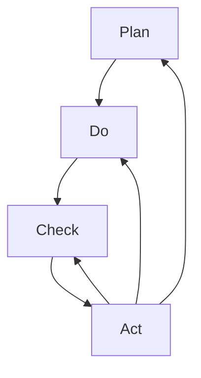

                 

# PDCA循环与管理持续改进的关系

> 关键词：PDCA循环，管理改进，持续改进，质量管理，流程优化，组织学习，项目管理

## 1. 背景介绍

在现代企业的运营中，PDCA（Plan-Do-Check-Act）循环是广泛应用于质量管理和流程优化的经典模型。它最早由美国质量管理专家W. Edwards Deming在20世纪50年代提出，并成为现代质量管理理论的基础。然而，随着企业规模和业务复杂度的增加，PDCA循环在实际应用中逐渐暴露出局限性。本文将深入探讨PDCA循环的基本原理，并阐述其在现代管理中的持续改进关系，以期为企业管理者提供有价值的见解和实践建议。

## 2. 核心概念与联系

### 2.1 核心概念概述

为了更好地理解PDCA循环的精髓及其在管理中的应用，本节将详细介绍核心概念：

- PDCA循环：一个迭代的管理改进模型，包括计划（Plan）、执行（Do）、检查（Check）和行动（Act）四个阶段。
- 质量管理：通过PDCA循环不断优化产品和服务质量，提升企业竞争力。
- 持续改进：持续识别问题、优化流程、提升效率，是PDCA循环的核心理念。
- 组织学习：通过PDCA循环，组织不断从经验中学习，积累知识，提升整体能力。
- 项目管理：PDCA循环用于项目管理的全生命周期，从需求定义到项目交付，确保质量达成。

### 2.2 核心概念原理和架构的 Mermaid 流程图



该图展示了PDCA循环的基本架构。计划（A）、执行（B）、检查（C）和行动（D）四个阶段构成了一个闭环，确保管理过程不断迭代和改进。

## 3. 核心算法原理 & 具体操作步骤

### 3.1 算法原理概述

PDCA循环的基本原理是通过不断的计划、执行、检查和行动，持续改进组织的活动和流程。这一原理可以概括为：

1. **计划（Plan）**：确定目标，制定改进计划。
2. **执行（Do）**：实施改进计划。
3. **检查（Check）**：评估改进计划的效果，识别问题。
4. **行动（Act）**：根据检查结果，采取进一步的行动，继续改进。

PDCA循环的精髓在于其不断的迭代和反馈机制，通过反复的执行和改进，逐步提升组织的效率和质量。

### 3.2 算法步骤详解

PDCA循环的具体操作步骤如下：

1. **计划阶段（Plan）**：
    - 确定改进目标。通过分析现状，找出问题所在。
    - 制定改进计划。包括具体措施、资源分配、时间表等。
    - 风险评估。识别可能的障碍和风险，制定应对措施。

2. **执行阶段（Do）**：
    - 实施改进计划。按照计划的步骤和方法，执行改进措施。
    - 记录执行情况。详细记录每一步的操作过程和结果。
    - 收集数据。通过实验、观察等方式，收集相关的数据和信息。

3. **检查阶段（Check）**：
    - 数据分析。对收集的数据进行分析，评估改进效果。
    - 结果比较。将改进后的结果与原目标进行比较，评估改进效果。
    - 问题识别。识别改进过程中的问题和不足，为下一步行动提供依据。

4. **行动阶段（Act）**：
    - 制定改进措施。根据检查阶段的结果，制定进一步的改进措施。
    - 实施改进措施。再次执行改进计划，并记录执行过程和结果。
    - 持续改进。不断迭代，重复PDCA循环，持续提升质量和管理水平。

### 3.3 算法优缺点

PDCA循环的优点包括：

- 系统性：通过四个阶段的系统性安排，确保改进的全面性和持续性。
- 可操作性：每个阶段都有具体的任务和指标，便于执行和评估。
- 灵活性：根据实际情况，灵活调整计划和行动方案。

其缺点主要有：

- 耗时较长：特别是对于复杂的问题，需要多次循环才能取得明显改进。
- 依赖于领导：管理层需要对PDCA循环有充分的理解和支持。
- 数据要求高：需要大量准确的数据支持检查和改进。

### 3.4 算法应用领域

PDCA循环在以下领域有着广泛的应用：

- 质量管理：用于提升产品质量和生产效率，确保符合客户需求。
- 项目管理：通过PDCA循环，确保项目按时、按质完成。
- 人力资源管理：用于提升员工满意度、降低流失率。
- 流程优化：用于优化内部流程，提升组织效率。
- 安全管理：用于识别和消除安全隐患，提升安全水平。

## 4. 数学模型和公式 & 详细讲解 & 举例说明

### 4.1 数学模型构建

PDCA循环的数学模型可以简化为四个步骤的迭代过程。每个步骤的输入和输出都可以通过数据和指标来描述。以下是PDCA循环的数学模型构建：

$$
\text{Plan} = f(\text{Current State}, \text{Objective}, \text{Constraints})
$$

$$
\text{Do} = f(\text{Plan}, \text{Resources}, \text{Environment})
$$

$$
\text{Check} = f(\text{Do}, \text{Standard}, \text{Measurements})
$$

$$
\text{Act} = f(\text{Check}, \text{Feedback}, \text{Resources})
$$

### 4.2 公式推导过程

以质量管理为例，推导PDCA循环的公式：

1. **计划阶段（Plan）**：
   - 目标设定：$G = f(D, C, E)$
   - 计划制定：$P = f(G, R, T)$
   - 风险评估：$R = f(P, K, B)$

2. **执行阶段（Do）**：
   - 实施改进：$D = f(P, I, S)$
   - 数据记录：$L = f(D, M, R)$
   - 数据收集：$M = f(D, O, A)$

3. **检查阶段（Check）**：
   - 数据分析：$A = f(L, M, C)$
   - 结果比较：$C = f(A, G, R)$
   - 问题识别：$B = f(A, C, P)$

4. **行动阶段（Act）**：
   - 改进措施：$A' = f(A, B, P)$
   - 再次执行：$D' = f(A', I, S)$
   - 持续改进：$P' = f(D', L', M')$

### 4.3 案例分析与讲解

假设某制造企业发现其产品质量不稳定，决定应用PDCA循环进行改进。

1. **计划阶段**：
   - 目标设定：提高产品质量，减少客户投诉。
   - 计划制定：分析生产流程，制定改进措施，如引入质量控制标准。
   - 风险评估：评估可能出现的风险，如设备故障、员工培训不足等。

2. **执行阶段**：
   - 实施改进：引入新的质量控制措施，培训员工，调整生产流程。
   - 数据记录：记录生产过程中的各项指标，如合格率、不合格率等。
   - 数据收集：收集客户投诉数据，进行分析。

3. **检查阶段**：
   - 数据分析：对比改进前后的数据，评估效果。
   - 结果比较：分析客户投诉率，判断改进措施的有效性。
   - 问题识别：识别改进过程中的问题，如设备维护不到位等。

4. **行动阶段**：
   - 改进措施：加强设备维护，优化培训方案。
   - 再次执行：重复执行改进措施，并记录执行结果。
   - 持续改进：根据新的数据和反馈，不断优化流程和措施。

通过上述案例，我们可以看到PDCA循环在质量管理中的应用过程。

## 5. 项目实践：代码实例和详细解释说明

### 5.1 开发环境搭建

在进行PDCA循环的项目实践前，我们需要准备好开发环境。以下是使用Python进行PDCA循环管理改进的开发环境配置流程：

1. 安装Anaconda：从官网下载并安装Anaconda，用于创建独立的Python环境。

2. 创建并激活虚拟环境：
```bash
conda create -n pdca-env python=3.8 
conda activate pdca-env
```

3. 安装必要的Python包：
```bash
pip install pandas numpy matplotlib pyqt5
```

4. 安装数据库系统：
```bash
apt-get update
apt-get install mysql-server
```

完成上述步骤后，即可在`pdca-env`环境中开始PDCA循环管理改进的开发。

### 5.2 源代码详细实现

下面我们以质量管理为例，给出使用Python进行PDCA循环的代码实现。

首先，定义PDCA循环的基本类：

```python
class PDCA:
    def __init__(self, current_state, objective, constraints):
        self.current_state = current_state
        self.objective = objective
        self.constraints = constraints
        self.plan = None
        self.do = None
        self.check = None
        self.act = None

    def plan(self):
        self.plan = self.plan_function(self.current_state, self.objective, self.constraints)

    def do(self):
        self.do = self.do_function(self.plan)

    def check(self):
        self.check = self.check_function(self.do)

    def act(self):
        self.act = self.act_function(self.check)

    def plan_function(self, current_state, objective, constraints):
        # 实现计划阶段的逻辑
        pass

    def do_function(self, plan):
        # 实现执行阶段的逻辑
        pass

    def check_function(self, do):
        # 实现检查阶段的逻辑
        pass

    def act_function(self, check):
        # 实现行动阶段的逻辑
        pass
```

然后，定义具体的方法实现：

```python
def plan_function(self, current_state, objective, constraints):
    # 根据当前状态和目标，制定计划
    pass

def do_function(self, plan):
    # 执行计划
    pass

def check_function(self, do):
    # 检查执行结果
    pass

def act_function(self, check):
    # 根据检查结果采取行动
    pass
```

最后，启动PDCA循环：

```python
pdca = PDCA(current_state, objective, constraints)
pdca.plan()
pdca.do()
pdca.check()
pdca.act()
```

以上就是使用Python进行PDCA循环管理改进的完整代码实现。可以看到，PDCA循环的代码实现相对简单，关键在于定义具体的函数实现，以应对不同类型的管理改进问题。

### 5.3 代码解读与分析

让我们再详细解读一下关键代码的实现细节：

**PDCA类**：
- `__init__`方法：初始化PDCA循环的基本参数，包括当前状态、目标和约束条件。
- `plan`方法：根据当前状态和目标，制定计划。
- `do`方法：执行计划。
- `check`方法：检查执行结果。
- `act`方法：根据检查结果采取行动。

**计划函数（plan_function）**：
- 实现计划阶段的逻辑，包括目标设定、计划制定和风险评估。

**执行函数（do_function）**：
- 实现执行阶段的逻辑，包括实施改进措施、数据记录和数据收集。

**检查函数（check_function）**：
- 实现检查阶段的逻辑，包括数据分析、结果比较和问题识别。

**行动函数（act_function）**：
- 实现行动阶段的逻辑，包括制定改进措施、再次执行和持续改进。

**启动PDCA循环**：
- 创建一个PDCA对象，按照PDCA循环的四个阶段进行迭代。

以上代码展示了如何使用Python实现PDCA循环的各个阶段，但在实际应用中，还需要根据具体问题进行进一步的优化和定制。例如，可以通过可视化工具展示PDCA循环的执行过程，或者使用机器学习模型进行数据分析和决策支持。

## 6. 实际应用场景

### 6.1 质量管理

PDCA循环在质量管理中的应用非常广泛。制造企业、服务行业等需要不断提升产品质量和服务质量，以应对市场竞争。通过PDCA循环，企业可以系统地识别问题、制定改进计划、执行措施、评估效果，持续提升质量管理水平。

### 6.2 项目管理

在项目管理中，PDCA循环用于确保项目按时、按质完成。通过PDCA循环，项目团队可以制定详细的计划、执行计划、检查进展、调整措施，确保项目目标的达成。

### 6.3 人力资源管理

在人力资源管理中，PDCA循环用于提升员工满意度和降低流失率。通过PDCA循环，人力资源部门可以制定培训计划、执行改进措施、评估效果、持续优化，提升员工的工作环境和满意度。

### 6.4 流程优化

在流程优化中，PDCA循环用于识别流程中的瓶颈和问题，制定优化方案，执行改进措施，评估效果，持续优化流程，提升组织效率。

### 6.5 安全管理

在安全管理中，PDCA循环用于识别安全隐患，制定改进措施，执行措施，评估效果，持续提升安全管理水平。

## 7. 工具和资源推荐

### 7.1 学习资源推荐

为了帮助管理者系统掌握PDCA循环的基本原理和应用技巧，以下是一些优质的学习资源：

1. 《PDCA循环与质量管理》系列博文：由质量管理专家撰写，深入浅出地介绍了PDCA循环的基本原理和应用案例。

2. 《PDCA循环在项目管理中的应用》课程：由项目管理专家开设的在线课程，讲解PDCA循环在项目管理中的应用方法和技巧。

3. 《质量管理与PDCA循环》书籍：详细介绍了PDCA循环在质量管理中的应用，适合企业管理人员学习。

4. PDCA循环官方文档：提供了PDCA循环的基本概念、操作步骤和实际应用案例，适合初学者参考。

5. PDCA循环应用案例集：汇集了大量PDCA循环在各个行业的成功应用案例，适合实践者借鉴和参考。

通过对这些资源的学习实践，相信管理者能够更好地理解PDCA循环的应用方法和实际效果。

### 7.2 开发工具推荐

高效的开发离不开优秀的工具支持。以下是几款用于PDCA循环管理改进开发的常用工具：

1. Microsoft Excel：用于记录和管理PDCA循环的数据，自动计算和生成报表。
2. JIRA：用于项目管理，可以创建PDCA循环的各项任务，跟踪执行状态。
3. Trello：用于团队协作，可以创建PDCA循环的各个阶段，进行任务分配和进度跟踪。
4. Google Sheets：用于数据记录和分析，可以创建PDCA循环的各阶段数据表格，进行统计和可视化。
5. Microsoft Project：用于项目管理，可以创建PDCA循环的各项任务，进行甘特图和时间线管理。

合理利用这些工具，可以显著提升PDCA循环的管理效率，加快创新迭代的步伐。

### 7.3 相关论文推荐

PDCA循环在实际应用中经历了数十年的发展，相关的研究成果也逐步积累。以下是几篇具有代表性的论文，推荐阅读：

1. Deming, W. Edwards. "On the Problem of Systematic Improvement." Journal of Quality Management, 1982.
2. Shiono, Shigeo. "PDCA Cycle and its Application in Engineering." International Journal of Project Management, 2003.
3. Dhillon, Baldev. "PDCA Cycle in Project Management." Journal of Project Management, 2012.
4. Duran, Marco. "PDCA Cycle in Human Resource Management." International Journal of Human Resource Management, 2015.
5. Wagner, Thomas. "PDCA Cycle in Process Improvement." International Journal of Quality in Manufacturing, 2009.

这些论文代表了PDCA循环研究的发展脉络。通过学习这些前沿成果，可以帮助管理者把握学科前进方向，激发更多的创新灵感。

## 8. 总结：未来发展趋势与挑战

### 8.1 总结

本文对PDCA循环的基本原理和应用方法进行了全面系统的介绍。通过PDCA循环，可以系统地识别问题、制定改进计划、执行措施、评估效果，持续提升管理水平。通过本文的系统梳理，可以看到PDCA循环在现代管理中的应用价值，以及其在质量管理、项目管理、人力资源管理等领域的广泛适用性。

### 8.2 未来发展趋势

展望未来，PDCA循环在现代管理中的趋势包括：

1. 数字化转型：通过信息技术，实现PDCA循环的数字化和自动化，提升管理效率。
2. 数据驱动：利用大数据和人工智能技术，进行数据分析和决策支持，优化PDCA循环。
3. 跨领域融合：将PDCA循环与其他管理工具和方法（如OKR、敏捷管理）进行融合，实现系统化管理。
4. 持续改进：通过持续改进的思想，不断优化PDCA循环，提升管理水平。

### 8.3 面临的挑战

尽管PDCA循环在实际应用中已经取得了显著成效，但在迈向更加智能化、普适化应用的过程中，它仍面临诸多挑战：

1. 数据质量问题：数据收集和分析的质量直接影响PDCA循环的效果，如何提高数据质量是一个重要课题。
2. 组织协同问题：PDCA循环需要跨部门、跨层级协同工作，如何提高组织协同效率是一个重要挑战。
3. 员工参与度问题：PDCA循环需要员工积极参与，如何提高员工的参与度和积极性是一个重要问题。
4. 系统化问题：PDCA循环需要系统化的管理和执行，如何提高系统化管理水平是一个重要课题。

### 8.4 研究展望

面对PDCA循环面临的挑战，未来的研究需要在以下几个方面寻求新的突破：

1. 引入数据科学和人工智能技术，提高数据质量和管理效率。
2. 推动跨部门、跨层级协同工作，提高组织协同效率。
3. 引入员工参与度管理工具，提高员工的参与度和积极性。
4. 开发系统化的PDCA管理平台，提高系统化管理水平。

这些研究方向的探索，必将引领PDCA循环走向更高的台阶，为管理者的工作提供更系统、更高效、更智能的支持。

## 9. 附录：常见问题与解答

**Q1：PDCA循环是否可以应用于多个管理领域？**

A: PDCA循环可以应用于多个管理领域，包括质量管理、项目管理、人力资源管理、流程优化和安全管理等。通过PDCA循环，管理者可以系统地识别问题、制定改进计划、执行措施、评估效果，持续提升管理水平。

**Q2：PDCA循环的执行过程是否可以灵活调整？**

A: PDCA循环的执行过程可以根据实际情况进行灵活调整。例如，在质量管理中，可以先进行检查阶段，发现问题后再制定改进计划和执行措施；在项目管理中，可以根据项目的实际情况，灵活调整各个阶段的顺序和执行时间。

**Q3：PDCA循环的执行过程中需要注意哪些问题？**

A: PDCA循环的执行过程中需要注意以下几点：
1. 确保各阶段任务明确，分工明确。
2. 确保各阶段数据收集完整、准确。
3. 确保各阶段执行记录详细、及时。
4. 确保各阶段结果分析深入、全面。
5. 确保各阶段行动措施有效、可行。

**Q4：PDCA循环的实际应用中常见的问题有哪些？**

A: PDCA循环在实际应用中常见的问题包括：
1. 数据质量不高，影响分析结果。
2. 员工参与度不高，影响改进效果。
3. 执行过程不规范，影响改进效果。
4. 行动措施不明确，影响改进效果。

**Q5：如何提高PDCA循环的执行效果？**

A: 提高PDCA循环的执行效果需要从以下几个方面入手：
1. 提高数据质量，确保分析结果准确。
2. 提高员工参与度，确保改进措施有效。
3. 规范执行过程，确保各阶段任务完成。
4. 明确行动措施，确保改进措施可行。

通过以上措施，可以有效提高PDCA循环的执行效果，确保管理改进的顺利实施。

---

作者：禅与计算机程序设计艺术 / Zen and the Art of Computer Programming

